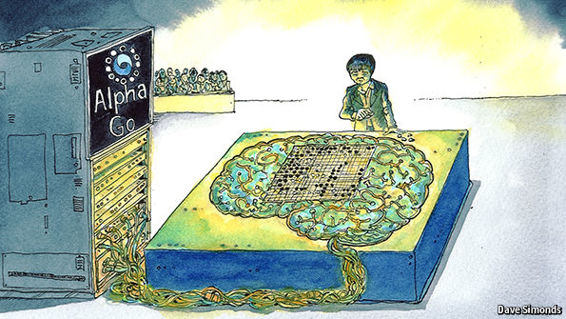

# 介绍

# 这本书是关于什么的

* * *

本书将介绍实现和理解自己的人工智能和机器学习库所需的基础知识。所有公式和概念将用 Matlab 和 Python 中的代码呈现。

## 人工智能和深度学习

* * *

如今，人工智能、机器学习和深度学习等术语使人们感到困惑不已。实际上，这些术语只是人工智能的一个子集。

## 什么是人工智能

* * *

研究如何创建能够智能行为的计算系统的学科领域。一些其他文本将其定义为智能代理的研究/设计。在这里，代理是一个系统（软件/硬件），它感知其环境并采取最大化成功机会的行动。

### 智能定义

对于本书的范围，智能代理是指能够最优地解决问题的代理，这意味着系统将自行确定最佳行动方案。

### 采取智能决策的方法

+   跟踪所有行动并检查它们是好还是坏，然后将新的行动与其中一个进行比较。

+   在采取行动之前，模拟所有可能的结果（是好是坏的行动），然后选择最不坏的。因此，你需要一个世界的抽象（模型），只需记住，世界的模型并不等同于世界。

关于人工智能的一个有趣事实是，一旦问题完全解决，它就不再被称为智能了……（即：让计算机下棋曾经是最高的智能展示，现在人们不再认为那样了）

## 历史

* * *

基本上，在人工智能的历史上，我们经历了一些令人惊讶/希望和失望的时期。

有趣的是，现在我们处于炒作/恐惧的混合状态

## 为什么现在

* * *

机器学习算法（甚至是深度算法）已经存在几十年了，为什么现在才有这个时髦的词汇？

基本上是由于计算能力的进步（通过 GPU、多核 CPU 系统和 FPGA）和数据的可用性（通过互联网上的大数据）。

此外，现在需要分类的数据量变得太大，无法手动处理，因此大公司谷歌、微软、Facebook 开始大力投资这一领域。

## 新的炒作

* * *

过去几年，2013/2016 年，人工智能（机器学习）以接近甚至有时优于人类的结果令人惊讶。例如：

+   语音和自然语言处理

+   人脸识别

+   图像分类，物体检测

+   驾驶汽车

+   玩复杂的游戏（阿尔法围棋）

+   控制策略（控制工程）

因此，基本上人们开始担心失去工作，一些人工智能服务器接管世界。

## 计算能力比较

在下面的表格中，我们向您展示了一些硬件平台的每秒可能操作数量和成本。

## 深度思维硬件

* * *

仅作说明，下面的图片是用于与世界上最好的围棋选手之一对弈的硬件。

