# 机器学习

# 介绍

* * *

机器学习就是利用你的计算机来“学习”如何处理

无需“编程”就能解决问题。（这是人工智能的一个分支）

我们获取一些数据，对该数据进行模型训练，并使用训练好的模型来

在新数据上做出预测。基本上是一种让计算机创建一个的方法

给出已知输入并后来给出智能输出的程序

输出到一个不同但相似的输入。

我们需要机器学习来解决一些难以手动编程的情况

分类/预测问题的可能变体

机器学习的基本思想是让计算机从数据中学到东西。机器学习有两种味道：

+   监督学习：你给计算机一些输入/输出对，这样在未来当新输入被呈现时，你就有了一个智能的输出。

+   无监督学习：你让计算机从数据本身学习，而不告诉它期望的输出是什么。


## 监督学习示例

* * *

1.  图像分类：你用图像/标签进行训练。然后在将来，当你提供一个新的图像时，期望计算机能够识别新对象（分类）。

1.  市场预测：你用历史市场数据训练计算机，并要求计算机预测未来的价格（回归）


## 无监督学习示例

* * *

1.  聚类：你让计算机将相似的数据分开成簇，这在研究和科学中至关重要。

1.  高维可视化：利用计算机帮助我们可视化高维数据。

1.  生成模型：当一个模型捕获了输入数据的概率分布后，它就能够生成更多的数据。这对于使你的分类器更加稳健非常有用。


## 特征

* * *

想象一下以下问题，你正在处理一个系统，应该对肿瘤是良性还是恶性进行分类，在最初的时候，你决定的唯一信息是肿瘤的大小。我们可以看到下面的训练数据分布。注意，特征（或特征）肿瘤大小似乎不是一个单独的良性或恶性肿瘤的良好指标。

## 

现在考虑我们向问题中添加一个特征（年龄）。


直觉是，通过增加与你想要分类的问题相关的更多特征，你将使你的系统更加稳健。像这样的复杂系统可能有上千个特征。你可能会问的一个问题是，我如何确定与我的问题相关的特征。还有哪种算法最适合处理无限数量的特征，例如支持向量机有数学技巧允许处理非常大量的特征。

## 训练

* * *

思路是提供一组输入及其预期输出，因此训练后我们将得到一个模型（假设），然后将新数据映射到训练的类别之一。


例如：想象一下，你提供一组图像和以下类别，鸭子或非鸭子，想法是在训练后，你可以从互联网上获取一幅鸭子的图像，模型应该说“鸭子”。


## 技巧包

有很多不同的机器学习算法，在本书中我们将更专注于神经网络，但没有一个单一最佳算法，一切取决于你需要解决的问题，可用的数据量。


## 基本配方

这是超级简单的配方（可能覆盖 50%），我们稍后会解释“如何”，但这给出了在处理机器学习问题时如何思考的一些提示。

+   首先检查你的模型在训练数据上表现如何，如果不好，让模型更复杂（更深或更多神经元）。

+   如果是，则在“测试”数据上进行测试，如果不是，你过拟合了，治愈过拟合的最可靠方法是获得更多数据（将测试数据放入训练数据中不算）

顺便说一句，最大的公共图像数据集（imagenet）对于 1000 类 imagenet 竞赛来说还不够大


## 下一章

在下一章中，我们将学习人工智能所需的线性代数基础知识。

# 线性代数

# 介绍

* * *

线性代数是一个非常重要的主题，很多深度学习算法都在使用它，因此本章将教授理解接下来内容所需的主题。

## 标量、向量和矩阵

* * *

+   标量：一个单一的数字

+   向量：一组数字的数组，其中每个元素由单个索引标识

+   矩阵：是一个数字的 2D 数组，下面是一个（2 行）X（3 列）矩阵。在矩阵中，一个单独的元素由两个索引而不是一个索引标识。


这里我们展示如何在 matlab 和 python（numpy）中创建它们


## 矩阵运算

这里我们将展示重要的操作。

### 转置

* * *

如果你有一幅图像（2D 矩阵）并与一个旋转矩阵相乘，你将得到一个旋转后的图像。现在如果你将这个旋转后的图像与旋转矩阵的转置相乘，图像将被“取消旋转”。

基本上，转置一个矩阵是交换它的行和列。或者围绕其主对角线旋转矩阵。


### 加法/减法

* * *

基本上，我们通过将每个元素与另一个元素相加来添加 2 个矩阵。两个矩阵需要具有相同的维度。


### 乘以标量

* * *

将矩阵的所有元素乘以一个标量


### 矩阵乘法

* * *

n×m 矩阵与 m×ℓ 矩阵的矩阵积是一个 n×ℓ 矩阵。矩阵积 AB 的（i，j）条目是矩阵 A 的第 i 行与矩阵 B 的第 j 列的点积。

第一个矩阵的列数必须与第二个矩阵的行数匹配。结果将是另一个矩阵或由第一个矩阵的行和第二个矩阵的列定义的标量。


基本上，操作是将第一个矩阵（k）的每一行与第二个矩阵（m）的每一列进行“点乘”。


一些例子


### 交换律

矩阵乘法不总是交换的 ，但两个向量的点积是交换的，。

## 矩阵的类型

* * *

有一些特殊的矩阵是有趣的。

+   单位矩阵：如果你用单位矩阵乘以一个矩阵 B，你将得到矩阵 B 作为结果，单位矩阵的对角线填满了 1，其余全部填满了 0。

+   逆：用于矩阵除法和解线性系统。


## 张量

* * *

有时我们需要用多于 2 个维度来组织信息，我们将 n 维数组称为张量。

例如，一个 1 维张量是一个向量，一个 2 维张量是一个矩阵，一个 3 维张量是一个立方体，一个 4 维张量是一个立方体的向量，一个 5 维张量是一个立方体的矩阵。


## 实际例子

在这里我们将展示如何使用矩阵乘法来实现线性分类器。现在不用担心线性分类器的作用是什么，只要注意我们使用线性代数来解决它即可。


将权重和偏置（偏置技巧）合并以解决线性分类问题作为单个矩阵乘法


在 Matlab


在 Python


## 下一章

下一章我们将学习线性分类。

# 有监督学习

# 介绍

* * *

在本章中，我们将学习有监督学习，同时稍微谈一下成本函数和梯度下降。我们还将学习两个简单的算法：

+   线性回归（用于回归）

+   逻辑回归（用于分类）

关于有监督学习的第一件事是，每个样本数据点 x 都有一个预期输出或标签 y，换句话说，你的训练由  对组成。

例如考虑下表：

| 尺寸（x） | 价格（y） |
| --- | --- |
| 2104 | 460 |
| 1416 | 232 |
| 1534 | 315 |
| 852 | 178 |

这个表（或训练集）显示了房屋尺寸以及它们的价格。所以一个尺寸为 2104 平方英尺的房子价格是 460 美元。

思路是我们可以使用这样的数据来创建能够从不同输入（即：尺寸）预测某种结果（即：价格）的模型。

### 线性回归

* * *

回归是关于从某些输入返回连续的标量数的。我们将学习的模型或假设将按线性规则预测一个值。然而，有时一个线性模型不足以捕捉数据的潜在特性。


### 假设：

基本上，线性回归试图创建一条线，以适应训练数据，例如：


监督学习的整个思想是，我们尝试从我们的训练集中学习最佳参数（在这种情况下是 theta）。

### 成本函数

在我们讨论如何学习假设的参数（也称为权重）之前，我们需要知道如何评估我们当前的权重是否已经做得很好。执行这项工作的函数称为损失函数或成本函数。基本上它将返回一个介于 0（无误差）和无穷大（非常糟糕）之间的标量值。

这样一个函数的示例如下：


其中

+   m: 数据集中的项数（i）：数据集中的第 i 个元素 y：数据集中的标签（期望值）

这个特定的成本函数称为均方误差损失，实际上对于回归问题非常有用。

在训练过程中，我们希望通过不断改变 theta 参数来最小化我们的损失。这个特定函数的另一个好处是它是一个凸函数，因此保证不会有多于一个最小值，这也将是它的全局最小值。这使得我们更容易优化。

我们的任务是找到：


## 梯度下降

* * *

梯度下降是一种简单的算法，它会试图找到函数的局部最小值。我们使用梯度下降来最小化我们的损失函数。梯度下降的一个重要特征是，它往往会陷入它遇到的第一个局部最小值中。然而，并不能保证它找到的这个局部最小值是最好（全局）的。


梯度下降需要你想要最小化的函数的一阶导数。所以，如果我们想通过改变参数来最小化某个函数，你需要针对这些参数对这个函数进行求导。

需要注意的一点是，由于此算法将在训练集中的所有样本上执行，因此对于更大的数据集来说，它不会很好地扩展。

### 简单的例子

下面是一个简单的在 Matlab 中使用梯度下降来最小化以下函数的实现：


它相对于 x 的导数是：


找到我们的局部最小值出现的点的代码如下所示：

```
% Some tests on Gradient descent
%% Define parameters start at 3.5
x_old=3.5; alpha=0.01; precision=0.0001;

%% Define function
x_input = [-1:0.01:3.5];
f = @(x) x.⁴ - 3*x.³ + 2;
df = @(x) 4*x.³ - 9*x.²;
y_output = f(x_input);
plot(x_input, y_output);

%% Gradient descent algorithm
% Keep repeating until convergence
while 1
    % Evalulate gradients
    tmpDelta = x_old - alpha*(df(x_old));    
    % Check Convergence
    diffOldTmp = abs(tmpDelta - x_old);
    if diffOldTmp < precision
        break;
    end
    % Update parameters
    x_old = tmpDelta;     
end
fprintf('The local minimum is at %d\n', x_old); 
```

### 线性回归的梯度下降

为了使用梯度下降进行线性回归，你需要计算它的损失（均方误差）相对于它的参数的导数。

这个导数将会是：


## 逻辑回归

* * *

名字可能听起来让人困惑，但实际上 Logistic 回归只是关于分类的一切。例如，考虑下面的例子，我们想要对 2 类进行分类：x 和 o。现在我们的输出 y 将有两个可能的值 [0,1]。

通常情况下，如果我们有大量特征（例如超过 100 个特征），我们就不使用 Logistic 回归。


### 假设

我们的假设与线性回归几乎相同，然而区别在于现在我们使用一个函数来强制我们的输出给出 


其中

 是逻辑或 Sigmoid 函数，因此


这里的 Sigmoid 函数将一个标量数转换为介于 0 和 1 之间的概率。

## 分类的成本函数

处理分类问题时，我们应该使用不同的成本/损失函数。用于分类的一个好选择是交叉熵成本函数。顺便说一句，通过使用最大似然估计方法可以找到这个函数。

交叉熵成本函数是：


再次，我们的目标是找到最小化这个函数的最佳参数 theta，因此为了使用梯度下降，我们需要计算这个函数相对于 theta 的导数


值得注意的一个很酷的事情是，导数与线性回归的导数相同。

## 过拟合（方差）和欠拟合（偏差）

机器学习中训练的主要思想是让计算机学习训练集的潜在结构，而不仅仅是它所见到的具体训练集。如果它没有学习到潜在结构，而是只学习到了训练样本的结构，那么我们就说我们的模型过拟合了。

当我们的模型在训练集上有非常高的准确率（例如：99.99%），但在测试集上表现不佳（例如：60%）时，我们可以判断出现了过拟合。

当你的模型过于复杂相对于可用数据时，或者你没有足够的数据来捕捉潜在的数据模式时，基本上就会发生这种情况。

这个问题的相反称为欠拟合，基本上是指当你的模型过于简单而无法捕捉训练集中给定的概念时发生的。

这些问题的一些图形示例如下：

**左侧：** 欠拟合

**中间：** 完美

**右侧：** 过拟合


### 解决过拟合

+   获取更多数据

+   使用正则化

+   检查其他模型架构

### 解决欠拟合

+   添加更多层或更多参数

+   检查其他架构

## 正则化

* * *

这是一种通过强制假设参数具有良好小值并迫使模型使用所有可用参数来帮助过拟合的方法。要使用正则化，你只需在训练过程中向你的成本/损失函数中添加一个额外的项。下面我们有一个带有额外正则化项的均方误差损失函数的示例。


还有交叉熵损失函数的正则化版本


这个项基本上将通过将你的假设的所有参数相乘。

通常，我们不需要对我们假设的偏差项进行正则化。

在梯度下降期间，您还需要计算这些项的导数。

### 直觉

你可以想象，除了强制权重具有较低的值之外，正则化还将把“概念”分散到更多的权重上。当我们进行正则化时，可以通过以下方式来思考会发生什么。

对于我们的输入 x，我们可以有 2 个权重向量 w1 或 w2。当我们用我们的权重向量乘以我们的输入时，我们将得到每个输出的相同输出 1。然而，权重向量 w2 是更好的权重向量选择，因为它将查看我们的输入 x 的更多内容，而 w1 只查看 x 的一个值。


在实践中，这可能会降低我们训练集的性能，但会提高泛化性，从而在测试时提高性能。

## 非线性假设

* * *

有时候，我们的假设需要具有非线性项，以便能够预测更复杂的分类/回归问题。例如，我们可以使用具有二次项的逻辑回归来捕捉这种复杂性。正如前面提到的，这对于特征数量较多的情况不具备良好的可扩展性。


例如，如果我们想要使用逻辑回归对一个 100x100 的灰度图像进行分类，我们将需要 5000 万个参数来包括二次项。使用这么多特征进行训练将至少需要 10 倍的图像（5 亿）。此外，计算成本将非常高。

在接下来的章节中，我们将学习其他更适合具有更多特征的算法。

## 局部最小值

* * *

当我们增加模型的参数数量时，我们的损失函数将开始找到多个局部最小值。这对于训练来说可能是一个问题，因为梯度下降可能会陷入其中一个最小值中。


实际上，一些最近的论文还试图证明今天使用的某些方法（例如：深度神经网络）的局部最小值实际上非常接近全局最小值，因此您不需要关心使用凸损失或者陷入局部最小值的问题。


# 神经网络

# 介绍

* * *

一族模型，其灵感来源于大脑，用于近似取决于大量输入的函数。（是一个非常好的模式识别模型）。

神经网络是非线性假设的示例，模型可以学习分类更复杂的关系。而且它对于具有大量特征的情况比逻辑回归更具可扩展性。

它由人工神经元形成，其中这些神经元被组织成层。我们有 3 种类型的层：

+   输入层

+   隐藏层

+   输出层

我们从隐藏层数量以及它们的连接方式来对神经网络进行分类，例如上面的网络有 2 个隐藏层。此外，如果神经网络有/没有循环，我们可以将它们分类为循环或前馈神经网络。

具有超过 2 个隐藏层的神经网络可以被认为是深度神经网络。使用更深层的神经网络的优势在于可以识别更复杂的模式。

## 

下面我们有一个两层前馈人工神经网络的示例。想象一下神经元之间的连接是训练期间将要学习的参数。在这个例子中，层 L1 将是输入层，L2/L3 是隐藏层，L4 是输出层。


### 大脑差异

* * *

现在，在你开始认为你可以创建一个巨大的神经网络并称之为强人工智能之前，请等一等，有一些要记住的要点：

列个清单：

+   人工神经元的激活方式与大脑完全不同

+   人类大脑有 1000 亿个神经元和 100 万亿个连接（突触），并且以 20 瓦的功率运行（足以点亮一个暗淡的灯泡）- 相比之下，最大的神经网络有 1000 万个神经元和 10 亿个连接，需要 16000 个 CPU（约 300 万瓦）

+   大脑仅限于来自 5 种感官的 5 种类型的输入数据。

+   孩子们并不是通过审阅 10 万张标有“牛”的图片和“非牛”的图片来学习什么是牛的，但这就是机器学习的工作原理。

+   或许我们并不是通过计算与我们最初概念相关的每个神经元的偏导数来学习。（顺便说一句，我们不知道我们是如何学习的）

### 真实神经元


## 人工神经元

* * *


单个人工神经元将对 w 和 x 进行点积，然后添加一个偏置，结果传递给一个激活函数，该函数将添加一些非线性。神经网络将由这些人工神经元组成。

非线性将允许学习同一类别的不同变化的不同版本。这与试图在单一权重集上学习同一类别的所有不同变化的线性分类器的行为不同。更多的神经元和更多的层总是更好的，但需要更多的数据来训练。

每一层从它的前一层学习一个概念。因此，拥有更深层的神经网络比拥有更宽的神经网络更好。（花了 20 年的时间才发现这一点）

## 激活函数

* * *

在神经元对其输入和权重执行点积后，它还会在这个结果上应用一个非线性。这个非线性函数称为激活函数。

在过去，激活函数的流行选择是 Sigmoid 和 tanh。最近观察到 ReLU 层对深度神经网络有更好的响应，这是由于一个称为梯度消失的问题。因此，您可以考虑只使用 ReLU 神经元。


## 简单网络的示例

考虑下面具有 1 个隐藏层、3 个输入神经元、3 个隐藏神经元和一个输出神经元的神经网络。


我们可以定义该网络将执行的所有操作如下。


这里  表示第 2 层（在本例中为隐藏层）第一个神经元的激活（输出）。第一层（输入层）可以被视为 ，它的值只是输入向量。

将每一层之间的连接视为参数矩阵。将这些矩阵视为层之间的连接。在这种情况下，我们有两个矩阵：

+   ：将第 1 层映射到第 2 层（输入层和隐藏层）

+   ：将第 2 层映射到第 2 层（隐藏层和输出层）

还要考虑  的维度，作为 [第 2 层的神经元数量] x [第 1 层的神经元数量 + 1]。换句话说：


其中：

：下一层的神经元数量

：当前层的神经元数量 + 1

注意，只有在我们考虑将偏置添加为权重矩阵的一部分时，这才成立，这可能因实现而异。

## 为什么比 logistic 回归更好

* * *

将神经网络视为一系列级联的 logistic 回归，其中每一层的输入是前一层的输出。另一种思考方式是，每一层学习了前一层输出的一个概念。


这很好，因为层不需要一次性学习整个概念，而实际上是构建了一个构建该知识的特征链。

## 向量化实现

* * *

你可以计算整个层的输出  作为矩阵乘法，然后是逐元素激活函数。这具有性能上的优势，考虑到你在使用像 Matlab、Numpy 这样的工具，或者如果你正在硬件上实现。

计算从开始（输入层）到结束（输出层）的每一层的输出与前一层的输出的机制被称为前向传播。


为了更好地理解，让我们将某些层的激活拆分如下：


因此，使用这些公式，你可以计算每一层的激活。

## 多类问题

* * *

在多类别分类问题中，你需要为每个类别分配一个神经元，然后在训练过程中，为每个期望的类别提供一个独热向量。这在某种程度上比 logistic 回归的一对一训练更容易。


## 成本函数（分类）

* * *

神经网络的成本函数，比 logistic 回归要复杂一些。因此，对于神经网络的分类，我们应该使用：


其中：

+   L：层数

+   m：数据集大小

+   K：类别数

+   ：第 l 层的神经元数量（不包括偏置）

在训练期间，我们需要计算神经网络上每个参数的此成本函数的偏导数。实际上，我们需要计算的是：

+   损失本身（前向传播）

+   损失相对于每个参数的导数（反向传播）

## 反向传播

* * *

反向传播是一种有效的算法，可以帮助您计算神经网络每个参数的成本函数的导数。反向传播这个名字来自于现在我们从输出层向输入层方向开始计算所有神经元的错误。这些错误计算完成后，我们只需将它们与前向传播期间计算的激活相乘即可。


### 进行反向传播（矢量化）

正如前面提到的，反向传播将按照相反的顺序流动，从最后一层开始迭代。所以从输出层开始，我们计算输出层的错误。

最后一层的“误差值”简单地是最后一层中我们的实际结果与 y 中的正确输出的差异。


其中

+   ：训练的期望输出

+   ：网络输出/最后 L 层的激活

对于所有其他层（从最后一层之前的层到输入层）


其中

+   ：第 l 层的错误

+   ：激活函数的导数

+   ：第 l 层的预激活

+   .*：逐元素相乘

计算完所有误差（delta）之后，我们需要实际计算损失的导数，即每个相应神经元的误差与激活的乘积：


现在我们忽略正则化项。

### 完整算法

下面我们用伪代码描述整个过程


## 梯度检查

* * *

为了验证您的反向传播代码是否正确，我们可以使用其他算法来估计梯度，不幸的是，我们不能在实践中使用此算法，因为它会使训练变慢，但我们可以用它来比较其结果与反向传播。基本上，我们将通过分别对每个参数添加一个小扰动（即：）来数值计算损失相对于每个参数的导数。


实际上，您将比较此梯度与反向传播的输出！[](d94e9f68.png)。

再次说明，这将非常缓慢，因为我们需要为每个参数计算两次带有此小扰动的损失。

例如，假设您有 3 个参数！[](75a959e9.png)


## 权重初始化

* * *

初始化网络参数的方式也很重要，例如你不能将所有权重初始化为零，通常你希望将它们初始化为在范围  内的小随机值，但同时也要考虑到你不希望在层之间具有某种随机值的对称性。

```
Theta1 = rand(10,11) * (2 * INIT_EPSILON) - INIT_EPSILON;
Theta2 = rand(10,11) * (2 * INIT_EPSILON) - INIT_EPSILON;
Theta3 = rand(1,11) * (2 * INIT_EPSILON) - INIT_EPSILON; 
```

从上面的代码中可以看出，我们独立为每一层创建随机数，而且它们都在范围内 

## 训练步骤

* * *

现在只需列出训练神经网络所需的步骤。在这里我们提到时期这个术语，它意味着对你的训练集中的所有元素进行完整的遍历。实际上，你一遍又一遍地重复你的训练集，因为权重不会在一个时期内完全学会一个概念。

1.  随机初始化权重

1.  对于每个时期

1.  进行正向传播

1.  计算损失

1.  进行反向传播

1.  使用梯度下降更新权重（可选使用梯度检查来验证反向传播）

1.  转到步骤 2，直到完成所有时期

## 训练/验证/测试数据

* * *

一些创建用于训练假设模型的数据集的良好实践

1.  收集尽可能多的数据

1.  合并/洗牌所有这些数据

1.  将这个数据集分成训练（60%）/验证（20%）/测试（20%）集

1.  避免测试来自不同分布的训练/验证

1.  使用验证集来调整你的模型（层数/神经元数量）

1.  使用测试集检查整体性能

当我们说要使用验证集时，意味着我们将更改模型的参数，并检查哪一个在这个验证集上获得更好的结果，不要触摸你的训练集。如果你在测试集上的结果不好，请考虑获取更多数据，并验证你的训练/测试/验证是否来自相同的分布。

## 深度神经网络的影响

* * *

如前所述，拥有更深层次和更大规模的神经网络在识别性能方面总是更好的，但是更复杂的模型也会带来一些问题。

1.  更深层次和更复杂的神经网络，需要更多数据来训练（参数数量的 10 倍）

1.  过拟合可能会成为问题，因此进行正则化（Dropout、L2 正则化）

1.  预测时间将会增加。

## 神经网络作为计算图

* * *

为了计算反向传播，如果你开始将你的假设表示为计算图，那会更容易。另外，在接下来的章节中，我们将使用不同类型的层一起工作，所以为了简化开发，请将神经网络视为计算图。这个想法是，如果你为你的图的每个节点提供正向/反向实现，那么反向传播就会变得更容易。


# 线性分类

# 介绍

* * *

线性分类器根据特征的线性组合的值做出分类决策。想象一下，线性分类器将在其权重中合并定义特定类的所有特征。（就像将类别为汽车的所有样本合并在一起）

当问题是线性可分时，这种类型的分类器效果更好。


权重矩阵将为需要分类的每个类别具有一行，并且对于 x 的每个元素（特征）都具有一列。在上面的图片中，每一行都将由我们的权重矩阵中的一行表示。

### 权重和偏置的影响

* * *

改变权重的效果将改变线的角度，而改变偏置将使线左右移动

### 参数化方法

* * *

### 

思想是我们的假设/模型具有参数，这些参数将有助于将输入向量映射到特定类得分。参数模型有两个重要组成部分：

+   评分函数：是一个函数 ，将我们的原始输入向量映射到一个评分向量

+   损失函数：衡量我们当前权重集合将一些输入 x 映射到期望输出 y 的程度，损失函数在训练时使用。

在这种方法中，训练阶段将为我们找到一组参数，这些参数将改变假设/模型以将某些输入映射到某些输出类。

在训练阶段，即优化问题，权重 (W) 和偏置 (b) 是我们唯一可以改变的东西。


现在上面图表中一些重要的主题：

1.  输入图像 x 被拉伸为单维向量，这会丢失空间信息

1.  权重矩阵将为每个输入元素具有一列

1.  权重矩阵将为每个输出元素（在本例中为 3 个标签）的每个元素都有一行。

1.  偏置将为每个输出元素（在本例中为 3 个标签）的每个元素都有一行。

1.  损失函数将接收当前分数和其当前输入 X 的期望输出

将 W 的每一行视为针对指定类的一种模式匹配。每个类别的分数通过对输入向量 X 和该类别的特定行进行内积计算得出。例如：


### 在 Matlab 上的示例

* * *


下面的图像将权重重塑回图像，我们可以通过这个图像看到训练尝试将同一类的所有变体压缩在 W 的每一行上。（查看有 2 个头的马）


## 偏置技巧

* * *

一些学习库的实现会做一个技巧来将偏置视为权重矩阵的一部分，这种方法的优势在于我们可以通过单次矩阵乘法解决线性分类问题。


基本上，你需要在输入向量的末尾添加一行，并在 W 矩阵上连接一列。

## 输入和特征

* * *

输入向量有时被称为特征向量，是发送到分类器的输入数据。由于线性分类器不能处理非线性问题，因此工程师的责任是处理这些数据并以分类器可分离的形式呈现它。

最好的情况是你有很多特征，每个特征与所需输出具有高相关性，而它们之间的相关性很低

# 损失函数

# 介绍

* * *

正如之前提到的，损失/成本函数是数学函数，它将回答你的分类器在当前参数（权重和偏差）下工作得有多好。在监督学习中，选择正确的损失函数是至关重要的一步。

# 模型优化

# 模型优化

## 介绍

* * *

机器学习模型通过更新其参数（权重和偏差）来学习，朝着正确分类的方向。

## 学习模型的基本结构

* * *

在下面的图片中，我们将展示机器学习模型的基本组成部分


在这张图片上，我们可以发现以下组件

1.  训练数据集：基本上是一个包含您的训练数据的高速磁盘

1.  样本批次：一个由（X，Y）对组成的列表，包括输入和期望输出，例如 X 可以是一张图片，Y 是标签“猫”

1.  参数：由您的模型层使用的一组参数，将 X 映射到 Y

1.  模型：一组计算层，将输入 X 和权重 W 转换为一个得分（可能的 Y）

1.  损失函数：负责表明我们的分数距离理想响应 Y 有多远，损失函数的输出是一个标量。另一种方式也是考虑损失函数表明您当前的参数 W 有多糟糕。

## 我们将做什么？

* * *

基本上，我们需要一种算法来改变我们的权重和偏差，以便最小化我们的损失函数。

## 损失函数

* * *

你可以想象这里的损失函数就像一个有些山的地方，你的目标是找到它的低谷（最低）处。你唯一的工具是返回你的海拔高度（损失）的小玩意儿。你需要找出应该走哪个方向。


在这里我们还可以观察到两件事：

+   你有超过一个值（局部最小值）

+   取决于你降落在哪里，你可能会找到一个而不是另一个（权重初始化的重要性）

## 要采取哪个方向（梯度下降）

* * *

我们可以使用微积分来发现应该采取的方向，例如，如果我们遵循损失函数的导数，我们可以保证我们总是朝着下降的方向前进。这只需将当前的权重集减去该点处的损失函数的导数即可完成。


在多个维度上，我们有一个偏导数的向量，我们称之为梯度。

注意，我们将梯度乘以一个因子（步长，学习速率），通常是一个小值，例如：0.001

### 简单示例

为了说明梯度下降方法，让我们按照一维中的一个简单情况来进行。考虑初始权重（-1.5）


在 Matlab 上


我们可以观察到，在使用微积分找到损失函数的导数之后，我们只需要用当前权重评估它。之后，我们只需从当前权重中取得评估值。

## 学习率过大

* * *

使用大的学习率可以加速收敛，但也可能使梯度下降振荡并发散。


## 数值梯度

* * *

评估梯度的慢方法，但我们可以用它来验证我们的代码是否正确

## 小批量梯度下降

* * *


不是运行整个训练集来计算损失，然后进行梯度下降，我们可以分成小的（批量）部分来做。这导致类似的结果并且计算更快。通常，小批量大小取决于 GPU 内存。

如果你分析随时间衰减的损失，完全批量版本更少噪音但更难计算。

如果你的小批量大小变为 1，这意味着你为每个样本计算梯度下降。在这种情况下，我们有随机梯度下降。

这相对较少见，因为在实践中，由于矢量化代码优化，评估 100 个示例的梯度通常比 100 次评估一个示例的梯度更加高效。

## 学习速率对损失的影响

实际上人们做的是选择一个较高（但不是太高）的学习速率，然后随时间衰减。


这里有两种训练过程中随时间衰减学习率的方法：

每 x 个周期将学习速率（）减半

，其中 t 是时间，k 是衰减参数

，其中 t 是时间，k 是衰减参数

## 其他算法

梯度下降是进行模型优化的最简单的方法。在考虑模型优化时，还有一些不错的算法可以尝试：

+   随机梯度下降

+   具有动量的随机梯度下降（非常流行）

+   Nag

+   Adagrad

+   Adam（非常好，因为你不需要太在意学习速率）

+   rmsprop


## 下一章

现在我们需要一种方法来获取我们模型的梯度向量，下一章我们将讨论反向传播。

# 反向传播

# 反向传播

## 介绍

* * *

反向传播是一种计算模型中每个节点（例如：Convnet，神经网络）的偏导数的算法。这些偏导数将在模型的训练阶段中使用，其中损失函数说明了您与正确结果相差多少。这个错误是从模型输出向后传播到它的第一层。如果您将模型结构化为计算图，则反向传播更容易实现。


这里最重要的事情是如何计算每个块的前向传播及其梯度。实际上，大多数深度学习库的代码都是关于实现这些门的前向/后向代码。

## 基本块

一些基本块的示例包括加法、乘法、指数、最大值。我们所需要做的就是观察它们的前向和后向计算。

* * *


其他一些导数


注意我们输出了 2 个梯度，因为我们有 2 个输入... 还要注意我们需要将先前的输入保存在内存中。

## 链式法则

* * *

想象一下，你有一个输出 y，它是 g 的函数，而 g 是 f 的函数，而 f 是 x 的函数。如果你想知道 g 在 dx 上的微小变化（dg/dx），我们使用链式法则。链式法则是计算两个或更多函数组合的导数的公式。


链式法则是反向传播的主要工作，因此现在理解它很重要。在下面的图片中，我们有一个节点 f(x,y)，它计算具有两个输入 x、y 和输出 z 的某个函数。现在在右边，我们有这个相同的节点从某处（损失函数）接收一个梯度 dL/dz，这意味着。“L 会随着 z 的微小变化而改变多少”。由于节点有 2 个输入，它将有 2 个梯度。一个显示 L 如何随着 dx 的微小变化而变化，另一个显示 L 如何随着 dz 的微小变化而变化。

 为了计算梯度，我们需要输入的 dL/dz（dout），以及在该特定输入处的函数 f(x,y) 的导数，然后我们只需将它们相乘。同时，我们需要在前向传播期间保存的先前缓存的输入。

## 门的实现

* * *

下面观察 python 上乘法和加法门的实现


## 逐步示例

* * *

根据我们迄今所学，让我们计算一些图的偏导数

### 简单示例

这里有一个函数的图表 


1.  从输出节点 f 开始，并考虑 f 相对于某些标准的梯度为 1（dout）

1.  dq=(dout(1) * z)，这是 -4（输出将如何随着 q 的变化而变化）

1.  dz=(dout(1) * q)，这是 3（输出将如何随着 z 的变化而变化）

1.  总和门分配了它的输入梯度，所以 dx=-4，dy=-4（输出将如何随着 x，z 的变化而变化）

### 有 2 个输入的感知机

下面的图表表示一个简单的 2 输入、具有 sigmoid 激活的输出层的神经网络的前向传播。


1.  从输出节点开始，考虑到我们的误差(dout)是 1

1.  1/x 输入的梯度将是 -1/(1.37²)，-0.53

1.  增量节点不会改变其输入的梯度，因此它将是 (-0.53 * 1)，-0.53

1.  exp 节点的输入梯度将是 (exp(-1(缓存输入)) * -0.53)，-0.2

1.  负增益节点将是其输入梯度（-1 * -0.2），0.2

1.  总和节点将分配梯度，因此 dw2=0.2，并且总和节点也为 0.2

1.  总和节点再次分配梯度，因此再次为 0.2

1.  dw0 将是 (0.2 * -1)，-0.2

1.  dx0 将是 (0.2 * 2)。0.4

## 下一章

下一章我们将学习关于特征缩放的内容。

# 特征缩放

# 特征缩放

## 介绍

* * *

为了使梯度下降算法的生活更加轻松，可以在训练/测试阶段对数据应用一些技术。如果输入向量  中的特征不成比例，那么你的损失空间  将会在某种程度上被拉伸。这将使梯度下降的收敛更加困难，或者至少更慢。

在下面的示例中，你的输入 X 有 2 个特征（房屋大小和卧室数量）。问题是房屋大小特征范围为 0...2000，而卧室数量范围为 0...5。


## 数据中心化和归一化

* * *


下面我们将对我们的输入数据进行预处理，以解决以下问题：

+   数据未围绕零中心化

+   特征不成比例

考虑你的输入数据 ，其中 N 是你的输入数据样本数（批量大小），D 是维度（在前面的示例中，D 是 2，房屋大小，卧室数量）。

首先要做的是减去输入数据的均值，这将使数据的分散围绕零中心化


在预测阶段，通常会存储这个均值以便从测试样本中减去。在图像分类的情况下，通常会存储从训练集的一批图像创建的均值图像，或者每个通道的均值。

当你的数据围绕零中心化后，你可以通过将 X 除以它的标准差来使所有特征具有相同的范围。


再次，这个操作解决了我们的第一个问题，因为所有的特征将会有相似的范围。但是如果你知道你的特征具有相同的“重要性”，那么应该使用这个方法。例如，在图像分类的情况下，所有的像素都具有相同的范围 (0..255)，一个像素本身并没有比其他像素更重要，因此仅需进行均值减法就足够了。

## 常见错误：

* * *

关于预处理的一个重要观点是，任何预处理统计数据（例如数据均值）必须仅在训练数据上计算，然后应用于验证/测试数据。计算数据均值并从整个数据集中的每个图像中减去它，然后将数据分割成训练/验证/测试集是错误的。相反，均值必须仅在训练数据上计算，然后平均减去所有分割（训练/验证/测试）的数据。

## 下一章

下一章我们将学习神经网络。

# 模型初始化

# 模型初始化

## 介绍

* * *

在我们开始训练模型之前，我们应该学习的一个重要主题是权重初始化。糟糕的权重初始化可能导致“永不收敛的训练”或训练缓慢。

### 权重矩阵格式

* * *

正如前几章观察到的，权重矩阵具有以下格式：


将输出数量视为行数，将输入数量视为列数。您还可以考虑另一种格式：


这里作为列，作为行。

关键在于我们的权重将是一个关于和的二维矩阵函数

### 全部初始化为零

* * *

如果您将权重初始化为零，您的梯度下降将永远不会收敛


### 用小值初始化

* * *

更好的方法是用接近零的值（但不是零）初始化权重，即：0.01。


这里 randn 给出了均值为零，单位标准差的随机数据。是输入和输出的数量。0.01 项将保持随机权重较小且接近于零。


以前进行初始化的问题是输出的方差会随着输入数量的增加而增加。要解决这个问题，我们可以将随机项除以输入数量的平方根。


现在看来我们没有死神经元，这种方法的唯一问题是将其用于 Relu 神经元。


要解决这个问题，只需添加一个简单的（除以 2）项....


所以使用这种第二种形式来初始化 Relu 层。

## 批归一化层

* * *

在未来的章节中，我们将学习一种使您的模型对特定初始化更具弹性的技术。

## 下一章

* * *

下一章我们开始谈论卷积。

# 循环神经网络

# 循环神经网络

## 介绍

* * *

在以前的前向神经网络中，我们的输出是当前输入和一组权重之间的函数。在循环神经网络(RNN)中，先前的网络状态也会影响输出，因此循环神经网络也具有“时间概念”。这通过将层输出循环到其输入来实现。


换句话说，RNN 将是一个具有输入（输入向量）和上一个状态的函数。新状态将是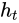。

递归函数在训练后将被固定，并用于每个时间步。

循环神经网络是回归的最佳模型，因为它考虑了过去的值。

RNN 是计算“图灵机”，这意味着，通过正确的权重集，它可以计算任何东西，想象这些权重就像一个程序。

只是为了不让你对 RNN 过于自信，没有自动的反向传播算法，可以找到这个“完美的权重集”。

下面是 RNN 循环函数的简单实现：（基础版本）


计算到下一个状态的代码如下：

```
def rnn_step_forward(x, prev_h, Wx, Wh, b):
  # We separate on steps to make the backpropagation easier
  #forward pass in steps
  # step 1
  xWx = np.dot(x, Wx)

  # step 2
  phWh = np.dot(prev_h,Wh)

  # step 3
  # total
  affine = xWx + phWh + b.T

  # step 4
  next_h = np.tanh(t)

  # Cache iputs, state, and weights
  # we are having prev_h.copy() since python params are pass by reference.
  cache = (x, prev_h.copy(), Wx, Wh, next_h, affine)

  return next_h, cache 
```

注意，在我们的 RNN 案例中，我们现在更感兴趣的是下一个状态， 而不是确切的输出，

在开始之前，让我们明确如何反向传播 tanh 块。


现在我们可以进行反向传播步骤（对于单个时间步）

```
def rnn_step_backward(dnext_h, cache):
    (x, prev_h, Wx, Wh, next_h, affine) = cache

    #backward in step
    # step 4
    # dt delta of total
    # Gradient of tanh times dnext_h
    dt = (1 - np.square(np.tanh(affine))) * (dnext_h)

    # step 3
    # Gradient of sum block
    dxWx = dt
    dphWh = dt
    db = np.sum(dt, axis=0)

    # step 2
    # Gradient of the mul block
    dWh = prev_h.T.dot(dphWh)
    dprev_h = Wh.dot(dphWh.T).T

    # step 1
    # Gradient of the mul block
    dx = dxWx.dot(Wx.T)
    dWx = x.T.dot(dxWx)

    return dx, dprev_h, dWx, dWh, db 
```

需要注意的一点是，相同的函数 和相同的参数集将应用于每个时间步。


RNN 状态的良好初始化为零。再次强调，这只是初始 RNN 状态，而不是其权重。

RNN 中的这种循环特性一开始可能会让人困惑，但实际上你可以将其看作是一个正常的神经网络多次重复（展开）。你展开的次数可以被认为是网络将记住多久以前的内容。换句话说，每次都是一个时间步。

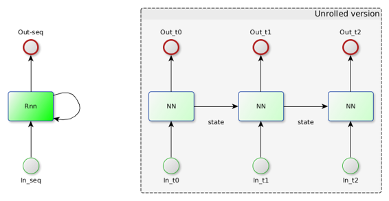

### 每个时间步上的前向和后向传播

从前面的例子中，我们仅为一个时间步呈现了前向和反向传播的代码。如前所述，RNN 被展开到每个时间步（有限）。现在我们展示如何为每个时间步进行前向传播。

```
def rnn_forward(x, h0, Wx, Wh, b):
  """
  Run a vanilla RNN forward on an entire sequence of data. We assume an input
  sequence composed of T vectors, each of dimension D. The RNN uses a hidden
  size of H, and we work over a minibatch containing N sequences. After running
  the RNN forward, we return the hidden states for all timesteps.

  Inputs:
  - x: Input data for the entire timeseries, of shape (N, T, D).
  - h0: Initial hidden state, of shape (N, H)
  - Wx: Weight matrix for input-to-hidden connections, of shape (D, H)
  - Wh: Weight matrix for hidden-to-hidden connections, of shape (H, H)
  - b: Biases of shape (H,)

  Returns a tuple of:
  - h: Hidden states for the entire timeseries, of shape (N, T, H).
  - cache: Values needed in the backward pass
  """

  # Get shapes
  N, T, D = x.shape
  # Initialization
  h, cache = None, None
  H = h0.shape[1]
  h = np.zeros((N,T,H))

  # keeping the inital value in the last element
  # it will be overwritten
  h[:,-1,:] = h0
  cache = []

  # For each time-step
  for t in xrange(T):
    h[:,t,:], cache_step = rnn_step_forward(x[:,t,:], h[:,t-1,:], Wx, Wh, b)
    cache.append(cache_step)

  # Return current state and cache
  return h, cache 
```

```
def rnn_backward(dh, cache):
  """
  Compute the backward pass for a vanilla RNN over an entire sequence of data.

  Inputs:
  - dh: Upstream gradients of all hidden states, of shape (N, T, H)

  Returns a tuple of:
  - dx: Gradient of inputs, of shape (N, T, D)
  - dh0: Gradient of initial hidden state, of shape (N, H)
  - dWx: Gradient of input-to-hidden weights, of shape (D, H)
  - dWh: Gradient of hidden-to-hidden weights, of shape (H, H)
  - db: Gradient of biases, of shape (H,)
  """
  dx, dh0, dWx, dWh, db = None, None, None, None, None
  # Get shapes
  N,T,H = dh.shape
  D = cache[0][0].shape[1] # D taken from x in cache

  # Initialization keeping the gradients with the same shape it's respective inputs/weights
  dx, dprev_h = np.zeros((N, T, D)),np.zeros((N, H))
  dWx, dWh, db = np.zeros((D, H)), np.zeros((H, H)), np.zeros((H,))
  dh = dh.copy()

  # For each time-step
  for t in reversed(xrange(T)):
    dh[:,t,:]  += dprev_h # updating the previous layer dh
    dx_, dprev_h, dWx_, dWh_, db_ = rnn_step_backward(dh[:,t,:], cache[t])
    # Observe that we sum each time-step gradient
    dx[:,t,:] += dx_
    dWx += dWx_
    dWh += dWh_
    db += db_

  dh0 = dprev_h

  return dx, dh0, dWx, dWh, db 
```

下面我们展示了一个图表，展示了与前向网络相比，您可以使用递归神经网络的多种方式。将红色块视为输入，蓝色块视为输出。


+   一对一：正常的前向网络，即：输入为图像，输出为标签

+   一对多（RNN）：（图像字幕）输入为图像，输出为描述场景的单词（CNN 检测到的区域 + RNN）

+   多对一（RNN）：（情感分析）输入为短语中的单词，输出为情感（好/坏）产品。

+   多对多（RNN）：（翻译）输入为英语短语中的单词，输出为葡萄牙语。

+   多对多（RNN）：（视��分类）视频输入，视频描述输出。

### 堆叠 RNN

* * *

下面我们描述如何为 RNN 添加“深度”，以及如何展开 RNN 以处理时间。

注意，RNN 的输出被馈送到更深层，而状态被馈送以处理过去的状态。


### 简单的回归示例

这里我们展示了一个简单的案例，我们希望 RNN 完成单词，我们向网络提供字符 h,e,l,l，我们的词汇表是[h,e,l,o]。请注意，在我们输入第一个'h'后，网络想要输出错误答案（正确答案在绿色上），但接近末尾，在第二个'l'后，它想要输出正确答案'o'。在这里，字符的顺序确实很重要。


### 描述图像

* * *

如果将卷积神经网络与预训练的 RNN 连接起来。RNN 将能够描述它在图像上“看到”的内容。


基本上我们得到一个预训练的 CNN（例如：VGG），连接到倒数第二个全连接层，然后连接到一个 RNN。之后你可以端对端地训练整个模型。


### 长短期记忆网络（LSTM）

* * *

LSTM 提供了一个不同的循环公式 ，它比普通 RNN 更强大，因为它的复杂性  会将“残余信息”添加到下一个状态，而不仅仅是转换每个状态。想象一下 LSTM 是 RNN 的“残余”版本。

换句话说，LSTM 比普通 RNN 更少受到梯度消失的影响。记住加法门会分配梯度。

因此，由于梯度消失的问题较少，LSTM 可以记住更多的过去信息。所以从现在开始，当你考虑 RNN 时只使用 LSTM。


从下面的动画中观察 RNN 上的梯度消失与 LSTM 相比是多么快。


梯度消失问题可以通过 LSTM 解决，但所有循环神经网络可能遇到的另一个问题是梯度爆炸问题。

要解决梯度爆炸问题，人们通常会进行梯度裁剪，这将只允许最大梯度值。

这个用于梯度传递的通道被称为细胞状态，因此与只有状态流动的 RNN 相比，LSTM 有状态和细胞状态的区别。


### LSTM 门

对 LSTM 门进行放大。这也改善了反向传播的方法。


用于一个时间步的 LSTM 前向传播的代码

```
def lstm_step_forward(x, prev_h, prev_c, Wx, Wh, b):
  N,H = prev_c.shape

  #forward pass in steps
  # step 1: calculate activation vector
  a = np.dot(x, Wx) + np.dot(prev_h,Wh) + b.T

  # step 2: input gate
  a_i = sigmoid(a[:,0:H])

  # step 3: forget gate
  a_f = sigmoid(a[:,H:2*H])

  # step 4: output gate
  a_o = sigmoid(a[:,2*H:3*H])

  # step 5: block input gate
  a_g= np.tanh(a[:,3*H:4*H])

  # step 6: next cell state
  next_c = a_f * prev_c +  a_i * a_g

  # step 7: next hidden state
  next_h = a_o * np.tanh(next_c)

  # we are having *.copy() since python params are pass by reference.
  cache = (x, prev_h.copy(), prev_c.copy(), a, a_i, a_f, a_o, a_g, next_h, next_c, Wx, Wh)

  return next_h, next_c, cache 
```

现在是一个时间步的反向传播

```
def lstm_step_backward(dnext_h, dnext_c, cache):
  (x, prev_h, prev_c, a, a_i, a_f, a_o, a_g, next_h, next_c, Wx, Wh) = cache
  N,H = dnext_h.shape
  da = np.zeros(a.shape)

  # step 7:
  dnext_c = dnext_c.copy()
  dnext_c += dnext_h * a_o * (1 - np.tanh(next_c) ** 2)
  da_o = np.tanh(next_c) * dnext_h

  # step 6:
  da_f    = dnext_c * prev_c
  dprev_c = dnext_c * a_f
  da_i    = dnext_c * a_g
  da_g    = dnext_c * a_i

  # step 5:
  da[:,3*H:4*H] = (1 - np.square(a_g)) * da_g

  # step 4:
  da[:,2*H:3*H] = (1 - a_o) * a_o * da_o

  # step 3:
  da[:,H:2*H] = (1 - a_f) * a_f * da_f

  # step 2:
  da[:,0:H] = (1 - a_i) * a_i * da_i

  # step 1:
  db = np.sum(da, axis=0)
  dx = da.dot(Wx.T)
  dWx = x.T.dot(da)
  dprev_h = da.dot(Wh.T)
  dWh = prev_h.T.dot(da)

  return dx, dprev_h, dprev_c, dWx, dWh, db 
```

# 深度学习

# 介绍

* * *


深度学习是基于一组算法的机器学习分支，这些算法学习表示数据。下面我们列出最流行的算法。

+   卷积神经网络

+   深度信念网络

+   深度自动编码器

+   循环神经网络（LSTM）

深度学习的一个承诺是它们将取代手工制作的特征提取。其想法是它们将“学习”表示给定数据所需的最佳特征。


## 层层叠加

* * *

深度学习模型由多个层组成。在人工神经网络的背景下，具有超过 2 个隐藏层的多层感知器（MLP）已经是一个深度模型。

作为一个经验法则，深度模型的表现会比浅层模型更好，问题在于你深入的层数越多，你就需要更多的数据来避免过拟合。


## 层类型

这里列出了一些最常用的层

1.  卷积层

1.  池化层

1.  丢弃层

1.  批量归一化层

1.  全连接层

1.  Relu、Tanh、sigmoid 层

1.  Softmax、交叉熵、SVM、欧几里得（损失层）

## 避免过拟合

* * *

除了获取更多数据，还有一些用于对抗过拟合的技术，以下是最常见的一些：

+   辍学

+   正规化

+   数据增强

### 辍学

这是一种在训练期间随机关闭一些全连接层神经元的技术。


辍学强制全连接层以不同的方式学习相同的概念

### 正规化

dasdaasdasadasdad

### 数据增强

通过对输入数据应用一些变换来合成新的训练样本。例如翻转图像。在 Imagenet 比赛中，Alex Krizhevesky（Alexnet）使用了 2048 倍的数据增强，其中每个 Imagenet 类别有 1000 个元素。


## 自动分层表示

思想是让学习算法从输入到更深层逐层找到最佳表示。

浅层学习以更简单的形式表示数据，最深层学习以从前一层学到的概念表示数据。


## 老 vs 新

* * *

实际上，唯一的新东西是使用某种东西自动学习如何表示数据（特征选择），并基于给定的数据集。不是说 SVM 或决策树不好，事实上有些人在深度神经网络的最后使用 SVM 来进行分类。

唯一的问题是特征选择可以很容易地适应新数据。

这样做的最大优势是，如果您的问题变得更加复杂，您只需使您的模型变得更加“深入”，并获得更多（大量）数据来训练您的新问题。

## 深度学习中的一些人

* * *


## 下一章

下一章我们将学习卷积神经网络。

# 卷积

# 卷积

## 介绍

* * *

卷积是一种数学运算，对两个函数（信号）的积进行积分，其中一个信号被翻转。例如，下面我们对两个信号 f(t) 和 g(t) 进行卷积。


所以要做的第一件事是翻转（180 度）信号 g，然后将翻转的 g 滑动到 f 上，乘以并累积所有它的值。

对信号进行卷积的顺序对最终结果没有影响，因此 conv(a,b)==conv(b,a)

在这种情况下，考虑到蓝色信号  是我们的输入信号，  是我们的卷积核，当您使用卷积来过滤信号时，术语卷积核就会被使用。

### 输出信号大小 1D

1 维卷积的情况下，输出大小的计算方法如下：


## 卷积的应用

人们在信号处理中使用卷积的用例如下

+   过滤信号（1 维音频，2 维图像处理）

+   检查一个信号与另一个信号的相关性有多大

+   在信号中找到模式

### Matlab 和 Python（numpy）的简单示例

下面我们将信号 x = (0,1,2,3,4) 与 w = (1,-1,2) 进行卷积。


### 手动操作

为了更好地理解卷积的概念，让我们手动做上面的例子。基本上我们将对 2 个信号 (x, w) 进行卷积。第一件事是水平翻转 W（或向左旋转 180 度）


之后我们需要将翻转的 W 滑动到输入 X 上


注意到在步骤 3、4、5 中，翻转的窗口完全位于输入信号内。这些结果被称为“有效”。当翻转的窗口没有完全位于输入窗口(X)内时，我们可以考虑为零，或者计算可能计算的内容，例如在步骤 1 中，我们将 1 乘以零，其余部分被简单地忽略。

### 输入填充

为了保持卷积结果的大小与输入大小相同，并避免称为循环卷积的效果，我们用零填充信号。

将零放在哪里取决于你想要做什么，即：在 1d 情况下，你可以将它们连接在末尾，但在 2d 情况下通常是在原始信号周围。


在 matlab 中，你可以使用 padarray 命令来填充输入：

```
>> x

x(:,:,1) =

     1     1     0     2     0
     2     2     2     2     1
     0     0     0     2     1
     2     2     2     2     1
     2     0     2     2     1

x(:,:,2) =

     2     1     0     0     0
     0     2     0     1     0
     1     0     1     2     0
     1     2     0     2     1
     1     2     1     2     2

x(:,:,3) =

     2     1     1     2     2
     1     1     1     0     0
     2     0     1     0     2
     0     2     0     2     1
     0     0     2     1     0

>> padarray(x,[1 1])

ans(:,:,1) =

     0     0     0     0     0     0     0
     0     1     1     0     2     0     0
     0     2     2     2     2     1     0
     0     0     0     0     2     1     0
     0     2     2     2     2     1     0
     0     2     0     2     2     1     0
     0     0     0     0     0     0     0

ans(:,:,2) =

     0     0     0     0     0     0     0
     0     2     1     0     0     0     0
     0     0     2     0     1     0     0
     0     1     0     1     2     0     0
     0     1     2     0     2     1     0
     0     1     2     1     2     2     0
     0     0     0     0     0     0     0

ans(:,:,3) =

     0     0     0     0     0     0     0
     0     2     1     1     2     2     0
     0     1     1     1     0     0     0
     0     2     0     1     0     2     0
     0     0     2     0     2     1     0
     0     0     0     2     1     0     0
     0     0     0     0     0     0     0 
```

### 将卷积转换为计算图

为了计算每个节点输入和参数的偏导数，将其转换为计算图会更容易。这里我将转换之前的 1d 卷积，但这也可以扩展到 2d 卷积。


这里我们的图将在翻转的卷积核（权重）完全插入到我们的输入窗口的有效情况下创建。


我们将在未来使用这个图来推断卷积层的输入 (x) 和权重 (w) 的梯度

### 2d 卷积

* * *

扩展到第二维，2d 卷积用于图像滤波器，以及当你想要在图像上找到特定的补丁时。


### Matlab 和 python 示例


### 手动操作

首先我们应该翻转卷积核，然后将卷积核滑动到输入信号上。

在手动操作之前，看看展示滑动如何工作的动画


### 步幅

默认情况下，当我们进行卷积时，我们每次移动一个像素的窗口（步幅=1），但有时在卷积神经网络中我们会移动多个像素。步幅为 2 用于池化层。

注意到在红色窗口下方移动的比一个像素时间更多。


### 2d 的输出大小

如果考虑填充和步幅，卷积的输出大小定义为：


F 是卷积核的大小，通常我们使用方形卷积核，因此 F 既是卷积核的宽度又是高度

### 实现卷积操作

* * *

下面的例子将用一个 5x5x3（WxHx3）输入进行卷积，使用以下参数的卷积层 Stride=2, Pad=1, F=3（3x3 内核），和 K=2（两个滤波器）。我们的输入有 3 个通道，所以我们需要一个 3x3x3 的内核权重。我们有 2 个滤波器（K=2），所以我们有 2 个输出激活（3x3x2）。计算输出大小我们有：(5 - 3 + 2)/2 + 1 = 3


因此，基本上我们需要计算 2 个卷积，一个用于每个 3x3x3 滤波器（w0，w1），并记得添加偏差。


下面的代码（基础版本）不能在实际生活中使用，因为它会很慢。通常，深度学习库会将卷积作为矩阵乘法进行，使用 im2col/col2im。

```
%% Convolution n dimensions
% The following code is just a extension of conv2d_vanila for n dimensions.
% Parameters:
% Input: H x W x depth
% K: kernel F x F x depth
% S: stride (How many pixels he window will slide on the input)
% This implementation is like the 'valid' parameter on normal convolution

function outConv = convn_vanilla(input, kernel, S)
% Get the input size in terms of rows and cols. The weights should have
% same depth as the input volume(image)
[rowsIn, colsIn, ~] = size(input);

% Get volume dimensio
depthInput = ndims(input);

% Get the kernel size, considering a square kernel always
F = size(kernel,1);

%% Initialize outputs
sizeRowsOut = ((rowsIn-F)/S) + 1;
sizeColsOut = ((colsIn-F)/S) + 1;
outConvAcc = zeros(sizeRowsOut , sizeColsOut, depthInput);

%% Do the convolution
% Convolve each channel on the input with it's respective kernel channel,
% at the end sum all the channel results.
for depth=1:depthInput
    % Select input and kernel current channel
    inputCurrDepth = input(:,:,depth);
    kernelCurrDepth = kernel(:,:,depth);
    % Iterate on every row and col, (using stride)
    for r=1:S:(rowsIn-1)
        for c=1:S:(colsIn-1)
            % Avoid sampling out of the image.
            if (((c+F)-1) <= colsIn) && (((r+F)-1) <= rowsIn)
                % Select window on input volume (patch)
                sampleWindow = inputCurrDepth(r:(r+F)-1,c:(c+F)-1);
                % Do the dot product
                dotProd = sum(sampleWindow(:) .* kernelCurrDepth(:));
                % Store result
                outConvAcc(ceil(r/S),ceil(c/S),depth) = dotProd;
            end
        end
    end
end

% Sum elements over the input volume dimension (sum all the channels)
outConv = sum(outConvAcc,depthInput);
end 
```

## 下一章

下一章我们将学习有关深度学习的内容。

# 卷积神经网络

# 卷积神经网络

* * *


## 介绍

* * *

CNN 由过滤器（卷积）输入组成，以获取有用信息。这些卷积层有参数（内核），可以学习这些过滤器，使得这些过滤器自动调整以从手头的任务中提取最有用的信息，而不需要特征选择。CNN 更适合处理图像。普通神经网络不太适合图像分类问题

## 普通神经网络的比较

* * *

在普通神经网络中，我们需要将图像转换为单个 1d 向量 ，然后将这些数据发送到完全连接的隐藏层。在这种情况下，每个神经元将每个神经元具有  参数。


## 常见的架构

* * *

通常模式 [CONV->ReLU->Pool->CONV->ReLU->Pool->FC->Softmax_loss(在训练期间)] 是相当常见的。


## 主要演员卷积层

卷积神经网络中最重要的操作是卷积层，想象一下一个 32x32x3 图像，如果我们将这个图像与一个 5x5x3 卷积（滤波器的深度必须与输入的深度相同）卷积，结果将是一个激活地图 28x28x1。


过滤器将在整个图像中寻找特定的东西，这意味着它将在整个图像中寻找一个模式，只需要一个滤波器。


现在考虑我们希望我们的卷积层查找 6 个不同的东西。在这种情况下，我们的卷积层将有 6 个 5x5x3 滤波器。每一个都在图像上寻找一个特定的模式。


顺便说一句，卷积本身是一种线性操作，如果我们不想遭受线性分类器的相同问题，我们需要在卷积层末尾添加一个非线性层。（通常是 Relu）

使用卷积作为模式匹配的另一个重要点是，我们要在图像上搜索的物体的位置是无关紧要的。在神经网络的情况下，模型/假设将在训练期间物体所在的确切位置学习一个对象。

## 卷积层超参数

* * *

这些是用于配置卷积层的参数

+   核大小（K）：越小越好（但如果是在第一层，会占用大量内存）

+   步幅（S）：核窗口将滑动的像素数（通常为 1，在卷积层中，池化层为 2）

+   零填充（pad）：在图像边界上放置零以使卷积输出大小与输入大小相同（F=1，PAD=0；F=3，PAD=1；F=5，PAD=2；F=7，PAD=3）

+   滤波器数量（F）：卷积层将寻找的模式数量。

## 输出大小

默认情况下，卷积输出将始终比输入小。要避免这种行为，我们需要使用填充。要计算卷积输出（激活图）大小，我们需要使用以下公式：


## 可视化卷积

这里我们将看到一些示例，演示卷积窗口在输入图像上滑动并更改一些超参数。

#### 不带填充且步幅为 1 的卷积

这里我们有一个输入 4x4 与一个滤波器 3x3（K=3）卷积，步幅（S=1）和填充（pad=0）


#### 带填充和步幅为 1 的卷积

现在我们有一个输入 5x5 与一个滤波器 3x3（k=3）卷积，步幅（S=1）和填充（pad=1）。在某些库中，有一个功能总是计算正确数量的填充以保持输出空间维度与输入维度“相同”。


## 参数数量（权重）

* * *

这里我们展示了如何计算一个卷积层使用的参数数量。我们将用一个简单的例子加以说明：

输入：32x32x3，32x32 RGB 图像

CONV：核（F）：5x5，步幅：1，填充：2，滤波器数量：10


您可以省略“+1”参数（偏置），以简化计算。

## 内存量

* * *

这里我们展示了如何计算卷积层所需的内存量。

输入：32x32x3，32x32 RGB 图像

CONV：核（F）：5x5，步幅：1，填充：2，滤波器数量：10，由于我们使用填充，所以我们的输出体积将是 32x32x10，因此内存量为：10240 字节

因此，内存量基本上只是输出体积尺寸的维度乘积，它是一个 4 维张量。


其中：

+   ：输出批量大小

+   ：输出体积或在卷积情况下滤波器的数量

+   ：输出激活图的高度

+   ：输出激活图的宽度

## 1x1 卷积

* * *

这种类型的卷积通常用于调整深度，通过合并它们而不改变空间信息。

## 替换大卷积

* * *

这里我们解释了级联几个小卷积的效果，在下面的图表中，我们有 2 个 3x3 卷积层。如果从最右边的第二层开始，第二层上的一个神经元具有 3x3 的感受野，而第一层上的每个神经元在输入上创建一个 5x5 的感受野。

所以简单地说，级联可以用来表示更大的卷积。


新成功模型的新趋势是使用更小的卷积，例如，一个 7x7 卷积可以被同样深度的 3 个 3x3 卷积替代。由于第一个卷积层和输入文件深度之间的深度不匹配（除非您的第一层只有 3 个滤波器），因此无法在第一卷积层上进行此替换。


在上图中，我们用 3 个 3x3 卷积代替了一个 7x7 卷积，注意它们之间有 relu 层，所以我们有更多的非线性。此外，我们有更少的权重和乘加操作，所以计算速度会更快。

#### 计算 7x7 卷积的替换

想象一下，一个 7x7 卷积，有 C 个滤波器，被用在一个输入体积 WxHxC 上，我们可以计算权重的数量为：


现在如果我们使用 3 个带有 C 个滤波器的 3x3 卷积，我们会得到


我们仍然有更少的参数，因为我们需要在层之间使用 Relu 打破线性（否则级联的卷积层将表现为单个 3x3 层），我们有更多的非线性，更少的参数和更好的性能。

## 对第一层的替换

* * *

如前所述，我们不能在第一层上替换大的卷积。事实上，第一层上的小卷积会导致内存消耗的激增。

为了说明问题，让我们比较一个卷积神经网络的第一层，一个是 3x3 的，有 64 个滤波器，步幅为 1，另一个是深度相同，但是是 7x7 的，步幅为 2，考虑图像大小为 256x256x3。


TODO：步幅和卷积大小如何影响内存消耗

## 继续进行 3x3 替换（瓶颈）

* * *

还可以通过称为瓶颈的机制简化 3x3 卷积。这将再次以普通 3x3 卷积的方式表示，但参数较少，非线性更多。

注意，替换是在与上一层相同深度的 3x3 卷积上进行的（在这种情况下是 50x50x64）


这里我们计算了我们在瓶颈上使用了多少参数，记住，在 3x3 上是


因此瓶颈使用的是，这个值较小。

瓶颈也被用在微软的残差网络中。


打破 3x3xC 卷积的另一个选择是使用 1x3xC，然后是 3x1xC，这在残差 googlenet inception 层中已经被使用。


## FC -> 卷积层转换

* * *

完全连接的层和卷积层之间可以相互转换，但我们更感兴趣的是 FC->Conv 转换。这是为了提高性能。

例如，想象一个 FC 层，输出 K=4096 和输入 7x7x512，转换将是：

CONV：Kernel:7x7，Pad:0，Stride:1，numFilters:4096。

使用 2D 卷积公式大小：，将是 1x1x4096。

简而言之，将 FC 层转换为卷积层所获得的好处：

+   性能：由于权重共享，计算速度更快

+   您可以使用比您训练的图像更大的图像，而不需要更改任何内容

+   您将能够在同一图像上检测到 2 个对象（如果您使用更大的图像），您的最终输出将比单个行向量更大。


## 下一章

下一章我们将学习关于全连接层的知识。

# 全连接层

# 全连接层

## 介绍

* * *

本章将解释如何在 matlab 和 python 中实现全连接层，包括前向传播和反向传播。


首先将全连接层视为具有以下特性的黑匣子：在前向传播中

1.  有 3 个输入（输入信号，权重，偏置）

1.  有 1 个输出

在反向传播中

1.  有 1 个输入（dout），与输出大小相同

1.  有 3 个（dx，dw，db）输出，与输入的大小相同

### 从神经网络的角度来看

* * *


仅通过查看图表，我们就可以推断出输出：


现在进行向量化（转换为矩阵形式）：（观察 2 种可能的版本）


根据您选择表示 W 的格式，要注意这一点，因为可能会令人困惑。

例如，如果我们选择 X 为列向量，则我们的矩阵乘法必须是：


## 从计算图的角度来看

* * *

为了发现每个输入如何影响输出（反向传播），最好将算法表示为计算图。


现在对于反向传播，让我们专注于其中一个图表，并应用到目前为止学到的关于反向传播的知识。


总结计算第一个输出（y1），考虑全局误差 L（损失）和 


还扩展到第二个输出（y2）


合并结果，对于 dx：


在矩阵形式中

，或者 。

根据您选择表示 X（作为行向量或列向量）的格式，要注意这一点，因为可能会令人困惑。

现在对于 dW，重要的是要注意每个梯度与其原始值具有相同的维度，例如 dW 与 W 具有相同的维度，换句话说：


以及 dB 

## 扩展为更大的批次

* * *

到目前为止，所有的例子都处理了输入中的单个元素，但通常我们一次处理的例子远远不止一个。例如，在 GPU 上同时处理 256 张图像是很常见的。关键是将输入信号表示为一个 2d 矩阵[NxD]，其中 N 是批量大小，D 是输入信号的维度。因此，如果考虑 CIFAR 数据集，其中每个数字是一个 28x28x1（灰度）图像，D 将是 784，所以如果我们在同一个批次中有 10 个数字，我们的输入将是[10x784]。

为了论证起见，让我们考虑之前的样本，其中向量 X 被表示为 ，如果我们想要有一个包含 4 个元素的批次，我们将有：


在这种情况下，W 必须以支持这种矩阵乘法的方式表示，因此取决于它是如何创建的，可能需要转置


继续进行前向传播的计算如下：


这里需要注意的一点是，偏置重复了 4 次以适应在这种情况下生成一个矩阵[4x2]的乘积 X.W。在 matlab 中，命令"repmat"可以完成这项工作。在 python 中则会自动完成。


## 使用符号引擎

* * *

在跳入实现之前，最好在 matlab 或 python（sympy）符号引擎上验证操作。这将有助于在实际编写函数之前可视化和探索结果。

### Matlab 上的符号前向传播

* * *

在我们定义了将是符号的变量之后，我们创建矩阵 W、X、b，然后计算 ，将最终结果与我们之前计算的结果进行比较。


### Matlab 上的符号反向传播

* * *

现在我们也确认了反向传播的公式。注意函数"latex"将一个表达式转换为 matlab 上的 latex

 这里我只是复制并粘贴了来自 matlab 的 dW 或"  "的 latex 结果


## 输入张量

* * *

我们的库将处理图像，并且大部分时间我们将同时处理数百张图像的矩阵操作。因此，我们必须找到一种表示它们的方法，在这里我们将批量图像表示为一个 4d 张量，或者是一个 3d 矩阵的数组。下面是一个包含 4 个 rgb 图像（宽度：160，高度：120）的批量。我们将在 matlab/python 中加载它们并将它们组织成一个 4d 矩阵


注意在 matlab 中，图像变成了一个矩阵 120x160x3。我们的张量将是 120x160x3x4 

在 Python 中，在将图像存储到张量之前，我们进行了转置，将我们的图像 120x160x3 转换为 3x120x160，然后存储到一个张量 4x3x120x160 中

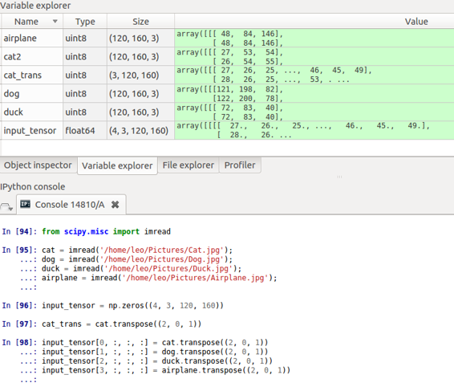

## Python 实现

### 前向传播

* * *


### 反向传播

* * *


## Matlab 实现

* * *

要特别注意 Matlab 与 Python 在表示高维数组方面的方式。还有一个可能会引起混淆的点是，Matlab 将数据表示为列主序，而 numpy 则为行主序。


### Python 和 Matlab 中的多维数组

* * *


必须注意 Matlab 和 Python 表示多维数组的一点差异。我们想要创建一个 2x3 的 4 通道矩阵。因此，在 Matlab 中，您需要创建一个数组 (2,3,4)，在 Python 中，它需要是 (4,2,3)。


### Matlab 重塑顺序

* * *

正如之前提到的，Matlab 将按列一次重塑一列，因此如果您想更改此行为，您需要首先转置输入矩阵。


如果您处理的是多于 2 个维度的情况，您需要使用 "permute" 命令进行转置。现在在 Python 中，reshape 命令的默认值是一次一行，或者如果您愿意，您也可以更改顺序（在 Matlab 中不存在此选项）。


在下面，我们将按行主序重塑为一个新函数：


避免这种排列重塑的另一种选择是将权重矩阵放在不同的顺序上，并像这样计算前向传播：


当 x 作为列向量而权重按行组织时，在所展示的例子中，我们保持与 Python 示例相同的顺序。

### 前向传播

* * *


### 反向传播

* * *


## 下一章

* * *

下一章我们将学习关于 ReLU 层的内容

# ReLU 层

# 整流线性单元层

## 介绍

* * *

我们将从解释如何在 Python/Matlab 中实现 ReLU 层开始。


简单来说，ReLU 层将在输入张量的所有元素上应用函数 ，而不改变其空间或深度信息。

 

从上图可以看出，所有正元素保持不变，而负元素变为零。同时空间信息和深度信息保持不变。

考虑神经网络，这只是一种新型的激活函数，但具有以下特征：

1.  容易计算（前向/反向传播）

1.  在深度模型上遭受的梯度消失要少得多

1.  不好的一点是，如果你使用较大的学习率，它们可能会不可逆地死亡。

## 前向传播

* * *

将所有负元素更改为零，同时保留正元素的值。不改变空间/深度信息。

### Python 前向传播

* * *


### Matlab 前向传播

* * *

## 反向传播

* * *

基本上，我们只是对每个  输入元素应用 max(0,x) 函数。从反向传播章节我们可以注意到，如果元素  是负数，则梯度 dx 为零，如果元素为正数，则梯度为 。


### Python 反向传播

* * *


## 下一章

* * *

下一章我们将学习关于丢弃层的内容

# 丢弃层

# 丢弃层

## 简介

* * *

使用 Dropout 是一种用于改善神经网络过拟合的技术，你应该与其他技术（如 L2 正则化）一起使用 Dropout。


下面是一个分类错误（不包括损失），请注意使用丢弃时测试/验证错误更小。


与其他正则化技术一样，使用丢弃也会使训练损失略有恶化。但这就是我们想要的，基本上我们想要用训练性能换取更好的泛化性能。记住，你的模型越强大（更多层次或更多神经元），它就越容易过拟合。

下面我们有一个绘制图，显示了带有丢弃和不带丢弃的训练和验证损失


## 工作原理

* * *

基本上，在训练期间，特定层上一半的神经元将被停用。这样做可以提高泛化能力，因为它迫使你的层使用不同的神经元来学习相同的 "概念"。

在预测阶段，丢弃是停用的。


## 何时使用丢弃层

* * *

通常一些深度学习模型在全连接层之后使用 Dropout，但也可以在最大池化层之后使用丢弃，从而创建某种图像噪声增强。

## 实现

* * *

为了实现这种神经元停用，我们在前向传播期间创建一个掩码（零和一）。这个掩码在训练期间应用于层输出，并缓存以供未来的反向传播使用。如前所述，这个丢弃掩码仅在训练期间使用。

在反向传播中，我们对被激活的神经元感兴趣（我们需要保存来自前向传播的掩码）。现在，有了这些选择的神经元，我们只需反向传播 dout。丢弃层没有可学习的参数，只有它的输入（X）。在反向传播期间，我们只返回 "dx"。换句话说：

### Python 正向传播

* * *


### Python 反向传播

* * *


## 下一章

* * *

下一章我们将学习关于卷积层的内容

# 卷积层

# 卷积层

## 简介

* * *

本章将解释如何在 Python 和 Matlab 中实现卷积层。


简单来说，卷积层将在输入张量的所有图像上应用卷积运算符，并且还将转换输入深度以匹配滤波器的数量。下面我们解释它的参数和信号：

1.  N：批量大小（4D 张量上的图像数量）

1.  F：卷积层上的滤波器数量

1.  kW/kH：核宽度/高度（通常我们使用方形图像，所以 kW=kH）

1.  H/W：图像高度/宽度（通常 H=W）

1.  H'/W'：卷积后的图像高度/宽度（如果使用适当的填充，则与输入大小相同）

1.  Stride：卷积滑动窗口将移动的像素数量。

1.  填充：添加到图像边界的零以保持输入和输出大小相同。

1.  深度：体积输入深度（如果输入是 RGB 图像，则深度将为 3）

1.  输出深度：体积输出深度（与 F 相同）

## 前向传播

* * *

在前向传播中，你必须记住，我们将使用不同的滤波器对每个输入深度进行“卷积”，而每个滤波器将在图像上寻找不同的内容。


这里注意到第 1 层的所有神经元（闪光灯）共享相同的权重，其他滤波器将在图像上寻找不同的模式。

### Matlab 前向传播

* * *

基本上，我们可以考虑之前在卷积章节中介绍的“convn_vanilla”函数，并应用于输入和输出上的每个深度。


### Python 前向传播

* * *

这里唯一需要注意的一点是，由于 Python 中多维数组的表示方式，我们的张量将具有不同的顺序。


## 反向传播

* * *

为了推导卷积层的反向传播，更容易考虑一维卷积，结果对于二维是相同的。

因此进行一维卷积，信号  和 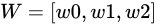 之间，且不使用填充，我们将得到 ，其中 。这里“flip”可以被视为 180 度旋转。


现在我们将所有“有效情况”转换为计算图，注意到我们现在正在添加偏差，因为它在卷积层中被使用。

请注意，这些图表基本上与完全连接的层相同，唯一的区别在于我们有共享权重。


现在转到反向传播

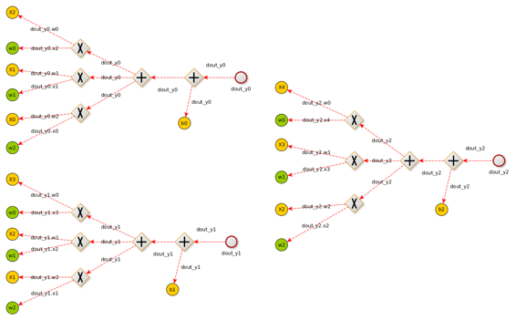

如果你沿着计算图反向进行，就像在反向传播章节中介绍的那样，我们将得到以下公式用于 ，这意味着损失将如何随着输入 X  而改变

现在考虑一些事情：

1.  dX 必须与 X 的大小相同，因此我们需要填充

1.  dout 必须与 Y 的大小相同，本例中为 3（梯度输入）

1.  为了节省编程工作，我们希望将梯度计算为卷积

1.  在 dX 梯度中，所有元素都乘以 W，所以我们可能正在对 W 和 dout 进行卷积

根据 1d 卷积的输出大小规则：我们期望的大小为 3，我们的原始输入大小为 3，并且我们将使用也有 3 个元素的 W 矩阵进行卷积。因此，我们需要用 2 个零填充我们的输入。


上面的卷积实现了所有计算所需的，因此在卷积方面：

现在让我们继续进行，考虑到它们必须与 W 具有相同的大小。

再次，只需看一下我们从图中得出的表达式，我们就可以看到可以将它们表示为 dout 和 X 之间的卷积。同样，由于输出将是 3 个元素，因此无需进行填充。


因此，就卷积而言，对于的计算将是：只需记住一点，如果您认为 X 是核，而 dout 是信号，则 X 将自动翻转。

现在对于偏置，计算将类似于完全连接的层。基本上，每个过滤器（深度）有一个偏置

## 实施说明

* * *

在跳转到代码之前，需要审查一些要点：

1.  如果在前向传播期间使用了一些参数（例如：Stride/Pad），则需要在反向传播期间应用它们。

1.  在 Python 中，我们的多维张量将是“input=[N x Depth x H x W]”，在 matlab 中它们将是“input=[H x W x Depth x N]”

1.  如前所述，输入的梯度与输入本身的大小相同“size(x)==size(dx)”

### Matlab 反向传播

* * *


### Python 反向传播

* * *


## 下一章

* * *

下一章我们将学习关于池化层

# 加速运算

# 加速运算

## 介绍

* * *

在本章中，我们展示了一种将卷积操作转换为矩阵乘法的方法。这样做的优点是计算速度更快，但内存使用更多。我们使用**im2col**操作，该操作将输入图像或批处理转换为矩阵，然后将此矩阵与我们的核的重新形状版本相乘。然后，在最后，我们将这个乘积矩阵重新形状回图像，使用**col2im**操作。

## Im2col

* * *

如前面的源代码所示，我们使用了许多 for 循环来实现卷积，虽然这对学习很有用，但速度不够快。在本节中，我们将学习如何以矢量化的方式实现卷积。

首先，如果我们仔细检查卷积的代码，基本上是核滤波器与移动窗口选择的局部区域之间的点积，该窗口对与我们的核相同大小的补丁进行采样。

如果我们将所有可能的窗口展开到内存中并将点积作为矩阵乘法执行，会发生什么。答案是 200 倍或更多的加速，但会增加更多的内存消耗。


例如，如果输入是 [227x227x3] 并且要用 11x11x3 的滤波器进行步幅 4 和填充 0 的卷积，则会从输入中取 [11x11x3] 的像素块，并将每个块拉伸成大小为  = 363 的列向量。

使用输入 227、步幅 4 和填充 0 进行计算，得到 ((227-11)/4)+1 = 55 的宽度和高度的位置，导致输出矩阵 X_col 的大小为 [363 x 3025]。

这里的每一列都是一个拉伸的感受野（深度补丁），总共有 55*55 = 3025 个。

总结我们如何计算 im2col 输出大小：

```
[img_height, img_width, img_channels] = size(img);
newImgHeight = floor(((img_height + 2*P - ksize) / S)+1);
newImgWidth = floor(((img_width + 2*P - ksize) / S)+1);        
cols = single(zeros((img_channels*ksize*ksize),(newImgHeight * newImgWidth))); 
```

CONV 层的权重也被拉伸成行。例如，如果有 96 个大小为 [11x11x3] 的滤波器，这将给出一个大小为 [96 x 363] 的矩阵 W_row，其中 11x11x3=363。


图像和核被转换后，卷积可以实现为简单的矩阵乘法，在我们的情况下，它将是 W_col[96 x 363] 乘以 X_col[363 x 3025] 的矩阵乘法，结果为一个矩阵 [96 x 3025]，需要重新调整形状为 [55x55x96]。

最终的重塑也可以实现为一个名为 col2im 的函数。

请注意，一些 im2col 的实现可能会得到转置的结果，如果是这种情况，则必须改变矩阵乘法的顺序。


### 正向传播图

* * *

为了帮助 im2col 与卷积的使用，并推导出反向传播，让我们将 im2col 的卷积显示为一个图。这里的输入张量是一个 3 通道 4x4 图像。它将传递到一个具有 S:1 P:0 K:2 和 F:1（输出体积）的卷积层。


### 反向传播图

* * *

使用 im2col 技术的计算图类似于具有相同格式的 FC 层 ，不同之处在于现在我们有一堆重塑、转置和 im2col 块。

关于反向传播过程中的重塑和转置，你只需反转它们的操作，再次使用另一个重塑或转置即可，唯一要记住的重要事情是，如果你在正向传播中使用了行主重塑，则在反向传播中需要使用行主重塑。

唯一需要注意的是 im2col 反向传播操作。问题在于它不能被实现为简单的重塑。这是因为补丁实际上可能会重叠（取决于步幅），因此你需要在补丁相交的地方求梯度的总和。


### Matlab 正向传播

* * *

```
function [activations] = ForwardPropagation(obj, input, weights, bias)
    % Tensor format (rows,cols,channels, batch) on matlab
    [H,W,~,N] = size(input);
    [HH,WW,C,F] = size(weights);

    % Calculate output sizes
    H_prime = (H+2*obj.m_padding-HH)/obj.m_stride +1;
    W_prime = (W+2*obj.m_padding-WW)/obj.m_stride +1;

    % Alocate memory for output
    activations = zeros([H_prime,W_prime,F,N]);

    % Preparing filter weights
    filter_col = reshape(weights,[HH*WW*C F]);
    filter_col_T = filter_col';

    % Preparing bias
    if ~isempty(bias)
        bias_m = repmat(bias,[1 H_prime*W_prime]);
    else
        b = zeros(size(filter_col,1),1);
        bias_m = repmat(b,[1 H_prime*W_prime]);
    end

    % Here we convolve each image on the batch in a for-loop, but the im2col
    % could also handle a image batch at the input, so all computations would
    % be just one big matrix multiplication. We opted now for this to test the
    % par-for implementation with OpenMP on CPU
    for idxBatch = 1:N
        im = input(:,:,:,idxBatch);    
        im_col = im2col_ref(im,HH,WW,obj.m_stride,obj.m_padding,1);
        mul = (filter_col_T * im_col) + bias_m;
        activations(:,:,:,idxBatch) =  reshape_row_major(mul,[H_prime W_prime size(mul,1)]);                                                
    end

    % Cache results for backpropagation
    obj.activations = activations;
    obj.weights = weights;
    obj.biases = bias;
    obj.previousInput = input;            
end 
```

### Matlab 反向传播

```
function [gradient] = BackwardPropagation(obj, dout)
    dout = dout.input;  
    [H,W,~,N] = size(obj.previousInput);
    [HH,WW,C,F] = size(obj.weights);  

    % Calculate output sizes
    H_prime = (H+2*obj.m_padding-HH)/obj.m_stride +1;
    W_prime = (W+2*obj.m_padding-WW)/obj.m_stride +1;

    % Preparing filter weights 
    filter_col_T = reshape_row_major(obj.weights,[F HH*WW*C]);                                                

    % Initialize gradients
    dw = zeros(size(obj.weights));
    dx = zeros(size(obj.previousInput));            
    % Get the bias gradient which will be the sum of dout over the
    % dimensions (batches(4), rows(1), cols(2))
    db = sum(sum(sum(dout, 1), 2), 4);

    for idxBatch = 1:N
        im = obj.previousInput(:,:,:,idxBatch);    
        im_col = im2col_ref(im,HH,WW,obj.m_stride,obj.m_padding,1);
        dout_i = dout(:,:,:,idxBatch);

        dout_i_reshaped = reshape_row_major(dout_i,[F, H*W]);                

        dw_before_reshape = dout_i_reshaped * im_col';                
        dw_i = reshape(dw_before_reshape',[HH, WW, C, F]);
        dw = dw + dw_i;

        % We now have the gradient just before the im2col
        grad_before_im2col = (dout_i_reshaped' * filter_col_T);                
        % Now we need to backpropagate im2col (im2col_back),
        % results will padded by one always
        dx_padded = im2col_back_ref(grad_before_im2col,H_prime, W_prime, obj.m_stride, HH, WW, C);                
        % Now we need to take out the pading
        dx(:,:,:,idxBatch) = dx_padded(2:end-1, 2:end-1,:);
    end

    %% Output gradients 
    gradient.bias = db;
    gradient.input = dx;  
    gradient.weight = dw;

end 
```

### Matlab im2col

* * *

```
function [ img_matrix ] = im2col_ref( inputImg, k_height, k_width, S , P, isConv )
%IM2COL Convert image to a matrix, this step is used to accelerate
%convolutions, implementing the convolution as a matrix multiplication
% This version currently does not support batch of images, we choose this
% because we're first going to use the CPU mode, and we want to relly on
% parfor (OpenMP)
coder.extrinsic('warning')
% Get Image dimensions
[imgHeight, imgWidth, imgChannels] = size(inputImg);

% Calculate convolved result size.
newImgHeight = ((imgHeight + 2*P - k_height) / S)+1;
newImgWidth = ((imgWidth + 2*P - k_width) / S)+1;
offset_K_Height = 0;
offset_K_Width = 0;

% Check if it is a real number
if rem(newImgHeight,1) ~= 0 || rem(newImgWidth,1) ~= 0
    warning('warning: Invalid stride or pad for input\n');
    if isConv
        % Convolution do a floor
        newImgHeight = floor(((imgHeight + 2*P - k_height) / S)+1);
        newImgWidth = floor(((imgWidth + 2*P - k_width) / S)+1);        
    else
        % Pooling do a ceil and adapt the sampling window
        newImgHeight = ceil(((imgHeight + 2*P - k_height) / S)+1);
        newImgWidth = ceil(((imgWidth + 2*P - k_width) / S)+1);
        offset_K_Height = k_height - 1;
        offset_K_Width = k_width - 1;
    end
end

% Allocate output sizes
img_matrix = zeros(...
    (imgChannels*k_height*k_width),(newImgHeight * newImgWidth) ...
    );

% Only pad if needed
if P ~= 0
    inputImg_Padded = padarray(inputImg,[P P]);
    % Get dimensions again before iterate on padded image, otherwise we will
    % keep sampling with the old (unpadded size)
    [imgHeight, imgWidth, ~] = size(inputImg_Padded);
end

% Iterate on the input image like a convolution
cont = 1;
for r=1:S:(imgHeight-offset_K_Height)
    for c=1:S:(imgWidth-offset_K_Width)
        % Avoid slide out of the image (Security buffer overflow)
        if (((c+k_width)-1) <= imgWidth) && (((r+k_height)-1) <= imgHeight)
            % Select window on input volume
            if P == 0
                patch = inputImg(r:(r+k_height)-1,c:(c+k_width)-1,:);
            else
                patch = inputImg_Padded(r:(r+k_height)-1,c:(c+k_width)-1,:);
            end

            % Convert patch to a col vector, the matlab reshape order is
            % row major while other languages (C/C++, python) are col
            % major, on this particular case (im2col, then matrix mult with
            % the kernel) this order will not mather, but it's not allways
            % true...
            patchRow = reshape(patch,[],1);

            % Append the transformed patch into the output matrix
            img_matrix(:,cont) = patchRow;
            cont = cont+1;
        end
    end
end

end 
```

### Matlab im2col 反向传播

* * *

```
function [ img_grad ] = im2col_back_ref( dout, dout_H, dout_W, S, HH, WW, C )
    %IM2COL_BACK_REF Backpropagation of im2col
    % dout: (
    % Return
    % Image gradient (H,W,C)

    % Calculate the spatial dimensions of im_grad
    % Observe that the result will be "padded"
    H = (dout_H - 1) * S + HH;
    W = (dout_W - 1) * S + WW;

    img_grad = zeros(H,W,C);

    for ii=1:(dout_H*dout_W)
        row = dout(ii,:);

        % Create a patch from the row
        patch = reshape_row_major(row,[HH WW C]);
        %patch = reshape(row,[HH WW C]);

        % Calculate indexes on dx
        h_start = floor(((ii-1) / dout_W) * S);    
        w_start = mod((ii-1),dout_W) * S;
        h_start = h_start + 1;
        w_start = w_start + 1;

        img_grad(h_start:h_start+HH-1, w_start:w_start+WW-1, :) = img_grad(h_start:h_start+HH-1, w_start:w_start+WW-1, :) + patch;    
    end    
end 
```

### 正向传播的 Python 示例

* * *

```
def conv_forward_naive(x, w, b, conv_param):
  """
  A naive implementation of the forward pass for a convolutional layer.

  The input consists of N data points, each with C channels, height H and width
  W. We convolve each input with F different filters, where each filter spans
  all C channels and has height HH and width HH.

  Input:
  - x: Input data of shape (N, C, H, W)
  - w: Filter weights of shape (F, C, HH, WW)
  - b: Biases, of shape (F,)
  - conv_param: A dictionary with the following keys:
    - 'stride': The number of pixels between adjacent receptive fields in the
      horizontal and vertical directions.
    - 'pad': The number of pixels that will be used to zero-pad the input.

  Returns a tuple of:
  - out: Output data, of shape (N, F, H', W') where H' and W' are given by
    H' = 1 + (H + 2 * pad - HH) / stride
    W' = 1 + (W + 2 * pad - WW) / stride
  - cache: (x, w, b, conv_param)
  """
  out = None
  pad_num = conv_param['pad']
  stride = conv_param['stride']
  N,C,H,W = x.shape
  F,C,HH,WW = w.shape
  H_prime = (H+2*pad_num-HH) // stride + 1
  W_prime = (W+2*pad_num-WW) // stride + 1
  out = np.zeros([N,F,H_prime,W_prime])
  #im2col
  for im_num in range(N):
      im = x[im_num,:,:,:]
      im_pad = np.pad(im,((0,0),(pad_num,pad_num),(pad_num,pad_num)),'constant')
      im_col = im2col(im_pad,HH,WW,stride)
      filter_col = np.reshape(w,(F,-1))
      mul = im_col.dot(filter_col.T) + b
      out[im_num,:,:,:] = col2im(mul,H_prime,W_prime,1)
  cache = (x, w, b, conv_param)
  return out, cache 
```

### 反向传播的 Python 示例

* * *

```
def conv_backward_naive(dout, cache):
  """
  A naive implementation of the backward pass for a convolutional layer.

  Inputs:
  - dout: Upstream derivatives.
  - cache: A tuple of (x, w, b, conv_param) as in conv_forward_naive

  Returns a tuple of:
  - dx: Gradient with respect to x
  - dw: Gradient with respect to w
  - db: Gradient with respect to b
  """
  dx, dw, db = None, None, None

  x, w, b, conv_param = cache
  pad_num = conv_param['pad']
  stride = conv_param['stride']
  N,C,H,W = x.shape
  F,C,HH,WW = w.shape
  H_prime = (H+2*pad_num-HH) // stride + 1
  W_prime = (W+2*pad_num-WW) // stride + 1

  dw = np.zeros(w.shape)
  dx = np.zeros(x.shape)
  db = np.zeros(b.shape)

  # We could calculate the bias by just summing over the right dimensions
  # Bias gradient (Sum on dout dimensions (batch, rows, cols)
  #db = np.sum(dout, axis=(0, 2, 3))

  for i in range(N):
      im = x[i,:,:,:]
      im_pad = np.pad(im,((0,0),(pad_num,pad_num),(pad_num,pad_num)),'constant')
      im_col = im2col(im_pad,HH,WW,stride)
      filter_col = np.reshape(w,(F,-1)).T

      dout_i = dout[i,:,:,:]
      dbias_sum = np.reshape(dout_i,(F,-1))
      dbias_sum = dbias_sum.T

      #bias_sum = mul + b
      db += np.sum(dbias_sum,axis=0)
      dmul = dbias_sum

      #mul = im_col * filter_col
      dfilter_col = (im_col.T).dot(dmul)
      dim_col = dmul.dot(filter_col.T)

      dx_padded = col2im_back(dim_col,H_prime,W_prime,stride,HH,WW,C)
      dx[i,:,:,:] = dx_padded[:,pad_num:H+pad_num,pad_num:W+pad_num]
      dw += np.reshape(dfilter_col.T,(F,C,HH,WW))
  return dx, dw, db 
```

### Python 中的 Im2col 和 Col2im 源码

这个实现将接收一个三维张量格式的图像 [channels, rows, cols]，并创建一个二维矩阵格式的图像 [rows=(new_h*new_w), cols=(kw*kw*C)]，注意，此算法将输出上述图表的转置版本。

```
def im2col(x,hh,ww,stride):

    """
    Args:
      x: image matrix to be translated into columns, (C,H,W)
      hh: filter height
      ww: filter width
      stride: stride
    Returns:
      col: (new_h*new_w,hh*ww*C) matrix, each column is a cube that will convolve with a filter
            new_h = (H-hh) // stride + 1, new_w = (W-ww) // stride + 1
    """

    c,h,w = x.shape
    new_h = (h-hh) // stride + 1
    new_w = (w-ww) // stride + 1
    col = np.zeros([new_h*new_w,c*hh*ww])

    for i in range(new_h):
       for j in range(new_w):
           patch = x[...,i*stride:i*stride+hh,j*stride:j*stride+ww]
           col[i*new_w+j,:] = np.reshape(patch,-1)
    return col 
```

```
def col2im(mul,h_prime,w_prime,C):
    """
      Args:
      mul: (h_prime*w_prime*w,F) matrix, each col should be reshaped to C*h_prime*w_prime when C>0, or h_prime*w_prime when C = 0
      h_prime: reshaped filter height
      w_prime: reshaped filter width
      C: reshaped filter channel, if 0, reshape the filter to 2D, Otherwise reshape it to 3D
    Returns:
      if C == 0: (F,h_prime,w_prime) matrix
      Otherwise: (F,C,h_prime,w_prime) matrix
    """
    F = mul.shape[1]
    if(C == 1):
        out = np.zeros([F,h_prime,w_prime])
        for i in range(F):
            col = mul[:,i]
            out[i,:,:] = np.reshape(col,(h_prime,w_prime))
    else:
        out = np.zeros([F,C,h_prime,w_prime])
        for i in range(F):
            col = mul[:,i]
            out[i,:,:] = np.reshape(col,(C,h_prime,w_prime))

    return out 
```

```
def col2im_back(dim_col,h_prime,w_prime,stride,hh,ww,c):
    """
    Args:
      dim_col: gradients for im_col,(h_prime*w_prime,hh*ww*c)
      h_prime,w_prime: height and width for the feature map
      strid: stride
      hh,ww,c: size of the filters
    Returns:
      dx: Gradients for x, (C,H,W)
    """
    H = (h_prime - 1) * stride + hh
    W = (w_prime - 1) * stride + ww
    dx = np.zeros([c,H,W])
    for i in range(h_prime*w_prime):
        row = dim_col[i,:]
        h_start = (i / w_prime) * stride
        w_start = (i % w_prime) * stride
        dx[:,h_start:h_start+hh,w_start:w_start+ww] += np.reshape(row,(c,hh,ww))
    return dx 
```

### 较小的例子

* * *

为了简化我们的想法，让我们以在 X[3x3] 上卷积 W[2x2] 的简单示例为例


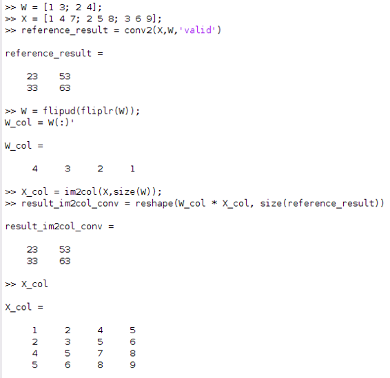

# 池化层

# 池化层

## 介绍

* * *


池化层用于减少卷积神经网络模型的空间维度，但不包括深度，基本上这就是您获得的内容：

1.  通过减少空间信息，您可以获得计算性能

1.  更少的空间信息也意味着更少的参数，因此过度拟合的机会更少

1.  您会获得一些平移不变性

一些项目不使用池化，特别是当他们想要“学习”某些对象特定位置时。学会如何玩 Atari 游戏。

在下面的图表中，我们展示了最常见的池化类型，即最大池化层，它像正常的卷积一样滑动一个窗口，并将窗口中的最大值作为输出。


玩的最重要的参数：

+   输入：H1 x W1 x Depth_In x N

+   步幅：控制窗口滑动的像素数量的标量。

+   K：核大小

关于其输出 H2 x W2 x Depth_Out x N：


还值得指出的是，在池化层中没有可学习的参数。 因此，它的反向传播更简单。

## 正向传播

* * *

池化层上的窗口移动机制与卷积层相同，唯一的变化是我们将选择窗口中的最大值。

### Python 正向传播

* * *


### Matlab 正向传播

* * *

## 反向传播

* * *

从反向传播章节中我们了解到，最大节点简单地作为一个路由器，将输入梯度“dout”给到大于零的输入。

 你可以认为最大池化使用一系列最大节点，在其计算图上。 因此，将最大池化层的反向传播视为在正向传播期间选择的所有元素的掩码与 dout 之间的乘积。


换句话说，相对于最大池化层输入的梯度将是一个张量，除了在正向传播期间选择的位置之外，其他地方都是零。

### Python 反向传播

* * *


## 提高性能

* * *

在未来的章节中，我们将学习一种提高卷积性能的技术，直到那时我们将坚持使用天真的实现。

## 下一章

* * *

下一章我们将学习关于批归一化层的知识

# 批归一化层

# 批归一化层

## 介绍

* * *

在本章中，我们将学习批归一化层。之前我们说过[特征缩放](https://www.gitbook.com/book/leonardoaraujosantos/artificial-inteligence/edit#/edit/master/feature_scaling.md)使梯度下降的工作变得更容易。现在我们将扩展这个想法，并在训练期间规范化每个全连接层或卷积层的激活。这也意味着在训练时我们将选择一个批次，计算它的均值和标准差。

您可以将批归一化看作是一种自适应（或可学习的）预处理块，具有可训练参数。这也意味着我们需要反向传播它们。

原始批归一化论文可以在[这里](http://arxiv.org/pdf/1502.03167v3.pdf)找到。

以下是使用批归一化的优点列表：

1.  改善了梯度流，用于非常深的模型（Resnet 需要这个）

1.  允许更高的学习率

1.  减少对初始化的依赖

1.  提供某种形式的正则化（甚至减少了对 Dropout 的重要性但仍然使用它）

1.  根据经验法则，如果您使用 Dropout+批归一化，您就不需要 L2 正则化

它基本上强制您的激活（Conv，FC 输出）具有单位标准差和零均值。

对每个学习批数据，我们应用以下归一化。


批归一化层的输出，具有  这些参数。这些参数将被学习以最佳表示您的激活。这些参数允许一个可学习的（缩放和偏移）因子 

现在总结操作：


在这里， 是一个小数，为 1e-5。

## 在哪里使用批归一化层

* * *

批归一化层在线性层（即：FC、conv）之后使用，并在非线性层（relu）之前使用。实际上有两种批归一化实现，一种用于 FC 层，另一种用于 conv 层。


## 测试时间

* * *

在预测时，批归一化的工作方式不同。均值/标准差不是基于批处理计算的。相反，我们需要在训练期间为您模型上的每个批归一化层建立整个数据集（总体）的均值/标准差的估计值。

估计训练期间总体均值和方差的一种方法是使用[指数移动平均](https://en.wikipedia.org/wiki/Moving_average#Exponential_moving_average)。


其中：：当前和先前的估计 ：表示权重减小的程度，一个在 0 和 1 之间的常数平滑因子 ：我们正在尝试估计的当前值（可能是均值或标准差）

通常，当我们实现此层时，我们会有一种标志来检测我们是在训练还是测试中。

作为参考，我们可以找到一些关于[Tensorflow](http://r2rt.com/implementing-batch-normalization-in-tensorflow.html)或[手动在 Python 上](https://kratzert.github.io/2016/02/12/understanding-the-gradient-flow-through-the-batch-normalization-layer.html)的教程。

## 反向传播

* * *

如前所述，我们需要知道如何在批量归一化层上进行反向传播，首先像其他层一样，我们需要创建计算图。在这一步之后，我们需要计算每个节点相对于其输入的导数。

### 计算图

为了找到反向传播的偏导数，最好将算法可视化为计算图：


### 新节点

通过检查这个图，我们有一些新节点（, , , ）。为了简化事情，您可以使用[Wolfram alpha](https://www.wolframalpha.com/)来找到导数。要反向传播其他节点，请参考[反向传播章节](https://www.gitbook.com/book/leonardoaraujosantos/artificial-inteligence/edit#/edit/master/backpropagation.md)

#### [块 1/x](https://www.wolframalpha.com/input/?i=derivative+1%2Fx)


换句话说：


其中：表示来自前向传播的缓存（或保存）输入。表示前一个块的梯度

#### [块 sqrt(x-epsilon)](https://www.wolframalpha.com/input/?i=derivative+of+sqrt(x-epsilon)


换句话说：


其中：：来自前向传播的缓存（或保存）输入。：前一个块的梯度！[](9fe1930b.png)：一些小数 0.00005

#### [块 x²](https://www.wolframalpha.com/input/?i=derivative+of+x%5E2)


换句话说：


#### 块求和


像 SUM 块一样，此块将把输入梯度 dout 等分到所有输入中。因此，对于 X 中的所有元素，我们将除以 N 并乘以 dout。

## 实现

### Python 前向传播

* * *


### Python 反向传播

* * *


## 下一章

* * *

下一章我们将学习如何优化我们的模型权重。

# 模型求解器

# 模型求解器

## 介绍

* * *

模型求解器的任务是找到最小化训练/准确性错误的最佳参数集。在本章中，我们将提供一个带有一些 Python/Matlab 代码片段的 UML 描述，让您可以自己实现它。


从 UML 描述中，我们可以推断出有关 Solver 类的一些信息：

1.  它使用训练集，并引用您的模型

1.  使用不同类型的优化器（例如：SGD、ADAM、带动量的 SGD）

1.  在训练阶段跟踪所有损失、准确率

1.  保留达到最佳验证性能的参数集

## 使用示例

* * *


## 训练操作

* * *

当您实际上想要开始模型训练时，会调用此方法，方法 Step，Check_Accuracy 在 Train 方法内调用：

1.  根据周期数、训练大小和批量大小计算每周期的迭代次数

1.  调用步骤，对于每次迭代

1.  衰减学习率

1.  计算验证准确性

1.  根据验证准确性缓存最佳参数

## 步骤操作

* * *

基本上，在步骤操作期间，执行以下操作：

1.  从训练集中提取一个批次。

1.  获取模型损失和梯度

1.  使用优化器之一执行参数更新。

## 检查准确性

* * *

此方法基本上在每个周期结束时调用。基本上它使用当前参数集，并预测整个验证集。目标是在最后获得准确性。

## 模型损失操作

* * *

我们在“步骤”操作中提到，我们获取模型损失和梯度。此操作由 "getLoss" 方法实现。考虑以下基本模型。

 下面是前一个简单模型的 "getLoss" 函数。

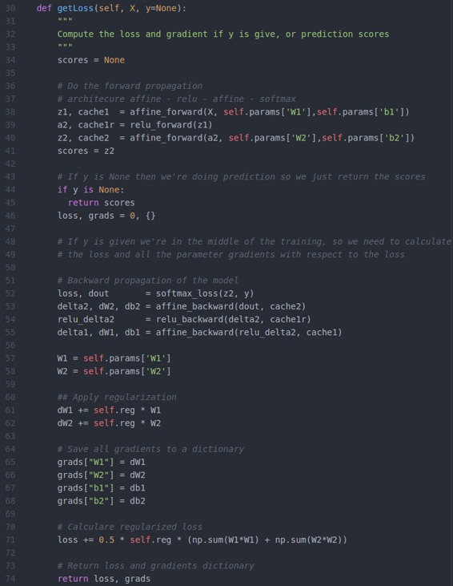

还在下面有 "softmax_loss" 函数，包括 "dout"，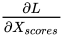


# 对象定位和检测

# 对象定位和检测

* * *

## 介绍

在本章中，我们将学习使用卷积神经网络在图像上定位和检测对象


+   RCNN

+   Fast RCNN

+   Faster RCNN

+   Yolo

+   SSD

## 使用回归定位对象

回归是关于返回一个数字而不是一个类别，在我们的情况下，我们将返回 4 个数字（x0、y0、宽度、高度），这些数字与边界框相关联。您可以使用图像和真实边界框训练此系统，并使用 L2 距离计算预测边界框和真实边界框之间的损失。


通常你要做的是在最后一个卷积层上附加另一个完全连接的层


这只适用于一次处理一个对象。

有些人在最后一个卷积层（Overfeat）后附加回归部分，而其他人在完全连接的层（RCNN）后附加。两者都可以。

## 比较边界框预测的准确性

* * *

基本上我们需要比较预测和真实值之间的交并比（IoU）是否大于某个阈值（例如 > 0.5）


## RCNN

RCNN（区域 + CNN）是一种依赖外部区域提议系统的方法。


RCNN 的问题在于它从未被设计为快速的，例如训练网络的步骤如下：

1.  使用预训练的 imagenet cnn（例如 Alexnet）

1.  重新训练最后一个完全连接的层，与需要检测的对象 + "无对象"类

1.  获取所有建议（约 2000 个/图像），调整它们的大小以匹配 cnn 输入，然后保存到磁盘。

1.  训练 SVM 来对对象和背景进行分类（每个类别一个二元 SVM）

1.  边界框回归：训练一个线性回归分类器，输出一些校正因子

### 步骤 3 保存并预处理提议


### 步骤 5（调整边界框）


## 快速 RCNN

快速 RCNN 方法从某个外部系统（选择性搜索）接收区域提议。这些提议将被发送到一个层（Roi 池化），该层将调整所有区域及其数据到固定大小。这一步骤是必要的，因为全连接层期望所有向量的大小相同。


提议示例，boxes=[r, x1, y1, x2, y2]


仍然依赖于某个外部系统来提供区域提议（选择性搜索）

### Roi 池化层

* * *


这是一种最大池化的类型，池大小取决于输入，以便输出始终具有相同的大小。这是因为全连接层始终期望相同的输入大小。


Roi 层的输入将是提议和最后一个卷积层的激活。例如，考虑以下输入图像及其提议。

输入图像


两个提议的区域


现在最后一个卷积层（例如：conv5）上的激活


对于每个卷积激活（上图中的每个单元格），Roi 池化层将调整区域提议（红色）到与全连接层期望的相同分辨率。例如，考虑在绿色中选择的单元格。


这里的输出将是：


## Faster RCNN

* * *


主要思想是使用最后（或深层）的卷积层推断区域提议。

Faster-RCNN 由两个模块组成。

+   区域提议网络（RPN）：基于深度卷积层给出一组矩形。

+   快速 RCNN Roi 池化层：对每个提议进行分类，并细化提议位置

### 区域提议网络

* * *

这里我们以块图表的方式解释 Faster RCNN 的工作原理。

1.  获取训练好的（例如 ImageNet）卷积神经网络

1.  从最后（或深层）卷积层获取特征映射

1.  训练一个区域提议网络，该网络将决定图像中是否存在对象，还将提出框位置

1.  将结果提供给自定义（Python）层

1.  将提议给一个 Roi 池化层（类似于 Fast RCNN）

1.  将所有提议调整为固定大小后，发送到一个全连接层继续分类。


#### 工作原理

基本上，RPN 在特征图上滑动一个小窗口（3x3），对窗口下的内容进行分类为对象或非对象，并且给出一些边界框位置。

对于每个滑动窗口中心，它创建固定数量的锚定框，并将这些框分类为物体或非物体。


### Faster RCNN 训练

在论文中，每个网络都是分开训练的，但我们也可以联合训练。只需考虑模型有 4 个损失。

+   RPN 分类（目标或非目标）

+   RPN 边界框建议

+   快速 RCNN 分类（普通对象分类）

+   快速 RCNN 边界框回归（改进以前的边界框建议）


### Faster RCNN 结果

现在最好的结果是具有 resnet 101 层的 Faster RCNN。


## 完整的 Faster RCNN 图解

这个图表示了使用 VGG16 的 Faster RCNN 的完整结构，我在一个 github 项目[这里](https://github.com/mitmul/chainer-faster-rcnn)找到了它。它使用了一个叫做[Chainer](https://github.com/pfnet/chainer)的框架，这是一个仅使用 Python（有时使用 Cython）的完整框架。

## 

## 下一章节

* * *

在下一章节中，我们将讨论一种称为单次检测器的不同类型的目标检测器。

# 单次检测器

# 单次检测器

* * *

## 介绍

以前的目标检测方法都有一个共同点：它们的网络的一部分专门用于提供区域建议，然后是一个高质量的分类器来对这些建议进行分类。这些方法非常精确，但计算成本很高（低帧率），换句话说，它们不适合在嵌入式设备上使用。

另一种进行目标检测的方法是将这两个任务合并到一个网络中。我们可以通过不是让一个网络生成建议，而是在一组预定义的框中查找对象来实现这一点。

使用网络的后几层的卷积特征图，我们在这些特征图上运行小的卷积滤波器来预测类别得分和边界框偏移量。

这是遵循这种策略的目标检测器家族：

+   SSD：使用不同的激活图（多尺度）来预测类别和边界框

+   YOLO：使用单个激活图来预测类别和边界框

+   R-FCN（基于区域的完全卷积神经网络）：类似于 Faster Rcnn，但由于每个框的计算量更少，因此更快。

+   Multibox：asdasdas

使用这些多尺度有助于通过能够检测图像上不同尺寸的对象来实现更高的 mAP（平均平均精度）。

总结这些方法的策略

1.  使用回归（框）和分类目标（损失函数）来训练 CNN。

1.  在预测时在卷积特征图（conv-relu 的输出）上使用滑动窗口（卷积）和非极大值抑制

在这种类型的检测器上，通常在图像上有一系列不同的空间位置、尺度和长宽比的框叠加，作为“锚点”（有时称为“先验”或“默认框”）。

然后，模型被训练为对每个锚点进行两个预测：

1.  每个锚点的离散类别预测

1.  对每个锚点连续预测一个偏移量，以适应地面实况边界框。

此方法使用的损失也是两个目标的组合，即定位（回归）和分类。

# 图像分割

# 图像分割

## 介绍

* * *

现在我们将学习如何对图像中的每个像素进行分类，想法是在图像上创建所有检测到的对象区域的地图。基本上，我们想要的是下面的图像，其中每个像素都有一个标签。

在本章中，我们将学习卷积神经网络（CNN）如何完成这项工作。


## 用于分割的全卷积网络

* * *

完全卷积神经网络（FCN）是一个普通的 CNN，其中最后一个全连接层被另一个具有大“接受域”的卷积层替换。想法是捕捉场景的全局上下文（告诉我们图像上有什么，同时给出一些粗略的位置）。


只需记住，当我们将最后一个全连接（FC）层转换为卷积层时，如果我们查看哪些位置具有更多的激活，我们会获得一些形式的定位。


想法是，如果我们选择新的最后一个 conv 层足够大，我们将在我们的输入图像大小上获得这种定位效果。

## 从普通 CNN 转换为 FCN

* * *

这里是我们如何将用于分类的普通 CNN，即：Alexnet，转换为用于分割的 FCN。

只需记住这就是 Alexnet 的外观：


下面还显示了每个层的参数


对于 Alexnet，输入被固定为 227x227，因此所有池化效果将使图像从 227x227 缩小到 55x55，27x27，13x13，最后是 FC 层上的单个行向量。


现在让我们看看执行转换所需的步骤。

1) 我们从用于分类的普通 CNN 开始，其中


2) 第二步是将所有 FC 层转换为 1x1 卷积层，此时我们甚至不需要改变权重。（这已经是一个完全卷积神经网络）。FCN 网络的一个很好的特性是我们现在可以使用任何图像大小。


请注意，在 FCN 中，我们可以使用不同大小的 H x N。


3) 最后一步是使用“反卷积或转置卷积”层将激活位置恢复到与图像大小相关的有意义的东西。想象一下，我们只是将激活大小缩放到相同的图像大小。

这个最后的“上采样”层也有可学习的参数。


现在有了这个结构，我们只需要找到一些“地面真相”和端对端学习，从预训练网络开始，即：Imagenet。

这种方法的问题在于，仅通过这样做我们会失去一些分辨率，因为激活在许多步骤上都被缩小了。


为了解决这个问题，我们还从前几层中获得一些激活，并将它们相加。这个过程被称为这个算法的创造者所谓的“跳过”。

即使今天（2016 年）ImageNet 分割类别的获胜者，也使用了一系列 FCN 来赢得比赛。

那些用于跳过的上采样操作也是可学习的。


在下面，我们展示了这个“跳过”过程的效果，注意在一些“跳过”后分割的分辨率如何改善。


### 转置卷积层（反卷积“坏名字”）

* * *

基本上的想法是放大，作用在所有先前层上的缩小效果。


它有这个坏名字，因为上采样前向传播是卷积反向传播，而上采样反向传播是卷积前向传播。

在 caffe 源代码中，它错误地被称为“deconvolution”。

## 极端分割

* * *

还有另一件事情可以做，以避免这些“跳过”步骤并提供更好的分割。


这个架构被称为“Deconvnet”，基本上是另一个网络，但现在所有的卷积和池化层都被颠倒了。正如你可能猜到的，这很重要，它需要 6 天的时间在 TitanX 上训练。但结果确实很好。

另一个问题是训练分为 2 个阶段。

当场景中有小物体时，Deconvnets 受到的影响比 FCN 少。

反卷积网络输出一个与输入相同大小的概率图。


### 反池化

* * *

除了反卷积层之外，我们现在还需要池化层。最大池化操作是不可逆的，但我们可以通过记录位置（最大位置切换）来近似，我们记录了我们找到的最大值的位置（在正常的最大池化期间），然后使用这些位置从上面的层重构数据（在这种情况下是反卷积）。


## 下一章

* * *

在下一章中，我们将讨论一些支持深度学习的库

# GoogleNet

# GoogleNet

## 介绍

* * *

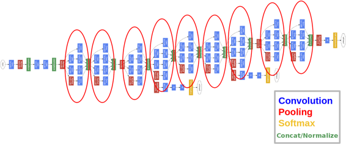

在本章中，您将了解到 GoogleNet（2014 年 ImageNet 获胜架构）及其初始层。


googleNet 有 22 层，参数几乎少了 12 倍（因此比 Alexnet 更快，参数比更精确。

他们的想法是制作一个也可以在智能手机上使用的模型（使预测的计算预算约为 15 亿乘法加法）。

## 初始层

* * *

初始层的想法是覆盖更大的区域，但也保持图像上小细节的精细分辨率。因此，这个想法是并行卷积不同大小的图像，从最精确的细节（1x1）到更大的细节（5x5）。

这个想法是一系列具有不同尺寸的 gabor 滤波器将更好地处理多个对象的尺度。具有所有滤波器的优势在于，inception 层上的所有滤波器都是可学习的。

改进深度学习性能的最直接方法是使用更多的层和更多的数据，googleNet 使用了 9 个 inception 模块。问题在于，更多的参数意味着您的模型更容易过拟合。因此，为了避免 inception 层的参数爆炸，利用了所有的瓶颈技术。


使用瓶颈方法，我们可以重新构建具有更多非线性和更少参数的 inception 模块。还添加了一个最大池化层，用于总结前一层的内容。所有结果都在一起连接，然后传递给下一层。

## Caffe 示例

* * *

在下面，我们展示了两个级联的 inception 层，来自原始 googleNet。


# 残差网络

# 残差网络

## 介绍

* * *

本章将介绍 2016 年关于目标分类的最新技术。残差网络基本上是由相同的“残差”块组成的 150 层深度卷积神经网络。

对于真正深度的网络（超过 30 层），所有已知的技术（Relu、dropout、batch-norm 等）都不足以进行良好的端到端训练。这与常见的“经验证明的知识”相矛盾，即更深层次的网络效果更好。

残差网络的理念是使用重新路由输入并添加到从前一层学习到的概念的块。这个想法是，在学习过程中，下一层将学习前一层的概念以及前一层的输入。这比仅仅学习一个概念而没有用于学习该概念的参考更有效。

可视化他们解决方案的另一种方式是记住，和节点的反向传播将无损地复制输入梯度。


在下面，我们展示了一个 34 层深度的残差网络的示例。


残差网络的创建者经验证明，与 34 层级级联（如 VGG）相比，训练 34 层级的残差网络更容易。

请注意，在残差网络的末端，只有一个完全连接的层，后跟先前的平均池。

## 残差块

* * *

在其核心，残差网络由以下结构组成。


基本上，这种跳跃和加法器为反向传播创建了一条路径，即使是真正深的模型也可以进行训练。

如前所述，Batch-Norm 块缓解了网络的初始化，但对于不那么深的模型（少于 50 层）可以省略。

类似于 googlenet，我们必须使用瓶颈来避免参数爆炸。

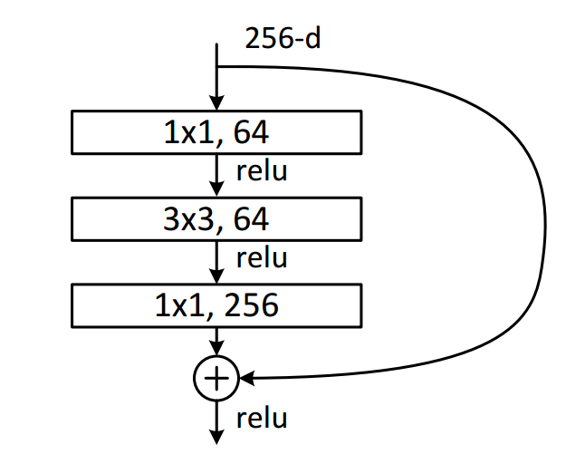

只需记住，要使瓶颈起作用，前一层必须具有相同的深度。

## Caffe 示例

* * *

这里展示了 2 个级联的残差块组成的残差网络，由于批量规范化层的困难，它们被省略了，但残差网络仍然给出了良好的结果。


# 深度学习库

# 深度学习库

## 介绍

讨论，并对最常见的深度学习库进行一些示例:

+   Caffe

+   Torch

+   TensorFlow

+   Theano

+   CNTK

## Caffe

* * *

Caffe 最基本的特性之一是训练简单的非递归模型很容易。

最酷的功能:

+   性能好，允许使用多个 GPU 进行训练

+   适用于 CPU 和 GPU 的实现

+   源代码易于阅读

+   允许在 Python 中定义层

+   有 Python 和 Matlab 绑定

+   允许使用文本语言进行网络定义（不需要编写代码）

+   通过 LMDB 快速访问数据集

+   允许网络可视化

+   有 Web 界面 (Digits)

### Caffe 主要类:


+   Blob: 用于存储数据和 diffs（导数）

+   层: 将底部 blob（输入）转换为顶部 blob（输出）的某些操作

+   Net: 一组连接的层

+   Solver: 调用 Net 前向和后向传播，使用梯度方法（梯度下降、SGD、adagrad 等...）更新权重

### Caffe 训练/验证文件

path/to/image/1.jpg [标签]

### 简单的示例

这里是一个逻辑回归分类器。想象成一个具有一个层和一个 sigmoid（交叉熵 softmax）非线性的神经网络。


### Caffe 缺点

+   对于新层需要编写 C++ / Cuda 代码

+   对于大型网络（Resnet、googlenet）编写 protofiles 不好

+   体验新架构不好（主流版本不支持 Fast RCNN）

## Torch

* * *

对于研究非常好，问题在于使用了一个叫 Lua 的新语言。

### Torch 优势

+   灵活

+   非常容易的源代码

+   与 C/C++ 的绑定很容易

+   Web 界面 (Digits)

### Torch 优势

+   新语言 Lua

+   从目录加载数据困难

+   没有 Matlab 绑定

+   比 Caffe 更加灵活

+   对于 RNN 不容易

## Theano

* * *

### Theano 缺点

+   更多手动操作

+   没有 matlab 绑定

+   比其他框架慢

+   没有太多预训练模型

## Tensorflow

* * *

### Tensorflow 优势

+   灵活

+   适用于 RNN

+   允许分布式训练

+   信号可视化的 Tensorboard

+   Python Numpy

### Tensorflow 缺点

+   没有太多预训练模型

+   不支持新的目标检测功能（如 Roi 池化）

+   不支持像 Caffe 那样的数据集

+   对于单 GPU 训练比 Caffe 慢

## CNTK

* * *

### CNTK 优势

+   灵活的

+   适用于 RNN

+   允许分布式训练

### CNTK 缺点

+   没有可视化

+   任何错误 CNTK 崩溃

+   没有简单的源代码可供阅读

+   新的语言 (ndl) 描述网络

+   目前没有 matlab 或 python 绑定

## 概要

+   对于研究使用 Torch 或 Tensorflow（最后选项为 Theano）

+   对于训练卷积网络或使用预训练模型，请使用 Caffe

### CS231n 深度学习课程总结


+   从已知模型（Alexnet、Googlenet、Vgg）中获取特征：使用 Caffe

+   微调已知模型（Alexnet、Googlenet、Vgg）：使用 Caffe

+   图像字幕: Torch 或 Tensorflow

+   分割: Caffe, Torch

+   目标检测：Caffe with python layers，Torch（更多工作）

+   语言建模：Torch，Theano

+   实现 Bath Norm：Torch，Theano 或 Tensorflow

通常 Tensorflow 可以在所有情况下使用 Torch，但如果您需要了解特定层的功能，或者需要创建一个新层，请使用 Torch 而不是 Tensorflow。在这些情况下，Torch 更可取，因为 Torch 中的层源代码更易于阅读。

## 下一章

* * *

在下一章中，我们将讨论分布式学习

# 无监督学习

# 介绍

* * *

正如前几章所述，无监督学习是指在没有标签信息的情况下学习信息。

这里的“信息”一词指的是“结构”，例如，您想知道数据集中存在多少组，即使您不知道这些组的含义。

我们还使用无监督学习来可视化您的数据集，以尝试从数据中学习一些见解。

### 无标签数据示例

* * *

考虑以下数据集！[](750c80ea.png)（X 有 2 个特征）


一种称为“聚类”的无监督学习算法用于推断数据集中存在多少个不同的组。


在这里，我们仍然不知道这些组的含义，但我们知道有 4 个看起来非常明显的组。在这种情况下，我们选择一个低维数据集！[](6a67a3f7.png)，但在现实生活中，它可能有数千个维度，例如！[](fe46b6da.png)对于一个灰度 28x28 图像。

### 降维

* * *

为了提高分类响应时间（而非预测性能），有时为了可视化您的高维数据集（2D、3D），我们使用降维技术（例如：PCA、T-Sne）。

例如，[MNIST 数据集](http://yann.lecun.com/exdb/mnist/)由 60,000 个（0..9）数字的训练示例组成，每个数字具有 784 个维度。这种高维度是因为每个数字都是一个 28x28 的灰度图像。


对于这个数据集进行可视化将会很困难，因此一个选择是将其维度降低到在显示器上可见的内容（2D、3D）。


在这里很容易观察到分类器可能在区分数字 1 和 7 时会遇到问题。

另一个优点是这给了我们一些关于当前特征集有多好的线索。

### 自编码器

* * *

我们也可以使用神经网络进行降维，其思想是我们有一个神经网络拓扑结构，可以在输出层上近似输入。在中间，自编码器有一个较小的层。训练后，中间层具有输入的压缩版本（有损）。


#### 卷积神经��络预训练

由于我们在训练自编码器时不需要标签信息，我们可以将它们用作卷积神经网络的预训练器。因此，在未来，我们可以从无监督训练初始化权重开始训练。


一些此技术的例子可以在这里找到：

+   [使用 Python](https://swarbrickjones.wordpress.com/2015/04/29/convolutional-autoencoders-in-pythontheanolasagne/)

+   [使用 Torch](https://siavashk.github.io/2016/02/22/autoencoder-imagenet/)

### 数据流形

* * *

流形学习的目标是将原本位于高维空间中的数据嵌入到低维空间中，同时保留特征属性。这是可能的，因为对于任何有趣的高维数据来说，它必须是固有地低维的。

例如，人脸图像可以表示为高维空间中的点（假设您的相机有 5MP -- 所以您的图像，考虑到每个像素由三个值[r,g,b]组成，位于一个 1500 万维空间中），但并不是每个 5MP 图像都是一个人脸。人脸位于这个高维空间中的一个子流形上。

子流形在局部上是欧几里得的，即如果你取两个非常相似的点，比如两个相同双胞胎的图像，它们在欧几里得空间中会很接近。


例如，在上面的数据集中，我们有一个高维流形，但是人脸位于一个更低维度的空间中（几乎欧几里得）。因此，在这个子空间中，距离之类的东西是有意义的。

随着特征数量的增加，数据分布将不是线性的，因此简单的线性技术（例如：PCA）对于降维将不再有效。在这些情况下，我们需要其他东西，如 T-Sne，自动编码器等。

顺便提一下，对非线性流形进行降维有时被称为流形学习。


下面是一个根据问题类型指导您的图表：


这是 T-SNE 方法与 MNIST 数据集上 PCA 方法的比较


# 主成分分析

# 主成分分析

## 介绍

* * *

在本章中，我们将学习主成分分析（PCA），这是一种用于进行降维的工具。这很有用，因为它可以使分类器在速度方面更容易，或者可以帮助数据可视化。

那么主成分是什么呢？它们是数据中的基本结构。它们是数据方差最大的方向，数据最分散的方向。

此算法的唯一限制是，它只在我们拥有线性流形时才能更好地工作。

主成分分析算法将尝试拟合一个最小化投影误差的平面（所有红线大小的总和）。

想象一下，主成分分析将尝试旋转你的数据，寻找一个角度，在这个角度上它看到的方差更大。


如前所述，当您的数据具有线性数据流形时，可以使用 PCA。


但对于非线性流形，我们将有很多投影误差。

 

### 计算 PCA

* * *

1.  预处理数据：

1.  计算协方差矩阵：， 是元素的数量，X 是矩阵 ，其中 n 是实验次数，p 是特征数

1.  获取协方差矩阵的特征向量 ，这里 U 矩阵将是一个 nxn 矩阵，其中 U 的每一列都是主成分，如果我们想要将数据从 n 维降到 k 维，我们从 U 中选择 k 列。

预处理部分有时包括对每列的标准差进行除法，但有些情况下这是不需要的。（减去平均值更重要）

### 减少输入数据

* * *

现在我们计算了存储在矩阵 U 中的主成分，我们将把我们的输入数据从 n 维减少到 k 维 。 这里 k 是 U 的列数。 根据数据的组织方式，我们可以有 2 种不同的 Z 格式。


### 恢复数据

* * *

要反转换，我们进行以下操作：

### 在 Matlab 中的示例

* * *

为了说明整个过程，我们将从图像计算 PCA，然后用更少的维度恢复它。

#### 获取一些数据示例

* * *

这里我们的数据是一个 15 个样本的 3 个测量值的矩阵 [15x3]


#### 数据预处理

* * *

现在我们将从每个实验中减去每列的平均值，然后还要将每个元素除以每列的标准差。


均值和标准差将应用于 X 的所有列

#### 计算协方差矩阵

* * *


#### 获取主成分

* * *

现在我们使用 "svd" 来获取主成分，这些主成分是协方差矩阵的特征向量和特征值


有不同的方法来计算 PCA，例如 matlab 已经提供了一个 pca 或 princomp 函数，它们可能给出特征向量 (U) 上不同的符号，但它们都代表相同的组件。


您应该注意的一件事是输入矩阵的顺序，因为某些找到 PCA 的方法会期望您的样本和测量值按某种预定义的顺序排列。

#### 恢复原始数据

* * *

现在为了恢复原始数据，我们使用所有的组件，还要反转预处理。


#### 减少我们的数据

* * *

实际上，通常我们会在开始之前做一些操作。现在我们有了主成分，让我们应用 k=2


我们可以使用主成分 Z 来重新创建数据 X，但会有一些损失。 思路是 Z 中的数据比 X 小，但方差相似。 在这种情况下，我们有  我们可以用  来复制数据 X_loss，所以维度少了一个。


### 在图像上使用 PCA

* * *

在结束本章之前，我们将在图像上使用 PCA。


# 生成模型

# 生成模型

生成模型的思想是能够学习训练集的概率分布。通过这样做，生成模型可以从原始数据中创建更多数据。想象一下，它是完美的数据增强系统。因此，基本上它可以作为一种无监督的方式来生成样本，以更好地训练其他网络。

基本上，这是通过让两个神经网络相互对抗来完成的。

# 分布式学习

# 介绍

* * *

了解如何将深度模型的训练分布到多台机器上。

## Map Reduce

* * *

Map Reduce 可以描述为以下步骤：

1.  将训练集分割成批次（例如：按照你的农场工人数量划分：4）

1.  将农场中的每台机器分配 1/4 的数据

1.  在每台计算机节点上执行前向/后向传播（所有节点共享相同的模型）

1.  合并每台机器的结果并执行梯度下降

1.  更新所有节点上的模型版本。


### 示例线性回归模型

* * *

考虑批量梯度下降公式，即应用于所有训练集的梯度下降：


每台机器将处理 100 个元素（在分割数据集之后），计算，然后：


每台机器都在计算其自己数据分割的反向传播和误差。请记住，所有机器都有模型的相同副本。

在每台机器计算出各自的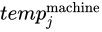后，另一台机器将合并这些梯度，计算新的权重并更新所有机器上的模型。


这个过程的整个目的是检查我们是否可以合并所有节点的计算，并且仍然能够在最终计算中有意义。

### 使用这种方法的人

* * *

+   Caffe

+   Torch（并行层）

### 问题

这种方法有一些问题：

+   完整的模型必须适合每台机器。

+   如果模型太大，将需要一段时间将所有机器更新为相同的模型。

## 分割权重

* * *

另一种方法是在谷歌的 DistBelief 项目中使用的，他们使用一个普通的神经网络模型，权重分布在多台机器之间。


在这种方法中，只有跨机器传递的权重（粗边）需要在工作节点之间进行同步。这种技术只能用于完全连接的层。

如果你将两种技术（参考 Alexnet 论文）混合在一起，你会做到完全连接的处理（只是矩阵乘法），然后当你需要卷积部分时，每个卷积层都会得到批次的一部分。


## 谷歌的旧方法

* * *


在这里，每个模型副本都独立训练，使用数据片段和一个参数服务器来在工作节点之间同步参数。

## 谷歌的新方法

* * *

现在谷歌在 Tensorflow 上提供了一些自动化选择策略的功能，具体取决于你的工作。


### 异步随机梯度下降

# 用法方法论

# 介绍

* * *

本章将介绍如何解决机器学习问题的[配方](https://www.youtube.com/watch?v=NKiwFF_zBu4&t=997s)。

### 3 步骤流程

1.  定义您需要做什么以及如何测量（指标）您的表现如何。

1.  从一个非常简单的模型开始（少量层）

1.  在需要时增加更多复杂性。

### 定义目标

通常稍微好于人类表现（以准确性或预测时间为标准），已经足够成为一个好产品。

#### 指标

+   准确度：正确示例的百分比

+   覆盖范围：每单位时间处理的示例数

+   精度：正确检测的数量

+   错误：错误量

#### 从最简单的模型开始

查看是否有解决该问题的最先进方法。 如果不可用，请使用以下配方。

1.  很多噪音而现在很少结构（例如：房价来自特征如房间数量、厨房大小等）：不要使用深度学习

1.  一些噪音但是很多结构（例如：图像、视频、文本）：使用深度学习

#### 非深度方法示例：

+   逻辑回归

+   支持向量机

+   提升决策树（以前的最爱“默认”算法），在机器人技术中大量使用

#### 什么样的深度

+   少量结构：只使用全连接层 2-3 层（Relu，Dropout，SGD+Momentum）。 每类至少需要几千个示例。

+   空间结构：使用 CONV 层（Inception/Residual，Relu，Droput，Batch-Norm，SGD+Momentum）。

+   顺序结构（文本、市场走势）：使用循环网络（LSTM，SGD，梯度裁剪）。

使用 Residual/Inception 网络时从最浅的示例开始。

#### 解决高训练错误

按以下顺序执行以下操作：

1.  检查数据的缺陷。 （需要人工干预）

1.  检查您的库中是否有软件错误。（使用梯度检查，可能是反向传播错误）

1.  调整学习率（使其更小）

1.  使网络更深。 （您应该从最初的浅网络开始）

#### 解决高测试错误

按以下顺序执行以下操作：

1.  做更多数据增强（也尝试生成模型来创建更多数据）

1.  添加丢弃和批量规范化

1.  获取更多数据（更多数据对准确性的影响大于其他任何因素）

### 一些趋势

按照 2016 年底的 Andrew Ng 的[讲座](https://www.youtube.com/watch?v=F1ka6a13S9I&t=564s)，这些是我们需要注意的主题。

#### 1. 可扩展性

拥有一个能够很好地扩展更多数据和更复杂模型的计算系统。

#### 2. 团队

分为 AI 人员和 HPC（Cuda，OpenCl 等）的团队。

#### 3. 数据优先

数据比您的模型更重要，在尝试更改模型之前，始终尝试获取更多优质数据。

#### 4. 数据增强

使用常规数据增强技术加上生成模型（无监督）。

#### 5. 确保验证集和测试集来自相同的分布

这将避免有一个不能反映现实的测试或验证集。还有助于检查您的训练是否有效。

#### 6\. 具有人类水平的性能指标

组建一个专家团队来比较你当前系统的性能。同时，它推动在获取更多数据与使模型更复杂之间做出决策。

#### 7\. 数据服务器

拥有统一的数据仓库。所有团队必须能够访问数据，并且具有 SSD 质量的访问速度。

#### 8\. 使用游戏

使用游戏来帮助增加数据集是很酷的，但要注意，因为游戏与现实生活中的同一类别的变种不同。例如，GTA 的汽车模型不足以与现实生活相比较。

#### 9\. 集成始终是有帮助的

分别训练不同的网络并平均它们的最终结果总是会增加额外的 2% 的准确性。（Imagenet 2016 年的最佳结果是简单的集成模型）

#### 10\. 如果你有超过 1000 个类别该怎么办？

使用分层 Softmax 来提高性能。

#### 11\. 每个类别需要多少样本才能获得良好的结果？

如果从头开始训练，请使用相同数量的参数。例如，模型有 1000 个参数，因此每个类别使用 1000 个样本。

如果进行迁移学习，则样本数量要少得多（“多”尚未定义，更多是更好的）。
