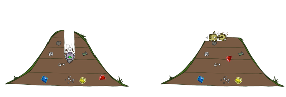
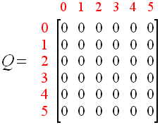
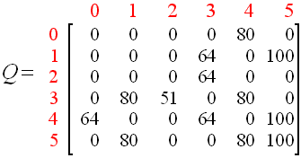
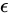
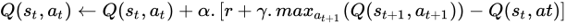
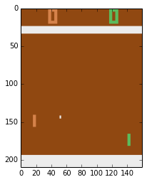

# 人工智能

# 介绍

* * *

在计算机科学中，一个理想的“智能”机器是一个灵活的理性代理，它感知环境并采取行动，以最大化在某个目标上取得成功的机会。

### 什么是合理的

在这里，我们将尝试解释什么是行为合理：

+   最大化实现预定义目标。（预期效用）

+   以效用为目标表达的目标（代表“幸福”的无量纲标量值）

+   合理意味着最大化您的预期效用

拥有一个合理（对我们来说是智能的）决定，只与决策的质量（效用）有关，而不是导致该决定的过程，例如：

+   你给出了正确答案，因为你暴力搜索了所有可能的结果

+   你给出了正确答案，因为你使用了一种时髦的最先进方法

基本上你不关心方法，只关心决定。

随着人工智能领域的发展，曾被认为是智能的东西，在有人发现如何做到之后就不再被认为是智能了。

一个系统是合理的，如果他根据可用信息做出正确的决定。

### 为什么我们只关心合理行为

基本上我们不了解我们的大脑是如何工作的，即使在神经科学和计算能力的当前进展下，我们也不知道大脑是如何工作和做出决定的。

我们唯一知道关于大脑的酷事情是，为了做出正确的决定，**我们需要记忆和模拟**。

### 中心人工智能问题：

1.  推理

1.  知识

1.  规划：对他们的行动进行预测，并选择其中一个

1.  学习

1.  感知

1.  自然语言处理（NLP）

## 代理

* * *

它是一个系统（即：软件程序），通过传感器观察世界，并使用执行器对环境进行操作。它将其活动引导到实现目标。智能代理也可以学习或使用知识来实现其目标。

### 代理类型

有很多类型的代理，但在这里我们将它们分为 2 类。

+   反射代理：不关心其行动的未来影响（只使用 if 表）

+   规划代理：在承诺之前模拟行动后果，使用世界模型。

反射和规划代理都可以是合理的，再次强调我们只关心结果行动，如果行动最大化其预期效用，则它是合理的。

我们需要确定需要哪种类型的代理才能表现出合理行为。

反射或规划代理可能是次优的，但通常规划是一个好主意。

在这本书中，我们将看到许多用于解决规划问题的工具。例如搜索是一种规划工具。

## 搜索问题

* * *

搜索问题找到一个解决方案，这是一系列行动（一个计划），将起始状态转换为目标状态。

搜索类型：

+   无信息搜索：在任何地方继续搜索，直到找到解决方案

+   有信息搜索：具有“信息”的搜索，指示我们是否接近解决方案（启发式）

搜索问题包括以下内容：

1.  一个状态空间：具有进行规划所需的状态

1.  后继函数：对于任何状态 x，返回从 x 到达的一组状态以及一个动作

1.  起始状态和目标测试：提供初始点以及如何在规划结束时进行检查

例如，我们的目标是从阿拉德到布加勒斯特旅行


在上面，您有世界状态，我们不需要那么多细节，我们只需要城市，它们是如何连接的以及距离。


在这个搜索问题上，我们发现了以下属性：

+   状态空间：城市（与此搜索问题有关的唯一变量）

+   起始状态：阿拉德

+   后继函数：以距离为成本前往相邻城市。

将上面的地图视为图，它包含不重复的节点以及它们如何连接以及连接的成本。


规划的一种方式是将状态空间图转换为搜索树，然后使用一些搜索树上目标状态的算法。在这里我们观察到以下事情：

+   起始状态将是树根节点

+   节点子代代表每个状态的可能结果。

问题在于搜索树或状态空间图可能太大而无法放入计算机中，例如以下状态空间图具有无限搜索树。


在这些情况下要做什么，基本上您不保留树或图的所有可能解决方案在内存中，您在树上导航一定深度。


例如，看一下罗马尼亚的状态图，我们从阿拉德（起始状态）开始

+   阿拉德有 3 个可能的子节点，锡比乌，蒂米什瓦拉和泽林德

+   我们选择最左边的子节点锡比乌

+   然后我们选择最左边的子节点阿拉德，这是不好的，所以我们尝试法加拉斯，然后奥拉迪亚等...

问题在于，如果树的一个分支是无限的，或者太大而没有解决方案，我们将继续在其分支上查找直到结束。

在我们第一步选择锡比乌时，我们需要保留其他可能的节点（蒂米什瓦拉和泽林德），这称为树边缘。

在树搜索中要牢记的重要思想：

+   首先，树搜索是用于规划的机制

+   规划意味着您有一个世界模型，如果模型不好，您的解决方案也会不好

+   边缘：或其他可能解决方案的缓存

+   如何探索当前分支

## 分支因子

* * *

分支因子是树上每个节点的子节点数。


旧问题，如井字游戏或其他简单问题，可以使用搜索树或某种优化的树算法解决。但是国际象棋或围棋等游戏的分支因子非常大，因此您无法实时处理它们。

在下面的动画中，我们比较了国际象棋和围棋的分支因子。


## 下一章

* * *

在下一章中，我们将更多地探讨树。

# OpenAI Gym

# OpenAI Gym

## 介绍

# 树搜索

# 树搜索

## 介绍

* * *

在本章中，我们将学习一些进行树搜索的方法。只是从介绍中记住，树搜索是规划的一种机制之一。规划意味着代理将在一个模型中模拟可能的动作，并选择最大化其效用的动作。



在这一章中，我们将学习以下关于树搜索的技术

+   深度优先搜索（Depth first search）

+   广度优先搜索（Breadth-First search）

+   统一成本搜索（Uniform Cost search）

+   贪婪搜索（Greedy search）

+   A*搜索（A-star search）

如前所述，我们无法将整个树保留在内存中，所以我们所做的是仅在需要时扩展树，并跟踪其他尚未探索的选项。


对于那些仍然在内存中但尚未展开的部分，我们称之为边缘（fringe）。


## 深度优先搜索（Depth first search）

# 马尔可夫决策过程

# 马尔可夫决策过程

## 介绍

* * *

马尔可夫决策过程（MDP）是一个用于帮助在随机环境中做出决策的框架。我们的目标是找到一个策略，即一个将给出我们环境中每个状态的所有最优动作的映射。

MDP 比简单的规划要强大一些，因为你的策略将允许你即使在路上出了问题也能做出最优的动作。简单的规划只是在找到最佳策略后按照计划执行。


### 什么是状态

* * *

将状态视为一个摘要（然后称为状态空间），其中包含确定下一步会发生什么所需的所有信息。有两种类型的状态空间：

+   世界-状态：通常很大，代理无法获得。

+   代理-状态：更小，具有所有与代理期望效用相关的做出决策所需的变量。

### 马尔可夫性质

* * *

基本上，你不需要过去的状态来做出最优的决策，你所需要的只是当前状态 。这是因为你可以在当前状态中编码出你需要的过去来做出好的决策。然而历史是重要的...

### 环境

* * *

为了简化我们的宇宙，想象一下网格世界，在这里你的代理目标是到达绿色方块，并避免红色方块。你可以执行的操作是：


问题在于我们并不生活在一个完美确定性的世界，所以我们的行动可能会产生不同的结果：


例如，当我们选择向上行动时，我们有 80%的概率实际向上行动，以及 10%的概率向左或向右行动。此外，如果你选择向左或向右行动，你有 80%的机会向左行动，10%的机会向上或向下行动。

以下是最重要的部分：

+   状态：一组可能的状态！[](3e20d922.png)

+   模型： 当你在状态  上执行动作  时，前往状态  的概率，也称为转移模型。

+   动作：，你可以在特定状态下执行的操作！[](15b18eec.png)

+   奖励：，处于某个状态时获得的标量值。

+   策略：！[](b324d96.png)，我们的目标，是一个告诉每个状态最优动作的映射

+   最优策略：！[](8199e226.png)，是最大化你的期望奖励！[](e4b7b91.png)

在强化学习中，我们将通过试错法学习最优策略。

# 强化学习

# 强化学习

## 介绍

* * *

在本章中，我们将学习强化学习（Rl）的基础知识。基本上，一个 RL 代理与解决给定图形的 MDP 不同，它对环境一无所知，它通过探索环境学习该做什么。它使用动作，并接收状态和奖励。你只能通过动作改变你的环境。

强化学习的一个重大困难是一些动作需要时间才能产生奖励，学习这种动态可能具有挑战性。此外，环境接收到的奖励与上一动作无关，而是与过去的某些动作相关。

一些概念：

+   代理在环境中采取行动并接收状态和奖励

+   目标是找到一个策略！[](91190153.png)，使其效用函数最大化！[](2165b7f1.png)

+   受心理学和动物学习研究启发


在这里，我们不知道哪些动作会产生奖励，同时我们也不知道何时会产生奖励，有时你会做一个需要时间才能产生奖励的动作。

基本上所有内容都是通过与环境的交互学习的。

强化学习组成部分：

+   代理：我们的机器人

+   环境：游戏，或者代理所在的地方。

+   一组状态！[](c93c5d9f.png)

+   策略：状态到动作的映射

+   奖励函数！[](bb0b4258.png)：为每个状态提供即时奖励

+   值函数：给出代理从特定状态到所有可能状态的总奖励量。通过值函数可以找到一个策略。

+   模型！[](d38145c9.png)（可选）：用于规划，而不是强化学习常见的简单试错方法。这里的！[](503136bb.png)表示在状态！[](15b18eec.png)上执行动作！[](3238ebd4.png)后可能的状态

在我们的想法中，我们仍然认为有一个马尔可夫决策过程（MDP），它有：


我们正在寻找一个策略！[](4b9d31fb.png)，这意味着一个能为我们提供每个状态最优动作的映射

唯一的问题是我们现在没有明确的！[](d38145c9.png)或！[](bb0b4258.png)，所以我们不知道哪些状态是好的或者动作的作用是什么。学习这些东西的唯一方法是尝试并从样本中学习。

在强化学习中，我们知道我们可以快速或缓慢移动（动作），以及我们是凉爽的、温暖的还是过热的（状态）。但我们不知道我们的动作在改变状态方面的作用。


## 离线（MDPs）与在线（RL）

* * *

另一个区别是，尽管正常的 MDP 规划代理人通过搜索和模拟（规划）找到最佳解决方案。Rl 代理通过反复试验学习，因此在知道不应该做某事之前会做一些坏事。此外，要学习某事是真正糟糕还是好，代理人将重复很多次。


## 它是如何工作的

* * *

我们将通过经验学习行动的近似作用以及我们获得的奖励。例如，我们可以随机执行操作

### 晚期奖励

* * *

我们通过随着时间的推移给予一些负面奖励的折扣来尽快使 MDP 具有良好的奖励。基本上，您通过随着时间的推移给予更多负值来调节您的代理程序有多么急迫。

还可以通过给出代理程序的时间量来改变代理程序的行为。


### 探索与开发

* * *

强化学习面临的问题之一是探索与开发的困境。

+   开发：根据我们已经知道的知识做出最佳决策（例如：选择具有最大 Q 值的动作）

+   探索：通过从已知状态进行不同（随机）操作来收集更多信息。

例如：餐厅

+   开发：在饥饿时去最喜欢的餐厅（给出已知奖励）

+   探索：尝试新餐厅（可能会带来更多奖励）

保持始终进行一些探索的一种技术是使用  探索，在采取行动之前添加一些随机因素。

# Q_Learning_Simple

# Q_Learning_Simple

## 介绍

* * *

Q_Learning 是一种无模型的强化学习技术。在这里，我们有兴趣通过与环境的经验找到动作值函数 Q。当找到 Q 函数时，我们可以通过选择给出最大期望效用（奖励）的动作来实现最佳策略。

## 简单示例

* * *

考虑一个需要学习如何以最佳路径离开房子的机器人，例如，在这个例子中，我们有一个有 5 个房间和一个“出口”房间的房子。


上面我们展示了房屋，植物以及代表它的图。在这个图上，所有房间都是节点，箭头是可以在每个节点上采取的行动。箭头值是代理人在特定房间采取某些行动时立即获得的即时奖励。我们选择我们的强化学习环境为不是出口房间的所有房间提供 0 奖励。在我们的目标房间上，我们给出 100 奖励。

总结一下

+   动作：0,1,2,3,4,5

+   状态：0,1,2,3,4,5

+   奖励：0,100

+   目标状态：5

我们可以在奖励表上表示所有这些机制。


在此表中，行代表房间，列代表动作。此矩阵中的值代表奖励，值（-1）表示某些特定动作不可用。

例如，查看这个矩阵的第 4 行会得到以下信息：

+   可用动作：去 0,3,5 号房间

+   从房间 4 可能获得的奖励：0（房间 4 到 0）、0（房间 4 到 3）、100（房间 4 到 5）

Q 学习的整个重点在于矩阵 R 仅对环境可用，代理需要通过经验自己学习 R。

代理将拥有一个编码状态、动作、奖励的 Q 矩阵，但是初始化为零，并通过经验变得像矩阵 R 一样。



正如在前几章中所看到的，当我们找到 Q 矩阵后，我们有了一个最佳策略，我们就完成了。基本上，我们只需要使用 Q 表来选择给出最佳预期奖励的动作。您还可以将 Q 表想象为代理通过经验学到的知识的记忆。

### 算法解释

* * *

作为一个快速提醒，让我们描述一下 Q 学习算法的步骤

1.  用零初始化 Q 矩阵

1.  选择一个随机的初始状态

1.  对于每一集（从初始状态开始并以目标状态结束的一组动作）

    +   当状态不是目标状态时

        1.  为当前状态选择一个随机可能的动作

        1.  使用这个可能的动作考虑去到这个下一个状态

        1.  获取下一个状态的最大 Q 值（来自该下一个状态的所有动作）

        1.  

当我们有一个良好的 Q 表时，我们只需要遵循它：

1.  设置当前状态=初始状态。

1.  从当前状态中找到具有最高 Q 值的动作

1.  设置当前状态=下一个状态（选择的动作的状态）。

1.  重复步骤 2 和 3 直到当前状态=目标状态。

### Q 学习手册

* * *

让我们通过手工进行一些剧集来练习我们到目前为止所学到的知识。考虑和我们的初始节点（状态）为“房间 1”

由于我们没有任何先前的经验，我们从零开始构建我们的 Q 矩阵


现在看一下我们的奖励表（环境的一部分）


#### 第 1 集

由于我们从状态“房间 1”（第二行）开始，只有动作 3（奖励 0）或 5（奖励 100）可以执行，假设我们随机选择了动作 5。


在这个新的（下一个状态 5）上有 3 个可能的动作：1、4 或 5，它们的奖励分别为 0、0、100。基本上是从行“5”中得到的所有正值，我们只对具有最大值的值感兴趣。我们需要通过选择 Q(5,1)、Q(5,4)、Q(5,5)来选择具有这些可能动作的最大 Q 值，然后使用“max”函数。但请记住，在这个状态下，Q 表仍然填充有零。


由于新状态为 5 且此状态为目标状态，我们结束了本集。现在在本集结束时，Q 矩阵将为：


#### 第 2 集

在这个新状态上，我们随机选择了状态“房间 3”，通过查看 R 矩阵，我们在这个状态上有 3 个可能的动作，现在我们偶然选择了动作 1


通过选择动作“1”作为我们的下一个状态，现在将有以下可能的动作


现在让我们更新我们的 Q 表：


由于我们的新当前状态 1 不是目标状态，我们继续这个过程。现在，从状态 1 的可能动作中，我们偶然选择了动作 5\. 从动作 5 开始，我���有可能的动作：1,4,5 [Q(5,1), Q(5,4), Q(5,5)] 不幸的是，我们尚未计算这些值，我们的 Q 矩阵保持不变。

#### 第 100000 轮次

经过许多轮次后，我们的 Q 矩阵可以被认为已经收敛，在这种情况下，Q 将会是这样的：


如果我们将所有非零元素除以它的最大值（在这种情况下为 500），我们就可以对 Q 表进行归一化（可选）：



### 收敛的 Q 表应该怎么处理。

* * *

现在有了良好的 Q 表，想象一下我们从状态“房间 2”开始。如果我们继续选择给出最大 Q 值的动作，我们将从状态 2 到 3，然后从 3 到 1，然后从 1 到 5，并保持在 5\. 换句话说，我们选择动作[2,3,1,5]。

只需注意一点。在状态 3 时，我们有选择动作 1 或 4 的选项，因为两者具有相同的最大值，我们选择动作 1\. 但另一个动作也会给出相同的累积奖励。[0+0+100]


### 在 Matlab 中解决这个例子

* * *

现在我们准备在计算机上将这些东西混合在一起，我们将开发两个函数，一个用于代表我们的代理，另一个用于环境。


#### 环境

* * *

我们首先对环境进行建模。这部分接收代理的动作并反馈即时奖励和状态信息。这个状态实际上是在进行某些动作后环境的状态。只需记住，如果我们的系统是马尔可夫的，选择最佳未来动作所需的所有信息都编码在这个状态中。

注意环境具有矩阵 R 和完全实现宇宙所需的所有模型。例如，环境可以是一个游戏，我们的真实世界（Grid World）等等...

```
function [ reward, state ] = simple_RL_enviroment( action, restart )
% Simple enviroment of reinforcement learning example
%   http://mnemstudio.org/path-finding-q-learning-tutorial.htm
persistent current_state
if isempty(current_state)
    % Initial random state (excluding goal state)
    current_state = randi([1,5]);     
end

% The rows of R encode the states, while the columns encode the action
R = [ -1 -1 -1 -1  0  -1; ...
    -1 -1 -1  0 -1 100; ...
    -1 -1 -1  0 -1  -1; ...
    -1  0  0 -1  0  -1; ...
    0 -1 -1  0 -1 100; ...
    -1  0 -1 -1  0 100 ];

% Sample our R matrix (model)
reward = R(current_state,action);

% Good action taken
if reward ~=-1
    % Returns next state (st+1)
    current_state = action;        
end

% Game should be reseted
if restart == true
    % Choose another initial state
    current_state = randi([1,5]); 
    reward = -1;
    % We decrement 1 because matlab start the arrays at 1, so just to have
    % the messages with the same value as the figures on the tutorial we
    % take 1....
    fprintf('Enviroment initial state is %d\n',current_state-1);
end

state = current_state;
end 
```

#### 代理

* * *

现在在代理方面，我们必须训练以从环境中获取经验。之后，我们使用我们学到的 Q 表来进行最优行动，这意味着只需按照 Q 表寻找能够获得最大预期奖励的动作。正如您所期望的那样，代理通过“simple_RL_enviroment”函数与外部世界进行交互。

```
function [ Q ] = simple_RL_agent( )
% Simple agent of reinforcement learning example
%   http://mnemstudio.org/path-finding-q-learning-tutorial.htm
% Train, then normalize Q (divide Q by it's biggest value)
Q = train(); Q = Q / max(Q(:));
% Get the best actions for each possible initial state (1,2,3,4,5)
test(Q);
end

function Q = train()
% Initial training parameters
gamma = 0.8;
goalState=6;
numTrainingEpisodes = 20;
% Set Q initial value
Q = zeros(6,6);

% Learn from enviroment iteraction
for idxEpisode=1:numTrainingEpisodes
    validActionOnState = -1;
    % Reset environment
    [~,currentState] = simple_RL_enviroment(1, true);

    % Episode (initial state to goal state)
    % Break only when we reach the goal state
    while true
        % Choose a random action possible for the current state
        while validActionOnState == -1
            % Select a random possible action
            possibleAction = randi([1,6]);

            % Interact with enviroment and get the immediate reward
            [ reward, ~ ] = simple_RL_enviroment(possibleAction, false);
            validActionOnState = reward;
        end
        validActionOnState = -1;

        % Update Q
        % Get the biggest value from each row of Q, this will create the
        % qMax for each state
        next_state = possibleAction;
        qMax = max(Q,[],2);
        Q(currentState,possibleAction) = reward + ...
            (gamma*(qMax(next_state)));

        if currentState == goalState
            break;
        end

        % Non this simple example the next state will be the action
        currentState = possibleAction;
    end
    fprintf('Finished episode %d restart enviroment\n',idxEpisode);
end
end

function test(Q)
    % Possible permuted initial states, observe that you don't include the
    % goal state 6 (room5)
    possible_initial_states = randperm(5);
    goalState=6;

    % Get the biggest action for every state
    [~, action_max] = max(Q,[],2);

    for idxStates=1:numel(possible_initial_states)
        curr_state = possible_initial_states(idxStates);
        fprintf('initial state room_%d actions=[ ', curr_state-1);
        % Follow optimal policy from intial state to goal state
        while true
            next_state = action_max(curr_state);
            fprintf(' %d,', next_state-1);
            curr_state = next_state;
            if curr_state == goalState
                fprintf(']');
               break 
            end
        end
        fprintf('\n');
    end
end 
```

# 深度 Q 学习

# 深度 Q 学习


## 介绍

* * *

在前一章中，我们学习了关于“老派”Q 学习，我们使用矩阵来表示我们的 Q 表。这在某种程度上意味着您至少知道环境中有多少个状态（行），问题是有时这并不成立。


在这个 Q 表中，我们可以说在状态 3 时采取动作 1 的期望获胜率为 80\。较大的 Q 值意味着我们期望获胜。

我们还学到了强化学习是关于在某个环境中学习如何行为，我们唯一的反馈是一些稀疏的、时间延迟的“标签”，称为奖励。它们是时间延迟的，因为有些情况下环境只会告诉你，你的动作是好是坏，一段时间后你才会移动。

## 继续之前的一些形式化

* * *

### 剧集：

考虑到我们的环境是“马尔可夫”的，这意味着我们的状态编码了需要做出决策的一切。我们将一个剧集（游戏）定义为状态、动作和奖励的有限集。


例如，在这里“”表示我们通过在状态上采取动作而获得的奖励。一个剧集总是在一个结束状态（游戏结束）结束。

### 策略

策略被定义为从状态到动作的“映射”，找到最优策略是强化学习的目标。最优策略可以从 Q 函数导出。

### 回报或未来总奖励

我们将回报定义为剧集中所有即时奖励的总和。这意味着直到剧集结束的所有奖励的总和。


### 未来折扣奖励

为了给予某种灵活性，我们在我们的总奖励中添加了一个称为 gamma()的参数。如果 gamma=0，所有未来奖励都将被丢弃，如果 gamma=1，所有未来奖励都将被考虑。


### Q 函数

我们将函数 Q(s,a)定义为我们可以获得的最大预期“未来折扣奖励”，如果我们在状态“s”上采取一个动作“a”，并从那一点开始继续进行最佳操作，直到剧集结束。当我们说“继续最优”时，意味着我们继续从 Q 导出的策略中选择动作。


下面我们展示如何从 Q 函数中导出策略，基本上我们希望在状态"s"上给出最大 Q 值的动作：


函数""将搜索最大化 Q(s,a)的动作"a"。您可以认为 Q 函数是“在状态 s 执行动作 a 后游戏结束时的最佳得分”。所以如果你有了 Q 函数，你就有了赢得所有游戏所需的一切！

### 贪心策略

如果我们选择一个“始终”最大化“折扣未来奖励”的动作，你就是在贪心行为。这意味着你不在探索，可能会错过一些更好的动作。这就是所谓的探索-利用问题。为了解决这个问题，我们使用一种称为的算法，其中一个小概率会时不时地选择一个完全随机的动作。


### 如何获得 Q 函数

基本上我们通过经验来获得 Q 函数，使用一个称为贝尔曼方程的迭代过程。



就算法而言。一开始估计的 Q(s,a)将是错误的，但随着时间的推移，与环境的经验将给出一个真实的“r”，这个奖励将慢慢地塑造我们对真实 Q(s,a)的估计。

## 深度 Q 网络

* * *

深度 Q 学习是关于使用深度学习技术来表示 Q 表。它也是一种在游戏中使用 Q 学习的配方。

### 输入

此配方的第一步是获取我们的输入，正如我们可能想象的那样，我们直接从屏幕上获取信息。为了增加时间的概念，我们实际上获取了 4 个连续的屏幕。

1.  获取图像

1.  调整大小为 84x84

1.  转换为 8 位灰度。

现在我们有 84x84x256x4 的“东西”作为我们的环境状态，这意味着 700 万个状态。为了在这些数据上找到结构，我们将需要一个卷积神经网络！。

### 添加一个卷积神经网络

现在我们将把这个 84x84x4 张量传递给一个 CNN，这个模型将为每个动作输出一个值，这个值将表示每个可能动作的 Q 值。因此，对于每次前向传播，我们将在屏幕上编码一个特定状态的所有可能 Q 值。值得指出的是，这不是一个分类问题，而是一个回归问题，我们的 Q 值输出是一个标量而不是一个类。


在雅达利论文中，这个 CNN 的结构如下：


注意，这里没有池化层，这是因为我们想保留空间信息。

### 损失函数

由于我们的 CNN 是一个回归模型，我们的损失函数将是一个“平方误差损失”


### 如何得到深度 Q 函数

现在，要迭代并使用深度学习找到真正的 Q 值，我们必须遵循：

1.  对当前状态“”(屏幕)进行前向传播，以获取所有可能的 Q 值

1.  对新状态进行前向传播  并找到动作  (具有最大 Q 值的动作)

1.  设置动作的 Q 值目标为 r + γmax a’ Q(s’, a’) (使用步骤 2 中计算的最大值)。对于所有其他动作，将 Q 值目标设置为与步骤 1 中最初返回的相同，使得这些输出的错误为 0。

1.  使用反向传播和小批量随机梯度下降更新网络。

### 这种方法的问题

不幸的是，我们需要解决这种方法的一些问题。但在讨论可能的解决方案之前，让我们检查一下问题是什么。

+   探索-利用问题：这很容易，我们只需在途中添加一些随机动作。(只需使用 )

+   局部最小值：在训练过程中，我们将有许多高度相关的屏幕，这可能会导致您的网络只学习情节的重放。为了解决这个问题，我们需要以某种方式将输入小批量与一些其他播放数据混洗。(当然是同一场游戏但在不同的时间)

### 经验重播

如上所述，我们需要在更新步骤中打破连续帧的相似性。为此，我们将在整个情节期间存储所有游戏经验到一个“重放记忆”中，然后在训练期间我们将随机取一些这个记忆的小批量。你还可以通过在重放记忆中添加一些人类经验来增加一些人类经验。

### 完整配方


完整的 tensorflow 示例可以在[这里](https://github.com/asrivat1/DeepLearningVideoGames)找到。

# 深度强化学习

# 深度强化学习

## 介绍

* * *


在本章中，我们将学习将深度神经网络与强化学习相结合的影响。如果您关注 AI 新闻，您可能听说过一些 AI 没有任何特定编程就无法完成的事情：

+   从原始图像像素学习如何玩 Atari 游戏

+   学会如何击败围棋冠军（巨大的分支因子）

+   机器人学会如何行走

所有这些成就都属于强化学习的范畴，更具体地说是深度强化学习。基本上，所有这些成就都不是由于新算法，而是由于更多的数据和更强大的资源（GPU、FPGA、ASIC）。例如：

+   Atari：旧的 Q-Learning 算法，但使用 CNN 作为函数逼近器（自 1988 年以来人们一直在讨论带有函数逼近器的标准 RL）

+   AlphaGo：使用蒙特卡洛树搜索（MCTS）的策略梯度，这是相当标准的。

现在，策略梯度是攻击强化学习（RL）问题的首选方法。之前是 DQN（深度 Q 学习）。策略梯度的一个优点是因为它可以端到端地学习。

## 策略梯度

* * *

我们将从使用乒乓球游戏的策略梯度开始我们的研究：


在这里，我们有两个可能的动作（上/下），我们的目标是让球越过对手的球拍。我们的输入将是从 210x160x3 图像预处理而来的 80x80x1 图像。我们的游戏环境（openAI gym）将在你赢了对手时给出一个+1 的奖励，输了时给出一个-1 的奖励，否则为 0。


这里每个节点都是一个特定的游戏状态，每条边都是一个可能的转换，同时每条边都可以给出一个奖励。我们的目标是找到一个策略（将状态映射到动作的映射），这将给我们在每个状态上做出的最佳动作。整个问题的关键是我们不知道这个图，否则整个事情就会变成一个反射性代理，有时我们无法将所有这些内容都放入内存中。

### 预处理

* * *

在这个乒乓球的例子中，我们对原始的 210x160x3（RGB）图像进行一些操作，转换成一个更简单的灰度图 80x80\. 这样做是为了简化神经网络的大小。

Before



After


为了给网络一些时间概念，计算了当前图像和上一张图像之间的差异。（在 DQN 论文中使用了一个具有 6 个图像样本的卷积神经网络）

### 策略网络

* * *

基本思想是使用一个机器学习模型从游戏中学习一个良好的策略，并获得奖励。所以添加了机器学习部分。我们将定义一个策略网络（例如：2 层神经网络）。这个简单的神经网络将接收整个图像并输出向上移动的概率。


计算完上升概率后，我们从均匀分布中采样一个动作（UP/DOWN）。


### 策略梯度

* * *

监督学习和强化学习之间的一个区别是，我们没有正确的标签来计算错误，然后进行反向传播。这就是策略梯度思想的地方。想象以下例子：


在训练过程中，我们的策略网络给出了“UP”的概率为 30%（0.3），因此我们的“DOWN”概率将为 100-30=70%（0.7）。在从这个分布中采样动作时，选择了“DOWN”动作。现在我们做的是选择一个单位梯度“1”，等待可能的奖励（0，+1，-1）。这将调节我们的梯度到 3 个可能的值：

+   Zero: 我们的权重将保持不变

+   正：使网络更有可能在未来重复此操作

+   负：使网络在未来更不可能重复此操作

所以这就是策略梯度的魔力，我们选择一个单位梯度，并用我们的奖励调节。经过大量良好/糟糕的动作选择并适当奖励后，策略网络映射出一个“合理/最优”的策略。

### 实现说明

* * *

在这里，我们展示了如何将我们的策略网络初始化为一个 2 层神经网络，第一层有 200 个神经元，第二输出层有 1 个神经元。


在上面的代码中，D 是我们经过预处理的输入差异图像，H 是隐藏层中的神经元数量。

在下面，我们有这个网络前向传播的 Python 代码（policy_forward），在这个神经网络上我们没有使用偏置，但你可以使用。


从上面的代码中，我们有两组权重 W1，W2。其中 W1 或隐藏层的权重可以检测图像中的状态（球在球拍上方/下方），而 W2 可以决定在这些状态下做什么（向上/向下动作）。所以现在唯一的问题是找到 W1 和 W2，使之导致专家（合理）策略。

实际上，我们进行前向传播，得到了在输入图像“x”中执行“UP”动作的得分。然后，根据这个“得分”，我们“抛一枚偏倚的硬币”，来实际执行我们的 Atari 摇杆动作（UP-2，Down-5）。

通过这样做，我们希望有时我们会做出一个好的动作，如果我们这样做了很多次，我们的策略网络就会学习。


### 训练策略网络

* * *

1.  首先，我们将随机初始化 W1，W2。

1.  然后我们将进行 20 局游戏（一轮）。

1.  跟踪所有游戏及其结果（胜利/失败）

1.  在配置的一定轮次后，我们更新我们的策略网络

假设每个游戏有 200 帧，每个剧集有 20 个游戏，我们每剧集需要做 4000 个决定（上/下）。 假设我们运行 100 个游戏，我们赢了 12 个（+1），我们输了 88 个（-1）。 我们需要做所有的 12x200=2400 个决定，并进行正(+1)更新。（这将鼓励将来在相同的检测到的状态下采取这些动作）。 现在，所有 88x200=17600 个使我们输掉游戏的决定，我们进行负(-1)更新。


网络现在会稍微更有可能重复有效的动作，并且稍微不太可能重复无效的动作。

### 关于策略梯度的一些话

* * *

策略梯度，是当前（2016 年）的前沿技术，但仍然与人类推理相去甚远。 例如，你不需要撞车数百次才开始避免它。 策略梯度需要大量样本才能开始内化正确的动作，并且它必须不断获得相应的奖励。 你可以想象，你正在进行一种“蛮力”搜索，在开始时我们会随机尝试一些动作，偶然地我们做了一个好动作。 而且这些好的动作在策略网络开始重复好动作之前应该被重复数百次。 这就是为什么代理需要在开始真正表现良好之前进行 3 天的训练。

当策略梯度将发挥作用时：

+   当问题不依赖于非常长期的规划时

+   当它接收到针对好/坏动作的频繁奖励信号时。

如果动作空间开始变得太复杂（有很多动作命令），还有其他变体，比如“确定性策略梯度”。 这个变体使用另一个称为“评论者”的网络来学习评分函数。
