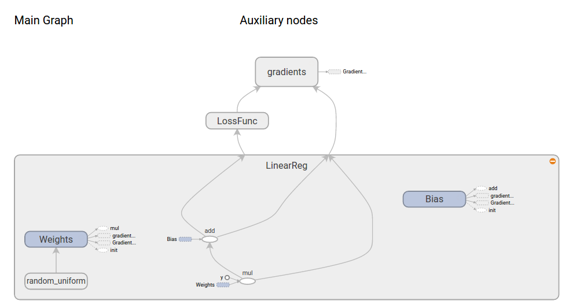

# 附录

# 介绍

* * *

在本章中，我们将学习基础知识，以更好地理解本书。将介绍以下主题：

+   Lua，Torch

+   Tensorflow

+   Python，numpy

+   Matlab

# Lua 和 Torch

# 介绍

* * *

在本书中，我强调了了解如何编写自己的深度学习/人工智能库的重要性。但特别是在研究某个主题时，理解最常见的库也非常重要。本章将教授 Torch 的基础知识，但在此之前我们也将学习 Lua。

## Lua 语言

* * *

Lua 最初是为嵌入式系统而创建的，其想法是拥有一个简单的跨平台和快速的语言。Lua 的主要特点之一是它与 C/C++的轻松集成。

Lua 最初于 1993 年设计为一种用于扩展软件应用程序的语言，以满足当时对定制的增加需求。

此扩展意味着您可以在一个大型的 C/C++程序中，某些部分使用 Lua，而无需重新编译所有内容。

## Torch

* * *

Torch 是一个基于 Lua 的科学计算框架，具有 CPU 和 GPU 后端。您可以将其想象成带有 CPU 和 GPU 实现的 Numpy。一些很棒的功能：

+   有效的线性代数函数，支持 GPU

+   神经网络包，带有自动微分（无需手动反向传播）

+   多 GPU 支持

## 与 Lua 的初次接触

* * *

下面我们将看到一些关于 Lua 的简单示例，只是为了对这种语言有一些接触。

```
print("Hello World") -- First thing, note that there is no main...
--[[
This is how we do a multi-line comment
on lua, to execute a lua program just use...
lua someFile.lua
]] 
```

```
someVar = "Leonardo"
io.write("Size of variable is ", #someVar, " and it's value is: \"", someVar, "\"\n")
-- Variables on lua are dynamically typed...
someVar = 10; -- You can use ";" to end a statement
io.write("Now it's value is:\"", someVar, "\"") 
```

### Lua 数据类型

* * *

该语言提供了这些基本类型：

+   数字（浮点数）

+   字符串

+   布尔值

+   表

```
print(type(someVar))
someVar = 'Leonardo' -- Strings can use use simple quotes
print(type(someVar))
someVar = true
print(type(someVar))
someVar = {1,2,"leo",true}
print(type(someVar)) 
```

### 进行一些数学运算

* * *

通常我们会依赖 Torch，但 Lua 也具有一些数学支持。

```
io.write("5 + 3 = ", 5+3, "\n")
io.write("5 - 3 = ", 5-3, "\n")
io.write("5 * 3 = ", 5*3, "\n")
io.write("5 / 3 = ", 5/3, "\n")
io.write("5.2 % 3 = ", 5%3, "\n")
-- Generate random number between 0 and 1
io.write("math.random() : ", math.random(0,3), "\n")
-- Print float to 10 decimals
print(string.format("Pi = %.10f", math.pi)) 
```

```
5 + 3 = 8
5 - 3 = 2
5 * 3 = 15
5 / 3 = 1.6666666666667
5.2 % 3 = 2
math.random() : 2
Pi = 3.1415926536 
```

### Lua 包含（require）

* * *

包含其他 Lua 文件的 Lua 语句是"require"，通常用于添加一些库。

```
require 'image'
pedestrian = image.load('./pedestrianSign.png')
itorch.image(pedestrian) 
```


### 条件语句

* * *

仅是简单的 if-then-else。Lua 没有 switch 语句。

```
age = 17
if age < 16 then 
    print(string.format("You are still a kid with %d years old\n", age))
elseif (age == 34) or (age==35) then
    print("Getting old leo...")
else
    print("Hi young man")
end

-- Lua does not have ternary operators
canVote = age > 18 and true or false -- canVote=true if age>18 else canVote=false
io.write("Can I vote: ", tostring(canVote)) 
```

### 循环

* * *

Lua 具有 while、repeat 和 for 循环。for 循环还有一个“for-each”扩展，用于在表上进行迭代。

```
i = 1
while (i <= 10) do
    io.write(i,"\n")
    i = i+1
    if i==4 then break end
end 
```

```
-- Initial value, end value, increment at each loop...
for i=1,3,1 do
    io.write(i,"\n")
end 
```

```
-- Create a table which is a list of items like an array
someTable = {"January", "February", "March", "April",10}

-- Iterate on table months
for keyVar, valueVar in pairs(someTable) do
  io.write(valueVar, "(key=", keyVar, "), ")
end 
```

```
January(key=1), February(key=2), March(key=3), April(key=4), 10(key=5), 
```

### 函数

* * *

在 Lua 中定义函数非常简单，其语法类似于 matlab。

```
-- Function definition
function getSum(a,b)
    return a+b
end

-- Call function
print(string.format("5 + 2 = %d", getSum(5,2))) 
```

### 表

* * *

在 Lua 中，我们使用表来表示其他所有内容（例如：列表、字典、类等）

```
-- tables
dict = {a = 1, b = 2, c = 3} 
list = {10,20,30} 

-- two prints that display the same value
print(dict.a)
print(dict["a"])
-- Tables start with 1 (Like matlab)
print(list[1]) 

-- You can also add functions on tables
tab = {1,3,4}
-- Add function sum to table tab
function tab.sum ()
  c = 0
  for i=1,#tab do
    c = c + tab[i]
  end
  return c
end

print(tab:sum()) -- displays 8 (the colon is used for calling methods) 
-- tab:sum() means tab.sum(tab)
print(tab.sum()) -- On this case it will also work
print(tab) 
```

```
1    
1    
10    
8    
8    
{
  1 : 1
  2 : 3
  3 : 4
  sum : function: 0x4035ede8
} 
```

### 面向对象编程

* * *

Lua 不直接支持面向对象编程，但您可以使用表和元表模拟所有其主要功能（继承、封装）。

元表教程：用于在表上覆盖操作（元方法）。

```
--[[

Create a class "Animal" with properties:height,weight,name,sound
and methods: new,getInfo,saySomething

]]

-- Define the defaults for our table
Animal = {height = 0, weight = 0, name = "No Name", sound = "No Sound"}

-- Constructor
function Animal:new (height, weight, name, sound) 
  -- Set a empty metatable to the table Animal (Crazy whay to create an instance) 
  setmetatable({}, Animal)
  -- Self is a reference to this table instance
  self.height = height
  self.weight = weight
  self.name = name
  self.sound = sound 
  return self
end

-- Some method
function Animal:getInfo() 
  animalStr = string.format("%s weighs %.1f kg, is %.1fm in tall", self.name, self.weight, self.height) 
  return animalStr
end

function Animal:saySomething()
    print(self.sound)
end 
```

```
-- Create an Animal
flop = Animal:new(1,10.5,"Flop","Auau")
print(flop.name) -- same as flop["name"]
print(flop:getInfo()) -- same as flop.getInfo(flop)
print(flop:saySomething())

-- Other way to say the samething
print(flop["name"]) 
print(flop.getInfo(flop))

-- Type of our object
print(type(flop)) 
```

```
Flop    
Flop weighs 10.5 kg, is 1.0m in tall    
Auau    

Flop    
Flop weighs 10.5 kg, is 1.0m in tall    
table 
```

### 文件 I/O

```
-- Open a file to write
file = io.open("./output.txt", "w")

-- Copy the content of the file input.txt to test.txt
for line in io.lines("./input.txt") do
  print(line)
  file:write(string.format("%s from input (At output)\n", line)) -- write on file
end

file:close() 
```

```
Line 1 at input    
Line 2 at input 
```

### 运行控制台命令

```
local t = os.execute("ls")
print(t)
local catResult = os.execute("cat output.txt")
print(catResult) 
```

```
FirstContactTorch.ipynb
input.txt
LuaLanguage.ipynb
output.txt
pedestrianSign.png
plot.png
true    

Line 1 at input from input (At output)
Line 2 at input from input (At output)
true 
```

## 与 Torch 的初次接触

* * *

在本节中，我们将看到如何使用 Torch 进行简单操作，更复杂的内容将在后面处理。

Torch 的一个目标是提供一些 matlab 功能，可以在这里找到一个有用的速查表：

```
-- Include torch library
require 'torch'; -- Like matlab the ";" also avoid echo the output

-- Create a 2x4 matrix
m = torch.Tensor({{1, 2, 3, 4}, {5, 6, 7, 8}})
print(m)

-- Get element at second row and third collumn
print(m[{2,3}]) 
```

```
 1  2  3  4
 5  6  7  8
[torch.DoubleTensor of size 2x4]

7 
```

### 一些矩阵运算

```
-- Define some Matrix/Tensors
a = torch.Tensor(5,3) -- construct a 5x3 matrix/tensor, uninitialized
a = torch.rand(5,3) -- Create a 5x3 matrix/tensor with random values
b=torch.rand(3,4) -- Create a 3x4 matrix/tensor with random values

-- You can also fill a matrix with values (On this case with zeros)
allZeros = torch.Tensor(2,2):fill(0)
print(allZeros)

-- Matrix multiplcation and it's syntax variants
c = a*b 
c = torch.mm(a,b)
print(c)
d=torch.Tensor(5,4)
d:mm(a,b) -- store the result of a*b in c

-- Transpose a matrix
m_trans = m:t()
print(m_trans) 
```

```
 0  0
 0  0
[torch.DoubleTensor of size 2x2]

 0.8259  0.6816  0.3766  0.7048
 1.3681  0.9438  0.7739  1.1653
 1.2885  0.9653  0.5573  0.9808
 1.2556  0.8850  0.5501  0.9142
 1.8468  1.3579  0.7680  1.3500
[torch.DoubleTensor of size 5x4]

 1  5
 2  6
 3  7
 4  8
[torch.DoubleTensor of size 4x2] 
```

### 在 GPU 上执行操作

```
-- Include torch (cuda) library
require 'cutorch'

-- Move arrays to GPU (and convert it's types to cuda types)
a = a:cuda()
b = b:cuda()
d = d:cuda()

-- Same multiplication just different syntax
c = a*b
d:mm(a,b)

print(c) 
```

```
 1.1058  0.6183  1.0518  0.7451
 0.5932  0.8015  0.9441  0.5477
 0.4915  0.8143  0.9613  0.4345
 0.1699  0.6697  0.6656  0.2500
 0.6525  0.6174  0.8894  0.4446
[torch.CudaTensor of size 5x4] 
```

### 绘图

```
Plot = require 'itorch.Plot'

-- Give me 10 random numbers
local y = torch.randn(10) 

-- Get 1d tensor from 0 to 9 (10 elements)
local x = torch.range(0, 9)
Plot():line(x, y,'red' ,'Sinus Wave'):title('Simple Plot'):draw() 
```


### 从 nn 开始（XOR 问题）

```
require "nn"

-- make a multi-layer perceptron
mlp = nn.Sequential();  
-- 2 inputs, one output 1 hidden layer with 20 neurons
inputs = 2; outputs = 1; hiddenUnits = 20; 

-- Mount the model
mlp:add(nn.Linear(inputs, hiddenUnits))
mlp:add(nn.Tanh())
mlp:add(nn.Linear(hiddenUnits, outputs)) 
```

#### 定义损失函数

* * *

在 torch 中，损失函数称为 criterion，因为在这种情况下，我们处理的是二元分类，我们将选择均方误差准则

```
criterion_MSE = nn.MSECriterion() 
```

#### 手动训练

* * *

在这里，我们将反向传播我们的模型，以获得与损失梯度相关的输出 ，然后使用梯度下降来更新参数。

```
for i = 1,2500 do
  -- random sample
  local input= torch.randn(2);     -- normally distributed example in 2d
  local output= torch.Tensor(1);
  -- Create XOR lables on the fly....
  if input[1] * input[2] > 0 then  
    output[1] = -1
  else
    output[1] = 1
  end

  -- Feed to the model (with current set of weights), then calculate a loss
  criterion_MSE:forward(mlp:forward(input), output)

  -- Reset the current gradients before backpropagate (Always do)
  mlp:zeroGradParameters()
  -- Backpropagate the loss to the hidden layer
  mlp:backward(input, criterion_MSE:backward(mlp.output, output))
  -- Update parameters(Gradient descent) with alpha=0.01
  mlp:updateParameters(0.01)
end 
```

#### 测试网络

```
x = torch.Tensor(2)
x[1] =  0.5; x[2] =  0.5; print(mlp:forward(x)) -- 0 XOR 0 = 0 (negative)
x[1] =  0.5; x[2] = -0.5; print(mlp:forward(x)) -- 0 XOR 1 = 1 (positive)
x[1] = -0.5; x[2] =  0.5; print(mlp:forward(x)) -- 1 XOR 0 = 1 (positive)
x[1] = -0.5; x[2] = -0.5; print(mlp:forward(x)) -- 1 XOR 1 = 0 (negative) 
```

```
-0.8257
[torch.DoubleTensor of size 1]

 0.6519
[torch.DoubleTensor of size 1]

 0.4468
[torch.DoubleTensor of size 1]

-0.7814
[torch.DoubleTensor of size 1] 
```

#### 使用优化进行训练

* * *

Torch 提供了一种标准的方法来优化任何函数关于一些参数。在我们的情况下，我们的函数将是网络的损失，给定一个输入和一组权重。训练神经网络的目标是优化权重，以在我们的训练数据集上给出最低的损失。因此，我们将使用 optim 来最小化相对于权重的损失，在我们的训练集上。

```
-- Create a dataset (128 elements)
batchSize = 128
batchInputs = torch.Tensor(batchSize, inputs)
batchLabels = torch.DoubleTensor(batchSize)

for i=1,batchSize do
  local input = torch.randn(2)     -- normally distributed example in 2d
  local label = 1
  if input[1]*input[2]>0 then     -- calculate label for XOR function
    label = -1;
  end
  batchInputs[i]:copy(input)
  batchLabels[i] = label
end 
```

```
-- Get flatten parameters (Needed to use optim)
params, gradParams = mlp:getParameters()
-- Learning parameters
optimState = {learningRate=0.01} 
```

```
require 'optim'

for epoch=1,200 do
  -- local function we give to optim
  -- it takes current weights as input, and outputs the loss
  -- and the gradient of the loss with respect to the weights
  -- gradParams is calculated implicitly by calling 'backward',
  -- because the model's weight and bias gradient tensors
  -- are simply views onto gradParams
  local function feval(params)
    gradParams:zero()

    local outputs = mlp:forward(batchInputs)
    local loss = criterion_MSE:forward(outputs, batchLabels)
    local dloss_doutput = criterion_MSE:backward(outputs, batchLabels)
    mlp:backward(batchInputs, dloss_doutput)    
    return loss,gradParams
  end
  optim.sgd(feval, params, optimState)
end 
```

#### 测试网络

```
x = torch.Tensor(2)
x[1] =  0.5; x[2] =  0.5; print(mlp:forward(x)) -- 0 XOR 0 = 0 (negative)
x[1] =  0.5; x[2] = -0.5; print(mlp:forward(x)) -- 0 XOR 1 = 1 (positive)
x[1] = -0.5; x[2] =  0.5; print(mlp:forward(x)) -- 1 XOR 0 = 1 (positive)
x[1] = -0.5; x[2] = -0.5; print(mlp:forward(x)) -- 1 XOR 1 = 0 (negative) 
```

```
-0.6607
[torch.DoubleTensor of size 1]

 0.5321
[torch.DoubleTensor of size 1]

 0.8285
[torch.DoubleTensor of size 1]

-0.7458
[torch.DoubleTensor of size 1] 
```

# Tensorflow

# Tensorflow

## 介绍

* * *

在本章中，我们将学习关于 tensorflow 的知识，这是谷歌用于机器学习的库。简单来说，它是一个用于数值计算的库，使用图形，图中的节点是操作，而图的边缘是张量。只是为了记住张量，是多维矩阵，将在 tensorflow 图中流动。


创建这个计算图后，它将创建一个会话，可以由多个 CPU、GPU 分布式或非分布式执行。这里是 tensorflow 的主要组件：

1.  变量：在会话之间保留值，用于权重/偏差

1.  节点：操作

1.  张量：从/到节点传递的信号

1.  占位符：用于在程序和 tensorflow 图之间发送数据

1.  会话：执行图形的地方。

TensorFlow 的实现将图定义转换为可执行操作，分布在可用的计算资源上，例如 CPU 或计算机的 GPU 卡。一般来说，您不必明确指定 CPU 或 GPU。如果有 GPU，TensorFlow 将尽可能多地使用您的第一个 GPU 执行操作。

作为“客户端”的工作是使用代码（C/C++或 python）符号地创建这个图，并要求 tensorflow 执行这个图。正如您可能想象的那样，这些“执行节点”的 tensorflow 代码是一些 C/C++、CUDA 高性能代码。（也很难理解）。

例如，在构建阶段通常会创建一个图来表示和训练神经网络，然后在执行阶段重复执行一组训练操作。


### 安装

* * *

如果您已经有一个安装了 python（anaconda 3.5）和 nvidia cuda 驱动程序（7.5）的机器，安装 tensorflow 很简单

```
export TF_BINARY_URL=https://storage.googleapis.com/tensorflow/linux/gpu/tensorflow-0.10.0rc0-cp35-cp35m-linux_x86_64.whl
sudo pip3 install --ignore-installed --upgrade $TF_BINARY_URL 
```

如果您仍然需要安装一些 cuda 驱动程序，请参考[这里](https://www.youtube.com/watch?v=cVWVRA8XXxs)获取说明

### 简单示例

* * *

就像一个 hello world，让我们构建一个仅乘以 2 个数字的图。在这里注意代码的一些部分。

+   导入 tensorflow 库

+   构建图

+   创建一个会话

+   运行会话

还要注意，在这个例子中，我们向模型传递了一些常量值，所以在现实生活中并不那么有用。


### 交换数据

* * *

Tensorflow 允许通过 "placeholders" 与图中的变量交换数据。当我们运行会话 "session.run" 时，这些 placeholders 可以被赋值。想象 placeholders 就像是在运行会话时向图发送数据的一种方式。

```
# Import tensorflow
import tensorflow as tf

# Build graph
a = tf.placeholder('float')
b = tf.placeholder('float')

# Graph
y = tf.mul(a,b)

# Create session passing the graph
session = tf.Session()
# Put the values 3,4 on the placeholders a,b
print session.run(y,feed_dict={a: 3, b:4}) 
```

### 在 tensorflow 上的线性回归

* * *

现在我们将看看如何在 tensorflow 上创建一个线性回归系统

```
 # Import libraries (Numpy, Tensorflow, matplotlib)
import numpy as np
import tensorflow as tf
import matplotlib.pyplot as plt
get_ipython().magic(u'matplotlib inline')

# Create 100 points following a function y=0.1 * x + 0.3 with some normal random distribution
num_points = 100
vectors_set = []
for i in xrange(num_points):
    x1 = np.random.normal(0.0, 0.55)
    y1 = x1 * 0.1 + 0.3 + np.random.normal(0.0, 0.03)
    vectors_set.append([x1, y1])

x_data = [v[0] for v in vectors_set]
y_data = [v[1] for v in vectors_set]

# Plot data
plt.plot(x_data, y_data, 'r*', label='Original data')
plt.legend()
plt.show() 
```


现在我们将实现一个包含函数  和损失函数  的图。损失函数将返回一个标量值，表示我们的数据与模型预测之间所有距离的平均值。

```
 # Create our linear regression model
# Variables resides internally inside the graph memory
W = tf.Variable(tf.random_uniform([1], -1.0, 1.0))
b = tf.Variable(tf.zeros([1.0]))
y = W * x_data + b

# Define a loss function that take into account the distance between
# the prediction and our dataset
loss = tf.reduce_mean(tf.square(y-y_data))

# Create an optimizer for our loss function (With gradient descent)
optimizer = tf.train.GradientDescentOptimizer(0.5)
train = optimizer.minimize(loss) 
```

构建好图后，我们的工作是创建一个会话来初始化所有图中的变量，这在这种情况下就是我们的模型参数。然后我们还需要调用会话 x 次来训练我们的模型。

```
 # Run session
# Initialize all graph variables
init = tf.initialize_all_variables()
# Create a session and initialize the graph variables (Will acutally run now...)
session = tf.Session()
session.run(init)

# Train on 8 steps
for step in xrange(8):
    # Optimize one step
    session.run(train)
    # Get access to graph variables(just read) with session.run(varName) 
    print("Step=%d, loss=%f, [W=%f b=%f]") % (step,session.run(loss),session.run(W),session.run(b))

# Just plot the set of weights and bias with less loss (last)
plt.plot(x_data, y_data, 'ro')
plt.plot(x_data, session.run(W) * x_data + session.run(b))
plt.xlabel('x')
plt.ylabel('y')
plt.legend()
plt.show()

# Close the Session when we're done.
session.close() 
```


### 加载数据

* * *

在 tensorflow 中几乎完全由你自己来加载数据，这意味着你需要自己解析数据。例如，图像分类的一个选项可能是有包含所有图像文件名及其类别的文本文件。例如：

trainingFile.txt

```
image1.png 0
image2.png 0
image3.png 1
image4.png 1
image5.png 2
image6.png 2 
```

加载数据的常见 API 可能是这样的。

```
 train_data, train_label = getDataFromFile('trainingFile.txt')
val_data, val_label = getDataFromFile('validationFile.txt')

## Give to your graph through placeholders... 
```

### Tensorboard

* * *

Tensorflow 提供了一个解决方案来帮助可视化图中发生的事情。这个工具叫做 Tensorboard，基本上是一个网页，你可以通过检查变量、节点连接等来调试你的图。


为了使用 tensorboard，你需要在图上注释你想要检查的变量，即：损失值。然后你需要生成所有摘要，使用函数 tf.merge_all_summaries()。

可选地，你还可以使用函数 "tf.name_scope" 来将图中的节点分组。

在所有变量都被注释并配置好摘要后，你可以去控制台调用：

```
tensorboard --logdir=/home/leo/test 
```

考虑到前面的例子，这里需要做出改变以向 tensorboard 添加信息。

1) 首先我们在感兴趣的图上注释信息，以便在构建阶段进行检查。然后调用 merge_all_summaries()。在我们的情况下，我们注释了损失（标量）和 W、b（直方图）。

```
 # Create our linear regression model
# Variables resides internally inside the graph memory

#tf.name_scope organize things on the tensorboard graphview
with tf.name_scope("LinearReg") as scope:
    W = tf.Variable(tf.random_uniform([1], -1.0, 1.0), name="Weights")
    b = tf.Variable(tf.zeros([1.0]), name="Bias")
    y = W * x_data + b

# Define a loss function that take into account the distance between
# the prediction and our dataset
with tf.name_scope("LossFunc") as scope:
    loss = tf.reduce_mean(tf.square(y-y_data))

# Create an optimizer for our loss function
optimizer = tf.train.GradientDescentOptimizer(0.5)
train = optimizer.minimize(loss)

#### Tensorboard stuff
# Annotate loss, weights and bias (Needed for tensorboard)
loss_summary = tf.scalar_summary("loss", loss)
w_h = tf.histogram_summary("W", W)
b_h = tf.histogram_summary("b", b)

# Merge all the summaries
merged_op = tf.merge_all_summaries() 
```

2) 在创建会话期间，我们需要添加一个调用 "tf.train.SummaryWriter" 来创建一个写入器。你需要传递一个目录，tensorflow 将在其中保存摘要。

```
 # Initialize all graph variables
init = tf.initialize_all_variables()

# Create a session and initialize the graph variables (Will acutally run now...)
session = tf.Session()
session.run(init)

# Writer for tensorboard (Directory)
writer_tensorboard = tf.train.SummaryWriter('/home/leo/test', session.graph_def) 
```

3) 然后当我们执行我们的图时，例如在训练期间，我们可以要求 tensorflow 生成一个摘要。当然，每次调用这个函数都会影响性能。为了管理这个问题，你可以在每个 epoch 结束时调用这个函数。

```
 for step in xrange(1000):
    # Optimize one step
    session.run(train)

    # Add summary (Everytime could be to much....)
    result_summary = session.run(merged_op)    
    writer_tensorboard.add_summary(result_summary, step) 
```

#### 在 tensorboard 上的结果

* * *

在这里我们可以看到我们的线性回归模型作为一个计算图。

下面我们可以看到损失在每次迭代中的演变。


有时 ipython 会保存您的图的版本，当使用 tensorboard 时会出现问题，解决方法之一是重新启动内核，如果出现问题。

## 使用 GPU

* * *

Tensorflow 还允许您使用 GPU 执行图形或图形的特定部分。

在常见的机器学习系统上，你可能会有一个多核 CPU，配备一个或多个 GPU，tensorflow 将它们表示如下

+   "/cpu:0": 多核 CPU

+   "/gpu0": 第一个 GPU

+   "/gpu1": 第二个 GPU

不幸的是，tensorflow 没有官方函数来列出系统上可用的设备，但有一种非官方的方法。

```
from tensorflow.python.client import device_lib
def get_devices_available():
    local_device_protos = device_lib.list_local_devices()
    return [x.name for x in local_device_protos] 
```

```
print(get_devices_available()) 
```

```
['/cpu:0', '/gpu:0', '/gpu:1'] 
```

### 将图固定到设备

* * *

在 Python 中使用 "with tf.device('/gpu:0')" 语句将此图块上的所有节点锁定到特定的 GPU。

```
import tensorflow as tf

# Creates a graph.
with tf.device('/gpu:0'):
    a = tf.constant([1.0, 2.0, 3.0, 4.0, 5.0, 6.0], shape=[2, 3], name='a')
    b = tf.constant([1.0, 2.0, 3.0, 4.0, 5.0, 6.0], shape=[3, 2], name='b')
    c = tf.matmul(a, b)

# Creates a session with log_device_placement set to True, this will dump 
# on the log how tensorflow is mapprint the operations on devices
sess = tf.Session(config=tf.ConfigProto(log_device_placement=True))
# Runs the op.
print(sess.run(c))
sess.close() 
```

```
[[ 22\.  28.]
 [ 49\.  64.]] 
```

## 多 GPU 和训练

* * *

现在我们将解释如何在多 GPU 系统上进行训练。


多 GPU 训练的基本步骤如下：

1.  将训练数据像往常一样分成批次

1.  在每个 GPU 中创建模型的副本

1.  为每个 GPU 分配不同的批次

1.  每个 GPU 将转发批次并计算其梯度

1.  每个 GPU 将梯度发送到 CPU

1.  CPU 将平均每个梯度，并进行梯度下降。模型参数将根据所有模型副本上平均的梯度进行更新。

1.  CPU 将新模型分发到所有 GPU

1.  再次循环该过程，直到所有训练完成

# 多层感知器 MNIST

# 多层感知器 MNIST

## 加载 tensorflow 库和 MNIST 数据

```
import tensorflow as tf

# Import MNIST data
from tensorflow.examples.tutorials.mnist import input_data
mnist = input_data.read_data_sets("/tmp/data/", one_hot=True)

print('Test shape:',mnist.test.images.shape)
print('Train shape:',mnist.train.images.shape) 
```

```
Extracting /tmp/data/train-images-idx3-ubyte.gz
Extracting /tmp/data/train-labels-idx1-ubyte.gz
Extracting /tmp/data/t10k-images-idx3-ubyte.gz
Extracting /tmp/data/t10k-labels-idx1-ubyte.gz
Test shape: (10000, 784)
Train shape: (55000, 784) 
```

## 神经网络参数

```
# Parameters
learning_rate = 0.001
training_epochs = 15
batch_size = 100
display_step = 1

# Network Parameters
n_hidden_1 = 256 # 1st layer number of features
n_hidden_2 = 256 # 2nd layer number of features
n_input = 784 # MNIST data input (img shape: 28*28)
n_classes = 10 # MNIST total classes (0-9 digits) 
```

## 构建图

```
x = tf.placeholder("float", [None, n_input])
y = tf.placeholder("float", [None, n_classes]) 
```

```
# Create model
def multilayer_perceptron(x, weights, biases):
    # Use tf.matmul instead of "*" because tf.matmul can change it's dimensions on the fly (broadcast)
    print( 'x:', x.get_shape(), 'W1:', weights['h1'].get_shape(), 'b1:', biases['b1'].get_shape())        
    # Hidden layer with RELU activation
    layer_1 = tf.add(tf.matmul(x, weights['h1']), biases['b1']) #(x*weights['h1']) + biases['b1']
    layer_1 = tf.nn.relu(layer_1)

    # Hidden layer with RELU activation
    print( 'layer_1:', layer_1.get_shape(), 'W2:', weights['h2'].get_shape(), 'b2:', biases['b2'].get_shape())        
    layer_2 = tf.add(tf.matmul(layer_1, weights['h2']), biases['b2']) # (layer_1 * weights['h2']) + biases['b2'] 
    layer_2 = tf.nn.relu(layer_2)

    # Output layer with linear activation
    print( 'layer_2:', layer_2.get_shape(), 'W3:', weights['out'].get_shape(), 'b3:', biases['out'].get_shape())        
    out_layer = tf.matmul(layer_2, weights['out']) + biases['out'] # (layer_2 * weights['out']) + biases['out'] 
    print('out_layer:',out_layer.get_shape())

    return out_layer 
```

### 初始化权重并构建模型

```
# Store layers weight & bias
weights = {
    'h1': tf.Variable(tf.random_normal([n_input, n_hidden_1])),    #784x256
    'h2': tf.Variable(tf.random_normal([n_hidden_1, n_hidden_2])), #256x256
    'out': tf.Variable(tf.random_normal([n_hidden_2, n_classes]))  #256x10
}
biases = {
    'b1': tf.Variable(tf.random_normal([n_hidden_1])),             #256x1
    'b2': tf.Variable(tf.random_normal([n_hidden_2])),             #256x1
    'out': tf.Variable(tf.random_normal([n_classes]))              #10x1
}

# Construct model
pred = multilayer_perceptron(x, weights, biases) 
```

```
x: (?, 784) W1: (784, 256) b1: (256,)
layer_1: (?, 256) W2: (256, 256) b2: (256,)
layer_2: (?, 256) W3: (256, 10) b3: (10,)
out_layer: (?, 10) 
```

### 定义损失函数和优化器

```
# Cross entropy loss function
cost = tf.reduce_mean(tf.nn.softmax_cross_entropy_with_logits(pred, y))

# On this case we choose the AdamOptimizer
optimizer = tf.train.AdamOptimizer(learning_rate=learning_rate).minimize(cost) 
```

## 启动图

```
# Initializing the variables
init = tf.initialize_all_variables()

# Launch the graph
with tf.Session() as sess:
    sess.run(init)

    # Training cycle
    for epoch in range(training_epochs):
        avg_cost = 0.
        total_batch = int(mnist.train.num_examples/batch_size)
        # Loop over all batches
        for i in range(total_batch):
            batch_x, batch_y = mnist.train.next_batch(batch_size)
            # Run optimization op (backprop) and cost op (to get loss value)
            _, c = sess.run([optimizer, cost], feed_dict={x: batch_x,
                                                          y: batch_y})
            # Compute average loss
            avg_cost += c / total_batch
        # Display logs per epoch step
        if epoch % display_step == 0:
            print ("Epoch:", '%04d' % (epoch+1), "cost=", \
                "{:.9f}".format(avg_cost))
    print("Optimization Finished!")

    # Test model
    correct_prediction = tf.equal(tf.argmax(pred, 1), tf.argmax(y, 1))
    # Calculate accuracy
    accuracy = tf.reduce_mean(tf.cast(correct_prediction, "float"))
    # To keep sizes compatible with model
    print ("Accuracy:", accuracy.eval({x: mnist.test.images, y: mnist.test.labels})) 
```

```
Epoch: 0001 cost= 152.289635962
Epoch: 0002 cost= 39.134648348    
...
Epoch: 0015 cost= 0.850344581
Optimization Finished!
Accuracy: 0.9464 
```

# 卷积神经网络 MNIST

# 卷积神经网络 MNIST

# SkFlow

# SkFlow

## 介绍

为了使使用 tensorflow 更简单地进行机器学习实验，谷歌提供了一个位于 tensorflow 之上的库。Skflow 让生活更轻松。

### 导入库

```
import tensorflow.contrib.learn as skflow
from sklearn import datasets, metrics
from sklearn import cross_validation 
```

#### 加载数据集

```
iris = datasets.load_iris()
x_train, x_test, y_train, y_test = cross_validation.train_test_split(
    iris.data, iris.target, test_size=0.2, random_state=42)

# Feature columns is required for new versions
feature_columns = skflow.infer_real_valued_columns_from_input(x_train) 
```

### 线性分类器

```
classifier = skflow.LinearClassifier(feature_columns=feature_columns, n_classes=3,model_dir='/tmp/tf/linear/')
classifier.fit(x_train, y_train, steps=200, batch_size=32)
score = metrics.accuracy_score(y_test, classifier.predict(x_test))
print("Accuracy: %f" % score) 
```

```
Accuracy: 0.966667 
```

### 多层感知器

```
classifier = skflow.DNNClassifier(feature_columns=feature_columns, hidden_units=[10, 20, 10], 
                                  n_classes=3,model_dir='/tmp/tf/mlp/')
classifier.fit(x_train, y_train, steps=200)

score = metrics.accuracy_score(y_test, classifier.predict(x_test))
print("Accuracy: %f" % score) 
```

```
Accuracy: 1.000000 
```

### 使用 Tensorboard

通过 skflow，使用 tensorboard 更容易监视您的模型。只需将参数 "model_dir" 添加到分类器构造函数中。

运行此代码后，在服务器控制台上输入：

```
tensorboard --logdir=/tmp/tf_examples/test/ 
```

```
classifier = skflow.DNNClassifier(feature_columns=feature_columns, hidden_units=[10, 20, 10], n_classes=3,model_dir='/tmp/tf_examples/test/')
classifier.fit(x_train, y_train, steps=200)
score = metrics.accuracy_score(y_test, classifier.predict(x_test))
print("Accuracy: %f" % score) 
```

```
Accuracy: 1.000000 
```
