# 电子商务现场搜索的 15 个最佳实践

> 原文：<https://www.algolia.com/blog/ecommerce/15-best-practices-for-ecommerce-on-site-search/>

网页顶部的搜索栏会对你公司的成功产生巨大的影响。

很可能你以前读过这个数据——大约有 40%的访问者会在登陆一个电子商务网站时使用现场搜索，转化率是非搜索者的近两倍，并占 [13%](https://econsultancy.com/four-reasons-why-site-search-is-vital-for-online-retailers/) 更多收入。随着电子商务网站的转化率介于[2-3%](https://www.smartinsights.com/ecommerce/ecommerce-analytics/ecommerce-conversion-rates/)之间，搜索技术可以提供额外的竞争优势，将你的转化率推得更高。

我们已经分析了我们自己的客户搜索账户的分数，并在网上搜索，以找到很好的 [电子商务搜索](https://www.algolia.com/industries-and-solutions/ecommerce/) 的例子。虽然没有一个放之四海而皆准的方法，但是有一些通用的原则可以让站点搜索成功。

在这篇博客中，我们将分享 15 个提高转化率的在线零售网站搜索最佳实践和范例。

## **如何衡量电子商务搜索的影响**

你今天的收入中有百分之多少来自网站搜索？在你优化你的网站搜索之前，最好从一个基准开始。

Google Analytics 和其他分析平台有报告来衡量执行网站搜索查询的客户与不执行网站搜索查询的客户产生的收入。

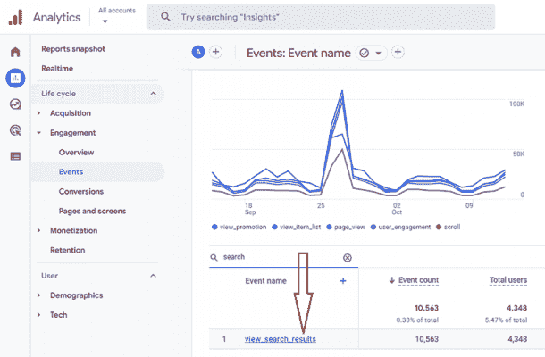

Image via [OptimizeSmart](https://www.optimizesmart.com/how-to-set-up-site-search-tracking-in-ga4/) showing on-site search tracking via GA4.

Google Analytics 中的搜索报告确定了访问者登陆你的网站后在寻找什么。该报告有助于显示访问者正在搜索的搜索词以及这些搜索的参与度。然而，现在，我们最感兴趣的是网站收入中包含网站搜索的比例。这是我们希望通过搜索优化来影响的数字。

现在你已经有了基准，是时候改善用户的搜索体验了。

## **电子商务搜索的 15 个最佳实践(附实例)**

贝玛研究所已经发布了 145(！)电子商务搜索和产品过滤器指南。您可以在 [性能指标评测页面](https://baymard.com/ux-benchmark) 上了解它们的概况。

进入主题的一个稍微简单的方法是我们下面的 15 个最佳实践列表。这些最佳实践与 Baymard 的 UX 功能列表有相当多的重叠，例如搜索自动完成、结果布局、搜索功能、产品缩略图、产品过滤器、产品页面等等。

### 1。让搜索更加可见

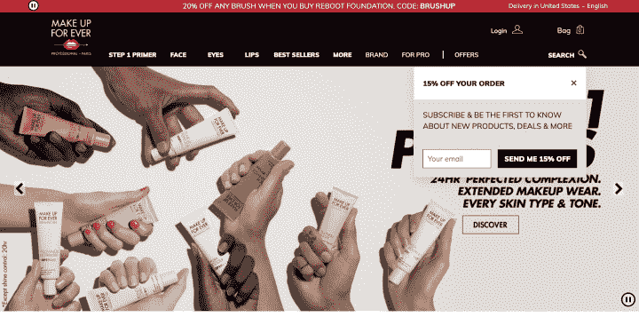

Search is practically hidden on this site.

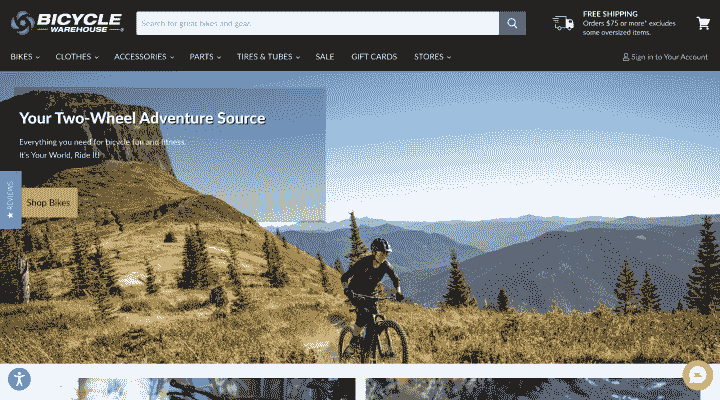

The search bar is clearly displayed.

无论是 [永远化妆](https://www.makeupforever.com/) 还是 [自行车仓库](https://bicyclewarehouse.com/) 都在他们的网站上有搜索，许多类别和收藏可以指导游客的购买之旅。但是，自行车仓库的搜索栏的可见性要高得多。

能见度有什么不同？它会对搜索和网站性能产生很大的影响。

当一家公司 [让他们的现场搜索更加可见](https://totheweb.com/blog/b2b-website-usability/increase-website-engagement-with-more-prominent-on-site-search/) …

*   网站搜索量攀升 439%
*   当访问者使用搜索时，他们在网站上停留的时间增加了 110%
*   页面浏览量增加了 45%
*   目标完成量增加了 242%

扩大搜索栏是一个简单的网站更新，但是会对网站性能产生巨大的影响。

### **2。错字公差**

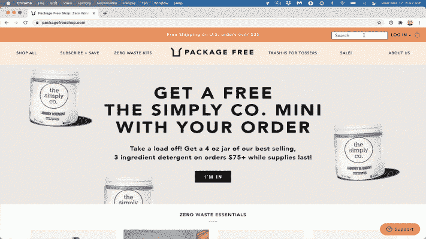

[PackageFree](https://packagefreeshop.com/) offers search with autocomplete suggestions with spelling correction.

对于电子商务搜索来说，一个不可见且经常被忽视的 UI 元素是如何处理打字错误和拼写错误。介于 [之间的 20-30%的搜索查询](https://dl.acm.org/doi/abs/10.1145/1963405.1963425) 可能包含一个拼写错误！你不想失去客户，因为他们拼错了查询，却得到一个“没有结果”的回应页面。

有几种不同的方法来管理搜索错别字和拼写错误。一个好的网站搜索工具会给你提供选择，包括添加“你的意思是？”搜索结果页面中的结果和/或允许输入错误的自动完成。

使用某些口味的 [错别字容差](https://support.algolia.com/hc/en-us/articles/4406975253649-How-does-Algolia-handle-typing-mistakes-) 是避免失去认为你没有“bakcpacks”或“addidas”的顾客的最佳做法

### **3。智能营销——适时推广相关内容**

购物者是直观的。店内销售——无论是在过道还是在收银台——都是鼓励购物者在购物车中多加一件商品的基本做法。

在线零售商的日子更难过了。你需要平衡让购物者先找到他们想要的东西。然后，您需要确定何时以及如何展示其他产品，以及展示哪些相关产品。

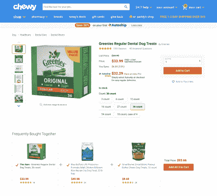

Chewy uses product data, sales data, and personalization to improve merchandising.

在这里我们可以看到[【Chewy.com](https://chewy.com/)让我们可以很容易地找到相关商品——这些商品可能是畅销书、更高利润或个性化结果的组合。

*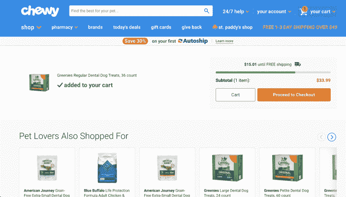*

将商品添加到购物车后，它们也会提供类似的结果。

明智的做法是在两个位置提供相关商品，以便在顾客选择去的任何地方抓住 [销售](https://www.algolia.com/products/search-and-discovery/visual-merchandising-curation/) 机会，并且可以设计成不引人注目，不干扰购买体验。还有许多解决方案可以帮助优化相关项目，包括我们自己的 [Algolia 推荐的](https://www.algolia.com/products/recommendations/) 。

### **4。NLP**

如果用户在你鞋店的搜索栏中输入“红色篮球耐克鞋 14 号”，搜索引擎需要解析这些信息以返回高质量的结果。电子商务网站使用[【NLP】](https://www.algolia.com/blog/ai/predictive-search-and-autocomplete/)可以影响你的品牌认知、用户体验和转化率。

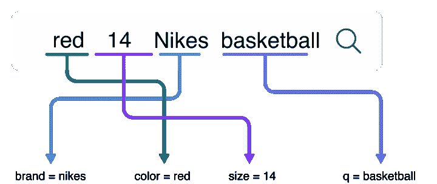

我在 FootLocker.com 的上搜索“红色篮球耐克 14 码”。乍一看，他们的网站似乎没有解析查询。

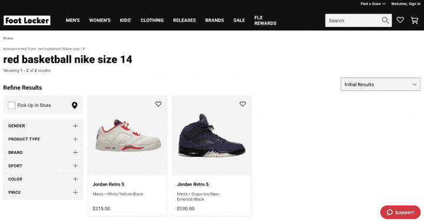

然后我从零开始重新开始了我的访问。这次我没有使用搜索栏。相反，我通过点击男子篮球鞋和过滤排序来浏览他们的网站。实际上有很多结果！我点击进入这些结果中的每一个，一些与大小 14 的股票。换句话说，这些产品 *应该* 已经出现在我的第一次搜索中。

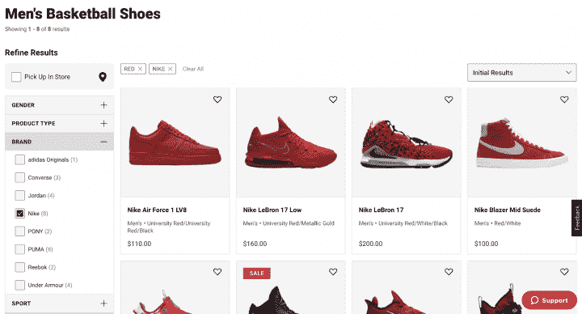

如果访问者只使用搜索，他们可能已经放弃了网站，而没有意识到有更多的产品可用。

相比之下，Zappos 在类似的搜索方面做得非常好。我将“鞋”添加到搜索短语中，因为 Zappos 还销售其他服装。

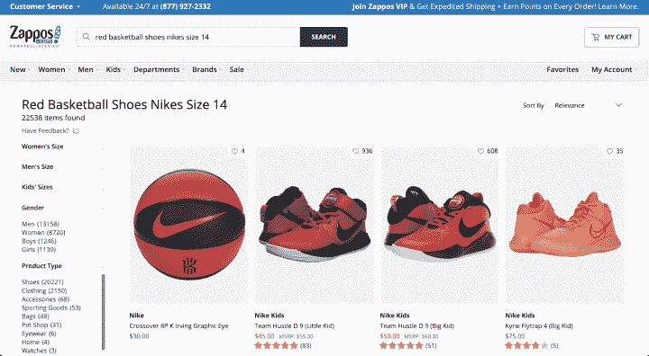

像“14 号红色篮球鞋”这样的复杂搜索变得越来越常见。研究表明， [三分之一的](https://www.wordstream.com/blog/ws/2019/02/07/google-search-statistics) 所有搜索包含 4+或更多关键词。

在网站搜索的背景下，自然语言处理(NLP)分析查询以推断结构和含义。在这种情况下，结构指的是高度定义的信息，例如类别或数字。它还可以表示事物之间的关系。常见的例子包括大小、颜色、地点、名称、时间、实体和意图，但还有更多。

投资支持自然语言处理的搜索解决方案是电子商务提供商的最佳实践，有助于确保访问者获得相关搜索结果，从而快速找到合适的产品。

### **5。过滤器和刻面**

[穆塞乔](https://www.moosejaw.com/) 应该为他们的一长串滤镜和刻面获奖。这让我想起了电影 [飞机](https://www.youtube.com/watch?v=LyUN40weqIk) 中的一个场景——名单似乎永远排不完。多肯定比少或没有好。

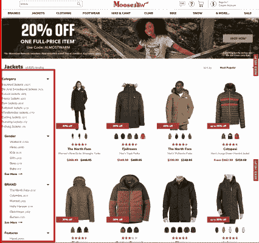

And these are only *some* of the facets displayed on a Moosejaw on-site search.

我们来简单解释一下一些术语。说到搜索，其实有两种滤镜:

*   **Facets** :这些是根据搜索而变化的动态列表。在这种情况下，搜索的是“jacket ”,显示的方面不同于您在其他搜索中找到的方面，如“boots”或其他项目。
*   **滤镜** :滤镜一般不变；不管你搜索的是什么产品，这都是一个静态列表。

更多关于 [刻面和滤镜的区别这里](https://www.algolia.com/blog/ux/filters-vs-facets-in-site-search/) 。

如果你有一个拥有成百上千商品的大型商店，为每个产品类别设计面和过滤器是不切实际的。过滤器的诀窍是在索引时根据产品元数据动态生成它们。

例如，Algolia 客户可以简单地将任何 HTML 元素包装在特殊的过滤器标签中，以告诉应用程序存储元素的属性。然后，这些属性可以用来创建过滤器和可在查询中搜索的方面。

刻面的另一个选择是使用 [查询分类](https://www.algolia.com/blog/product/new-ai-capabilities-available-to-algolia-customers-query-categorization/) ，可以对信息进行分类，自动生成过滤器和刻面。

分面搜索对于帮助客户缩小搜索结果范围，准确找到他们想要的东西非常有价值。为站点搜索创建的相同方面和过滤器也可以用于静态或动态目录或集合页面。

### **6。个性化**

个性化是关于提高搜索相关性以促进转化。当已知用户搜索你的网站时，搜索功能应该提供 [个性化结果](https://www.algolia.com/products/search-and-discovery/personalization/)——用户更有可能购买的特定产品。

个性化的使用可以极大地改善用户体验和转化率。BigCommerce 发现，个性化可以将跳出率降低多达[20-30%](https://www.bigcommerce.com/blog/bounce-rates/)。(典型的零售网站跳出率在 30-55%左右)。

在一项 [麦肯锡研究](https://www.mckinsey.com/industries/retail/our-insights/retail-speaks-seven-imperatives-for-the-industry#) 中，100%的顶级四分之一零售商表示，个性化是他们的五大优先事项，但只有 15%的零售商跨渠道实施了个性化。

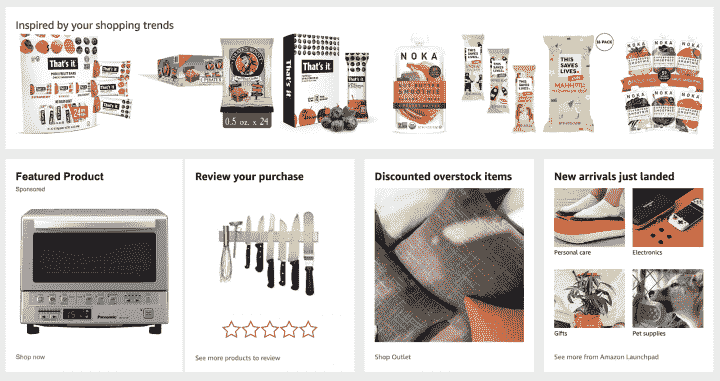

Amazon incorporates personalization throughout the shopping experience.

亚马逊因在他们的平台上建立个性化而闻名。如[【HBR】](https://hbr.org/2018/06/to-compete-with-amazon-big-name-consumer-brands-have-to-become-more-like-it):

> “该公司有效地创造了一种数字营销的新模式:与客户的一对一关系，通过数据收集提供信息，通过机器学习进行优化，并通过其他形式的人工智能进行培育。”

这位《HBR》的作者接着问道:“一个离线玩家如何……希望赶上来？”

亚马逊有一千多名工程师在研究这个问题！无论你是离线玩家还是在线玩家，这项任务似乎都令人生畏。

好消息是，有了 Algolia 或其他第三方个性化解决方案，你不再需要一大群搜索工程师。

无论您选择哪种解决方案，数据都是关键。在遵守数据隐私法的情况下，您收集的数据越多越好。一旦收集了数据，每次查询都会使用这些数据来修改结果，使之与个人更加相关。这可以简单到衣服尺寸偏好、性别、地点或任何其他可能影响其结果和行为的个人特征。

通常，个性化的第一阶段是通过查询发送信息，以便用其他分析工具记录。然后可以离线分析性能影响，以确定这是否有用，或者您甚至可以 A/B 测试有无个性化的结果。

通常，查询可以与个人信息分层，以增加和影响查询，从而产生高度个性化的结果。

### **7。移动搜索**

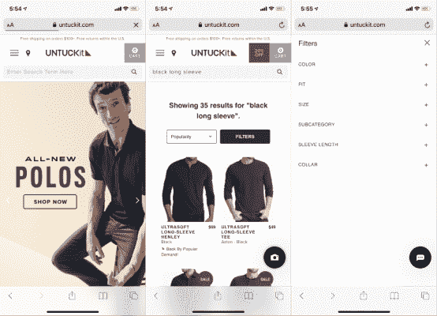

For mobile users, Untuckit offers a custom responsive search design.

2019 年 Q1，智能手机占全球零售网站访问量的65%。然而，移动优化搜索具有挑战性。响应式设计不是简单地调整几个物体的大小，而是考虑到整个购买者的旅程。

这里有一个很棒的例子:[【Untuckit】](https://www.untuckit.com/)很好地构建了一个手机友好的网站，在屏幕的正上方有一个容易找到的搜索按钮。它们提供了一个方便的常用过滤器下拉菜单和一个附加过滤器按钮。当我输入时，搜索栏显示自动建议的结果。

### **8。同义词**

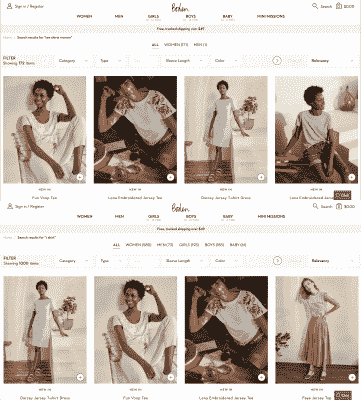

A search synonym like t-shirt and tee shirt should return almost identical results.

你的顾客是在寻找 t 恤还是 t 恤？如果你的搜索框只识别一种拼写，你就会错过机会。使用同义词来创建术语词典是健康网站搜索的最佳实践。

相关的术语也应该是一样的。例如，衬衫、上衣、衬衫或运动衫将包含重叠的项目，条纹衬衫、条纹上衣或布列塔尼等术语也是如此。在这种情况下，“top”是一个包括衬衫或布列塔尼服装的类别，但它本身也可以用作搜索词。

今天，像这样的搜索依赖于好的标题、产品描述和元数据。很快，电子商务搜索引擎将提供 [基于向量的搜索](https://www.algolia.com/blog/ai/what-is-vector-search/) ，它使用数学方法来理解单词及其含义，以提供更相关的结果。

### **9。带有产品缩略图和价格预览的即时搜索**

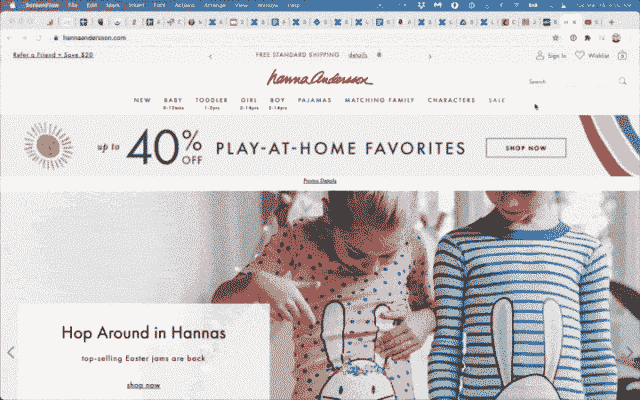

Fantastic instant search on HannaAnderson.com.

[HannaAnderson.com](https://www.hannaandersson.com/)提供了一个即时搜索的高手。下面是上面截图中发生的事情:

*   当您键入时，结果和缩略图会立即更新
*   显示“你是说”拼写检查功能
*   显示相关收藏(如复活节商店)
*   列出物品价格

对于购物者来说， [像这样的即时搜索](https://www.algolia.com/blog/product/creating-an-end-to-end-search-experience-with-autocomplete-and-instant-search-results/) 是赢家，因为它太直观了。像自动建议(或 [自动完成](https://www.algolia.com/blog/ai/predictive-search-and-autocomplete/) )一样，即时搜索会在您键入时显示结果，但也包括缩略图。此外，展示价格是帮助购物者快速找到他们想要的东西的好方法。

顺便说一下:HannaAnderson 搜索在移动设备上也很好用(我查过了)。

出于某种原因，大多数在线商店要么没有在即时搜索上投入时间——他们仍然要求人们在输入查询后在键盘上点击“回车”——要么只提供有限的结果显示。我们的 [电子商务网站搜索产品](https://www.algolia.com/industries-and-solutions/ecommerce/) 和许多其他产品现在提供一些即时搜索的现成味道，因此任何公司都可以在几分钟内建立丰富的体验。

### **10。与转换相关的机器学习**

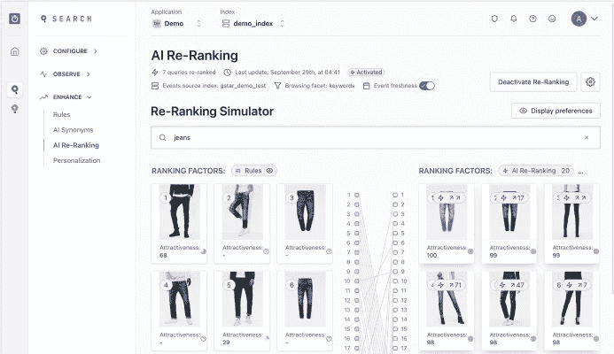

Dynamic re-ranking capabilities, such as shown above in Algolia, allow anyone to tweak the search algorithm to improve search results using conversion data.

众所周知，谷歌根据搜索活动来改善网络搜索结果。如果你点击一个结果，访问一个网站，然后立即返回到搜索结果，谷歌知道你刚才点击的结果是一个糟糕的匹配。随着时间的推移，它会调整和完善算法，将更好的结果提升到页面的顶部。

如今，新的网站搜索引擎拥有类似的功能，可以将搜索与电子商务转化率联系起来。他们可以根据点击和转化(购物车活动、购买、结账、折价或者任何你认为成功的东西)来区分好的结果和坏的结果，从而提供更好的结果来提高你的转化率。

例如，“面具”在 2019 年和 2023 年的含义完全不同。在新冠肺炎之前，正在寻找面膜的买家可能正在寻找美容护肤品。随着疫情的出现，这一切都变了。带有 [强化学习](https://www.algolia.com/blog/ai/what-is-ai-search-ranking/) 的搜索平台会自动开始根据转化率调整结果。

作为最佳实践，你也应该能够调整输入。您可能希望将搜索结果调整为利润更高的项目或结果之上的个性化层。

### **11。使搜索可视化**

视觉搜索，有时被称为 [视觉购物](https://www.algolia.com/blog/ai/visual-shopping-visual-discovery-how-image-search-is-changing-online-shopping/) ，对于营销人员设计现场搜索和开发 SEO(搜索引擎优化)策略变得越来越重要。

[人的大脑有一半以上是专门用于视觉和视觉的](https://news.mit.edu/1996/visualprocessing) 处理，而对大多数买家来说 [图像比文字](https://www.smartinsights.com/ecommerce/third-consumers-use-visual-search/#:~:text=Images%20are%20key%20when%20online,electronics%20and%20wine%20and%20spirits.) 更重要。

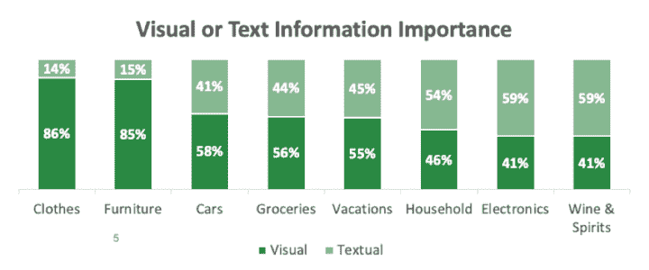

Image via [SmartInsights](https://www.smartinsights.com/ecommerce/third-consumers-use-visual-search/), images are more important than text.

可视化结果应该出现在即时搜索结果和你的结果页面上。视觉搜索还有其他用例，包括增强现实(AR)。就连[Snapchat](https://arinsider.co/2019/02/05/whats-behind-snapchats-visual-search-play/)都用针对 AR 优化的视觉搜索钻进了游戏。

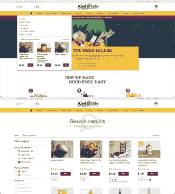

Abel & Cole delivers search results that fits beautifully with their website design and brand, both in instant search and on the search results page.

### **12。A/B 测试**

在一个经典的网站 A/B 测试中，你可能会划分流量，以确定哪种变化——蓝色或绿色的行动号召按钮——转化得更好。通过测试搜索结果设计或搜索数据本身，您可以对站点搜索结果做同样的事情。

这里有几个你可以测试的例子

*   个性化对比常规结果
*   畅销商品 vs 最高评价商品
*   新品 vs 打折商品
*   不同的产品类别
*   过去 7 天与所有时间的最畅销商品

### **13。阿达和 WCAG 可用性**

可以合理地假设，你网站的大量访问者——[多达五分之一](https://www.shopify.com/partners/blog/why-and-how-to-improve-ecommerce-website-accessibility)——将是残疾人。这可能是从色盲这样的视觉障碍到诵读困难这样的认知障碍。

在一项研究中，多达71%的残疾人因为糟糕的体验而从他们正在购物的网站上弹回。

对于这样的障碍，你的网站需要仔细考虑颜色对比、动画和过渡等方面，并提供适当的替代方案。网站搜索，无论是你的搜索结果登陆页，还是对拼错单词的错别字容忍度，都是一样的。

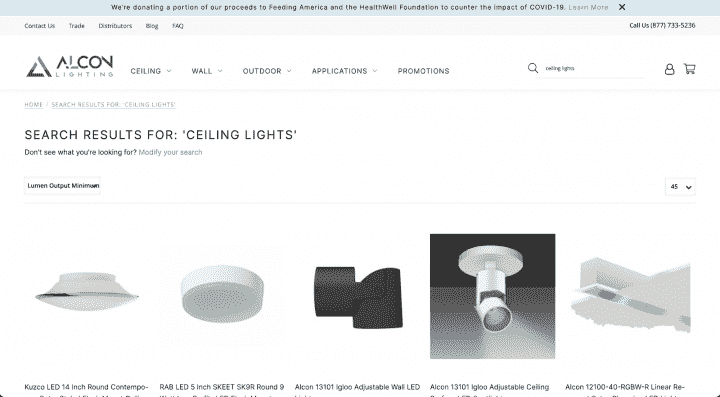

对于搜索栏，一些注意事项包括:

*   将搜索栏定位在可预测的位置(通常是顶部中间或顶部右侧)
*   使用可区分的颜色
*   在搜索放大镜图标上使用 alt-text

同样，对于搜索结果，一些考虑因素包括:

*   允许用户使用键盘浏览结果
*   屏幕阅读器的状态消息
*   带有图像的搜索结果

你可以在我们关于 [网页内容无障碍指南(WCAG)和美国残疾人法案(ADA)数字标准的长文上阅读更多建议，并搜索](https://www.algolia.com/blog/ux/web-content-accessibility-guidelines-wcag-how-to-make-site-search-work-for-people-with-disabilities/) 。

### **14。整个网站搜索—不仅仅是你的产品**

无论某人是在寻找产品还是退货政策等问题的答案，网站搜索都应该提供出色的用户体验。无论你选择什么样的搜索解决方案，都应该能够提供搜索结果，并且最好能够对这些结果进行分类，以便于浏览。

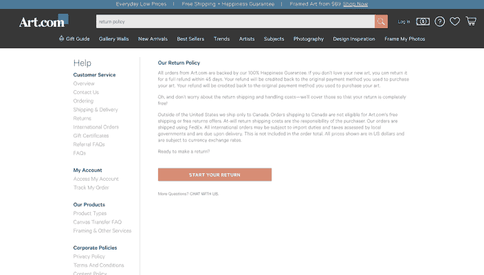

Art.com indexes their entire site, including non-product page results.

### **15。搜索指标**

你的网站搜索提供商应该提供内置的 [搜索分析](https://www.algolia.com/doc/guides/getting-analytics/search-analytics/understand-reports/) 来帮助你了解趋势、无效搜索(比如 *没有结果* )以及需要改进的地方。

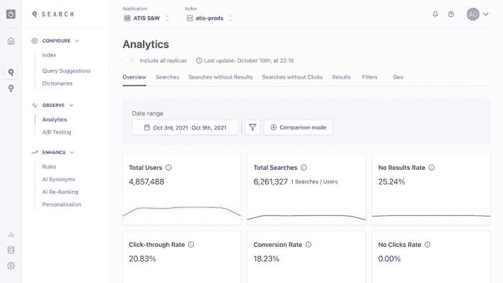

Metrics to analyze product search data.

搜索量是整体流量的一个很好的指标，它告诉你有多少人在你的网站上使用搜索。点击率帮助你了解你的搜索有多有效，你是否有正确的内容。

热门搜索和意想不到的趋势显示了用户的意图。这是一个需要关注的重要列表。如果人们的兴趣变了，热门搜索的列表也会变。这是一个很好的迹象，表明你可能需要在你的网站上添加额外的内容，或者在你的电子商务商店里储备新产品。

关于遗漏内容、查询术语和每次搜索次数的报告可以帮助你发现改进网站搜索的机会。

## **下一步:电子商务网站搜索解决方案**

我们在上面展示了大量信息。尝试做每一件事似乎令人畏缩。

最终，您希望为每个查询提供最相关的结果和最佳用户体验，这需要特性和功能的结合。

好消息是，许多现代电子商务搜索平台提供许多(如果不是全部)上述功能。