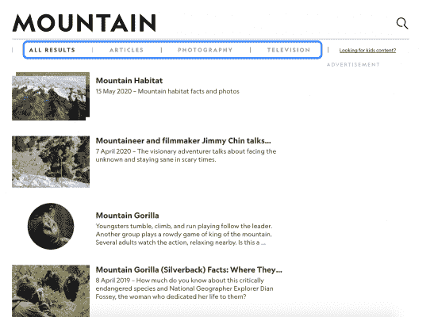

# 3 个例子帮助你改变“无结果”搜索页面

> 原文：<https://www.algolia.com/blog/ux/3-examples-to-help-you-transform-the-no-results-search-results-page/>

出色的搜索体验应该毫不费力地将用户与他们的需求联系起来。然而，一个“没有结果”的页面(当搜索引擎不能返回任何结果时的错误)可能会破坏这种期望的连接并导致挫败感。有了精心设计的搜索体验，你可以避免“没有结果”的页面，并为每个用户指出一个发现新事物的方向。

优化搜索是网站寻求与其他品牌竞争、获取和保留用户、提高转化率和参与度的关键组成部分。搜索体验的每一部分都应该促进发现，避免“没有结果”的页面对这一目标至关重要。

在这篇文章中，我们将通过几个例子来说明如何将一件“没有结果”的事情转化为一条新的前进道路。

## 为什么“没有结果”的页面是一个 UX 死胡同

一些网站精心制作了“无结果页面”,提供幽默的错误信息或以某种方式与品牌保持一致。但这些页面，无论多么机智，创造了一个 UX 死胡同。如果用户没有找到他们需要的东西，他们很有可能会立即离开你的网站或应用。事实上， [12%的用户在一次不成功的搜索后离开了网站。原因如下:](https://www.algolia.com/blog/ecommerce/advanced-search-experience-for-e-commerce/)

### 【无结果】页面忽略下一步可能的步骤

有帮助的“无结果”页面可能包括[microcopy](https://www.algolia.com/blog/ux/how-to-use-microcopy-to-improve-ux/)提示用户再次搜索或提供建议的和流行的搜索。然而，许多人没有，这导致搜索之旅和与网站的整体互动到此为止。如果当用户找不到特定查询的结果时，你不为他们提供另一种选择，他们将没有任何潜在的后续步骤可循。

坚持不懈的用户可能会修改他们的搜索，试图更接近他们想要的，但他们会这样做，却不知道为什么他们最初的搜索失败了。然而，由于注意力持续时间短，用户搜索技能往往较弱， [许多用户在第一次失败后不会细化他们的搜索](https://www.nngroup.com/articles/incompetent-search-skills/) 。

### 【无结果】页面不能准确反映站点内容

“没有结果”页面给人的印象是，你的访问者想要的东西实际上并不存在于网站上。很多时候，现实是这些相关结果确实存在，但是站点的 [内部搜索只是没有优化](https://www.algolia.com/blog/product/learn-about-site-search-best-practices/) 来检索它们。搜索引擎可能会在错别字、同义词或非常具体的查询上出错。许多这些问题都可以通过优化你的搜索引擎来解决，这样用户的错误就不会导致“没有结果”的障碍。

记住， [43%的网站访问者会立即利用搜索框](https://www.forrester.com/report/MustHave+eCommerce+Features/-/E-RES89561) 。关键是要确保你的搜索是尽可能相关的，这样那些用户就会得到回报。

## 3 个搜索实例，替换了“无结果”页面

一个强大的搜索解决方案，如 Algolia，通过预测用户需求并确保每个用户都在一条通往 [内容发现](https://www.algolia.com/blog/ux/site-search-content-discovery/) 的道路上，帮助用户 [避免传统的“无结果”页面](https://www.algolia.com/blog/product/avoid-no-results-pages/) 。这里有三个不同的搜索体验的例子，它们消除了对“无结果”页面的需求

### 1。LaCoste——即时搜索结果，即使是无效查询

不管是什么样的查询， **Lacoste** 都会给用户提供一个网站的前进路径，就在搜索栏里。虽然不成功的查询会生成一条“抱歉”消息，但它也会直接在下面返回精选的产品。这有助于突出 Lacoste 丰富的产品目录，并为用户提供新的有趣的结果和参与机会，而不仅仅是一个死胡同。

### 2。安德玛—允许输入错误的自动完成功能

一个未经优化的搜索引擎可能会被用户的错误绊倒，无法提供搜索结果。 **安德玛** 的搜索栏中的允许输入错误的自动完成功能既能捕捉用户输入的错误，又能为他们提供受欢迎的推荐商品建议。这一功能考虑到了人为错误，并允许用户修正路线以找到他们要找的东西。

例如，如果用户拼错了“sock”，网站仍然会提供用户可以点击搜索的热门结果。

### 3。国家地理探险——基于浏览的搜索

国家地理的 探险网站采用独特的方式搜索 **。** 该网站鼓励基于浏览的搜索，使用特定范围的 [过滤器和方面](https://www.algolia.com/blog/ux/faceted-search-and-navigation/) 。这种类型的导航最适合非常集中且通常较小的结果集。用户很快就熟悉了搜索目录的参数，并且可以很容易地调整他们的过滤器选择，以找到某些结果。这种类型的导航搜索确保用户总是有清晰的后续步骤来浏览内容，找到他们想要的东西。

## 改善你“没有结果”的最佳做法页面

正如这些例子所帮助说明的，没有结果的页面对用户来说并不一定是死胡同。通过专注于改进一些不同的元素，你可以消除这个用户障碍:

### 建立你的同义词库

一个成功的网站搜索功能需要解析 [同义词](https://www.algolia.com/blog/engineering/inside-the-engine-part-6-handling-synonyms-the-right-way/) ，因为搜索同一事物的访问者经常会使用不同的词来找到该项目。例如，在美国各地销售手提包的零售商会考虑到该术语的地区差异，如“purse”或“pocketbook”。一个强大的同义词库是必不可少的，它可以基于网站搜索数据来构建，以确保准确性。

### 使用自动完成和查询建议

通过向用户提供已知会返回结果的查询，您可以增加首次搜索成功的可能性。通过 [自动补全和查询建议](https://www.algolia.com/blog/ux/autocomplete-how-search-suggestions-increase-conversions/) 帮助用户在点击 enter 键之前细化搜索，可以在他们开始搜索时为他们指出正确的方向。

### 利用分析了解用户需求

每次用户访问你的网站，他们都会提供 [有价值且可操作的数据](https://www.algolia.com/blog/product/internal-site-search-analysis/) 。通过查找“无结果”搜索并改进您的数据集以最大限度地减少这种情况的发生，来利用这些信息。导致“0 个结果”的查询不可避免地会赶走客户，并且可能是错误标记内容或整体内容差距的指标。将那些未满足的需求考虑在内，并创建内容来填补在您的分析中明确发现的潜在差距。

## 通过优化的搜索让您的用户获得最佳搜索结果

出色的搜索体验可以促进发现，并彻底消除“无结果”页面。通过[优化你的网站搜索](https://www.algolia.com/products/search-and-discovery/hosted-search-api/)，你将为访问者创造一条获得有价值结果的路径，即使他们没有找到他们想要的东西。从自动完成到联合搜索，再到过滤器和方面，Algolia Instant Search 拥有您需要的所有 UI 组件，来创建满足您用户需求的强大搜索。

要了解更多关于 Algolia 如何提高客户保持率和转换率的信息，请阅读我们的电子书“ [框外搜索](https://resources.algolia.com/ebooks/search-beyond-the-box-ecommerce-version) 。”