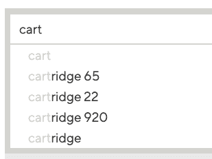

# 3 键搜索框 UX 设计元素

> 原文：<https://www.algolia.com/blog/ux/3-key-ux-design-elements-of-the-search-bar/>

营销人员和网站所有者经常忽略他们搜索界面的设计，而牺牲了良好的搜索体验。笨拙或不直观的搜索体验会让用户感到沮丧，更有可能转到竞争对手的网站去寻找他们需要的东西。对于媒体网站、电子商务零售商以及介于两者之间的每一个网站来说，调整浏览体验的每一个部分都是必要的，包括搜索栏。

## [T3<path fill-rule="evenodd" d="M4 9h1v1H4c-1.5 0-3-1.69-3-3.5S2.55 3 4 3h4c1.45 0 3 1.69 3 3.5 0 1.41-.91 2.72-2 3.25V8.59c.58-.45 1-1.27 1-2.09C10 5.22 8.98 4 8 4H4c-.98 0-2 1.22-2 2.5S3 9 4 9zm9-3h-1v1h1c1 0 2 1.22 2 2.5S13.98 12 13 12H9c-.98 0-2-1.22-2-2.5 0-.83.42-1.64 1-2.09V6.25c-1.09.53-2 1.84-2 3.25C6 11.31 7.55 13 9 13h4c1.45 0 3-1.69 3-3.5S14.5 6 13 6z">T5</path>](#)

## 为什么搜索栏很重要

搜索栏通常是用户与网站的第一次互动。事实上， [研究表明](https://www.forrester.com/report/MustHave+eCommerce+Features/-/E-RES89561) 大约 43%的网站访问者会立即进入搜索栏，这些搜索者转化的可能性是其他人的 2-3 倍。

搜索栏可以为用户提供一种 [的对话体验](https://blog.algolia.com/conversational-search/) ，其中每一次击键都是与系统有效的双向讨论。用户不应该为了搜索而对你的界面进行逆向工程。相反，这个过程应该感觉像一种自然的人类体验，可以快速引导他们找到他们想要的东西。你的网站必须为这些客户提供无缝的用户体验。

## 如何打造最好的搜索栏设计

搜索栏用户体验设计流程有三个关键方面:外观、位置和功能。所有这些方面共同作用，形成更加清晰高效的用户体验。

## 1。搜索栏的外观

外观有助于用户形成对搜索栏的第一印象——通常是对整个网站的第一印象。它帮助他们理解系统的目的和用例，并说服他们开始使用它和探索内容。在不牺牲功能的情况下，确保设计清晰合理是很重要的:

*   *   保持简单，使用常见的设计模式。 用户来到网站，期望搜索栏以可预见的方式出现和运行。不要过度设计你的搜索栏，让用户填写太多的字段。用户只需输入一个字段就可以了。一个简单、干净的设计将使搜索栏易于查找和使用。
    *   **使用放大镜图标** 。现代用户立即理解放大镜是搜索的通用标志。你可以通过使用他们认可的设计模式来迅速吸引他们的注意力。
    *   **考虑字段大小** 。搜索输入和字体大小应该适应标准的用户查询长度—通常大约 27 个字符。确保在各种设备上进行测试，包括不同的 [移动设备](https://blog.algolia.com/mobile-search-ux-8-obstacles/) 。
    *   **使用 microcopy** 。在没有提示的情况下，用户会在搜索栏中输入各种各样的问题。如果你希望他们搜索特定类型的内容，那就告诉他们。 [搜索栏中的简单提示](https://uxplanet.org/microcopy-tiny-words-with-a-huge-ux-impact-90140acc6e42) 如“搜索产品”、“你想了解什么”或“找到完美的目的地”可以帮助引导你的用户并形成他们对所能找到的东西的期望。

https://www . algolia . com/doc/guides/solutions/gallery/animated-placeholder/

*   **在搜索栏** 保留最后一次查询。当用户查看搜索结果页面时，参考他们过去的搜索查询可能会有所帮助。如果他们没有找到他们要找的东西，他们可以快速返回并修改搜索结果。
*   **使搜索栏可见。** 用户不应该非得搜索搜索栏。搜索栏需要足够大，这样才不会被网站的其他部分遮挡。考虑相对于网站其他部分的颜色和视觉对比，这样它就不会意外地融入其他部分而丢失。

## 2。搜索栏的位置

用户应该能够导航搜索，不管他们在你网站的什么位置。位置的一致性允许他们浏览不同的页面而不会迷路。以下是一些需要记住的提示:

*   **在搜索栏的位置上要有策略** 。搜索栏越突出，用户越有可能使用它。用户通常希望在网页的左上角或右上角找到用于搜索的按钮或图标。然而，根据不同的用例，你可以选择让搜索栏更加突出。无论你做什么，不要隐瞒！
*   **把它放在每一页的同一个地方** 。不管页面的上下文如何，搜索栏应该总是可用的。当他们导航到不同的页面时，搜索栏应该在他们上次使用它的相同位置，以确保他们可以快速回到他们的探索过程。一致性是关键，因为好奇的用户会想要在不同类型的内容之间跳转，搜索体验应该帮助他们这样做。

## 3。搜索栏的功能和能力

最终，搜索栏的功能将用户与他们正在寻找的东西联系起来。确保你的搜索栏不仅能提供用户期望的功能，还能提供强大的体验，促进搜索和发现:

*   **使用查询建议和自动完成**和。用户并不总是立即知道要搜索什么或者你提供什么。有了查询建议，您可以 [推荐那些已知在用户开始在搜索栏中键入时为他们提供良好结果的查询](https://blog.algolia.com/introducing-query-suggestions-better-autocomplete/) 。它还可以帮助他们执行与你的战略业务目标一致的搜索，让他们远离可怕的“ [无结果](https://blog.algolia.com/avoid-no-results-pages/) ”页面。

https://www . algolia . com/doc/guides/solutions/gallery/predictive-search-suggestions/

## 如何实施伟大的搜索 UX

建立一个搜索栏意味着超越用户的期望。您需要一个搜索服务提供商，它提供强大的功能和机会来调整搜索以适应您的业务用例。阅读我们的电子书“ [搜索和用户-企业关系](https://resources.algolia.com/ebooks/search-user-business-relationship) ”，了解了解你的用户如何帮助你推动搜索改进和定制搜索体验。