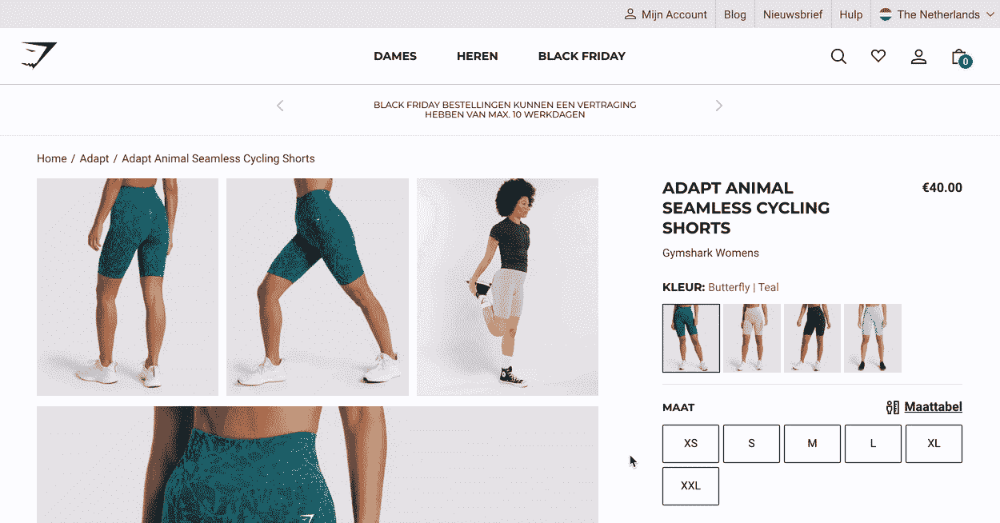

# 6 种利用电子商务推荐的方法，作为搜索的一部分

> 原文：<https://www.algolia.com/blog/product/6-ways-to-leverage-recommendations-for-ecommerce-retailers/>

在电子商务平台上设计一流的购物体验时，我们必须考虑每个接触点的用户体验。我们已经确定了用户在电子商务网站或应用程序上发现产品时的两种基本行为类型:

1.  搜索:通过在页面的搜索栏中输入查询进行发现
2.  浏览:发现模式，包括搜索之外的任何其他活动，例如导航到不同类别的页面，点击横幅，过滤和排序产品列表页面上的结果，等等

毫无疑问，搜索在电子商务网站的最终用户体验中扮演着核心角色。有效的搜索解决方案对关键销售业绩指标的影响不可低估。有多种方式可以增强和优化平台上的搜索和发现体验，以适应各种电子商务用户旅程场景:

*   添加建议搜索，让用户从最流行的搜索查询中进行选择。
*   应用个性化，以确保始终为用户呈现与其独特偏好最相关的结果。
*   激活人工智能同义词建议，让您的用户使用不同的词来搜索相同的产品。
*   在顾客旅程的每个接触点添加建议。搜索和推荐是互补的产品。当一起使用时，它们能够为电子商务平台用户提供一流的发现体验。

## 结合搜索和推荐的引擎功能

在下面的例子中，体育用品时装零售商 Gymshark 除了使用 Algolia 搜索来支持 Gymshark 的网站之外，还使用由机器学习支持的 Algolia 推荐 API 来增加收入:

Gymshark 的成功指标:

*   在黑色星期五，新用户的订单率增加了 150%，而“加入购物车”率增加了 32%
*   回头客的订单率和“加入购物车”率分别提高了 13%和 10%
*   每用户 1.4 次点击，而之前的解决方案为 1.1 次

了解领先的电子商务零售商如何利用人工智能推荐引擎的能力来实现他们的数字销售目标: [Gymshark 增加了 Algolia 推荐来处理关键的黑色星期五期间](https://resources.algolia.com/customer-stories/casestudy-gymshark-retail-2) 。

## 利用不同接触点的建议

推荐是利用人工智能能力提高可发现性、追加销售相关或经常一起购买的产品、增加平均订单量和提高收入的明智方式。

有多种方法可以在类别页面及其他页面上使用推荐:

*   首页。 当用户登陆主页时，他们会看到一个动态的产品转盘，上面有推荐的产品，它会根据用户的需求调整推荐。
*   类别列表页面或产品列表页面。 可在类别页面上展示推荐，以增加平均订单价值和每个订单的商品数量。

*例如，在一个以跑鞋为特色的分类页面上，用户可以看到经常与跑鞋一起购买的商品的推荐，比如袜子。*

*   产品描述页面。一旦用户登陆一个产品描述页面，他们可能会对提供相似的产品或经常一起购买的产品感兴趣。

*例如，用户点击了一件浅蓝色的 t 恤。他们不确定这个产品是否完全符合他们的风格。他们注意到“相似产品”图库下有一件相似的模糊 t 恤，正是他们正在寻找的，于是将它添加到购物车中。此外，他们在“经常一起购买”图库下看到了一条短裤，这是与他们的 t 恤相匹配的套装的一部分，并决定将该产品添加到他们的购物车中。*

*   添加到购物车页面。一旦用户将产品添加到购物车中，追加销售的机会就出现了。人工智能生成的推荐可以帮助你提供合适的产品，以匹配你的用户已经表现出购买意向的商品。
*   结帐页面。 结账页面是使用人工智能推荐引擎追加销售类似或相关产品的额外机会

*例如，一个用户在购物车中添加了一条牛仔裤和一件衬衫，现在准备结账。你的商店为超过 99 美元的订单提供免费送货，但这位顾客的订单低于免费送货的最低限额。这是一个推荐额外产品的机会，例如搭配腰带、袜子或帽子。这对公司来说是一个双赢的局面，获得更多的收入和订单量，对客户来说，以免费送货的形式获得折扣。*

*   邮件推荐。有时，用户会放弃虚拟购物车，对尚未上市或暂时缺货的产品表现出兴趣，或者只是点击商品而不进行购买。通过使用人工智能推荐引擎向他们发送相关产品的电子邮件推荐，您可以重新介绍或提醒他们引起他们注意的商品。

## 结论

利用客户旅程中多个接触点的推荐功能，并将其与高级搜索功能相结合，使电子商务零售商能够在其平台上为用户提供卓越的用户体验。实施建议有助于提高订单率、“加入购物车”率、平均订单价值和每份订单的商品数量。

要了解如何以最小的努力在您的电子商务网站上实现产品推荐，请查看这个简短的 [现场编码视频记录](https://www.youtube.com/watch?v=XEfFCJ5_uBI) 。

要了解如何在高重要性销售活动中利用产品推荐，如黑色星期五，请参考: [可组合商务如何在黑色星期五和网络周](https://www.algolia.com/blog/ecommerce/how-composable-commerce-can-boost-customer-spending-during-black-friday-and-cyber-week/) 期间促进客户消费。

关于 B2B 零售推荐实施，请参考 [B2B 商务数字化转型:营销和 AI 优化](https://www.algolia.com/blog/ecommerce/b2b-commerce-digital-transformation-merchandising-and-ai-optimizations/) 。