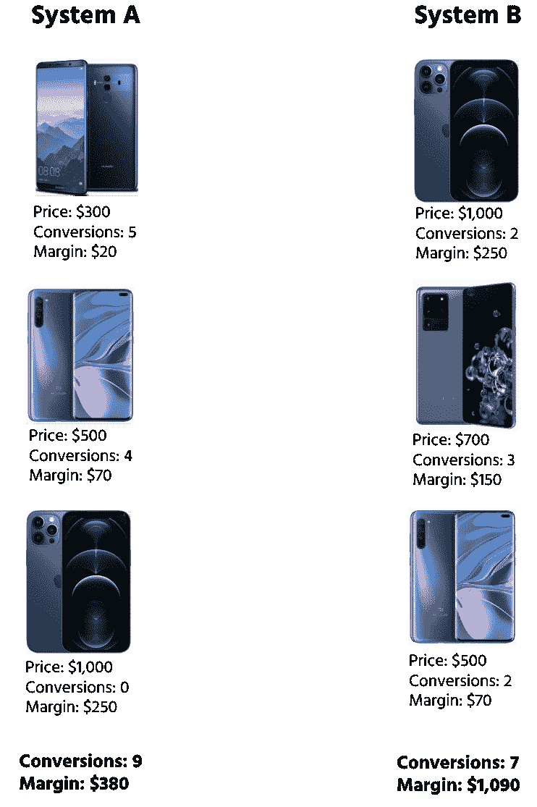

# 评估搜索的最佳 AB 测试指标

> 原文：<https://www.algolia.com/blog/engineering/a-b-testing-metrics-evaluating-the-best-metrics-for-your-search/>

评估一个搜索引擎，或者更广泛地说，一个在线系统的有效性可能是复杂的。因此，选择最可靠、最健壮的 A/B 测试指标非常重要。在线系统永远在移动——内容不断变化，在线用户的搜索和行为方式不可预测。最重要的是，公司永远在升级他们的系统并适应新的用例。除了搜索，这也适用于其他在线系统，如推荐引擎和问答机器人。

这篇博文致力于揭开衡量在线搜索性能的 A/B 测试指标的神秘面纱。您将学习如何评估指标的可靠性，以及在衡量 [A/B 测试成功](https://www.algolia.com/products/search-and-discovery/ab-testing/)时要考虑哪些因素。我们来看几个流行的指标——**收入增长、** **转化率(CR 或 CVR)、** 和 **点击率(CTR)**——比较它们的优缺点。这将帮助您决定哪种度量或者度量的组合最适合您的测试类型和特定的用例。

## 选择最佳的 A/B 测试指标来衡量你的搜索引擎的质量

你可以用两种方法来衡量一个搜索引擎的质量:定量和定性。定量评估着眼于速度和吞吐量等指标。 [提供高吞吐量的快速搜索](https://www.algolia.com/blog/product/distributed-search-network-latency-ruins-search-experience/) 是必不可少的。然而，你的评估不应该仅仅停留在量化指标上。

在本文中，我们将重点放在定性评估上，定性评估不如定量评估直接。当你听到人们谈论搜索引擎的质量时，他们通常指的是 **的相关性。** 但是，有什么关联呢？作为一个开始的定义，相关性包括两个部分: *寻找* 匹配记录和 *排序* (或)它们以首先显示最佳匹配的方式。但是搜索相关性的 [含义更深](https://www.algolia.com/doc/guides/managing-results/relevance-overview/in-depth/defining-relevance/) ，以包括其他排名方法，如受欢迎程度和更高的评级，以某种方式显示结果(良好的用户界面/UX)，个性化和推荐结果，以及商品化。

你如何估计和评价 *质量* 的相关性，即使它有不同的含义？

## 相关性的主观性如何使搜索变得困难

许多商业角色与搜索有利害关系，他们中的许多人——如产品经理、搜索引擎专家和营销人员——对什么构成良好的相关性有不同的概念。我们可以在 [文本检索会议(TREC)](https://trec.nist.gov/) 的提案中看到这一点。TREC 提出了一个使用多种检索方法的基准，这表明一个评价基准既是 [密集的，又是](https://link.springer.com/article/10.1007/s10791-008-9072-x) 复杂的。需要多个判断者来为查询-文档对提供相关性判断。这种判断的多样性表明用户对同一查询有不同的期望和偏好。然后，智能地汇总判断以创建基准。

因此，虽然法官可能很容易区分明显与 *相关的内容或与* 不相关的内容，但是比较 *与* *相关的* 文档就比较困难了。

由于这个原因，我们通常定义 A/B 测试指标，我们希望这些指标反映可测量的相关性。但是定义这样的指标可能很复杂。

想象一下，一家电子商务公司的首席执行官希望其网站搜索技术产生更多净收入。这听起来像是一个合理的相关性指标定义:一个产生更多收入的搜索引擎是一个更好地响应客户需求的搜索引擎。因此，工程团队开始监控这一指标。它观察到在公司发布新版本软件的当天，销售额大幅增长。该团队得出结论，更新的软件是造成这种增长的原因。

然而，一周后，他们发现同一个搜索引擎的收入下降了。经过调查，他们意识到在发布的同一天，一款旗舰产品被添加到目录中，而正是 *这一* 事件实际上推动了一周的收入增长，之后销售水平恢复正常。

正如您将看到的，像这样的错误或误导性结论可以通过 **方向性** 和**来减轻，这基本上确保了不同的 A/B 测试指标得到适当的加权。**

 **## 评估具有方向性和敏感性的 A/B 测试指标

Yandex Research[Yandex Research](https://research.yandex.com/)的研究人员，作为俄罗斯领先的互联网搜索引擎的一部分研究机器学习的组织[Yandex](https://yandex.com/)，在 2019 年信息检索特别兴趣小组(SIGIR)会议 上，在这篇 [教程](https://dl.acm.org/doi/10.1145/3331184.3331378) 中阐述了方向性和敏感性的概念。关于方向性，他们说“一个好的指标必须有一个清晰的方向性解释。”

上面的收入场景是方向性的一个很好的例子:收入增加是有方向性的，因为电子商务收入上升总是好的，收入下降总是不好的。但是“收入增加”指标缺乏敏感性。 [Yandex 将指标敏感度](https://slideplayer.com/slide/13079460/) 定义为“当治疗效果存在时，指标检测统计显著性差异的能力。”

我们可以使用敏感指标来检测应用于搜索体验的最小变化。因此，虽然增加收入提供了一个清晰的解释(方向性)，但当你测试新的搜索体验时，这种解释不太可能发生太大变化。准确测试收入增长可能需要多年的努力，因为统计测试很难达到显著性。如果您启动一个 A/B 测试来监控两个系统产生的收入，那么您可能需要运行它几个月，才能确信迭代的正面或负面影响。虽然这在某些监控情况下可能是可以的(例如，当发布一个全新的排名系统时，其影响可能需要在更大的规模上进行研究)，但这对于每个迭代都是不可行的。几个月内同时运行太多的测试只会增加复杂性。

考虑到这一点，一种常见的方法是从方向性指标中获得更敏感的指标。两个常用的 A/B 测试指标是点击率和转化率。

## 两个可靠、高质量的 A/B 测试指标信号:转换和点击

### **转化率**

转换率类似于收入增长指标，因为在电子商务中，转换率相当于销售额。然而，计算销售数量不同于计算收入:更高的收入并不表明活动增加，因为它是基于利润，而不仅仅是销售数量。较大的利润可能会扭曲结果；例如，一笔利润丰厚的额外销售可能意味着收入增加。计算销售额更加简单明了，但是它的优点也包含一个缺点，您将在后面看到。

用转化率作为衡量标准的好处是，它是在一个更小的尺度上计算的:搜索。因为搜索数量的波动比转化数量的波动更快(客户转化的频率远低于他们搜索的频率)，如果客户转化更频繁，搜索与转化的比率可能会快速变化。因此，转换可以更容易地检测系统修改。

因此，转换率的方向性不如收入，但可以很快检测出来——也就是说，它更敏感。这个属性使它更适合于 A/B 测试，因为它更快地达到显著性。也就是说，转换率并不是一种完美的衡量方式，因为它对所有销售都一视同仁，不能提供与收入增加相同的商业价值。

### **点击率**

在某些情况下，尤其是在电子商务之外，转化率是一种不充分的衡量方式，实施起来可能很棘手。例如，某个搜索文档的人可能会查看多个文件，然后只下载其中的一部分。下载量作为一个转化信号，作为一个相关性指标好吗？在这种情况下，CTR 是一个更敏感、更容易获得的指标。

与换算相比，CTR 是一种更为敏感的衡量方式，因为只需点击鼠标即可改变数值。但同样，CTR 失去了一些方向性，因为用户可能不会去他们想去的地方。点击通常表示成功，但并不总是如此。因此，你可能会以做出另一套假设为代价，更快地试图达到意义。

点击和转化是[仅有的两个敏感指标的信号](https://towardsdatascience.com/a-guide-for-selecting-an-appropriate-metric-for-your-a-b-test-9068cccb7fb)。您可以在查询、用户和会话级别定义指标，包括点击、转换、查看时间、平均购物篮数量、退货率和事件间隔时间。所有这些选项都允许增加或减少方向性和灵敏度。

## 定义健壮的 A/B 测试指标

在这一点上，你可能认为没有免费的午餐，也没有灵丹妙药。某些指标在某些情况下有效，但在其他情况下无效。正如我们将看到的，当你设计一个实验时，你应该额外注意其他指标(比如“花费的时间”，见下文)如何与更具方向性的指标保持一致。

在 Algolia，我们坚持所有 A/B 测试指标都应考虑的两个主要特性，以提高 A/B 测试的可靠性和成功率:明确你的指标衡量的是什么，以及它是否可靠和可行。我们将在下面详细讨论这些。

首先，让我们深入探讨一下 CR 和 CTR 的陷阱。

### **一个转化率陷阱的例子**

比方说，在你公司的电子商务搜索功能中，你想增加利润更高的商品。你总是用转换率来评估一个新系统的运行情况，所以你开始监控它。

在这里，系统 B 与系统 A 的不同之处在于，它会提升利润更高的项目。对于类似数量的搜索，系统 A 在转化率方面表现更好，但 B 在净收入方面表现更好。因此，如果目标是通过提高利润率来增加收入，那么使用 CR 指标来评估这些系统将会适得其反。

假设一周后，您观察到系统 B 的转换率比 a 低。您可以预期或假设，与显示更大范围价格的系统相比，显示过多更高的价格会使客户更不愿意承诺购买并购买产品。然而，系统 B 可能最终会产生更多的收入。这个例子说明了不应该盲目使用度量标准，因为不同的用例需要不同的度量标准。在这种情况下，我们可以通过监控转换率 *加权* 与项目的利润率(或利润率，MR)来将 CR 与增加的收入结合起来。

我们将保持大致相同的敏感度，因为我们继续依赖搜索数量，但我们整合了转换对业务收入增长的影响，使指标更具方向性。

### [T3<path fill-rule="evenodd" d="M4 9h1v1H4c-1.5 0-3-1.69-3-3.5S2.55 3 4 3h4c1.45 0 3 1.69 3 3.5 0 1.41-.91 2.72-2 3.25V8.59c.58-.45 1-1.27 1-2.09C10 5.22 8.98 4 8 4H4c-.98 0-2 1.22-2 2.5S3 9 4 9zm9-3h-1v1h1c1 0 2 1.22 2 2.5S13.98 12 13 12H9c-.98 0-2-1.22-2-2.5 0-.83.42-1.64 1-2.09V6.25c-1.09.53-2 1.84-2 3.25C6 11.31 7.55 13 9 13h4c1.45 0 3-1.69 3-3.5S14.5 6 13 6z">T5</path>](#click-through-rate-pitfalls)点击率陷阱

因为没有灵丹妙药，CTR 也暴露于一些潜在的障碍。有时较低的点击率实际上意味着更好的结果！考虑特定领域的搜索，其中搜索由研究某个主题的学生或专家执行。一个常见的用例是某人在大量冗长的文档中寻找类似“我想知道药物治疗是否会引起某些副作用”这样的查询的答案。在这种情况下，答案是相当简单的，因此没有必要繁琐地浏览文档。出于这个原因，您的团队可能会决定构建一个新的解决方案，由带有答案的信息片段组成(就像 Google，当它检测到问题的答案时会显示片段。)

在这种情况下，你会期望点击率下降，因为对于某些查询，用户不必点击结果来获得答案。这就是为什么点击率的方向性较差:在某些情况下，点击率下降表明相关性更高。

因此，在电子商务环境中，较高的点击率与较高的用户参与度和满意度相关，在回答问题的情况下，或在 *研究中* 一般而言，您可能希望使用会话之间花费的时间(TS)**等指标:在基于文档的研究中，较低的TS 表示用户对专业知识非常满意结果，TS 可能是在基于文档的搜索系统中迭代之后最相关的要监控的度量。**

 **### **创建更可靠的 A/B 测试指标**

我们已经讨论了可以组合的信号示例，其中每种组合都提供了或多或少的方向性或灵敏度。但是你如何决定哪种组合是最好的呢？

一般来说，每个有用的度量应该有两个属性:

*   根据你对应用于搜索系统的处理将如何影响用户体验的假设，你期望它的发展方向
*   无法匹配指标

我们已经讨论了第一个要点——*方向*；让我们继续讨论 **指标游戏。**

想象一下，一个拥有来自不同作者的各种内容的在线平台。假设它有一个向用户推送内容的推荐引擎。你想提高这台发动机的质量。在花了几个月的时间开发推荐之后，你发布了一个新版本，并开始使用 CTR 监控点击量。毕竟，点击给了你一个评估相关性的可靠信号。

然而，你可能会面临点击诱饵的问题:由于你无法控制发布的内容，作者可以通过发布标题和图片更吸引人、内容却很差的文章来欺骗系统，这些文章可能会比包含相关内容的看起来更乏味的文章被点击。CTR 测量增加的活动，不考虑 clickbait。所以你的推荐系统被玩了:点击量的增加并不意味着推荐系统更好。

不仅仅是作者可以用这个标准来衡量。博客平台也是如此:一些媒体平台 *无意中* 通过返回最受欢迎的文章来游戏其零结果页面，而不管搜索是否包含与用户的查询匹配的单词。虽然这确保了搜索引擎提供结果，但结果并不一定相关！依赖同义词或相关查询也可以降低零结果率，而不需要冒险。

解决办法？通过不依赖单一类型的指标来避免博弈。

## 结论和要点

感叹……没有完美的度量标准。在许多情况下，定义一个单一的 A/B 测试标准是不够的。例如，在文章推荐场景中，当你查看点击率时，你还需要查看跳出率:用户是否真的 *阅读了* 文章？

良好的第一步是审查您在线系统的业务目标，并使用强有力的方向性指标来显示提高的业务价值，如收入增加指标。度量业务价值可以帮助您定义对系统在您所做的变更下应该如何表现的期望。然而，收入增长比其他指标更慢、更敏感。您可以通过添加一组候选指标来改进这一点，这些指标也反映了您的业务目标，但是是在更细粒度的级别(例如，在搜索、会话或用户级别)。

最后，注意你的指标是否可以被游戏化，不管是有意还是无意。定义 A/B 测试度量的全部目的是为了实际地评估一个系统。理想情况下，您应该在 A/B 测试中测量真实的和非博弈的变化，这些变化朝着您期望的方向发展，从而可靠地传达最后一次迭代是成功的。****