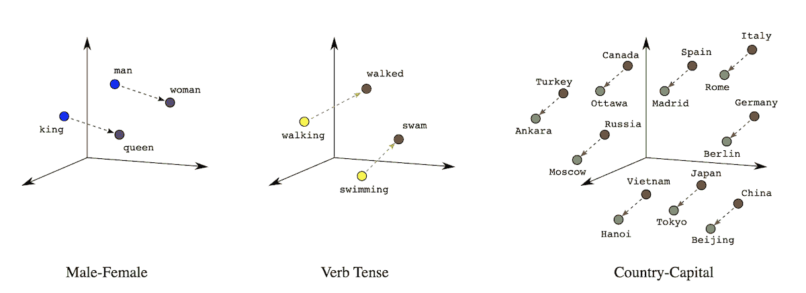

# ML 101:什么是机器学习——现在和不久的将来

> 原文：<https://www.algolia.com/blog/ai/an-introduction-to-machine-learning-for-images-and-text-now-and-in-the-near-future/>

随着机器学习技术的显著发展，人们不禁会问—*下一步是什么？*但是 要谈论基于 ML 的搜索(使用机器学习的搜索)的未来，我们需要知道和理解已经存在的东西。在这篇文章中，我们将仔细看看两个流行的应用程序，说明了艺术的状态-图像识别和语义搜索。了解机器学习如何实现通过图像或描述性和基于问题的文本进行搜索，将有助于我们预测不久的将来。

我们将展示机器如何识别图像，以创建按图像搜索的功能。图像识别将提供对机器如何学习的直观理解。然后我们将继续进行语义搜索，向您展示机器如何学习单词的含义，从而使我们能够通过日常语言(习语、句子和问题)进行搜索。

我们将保持高水平。因此，不要期望看到任何数学模型或术语，如神经元、隐藏层、权重、偏差和成本函数。相反，你将理解驱动机器学习的 机制——这是在[深入](https://www.algolia.com/blog/ai/what-is-vector-search/)网络之前的最佳起点。

## 机器学习——识别像素和图片，寻找相似图像

### ***监督式*机器学习**

如果你给计算机输入 1000 张狗和猫的图像，并正确地标注为“狗”和“猫”，那么一个 ML 算法最终可以知道狗或猫长什么样。它是这样做的:它将图像分解成像素，将像素转换成数字(代表颜色)，将这些数字绘制在图表上，然后识别狗或猫图像的典型模式。一些像素可能包含鼻子(楔形或吻形)或耳朵(尖或下垂)形状的图案。

给每张图片贴上“狗”或“猫”的标签有助于计算机知道它的猜测是对还是错，以及错了多少。如果它是错误的，它会重新处理图像，锐化其模式检测，直到它最小化其判断的错误。当计算机能够预测到图像是一只狗或一只猫的时候，这个过程就结束了——这种可能性非常高。

### **从*有监督*到*无监督*学习**

刚刚描述的狗和猫的图像识别算法被称为 *监督* 学习，这意味着它使用图像标签(或其他元数据)来帮助它学习。然而，贴标签是乏味的——也是不可能的:如果我们想让我们的机器理解这个世界，我们不可能给世界上的每一个物体贴标签。比如注释狗和猫很容易，但是在医学报告中注释预后又如何呢？所以我们需要一个不用显式标注就能学习的算法。我们需要教会计算机学习 *无监督*——也就是无标签。这是机器学习中的一个重大变化，影响了 ML 建模过程的所有方面。

然而，有一点是不变的:监督学习和非监督学习都依赖于错误检测；也就是说，它们都运行并重新运行 ML 过程，直到其预测中的误差最小化。有了监督学习，ML 模型使用了一个 *真/假* 错误分析(是狗吗？它是一只猫吗？);在无监督的情况下，虽然它可以使用二元是/否分析，但它更经常地对 *的可能性进行概率测试。T42*

### ***无监督*机器学习——对物体进行分类(聚类)**

无监督学习使用 *聚类*——也就是说，它将对象分组到具有相似特征的类中。因此，无监督学习不是将一只狗与一只狗进行比较，而是将几只动物输入一个系统，并允许机器辨别具有相似特征的不同群体。计算机可能会发现猫和狗，但它也会发现像毛茸茸的动物、小动物、有牙齿的动物、有鳍或爪子的动物等群体。一般来说，无监督学习是基于我们输入到系统中的特征来寻找相似性和差异。

你可能更喜欢一个监督系统，把狗归类为狗，把猫归类为猫。但是，基于世界上存在的许多可能的相似性，一个无监督的系统可以检测许多种分组，这是一个非常强大的检索工具。例如，当你输入一张新的狗的图片时，系统不仅检索到一只狗，还可能检索到相同的种类和姿势。这是可能的，因为无监督学习场景考虑了所有详细的像素信息，所有这些都可以允许它根据物种和不同的姿势对动物进行分类。

这都是关于集群的。

###### *来源:GraphicMama-team*

*机器学习识别物体，并根据显著特征进行聚类:1、毛茸茸的狗；2、嘴里有东西；3、反面；4、发现。*

### **聚类——无监督的机器像孩子一样学习**

机器学习模型将内容分解成小块(图片中的像素，文本中的单词)，并为每一块赋予特征。例如，像素有颜色和形状，当它们放在一起时，就形成了一幅图片；单词被其他单词包围，当这些单词放在一起时，就形成了有意义的短语和上下文。

我们可以把机器想象成玩几何积木(立方体、球体、三维三角形等)的孩子。).游戏就是把他们组合在一起。一个孩子可能会感觉到并把它们翻过来。另一个孩子将品尝它们或将它们扔向墙壁，观察它们如何反弹。两个孩子都在通过寻找特征并根据相似性对物体的形状进行分类。第一个孩子用边和角；另一个用味道和密度。对于两个孩子来说，虽然他们可能无法命名物体，但最终会将立方体和球体放入不同的组(群)。

机器也是这样。我们告诉机器要看什么(形状、角度，也许不是味道)，然后将大量不同的形状输入机器。该机器经历一个来回的过程(ML 模型和算法),直到它成功地将不同的形状聚类成有意义的类别。

### **模式和将世界分组为集群**

大多数无监督学习模型将真实对象表示为一组数字，称为向量，因为计算机只能计算和比较数字。然后，机器获取这些数字集，并多次调整它们(就像一个孩子多次摆弄一个立方体一样)，直到模型中出现清晰的模式，使模型能够将对象分成有意义的集群。

在几何示例中，对象很简单:三角形、正方形、圆形等。，其中每个对象由一个向量表示([边数、长度、宽度、角度])。如果您将每个对象的这些值的大样本输入到学习过程中，模型将执行一组计算，这些计算将转换矢量化的数字并将它们输出到图形(向量空间)上。这种转变就是学习发生的地方。起初，物体是随机分散的，但如果你将转换后的向量反馈回机器并重新应用计算，它们将被放置在二维图形的不同部分。彼此靠近的图像在意义上是相似的。正方形将靠近正方形，三角形靠近三角形，直线对象(三角形和正方形)将被推离圆形更远。

### **世界是由复杂的物体组成的**

当然，世界没有这么简单。例如，基于 ML 的自动驾驶汽车如何识别一个孩子正在跑过街道？嗯，我们首先需要添加更多的特征，而不仅仅是二维的；我们需要 1000 个甚至几百万个维度，比如速度、运动、颜色、形状、大小、重量、方向等等。计算机输入系统的代表儿童奔跑的移动三维图像的特征越多，最终的聚类就越好——计算机就越“知道”汽车应该继续行驶、减速还是停车。

## 从图像到文本——无监督机器学习应用于文本

从图像到文本，应用于文本搜索的技术水平在过去 10 年里有了不可估量的发展。在这一节中，我们将看到机器学习如何取代或结合历史悠久的搜索技术来创建语义搜索，对单词之间有意义的关系进行分类和检测。

### **奠定文本搜索的基础:非 ML 词匹配和关键词搜索**

搜索建立在理解 *文字*——字母和单词——而不是 *意思* 。目标始终是将 *单词与* 单词相匹配，从而查询到文本的底层索引。

在 90 年代，使用自然语言处理(NLP)的高级单词匹配技术使我们能够构建强大的搜索引擎。当时我们无法构建任何语义。单词匹配依赖于理解语法和语言的词典和 NLP。单词匹配还包括创建预定义的规则和同义词，以及检测拼写错误和打字错误等技术。

最重要的是，关键字搜索和单词度量统计，如 TF-IDF(词频-逆文档频率),用于改善单词匹配。有些搜索引擎只匹配全词；其他的执行前缀匹配，这意味着搜索引擎一次一个字母地查询文本。前缀搜索返回用户输入的即时搜索结果。

这些技术中有许多非常强大，现在仍在使用。例如，当使用 *结构化的* 数据(如定义明确的对象)时，基于 NLP 的关键字搜索会立即返回完全相关的结果。想象一系列厨房产品，或者电影，甚至是建筑设计图。另一方面，像 TF-IDF 这样的基于统计的搜索方法更适合于长的 *非结构化的* 文本，其中单词的频率有助于确定相关性。例如，查找单词“whale”的频率，应该会出现莫比·迪克以及关于鲸声音和捕鲸业的书籍。

机器学习让关键词搜索更上一层楼。

### **机器学习和非结构化文本:寻找上下文**

标准单词匹配技术缺少的是对文本的 *语义* 理解。使用有监督和无监督的学习技术，计算机可以查看数百万个具有数十亿个 [单词关系](https://ronxin.github.io/wevi/) 的文档来确定语义。例如，机器可以确定银行、共同基金和对冲都与金融机构和财务管理有关。当有人搜索“投资我的钱的最佳地点”时，机器学习算法可以开始对问题进行语义理解。

### **聚类和构建单词关系**

与图像识别一样，机器学习涉及基于相似特征对单词进行分类(聚类)。对于单词，聚类会变得非常复杂，因为单词可以放在许多不同的聚类中。同一个词，如“跑步”，可以放在语法簇(动词，ing-words)，体育，运动，动物做的事情，水做的事情，等等。这只是一个词。

我们举个简单的例子:如果用户问“今天有多热”，计算机可以检测出上下文(天气，尽管没有提到“天气”)和中心思想(温度，来自“热”)。考虑到这一点，一台训练有素的计算机可以回答如下问题:“今天的温度将达到华氏 90 度，请务必穿上轻便的衣服，并涂上大量的防晒霜！”。

### **机器如何学习聚类单词:寻找模式**

类似于图像识别的功能，其中图像被输入到机器中以找到有助于对图像进行分类的模式，多个文档和短语可以被输入以辨别语义单词模式，这使得机器能够基于相似性和差异将单词划分成簇。

主要的技巧是看 *短语* 看每个短语中的每个单词是如何使用的。朗朗上口的公理“你应该通过它的同伴知道一个单词”，抓住了这个逻辑:计算机(和孩子)通过检查单词在有意义的文本和对话中如何使用来学习 *上下文* 。语境就是短语。

让我们用狗和猫可以互换的下列两个短语:“猫”和“狗跳上屋顶”。因此，“猫”和“狗”是相似的。猫狗也会“跳”——因此，猫狗可以群集在“跳”字附近。尽管桌子、飞机和地毯离“跳”这个词很遥远，但它们都可以“跳”出纸面…你可以看到它有多复杂！最终，你会得到大量定义明确且相互重叠的集群。

然而，这并不是一个小任务。你可以想象，如果对每个单词都进行这种语言学习，计算机可能会学习数十万个单词，其中有数百万种微妙的变化，结果谁知道会有多少重叠的簇。而且很多句子并没有包含任何有用的信息，比如“我看到了一只猫”——意思是猫是一个可以看到的*物体*，但是没有给出物体的*种类*。

## 今天的语义搜索明天:将过去的工具与机器学习的进步混合在一起

自然语言处理(NLP)总是有必要筛选世界上 1000 多种语言的句法和语法，以及它们不同的规则和例外。

然而，语义搜索已经取代了手动创建同义词、规则或统计数据的需要。机器学习生成单词相似度，甚至比同义词更强大，建立一个不需要规则和统计的索引..

前缀、即时、关键词搜索呢？他们哪儿也不去，我们将在下面看到。

因此，回到本文的最初目标，在不久的将来会发生什么？

### **结构化文本和关键词**

单词和关键词匹配永远不会消失，尤其是当内容是结构化的和标签良好的时候。甚至像“500 内存的廉价蓝色手机”这样的复杂搜索也可以用关键字搜索很好地解决，因为它基于关键字的结构很容易检测。

也就是说，机器学习仍然可以在结构化内容领域提供帮助。例如，当您输入“给我看看跳舞用的鞋子”，而产品列表中不包含“跳舞”这个词时，会发生什么情况？这就是语义搜索的亮点。多亏了语义机器学习，“跳舞”可以通过它的上下文来理解，其中包含舞厅、芭蕾舞演员、婚礼鞋和晚礼服等词的鞋子描述将与“跳舞”的鞋子在上下文中相似。

### **非结构化文本和机器学习语义**

但是语义搜索最大的价值在于非结构化文本。不是所有的数据都可以被结构化。考虑一个在线书商。语义将帮助引擎理解查询“具有魔力的孩子”匹配哈利波特书籍，或者“混沌理论和恐龙”匹配侏罗纪公园书籍。

### **ML 和语义搜索的进步将继续推动 NLP 和关键词**

基于 ML 的搜索将继续以显著的方式改变搜索。例如:

*   费力的 NLP 编码将被基于 ML 的 NLP 取代，它可以理解语言的异常复杂性，在某些情况下，甚至比人更好。
*   基于 ML 的图像搜索将与关键字搜索并行工作。例如，使用房屋图纸来搜索类似房屋的用户，也可以通过在搜索栏中键入“5 个房间”并点击小平面“木质镶板”来进一步深入。这是可能的，因为机器可以在图像识别过程中提取关键词，为每张图像创建关键词索引(和聚类)。

如果说机器学习的爆炸式增长有什么模式的话，那就是 ML 如何继续与关键词搜索、NLP 和其他强大的搜索技术相结合，以创建一个更强大的搜索和发现平台。