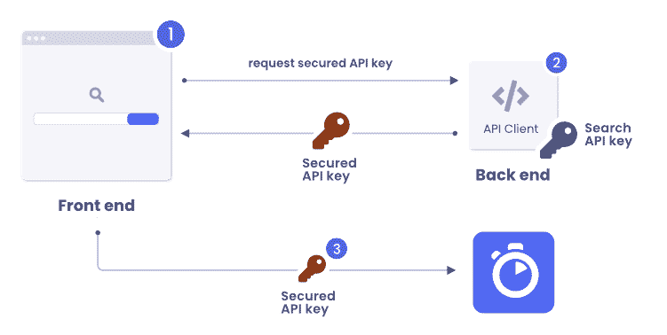
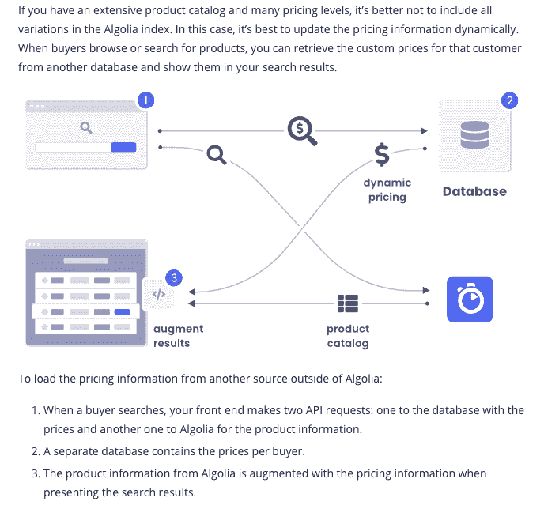
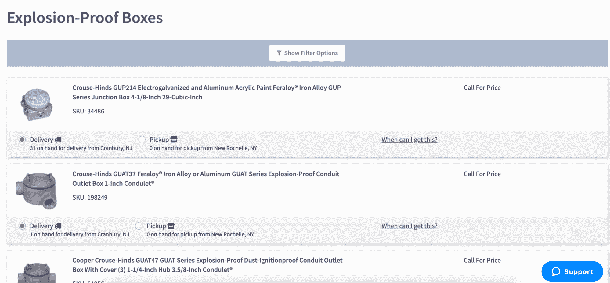

# B2B 商务数字化转型:个性化

> 原文：<https://www.algolia.com/blog/ecommerce/b2b-commerce-digital-transformation-personalization/>

优化 B2B 电子商务网站上的[搜索和导航](https://www.algolia.com/blog/ecommerce/b2b-commerce-digital-transformation-search-filtering-sorting-and-navigation/)体验 是实现 B2B 业务数字化的重要一步。下一步是配置一个设计良好的[销售策略](https://www.algolia.com/blog/ecommerce/b2b-commerce-digital-transformation-merchandising-and-ai-optimizations/) ，包括整合人工智能工具，利用“群体智慧”自动生成同义词和产品推荐，以及动态重新排列搜索结果和产品在类别页面上的显示顺序。个性化在这种设计之上又增加了一层。

为每个用户个性化搜索结果和类别页面不仅可以最大限度地减少购物者搜索产品的时间，我们知道这是一个非常重要的因素，也是 B2B 购物者的[最佳实践](https://www.algolia.com/blog/ecommerce/b2b-commerce-digital-transformation-why-should-b2b-retailers-adopt-b2c-best-practices/)、、而且还可以确保用户始终看到与他们独特偏好最相关的结果。实施个性化策略可以确保每个用户在 B2B 网站上都有不同的电子商务体验，这些体验符合用户的特定需求和购物习惯。预期结果将是客户满意度的提高，这对于 [B2B 电子商务的成功](https://www.algolia.com/blog/ecommerce/b2b-commerce-digital-transformation-why-should-b2b-retailers-adopt-b2c-best-practices/) 至关重要，因为单个“用户”实际上可以代表一家大公司的众多用户，并负责下大订单。考虑到每个购物者的体验对 B2B 行业的重要性，用户在 B2B 电子商务网站上的旅程可能比 B2C 零售商更重要。

个性化对 B2B 公司来说有几种意义。除了我们刚刚讨论的用户级别的行为个性化之外，还需要帐户级别的个性化。这种个性化解决了 B2B 商务的特殊需求。对于 B2B 公司，向其他企业销售产品和服务可能意味着拥有特定的目录、价格或 SKU，这些都可以在帐户级别进行个性化。

## 个性化 B2B 搜索体验的四种方式

B2B 电子商务网站的个性化类型:

1.  个性化目录
    *   公司与权限设置
2.  个性化定价
    *   针对每个用户和客户群的动态定价
3.  SKU 个性化搜索
    *   通过别名搜索自定义别名
4.  行为个性化
    *   个性化查询建议
    *   1:1 个性化

### **个性化目录**

B2B 产品目录往往很复杂，每个买家账户都有许多产品变化和特定的条款和条件。通常，B2B 购买流程也比 B2C 更复杂，涉及不同权限的不同用户。

例如，一个帐户中的买家可能有权请求产品报价，但实际上并没有购买，或者根据允许他们购买的产品查看不同版本的产品目录。当个人买家搜索或浏览时，他们希望只找到他们有权看到的产品。

使用 Algolia，您可以使用 [安全 API 密钥](https://www.algolia.com/doc/guides/security/api-keys/#secured-api-keys) 来确保每个登录用户只能搜索或浏览他们有权访问的产品目录部分。

例如，您可以使用安全 API 密钥:

*   将搜索限制到特定索引
*   对每个搜索应用预定义的过滤器
*   将预定义的搜索参数应用于每次搜索

https://www . algolia . com/doc/guides/security/API-keys/# secured-API-keys

### **个性化定价**

根据 B2B 买方和卖方之间的具体协议，为每个买方账户定制定价、库存和其他条件。有了 Algolia，你可以确保每位买家都能看到适用于他们的条件。

根据您的定价结构，处理灵活价格和其他条件所采用的策略:

*   固定价格和折扣。如果你有一个适用于所有买家的产品目录，没有每个买家或每个细分市场的差异，你可以使用 Algolia 的常规 B2C 解决方案。标准价格是价目表中产品的固定价格。比如“公价从”。
*   定价等级。如果您的客户群具有不同的定价等级，您可以将每个客户群的价格作为其自身的属性进行索引。当买家搜索时，会显示他们所属细分市场的价格。对于每个细分市场的定价，不同的价格是为不同的买家群体量身定制的。
*   每位买家的定制价格。如果每个买家帐户都有自己的定价，您可以动态更新定价信息。当买家搜索产品时，您从数据库中获取该特定买家的产品价格，并将其显示在搜索结果中。
*   基于数量的单位定价。根据订单数量，单价需要实时变化。
*   可协商报价/现货合约定价(按用户定价)。允许您的 B2B 购买者直接从购物车中请求报价并使用协商的价格更新定价信息。商务平台应该允许 B2B 卖家查看、接受和拒绝报价请求。

*注意:给定产品的库存可用性或运输交付时间可能因 B2B 买家而异。例如，B2B 销售者可以允许苹果购买 10 台，微软购买 20 台。定价和库存可用性将需要个性化和实时反映。*

实施个性化定价时，您可以从许多可用的解决方案中进行选择。该决定可能取决于业务需求和架构依赖性或其他功能限制。解决方案评估标准应考虑可扩展性/记录数量、可用性以及对个性化、商品销售、动态重新排名、推荐、分析、仪表板可用性、过滤&排序以及索引性能等功能的影响。

个性化定价策略实施的一个例子是*延迟加载*定价信息，对每个客户或每个用户组使用一个指数:

https://www . algolia . com/doc/guides/solutions/ecommerce/B2B-目录-管理/教程/个性化-定价/

在下面的例子中，B2B 电子商务网站要么要求客户登录以查看具体价格，要么根据之前协商的价格连接到销售代表以核实定价信息。

### **个性化‘按别名搜索’**

终端企业用户能够通过 SKU 搜索自定义别名。例如，通常在 B2B 网站上订购一套清洁产品的业务代表将能够输入别名查询“清洁产品”,并看到他们通常订购的所有产品的列表。这种类型的自定义别名对特定用户来说是唯一的，对其他用户不可用。每个自定义别名都将针对特定的业务用户配置文件进行个性化设置。

### **行为个性化**

[个性化](https://www.algolia.com/products/search-and-discovery/personalization/) 通过在关联策略中加入个人层，加强了交互搜索。在搜索体验中加入个性化的偏好会让搜索结果对个人用户更有吸引力。

行为个性化允许 B2B 网站将历史客户信号整合到 ML 中，以根据以下数据智能地对结果进行排序:

*   位置/地理
*   首选商店
*   过去的购买记录
*   过去的搜索
*   首选品牌
*   按地区划分的季节性
*   产品/客户细分目标(根据地区和行为产生群体)

在决定个性化策略时，公司需要首先分析哪些客户信号对他们的业务最有价值。这将使公司能够控制和“定制”个性化在网站上的应用方式。例如，我们可以为客户行为的不同方面赋予不同的权重，例如赋予品牌与商店更高的重要性。

[个性化查询建议](https://www.algolia.com/doc/guides/building-search-ui/ui-and-ux-patterns/query-suggestions/how-to/personalizing-suggestions/js/) :根据不同用户的个性化配置文件，向他们显示同一查询的不同建议。

[【1:1 个性化](https://www.algolia.com/doc/guides/personalization/what-is-personalization/%5D) :根据用户先前在网站上的行为和独特的用户偏好，将搜索和浏览结果个性化到每个用户简档。B2B 客户在下订单时经常使用相同的类别和子类别。考虑到在大多数情况下，企业用户需要登录才能浏览目录并进行购买，跟踪他们在网站上的行为并个性化他们的购物体验是非常有益的。

个性化对于 B2B 电子商务行业非常重要。有多种策略可以借鉴 B2C 最佳实践，如行为个性化。同时，有一些独特的方面和要求在 B2B 行业中特别常见，例如个性化目录和定价，需要有效地解决这些问题，以便提供卓越的电子商务体验。通过精心规划数字化转型和[逐步实施 B2B 电子商务解决方案](https://www.algolia.com/blog/ecommerce/b2b-commerce-digital-transformation-how-to-build-a-successful-b2b-ecommerce-website-incorporating-best-industry-practices/) B2B 零售商将能够跟上 B2C 行业趋势，满足购物者对 B2B 电子商务网站的期望。此外,[可组合的商业方法](https://www.algolia.com/blog/ecommerce/composable-commerce-how-to-select-best-of-breed-components-to-meet-your-business-needs/)将提供传统技术栈架构所不具备的灵活性和可伸缩性。这种方法给了 B2B 公司快速发展和成为行业领导者的自由。B2B 电子商务成功的关键是随时准备适应新的趋势，并在过程的每一步满足买家的期望和需求。

[](https://www.algolia.com/search-inspiration-library/?configure%5BhitsPerPage%5D=9&indices%5BPROD_algolia_com-inspiration-library_query_suggestions%5D%5Bconfigure%5D%5BhitsPerPage%5D=6&indices%5BPROD_algolia_com-inspiration-library_query_suggestions%5D%5BrefinementList%5D%5Bpage%5D=1&indices%5BPROD_algolia_com-inspiration-library_query_suggestions%5D%5Bpage%5D=1&page=1&refinementList%5Bindustry%5D%5B0%5D=B2B%20Retail&refinementList%5BbizDevTools%5D=&refinementList%5BuseCase%5D=&refinementList%5BimpactedPage%5D=&query=)