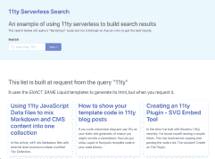

# 使用 11ty Serverless、Netlify 和 Algolia-Algolia Blog  Blog 为静态网站构建服务器呈现的搜索

> 原文：<https://www.algolia.com/blog/engineering/building-server-rendered-search-for-static-sites-with-11ty-serverless-netlify-and-algolia/>

在创建任何网站或应用程序时，渐进式改进都是一个重要的主题。当用户的浏览器不能处理任何 JavaScript 或您正在使用的特定 JavaScript 时会发生什么？如果您的前端出现故障，您需要一个后备来允许基本功能继续工作。

这有什么难的？

当您在 Jamstack 上工作时，这可能比在传统堆栈中工作要困难得多。由于 Jamstack 致力于从 CDN 提供 HTML，我们没有传统的服务器，只有静态文件和无服务器功能。因此，我们可能会发现自己在为前端和服务器重写渲染代码。三年和重新设计过去了，突然你在时间机器里看着去年设计的搜索结果。

有了 11ty 新的无服务器包和 Netlify 功能，我们可以从服务器快速启动。在此基础上，我们可以逐步增强使用 InstantSearch.js 等库的体验。

## [](#what-is-11ty-serverless)什么是 11ty 无服务器？

11ty 是一个用 Node.js 编写的静态站点生成器，它提供了多种模板语言和多种获取数据的方法。它的构建考虑到了灵活性。

历史上，它在构建过程中完成所有工作，并生成可以存储在 CDN 上的 HTML。这就创建了在 Jamstack 上运行得非常好的快速网站。

对于任何动态内容，它都依赖前端 JavaScript 来获取数据。这在许多情况下都有效，但是没有提供明确的渐进增强的途径。

如果你的前端代码失败了，你的站点的动态方面也会随之失败。随着 11ty 1.0 版本的发布，这将不再是一个问题。11ty 将捆绑可选的 11ty 无服务器插件。这将允许开发者指定可以处理用户输入的路由。该输入可以来自查询参数或 URL 结构本身。

## [](#what-were-building)我们在建设什么



在这个演示中，我们将采用一个非常简单的 11ty 站点，并添加一个动态搜索路线。该搜索路径将使用 11ty 和一个模板过滤器在一个无服务器的函数中创建 HTML 所有这些都来自我们习惯的 11ty 代码。这将用于我们渐进增强中的“后退”。虽然我们不会在这个演示中构建一个基于 JavaScript 的搜索，但是使用 InstantSearch.js 创建一个[实时搜索是一个坚实的用户体验的基础。](https://www.algolia.com/doc/guides/building-search-ui/what-is-instantsearch/js/?utm_source=blog&amp;utm_medium=main-blog&amp;utm_campaign=devrel-jamstack&amp;utm_id=11ty-serverless)

我们将如何构建它:

1.安装插件并配置无服务器功能
2。创建搜索页面
3。创建一个`getResults`模板过滤器来查询我们的 Algolia 索引

## [](#setup)设置

我们将从一个基本的 11ty 模板开始，只需要一点 HTML 就可以了。

首先，[克隆这个库](https://github.com/brob/11ty-serverless-search)并安装依赖项(11ty 1.0 和 dotenv)。

想看看成品吗？检查存储库的`final`分支或者[查看这个演示站点](https://11ty-search.netlify.app/)。

```
npm install && npm start

```

我们项目的结构遵循 11ty 站点的基本结构。各个页面都在项目的根目录下——目前只有`index.html`文件。模板在`_includes`目录中。配置文件是根目录下的`.eleventy.js`。站点模板也相对简单:一个包含页眉和页脚的基础模板。

一旦安装完成，我们将有一个本地运行的 11ty 工作站点。还不是很有意思，只是一个带一点 HTML 的索引页面。让我们添加一个搜索页面来引入一些内容。

## [](#install-and-configure-the-11ty-serverless-plugin)安装并配置 11ty 无服务器插件

在其最新的 1.0“金丝雀”版本中，11ty 附带了插件 11ty 无服务器。这有助于生成我们需要按需运行 11ty 的无服务器功能。

为了在我们的项目中安装它，我们需要更新`.eleventy.js`配置文件。

```
require("dotenv").config();  
const { EleventyServerlessBundlerPlugin } = require("@11ty/eleventy");  

module.exports = function(eleventyConfig) {  
    // Configuration rules  
    eleventyConfig.addPlugin(EleventyServerlessBundlerPlugin, {  
       name: "search", // The serverless function name for the permalink object 
       functionsDir: "./netlify/functions/",  
     });  
};

```

由于 11ty 正在我们的项目中创建我们不想在版本控制中跟踪的文件，请用以下项目更新您的`.gitignore`:

```
netlify/functions/search/**  
!netlify/functions/search/index.js

```

当我们重新运行`npm start`时，11ty 现在将在`functionsDir`指定的目录中创建一个无服务器函数——以及所有必要的包文件，其名称由`name`属性指定。

在大多数情况下，您不会修改这些文件。该插件生成了`index.js`文件，可以对其进行编辑以用于更高级的用例。11ty 将在每次运行时覆盖该目录中的其他文件。

## [](#create-a-page-to-use-the-serverless-function)创建页面使用无服务器功能

现在 11ty 已经创建了该函数，我们可以添加一个页面来使用它。

首先在项目的根目录下创建一个名为`search.html`的新文件。在文件中，我们可以用 frontmatter 配置页面的数据。

```
---  
layout: "base.html"  
title: Search Page  
permalink:  
 search: /search/  
---

```

变量`layout`将指示使用`_includes`中的哪个模板进行显示。变量`title`将显示在 HTML 的

 `The `permalink`对象中，我们在这里指定这个页面的最终 URL 应该是什么。

如果你熟悉 11ty，你可能记得`permalink`变量是一个字符串。对于简单的用例，您仍然可以使用字符串，但是对于无服务器，它将是一个对象。对象的键将是我们在无服务器功能的配置中指定的名称。

您也可以通过这种方式根据 URL 指定不同的无服务器功能。如果希望在构建时和请求时生成页面，也可以为 permalink 指定一个`build`键。

一旦添加，页面将在`/search/`呈现。除了页眉和页脚之外，它没有任何内容。让我们从查询参数中获取一些动态内容。

```
---
layout: "base.html"
title: Search Page
permalink:
  search: /search/
---

<h2 class="is-size-3 mb-3">This list is built at request from the query "{{ eleventy.serverless.query.query }}"</h2>

```

这将创建一个标题，查看我们路线的查询参数，并插入`query`参数包含的任何值。

如果您访问 URL 末尾带有`?query=11ty`的页面，字符串`11ty`将出现在标题中。

那么，我们如何进行查询并从 Algolia 得到结果呢？

## [](#create-a-getresults-template-filter)创建一个`getResults`模板过滤器

为了获得呈现模板所需的数据，我们需要创建一个模板过滤器。过滤器将接受来自无服务器页面的查询字符串，根据 Algolia 索引运行查询，并将一组文章返回到我们的搜索页面。

在我们深入研究代码之前，您需要有一个 Algolia 应用程序和一些环境变量。如果你已经有一个 Algolia 索引，请随意使用。我们将使用一个索引，其中包含带有标题、描述和 URL 的博客文章。如果您没有 Algolia 指数，[创建一个帐户和应用程序](https://www.algolia.com/users/sign_up?utm_source=blog&utm_medium=main-blog&utm_campaign=devrel-jamstack&utm_id=11ty-serverless)，并使用这些数据手动创建您的第一个指数。

```
[
    {
        "title": "Creating an omnibar with Autocomplete",
        "description": "In this tutorial, we’ll walk through setting up Autocomplete to fire interactions with JavaScript. Specifically, we’ll build an omnibar to toggle light and dark mode for our website. An omnibar is a search field that has both search and actions that can be taken. A strong example of this is the Chrome or Firefox search and URL bar.",
        "url": "https://www.algolia.com/blog/engineering/creating-an-omnibar-with-autocomplete/"
    },
    {
        "title": "Building a Store Locator in React using Algolia, Mapbox, and Twilio – Part 1",
        "description": "These days, ecommerce shoppers expect convenience and want the physical and online worlds to mesh allowing them to conduct their business on whichever channel they want. For example, users may choose to:",
        "url": "https://www.algolia.com/blog/engineering/building-a-store-locator-in-react-using-algolia-mapbox-and-twilio-part-1/"
    },
    {
        "title": "Introducing Algolia Recommend: The next best way for developers to increase revenue",
        "description": "Now, with the introduction of Algolia Recommend, Algolia further enables developers to unleash the component of the experience that drives the remaining part of the product discovery experience: product recommendations. ",
        "url": "https://www.algolia.com/blog/product/introducing-algolia-recommend-the-next-best-way-for-developers-to-increase-revenue/"
    }
]

```

一旦有了索引，创建一个`.env`文件并添加以下变量:

```
# The app id
ALGOLIA_APP = ""
# The search-only API key
ALGOLIA_SEARCH_KEY = ""
# The index name
ALGOLIA_INDEX = ""

```

一旦这些都准备好了，我们就可以通过 Algolia JavaScript 客户端提交查询来获得结果。因为我们的查询可以在模板中访问，所以我们将创建一个新的模板过滤器来使用查询并返回结果。

要创建一个新的过滤器，我们需要在`.eleventy.js`配置文件中扩展 11ty。

首先，我们将安装`algoliasearch` NPM 软件包。

```
npm install algoliasearch

```

```
require("dotenv").config();
const { EleventyServerlessBundlerPlugin } = require("@11ty/eleventy");
const algoliasearch = require("algoliasearch");

const client = algoliasearch(process.env.ALGOLIA_APP, process.env.ALGOLIA_SEARCH_KEY);
const index = client.initIndex(process.env.ALGOLIA_INDEX);

module.exports = function (eleventyConfig) {
  eleventyConfig.addPlugin(EleventyServerlessBundlerPlugin, {
    name: "search", // The serverless function name from your permalink object
    functionsDir: "./netlify/functions/",
  });

  eleventyConfig.addFilter("getResults", function (query) {
    return index.search(query, {
      attributesToRetrieve: ["title", "url", "date", "description"],

    }).then(res => {
      return res.hits;
    })
  });

};

```

在文件的顶部，我们将使用 API 键、应用程序名称和索引名称来设置 Algolia 搜索客户端。之后，在导出的函数内部，我们将使用 11ty 的`addFilter()`方法添加一个过滤器。

该方法接受两个参数:用作过滤器的字符串和使用时要执行的函数。该函数将接收从页面文件传递的数据。在这种情况下，它将是用户输入的查询。

在这个简单的例子中，我们将查询传递给`index.search()`方法，并只请求回我们需要的属性，以保持我们的响应较小。当结果返回时，我们可以将结果返回到我们的页面，以便在模板循环中使用。

```
---
layout: "base.html"
title: Search Page
permalink:
  search: /search/
---

<h2 class="is-size-3 mb-3">This list is built at request from the query "{{ eleventy.serverless.query.query }}"</h2>


<div class="card-grid">
  
    
  
</div>

```

在页面中，我们使用 Liquid 中内置的`assign`标签将数据赋给一个变量。然后，我们可以遍历返回的数组，并将该信息传递给 include。这个 include 可以用于这些结果以及网站上的任何文章显示。应该在`_includes`目录中创建`article.html`文件。

```
<article class="card column">
    <h2 class="title"><a href="{{ result.url }}">{{ result.title }}</a></h2>
    <p class="content">{{ result.description }}</p>
</article>

```

由于 11ty 无服务器，我们现在在静态生成的网站中有了一个工作服务器呈现的搜索。11ty 无服务器可以帮助我们克服静态站点中的其他模式吗？在我们的开源代码交换平台上查看相关解决方案。

[](https://www.algolia.com/developers/code-exchange/?query=netlify&page=1)`