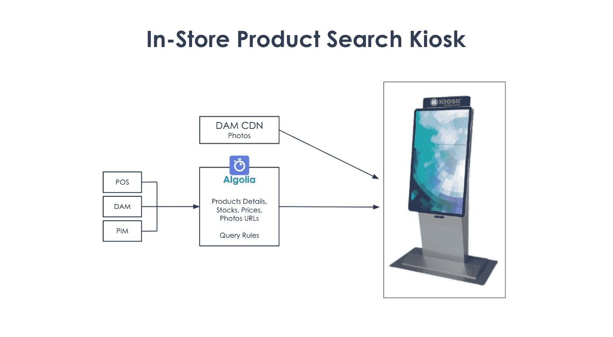
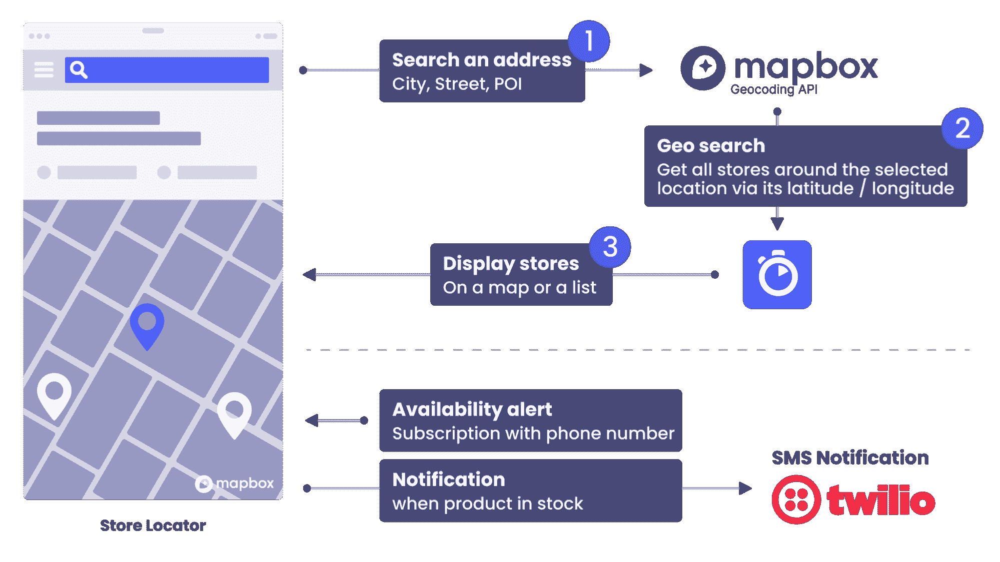

# 可组合商务:如何建立店内产品搜索亭和商店定位器

> 原文：<https://www.algolia.com/blog/ecommerce/composable-commerce-how-to-build-an-in-store-product-search-kiosk-and-store-locator/>

继续我们关于可组合商务的系列，我们将展示两个应用程序，它们将日益流行的在线购物和实体购物结合在一起。想象一下。在繁忙的零售店中，顾客想知道产品是否有不同的颜色。他们不再等待销售代表，而是在店内信息亭独立查找所有库存信息。如果该产品在他们当前的商店中没有，他们会很方便地掏出手机，在附近的一个地方找到相同的产品。他们订购商品并在回家的路上取货。这是*店内信息亭(在线库存查询)*与*点击取货商店定位器*的完美结合。对顾客的便利:不需要额外的旅行，不需要等待送货。品牌促成了销售，赢得了顾客的长期忠诚。

让我们更仔细地看看这些应用程序。

## 店内售货亭

**App:** 商品搜索亭

**中:** 店内

**目标/问题解决:**

*   独立浏览存货
*   即时检索当前商店和其他商店的产品详情和供货情况

**主要用户:**

*   店内顾客
*   店员

将网上购物的便利融入购物者的店内体验。随着网上购物的兴起，顾客的购物习惯发生了巨大的变化。比起向销售助理寻求帮助，他们更喜欢独立研究。让购物者可以通过产品搜索亭浏览商店库存。使客户能够立即找到准确可靠的问题答案:检索当前或附近商店的产品详情和产品供应情况。无论顾客是在寻找特定的服装颜色、洗涤说明还是搭配建议，这些信息现在都可以在店内获得，就像在网上一样。

产品搜索亭解决了零售店可能遇到的最困难的技术挑战:

*   供货情况必须每 15 分钟更新一次，价格每天更新
*   数据来自各种来源:不同的目录(商店、国家、全球)，不同类型的数据来自不同的来源(商品、可用性、价格、产品图片和其他媒体资产)
*   多索引搜索:每个国家一个索引用于库存管理，每个语言一个索引用于产品信息
*   零售商所在国家/地区各种语言版本的目录
*   数据的地理复制，以及在世界各地安装应用的能力

Algolia 是面向零售商的同类最佳店内产品搜索亭应用的产品数据平台。

*   商业价值
    *   使用同义词来克服产品数据限制，并更容易地向购物者推荐相关产品(例如，“异国情调”是“鳄鱼”和“鸵鸟”的同义词)
    *   销售产品目录，以执行您的活动，或在店内售货亭展示最新商品
    *   速度、相关性、打字错误容忍度、过滤器和方面等等，所有这些都有助于商店员工在向顾客提供建议时获得顺畅的体验
    *   Kiosk 应用程序允许购物者发现他们最初没有想到的商品
*   技术价值
    *   利用 Algolia 强大的 API 来聚合 Algolia 中的所有产品数据，以提供出色的体验
    *   Algolia 的可靠性和可扩展性允许零售商在全球范围内使用我们的平台
    *   由于平台和编程语言无关的软件架构，Algolia API 优先的方法可以在任何地方轻松实现。

## 商店定位器

**App:** 带“网上购买，到店取货”功能的店铺定位器

**中:** 在线/远程

**目标/解决的问题:**

*   线上线下购物体验的平滑融合
*   简化的库存可用性信息检索，消除了亲自/电话询问商店员工的需求
*   消除顾客因在实体店发现产品缺货而产生的挫折感
*   购物灵活性，允许产品交付的多种选择:
    *   网上购物，如果商品比正常运输时间更快，可在当地商店提货
    *   网上购物，如果最近的商店没有该商品，可在邻近的商店提货
    *   如果您正在旅行，并且物品在出发日期前无法提供，请在线购物并在目的地提货
*   适应新冠肺炎相关用户的购物习惯:
    *   无法在实体店购物的顾客可以通过商店的免下车服务选项，以非接触式交易的方式轻松提取他们购买的商品

**主要用户:**

通过提供多种产品交付方式，让您的用户在购买过程中拥有更大的灵活性。喜欢非接触式购物体验作为店内购物之旅替代选择的购物者现在可以在线订购商品，并在商店提货。商店定位器应用程序通过将在线和离线世界融合成一个无缝的过程，为用户提供了在线和离线世界之间的平滑集成。购物者可以轻松找到离他们最近的商店，独立地检查库存情况，而没有等待几天发货的麻烦，也没有打电话给商店同事检查他们喜欢的商品是否有货的麻烦，或者亲自到达商店却发现他们感兴趣的商品在特定位置缺货的麻烦和沮丧。

有关商店定位器应用程序的更多信息:

[使用 Algolia、Mapbox 和 Twilio 在 React 中构建商店定位器——第 1 部分](https://www.algolia.com/blog/engineering/building-a-store-locator-in-react-using-algolia-mapbox-and-twilio-part-1/)

[使用 Algolia、Mapbox 和 Twilio 在 React 中构建商店定位器–第 2 部分](https://www.algolia.com/blog/engineering/building-a-store-locator-in-react-using-algolia-mapbox-and-twilio-part-2/)

## 想多造？

在这个关于[可组合商务](https://www.algolia.com/blog/ecommerce/composable-commerce-how-to-select-best-of-breed-components-to-meet-your-business-needs/)的系列中，您将发现如何使用可组合 API 来帮助您创建基于产品目录的创新应用程序。