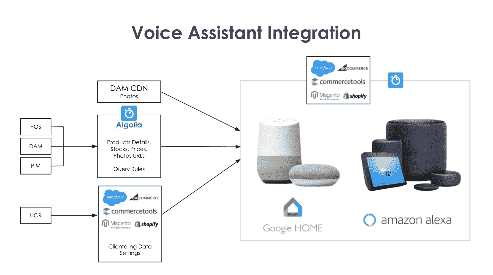
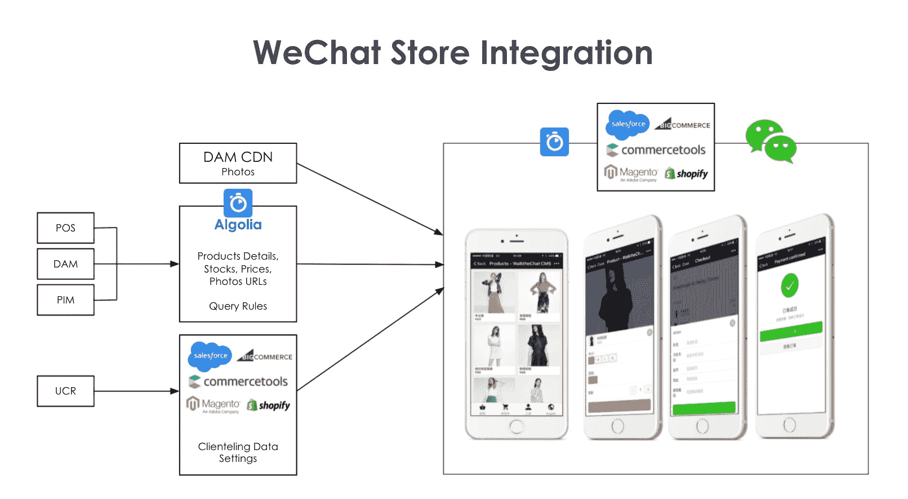

# 可组合商务:如何将你的产品目录整合到微信、谷歌主页和 Alexa 中

> 原文：<https://www.algolia.com/blog/ecommerce/composable-commerce-how-to-integrate-your-product-catalog-into-wechat-google-home-and-alexa/>

继续我们的 [可组合商务](https://www.algolia.com/blog/ecommerce/composable-commerce-how-to-select-best-of-breed-components-to-meet-your-business-needs/) 系列，我们已经讨论了 [电子商务产品-发现](https://www.algolia.com/blog/ecommerce/composable-commerce-how-to-improve-omnichannel-product-discovery-experience/) 、 [库存管理](https://www.algolia.com/blog/ecommerce/composable-commerce-how-to-help-in-store-sales-associates-to-find-products-easily-by-optimizing-inventories-management/) 和 [店内售货亭和商店定位器](https://www.algolia.com/blog/ecommerce/composable-commerce-how-to-build-an-in-store-product-search-kiosk-and-store-locator/) 等主题，我们现在将讨论社交媒体、即时消息和语音技术。

在当今世界，新技术频繁地改变着我们的日常生活和习惯，比如我们购物的方式。对于零售商来说，要想与客户保持联系，就必须对新的技术趋势做出快速反应，并适应客户行为和新购物习惯的变化。

## 语音助手

**App:** Algolia 集成 Google Home / Alexa 语音助手

**中:** 在线/远程

**目标/解决的问题:**

*   将在线购物体验与用户偏好的媒介或工具相结合
*   适应用户的购物习惯

**主要用户:**

在购物者所在的地方与他们见面！零售购物者养成了独特的网上购物习惯和偏好。Google Home 和 Alexa 是许多人在零售购物体验中的首选媒介和工具。成功的零售品牌通过在这些流行的平台上整合其品牌的在线存在，快速适应新的技术进步并支持其客户的旅程。

## 

## 社交媒体

**App:** 微信 App 集成

**中:** 在线

**目标/问题解决:**

*   直接面向消费者的销售和营销

**主要用户:**

*   终端客户通过社交媒体平台购物
*   主要地理区域:亚洲(中国)，该社交平台在这里被广泛采用

利用客户已经熟悉的社交媒体平台。让它们成为你销售和营销工作流程中不可或缺的一部分。对于一家在亚洲拥有大量业务的零售商来说，微信是最直观的选择。该平台已被广泛采用，顾客也乐于使用它进行网上购物。将微信实时集成到库存管理工具中，以轻松匹配零售商和购物者，从而实现高度个性化和精确定位的直接面向消费者(D2C)销售和营销。

## 可组合商业不止于此……

不断发展的技术不仅塑造了客户的习惯和期望，也塑造了整个行业。为了迎接快速到来的未来，公司需要模块化和灵活的基础，以及面向创新和采用新趋势的组织文化转变。

这就是可组合商务的全部:没有放之四海而皆准的解决方案；相反，有许多创造性的想法可以利用新技术，让零售业走出电子商务泡沫。通过集成可组合架构，零售公司能够实现全渠道存在，从而加强与客户群的联系，并获得品牌忠诚度，以不断实现其业务目标。