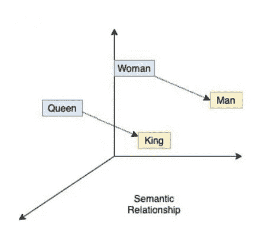

# 了解“你可能也会喜欢……”的秘密

> 原文：<https://www.algolia.com/blog/ai/cosine-similarity-what-is-it-and-how-does-it-enable-effective-and-profitable-recommendations/>

*这条围巾你看了两遍；需要配套的手套吗？一件昂贵的羽绒背心怎么样？*

*你看了四遍 这个高飞挥？试试别的。我知道接下来什么会吸引你。*

你输入的搜索词出现在公司数据仓库的无数地方。根据我的单词袋模型，检查一下我找到的包含常用单词的类似文档。

如果一个推荐引擎算法能够像人一样“思考”,你可能会发现它在进行这种私人观察。当然，这些并不是网站上关于文档相似性和相关内容或产品建议的表述方式。你得到的只是一个“你可能也会喜欢”或者一个没有说明为什么会被选中的物品列表。不管怎样，你已经得到了很好的类似项目或内容的推荐，这些推荐很容易引起你的兴趣，就像算法已经做了笔记一样。

## 大数据正在监听

相似性是对搜索引擎结果进行排名和推荐内容的关键区别。如果我们人类喜欢某样东西，那可能还不够；我们想要更多，更多，更多。

电子商务零售商特别乐意为我们提供更专业的信息检索；可以理解，他们热衷于满足我们寻求相似性的需求。从亚马逊到网飞，再到大型零售商的网站，类似商品的用户推荐在网上随处可见。大多数人都被他们个性化的“你喜欢那个，你可能会喜欢这个”的想法，他们的“购买它”附加建议，他们检查“顾客也考虑”产品的能力所吸引。

由于数据科学家创造了可靠的相似内容功能，这种体验每天都在发生。但是 *如何做到* 公司利用数据科学如此不可思议地弄清楚 *还有什么* 我们可能会喜欢？一个网站在众多选项中识别 *对* 相似的项目会涉及哪些内容？推荐系统如何使用人工智能并挖掘数据集来找出用户接下来想要看的类似电影名称、产品或博客帖子？

秘密归结为两个数列之间久经考验的相似性度量:余弦相似性( [维基百科定义](https://en.wikipedia.org/wiki/Cosine_similarity) )。

## 什么是余弦相似度？

在语言方面，余弦相似度决定了两个或两个以上的词在意义上的接近程度。这是搜索或推荐引擎知道的方式，例如，单词 math 类似于统计学，类似于机器学习模型，类似于余弦，所有这些都是 *而不是* 类似于围巾和手套。

这种距离评估度量，也称为项目到项目的相似性，计算位于多维 [内积空间](https://en.wikipedia.org/wiki/Inner_product_space) 中的 [向量](https://www.algolia.com/blog/ai/what-is-vector-search/) 中的两个项目之间的相似性得分。这是通过 *矢量化* 实现的，它将单词转换为向量(数字)，允许它们的意思以数学方式进行编码和处理。那么可以确定在多维空间中投影的两个向量项之间的角度的余弦。

这里有一个例子:

这张图表显示女人和男人有些相似(就像火星和金星一样)，然而国王和王后没有关系，但是国王和男人有关系。

这种测量方法如何揭示物品之间的相似性？它基于余弦原理工作:当余弦距离增加时，数据点的相似性降低。

为了根据两个项目的属性来衡量它们的相似性，余弦相似性是在这样的矩阵上计算的。输出值范围从0–1。

所有这些值的余弦计算将产生以下可能的输出:

*   -1(一个对立面)
*   0(无关系)
*   1 (100%相关)

但最能说明问题的数值是两个极端值之间的小数，表示不同程度的相似性。例如，如果项目 1 和项目 2 相差 0.8 度，这将使它们与项目 3 更加相似，如果项目 3 与项目 1 和项目 2 的距离都是 0.2。

这里有一个关于如何 [计算余弦相似度](https://www.algolia.com/blog/ai/the-anatomy-of-high-performance-recommender-systems-part-iv/) 的小教程。

结论:如果两个项目向量有许多共同属性，则项目非常相似。

## 为什么余弦相似？

在推荐系统的数据分析中，各种相似性度量，包括 [欧氏距离](https://en.wikipedia.org/wiki/Euclidean_distance) ，[JAC card](https://en.wikipedia.org/wiki/Jaccard_index)相似性，以及 [曼哈顿距离](https://xlinux.nist.gov/dads/HTML/manhattanDistance.html) 用于评估数据点。但是在这些选项中，余弦相似度被认为是最好和最常用的方法。

由于各种原因，余弦相似性是一种可信的测量形式。例如，即使两个相似的数据对象由于它们的大小而在欧几里德距离上相距很远，它们之间仍然可以有相对较小的角度。而且角度越小，相似性越强。

此外，余弦相似度公式是一个赢家，因为它可以处理可变长度的数据，如句子，而不仅仅是单词。

证明了它的流行，余弦相似性被用于许多在线库和工具，如[tensor flow](https://en.wikipedia.org/wiki/TensorFlow)，加上[sk learn](https://scikit-learn.org/stable/modules/generated/sklearn.metrics.pairwise.cosine_similarity.html)和 scikit-learn for Python。

## 余弦相似度和机器学习

[机器学习](https://www.algolia.com/blog/ai/an-introduction-to-machine-learning-for-images-and-text-now-and-in-the-near-future/) 算法通常应用于数据集，以便为网站用户和购物者提供最切合实际的定制推荐。这种做法已经起飞:深度学习为购物者和媒体网站订户生成的推荐已经成为网站 [搜索和发现](https://www.algolia.com/blog/ecommerce/product-discovery-vs-product-search-whats-the-difference/) 体验不可或缺的一部分。

有了相似性评估，获得语义的正确是关键，所以 [自然语言处理](https://www.algolia.com/blog/product/what-is-natural-language-processing-and-how-is-it-leveraged-by-search-tools-software/) (NLP)起着实质性的作用。

考虑图表中的术语类型——国王、王后、统治者、君主、皇室。有了向量，计算机就可以通过在*n*-维空间中把它们聚集在一起来理解它们。它们可以各自用坐标( *x，y，z* )来定位，并且可以使用距离和角度来计算相似度。

然后，机器学习模型可以推测向量空间中彼此靠近的单词(如 king 和 queen)是相关的，而更靠近的单词(如 queen 和 ruler)可能是同义词。

向量也可以加减乘除来建立意义和关系，从而提供更准确的推荐。这种加减法的一个经常被引用的例子是:国王-男人+女人=王后。机器可以使用这种类型的公式来确定性别。

### 应用算法

在[Algolia](https://www.algolia.com/?utm_source=google&utm_medium=paid_search&utm_campaign=rl_amer_search_brand&utm_content=algolia&utm_term=%2Balgolia&utm_region=amer&utm_model=brand&utm_ag=rl&_bt=607885590646&_bm=b&_bn=g&gclid=Cj0KCQiAtvSdBhD0ARIsAPf8oNkvyndigzbF_rJ-DXQFeXoePTIz6fI6uUWKZl5f4RxjC6tqKgUXj7AaAm62EALw_wcB)，我们的推荐部分依赖于有监督的机器学习模型。为相似性矩阵收集数据，其中列是用户令牌，行是对象 id。每个单元格代表 userToken 和 objectID 之间的交互(点击和/或转换)次数。

然后，我们应用一种协作过滤算法，对每一件商品，找出顾客中具有相似购买模式的其他商品。如果相同的用户集合已经与项目交互，则项目是相似的。

一个挑战:相似性矩阵计算量大(密集)，而相似性值小，这给数据带来了噪声，可能会对所提供的推荐质量产生负面影响。

要绕过这个路障，[*k*-最近邻算法](https://en.wikipedia.org/wiki/K-nearest_neighbors_algorithm) (KNN)就派上了用场。余弦相似性确定最近的邻居。您将获得最佳数量的相邻点，对于这些相邻点，具有较高相似性的数据点被视为最近，而具有较低相似性的数据点则不被考虑。您只保留最相似的 k 对物品。结果:高质量的建议。

## 余弦相似度推荐系统

与 [电影推荐系统](https://www.algolia.com/blog/ux/how-movie-and-video-recommendations-work-and-why-streaming-services-must-get-it-right/) ，在其他类型的基于内容的推荐系统中，都是关于算法的。

相似用户看(或读或听)什么？余弦相似性衡量两个查看者之间的相似性，即一个用户简档与所有其他用户简档的相似性。

查看或购买这件物品的人还买什么 *别的* ？在推荐生成过程中，利用项目描述和属性来计算项目相似性。使用余弦相似度，可以评估该人选择或查看的内容与目录中其他项目的相同程度。具有最高相似性值的其他项目被呈现为最有希望的推荐。

余弦相似度也有助于推荐正确的文本文档。例如，它可以帮助回答如下问题:

对于文本相似性，频繁出现的术语是关键。术语是矢量化的，对于推荐来说，具有较高频率的术语被认为是最强的。

## 如果你喜欢这个帖子，你可能会喜欢 Algolia

想为你的搜索引擎用户或客户提供最好的 [算法化计算的](https://www.algolia.com/blog/ai/what-is-ai-powered-site-search/) [个性化的](https://www.algolia.com/blog/ux/what-are-personalized-recommendations-and-how-can-they-boost-engagement-and-conversion/) 类似商品的建议？查看阿哥利亚 [推荐](https://www.algolia.com/products/recommendations/) 。

无论您的使用情况如何，您的开发人员都可以利用我们的 API 来构建最适合您需求的推荐体验。我们的推荐算法应用基于内容的过滤来增强您的 [用户参与度](https://www.algolia.com/blog/ux/how-related-content-recommendations-keep-users-engaged/) 并激励访问者再次光临。这对于转换和你的 [底线](https://www.algolia.com/blog/ux/how-can-related-product-recommendations-boost-engagement-and-roi/) 来说是个好消息。

获得一个 [定制演示](https://www.algolia.com/demorequest/) ， [免费试用我们](https://www.algolia.com/users/sign_up) ，或 [与我们聊天](https://www.algolia.com/contactus/) 关于高质量的相似内容建议，这些建议必将引起您的客户群的共鸣。我们期待着您的回复！