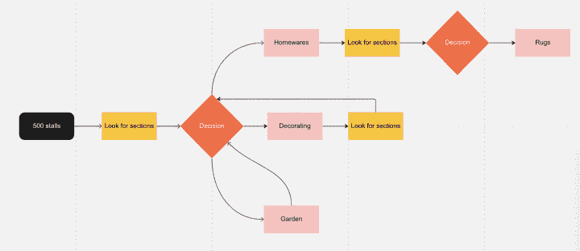
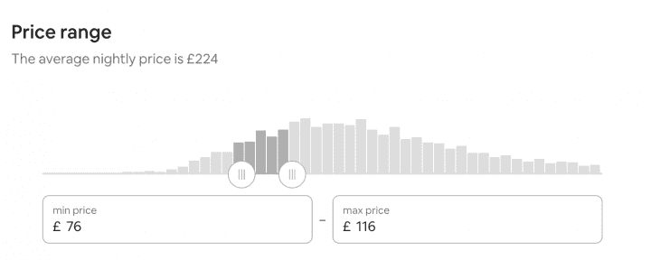

# 如何使用引导式搜索来管理选择超载

> 原文：<https://www.algolia.com/blog/ux/dealing-with-choice-overload-when-designing-navigation-for-ecommerce/>

在这篇文章结束时，你会知道为什么大多数网站发现为他们的用户设计导航和过滤策略非常困难，为什么这是一个非常值得解决的问题，以及开始解决它的一种可能的方法。

事实证明，人类完全被过多的选择淹没了。另一方面，过多地限制选择也是一场灾难，这意味着它增加了你根本找不到你想要的东西的可能性。有可以比较的东西是很重要的，但是我们必须能够在头脑中保持这种比较，我们不能同时做许多选择。

这就是为什么网络导航和过滤被证明是最难做好的事情之一，但同样最有潜力增加收入。您必须为所有可用的选项创建一个可访问的路径，同时让用户能够控制他们通过哪些路径来到达给定的选项子集。你的工作是用尽可能少的活动/点击，让用户走上他们需要的道路，找到他们想要的产品，同时提供足够的选择。

那么，我们能做些什么来保留足够的选择，同时减轻消费者的负担，使其不至于不堪重负呢？一种选择是提供引导购物体验。这在线下世界并不新鲜。在任何实体店，销售助理都是向导。如果在经济上可行的话，为每位顾客配备一名乐于助人的销售人员理论上应该会增加你拥有的快乐顾客的数量。如果你去一个新的城市，出租车司机可以做你的向导。如果你在餐馆，服务员是你的向导。

原理都是一样的。有人知道大多数可能的选择，至少比你知道得多。你给他们信号，他们解读这些信号，慢慢地把选择减少到你可以管理的子集，然后你就可以舒服地选择了。导游到底在做什么？他们 **主动** 帮你找到你要找的东西。主动这个词很重要。它将指南与地图之类的东西区分开来。地图是被动的。它为您提供了所有可能的选项，由您自己决定如何浏览它们。这里有一个更完整的例子:想象你独自一人进入一个巨大的跳蚤市场。你正在为你的客厅寻找一块地毯，这个市场有 500 多个摊位。你是做什么的？

第一步如下图所示，这是“类型”问题决策树，沿着每种类型的路径深入下去，可以帮助您找到您需要的单一类型。

你到达了地毯。现在重点完全变了。你不再根据产品类型进行提炼。你现在正在提炼单一产品类型的属性，也就是“种类”。这是一个重要的阶段。试探法已经从寻找符合“地毯”定义的东西转移到寻找“合适的”地毯。还是那种地毯。换句话说，类型更类似于类别，因为类别应该是互斥的，它们不应该重叠太多。否则，会给用户造成困难。Kind 更类似于一组过滤器，它们可以相互结合使用。

下一步开始，那种问题。你从对“合适”的定义倒退到地毯所具有的属性或特征。一旦地图制作完成，你就可以在一张地毯上匹配尽可能多的属性。如果价格合适，那么这可能就是你的地毯。

Image via rugs.com

那么这里到底发生了什么？你的搜索经历了三个不同的阶段:

1.  通过仅限于一种类型，即地毯，减少要搜索的产品范围
2.  将您的喜好转化为该类型的属性，即哪种地毯
3.  通过比较，尝试找到符合尽可能多属性的地毯

如果是引导式体验，为什么会变得更容易，从这个意义上说这意味着什么？

我们刚刚展示的方法完全是被动的。有问题的网站没有主动帮助客户，让他们做所有的工作。您使用站点的静态功能，通过为您提供过滤产品总数的方法，慢慢减少显示的产品数量。

如何让它变得活跃，或者换句话说，被引导？考虑这一点最简单的方法是，在终端用户需要做出选择的领域，尝试并找到减少认知负荷或总体工作量的方法。

当谈到计算选择时，你认为这一过程中最困难的部分是什么？通常，它是将客户偏好映射到属性，并试图找到最符合属性组合的产品子集的过程。

因此，我们可以推断，到达“类型”的整体导航不是我们需要优化的第一件事。造成最大困难的是“种类”问题。这就是引导式体验的闪光之处。这也是他们真正努力的地方，因为如果你错了，那就没用了。

有几个步骤可以让你设计出最佳的导游体验:

1.  追踪。人们提炼最多的是每类产品的哪些属性？例如，如果你在销售地毯，你应该跟踪地毯类别中的用户对尺寸、图案和材料的偏好。在产品被点击之前，你应该跟踪他们提炼了什么组合。您应该跟踪细化通常是按照什么顺序选择的。
2.  面试。假设大小是第一个常见的细化属性。询问人们是什么决定了他们选择的尺码。追踪最受欢迎的决定因素。这有助于您构建地图。
3.  设计。给用户一个模型，从通常选择的属性中列出最常用的决定因素。例如:
    1.  样式
    2.  维护
    3.  预算 
        要求用户选择对他们重要的决定因素，以及他们是否希望添加其他因素。抓住与每个选择的决定因素相关的属性，让他们从每个决定因素中选择相关选项。
         
    4.  让用户在选择时知道有多少产品符合他们的选择，以及其他可能的属性组合。提供不同的途径，也就是说，如果你将预算增加 X 倍，你将有更多的选择。Airbnb 价格滑块就是一个很好的例子。
        

    5.  使用丰富的图像和文字描述，让整个过程尽可能具有视觉刺激。确保用户感觉是在制作完美的地毯，而不是从一大堆地毯中挖掘出来。
    6.  反馈。如果你发现绝大多数人在他们的地图上优先考虑一件事，考虑把它作为导航的主要步骤。例如，如果你销售打底裤，并且你发现大多数人首先通过运动来提炼，那么考虑将运动作为打底裤的一个子类，就像在汗湿的贝蒂上看到的那样(下图)。在下面的第二张图片中，你也可以看到类似的概念在 Rugs.com 的运用，他们将不同种类的地毯组合成一个最受欢迎的菜单，例如现代、可洗、波斯等。

这些要点为什么有帮助？我们说过引导体验是艰难的。是真的。你已经接过了寻找的重担，你现在是顾问。因此，如果你没有给用户足够的灵活性来给你足够的/正确的信息，或者如果你把那些可能的选项弄错了，用户可能也不会在意。这些点确保体验足够灵活，可以从用户那里接收足够的数据，但也足够严格，可以通过帮助用户的地图和组合问题来主动减少用户的负担。

总而言之，我们一起看:

*   有两种不同的搜索模式:按类型和按种类，其中类型涉及高级导航，种类涉及任何特定类型的特定属性
*   所有搜索都是召回率(广度)和精确度的平衡，也就是说，随着来自用户的意图的每个连续信号，精确度增加，而广度应该减少
*   认知负荷在分类搜索阶段最多，因此在该阶段获得指导的机会最多
*   实施良好的引导式体验如何涉及跟踪、访谈、设计、激励和反馈循环

如果你已经建立了自己的引导体验，请告诉我它是如何进行的。我错过了什么？作为消费者，我们对此谈论得越多，我们就能为彼此做得越好。

这篇博客文章的灵感来自 Baymard research 的一篇[文章。](https://baymard.com/blog/kohls-category-navigation-ux)

* * *

1.脚注: