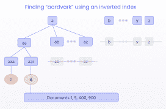

# 定义在线搜索索引的速度、相关性和功能。

> 原文：<https://www.algolia.com/blog/product/defining-what-a-search-index-is-and-the-speed-and-relevance-of-a-search-engine-index/>

一般来说，搜索索引就像是 **一本书末尾的索引** ，其中有一个小的、非详尽的单词和主题列表，并附有页码。更准确地说，它是查询 到语料库(一大组在线书籍和文档、产品或电影目录)中内容的 **映射。用计算机术语来说，它是一个单词的倒排列表(索引)，搜索引擎使用它来查找语料库中每个文档中的每个单词。**

但是书索引的比喻实际上是正确的吗？正如所有与技术相关的事情一样，在提供一个主题的概述和深入研究之间很难找到一个好的平衡——同时又不失去意义或你的观众。

过去，我们已经回答了*什么是搜索索引的问题。*以不同的方式:

*   在最高层次上，我们描述了 [一个指数能做什么](https://www.algolia.com/blog/product/what-is-a-search-index-and-how-does-it-work/) ，特别关注它如何改变了我们的网上购物方式
*   在功能层面，我们举例说明了如何利用 [快速索引过程](https://www.algolia.com/blog/product/an-exploration-of-search-and-indexing-real-time-indexing-scenarios/) 来驱动许多不同且令人惊讶的场景
*   在技术层面，我们将 [放在我们的搜索引擎索引](https://www.algolia.com/blog/engineering/inside-the-algolia-engine-part-2-the-indexing-challenge-of-instant-search/) 中，来描述索引的实际物理结构，以及这种结构如何使我们的搜索引擎能够存储数百万条记录，并且仍然能够在数毫秒内执行搜索

这篇文章涵盖了功能和技术之间的中间地带，定义了我们经常在谷歌、亚马逊和网飞看到的强大搜索索引的功能，并介绍了这些索引如何以如此快的速度执行。

## 书的比喻:一个搜索索引就像一本书后面的索引

一本传记的书籍索引看起来像这样:

*   *婚姻* :第 30、50-67、246 页
*   :第 2-15 页，第 77-89 页
*   *父亲* :第 10、83-85、150-178 页

搜索索引可以用非常相似的方式表示:

*   *婚姻* - >文件 1、5、400、900
*   *早年生活* - >文件 33、45、98、235
*   *父亲* - >文件 101、345、785

这本书的比喻很有用，因为它强调了一个总的想法，即 **索引是一个** ***从底层内容***中分离出来的 **对象，也就是**用来(方便快捷)** ***找到*** **内容的特定部分** (一本书中的页数，文档集合中的文档)**

用另一个比喻来说，索引像指南针一样帮助我们将一本书导航到一张地图，而指南针取代了浏览地图的需要。同样的，一本书末尾的索引远比为了一个短语而扫描整本书的效率要高得多:它显然节省了你的时间，也更可靠。在上面的例子中，索引引导你可靠地找到传记中讨论主体“早期生活”的确切章节。

### **但是*****图书索引和搜索索引一样吗？***

 *比喻只能到此为止。书中的比喻没有完全抓住 **搜索引擎索引** 的能力、目的和机制，也没有完全抓住我们的期望。

例如:

*   一个搜索索引通常会索引一本书或一组内容的 *每个单词和部分* 。如果一本书的索引包含了书中所有的单词和主题，那么它就太长了。然而，搜索技术强大到足以创建和搜索单词和主题的 *穷尽式* 索引。
*   我们期望搜索引擎会向我们展示 *每一条* 内容，这些内容都提到了我们在输入搜索查询时键入的单词。
*   搜索索引通常会搜索多本书。这是它最强大的方面之一，可以在瞬间组合和搜索大量内容。内容的例子:公司网站上的产品(网站搜索)，图书馆的完整在线目录(每本书里的每一个词)，或者网络上所有可抓取的东西(谷歌)。
*   计算机是宽容的:它允许打字错误和拼写错误，忽略多余的词，如“the”和“is”，并理解多种语言和复杂的语法。
*   搜索索引是动态的，随着底层内容的每次变化而更新数据。它尽可能快地做到这一点。一些变化预计是实时的( [Twitter 的实时索引](https://blog.twitter.com/engineering/en_us/topics/infrastructure/2020/reducing-search-indexing-latency-to-one-second) 、优步、机票预订)，其他的是定期的，例如每 5 分钟，或者在一天或一周的过程中几次。
*   索引提供 [相关性](https://www.algolia.com/doc/guides/managing-results/relevance-overview/in-depth/defining-relevance/)——搜索技术中的一个中心话题。对于我们这里的目的，相关性帮助你*发现*内容、联系和其他你可能没有想到的术语，并把它们按照对你当前的研究有意义的顺序排列。

让我们这么说吧，书籍索引的比喻让你有机会理解索引的作用，但是像上面这样的细节(还有更多)可以帮助你理解搜索引擎索引可以实现的全部潜力，以及它如何改变了我们的生活。

## 那么，什么是搜索索引呢？

搜索索引可以在两种不同的上下文中使用:

*   搜索 **内容** ，比如书籍、博客、报纸文章、系统日志以及其他任何包含大量文本的“文档”中的文本。这里的期望是每个单词都有价值，因为搜索者正在寻找内容中使用的确切单词和短语。
*   搜索 **对象** ，比如亚马逊上的产品、网飞上的电影、医院里的服务——任何依靠属性来定义它的对象。这里的期望是对象的标题和描述足够准确，以便使用一组合理的关键字的搜索者能够找到该对象。

现在，你还可以通过给书籍贴上主题、主题、作者等标签来搜索书籍。，但如果搜索的根本目标是找到 *内容* ，期望是书中的每个单词和句子都是可搜索的。

### **基于对象的搜索和属性**

一个成功的基于对象的搜索(正如我们在这里所定义的)依赖于一组 *属性* ，这些属性充分地描述了对象，因此搜索者可以使用一组合理的精选关键词找到他们想要的东西。关键字可以是一个或多个单词，甚至可以是第一个单词的前几个字符。例如，在寻找电影《星球大战》时，用户可能只需要键入“Star”；但如果搜索引擎将搜索算法建立在人气上(即在第一个结果中偏向热门影片)，那么“st”应该足以找到大片 **St** ar Wars。

### **数量属性**

如果你想找到一部电影，你很可能只需要几个属性，比如标题、描述、演员、工作人员、年份和其他一些属性。如果你想执行一个更一般的 *re* 搜索 ，你可以添加像主题、对话、交叉引用和附加背景信息这样的属性。然而，属性列表可能会变得很大。例如，汽车有 1000 多种属性——使用的材料、每个零件的名称、类型和年份、所有者历史、工厂和维修历史、速度等等。

所有对象的共同点是 *关键词* 的概念。关键字是内容所有者在构建对象属性时使用的词语，如标题、品牌、作者、年份和价格。或者从另一个角度来看:关键词是搜索引擎用来将索引中的词与搜索者的查询相匹配的“词”。

## 创建索引

如上所述，搜索引擎识别与用户查询(关键词)相匹配的文档(书籍、网页、产品)。为此，它不能扫描每个文档。所以它使用一个索引，要么是每个单词的详尽索引，要么是包含最重要描述子集的基于属性的索引。

在用户搜索 之前，创建一个 *索引。它是对底层内容的预扫描。它也在服务器的一个单独的部分。例如，在基于内容的场景中，搜索引擎预扫描每个文档，并将所有的 *唯一的* 单词保存在索引中。正如我们在上一节(有趣的)中所描述的，许多搜索引擎以“倒排索引”的方式构建它们的索引。*

### **不同种类的指标——具有准确性和相关性的排序结果**

搜索索引是有顺序的。对于像谷歌和亚马逊这样的在线搜索，搜索结果通常是按照“最佳”而不是“准确”的匹配排序的。

在那些上下文中，不仅仅是关于 *准确的* 结果。如果用户输入“布拉德”,出现了布拉德·皮特，这并不意味着它是准确的。其他的结果将包括布拉德·戴维斯或布莱德 y 剧院。它们都以不同的方式相关，但没有一个可以被认为是“准确的”。一个输入“布拉德”的用户可能会选择去布拉德·皮特的维基百科页面，另一个可能会去布拉德·皮特的 IMDB 页面。准确性并没有真正抓住这些选择的意义。

它是关于给定用户如何感觉到 [正确的结果，或者结果](https://www.algolia.com/blog/ecommerce/search-vs-browse-satisfying-user-intent/) [如何匹配搜索者的意图](https://www.algolia.com/blog/ai/how-to-identify-user-search-intent-using-ai-and-machine-learning/) 。回到指南针的比喻:指南针通过结合准确性和相关性来帮助我们导航:指南针给我们北方和南方的准确性；但它也给了我们相关性，为我们指明了目的地的大致方向，帮助我们将我们的意图与我们对物理世界的了解相匹配，以达到我们的目的地。 另一方面，我们期望 GPS 系统精确不相关。

想象一下，一名银行职员查看了你的记录，发现你欠银行一些钱。银行员工的搜索结果最好完全准确。同样，当商店员工或顾客寻找精确的产品时，他们对相关性不感兴趣:他们依赖准确、确切的产品标识符。

这并不是说通过相关性搜索不包含“准确性”的一个方面。比如有人输入“圆珠笔”，准确率就是找到所有有“圆珠笔”字样属性的产品。然而，准确性让位于相关性:相关性是首先显示哪支圆珠笔。

解释这种差异的一个更技术性的方法是考虑数据库和搜索索引之间的差异。类似数据库的索引(以银行为例)以准确性为中心——确保精确匹配被正确排序并详尽无遗。像 Google 这样基于搜索索引的搜索更加灵活，文本匹配是文本准确性和相关性的混合(优化你的内容，我们称之为 SEO(搜索引擎优化))。

类似于谷歌，我们在亚马逊和网飞看到的网站搜索，以及在由 [Algolia](https://www.algolia.com/) 提供搜索的网站上，依赖于**结构化属性集**和**排名系统**的组合，该系统基于流行度、趋势、喜欢和企业的产品推广需求。

## 搜索引擎服务器上的搜索索引

好的，让我们打开引擎盖。一个 [搜索引擎索引](https://en.wikipedia.org/wiki/Search_engine_indexing) 被保存在一个能够快速检索的结构中。我们称这种结构为 [倒索引](https://en.wikipedia.org/wiki/Inverted_index) 。需要注意的一点是，索引是单独保存在服务器上的，与数据保存在不同的位置。

虽然有许多类型的倒排索引，有许多细微差别，但下图总结了这一思想:

如你所见，用 一个倒排索引，搜索引擎倒排逻辑。因此，它不是阅读(扫描)文档来查找单词，而是颠倒这个过程，使用 *单词* 来查找文档。这里有一个倒排指数的例子:

*   *土豚* - >文档 1、5、400、900
*   *阿米巴* - >文档 101、345、785
*   *动物* - >文件 33、45、98、235

……等等。假设 999 个文档中有 10，000 个唯一单词。

上图中，搜索引擎搜索倒排索引的逻辑遵循这个过程找到“土豚”:

*   索引有一行 26 个字母和 10 个数字。这一行下面是所有单词的倒置树。第一行、第一列包含以“a”开头的每个单词，下一列以“b”开头，依此类推。
*   当你输入“a”时，你会得到每个以“a”开头的单词，然后删除每隔一列。
*   这大概去掉了 90%的单词，所以引擎浮出水面的地方少了很多。
*   你输入“aa ”,这将删除几乎所有剩余的单词。你可能只剩下不到 1%的原始列表。
*   您键入“aaa ”,这将删除列表中所有剩余的单词:没有包含以“aaa”开头的单词的文档。
*   因此，您从查询中删除“a ”,并添加“r”以获得“aar ”,只有一个词出现“aardvark ”,这将引导您找到 4 个包含 aardvarks 信息的文档。

一组文档中的每个单词就是这样存储在索引中的。对于没有前缀的中间词查询来说，情况变得更复杂，但是您已经明白了。

仅此而已……嗯，还有一个 **lot** 更详细。如果你对更多感兴趣，可以看看 Algolia CTO 关于 [**的文章。**](https://www.algolia.com/blog/engineering/inside-the-algolia-engine-part-2-the-indexing-challenge-of-instant-search/)*