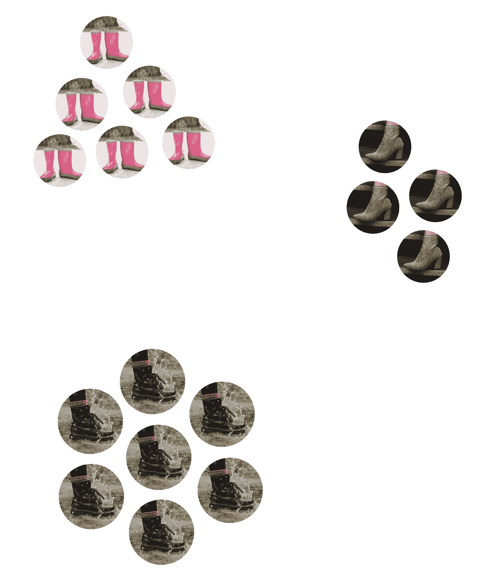
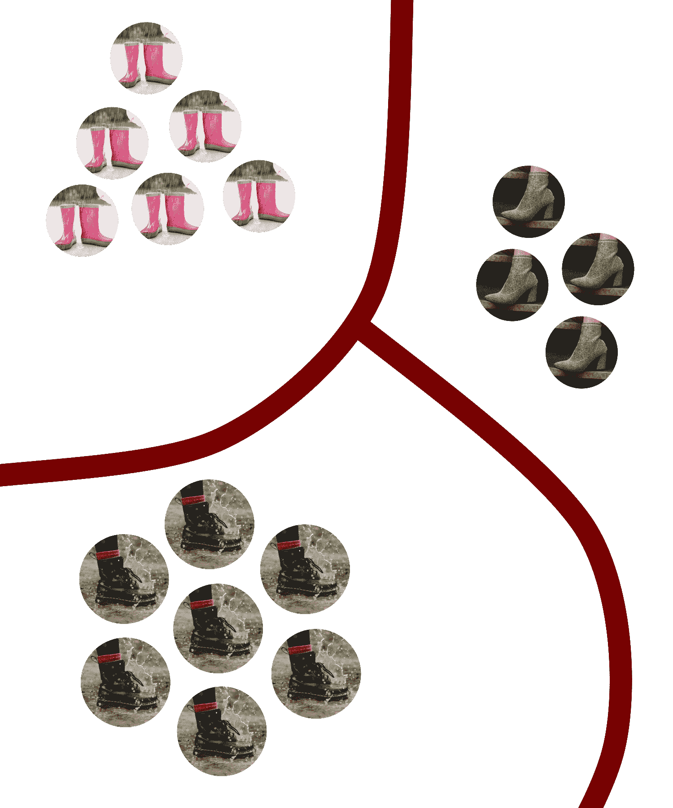
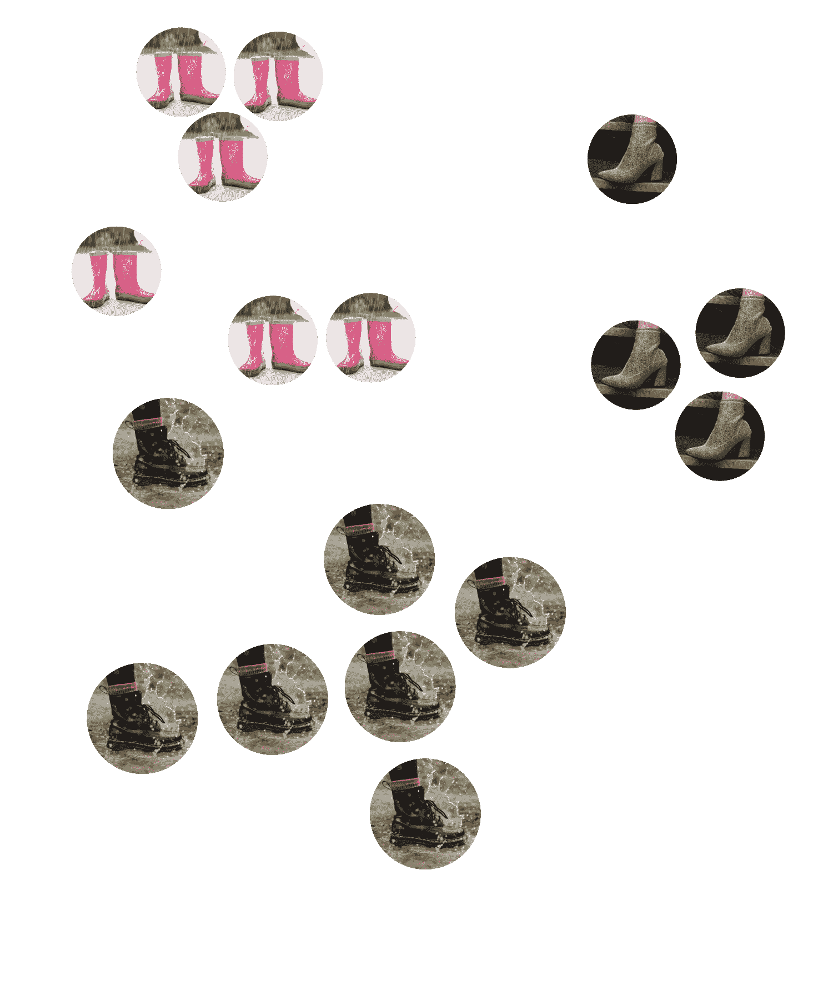

# 设计搜索体验——第 1 部分:Orange 和他们的手机

> 原文：<https://www.algolia.com/blog/engineering/designing-a-search-experience-part-1-orange-a-tech-company-famous-for-their-jphones/>

突击测验！什么是“产品”？

这个问题难倒你了吗？还是看起来…太简单了？不管怎样，这是我们应该进一步探索的事情，因为没有一个明确的定义。你可能会立即想到这样的事情:

> **产品** *(名词)*:生产出来的东西；作为商品销售的东西——来自[韦氏词典](https://www.merriam-webster.com/dictionary/product)

这是一个很好的开始！但是作为开发人员和商务人员，我们开始遇到这个定义没有涵盖的奇怪的边缘情况。

例如，我的一个同事最近买了一双靴子——事实上是这双靴子。如果你点击那个链接，它会把你带到沃尔玛网站上这些靴子的产品页面。现在，如果我们假设这个页面代表一个产品，让我问你几个后续问题:

1.  每款靴子都是自己的产品吗？
2.  如果这些同样的靴子没有鞋带出售，它们会是不同的产品吗？
3.  每一个鞋码都是新产品吗？

根据我们乏味的字典定义，这三个问题的答案都是肯定的，因为它们都是被生产出来的不同物体。然而，它们都有一些细微差别:

1.  你可以争辩说，靴子不是单独销售的，因此它们不是单独的产品，而是一个整体。
2.  如果该公司出售这种靴子的系带和无系带版本，那么你可以说该公司实际上认为这些版本是独立的产品。
3.  每种鞋号都会改变靴子的生产过程，所以看起来应该有不同的产品——然而，沃尔玛似乎将鞋号列为单一产品的一个属性。

显然，我们需要一个更好的定义。这是我想提出的一个观点:

> **产品**

这个定义似乎更合适，因为当你真正钻研细节时，*产品被定义为不同于其他产品*。我们把所有的鞋码放在一个产品中，因为它们彼此之间的相似程度远远超过了它们与沃尔玛产品数据库中其他产品的相似程度。他们只是*觉得*喜欢单一产品的版本，而不是不同的产品，因为实际上是其他产品的东西是非常不同的。

这里有一个直观的例子。当你看到这些产品时，它们之间的距离大致代表了它们的差异，你在哪里画出产品的界限？



Photos by JACK REDGATE, Jill Wellington, and EVG Kowalievska

很明显，你会把它们画在这里:



Photos by JACK REDGATE, Jill Wellington, and EVG Kowalievska

这与搜索有很大的关联，我们在 Algolia 是这方面的专家。当开发这些产品的搜索体验时，每家公司都必须问一些关于这些边界会是什么样子的问题——例如，我们的客户会搜索什么属性？我们输入到 Algolia 的可搜索产品需要是独立的，所以如果人们要在搜索查询中包括他们的鞋号，那么至少在这种情况下，我们需要将所有这些鞋号作为单独的产品对待。

在搜索领域，根据业务需求，单个产品版本之间的一些差异变得更加相关。那些簇不再像我以前画的那样整洁了。我们的视觉空间可以看起来更像这样:



Photos by JACK REDGATE, Jill Wellington, and EVG Kowalievska

现在你在哪里划线？

## [](#designing-for-jphones)为手机设计

让我们想象一个*完全假设的公司*(姑且称之为 Orange)生产智能手机(姑且称之为 jPhones)。jPhones 有许多不同的版本:

*   Orange 生产 jPhones 已经有一段时间了，所以我们现在是第 13 版。他们仍然出售最近的几个版本。
*   你可以买到不同的颜色，不同的价格。有些手机比其他手机更有价值，因为它们的颜色更稀有。
*   jPhones 也有普通尺寸和加大尺寸，除此之外没有其他区别。
*   你还可以在 128、256 和 512 GB 之间选择手机的存储空间。

Orange 在使他们的产品数据库健壮方面投入了很多努力，但是在搜索方面，他们没有给我们太多的工作，正如我们前面讨论的那样，搜索有一套不同的要求。现在，他们让你和我为 jPhones 建立一个搜索索引，将这些选项考虑在内。他们给了我们这个初始 JSON 来修改:

```
[
	{
		"title": "jPhone",
		"editions": [
			"13",
			"12",
			"11"
		],
		"color": [
			"Aluminum",
			"Sparkly Green",
			"Maroon",
			"Moonlight",
			"Blackout",
			"Deep Sea Blue"
		],
		"sizes": [
			"Regular",
			"XL"
		],
		"storageSpace": [
			"128GB",
			"256GB",
			"512GB"
		]
	}
] 
```

让我们从一个接一个地检查每个选项开始，看看它们如何影响什么最终成为产品属性，什么最终值得成为它自己的产品。

### [](#editions)版本

当人们搜索 jPhones 时，他们可能会在搜索中包括该版本。例如，他们知道只要搜索`jphone`就会得到非常广泛的结果，所以他们会搜索`jphone 13`。

这对我们的搜索索引有什么影响？嗯，用户不太可能会搜索比他们期望的产品清单更具体的东西。换句话说，通过搜索`jphone 13`，他们期望得到一个 jPhone 13 的结果，而不是一个允许他们以后选择 13 的普通 jPhone 结果。因此，在我们的搜索索引中，我们需要将版本分成不同的可搜索产品。现在我们搜索索引的 JSON 看起来像这样:

```
[
	{
		"title": "jPhone 13",
		"color": [
			"Aluminum",
			"Sparkly Green",
			"Maroon",
			"Moonlight",
			"Blackout",
			"Deep Sea Blue"
		],
		"sizes": [
			"Regular",
			"XL"
		],
		"storageSpace": [
			"128GB",
			"256GB",
			"512GB"
		]
	},
	{
		"title": "jPhone 13",
		"color": [
			"Aluminum",
			"Sparkly Green",
			"Maroon",
			"Moonlight",
			"Blackout",
			"Deep Sea Blue"
		],
		"sizes": [
			"Regular",
			"XL"
		],
		"storageSpace": [
			"128GB",
			"256GB",
			"512GB"
		]
	},
	{
		"title": "jPhone 12",
		"color": [
			"Aluminum",
			"Sparkly Green",
			"Maroon",
			"Moonlight",
			"Blackout",
			"Deep Sea Blue"
		],
		"sizes": [
			"Regular",
			"XL"
		],
		"storageSpace": [
			"128GB",
			"256GB",
			"512GB"
		]
	},
	{
		"title": "jPhone 11",
		"color": [
			"Aluminum",
			"Sparkly Green",
			"Maroon",
			"Moonlight",
			"Blackout",
			"Deep Sea Blue"
		],
		"sizes": [
			"Regular",
			"XL"
		],
		"storageSpace": [
			"128GB",
			"256GB",
			"512GB"
		]
	}
] 
```

### [](#colors)颜色

到颜色上！这是一个棘手的问题。穿靴子的同事和我谈了一会儿，他对此持观望态度。你觉得应该是什么？每种颜色应该是一个单独的产品，还是应该是一个产品的选项？也许在继续之前，停下来思考一下这两种选择的后果是一个很好的练习。

有你的选择吗？让这变得棘手的是，你可以为任何一方提出论据。一方面，颜色并不是非常重要，它们不会对生产或订单执行过程产生太大的影响。可以说它们只是稍微改变价格的表面变化。另一方面，由于稀有性，客户群对一些颜色的整体评价高于其他颜色，偏好可能会导致一些潜在客户专门搜索`sparkly green jphone 13`，而不是更通用的选项。

后一种说法似乎更有说服力，不是吗？通常，搜索结果中的最佳实践是尽可能具体到您期望的合理的具体消费者，在这种情况下，Orange 可能会期望大量消费者专门搜索他们最喜欢的颜色，或者社区认为更有价值的颜色。也许你会想起一个现实生活中的公司，听起来有点像 Orange(尽管我们的意图是创建一个完全虚构的例子)，它没有实现这个特别的建议。作为该领域领先的搜索专家，我们 Algolia 谦卑地提出，该特定公司应该 [A/B 测试](https://www.algolia.com/products/search-and-discovery/ab-testing/)他们的搜索索引版本，将不同的颜色分成不同的产品，看看会发生什么！如果你在看和读，我们愿意打赌——你知道你是谁。

在拆分颜色之后，这是我们新的 JSON(缩写，因为对于文章形式来说太长了):

```
[
	{
		"title": "jPhone 13",
		"color": "Aluminum",
		"sizes": [
			"Regular",
			"XL"
		],
		"storageSpace": [
			"128GB",
			"256GB",
			"512GB"
		]
	},
	...
	{
		"title": "jPhone 13",
		"color": "Deep Sea Blue",
		"sizes": [
			"Regular",
			"XL"
		],
		"storageSpace": [
			"128GB",
			"256GB",
			"512GB"
		]
	},
	...
	{
		"title": "jPhone 13",
		"color": "Maroon",
		"sizes": [
			"Regular",
			"XL"
		],
		"storageSpace": [
			"128GB",
			"256GB",
			"512GB"
		]
	},
	...
	{
		"title": "jPhone 12",
		"color": "Moonlight",
		"sizes": [
			"Regular",
			"XL"
		],
		"storageSpace": [
			"128GB",
			"256GB",
			"512GB"
		]
	}
] 
```

### [](#size)尺寸

在我们的虚构世界中，除了物理尺寸，普通手机和 XL 手机之间没有其他区别，我们可以想象，由于生产过程几乎相同，除了更大的外壳，价格也是如此。在这种情况下，你觉得在搜索的时候，手机的大小是否足以成为一个重要因素，以保证为不同大小的手机创建单独的搜索记录？

有趣的是，我们可以像讨论颜色一样讨论尺寸。一方面，尺寸并不十分重要，它们不会对生产或订单执行流程产生太大影响。可以说它们只是表面上的改变，只不过这次它们没有修改价格。另一方面，如果 XL 选项对他们特别重要，客户群可能会专门搜索它(对一些人来说是这样，比如关节炎患者或视力不好的人)。

现在哪种观点看起来更有说服力？是不是感觉更像是五五开？这里有一个有趣的例子:你能向一个明确搜索其中一个选项的客户推销吗？当我们谈论版本(如果有人搜索一部旧的 jPhone，他们可能会选择那部旧的，也许是出于经济原因)或颜色(他们想要那个`sparkly green jphone 13`)时，这是不太可能的。但是从尺寸来看，我们可以把 XL 卖给那些没有明确搜索 XL 的人，或者把普通尺寸的 jPhone 卖给那些搜索 XL 的人，这似乎也不是不合理的。如果我们给客户选择页面尺寸的选项，而不是为每个尺寸创建独立的可搜索页面，也许我们会有一个性能更好的产品页面。出于这个原因，我倾向于保持 JSON 的原样，将大小作为可搜索产品的一个属性。

### [](#storage-space)存储空间

也许你已经注意到了，但是我们正在按照相关性递减的顺序回顾这些手机上的细节。这并不是说没有人关心存储空间，但是你真的对你的新手机的存储容量死心塌地吗？Orange 认为存储空间应该只是结账流程中的一个选项，而不是为每个存储空间选项都提供专用的可搜索页面，这不是没有道理的。

回想一下我们上一次关于不同手机尺寸的争论:我们能把一部 512 GB 的手机卖给一个明确搜索 256 GB 的人吗？绝对的！这种情况经常发生，尤其是如果价格差异很小的话。即使这不是一个小的价格差异，如果我们把这些选项放在一起，即使有人专门搜索特定的价值，我们也可能会增加销售。事实证明，在这种情况下，在搜索排名中保留一个不太严格相关，但更具商业意义的结果是有好处的。

## [](#so-what-makes-a-product)那么是什么造就了一个产品呢？

最后，就搜索而言，你的产品应该在不影响商业目标的前提下尽可能的具体和细分。我们的逻辑推理对上面假设的智能手机的四个属性给出了肯定是、可能是、可能不是和肯定不是的答案，但这些答案绝对不是通用的——像 Orange 这样的技术公司将会有非常不同的商业目标要记住，比如说，与制造汽车工具的公司相比，后者的搜索查询通常更加具体。

如果您想看到我们与汽车工具公司(姑且称之为 Clip-On)一起走过同样的过程，并证明这个框架成立，[请查看本系列的第二部分](https://www.algolia.com/blog/engineering/designing-a-search-experience-part-2-clip-on-an-automotive-tools-company-with-an-extensive-catalog/)！

在那之前，

安托万和阿尔戈利亚船员