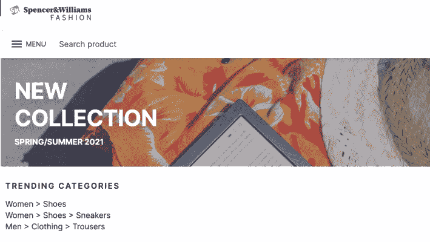

# 特色聚焦:推荐中的趋势模型

> 原文：<https://www.algolia.com/blog/engineering/feature-spotlight-trends-models-in-recommend/>

推荐依赖于数据——你知道的越多，你的推荐就越好。 [Algolia 的推荐](https://www.algolia.com/products/recommendations/)产品使用机器学习来建议您的客户感兴趣的产品或内容，从而让您的数据发挥作用。今天，我们把焦点放在推荐的新趋势模型上。您将了解它们如何工作，以及它们如何扩展您使用推荐的方式。

在推出时，推荐提供了两个初始的机器学习模型:*相关产品*和*经常一起购买*。两者都是协同过滤模型，也就是说，当用户与你的网站互动时，你可以用他们点击和购买的产品来训练他们(事件数据)。这些模型非常适合以产品为中心的推荐。给定目录中的特定产品，您可以使用模型来推荐您的客户发现类似或购买的其他产品。您可以将这些建议放在产品详情页面和结账流程上，以帮助您的客户发现他们可能感兴趣的其他产品。除了我们将在本文中讨论的内容之外，这些初始模型刚刚更新，您现在可以在没有事件数据的情况下*立即开始使用它们—[在此了解更多信息](https://www.algolia.com/blog/product/ai-powered-recommendations-product-launch/)。*

*趋势*模型同样由协同过滤驱动，但不同之处在于它们不局限于基于单一产品的推荐。相反，他们会在整个目录中寻找产品趋势，或者在目录的某个特定方面/类别中寻找产品趋势。

## [](#diving-into-trends)跳水成趋势

要使用推荐的型号，您需要将您的产品存储在 Algolia 索引中。然后，您可以跟踪索引中项或方面值的趋势。请记住，方面是一种属性，就像“颜色”一样，是您在索引中为过滤而配置的。索引中该属性的可能值称为方面值，如“红色”或“紫色”。

根据趋势的类型，您将[培训两个新模型中的一个](https://www.algolia.com/doc/guides/algolia-recommend/overview/#trending-items-and-trending-facet-values):

*   趋势项目–特定方面值或整个目录中最受欢迎的项目。
*   趋势面值–特定面的最流行值(例如，“毛衣”作为“类别”的值)。

这两个模型都是通过协同过滤来训练的，这意味着它们从事件数据中学习趋势——特别是从您的用户那里捕获的转换事件。转换事件可以是购买一件商品，将其添加到购物车，或者将其标记为收藏。

**趋势项目**模型查看过去几天每个项目的转换事件总数，以及转换事件数量随时间的*变化*，以了解索引中每个记录的“趋势”。然后，它为目录中的每个项目分配一个分数，可以是全局的，也可以是特定方面值内的。

对于**趋势分面值**，该模型对分面属性做同样的事情——对每个分面值的总转换数和几天内的转换变化进行评分。每个模型最多可以收集三个方面的趋势信息。

为了使用趋势，您将需要在至少三天内使用至少 500 个转换事件来训练模型。显然，您发送的信息越多，模型提供的推荐就越好。

## [](#where-to-use-trends)哪里用趋势

趋势商品是对其他以产品为中心的模型的补充，它允许你在你的顾客选择一个产品之前，在你的主页上推荐一个特定类别中的流行商品或畅销商品。

趋势面非常适合在你的主页上添加当前相关的流行类别或产品属性——无论是春季的园艺用品还是秋季的大衣和帽子。

这两个模型一旦被训练，就可以提供多达 30 个建议，或者是全局的，或者是特定方面的。

## [](#training-your-trends-model)训练你的趋势模型

在使用任何推荐的型号之前，你需要[注册一个 Algolia 账户](https://www.algolia.com/users/sign_up?utm_source=blog&utm_medium=main-blog&utm_campaign=devrel&utm_id=spotlight-trends)并将你的产品目录载入索引。你可以使用一个现有的搜索索引或者建立一个推荐的搜索索引。

一旦你的索引被产品记录填充，你需要[开始发送用户事件信息给 Algolia](https://www.algolia.com/doc/guides/sending-events/implementing/) 。您可以使用内置于 Algolia 即时搜索前端库、Algolia Insights API 的事件集成，或者与主要电子商务平台和分析后端的支持集成来收集这些数据。您甚至可以将您的活动上传为具有适当记录格式的 CSV 文件。

请记住，因为趋势模型关注的是随时间的变化，所以您需要发送跨越多天的转换事件。

最低活动要求是:

*   过去 30 天内 500 次转换
*   至少 3 天内的事件(因此不是一天 500 次转换)
*   索引中至少 10 个项目的事件

您可以在[仪表板](https://www.algolia.com/users/sign_in)的*数据源*部分跟踪整个应用程序中的事件总数。本节还为您提供了对事件进行故障排除的调试工具。

要开始训练您的模型，请从推荐仪表板中选择*趋势*模型。选择您的产品指数，推荐会让您知道您是否有足够的所需转换事件来开始培训。如果您看到有关检索事件的错误，您可能需要禁用广告拦截软件。

接下来，可以选择训练模型时要考虑的任何方面。例如，您可以为面`category_page_id`上的*趋势面值*训练模型。您现在可以点击*训练模型*开始训练过程。培训通常需要几个小时才能完成。

## [](#add-trends-to-your-frontend-using-the-recommend-ui)使用推荐界面将趋势添加到您的前端

一旦模型定型，就可以开始向应用程序中添加趋势建议了。最简单的方法是使用[推荐普通 JavaScript 或 React 的前端 UI 库](https://www.algolia.com/doc/ui-libraries/recommend/introduction/what-is-recommend/)。

假设您想使用新训练的*趋势方面值*模型，将趋势类别添加到 Algolia [电子商务 UI 模板](https://www.algolia.com/doc/guides/building-search-ui/ecommerce-ui-template/overview/react/)中。首先，您需要使用 npm(或 yarn)将`recommend`和`recommend-react`库添加到项目中:

```
npm install --save @algolia/recommend-react @algolia/recommend
```

一旦安装了库，您将需要编写一个新的`FacetList`组件来检索和显示来自您的训练模型的方面推荐。您的组件需要使用包含您的训练模型的应用程序中的应用程序 ID 和 API 密钥来初始化推荐客户端。

```
const recommendClient = recommend(ALGOLIA_APP_ID, ALGOLIA_SEARCH_ONLY_API_KEY)
```

接下来，从推荐 React 库中添加`TrendingFacets`小部件。由于您在电子商务 UI 中工作，您将使用抽象的`Container`组件作为包装器，并以与库中其他组件相同的方式处理标题。这意味着您想要通过包含`headerComponent={() => null}`来取消默认标题。通过使用`maxRecommendations={3}`将 30 个推荐列表减少到前 3 个，你可以避免让你的访问者不知所措。

这是完整的`FacetList`组件:

```
import algoliasearch from 'algoliasearch';
import recommend from '@algolia/recommend'
import { TrendingFacets } from '@algolia/recommend-react'
import classNames from 'classnames'
import { Container } from '@/components/container/container'

const recommendClient = recommend(ALGOLIA_APP_ID, ALGOLIA_SEARCH_ONLY_API_KEY)

export type FacetListProps = {
  title?: string
  indexName: string
  facetName: string
  className?: string
  [index: string]: any
}

export function FacetList({
  indexName,
  facetName,
  title,
  className,
}: FacetListProps) {
  return (
    <section className={classNames('py-4 laptop:py-16', className)}>
      <Container>
        {title && (
          <h2 className="text-sm font-semibold tracking-[2px] uppercase mb-3 laptop:mb-6 laptop:ml-3 laptop:heading-3">
            {title}
          </h2>
        )}
        <TrendingFacets
          recommendClient={recommendClient}
          indexName={indexName}
          maxRecommendations={3}
          itemComponent={({ item }) => <a href={item.facetValue}>{item.facetValue}</a>}
          headerComponent={() => null}
          facetName={facetName}
        />
      </Container>
    </section>
  )
}
```

最后，将完成的组件添加到您的`index.tsx`页面上的`Banner`小部件之后:

```
      <FacetList
        title="Trending Categories"
        indexName="prod_ECOM"
        facetName="category_page_id"
      />
```

重新加载后，您现在应该会看到热门趋势类别，就在主页的横幅下方:



## [](#conclusion)结论

趋势模型是对推荐中现有的(和最新更新的)产品模型的很好补充。您可以将这两种类型的模型结合起来，帮助您的客户在您网站的整个旅程中发现新的商品——主页上的 facet value trends 将他们引向类别页面上的趋势商品，产品详情页面上的相关产品，最后是结账时经常一起购买的商品。在每个阶段，顾客都被引导到他们通过传统搜索可能错过的商品。

您现在可以从 [Algolia 推荐仪表板](https://www.algolia.com/users/sign_up?utm_source=blog&amp;utm_medium=main-blog&amp;utm_campaign=devrel&amp;utm_id=spotlight-trends)开始使用趋势项目和趋势方面值。或者，您可以阅读更多关于推荐必须提供的[其他特性](https://www.algolia.com/blog/engineering/recommendations-for-developers-the-complete-how-to-what-to-and-where-to-guide/)。