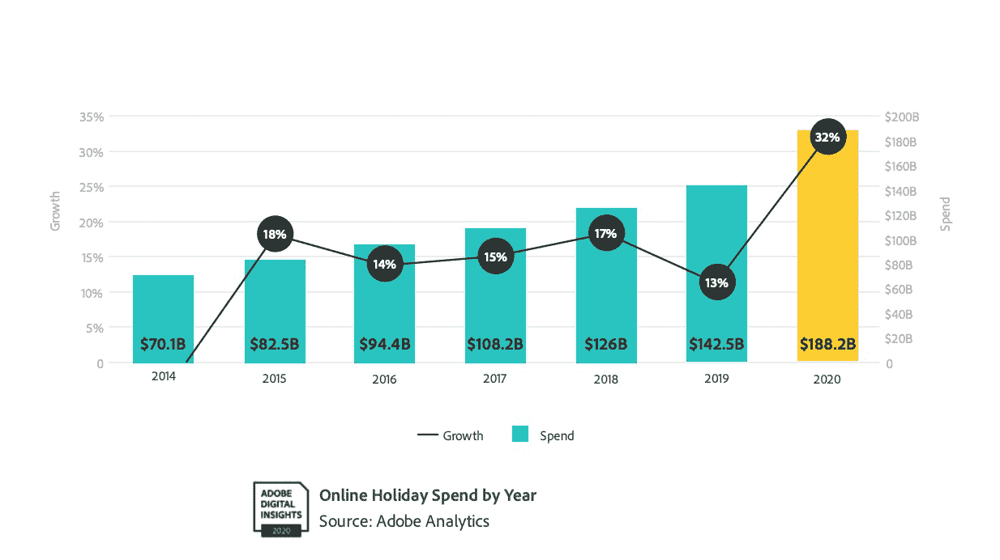
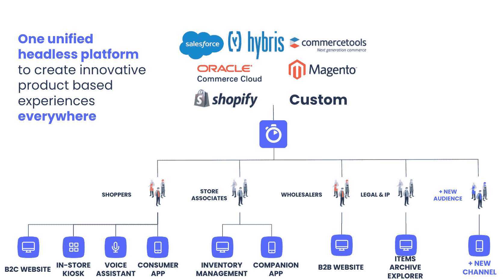

# 可组合商务如何在黑色星期五和网络周刺激消费

> 原文：<https://www.algolia.com/blog/ecommerce/how-composable-commerce-can-boost-customer-spending-during-black-friday-and-cyber-week/>

与往常一样，2022 年的假日季将为[电子商务](https://www.algolia.com/industries-and-solutions/ecommerce/)企业和市场带来一些惊人的机遇。随着在线购物继续流行并不断发展，以及新冠肺炎疫情期间前所未有的增长，许多在线零售商不能依赖运气，因为他们即将迎来黑色星期五、网络星期一和今年的假期。

让我们来看看 2021 年以来美国假日季的趋势，从中获得一些见解，帮助你在今年冬天充分利用你的营销策略。

## 一条节日旺季消费记录

*图表和统计数据来源: [Adobe:消费者在网络星期一](https://blog.adobe.com/en/publish/2021/11/30/adobe-consumers-spent-10-8-billion-on-cyber-monday-109-8-billion-so-far-this-holiday-season) 花了 107 亿美元； [Adobe:美国消费者在网上花费创纪录的 2040 亿美元](https://blog.adobe.com/en/publish/2022/01/12/adobe-us-consumers-spent-a-record-204-billion-online-this-holiday-season)*

*   消费者在 2021 年网络周期间花费了 339 亿美元，同比下降了 1.4%。
*   截至网络星期一年底，网上消费额为 107 亿美元，比美国历史上最具纪念意义的网上购物日 2020 年创下的纪录下降了 1.4%。
*   2021 赛季支出(11 月 1 日至 29 日)总计 1098 亿美元(同比增长 11.9%)。
*   在整个 2021 年假日季(11 月 1 日至 12 月 31 日)，消费了 2045 亿美元，同比增长 8.6%。

### **值得注意的趋势**

*   移动电话用户在假日消费总额中所占的比例越来越大，占在线销售额的 43%。 这与 2020 年相比略有增长，当时移动占 40%。台式电脑和笔记本电脑仍然是人们网上购物的主要方式。
*   23%的在线订单使用路边取货。
*   平均路边提货订单为 91 美元。
*   现在购买以后支付(BNPL)的收入同比增长 27%，使用这种方法的平均每单消费为 224 美元。
*   在线购物者浏览了超过 60 亿条脱销信息，比 2019 年假日季(疫情之前)增长了 253%，同比增长了 10%。

## 为打造坚实的电子商务基础

为了利用在线购物客户体验的最新趋势，尤其是假日购物，您可以:

*   **配置和微调您的搜索和导航结果的相关性** 。使用同义词并调整您的语言设置，即使用户使用与您的产品目录中略有不同的词进行搜索，也可以将他们带到他们想要的产品。
*   **提供查询建议** 引导用户，缩短他们搜索所要花费的时间。在他们开始输入查询之前，你可以推荐热门搜索、类别和促销产品。这对于在小屏幕移动设备上打字的用户来说尤其强大。
*   **优化您的电子商务平台** 用于移动设备和除台式电脑之外的其他设备
*   **确保无缝的全渠道体验** 提高并保持客户满意度和忠诚度

### **优化你的销售策略**

*   **利用分析** 来了解你的客户在这个假期寻找什么，然后在你的营销策略中利用这种洞察力
*   **使用促销横幅** 将购物者的注意力吸引到您突出显示的产品和类别上
*   **隐藏断货商品** 或推至搜索结果底部
*   **将产品和类别** 如热门产品钉在搜索和类别页面的顶部
*   **商品页面推荐商品** :为了增加订单量，推荐相关商品或经常一起购买的商品

### 确保您的技术堆栈稳健

根据我们的 2021 年[在线商务趋势调查](https://www.algolia.com/dg/ecommerce-site-search-trends/)， 在 2020 年的假日季节，65%的电子商务公司发现他们满足需求的能力不足，47%的公司无法扩展规模以满足需求，25%的公司希望能够更有效地迭代和销售商品。

拥有一个灵活、可扩展和可靠的电子商务平台的一个关键是从传统的商业架构升级到可组合的商业架构(无头架构)，看起来可能是这样的:

## 组合商务的好处

使用可组合商业方法，您可以:

*   **轻松更换部件**:您的决策需要以业务为导向，而不是受限于过时的技术架构。您希望现代技术能够快速修复任何没有达到预期效果的问题。将前端和后端分离开来，使用 API 优先的解决方案，可以让您自由地快速迭代，最大限度地减少基础设施变更的时间和资源。

*   **最大限度缩短上市时间**:在快速发展的电子商务世界中，过去能满足您业务需求的方法可能不再有效。这意味着你需要能够快速推出新的应用程序，并通过不断为你的电子商务平台带来新的功能来保持你的势头。

*   **提供便捷的路边取货服务**:为了确保即时的库存信息，你的库存管理系统必须连接到你的电子商务商店。再加上[网上购买，店内提货(BOPIS)](https://www.algolia.com/blog/ecommerce/composable-commerce-how-to-build-an-in-store-product-search-kiosk-and-store-locator/) 功能，这会给你的客户留下深刻印象，他们可能更喜欢路边提货，而不是在实体店排队等候。假期越近，与更昂贵、更不及时的运输方式相比，BOPIS 可能看起来越有吸引力。

*   **让购物者保存搜索提醒**:尽量减少失去潜在顾客的机会，这些顾客因物流或库存限制而灰心丧气或无法购买他们正在搜索的商品。怎么会？通过提供当与他们保存的搜索匹配的项目变得可用时自动提醒他们。

*   **发送推荐电子邮件**:避免无效的千篇一律的电子邮件营销，确保对每一位客户采取个性化的方式。对于你的注册或回头客，在黑色星期五促销邮件中提出基于机器学习的建议。如果一个登录的客户在你的网站上浏览一个类别，推荐该类别中评价最好的产品。如果购物者刚买了一件商品，推荐其他经常一起购买或与其购买相关的商品。

*   **利用社交媒体营销工具**:对于寻求成功的零售商和市场来说，社交媒体商业选择现在是“必须具备的”。微信、Instagram 和脸书等社交媒体网站不仅仅是营销工具，它们还是全方位服务的电子商务平台。让他们为您的底线工作。

*   **提供语音搜索**:便捷的语音辅助设备(想想 Alexa 或 Siri，或者应用内语音搜索)已经非常受购物者的欢迎。支持语音搜索的电子商务市场预计到 2023 年将增长到每年超过 800 亿美元的 T4，所以为购物者提供简单的语音搜索可能会最大化你 2022 年的假期利润。

*   **从黑色星期五**开始选择全频道:无缝融合您的电子商务体验和[店内购物](https://www.algolia.com/blog/ecommerce/composable-commerce-how-to-help-in-store-sales-associates-to-find-products-easily-by-optimizing-inventories-management/)体验，确保您的客户满意度不会被任何一个购物频道打破。无论您的购物者更喜欢使用语音助理、店内信息亭、移动设备、台式电脑还是社交媒体，您都必须确保用户体验极佳，并且您的每个频道都与其他频道整合良好。

## 让 2022 年成为您迄今为止最好的在线零售年

零售电子商务的前所未有的增长，加上多方面的客户购物行为的演变，意味着公司必须不断适应以满足客户的需求。在假期等关键销售时期，超越传统的网络周销售和营销策略，推出先进的电子商务功能是有好处的。

确保您的技术团队准备好应对最大销售季节的压力，首先要有一个精心规划的可组合架构，能够承受任何和所有季节性购物压力。给你的零售企业一份可能会继续赠送的礼物:现在就准备好你的网站或应用程序，利用今年假期提供给你的一切。

想要一些个性化的建议吗？请求免费[搜索审核](https://www.algolia.com/search-audit/) **。我们将查看您的网站，并为您提供如何在这个黑色星期五改进在线商店的建议。**