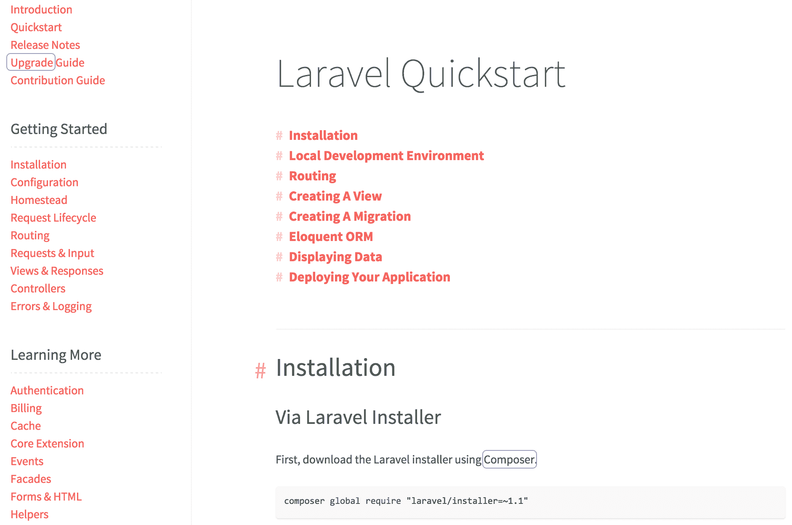
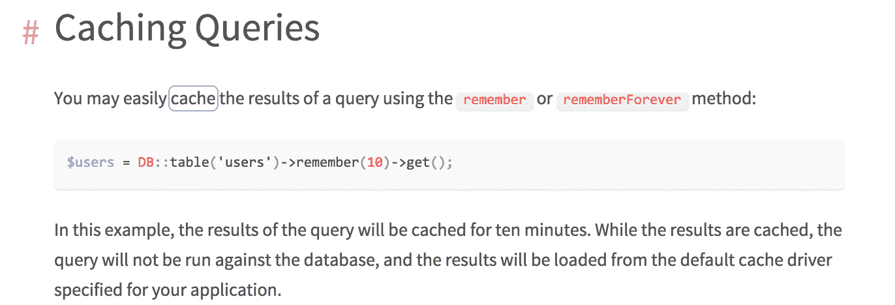
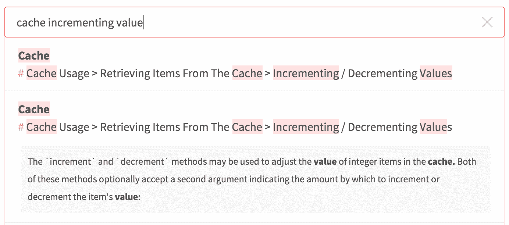
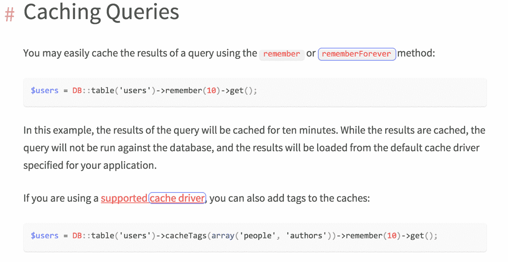
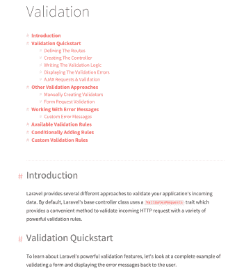
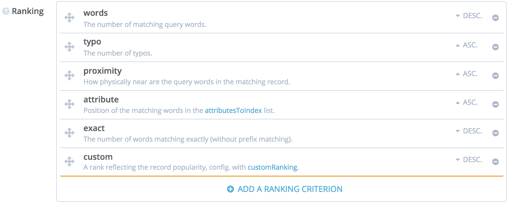

# 构建文档搜索— Laravel 文档搜索

> 原文：<https://www.algolia.com/blog/engineering/how-to-build-a-helpful-search-for-technical-documentation-the-laravel-example/>

使用逻辑和组织良好的信息架构来构建网站内容，使爬虫和搜索引擎更容易为特定查询索引相关内容。

这是因为当你把网上内容组织成网页的层次结构，并把每个网页组织成小的属性，如标题、描述、章节和段落时，搜索是最好的。

幸运的是，网络上的大部分信息都可以用这种方式组织。然而，有些内容并不容易分解，例如文档搜索或纯文本内容，如博客、技术文档和在线新闻期刊。

基于文档的搜索初看起来似乎很容易——它只是将内容文本与查询文本进行匹配。但是，对于网页结构，有几个陷阱需要注意和避免。本文解释了这些缺陷，提出了大型文档搜索中的最佳索引和网页结构。

虽然本文中的建议可能适用于任何提供有组织的文本内容集合的网站(blog、newsfeed ),但我们只讨论技术文档上下文中的大型文本，使用我们的 [Laravel 技术文档](https://laravel.com/docs/)实现。

## [](#website-information-architecture-and-document-search)网站信息架构与文档搜索

在深入这些陷阱的细节之前，让我们先来分析一下要点。

### [](#indexing-%e2%80%93-how-to-structure-the-data)索引–如何构建数据

将每页分成小块，并将每个小块保存为单独的记录。将网站的层次结构合并到每个记录中。

### [](#search-engine-%e2%80%93-finding-and-ranking-records)搜索引擎——查找和排名记录

Algolia 不使用统计或类似 NLP 或 TF-IDF 的技术来理解或解密文本。相反，它专注于文本本身的字符，通过将查询与内容进行文本匹配来创建相关性，然后应用排名公式、打字错误容忍度、接近度和其他智能方式来读取文本并对结果进行排序。

### [](#front-end-uiux-%e2%80%93-best-practices)前端 UI/UX-最佳实践

在搜索结果中只显示部分文本，而不是大部分。不然就是看多了，扫描多了。此外，只允许同一页面的两个实例出现在结果中，以便为其他匹配的页面腾出空间。

这是构建大型文本的一般策略。现在来看实现细节和一些要避免的陷阱。

看看 [DocSearch](https://community.algolia.com/docsearch/) ，这是将搜索添加到文档中的最简单快捷的方法。看一看，是免费的！

## [](#pitfall-n%c2%ba1%c2%a0the-web-page-as-the-default%c2%a0entry)陷阱 N 1:将网页作为默认入口

开发者文档通常意味着充满大量内容的冗长页面。大多数人试图在他们的搜索引擎中将整个页面作为一个条目进行索引。但是，他们后来发现有很多边缘情况，他们试图通过相关性调整来修复它们，但这很快成为一个无休止的故事，因为问题来自实际的索引本身:

1.  ### [](#1-relevant-content-only)1。仅相关内容

例如，查询`"composer upgrade"`将匹配[快速启动页面](https://laravel.com/docs/4.2/quick)，因为菜单包含`"Upgrade Guide"`并且第一段包含`"composer"`单词。这不是那种提供良好用户体验的匹配。



### 2。页面包含太长的文本

开发人员不喜欢太频繁地改变网页，他们喜欢包含大量信息的长页面。如果这样一个页面作为一个文档被索引，它将几乎系统地触发相关性问题。这就是为什么我们不建议使用标准的网络爬虫，而是使用 scrapper 来访问原始内容(Markdown 中的大部分时间可用)。

例如，查询`"cache incrementing value"`将匹配[查询构建器](https://laravel.com/docs/4.2/queries)页面，因为它包含一个带有单词`"cache"`的段落和另一个带有单词`"incrementing"`和`"value"`的段落。这是一个误报，因为它是不相关的:页面上的文本越多，得到的不相关的结果就越多。



### [](#3-the-right-anchored-section)3。右侧锚定部分

为了提供最佳的用户体验，在匹配的准确位置打开页面是非常关键的。如果每页只索引一个文档，这将非常困难。这就是为什么有这么多的文档搜索只是在顶部打开页面，用户需要滚动或使用浏览器的搜索来跳转到正确的部分。这并不容易，而且是浪费时间。



## [](#pitfall-n%c2%ba2-indexing-titles-only)陷阱 2:仅索引标题

对文档页面的标题进行索引可能会回答一些常见的问题，但这还不够。下面的段落包含了你的用户将要搜索的大部分单词。为了获得更高的相关性，对包括正文在内的全部内容进行索引是很重要的。

在本例中，需要文本来正确回答`"rememberForever"`或`"cache driver"`查询。



## [](#pitfall-n%c2%ba3-poor-relevance)陷阱 3:关联性差

对于大多数搜索引擎，相关性是配置中最棘手的部分，因为它通常由一个独特而复杂的公式来定义，该公式混合了许多几乎无法管理的信息。工程师经常调整公式或添加一些加分/扣分来改善特定查询的结果。由于他们没有任何非回归工具，他们无法衡量所有查询的实际影响。后果可能很严重。

为了保持排名在控制之下，关键是要把排名公式分成几个你能理解的部分，并能独立调整。在实践中，我们可以用一个**平局决胜**算法来拆分排名公式。

假设您的排名公式分为两部分:

*   第一个定义匹配命中的文本相关性，
*   第二个定义了匹配命中的重要性(从用例/业务角度)。

然后，您可以首先应用文本相关性，并且只有当两个匹配具有相同的值时，才移动到用例/业务相关性(重要性)。这是确保您的最终用户始终首先获得相关匹配的最佳方式(从文本视点，精确匹配他们的查询词),然后——就相关性平等而言——使用业务相关性将结果联系起来。

由于您没有将文本&业务相关性混合在一起(而是一个接一个地应用它们)，您可以修改业务相关性，而不会影响文本相关性的工作方式。
[实时搜索入门](https://www.algolia.com/doc/guides/getting-started/quick-start/)

# [](#our%c2%a0recipe)我们的菜谱

## [](#1-create-small-hierarchical-records)1。创建小型分层记录

为了解决所有这些陷阱，我们通过使用页面的 HTML 结构将页面分成许多较小的块，作为单独的记录进行索引(H1、H2、H3、H4，P)。

参见 Laravel 文档的*验证*页:



生成的第一条记录将是*验证*页面标题。它将被转换成下面的 JSON 对象。“link”属性只包含 URL 的最后一部分，第一部分可以很容易地用标签重建:

```
{
    "h1": "Validation", 
    "link": "validation", 
    "importance": 0, 
    "_tags": [
        "5.1"
    ], 
    "objectID": "master-validation-13148717f8faa9037f37d28971dfc219"
}
```

然后，页面的第一部分(介绍)将变成下面的记录。链接现在包含一个锚文本，并保留页面的标题:

```
{
    "h1": "Validation", 
    "h2": "Introduction", 
    "link": "validation#introduction", 
    "importance": 1, 
    "_tags": [
        "5.1"
    ], 
    "objectID": "master-validation#introduction-eeafb566c2af34e739e2685efdb45524"
}
```

H3 部分下的这一页的一个段落将被翻译成以下记录:

```
{
    "h1": "Validation", 
    "h2": "Validation Quickstart", 
    "h3": "Defining the Routes", 
    "link": "validation#validation-quickstart", 
    "content": "First, let's assume we have the following routes defined in out `app/Http/routes.php` file:", 
    "importance": 6, 
    "_tags": [
        "5.1"
    ], 
    "objectID": "5.1-validation#validation-quickstart-380c9827712413dbe75b5db515cd3e59"
}
```

这种方法解决了第一个和第二个缺陷。我们通过将每个文本块作为一个独立的记录进行索引，同时保持每个记录中的标题层次结构，从而解决了这个问题。

## [](#2-use-a-tie-breaking-ranking-algorithm)2。使用平分排名算法

Algolia 的设计初衷是使用平局决胜算法来确保每个人都理解并能够调整排名。现在，通过应用我们为文档搜索实现推荐的设置，可以很容易地解决陷阱#3:



匹配命中现在将根据这六个排名标准进行排序:前 5 个与文本相关性相关，最后一个是自定义业务相关性。

### [](#ranking-criterion-n%c2%ba1%c2%a0number-of-matched-words-words)排名标准 N 1:匹配单词数(单词数)

首先，我们对记录中找到的查询词的数量进行排序。我们决定将所有单词作为强制项(以及查询词之间)来处理查询。如果没有足够的匹配单词，我们再次运行查询，所有单词都是可选的(或者在查询词之间)。这个过程配置了一个索引设置，使您可以两全其美:和保证减少误报的数量，而或允许返回结果，即使查询范围太窄。

### [](#ranking-criterion-n%c2%ba2%c2%a0number-of-typos-typo)排名标准 N 2:错别字数(typo)

如果两个记录匹配相同数量的搜索词，我们使用错别字的数量作为区分符(所以我们首先有精确匹配，然后匹配 1 个错别字，然后匹配 2 个错别字，…)。

例如，如果查询是“validator”，包含“validate”的记录将与一些输入错误匹配，但将在包含“validator”的记录之后检索。

### [](#ranking-criterion-n%c2%ba3-proximity-between-query-terms-proximity)排名标准 N 3:查询词之间的接近度(proximity)

当两个记录对于*单词*和*错别字*排序标准相同时，我们接着移动到下一个标准，该标准比较记录中查询词的接近度。它将基本上计算它们之间的单词数，直到达到一个极限(在某个点之后，它们被认为“太远”)。

例如，`"cache configuration"`查询在与句子`"The **cache** **configuration** is ..."`匹配时的接近度为 1，在与句子`"... in the config/**cache**.php **configuration** file"`匹配时的接近度为 2。我们按升序对该值进行排序，因为我们更喜欢包含查询词的记录先靠近在一起。

### [](#ranking-criterion-n%c2%ba4-the-matched-attribute-attribute)排名标准 N 4:匹配的属性(attribute)

如果两个记录对于前 3 个排序标准是相同的，我们使用匹配属性的名称来确定首先需要检索哪个命中。在索引设置中，只需按重要性顺序排列要搜索的属性:


这意味着，如果匹配是在 h1 中确定的，那么它将比在 h2 中更好，比在 h3 中更好，等等。您还可以注意到每个属性上都有一个“无序”标志。这意味着在排序中不考虑属性内匹配的位置。这就是为什么对于包含相同属性的`"[Cache Configuration]"`或`"[Obtaining a cache instance]"`的记录，查询`"cache" `将匹配相同的属性分数。

### [](#ranking-criterion-n%c2%ba5-the-number-of-terms-matching-exactly-exact)排名标准 N 5:完全匹配的项数(exact)

如果两个记录对于前 4 个标准是相同的，那么我们使用记录中完全匹配的查询词的数量来确定首先需要检索哪个命中。因为我们在每次击键后都返回结果，所以最后一个查询词将作为前缀匹配(它将匹配单词的开头)。该标准用于在前缀匹配之前对精确匹配进行排序。

例如，查询“valid”将在包含“ **valid** ation”的记录之前检索包含“ **valid** 的记录。

### [](#ranking-criterion-n%c2%ba6-business-ranking-custom)排名标准 N 6:业务排名(自定义)

仍然缺少一个重要的东西:您的用例/业务标准。如果两个记录的所有先前标准都相同，我们将使用用户定义的自定义排名。

例如，搜索`"Validation"`将使用最重要的“h1”属性匹配以下两条记录。这导致与所有先前的条件相匹配，但是我们想首先检索页面标题，因为另一个记录是一个段落。这就是`"importance"`属性在添加到记录中时的表现。

```
{
    "h1": "Validation", 
    "link": "validation", 
    "importance": 0, 
    "_tags": [
        "5.1"
    ], 
    "objectID": "master-validation-13148717f8faa9037f37d28971dfc219"
}
```

```
{
    "h1": "Validation", 
    "h2": "Working With Error Messages", 
    "h3": "Custom Error Messages", 
    "link": "validation#custom-error-messages", 
    "content": "If needed, you may use custom error messages for validation instead of the defaults. There are several ways to specify custom messages. First, you may pass the custom messages as the third argument to the `Validator::make` method:", 
    "importance": 6, 
    "_tags": [
        "5.1"
    ], 
    "objectID": "5.1-validation#custom-error-messages-380c9827712413dbe75b5db515cd3e59"
}
```

“重要性”值是一个从 0(页面标题)到 7(H4 下的文本部分)的整数，我们在自定义排名中以升序使用(越小越好):


完整的重要性范围如下:

*   h1 为 0，
*   1 代表 h2，
*   2 对于 h3，
*   3 对于 h4，
*   4 对于 h1 下的文本，
*   5 对于 h2 下的文本，
*   6 对于 h3 下的文本，
*   h4 下的文本为 7。

## [](#this-is-a-generic-recipe)这是一个通用配方

我们已经在几个技术文档中成功应用了这个方法，比如 Laravel、Bootstrap 和许多其他的[文档网站](https://docsearch.algolia.com/)。显示结果的方式不同，但我们使用完全相同的方法和相同的 API。

我们的任务之一是帮助所有开发者浏览技术文档。如果你正在进行一个开源项目，我们很乐意帮助你——以下是如何开始使用 [DocSearch](https://docsearch.algolia.com/docs/what-is-docsearch) 的方法。我们将为您提供免费的 Algolia 帐户和任何支持，使您的实施成为一流的参考。给我们留言！