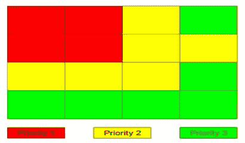

# 为什么商品销售(和搜索)对电子商务很重要

> 原文：<https://www.algolia.com/blog/ecommerce/how-to-design-your-merchandising-and-searchandising-stategies-for-success/>

对于包括电子商务在内的任何零售企业来说，销售都非常重要。商场或购物中心中的商店可以操纵物理空间来影响交通流量，战略性地定位产品或品牌特定的展示，调整货架，在墙上悬挂吸引人的图形，修改照明来营造气氛，播放音乐，甚至引入气味。

没有理由说在线企业不能做同样的商品销售——为数字表面空间量身定制。一部手机的屏幕， [大约占四分之三的网上销售](https://www.oberlo.com/statistics/mobile-commerce-sales) 的地方，只有几平方英寸。似乎在那个狭小的空间里没有太多的工作，但这并不完全正确。事实上，当在线销售由数据和设计驱动时，它可以产生很好的效果。

## **设计和内容**

[数字营销](https://www.algolia.com/industries-and-solutions/ecommerce/digital-merchandising/)既是一门艺术，也是一门科学。这里有一个 [简要回顾](https://www.algolia.com/blog/ecommerce/the-guide-to-e-commerce-merchandising/) 一些与设计、新鲜感和互动性相关的营销最佳实践，这些实践不容易量化，但绝对值得关注。

**忠于你的品牌** 。有些人认为品牌是字体、调色板和如何使用标志的规则的集合。有些人坚持认为，品牌必须提供明确的承诺，并代表一些东西。无论你如何看待你的品牌，你的电子商务网站必须反映它，并与你的其他销售渠道保持一致。

**好看** 。高质量的摄影不仅能帮助顾客做出购买决定，还能表明你对你提供的产品足够尊重，能给他们应得的视觉关注。你网站的美学设计也很重要。对于高端产品，可能需要优雅的设计，但如果你的网站旨在快速满足功利需求，它仍然应该有适当的设计。它应该 *看起来* 功利。

**给你的顾客一个参观**T2 的理由。如果你定期提供新产品、季节性特价、短期销售或其他经常变化的内容，你就给了你的客户一个超出实际需求的访问理由。麦当劳每年在美国销售 [五亿五千万个汉堡](https://expandedramblings.com/index.php/mcdonalds-statistics/) ，但他们仍定期推出新产品。

**相关** 。与季节性和节假日相关的商品是相关性的一个明显例子，但还有更多。像超级碗或奥运会这样的体育赛事，像越来越关注可持续发展这样的社会趋势，甚至社会事业都可以给你的网站带来额外的活力和个性。

**利用用户内容。** 复习是必不可少的，但你或许可以更进一步。一些网站展示了客户的 Instagram 照片，其中包括他们正在使用的产品。您还可以用大号字体展示带有正面客户评论的横幅。

**打造互动购物体验** 。如今，如果你在网上购买一副眼镜，借助手机的摄像头，你可以看到它们在你脸上的样子。有些网站会让你在购买之前看看你的房子或公寓里的家具是什么样的。技术的存在是为了大量的互动。只是需要投入使用而已。

*更长的清单，看看我们的* [*电子商务营销指南*](https://www.algolia.com/blog/ecommerce/the-guide-to-e-commerce-merchandising/) *。*

## **数据驱动搜索**

上面概述的实践很重要，但是创造力和天赋只能带你走这么远。在线销售需要由数据驱动，而数据在搜索栏中的贡献最大。重复一遍，43%的电子商务网站访问者会直接进入搜索栏。此外，这些搜索者很可能是你最好的客户。在一项研究中，使用搜索栏的消费者转换 [的次数比不使用的消费者多 1.8 倍](https://econsultancy.com/is-site-search-less-important-for-niche-retailers/) 。将营销技巧直接引入网站搜索可以对底线产生巨大的影响。这种做法通常被称为。

**什么是 searchandising？**

> *搜索和筛选是以推动电子商务商店销售、转化和 KPI 的方式管理搜索结果的过程。*
> 
> Searchandising 允许产品所有者、营销者、商人和网站所有者推广产品，以符合商业目标的方式组织搜索结果，甚至跟踪人们如何与产品互动。搜索是一个迭代和持续的过程，可以不断改进，最终推动更多的销售。
> 
> *—路易丝·沃尔莱尔，* *阿尔戈利亚*公司产品营销经理

首先，searchandising 建立在一个关键的搜索原则之上:排名，即搜索结果出现的顺序。最近一项基于数十亿次谷歌搜索的研究表明，[28.5%的访问者](https://www.digitalinformationworld.com/2020/07/new-study-reveals-that-the-first-organic-result-in-google-search-has-an-average-ctr-of-28-percent.html) 点击了第一个有机搜索结果，而前三个占所有点击量的 50%以上。在亚马逊上，[35%的访问者点击第一个搜索结果。简而言之，控制搜索结果的排名(顺序)可以让你处于最有利的位置，向你的客户提供你最想让他们首先看到并最终购买的东西。](https://www.webfx.com/blog/internet/amazon-search-result-infographic/)

虽然搜索引擎可能知道很多关于语言、产品，甚至是正在搜索的用户的信息，但也有很多是它不知道的。例如，搜索引擎不知道你的产品的利润，哪些产品有好评，哪些产品在打折，等等。幸运的是，有了现代网站搜索解决方案，搜索引擎可以根据任何属性或事件数据将某些产品提升到列表的顶部。这里有一个更完整的列表，列出了一些可能影响你想要的结果排名方式的常见因素。

*   **页边距** 。与查询的最佳匹配，甚至是价格最高的匹配，可能没有最好的利润，因此不是最有利可图的。
*   **畅销书** 。有时候把畅销书推到顶端是有意义的，因为，嗯，它们是畅销书。
*   **点评** 。至少有一个评论的产品页面的转化率比没有评论的页面高 350 %,所以这些项目的排名更高是有道理的。
*   **初来乍到。比你可能意识到的更多的访问者正在访问你的网站来发现新的东西，这些东西是推上顶端的很好的候选者。**
***   **折扣和打折商品** 。对潜在买家来说，打折或促销通常是一个转折点。这也是一种移动短保质期商品或处理积压商品的方式。*   **交叉销售** 。有些商品比其他商品更有可能引发交叉销售，最终增加订单价值。事实上，您可能希望在搜索结果中包含一些交叉销售的商品。*   **忠诚计划状态** 。会员可以获得特定商品的奖励和特别优惠，这些应该得到加强。*   **回报率** 。回报是昂贵的，用最低的回报率来提升产品是有意义的。*   **网站品牌** 。如果你的品牌像沃尔玛一样靠价格竞争，你可能希望排名能反映这一点。另一方面，如果你的目标是被认为是高档和独特的，价格将不是一个因素，排名应该把更优雅(因此更昂贵)的项目放在顶部。*   **时间敏感度** 。一般来说，与节日有关的产品，像复活节彩蛋染料或圣诞饰品，需要在相对较短的时间内密集推送，然后掩埋(节后销售除外)。*   **保质期** 。食品是时间敏感性的一个极端例子。任何容易变质的东西都可以从高排名中受益。*   **季节性** 。成千上万的产品受到季节的影响，展示合适的产品——例如，雪铲与花园铲——将提供更好的客户体验，并增加销售的可能性。*   **缺货**缺货。大约 15%的顾客在遇到缺货商品时会去另一个网站，所以显然最好把这些商品埋藏起来。**

 **至少在某种程度上，这些排名和布局功能可以引导客户的旅程，就像产品展示的过道和位置引导客户参观实体店一样。

事实上，在电子商务网站上寻找商品往往比在大型商店里寻找更容易、更方便。越来越多的电子商务网站可以包括“体验区”，目录页面上有可点击的邀请，例如，使用设备的摄像头虚拟试戴一副眼镜，或者看看新沙发在你的客厅里实际上会是什么样子。

### **类别页面**

产品在页面上的展示方式很重要。下图基于最近的眼球追踪研究，显示了网站访问者的注意力通常是如何优先化的。你可以把你希望得到最多关注的产品放在访客最有可能看的地方(图中红色)。

*眼球追踪研究表明，观众会优先关注台式机或笔记本电脑屏幕的各个部分。*

## **行动中的搜索和搜索**

出于搜索和分类的目的，搜索结果可以是手动的，也可以是自动的，这是你的选择。手动监管可以是一个简单的拖放过程，不需要编码。你只需按你希望的顺序排列商品，这将反映在搜索结果和目录页面中。这也叫。

手动处理的好处是你可以按照自己的意愿对结果进行精确的排序。缺点是，像任何手动过程一样，它很耗时。对于许多电子商务网站来说，手动排列每个搜索所需的时间会令人望而却步，并且结果的管理通常仅限于总目录的前 20%。

或者，您可以使用规则，根据您选择的任何标准(如品牌、利润、受欢迎程度等)自动排序(排名)和显示内容——基本上，就是上面“搜索和使用的驱动因素”一节中提到的所有内容

好处是双重的。首先是规模。你可以设置“首先显示打折商品”这样的规则，这将适用于所有类别和搜索结果。其次，这些规则可以在你推销的商品类别中推广高转化率商品。例如，如果你有一个耐克鞋的销售，你可以使用规则来促进最畅销，最高库存，或最接近(按地理或店内可用性)的客户。

*使用相关性设置来调整搜索结果和分类页面的排名。*

### **升压**

如果搜索引擎可以根据销售额最高的产品来决定将哪些商品推至顶部，会怎么样？现在，如果你进一步提高这些项目呢？

我们有三种提升物品的方法。

您可以配置基本排名公式，以便根据数据将某些项目排在其他项目之前。例如，您可以添加业务指标，如畅销、高利润和受欢迎程度，并配置引擎以提高某些项目的可见性。

您还可以创建根据查询触发的规则。例如，如果用户键入“iphone”，您可以创建一个规则，在结果顶部显示(或固定)最新版本。

*   **提升趋势项目——动态重新排名**

最后，你可以通过应用点击、购买、转化或任何其他分析数据等成功指标，让引擎为你做推广，以推动最有可能带来更高转化的最佳结果。它不断学习和适应您的站点的性能，以最大化业务成果

### **条幅**

除了优化搜索结果的排名方式，Algolia 还能让你 [显示横幅](https://www.algolia.com/search-inspiration-library/promotion-banners-search-retailer-desktop-king-jouet/) 来将访问者的注意力集中在特定的商品信息上。横幅可以引起对新产品、新款式或颜色、销售活动、交叉销售商品或任何其他销售或品牌信息的额外关注。

### **个性化**

搜索和设计的另一个极其重要的方面是个性化。这很有效，而且有大量的统计数据支持这一论断。根据一项研究，80%的消费者在得到个性化体验时更有可能购买。个性化的重要性越来越大。[60%的消费者](https://www.twilio.com/blog/announcing-the-state-of-personalization-2021) 在 2021 年的一项研究中表示，在经历了的个性化购物体验后，他们可能会成为 *的重复购买者，高于 2017 年的 44%。*

许多零售商使用带有算法的推荐引擎进行个性化，根据大量数据点返回结果，例如:

*   性别
*   奖励计划状态
*   年龄
*   社交媒体喜欢
*   地理位置
*   浏览器
*   购买历史
*   一天中的时间
*   网站搜索历史
*   浏览过的页面

[个性化](https://www.algolia.com/products/search-and-discovery/personalization/) 发生在搜索本身内部或当客户浏览网站时。实际上，这意味着在其他搜索和排序算法的基础上进行个性化分层。例如，如果一个木工正在搜索一个电钻，搜索结果可以包括买家最有可能购买的电钻品牌或类型，这是基于买家过去的查看或购买历史，或者您选择利用的任何其他因素。

### **A/B 测试**

测试是电子商务持续改进的关键。大多数人把 A/B 测试和优惠、标题、图片、横幅颜色之类的联系在一起，但是 [A/B 测试](https://www.algolia.com/blog/ecommerce/how-to-improve-site-search-with-ab-testing/) 可以应用到搜索本身。例如，如果根据最受欢迎的品牌优先与最低价格优先对搜索结果进行重新排序，哪组结果会产生更高的转化率？通过回答这样的问题，A/B 测试可以将搜索收入提高 10%或更多，而且使用 Search.io 很容易执行。以下是一些需要记住的要点。

*   **使用足够大的样本量给出相关结果** 。事实证明，一个显而易见的问题是——多大才算足够大？–没有简单的答案。但最底端至少是 1000 次搜索。
*   **随机化** 。确保每个搜索给定术语的人都有同等的机会获得结果集“A”和结果集“B”。
*   **一次只测试一个结果** 。例如，测试较高的 CTR 或较高的 AOV，但不能同时测试两者。试图从一个测试中评估多个结果只会混淆决策。
*   **不要延长测试期超过一个月** 。任何更长的时间框架都会引入新的变量——变化的天气、学校里的孩子与夏天回家的孩子，等等。–这些可能会扭曲您的结果。
*   **迭代** 。任何给定搜索的第一个 A/B 测试的获胜者可能不是最佳结果集。

## **商品事宜**

即使在最小的屏幕上，商品销售也有创造和创新的空间。数据驱动的在线销售——搜索和设计——是最有效的工具之一。优化和个性化的搜索结果排名会带来更好的商业结果。Algolia 不费吹灰之力就能提供这些结果。

如果你想通过 [【商品销售】](https://www.algolia.com/products/search-and-discovery/visual-merchandising-curation/) 提高你的电子商务网站的性能，请不要再搜索了——通过 [现场演示](https://www.algolia.com/demorequest/) 或 [免费开始](https://www.algolia.com/users/sign_up) ！**