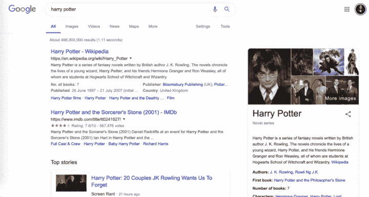
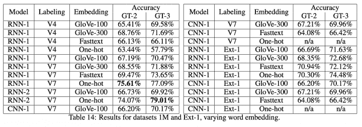

# 如何使用人工智能和机器学习识别用户搜索意图

> 原文：<https://www.algolia.com/blog/ai/how-to-identify-user-search-intent-using-ai-and-machine-learning/>

时间是我们最宝贵的不可再生资源。如果你像大多数人一样，你可能会发现浪费你的时间和精力阅读无关的广告是非常令人讨厌的，这些广告毫无帮助，有时甚至是完全误导。

我记得在我 25 岁的时候，我立刻就被婚礼服务的广告吸引住了。我一满 30 岁，它们就成了尿布的广告。虽然这种简单的基于年龄的目标选择策略有时会奏效，但它也可能是刻板的和有局限性的。

越来越简单的广告定位也带来了令人讨厌的用户体验。这就是人们开始使用广告拦截器的原因，这也是一家公司将营销资金扔出(浏览器)窗口的必然方式。

有一种更好的方法来优化你的营销预算，而不是把意大利面扔向墙壁，希望有东西粘在上面。我们之所以知道这一点，是因为我们的客户使用我将要描述的方法，通过广告活动将他们的点击率(CTR)提高了 15%。

没错，不断发展的技术让瞄准变得更容易，老实说，也更恐怖(我们正看着你呢，脸书！).但我们知道一个事实，有一个更有效的方法让用户点击并获得他们需要的东西，这与人工智能有关。

让我们探索一下用户搜索意图是如何提升广告活动绩效的。

# 为什么用户搜索意图风靡一时

SEO 专家和营销人员过去常常为不同类型的设备优化活动和内容。还记得你不得不用台式电脑上网的时候吗？是的，更简单的时代。

随着分析变得越来越强大，背后的技术也在不断改进，用于细分和锁定受众的标准也变得更加多样。然后，随着越来越多的人上网，位置成为营销和销售业绩的关键。然后是社交媒体:公司开始积累大量关于人的具体数据，这导致了更深入、更彻底的针对性。

那么，为什么尽管有这些数据和技术，仍有数百万人被浪费掉呢？

除非你真的关心客户，否则技术不是答案。

输入用户搜索意图。顾名思义，用户搜索意图揭示了人们在谷歌搜索某样东西时想要什么。(这个词适用于所有搜索引擎，但我们在骗谁呢？你不可能会 *兵* 什么的。)

用户搜索意图已经成为优化世界的甜心——无论是搜索引擎优化、转化率优化(CRO)还是其他学科——因为它提供了非常具体的见解而不显得呆板。用户提供意图，公司要做的就是关注并正确解读。

这就是事情变得棘手的地方。谷歌比任何人都清楚这一点。这就是为什么它改变它的搜索算法 500-600 次(！)每年。

通过每年处理数万亿次搜索，谷歌的算法已经开始理解每个查询背后的意图。它的频繁更新正在改变搜索引擎结果页面(SERP)的面貌，以适应搜索者的意图。

例如，当你搜索“哈利·波特”时，该算法知道你可能想找到关于书籍和电影的信息，因此它结合了这两种可能的意图，并使相关结果随时可用: 

即使你的公司不是谷歌，你也可以通过使用人工智能来利用用户的搜索意图。，你就可以将由此产生的知识输入到你的营销机器中，并大规模地进行。以下是方法。

## 如何利用用户搜索意图帮助你的企业

当你知道 *为什么* 客户想要某样东西，你就能明白 *如何* 去交付它。

如果你知道某人在寻找什么，你可以在适当的时候传递适当的信息，帮助他们找到他们需要的东西，以及:

*   降低噪音
*   降低您的客户获取成本(CAC)
*   提高你的点击率
*   提高客户保持率
*   强化你的定位
*   给转介飞轮供电
*   优化你在营销上投入的资源

那么你怎么知道消费者想要什么呢？

我们接受了在广告技术领域为客户找出答案的挑战。他们要处理 17 种语言的大约 50 亿个搜索查询。对于这个项目，我们专注于英语。

## 钉钉用户搜索意图的老办法

利用用户搜索意图释放你的增长潜力从建立关键词列表开始。你能收集的关键词越多越好(想想五到六位数)。只要确保数量不会影响质量。

下一步需要数据挖掘，以便为下一阶段分类和选择关键词。无论你多么努力地想让这个过程自动化，你仍然需要手动检查你的关键词类别，以确保它们与你的目标相关。

相同的工作流程适用于识别关键字中的意图，包括指示意图的触发器和附加到每个关键字的意图类型(信息、交易、导航或考虑；这些我们下面会讲)。

当你完成了 [所有这些工作](https://moz.com/blog/build-a-search-intent-dashboard-to-unlock-better-opportunities)——如果你从未尝试过，这可能需要几个小时——是时候使用专用工具清理数据并建立数据源之间的关系了。

然后，您将构建一个仪表盘，以便为营销团队提供有效的见解，用于创建营销活动和优化预算。

手动识别关键字列表意图的缺点是显而易见的:

*   时间和资源密集型
*   难以有效规模化
*   需要您的营销团队可能缺乏的特定专业知识
*   没有通过 API 提供可输入第三方平台的见解，以实现未来优化的自动化

出于这些原因，我们专注于寻找一种更具扩展性的解决方案来识别用户的搜索意图，随着营销部门不断完善他们的方法和策略，这种方法在大公司中变得越来越普遍。

## 用机器学习模型提取意义

我们的挑战是根据查询预测用户的搜索意图。用户的搜索意图自然会通过他们的搜索引擎活动(他们使用的查询和他们点击的链接)和目标网站上的活动来表明，但我们无法获得这些类型的数据。

我们的目标是从查询中提取尽可能丰富且可行的见解。我们试图回答的问题是，机器学习模型如何理解查询背后的意图？

对人类来说，答案是显而易见的:只要读那些传达意思的文字。但是在 ML 模型中，单词只是一组没有意义的字符。

当浪漫的伴侣问“怎么了，宝贝？”而得到的回应是“没什么”，大多数人知道那不是这个人的意思。不过，ML 模型无法知道。此外，即使对人类来说，用户意图也可能是模糊的。“什么都没有”可以有很多意思。

这里还有一个例子:如果有人搜索“iPhone 8”，他们想做什么？他们是在找产品说明书还是评论？他们想看手机照片吗？ 我们无法确定，但可以根据几个意图类别做一个假设。

### **人类如何定义意图与人工智能如何定义意图**

对于这个用例，我们将用户意图分为三类，第四类(考虑事项)稍后添加。这些类型的意图与营销漏斗中的层次相对应:

| **Informational or Awareness**与查找关于某个主题的信息相关。例子:《2013 年纽约市人口》“埃菲尔铁塔有多高” | **Transactional**与完成一个目标或从事一项活动有关。例子:《购买复仇者联盟 DVD》【iPhone 价格】 |
| **Navigational**亦称“亲临”与查找附近地点或其他类型的本地信息相关。例子:“附近的中餐馆”《公交时刻表》 | **Consideration**这些介于信息意图和交易意图之间。例子:《iPhone 评论》《三星 iPhone 对比》 |

人工智能面临的挑战是查询的模糊性。本质上，其中一些有多重意图。例如，如果有人搜索“酒店”，其意图取决于上下文。它可以是导航性的(寻找附近的酒店)，也可以是考虑性的(在线预订)。它也可能是事务性的，尽管这个通用搜索词表明用户可能还没有准备好预订。

### **将单词转换成可以输入到 ML 模型中的数字**

一个模特不能理解文字。如果我们试图使用原始数据，这就像通过给狗看其他狗的照片来教它服从命令一样。完全是胡言乱语。模型对算法进行操作，因此为了“说它们的语言”，我们必须将查询转换成它们的数学等价物。这个问题属于 [自然语言处理(NLP](https://en.wikipedia.org/wiki/Natural_language_processing) )范畴。

文字到可理解格式的转换可以借助[GloVe](https://nlp.stanford.edu/projects/glove/)或[fast text](https://fasttext.cc/)等 ML 模型来实现。这些工具将每个单词转换成一组数字(向量)，同时保持单词之间的关系。这意味着两个相关的词(如“购买”和“购物”)将被视为比两个不相关的词(如“购买”和“鹦鹉”)更密切相关。

### **手动与自动标注意图—如何缩放**

这样你就有了单词表示和意图类别。现在怎么办？

下一步是用每个查询的意图来注释查询，并使用这个数据集来训练模型。因此，经过训练的模型将学会预测用户对新查询的意图。这是一个类似于对象识别模型的概念。如果有足够多的有猫的照片，模特将学会在照片中认出一只以前看不见的猫。

回到注释查询，有两个选项:

*   **手动标注数据**

这是一种“查看查询并在旁边写下意图”的奇特说法

手动标注数据的主要优势是高质量的结果，因为这项工作是由人来完成的。然而，这是一个非常慢的过程(注释 1，000 个查询大约需要两个小时)，所以在包含几百万个查询的数据集上不会有太大进展。

然而，得到的小数据集可用于验证，这意味着您可以将它与模型生成的结果进行比较，并查看它们之间的差异。

*   **自动标注数据**

自动标记过程需要创建一个脚本，该脚本使用多个规则将意图类别附加到每个查询。一种简单的方法是这样的:假设单词“buy”表示交易意图，一个脚本将所有包含这个单词的查询注释为交易。这种方法很精确，但是它限制了带标签的查询的数量，因为不是所有的事务性查询都包含这个单词。

对于我们创造的更进化的方法，我们使用预先描述的单词表示(向量),并且我们计算单词之间的距离。如果一个查询包括“购物”，一个与“购买”密切相关的词，脚本将该查询标记为事务性的。

这种方法的主要优势是它可以处理大量数据，尽管它也有局限性:它不能识别包含错别字或不在字典中的单词(例如，特定的智能手机型号)。

### **训练模型识别搜索意图**

我们现在有了一个带有标签数据的数据集。下一步是选择模型类型、训练模型、评估结果和迭代。因为数据是有标签的，所以我们有一个多类分类的问题。以下是随机查询列表的结果:

请注意，意向是用 0 到 1 之间的值表示的概率。例如，查询“我附近出售的猫”表达了 *和* 两者的事务性 *和* 导航意图。我们可以通过查看最高预测值来确定最可能的意图。研究这个机器学习问题是高度迭代的。

在编程中，总是有多种方法来实现一个目标(例如通过实现一个特性)，但是如果我们按照步骤来做，我们就能保证实现一个结果。

机器学习是不同的，因为它涉及大量的尝试和错误。我们没有明确的解决方案，所以我们可能会尝试许多方法，并衡量每种方法的结果。经过这一过程后，我们可以保留最佳解决方案，丢弃其余的。忽略沉没成本是我们的秘密武器。

# 机器学习模型

当处理话语或查询时，就像这里的情况一样，以循环的方式构建模型是非常自然的，而不是独立地处理它们。这是因为单词的时间顺序。因此，线性递归神经网络模型(RNN-1)是我们用来建模意图预测问题的第一件事。

然后，我们增加了模型的复杂性，以查看添加非线性(RNN-2)、更复杂的递归层或堆叠多个递归(RNN-3)是否有助于解决问题。最后，我们有 3 个循环模型，每一个都比前一个复杂。

我们还构建了一个无递归的卷积神经网络(CNN-1)，其中查询中的每个单词都独立于前面的单词，使用最大池。从概念上讲，每个单词都使用卷积层进行过滤；然后，对于单词特征中的每个索引，我们计算最大值，最终在整个查询中产生单个特征。

神经网络的输入是一个单词嵌入(GloVe，Fasttext，One-hot)，从 softmax 激活函数为三个意图中的每一个产生一个概率输出。然后，在测试期间，所选择的意图是概率最高的意图(单意图预测)，或者是概率本身(多意图预测)。

我们已经构建了多个模型版本，总共 8 个，从一组非常基本的单词开始，然后基于结果和常识迭代地改进每种方法。我们还使用了一个外部注释工具(Ext-1)。下面我们提供了一个汇编的表格，突出了它们之间的相似性和差异性。

在我们的发现中，我们观察到，虽然改变模型架构带来的改进非常小，但使用更丰富的单词表示每次都能将结果提高几个百分点。对比 GloVe-100 和 GloVe-300，我们看到了持续的改进。使用 Fasttext 或 GloVe 不会影响最终结果:两者都会产生竞争性结果。

然而，也许最令人惊讶的结果是 **使用非预训练嵌入(一热)相比于所有其他表示产生了非常大的改进。** 只有递归模型可以使用这种表示来训练，而卷积模型在训练期间发散。这可能是因为需要大量的参数、错误的初始化或者缺少适当的超参数调整。

无论哪种方式，RNN-1 和 RNN-2 都使用 1M 字典上的一热编码进行训练，产生了非常好的结果:多意图(2 个协议)的 75.61%和单意图(3 个协议)的 79.01%。

# 自己动手

在构建您自己的用户搜索意图模型之前，请记住，当所有搜索查询属于同一类别(例如，时尚、零售、汽车或生活方式)时，自动标记方法会产生最佳结果。无论模型变得多么好，用户的搜索意图仍然保持一定程度的模糊性，因为即使是人类也无法同意用相同的方式来标记特定的数据集。

我们的客户和合作伙伴已经在不同的场景中使用我们的用户搜索意图预测模型，并取得了令人振奋的结果:他们的点击率提高了 15%!我们现在对英语数据集的准确率约为 85%,我们正在努力进一步提高这一性能。

让我们知道你是否正在使用类似的方法来识别用户搜索意图预测！如果你遇到任何问题，我们很乐意听听你在构建 NLP 算法以产生更准确的结果方面的经验。