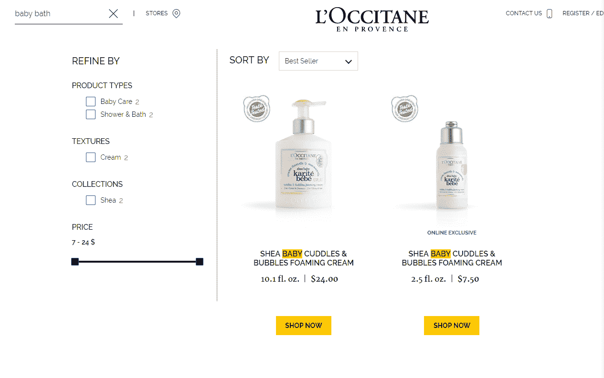

# 提高你的 Shopify 转化率的秘诀是什么？伟大的搜索

> 原文：<https://www.algolia.com/blog/ecommerce/improve-shopify-conversions-with-search/>

如果你能启动你的 Shopify 支持的在线商店或应用程序，并最终获得一些令人惊叹的关键绩效指标，那不是很好吗？

好消息是你可以；所有这一切都需要添加一些搜索功能和一点内容发现技术到您的电子商务网站。 无论您的 Shopify 支持的商店是刚刚起步的小型商店还是成熟的大型商店，您都可以使用 Algolia(a[Shopify Plus 认证合作伙伴](https://www.algolia.com/blog/algolia/increased-revenue-for-merchants-algolia-is-now-a-shopify-plus-certified-partner/) )基于 API 的解决方案来增强购物者的在线搜索、浏览和购买体验。

内置 [Shopify 搜索](https://help.shopify.com/en/manual/sell-online/online-store/storefront-search)—’这样还不够好吗？

嗯，不，这是一个开始，但只是一个初步的开始。

您可以做更多 *更多* 来帮助您的购物者喜欢他们在您的 Shopify 或 Shopify Plus 网站上享受的体验。你可以通过认真对待你的搜索功能并扩展其覆盖范围来做到这一点。通过增强搜索的专业插件，您可以提高转化率，增加平均订单价值，并极大地提高您的底线，更不用说取悦您的客户，并在他们完成第一次结账后很长时间内保持他们定期回来。

那么，创造一个引人注目的 Shopify 搜索体验需要什么呢？

## 改善你在 Shopify 上的网上购物体验的 7 个技巧

有 7 个关键领域，如果做得好，会成为优秀的 Shopify 搜索:

1.  提高购物者搜索结果的相关性
2.  利用 [搜索分析](https://www.algolia.com/products/search-and-discovery/analytics/) 来指导你的决策
3.  增强用户体验(UX)和用户界面(UI)
4.  为使用移动设备的人简化流程
5.  使用目标个性化
6.  做智能销售
7.  通过产品推荐预测购物者的需求

### 提高购物者搜索结果的相关性

高搜索相关性自然与良好的网上购物体验相关。您在确定客户的搜索意图并在您的 Shopify 或 Shopify Plus 商店中为他们提供相关搜索结果页面方面做得越好，他们的用户体验就越好，您还可以获得更高的转化率和更低的跳出率。

文本相关性指的是搜索结果与某人查询文本的匹配程度。通过提高文本相关性的这些方面，您可以为您的 Shopify 商店的访问者提供更相关的结果:

*   **错别字公差。** 从购物者的搜索产品描述中了解他们的购买意图，即使他们拼错了一个单词或使用了“停用词”(例如，the、and、at、with)
*   **同义词。** 提供同义词结果(例如，当他们输入夹克时，结果为皮大衣)并包括前缀搜索(p、pa 和 pan 将显示裤子和长裤的结果)
*   **复数。** 应用直觉搜索策略:当购物者输入“男鞋”时，返回“男鞋”的结果

业务相关性意味着使用你的网站指标——如点击率(CTR)、转换率和受欢迎程度——来优化你的搜索相关性，并确保向购物者展示他们最合适的内容。例如，您可以跟踪项目的转化率，然后在搜索中首先显示转化率最高的项目。

因为购物者的偏好和搜索模式不断变化，所以明智的做法是定期评估你在哪些地方有机会调整和优化你的搜索相关性。您还可以安排在您的 Shopify 商店内容或产品目录发生变化时进行快速调整。

### 利用搜索分析来指导你的决策

如果你想提高你的 Shopify 业务 KPI，仔细校准你的搜索是值得的。你可以通过搜索分析监控用户的体验和在线行为来做到这一点。例如，看看你的搜索者得到或没有得到的结果(空结果)，你的热门搜索，点击位置，“没有结果”搜索的数量，以及过滤器的使用。有了这些关键细节，你就可以根据数据来决定你的 Shopify 搜索体验。例如，您可以主动识别表现不佳的搜索，并调整其相关性。

### **增强用户体验(UX)和用户界面(UI)**

让您的用户能够快速找到他们想要的东西，并直观地提炼他们所看到的内容，这对于充分利用您的 Shopify 搜索功能至关重要。把这些改善 UX 和用户界面的技巧运用到你的网站或应用中:

*   从搜索者的第一次击键开始显示结果。 自动完成(即搜即输)功能鼓励用户输入两倍的搜索词，这导致更相关的搜索结果，根据研究，转化率增加了 24%。
*   **先提供搜索，再提供导航，反之亦然。让用户从搜索或导航开始，然后通过其他方法改进他们的结果。例如，在他们进行搜索后提供方面，或者使方面可搜索。**
*   **显示并突出显示可搜索的属性。**例如，通过下面的产品搜索，购物者可以根据产品类型、质地、收藏页面或价格缩小搜索范围:

*   **提供** [**联合搜索**](https://blog.algolia.com/what-is-federated-search/) **，** ，它还会显示购物者可能感兴趣的任何产品相关内容，如评论、博客帖子和收藏。下面是一些联邦搜索结果的例子:

### **为使用移动设备的人精简流程**

移动用户占 [一半以上](https://www.broadbandsearch.net/blog/mobile-desktop-internet-usage-statistics) 的网页流量。移动购物者时间有限，容易分心，所以当你建立和改进你的 Shopify 或 Shopify Plus 搜索时，让你的网站的移动体验尽可能简单是值得的。  

移动设备因屏幕尺寸小而带来挑战，因此它有助于:

*   将您的 Shopify 搜索栏放在显著位置。 用全长文本框、专用搜索标签或简单的搜索图标让人们容易找到: 

*   **利用** [**查询建议**](https://www.nngroup.com/articles/site-search-suggestions/) **。** 在移动设备上，屏幕空间极其有限，很难显示 1-2 个以上的“丰富”结果(具有多个属性和一个图像的结果)。通过显示查询建议结果来避免这种挑战:完成用户可能想要的查询。T39
*   **利用内置的移动功能。** 尽管面临屏幕尺寸的挑战，移动设备还是装载了很酷的工具和功能。例如，购物者可以:
    *   **使用移动支付选项** 而不是被要求输入信用卡号
    *   **使用 GPS 或生物传感器代替密码来预填充个人数据字段**
    ***   **使用语音、**语音转文本和图像轻松查询**

 **### 采用有针对性的个性化

个性化的巨大影响并不是什么新鲜事，但经常被忽视的是，个性化策略通常因每个电子商务企业及其独特的客户偏好而不同。

要成功实现个性化，你必须首先彻底了解你的用户及其需求。有时重要的是他们的购买历史，有时是他们的品牌亲和力。

只有这样，你才能定义你的搜索策略。你可以选择个性化，关注品牌、颜色、产品类型、尺寸或各种产品属性的组合。用户行为也是如此:你必须确定某人点击“添加到购物车”是否比打开一个产品页面更有意义。

还有一个更重要的提示:对你的搜索场景进行 [A/B 测试](https://www.algolia.com/products/search-and-discovery/ab-testing/) 并不断迭代你的策略。

### 做智能营销

您可以使用商品销售来扩展您的 Shopify 搜索策略，使其与您的目录、收入目标、促销活动和营销策略保持一致。商品销售的最佳实践包括:

*   **根据季节性活动调整搜索。** 当您在您的 Shopify 商店推广节日产品或季节性内容时，请确保相关搜索查询在相同时间段推广了相同的商品。
*   **智能优化关键词。** 与优化您网站或应用程序中的 Shopify 类别页面一样，您可以优化匹配的关键词来隐藏或提升相关项目，确保一致的用户体验。
*   **定位购物者的搜索结果。人们习惯于获得搜索结果，包括他们在哪里可以买到附近的产品，以及反映他们所在位置的其他信息。通过调整你的销售和产品推广策略来满足你的本地客户群，包括他们的关键字的本地结果。**

您还可以使用可视化拖放工具根据需要手动重新组织项目。可以:

*   将某些项目推到搜索堆栈的顶部
*   突出显示季节性项目
*   您想快速销售的特色商品

### 预测购物者的需求并推荐产品

个性化和智能营销的一个要素是根据购物者在你网站上的行为向他们推荐合适的产品。这可以让你的客户体验真正脱颖而出，根据我们对在线零售商进行的关于他们如何使用搜索的调查，只有 20%的公司将他们的搜索和推荐个性化，以吸引每个购物者。

使用 [产品推荐](https://www.algolia.com/products/recommendations/) ，您可以自动向人们展示补充或细化他们正在搜索或查看的内容的项目和内容。像这样提供“深思熟虑”的推荐可以最大限度地提高转化率，以及在线供应商的目录曝光率。

### 双倍下注您的 Shopify 成功

通过将 Algolia 植入您的 Shopify 或 Shopify Plus 在线商店，您能在多大程度上提高参与度、转化率和客户忠诚度？

波兰玩具零售商诺斯基诺斯基就是一个令人印象深刻的 [例子](https://resources.algolia.com/customer-stories/casestudy-noskinoski) 。该团队在其网站上实现了 Algolia 推荐，这样，如果客户进入某个页面，但对他们看到的内容不感兴趣，他们就会看到真正相关的推荐。“网站上的旅程要丰富得多，”公司联合创始人 Piotr Tuszewicki 说。“我们进行了 A/B 测试，两三周后我们看到结果肯定更好。”

Algolia 提供与 Shopify 的全面集成，是 Shopify Plus 认证合作伙伴。您可以通过插件获得全面的高级搜索和发现功能，以及完整的文档和全天候支持。

要了解使用 Algolia 的高级搜索来提高您的业务 KPI 有多容易，请立即申请一个 [演示](https://www.algolia.com/demorequest/) ！**