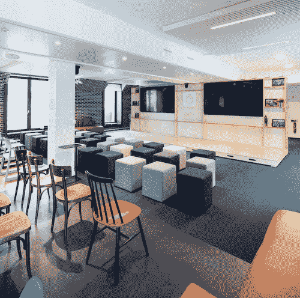

# 一年的展示和讲述

> 原文：<https://www.algolia.com/blog/algolia/one-year-of-show-tell/>

当我加入 Algolia 时，我们 25 岁。我们开了一个全公司的周会，会上每个人都可以畅所欲言，分享他们这一周所做的事情。沟通很顺畅，每个人都知道其他人在做什么。

四年后，我们是 350 人。即使在工程团队中，在团队成员之间共享知识也变得越来越困难。在 Algolia，我们坚信公司发展的最佳方式是相互学习。因此，我们需要能够主动分享知识。这就是为什么一年多前，我们开始了每周一次的知识分享会“Show & Tell”。在 Show & Tell 期间，人们会在舞台上当着同事的面就一个与 Algolia 相关的话题做现场演示。让我们深入了解这项活动的第一年。

## 为什么

在详细介绍如何展示和讲述之前，让我们看看为什么我们决定创建这个活动。当然，知识共享是我们公司成功的关键，这也是我们想这么做的主要原因。但这不是唯一的一个。阿尔戈利亚的人口呈指数增长。当我们开始做 Show & Tell 的时候，我们有 150 名员工；一年多后的今天，我们已经 350 岁了。这使得认识和认识每个人变得更加困难。在公司面前演讲是让自己出名的绝佳方式！

一个积极的副作用是，人们开始认为你是某个特定主题的专家。这可以让你在公司内分享技能，让人们知道如果他们对某项技术或某个话题有疑问，可以找你。

阿尔戈利亚重视公众演讲技巧；它为任何想要的员工提供为期两天的公开演讲研讨会。Show & Tell 为我们提供了一个将这个研讨会付诸实践的机会，帮助我们在一个安全的环境中磨练公共演讲技能，在这个环境中，我们只在同事面前演讲。

## 如何

为了提供这个安全的机会来互相了解和练习公开演讲技巧，我们需要确保活动组织得很好。

从一开始，我们就决定采用每周 30 分钟的形式。这段时间足够短，不会影响日常工作，也足够做两到三次演示。我们决定把它安排在“欢乐时光”之前，这是一个不太正式的每周一次的相互认识活动，在这个活动中，我们和同事们一起度过了一段轻松的时光。因为我们跨越 5 个时区，有 10 个小时的时差，所以我们希望它发生在大多数员工的办公时间。因此，我们决定采用格林威治时间下午 4:30，这是旧金山工作日的开始，亚特兰大和纽约工作日的中间，伦敦、巴黎、里昂、南特和布拉格工作日的结束。我们想让每个人都能轻松参加。

我们从小处着手。开始时，有三个报告，每个 10 分钟。发言者被分配了时间，只有几天时间准备。我们很快意识到，当你添加问题和答案时，30 分钟的演示很容易变成 45 分钟。

在这一年中，我们学习并改进了活动的组织。让我们来看看我们的“展示和讲述”活动的实际解剖，S&T 为那些知道。

## 解剖展示&告诉

S&T 的组织分为四个部分:

1.挑题目
2。准备晚会
3。运行显示
4。展后跟进

### 挑选话题

在展示任何东西之前，我们需要选择主题。从一开始，我们就决定只选择与 Algolia 相关的主题，比如为 Algolia 做的项目、新功能、新工具，或者在公司外部进行的演示排练。我们现在选择两个主题，而不是三个。唯一的限制是 10 分钟，以便每个发言者有足够的时间回答问题。

我们还鼓励新员工谈论他们的入职项目，我们包括由我们的营销、销售和招聘同事进行的非技术性谈话。

我们现在提前一个月选择主题，给演讲者时间准备。这使我们能够更容易地取代最后一分钟取消，这种情况在 120 多个演示文稿中只出现过两次。

### 准备晚上

为了进一步防止最后一刻取消，我们会在演讲前两周通知演讲者。一周前，我们会发一份幻灯片模板，上面有一些计划的想法。这并不是强制性的，但它通常有助于演讲者组织他们的演讲。

我们还鼓励演讲者排练，为他们提供时间，让他们可以在展示和讲述团队面前排练。这样他们可以提前得到反馈，提高他们的幻灯片和公开演讲技巧。

我们是大 Slack 用户；在 S&T 会议前几个小时，我们会在#algolia 频道上发送一条提醒，告诉员工当天的日程安排，这样员工就可以决定他们是否要参加。

### 跑步秀

在实际活动开始前几分钟，我们会准备好演讲的房间。我们还为整个公司进行实时直播，这需要一点准备。我们录制现场直播，以便那些无法参加的人可以稍后观看。

每周我们都有一位主持仪式的主持人来主持 S&T。他们的职责是开始表演，介绍演讲者，结束会议，并介绍下周的演讲者。

### 展后跟进

活动结束后的第二天，我们将录音和幻灯片放在我们的内部学习平台上，任何人都可以访问之前的演示。我们还会向整个公司发送一封电子邮件，其中包含学习平台的链接以及下周的时间表。

## 招数&招数

在组织这样一个活动的这一年里，我们从战壕里学到了一些窍门。

最重要的是表扬演讲者，他们每周在全公司面前提出一个主题。没有他们的奉献，这次活动就不会有任何意义。演讲者很少自己站出来提出话题；他们大多认为自己“没什么可分享的”，或者说“不会有意思”。因此，重要的是确定谁能说话，然后主动推动他们，只是一点点，以说服他们说话。这就是为什么有必要从技术领导和经理那里获取信息，因为他们对哪些主题是流行的，以及谁能最好地代表他们的团队有更好的看法。此外，关注公司发生的事情可以帮助我们找到发言人。我们保留了一份发言人的名单，这样我们就可以从从未发言的人那里找到话题。积压一些潜在的演示文稿也有助于填补空缺。

我们很幸运有一个很大的房间来做报告，里面有所有的设备让它工作；然而，我们中的一些人已经在更小的公司组织了这种活动，资源更少。要点是按照你自己的规模来做——你甚至可以利用休息室，以不同的节奏来做，等等。

最后但同样重要的是，征求反馈！我们每六个月做一次，每次我们都能获得有价值的信息来改进。例如，这促使我们将 S&T 提前了 30 分钟，以便更多的人能够参加。

我们今年继续 S&T。目前，我们保持相同的格式，但会进行更多的实验。我们已经做了闪电谈话，这是一个关于一个专门主题的特别会议，有四个较短的陈述(5 分钟)。我们收到了很好的反馈。人们说它更有活力，需要演讲者更少的准备，所以我们将再次这样做！

到目前为止，我们只进行了大约 5%的非技术性会谈；我们将在 2019 年达到至少 10%。

在这一年的展示和讲述中，我们有 70 位演讲者做了 120 场不同的演讲，主题包括“C++中的低级性能”、“如何组织营销活动？”“技术招聘人员的日常工作是什么？”，以及“如何写出更好的 PHP”。我非常自豪地看到我们的演讲者的奉献精神，我同样致力于无限期地庆祝他们！