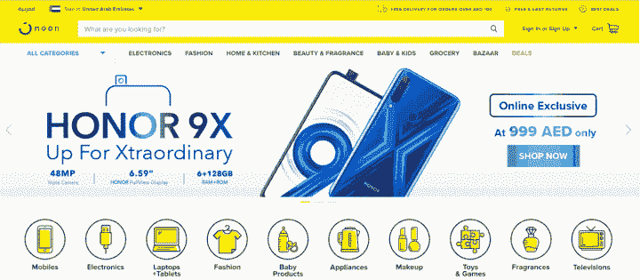

# 如何优化你的电子商务网站搜索

> 原文：<https://www.algolia.com/blog/ecommerce/optimize-ecommerce-site-search/>

许多企业将网站搜索视为 UX 清单上的一个复选框。但是，随着收购比以往任何时候都难，客户的期望比以往任何时候都高，没有充分利用网站搜索能力的公司正在错失良机。

网站搜索可以成为一种无价的商业工具，能够推动销售、转化和积极的用户体验。然而，这一切都依赖于智能配置您的网站搜索。通过仔细考虑您的电子商务网站搜索策略并遵循某些网站搜索最佳实践，您可以将您的搜索转化为竞争优势。

****

## 站点搜索的重要性

网站搜索到底有多大价值？在一些网站上，虽然只有不到 10%的用户进行搜索，但这些搜索者却占了总收入的大约 40%。尽管如此，许多电子商务网站没有投入资源来优化他们的电子商务网站搜索。

这些网站都遗漏了 [网站搜索](https://blog.algolia.com/what-is-site-search/) 的重要好处，包括:

*   快速、恰当地将顾客与他们的需求联系起来
*   改进的用户体验
*   跳出率降低
*   更高的转化率
*   让用户更好地了解产品、服务或内容
*   有价值的 [分析数据](https://blog.algolia.com/internal-site-search-analysis/) 帮助商家了解客户并优化结果
*   高级销售功能
*   优化使 [移动搜索](https://blog.algolia.com/mobile-search-ux-part-three-seach-results-display/) 更容易
*   强大的 A/B 测试，确保结果尽可能相关

此外，网站搜索功能，如推广横幅、推荐商品、过滤器和方面，推动内容和产品的发现。这使得用户可以在你的网站上接触到他们以前不知道的相关产品和内容，创造出无与伦比的体验，让客户不断回来。

## 如何让你的电子商务网站搜索有效

如果你的网站负担着基本的电子商务网站搜索，你就错过了收入和新客户。这些电子商务网站搜索的最佳实践可以大大提升网站搜索的设计。

### 1。过滤结果

为用户提供过滤搜索结果的选择以快速找到他们需要的内容或产品非常重要。提供根据品牌、颜色、价格、大小等缩小结果范围的过滤器和方面是实现这一点的有效方法。

自动过滤是另一项功能，可以帮助用户更快地找到他们需要的东西。当用户搜索时，它会根据用户查询中的某些线索自动删除潜在的结果。这允许通过分解和解释他们的查询的语义而不是执行简单的文本匹配来更好地匹配用户的意图。例如，如果用户搜索“红色烤面包机”，系统应该返回与描述最匹配的结果，而不仅仅是描述中带有单词“红色”的产品。

### 2。使用自动完成功能

智能自动完成，又称 [查询建议](https://www.algolia.com/doc/guides/building-search-ui/ui-and-ux-patterns/query-suggestions/js/) ，是一款功能强大的 UI 工具。当用户键入查询时，会出现更流行和/或特定查询的预测下拉列表。这可能有几个积极的影响，包括:

*   减少客户的输入(减少他们中途放弃网站搜索的机会)
*   指导客户微调他们的查询，尤其是更长、更精确的查询，或者他们正在尝试使用术语。这在移动设备上尤其重要，因为用户的注意力持续时间更短。
*   让客户更快获得结果，减少试错。

如果搜索引擎是响应性的和相关的，自动完成可以提供“对话”体验。当用户键入查询时，就好像他们正在与搜索栏进行讨论，帮助搜索引擎确定如何最好地返回结果。为了有效地做到这一点，这些预测应该是 [容忍错别字和语法错误](https://www.algolia.com/doc/guides/managing-results/optimize-search-results/typo-tolerance/) 以确保最佳结果。

### 3。优化面包屑

面包屑可以帮助用户导航找到他们正在寻找的产品，而无需重新搜索。例如，类别的可视化层次结构可以让用户调整搜索的粒度。

****

### 4。使用联合搜索界面

一个 [联合搜索界面](https://blog.algolia.com/federated-search-types/) 为访问者提供了一种最直观、最无缝的方式来查看整个网站的产品和内容。可以对联合搜索进行配置，以便将产品、教程、视频、资源页面和博客等各种各样的内容绘制到单个结果页面中。页面上的结果可以被配置为根据重要性和与用户原始查询的相关性来区分优先级。这是一个很好的方法，可以让客户熟悉你的网站的各种产品，而不需要他们去钻研你的网站地图或子域。

### 5。个性化结果

随着谷歌变得越来越个性化，客户越来越习惯于在网上搜索的个性化结果。虽然谷歌使用过去的搜索历史和位置等信息，但电子商务网站可以根据用户的在线行为对结果进行个性化，并将用户的个人资料纳入排名策略。这使得企业能够利用客户的需求和偏好来提供高度相关和上下文相关的搜索结果。

动态影响顾客所看到的内容，增加了顾客搜索和发现与其最相关的一系列产品的可能性。最终结果？KPI 的增长，如客户购买频率、平均购物车大小、转化率和收入。

****

### 6。优化结果

最终，您的电子商务搜索平台应该根据业务和客户的需求进行动态调整。一个 [健壮的电子商务网站搜索平台](https://blog.algolia.com/advanced-search-experience-for-e-commerce/) 可以提供多种工具来驱动优化，包括:

#### **网站搜索分析**

每次客户与他们的搜索互动时，他们都会为你的网站产生有价值的商业数据。分析网站搜索数据有助于你识别受欢迎的产品，表现不佳的产品，以及用户寻找你不提供的东西的差距。网站搜索数据还显示了返回“无结果”的搜索，这让你有机会用相关产品和内容来填补这一空白(或者将用户引向他们可能喜欢的相关产品)。

#### **电子商务销售工具**

网上销售和实体店一样重要。通过优化产品展示和向客户推荐的方式，您可以引导客户完成购买之旅，并优化您的在线销售和/或转化率。

有了一个很棒的网站搜索工具，你可以调整特定产品领域或搜索的排名标准，将客户引向正确的方向。例如，您可以突出显示特定品牌，针对特定查询推广商品组，开展营销活动以促进与供应商的合作关系，优化特定查询(如热门查询)的结果，微调您在每个国家的销售策略，等等。

#### **A/B 测试**

当你改进和增强你的网站搜索时，衡量这些变化的影响是至关重要的。 [A/B](https://www.optimizely.com/optimization-glossary/ab-testing/) 测试提供了有价值的洞察，让你了解搜索改进实际上如何影响你网站上的客户。测试不同的排名标准或产品植入想法有助于电子商务网站所有者了解哪些搜索是最好的结果，哪些搜索表现不佳，并相应地进行调整。所有这些测试都应该完成，如果最新的策略效果不佳，搜索服务提供商可以在不损害整个网站的情况下完成。

## 电子商务搜索栏最佳实践

很明显，网站搜索会对客户体验和企业底线产生巨大影响。下一个合乎逻辑的问题是，你如何鼓励更多的用户与搜索互动？

有很多方法可以改善 [UX 和站点搜索的整体设计](https://blog.algolia.com/how-algolia-helped-improve-ux/) 来带动更多的利用率和转化率:

*   **使用不同的颜色** 。使用与网站标准配色方案形成对比的颜色来勾勒搜索框，以快速吸引眼球，并将其与页面的其他方面区分开来。
*   **尝试不同的字体** 。与颜色对比类似，可以在搜索框中使用不同的字体来增加额外的对比。
*   **有搜索图标** 。使用常见的搜索相关图标，如放大镜，帮助用户快速轻松地识别搜索。
*   **让**容易找到。通过将搜索框放在页面上方的显著位置，客户更有可能以搜索开始他们的旅程。
*   **使用 microcopy** 。默认或推荐的搜索词有助于推动客户尝试搜索。现有客户的常见搜索查询很适合这种情况。
*   **使搜索即时自动** 。搜索结果、过滤器、自动完成和面包屑都应该在用户输入时自动显示，以减少混淆，增加点击搜索结果的可能性。

****

## 选择电子商务网站解决方案

[为你的电子商务网站选择合适的解决方案](https://blog.algolia.com/choosing-ecommerce-site-search/) 非常重要。当您评估电子商务网站搜索工具时，有两个主要途径可以考虑:自己构建工具或从第三方提供商那里购买。

这两种方法都有一些取舍

### 自己打造

许多拥有经验丰富的大型工程团队的公司都被构建自己的网站搜索工具的想法所吸引。构建自己的搜索基础设施消除了购买预打包解决方案的成本，并且您可以随心所欲地定制自己的内部工具。这对于具有非标准工作流程、排名标准或商业模式的电子商务网站尤其有吸引力。

然而，当你构建自己的工具时，有一些隐性成本需要考虑。开发人员投入时间和资源从头开始构建该工具仅仅是个开始。对搜索工具有持续的维护和开发需求，并且这些需求随着站点的扩展和发展而增长。

此外，你通常需要一个有丰富搜索经验的开发人员(或团队)来开发一个真正健壮、快速、强大的搜索引擎。一些强大的工程师当然可以在开源搜索引擎的基础上构建一个 MVP 搜索产品，但一个具有复杂功能(即动态过滤、联合搜索、高级商品选项)的高质量搜索工具需要一个专业团队。如果开发团队的关键成员离开了组织，让一个新的开发人员熟悉您的内部工具要比使用提供详细文档和支持的第三方工具花费更多的时间。

最后，建筑会造成瓶颈。如果业务团队需要对搜索工具进行调整以满足业务需求，他们必须依赖并等待工程师，从而导致效率低下。因此，例如，跟单商不能独立地调整和调整他们商店中的产品定位。

### 购买第三方搜索工具

没有具备搜索经验的大型开发团队的公司，或者希望将他们的开发团队用于其他优先事项的公司，通常会选择第三方搜索解决方案。不同类型的电子商务用例有各种各样的解决方案:小型零售商可能更喜欢即插即用的搜索工具，这些工具可以在几分钟内提供基本功能，而大型零售商可能对具有高级分析功能的可定制、高可用性工具更感兴趣。

刚开始时，成本似乎是第三方解决方案的劣势，因为它们通常需要支付经常性订阅费用。然而，许多解决方案都是现成的，实施只需几周时间。这防止了潜在的停机时间和客户的麻烦。然而，所有第三方解决方案并不相同。大多数现成的解决方案缺乏可定制性，并且在功能集方面受到限制。

搜索即服务解决方案恰到好处地实现了最大的可定制性和快速实施。由第三方托管，所有的开发、维护和创新成本都外包给了搜索提供商。新功能不断开发，不断为电子商务网站所有者提供新的工具和机会，第三方提供商可以随着业务的增长而扩展。

使用第三方解决方案的主要优势是所有行业标准的最佳实践都已经实施并定期更新。公司可以专注于实现他们的核心业务逻辑，而把部署工作留给其他人，而不是投入大量时间研究围绕搜索功能和 UX 的消费者行为。

### 你在电子商务网站搜索的伙伴

Algolia 与各种规模的电子商务品牌密切合作，帮助改进网站搜索以满足业务目标。关于如何改善电子商务网站搜索体验的更多信息，请下载我们的免费电子书， [框外搜索](https://go.algolia.com/search-beyond-the-box) 。