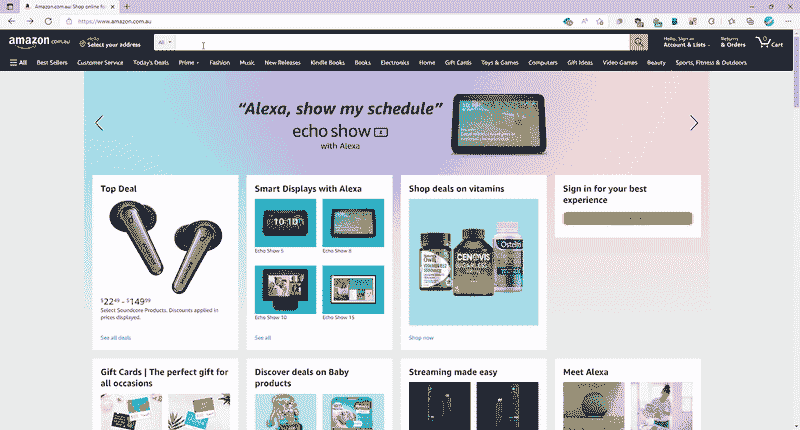
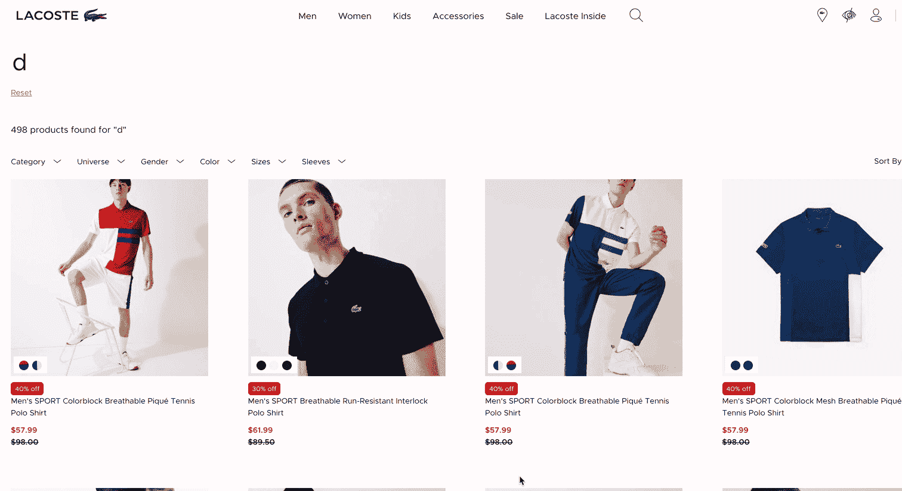
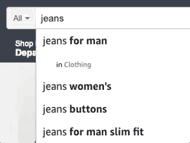

# 预测搜索、自动完成、建议查询和 AI

> 原文：<https://www.algolia.com/blog/ai/predictive-search-and-autocomplete/>

在过去的十年里，人工智能和预测性搜索在许多领域让我们的生活变得更容易、更快捷。预测击键、单词、产品和短语是人工智能取得成功的领域之一。在许多电子商务和媒体网站的引擎盖下，你会发现高端人工智能技术，这些技术通过先进的 [自然语言处理](https://www.algolia.com/blog/product/what-is-natural-language-understanding-and-how-is-it-different-from-nlp/) 来提高销售额。NLP 背后理解用户查询和预测最佳搜索结果的科学通过机器学习成为可能。今天，谷歌使用 [BERT](https://blog.google/products/search/search-language-understanding-bert/) ，这有助于返回用户以前没有键入的有意义的查询结果，无论他们如何拼写或组合查询中的单词。

*预测性搜索* 特指一种有用的用户体验(UX)工具，根据用户类型建议查询。查询建议帮助人们制定最佳查询，以找到他们正在寻找的产品。在本文中，您将全面了解预测性搜索的工作原理、预测性搜索的常见陷阱、如何避免这些陷阱，以及实现常见预测性搜索体验的好处和最佳实践——即， [、自动完成](https://www.algolia.com/developers/implement-search-autocomplete/) 。

# 什么是预测性搜索？

我们大多数人都经历过自动完成的奇妙世界，你在搜索引擎中键入你要找的东西的前几个字母，然后从下拉列表中点击一个搜索建议，但有很多后台操作使这成为可能。预测搜索的核心功能是能够从建议列表中进行选择，而不必在搜索框中键入完整的术语。

Google 制定了标准，由 [首先组织](https://www.theatlantic.com/technology/archive/2013/08/how-googles-autocomplete-was-created-invented-born/278991/) 来实现自动完成功能。很快，用户开始期待预测性搜索。亚马逊、Shopify、Spotify 和沃尔玛等网站和应用程序已经实现了预测搜索功能，可以显示热门查询、提供上下文建议、避免打字错误，并根据用户的位置或偏好过滤建议。今天，大大小小的组织都提供某种形式的自动完成功能。

# 预测搜索是如何工作的？

预测搜索技术试图根据终端用户的行为、以前的搜索、地理位置和其他属性来预测搜索词，以及跨所有用户会话的趋势搜索，并将搜索词显示为搜索字段中或下面的建议。自动完成、自动建议和预测搜索在科技行业中经常互换使用，尤其是在 UI/UX 部门。

搜索查询是用户在页面的搜索栏中键入的术语。预测搜索在用户键入时分析搜索查询的每个字母，并在用户完成键入之前在下拉菜单中提供一组建议的查询。这些建议是由一系列算法产生的。使用多种机器学习和自然语言处理算法和模型来生成匹配，从简单的字符串开始，以便识别、匹配和预测未完成的搜索查询的结果。

这些建议有助于用户以更少的输入更快地获得结果，这有助于防止输入错误并创建将返回所需结果的查询。这些建议背后的算法从静态列表或现有数据的简单字符串匹配开始，通过使用自然语言处理来管理错别字和同义词以帮助用户获得所需的结果，变得越来越复杂。

## 预测搜索——部分 UI/UX 基础

这里有一些使用自动完成搜索创建良好用户体验的最佳实践:

*   **激活时添加视觉焦点** :确保搜索栏和自动完成建议在使用时聚焦。你可以在上面的视频中看到它是如何工作的——注意当搜索栏被选中时，页面的其余部分是如何变暗的。尤其是在较小的移动设备上，减少显示在搜索栏旁边的图标、快捷方式或菜单项，以帮助减少屏幕上的视觉干扰。
*   **对建议使用文本换行** :如果建议包含冗长的文本，避免使用水平滚动条。确保冗长的关键字和术语足够易读，但限制在一个屏幕上。如有必要，使用文本换行并允许建议跨多行传播，尤其是在移动设备上。
*   避免滚动条:确保建议不会隐藏在屏幕上是很重要的。这意味着尽可能避免滚动条。滚动条增加了用户搜索的时间，使他们更有可能放弃搜索，并使他们更难找到他们想要的内容。
*   **提供列表可滚动的视觉提示** :有时候不使用滚动条是不可能的。在这种情况下，给出足够的提示和指示，很明显列表是可滚动的。
*   **轻松移除查询** :为用户提供清晰的可视图标和选项，以清除搜索栏和自动完成建议。最广泛使用的指示器是“X”图标，提供该图标是为了帮助用户移除搜索查询。这种设计解决方案极大地改善了整体用户体验。
*   **优化建议** :自动完成建议的部分吸引力在于更快的结果，这些结果应该实时显示，如下所示。用户一输入第一个字符，建议就应该出现，并且应该随着每个添加到查询中的字符而更新。错别字和其他错误应该被过滤，以便返回相关的建议。
*   **限制列出的选项数量**:限制用户查询时显示的建议数量很重要。太多的建议会导致不相关的结果和分散用户的注意力。最佳做法是将建议控制在 10 项或更少。

## 即时搜索

即时搜索是预测搜索的近亲。当用户输入一个查询时，结果会近乎实时地显示出来。即时搜索是每击一次键就执行一次新的搜索，通过可视化地推动发现来改善搜索体验。视觉网站，比如有产品照片的电子商务网站，确实可以受益，因为即时搜索可以让 买家更快地浏览 结果。

即时搜索可以建立在 自动完成 或其他预测搜索技术的基础上，但在 Algolia， 我们采用了一种 [不同的方法](https://www.algolia.com/blog/engineering/inside-the-algolia-engine-part-3-query-processing/) ，使用基数树(也称为基数尝试或压缩尝试…下文将详细介绍)，这是一种已经排序的数据结构，适用于。

## 用前缀搜索处理错别字

基数树还用于其他用途:前缀搜索。前缀搜索帮助我们在某人键入每个字符时检索结果；它使用术语的开头开始文档排序和匹配。如果输入“t”，前缀搜索将 检索 为“吐司”或“烤面包机”的结果；引擎必须知道这两个术语都包含前缀“t”。

这种方法还有助于替换拼写(例如，“gray”或“grey”)和拼写错误(用“iphxne”代替“iphone”)。也被称为错别字容忍，它允许用户在键入时犯错误，但仍然可以找到他们正在寻找的记录。这种预测匹配适用于在拼写上 *接近* 的单词，即键入的单词与其在索引中完全匹配的单词在拼写上的差异。完美匹配是距离= 0。当存在完全匹配，或者距离较低(一个或两个字母键入错误)时，则进行匹配，并将记录添加到结果中。

计算速度极快，往往比更复杂的人工智能模型还要快。如果你熟悉 [矢量搜索](https://www.algolia.com/blog/ai/what-is-vector-search/) ，你知道它也可以帮助处理错别字。虽然向量可能包含拼写错误的嵌入，并提供一定程度的错别字容限，但 radix 树可以动态计算前缀。对于这个用例，关键字搜索实际上比矢量搜索快得多，并且可以处理更多的拼写错误。它可以帮助某人找到带有“aplp”前缀的苹果设备。

## 复杂自动完成 UI 的最佳实践/UX

预测性搜索结果不仅受匹配字符串的影响，还受热门搜索和输入机器学习算法的用户数据的影响。这些算法不断从用户行为中学习，提高了预测用户搜索内容和相关结果的准确性。

不管用于实现预测搜索的算法如何，搜索建议的相关性、结构和设计对于用户交互和整体用户体验都是至关重要的。拥有一个设计良好的预测性搜索来提供相关的和响应性的搜索建议是至关重要的。以下是一些更好的实践:

*   **使用排名来确定显示顺序** :有许多因素会影响所提供建议的排名。一般来说，与用户的位置、语言、最近的搜索历史、以前的订单历史、热门搜索和正在进行的促销相关的查询应该排名较高。例如，如果临近假期，与该假期相关的建议应该排名更高，以确保它们显示在建议下拉列表的前几个选项中。
*   **对不同类型的建议采用不同的风格** :在某些情况下，可能会有包含产品和类别的搜索结果和建议。在这些情况下，确保不同类别的建议有明确的区别。文本可以有不同的样式，或者不同的颜色可以用于不同类型的建议。
*   **高亮显示潜在结果** :当显示大量建议时，确保高亮显示用户在自动完成建议中提供的搜索词的潜在结果。这有助于用户确定差异并更快地做出决定。例如，如果用户输入了“cou ”,您可能想要显示不同的潜在结果，比如沙发、工作台面和柜台。
*   **个性化自动完成建议**:根据用户的位置、语言和搜索历史考虑查询，以便[个性化结果](https://www.algolia.com/products/search-and-discovery/personalization/)。如果位于奥斯陆或多伦多等寒冷地区的用户在 12 月搜索“鞋”，则呈现给他们的建议应该对那些地方的人有用:靴子或保暖鞋，而不是织物运动鞋或凉鞋。

## 预测搜索的好处

那么，为什么要花时间实施预测性搜索呢？商业价值是什么？预测搜索 [通过提供有用的自动建议，提高转化率](https://www.thecommerceshop.com/blog/top-5-predictive-search-functionalities-for-cro/) 并为用户在搜索商品时节省时间。这是一个重要的功能，当从一个有着紧凑键盘的手机上购物时。应用程序中的预测搜索功能减少了用户的摩擦，使他们不太可能放弃搜索。

以下是使用预测搜索的一些好处:

*   它通过提供建议来减少搜索时间，这意味着用户很少需要输入整个查询
*   预测搜索提供更加个性化的体验，根据用户之前的查询、位置和偏好类别提供信息
*   它向用户介绍你的网站和产品，并通过提供某些产品的相关图片和描述来帮助用户找到他们想要的东西
*   它通过向用户展示基于热门搜索和畅销产品的合适且有用的建议来增加销售额
*   通过以更优化的方式提供内容，它增加并改善了整体用户体验
*   增加相关查询的数量，并提供优化的结果

预测搜索有助于避免由打字错误和错误引起的混乱，并通过过滤数据提供更快的结果。

## 结论

预测搜索提供了许多优势，包括提高转化率和更好的客户体验，并且是许多企业成功的关键因素。使用本文中描述的最佳实践将帮助您确保您的站点搜索像您一样努力工作。