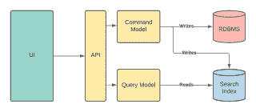
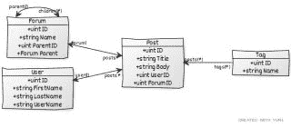
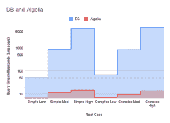
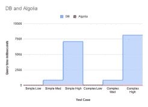

# 使用 CQRS 数据存储优化查询，响应速度提高 500 倍

> 原文：<https://www.algolia.com/blog/engineering/query-optimize-with-500x-faster-response-times-using-a-cqrs-data-store/>

软件架构是个难题，可伸缩的软件架构更难。我们都希望生活在这样一个世界里，规模问题不会悄悄进入我们的代码，可以被控制在基础设施的范围内，而且在一定程度上可以。但是最终作为开发人员，我们不得不考虑这些问题，并找到创造性的架构方法来解决它们。

在这篇文章中，我想关注的问题是查询响应时间。这是一个问题，许多团队只是接受了一个痛苦的现实，即不断增长的数据库和日益复杂的查询驱动着丰富的 UI 功能。实际上，这是一个可解决的问题，并且可以使用现有的架构模式优雅地完成；CQRS。

例如，我们将创建一个名为“SlackerNews”的虚拟用户论坛。我们将用自动生成的帖子数据填充它，并对一些常见的查询进行基准测试，然后看看如何使用 Algolia 搜索索引来替换一些最繁重的查询，以展示我们如何既能提高搜索 UX，又能全面降低数据库负载和成本。

## [](#introducing-cqrs)介绍 CQRS？

[命令查询责任分离](https://martinfowler.com/bliki/CQRS.html)是一种数据建模和系统设计模式，基本上就是说，你可以使用不同的模型来写数据，而不是读数据。您可以写入一个数据库，然后将该数据的一个版本复制到一个单独的不同类型的数据存储系统中，并使用它来执行查询，而不是读取和写入同一个数据库模型。通常，第二个数据存储存储的是数据的非规范化版本，它比关系数据库的读取性能更好。



CQRS 会增加系统的复杂性，但是，如果处理得当，并战略性地用于正确的读取类型，好处是巨大的。我们将研究如何将 CQRS 应用到论坛数据库中，以显著提高文本搜索查询响应时间，改善 UX，并降低您的真实来源数据库的负载。

您将熟悉这种模式，因为我们通常是如何设计对象存储的。一般来说，我们不会在数据库中存储大型二进制文件，如图像、音乐或视频，而是选择将它们放在对象存储介质中，这样存储数据的成本更低，对主数据库的影响也最小。这里唯一的区别是，我们将数据存储在关系数据库和搜索索引中，并将关系数据库视为事实的来源。

## [](#building-the-slackernews-database)构建懒人新闻数据库

在开始查询基准测试和优化之前，我们必须在数据库中生成一些虚拟数据。对于这个例子，我将使用 PostgreSQL 作为数据库，因为它是当今使用的性能最好和最流行的 RDBMS 之一，还因为它具有一些很棒的开箱即用的文本搜索优化特性。

该项目分为两部分:

1.数据生成
2。查询基准测试

这两者都可以在这个[查询性能 GitLab 项目](https://gitlab.com/daniel-parker/algolia-blog/query-performance)中找到。

## [](#data-model)数据模型

这是我们正在构建的非常简化的论坛数据库的类图。应该比较好理解。我们的主要问题是:

1.论坛可以通过`ParentID`外键
2 拥有子论坛。标签和帖子有多对多的关系，我们通过使用桥接表 PostTag
3 来实现这种关系。通过一个递归查询(我们将在后面展示),我们可以获取任何给定父论坛下的所有子论坛中的所有帖子。



## [](#data-generation)数据生成

目标是生成 100 万条记录，这些记录将使用代表上述数据模型的表和关系以标准化格式保存到 Postgres 中。相同的数据也将被反规格化并发送到 Algolia 索引。

为了生成数据本身，我们将使用来自 HackerNews 的一些样本帖子，然后使用马尔可夫链从样本数据中生成全新的随机帖子。这个代码可以在这个[数据生成器 GitLab 项目](https://gitlab.com/daniel-parker/algolia-blog/query-performance/-/tree/master/data-generator)中找到。

## [](#query-benchmarking)查询标杆

为了测试 Postgres 数据库和 Algolia 索引的性能，我编写了两个 AWS Lambda 函数；*指挥*，和*转轮。*

orchestrator 获取一些关于我们的测试场景的信息，并使用扇出模式将执行委托给运行者。runner 将获取一批查询，并针对数据库或 Algolia 索引执行它们。每个运行程序将计算其批处理的平均查询时间，并将其返回给 orchestrator。orchestrator 将从运行程序收集所有平均值，并计算该基准的总平均查询执行时间。

使用以下参数调用 orchestrator:

–批次大小
–总批次
–流道类型(DB 或 Algolia)
–复杂性(简单或复杂)

### [](#benchmarking)标杆

我们希望确保我们对两个数据存储都是公平的，并发挥它们的优势，因此我们将做一些事情来确保这一点。对于 Postgres 数据库，我们将使用 Amazon RDS Aurora postgresql 以及一个主实例和一个读取副本实例，两者都使用 db.r5.xlarge 实例类型(4 个 vCPU，32GB 内存)。

在数据库中创建记录时，我们还为每篇文章的正文预先计算一个 [tsvector](https://www.postgresql.org/docs/9.4/datatype-textsearch.html) (文本搜索向量)，并将其保存在数据库记录中，然后在我们的 **WHERE** 子句中使用 [tsquery](https://www.postgresql.org/docs/9.1/datatype-textsearch.html#DATATYPE-TSQUERY) 在记录中搜索特定的文本标记。我们还创建了一个 [gin 索引](https://www.postgresql.org/docs/9.5/gin-intro.html)来提高文本搜索的效率。

在 Algolia 方面，我们也将大多数相关信息反规范化到索引记录中。例如，我们将在父论坛中搜索所有子论坛中匹配搜索文本的所有帖子，因此对于索引中的每个帖子记录，我们还将所有父论坛 id 添加到`_tags`属性中。我们还将把实际的论坛标签添加到`_tags`属性中。

### [](#the-queries)查询

我们创建两个查询，一个简单，一个复杂。这个简单的查询不使用任何连接，只是在文章主体上进行文本搜索。

在每个复杂的查询中，我们随机选择一个我们想要过滤的论坛。有更多子论坛的论坛搜索起来会慢一点，但是我们会多次运行，以获得每种方法的平均查询响应时间。

**简单查询**

```
select * from posts
where body_tokens @@ to_tsquery(‘git’)
order by created_at desc
limit 100

```

**复杂查询**

```
with recursive subforums as (
select
id,
name,
parent_id
from forums
where ID = @id
union
select
f.id,
f.name,
f.parent_id
from forums f
inner join subforums sf on sf.ID = f.parent_id
)
select p.*
from subforums sf
join posts p on p.forum_id = sf.id
where p.body_tokens @@ to_tsquery(‘git’)
order by p.created_at desc
limit 100

```

由于搜索的本质和 Algolia 的 SDK，这些查询的 Algolia 搜索版本要简单得多

**简单搜索**

```
params = []interface{}{
opt.HitsPerPage(100),
}

postIndex.Search(“git”, params)

```

**复杂搜索**

```
params = []interface{}{
opt.TagFilter(fmt.Sprintf(“%v”, (*forums)[forumToUse].ID)),
opt.HitsPerPage(100),
}

postIndex.Search(“git”, params)

```

## [](#test-plan-results)测试计划&结果

在此表中，您可以看到每个基准和 orchestrator 函数的 4 个参数。平均查询时间是从 10 次运行中取前 3 个结果建立的。这种方法的原因是 Postgres 数据库和 Algolia 搜索在任何给定查询的第一次运行时偶尔会抛出异常结果(较长的响应时间),但之后会很快稳定下来并返回一致的结果。

这个图表向您展示了每个数据存储的每个测试的图表。我在 y 轴上使用了对数刻度来证明，随着并发性的增加，两个数据存储都会变慢。正如你所看到的，Postgres 数据库的响应时间迅速增加，而 Algolia 搜索并没有经历太多的减速。我还提供了一个没有对数刻度的图表版本，这样您就可以直观地看到响应时间的真正差异。

有趣的是，搜索的复杂性并没有对这些特定的基准产生任何影响，但是我怀疑这是因为在我们生成的数据中，论坛帖子、标签和用户的基数实际上非常低。如果我再次运行这些测试，我会生成数百或数千个测试，以从需要连接的行的增加中获得更真实的结果。



Layered results with Log scale for response time



Layered results with a linear scale for response time

在第二张图中，您可以看到，对于 Postgres，当并发性增加到 1000 时，我们会经历非常长的响应时间(大约 7.5 秒)，而 Algolia 可以轻松扩展到那个级别的搜索并发性，响应时间低了大约 15 毫秒(0.015 秒)。

如果有人愿意资助我在更大范围内运行这些基准测试，我会非常乐意。

## [](#takeaways)外卖

作为开发人员，我们在构建软件时对数据存储的选择有很大的决定权。当有意义时，我们可以而且应该采用 CQRS 模式，并且在存储和查询数据时跳出框框思考，特别是当我们的产品扩展以及客户更加频繁地访问我们的传统数据库时。通过这样做，我们可以极大地改善用户体验和与搜索我们的数据相关的底层数据库成本。将像 Algolia 这样的搜索数据商店整合到你的技术堆栈中的成本相对较低，因为它可以带来非凡的生活质量改善。

我希望这次对数据存储和查询的探索对我有所启发和帮助，我期待着阅读您对我的方法以及我在基准测试方法中可能遗漏的任何内容的反馈。