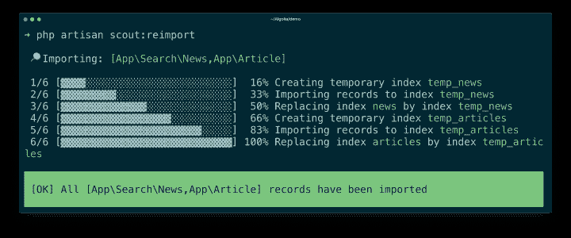
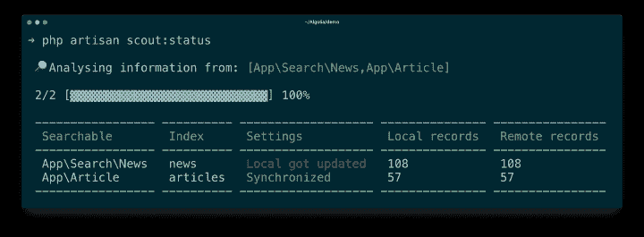

# scout Extended:Algolia 在 Laravel 的全部力量

> 原文：<https://www.algolia.com/blog/engineering/scout-extended-the-full-power-of-algolia-in-laravel/>

我们很高兴地宣布 Scout Extended 的发布——官方的 Algolia Laravel 集成。Scout Extended 建立在最新发布的 [Laravel Scout](https://laravel.com/docs/scout) 之上，让您可以利用 Scout 的所有强大功能，同时利用完整的 Algolia 搜索体验。

当 Laravel Scout 首次发布时，它提供了对 Algolia 搜索的即时访问。对许多人来说，这意味着简单地获得快速和允许输入错误的现成搜索。然而，Algolia 不仅仅是速度和打字错误的容忍度。和速度一样，还有相关性——让最佳匹配记录*总是*出现在你的结果的顶部。为了实现这一点，您需要设置一些基础。Scout Extended 让你可以通过 Laravel Artisan 命令直接访问这些和其他设置。

更容易配置 Algolia 只是我们在 Laravel Scout 上增加的扩展之一。另一个同样重要的特性是对聚合器的支持:现在你可以集中搜索，为你的整个网站创建一个单一的入口点。其他改进包括完全重建索引，无需用户停机，扩展搜索生成器，获得状态概述，以及许多其他功能。让我们进入一些细节。

如果你更喜欢观看而不是阅读，[这是我最近在 Scout Extended](https://www.youtube.com/watch?v=2Jy_4sL9Iug) 上做的一个演讲。

## 聚合器—一个索引中的多个模型

聚合器是一种在多个模型中实现站点范围搜索的干净方式。换句话说，它允许您在一个索引中拥有多个模型。

要创建新的聚合器，使用`scout:make-aggregator` Artisan 命令。该命令将在`app/Search`目录中创建新的聚合器类:

> PHP artisan scout:make-aggregator 新闻

在生成您的聚合器之后，您应该填充该类的`$models`属性，它将用于标识应该被聚合的模型:

聚合器是一个标准的`searchable`类，通常，您可以使用`search`方法或`raw`方法在聚合器上开始搜索:

要了解更多关于 Scout Extended 中聚合器的信息，请查看 [Scout Extended 文档](https://algolia.com/doc/framework-integration/laravel)。

## 零停机时间重新导入—轻松部署

有了 Scout Extended，在生产中导入数据变得轻而易举。要在重新导入数据时保持现有搜索体验可用，请使用`scout:reimport` Artisan 命令:

> php 工匠侦察兵:重新导入

该 Artisan 命令将输出以下内容:

为了确保在重建期间对索引执行的搜索不会被中断，Scout Extended 在将*临时*索引移动到*生产*索引之前，使用*临时*索引来导入所有记录。我们掩护你。

## 从 Laravel 内部配置 Algolia

您将从`scout:optimize` Artisan 命令开始，根据来自`searchable`类的信息优化搜索体验:

> php artisan scout:优化

这可能就足够了。`scout:optimize`会尽力生成您的`searchable`等级索引的设置，但您可能需要在`config/scout-articles.php`中编辑这些设置。例如，两个最重要的正确配置是可搜索属性和自定义排名:

一旦您验证了设置文件，您需要做的就是使用`scout:sync` Artisan 命令与 Algolia 同步设置:

> php 工匠童军:同步

您也可以使用 [Algolia 仪表盘](https://www.algolia.com/dashboard)编辑设置。然而，确保你在本地运行`scout:sync` Artisan 命令时应用这些设置。

## 一个改进的搜索生成器

Scout Extended 将 Laravel Scout 的搜索生成器推向了一个新的高度，增加了新的方法并改进了现有的方法。这里有一些例子。

`where`方法可以用来比较一个字段的值和另一个值。使用 Scout Extended，该方法共享 Laravel 查询构建器的相同 API，允许您通过比较或数字范围过滤结果:

支持的运算符有:`<, <=, =, !=, >=, >`。

`whereBetween`方法验证一个字段的值在两个值之间:

你可以用`whereIn`、`with`、`count`和`aroundLatLng`做同样的事情。前往[Scout Extended Documentation](https://www.algolia.com/doc/framework-integration/laravel/searching/server-side-search/?language=php#searching)了解更多这方面的信息。

## 状态概述

Scout Extended 为您的应用程序索引提供了一个漂亮的概览，允许您轻松地监控记录的数量以及其他关键指标。

使用`scout:status` Artisan 命令获得应用索引的概览:

> php 工匠童子军:状态

该 Artisan 命令将输出一个包含以下内容的表格:

## 还有更多！

Scout Extended 是 100%开源的，所以你可以自由地挖掘[源代码](https://github.com/algolia/scout-extended)，看看它到底是如何工作的。挖吧！访问 [Scout 扩展文档](https://algolia.com/doc/framework-integration/laravel)。

看到需要改进的地方？只需在 GitHub 上给我们发送一个 [pull 请求。](https://github.com/algolia/scout-extended)

谢谢，我们希望你喜欢这个新版本！