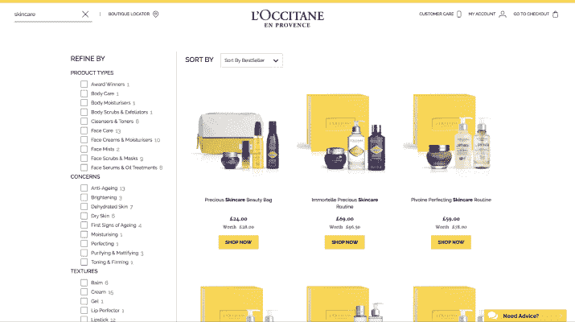
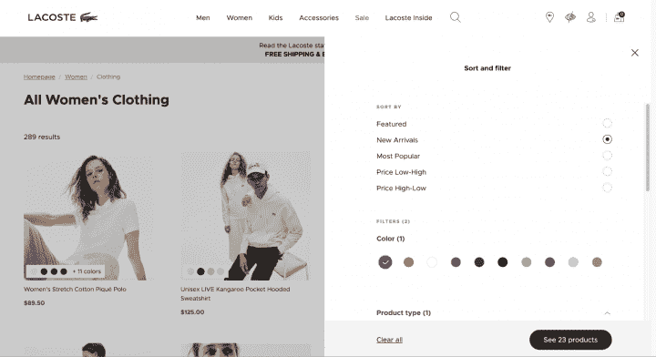
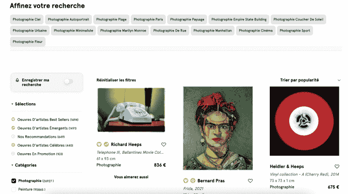

# 搜索过滤器:一个伟大的 UX 的 5 个最佳实践

> 原文：<https://www.algolia.com/blog/ux/search-filter-ux-best-practices/>

浏览一个有很多产品或内容可供选择的大型网站有两种不同的方式:如果简单，由于过滤器和方面，这是一种有益的体验，可以帮助用户联系广泛的内容。如果它很复杂、麻烦或令人困惑，那么这是一种痛苦的体验，会导致用户将目光投向别处。

电子商务和媒体领域的领导者，如亚马逊和网飞，意识到了他们网站上卓越的搜索和导航体验的力量。他们投入巨资，让庞大的目录易于(甚至令人愉快地)导航，让用户一路接触到有价值的新产品和内容。用户现在希望在他们访问的每个网站上都有快速、相关、可靠的搜索体验。

创建一个包含过滤器和方面的优秀搜索 UX 有助于保持你的用户满意，提高你的整体品牌形象，并推动你的网站 KPI。

## 为什么滤镜 UI 和 UX 很重要？

允许用户快速优化结果页面对于业务 KPI 和用户满意度都很重要:

### 为商家

拥有一个反应灵敏的过滤界面能让所有用户——无论是主动搜索者还是被动浏览者——快速有效地提炼他们的兴趣。它还允许更多的被动用户有效地浏览和找到他们可能不知道的内容和产品。这导致转换率和平均订单价值的增加。

### 为最终用户

一套好的 [滤镜和刻面](https://www.algolia.com/blog/ux/filters-vs-facets-in-site-search/) 也能确保改善用户体验。通过帮助用户轻松地深入到他们的需求，它消除了仅仅为了找到特定内容而进行大量搜索查询的需要。这提高了品牌忠诚度和客户保留率。

> 相关链接–
> 
> 1.  从 [Algolia 灵感库](https://www.algolia.com/search-inspiration-library/)中其他人如何建造他们的 UX 中获得灵感。
> 2.  深入挖掘 Algolia 文档中的[过滤、分面和排序结果。](https://www.algolia.com/doc/guides/managing-results/refine-results/filtering/)
> 3.  了解来自 Algolia 的所有[预建 UI 组件。](https://www.algolia.com/developers/search-ui/)

## 5 过滤 UI 最佳实践

这里有五个最佳实践，你可以实施它们来为你的用户和你的企业提供最好的服务:

## 1。选择正确的过滤器和小平面

一套全面的过滤器和方面将帮助用户更快地找到产品和内容。然而，太多不相关的选项会让他们困惑。您应该花时间仔细选择类别和值。你应该制作你的过滤器:

*   **与你的业务板块和用户相关。选择正确的过滤器和方面需要了解和研究你的用户、用例以及整个行业。**
*   **遵循常见的设计模式。** 选择应该有不同的粒度级别，但应该直观和有区别，以便所有不同类型的客户都能理解它们，并知道他们选择选项时会遇到什么情况。
*   **为您的用户组织的。** 过滤器值应按照流行度和/或重要性排序，以增加客户发现它们有用的可能性。
*   **范围不同** 。虽然一些方面将适用于不同的类别，但其他方面将更加具体。例如，在一个 [电子商务商店](https://www.algolia.com/blog/ecommerce/advanced-search-experience-for-e-commerce/) 上，所有产品都有价格，但衣服没有作者，书籍也没有瓦数。

 https://www . algolia . com/doc/guides/solutions/gallery/recommended-filters/

## 2。显示结果的数量

当显示未选择的搜索方面时，您应该显示每个选项的搜索结果计数，如果它们要应用于当前搜索查询的话。此外，这些计数应该在每次应用方面或过滤器时动态更新。例如，如果用户搜索“鞋子”，并且有“尺寸”和“颜色”方面，那么每个尺寸和颜色值应该显示有多少鞋子符合这些特定条件。然后，如果用户选择了蓝色的鞋子，尺码计数应该更新以显示每种尺码有多少双蓝色的鞋子。

通过在每次搜索更新时更新计数，您可以有效地向用户暗示哪条搜索路径是最短的。例如，如果客户正在寻找 10 码的蓝色鞋子，而系统有 100 双 10 码的鞋子，但只有 10 双蓝色鞋子，那么她通常可以通过首先单击后一个方面，然后简单地滚动到产品来找到她正在寻找的产品。通过让你的用户以更少的步骤更快地找到产品，他们更有可能停留在页面上并最终转化。

## 3。允许同时过滤和分类

对于大多数活跃用户来说，过滤器和方面可能足以让他们向下钻取以准确找到他们正在寻找的内容。然而，更多的被动用户或新用户可能想要探索更大的内容集合。排序是这一过程的重要组成部分，因此用户可以根据对他们最重要的因素对内容进行排序，并增加他们找到相关结果的机会。

例如，一位顾客可能想买 10 码的鞋子，但还不知道她要找的颜色或品牌。如果她对价格合理的鞋子更感兴趣，她可能会按照价格上升的顺序对产品进行排序，这样价格较低的鞋子会先出现。如果她随后发现她想要基于结果调整过滤器或方面，她应该能够进一步细化搜索并保持相同的排序，以便她可以继续她的探索过程。

## 4。轻松拆卸过滤器

使用过滤器和刻面向下钻取应该是一个简单而直观的过程。然而，这样做的代价是用户可能会意外地选择一个不正确的值，或者他们可能会发现自己对所做的选择不再感兴趣。因此，用户必须能够从搜索中删除过滤器和方面，而不必刷新页面和/或重新开始搜索过程。同样，我们希望让用户体验尽可能无缝和快速，以增加他们找到相关产品并转化的机会。

## 5。针对移动和桌面应用优化过滤器

在构建过滤界面时，你应该确保考虑到所有的用户，不管他们在哪里。一个 [移动优先的方法](https://www.algolia.com/blog/ux/mobile-search-ux-8-obstacles/) 通常是最有意义的，因为它允许你充分利用有限的屏幕空间。要做到这一点，你首先要考虑移动用户的心理和浏览行为。例如，移动用户经常看着屏幕的右上角来寻找导航工具，如过滤器、搜索按钮和菜单。把这些东西放在用户期望的地方会让你的网站更容易使用。

为了确保您的滤波器设计与使用案例和器件相匹配，还需要考虑其他因素:

### 列表-浏览模式和过滤-编辑模式

为了在移动设备上处理复杂的过滤工具，您还应该考虑使用两种视图模式:列表浏览模式，它允许用户浏览和探索，以及过滤编辑模式，这是一种包含所有过滤器和方面的独立视图。这种视图模式的分离可以防止界面内容过多，这样即使较小的移动设备也可以轻松显示所有内容。

### 滤镜上的局部与全屏

根据你的过滤工具的复杂程度，你可以考虑在搜索结果上方留下一些上下文，以便用户在没有立即找到他们想要的东西时可以快速检查过滤器。你是否这样做很大程度上取决于你是否期望用户知道他们确切的搜索参数。例如，Airbnb 等旅游应用程序使用全屏过滤模式，因为人们通常会搜索特定的地点和日期，而亚马逊等电子商务网站使用部分屏幕模式，以便用户可以更容易地探索不同的类别。

### 水平滤波器条与左手滤波器

根据过滤器的数量和复杂程度，您可以选择在页面顶部使用水平过滤器栏，或者在页面左侧使用垂直面板。这两种类型的过滤器接口都是可扩展的，特别是对于移动设备。

水平过滤栏允许用户轻松查看他们选择的内容。然而，当用户选择了多个过滤器或方面时，这通常需要隐藏选项。对于需要探索的工作流来说，这可能会使用户体验更加麻烦。

垂直过滤条可以容纳更多的内容，尤其是在较大的设备上，如台式机。这对于包括多个不同过滤器和方面值的更多实验的搜索可能是有用的。然而，由于较小的设备通常水平空间有限，这可能会使移动界面更加拥挤。

更高级的实现可能会根据屏幕和设备的大小，选择在水平和垂直滤镜工具之间动态切换。一种常见的方法是为桌面和大型平板电脑提供垂直过滤工具，然后为屏幕较小的其他设备提供水平过滤栏。无论您选择哪种流程，重要的是这些工具在所有设备和屏幕上都易于使用。

## 使用精心设计的滤镜改善用户体验

虽然从最终用户的角度来看，构建良好的过滤器和 facet UI 的最终结果似乎很简单，但需要考虑许多因素，并且没有一种通用的构建方法。
您需要一个[搜索服务提供者](https://www.algolia.com/products/search-and-discovery/hosted-search-api/)来轻松测试、配置和监控过滤器和 facet 接口，以便用户获得最佳的探索体验。 [阅读我们的电子书](https://resources.algolia.com/ebooks/mobile-ecommerce-experience-pitfalls-tradeoffs-solutions) 来看看过滤是如何构建一个伟大的移动搜索体验的不可或缺的一部分

> 相关链接–
> 
> 1.  从 [Algolia 灵感库](https://www.algolia.com/search-inspiration-library/)中其他人如何建造他们的 UX 中获得灵感。
> 2.  深入研究 Algolia 文档中的[过滤、分面和排序结果。](https://www.algolia.com/doc/guides/managing-results/refine-results/filtering/)
> 3.  了解来自 Algolia 的所有[预建 UI 组件。](https://www.algolia.com/developers/search-ui/)