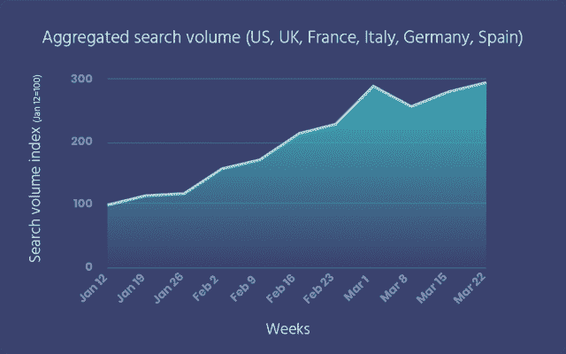
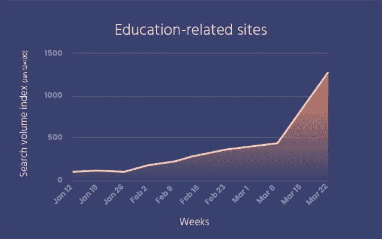
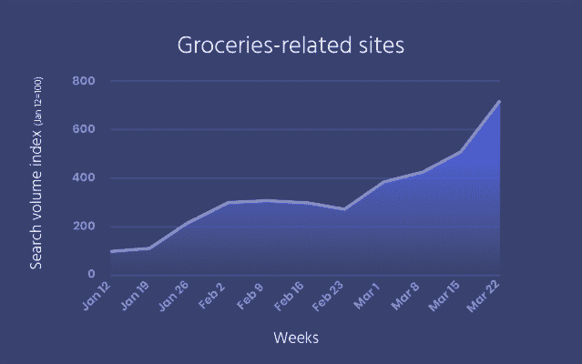
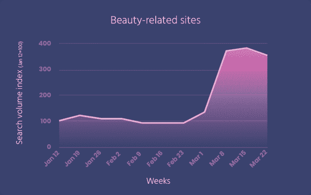
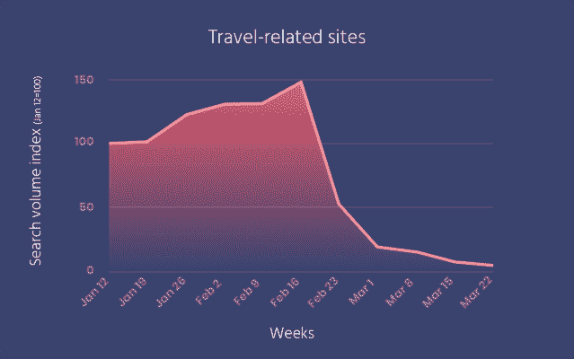
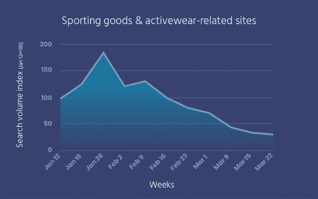
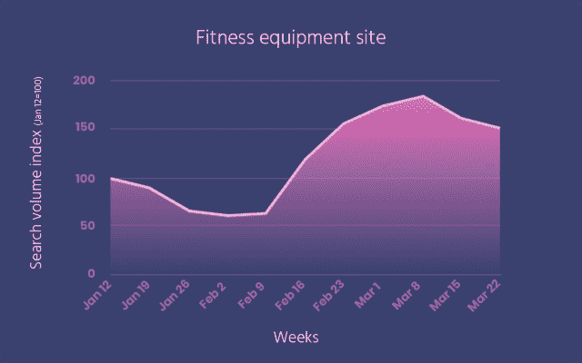
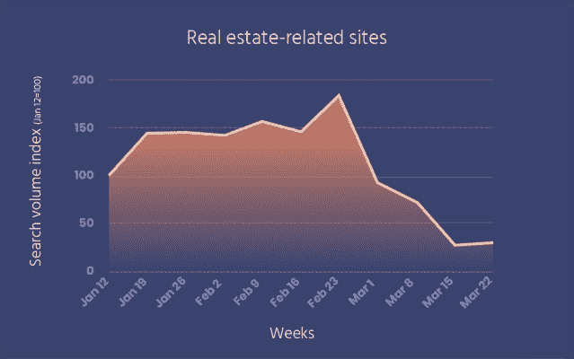

# Algolia 洞察:Q1 2020 年搜索趋势-全球颠覆时代

> 原文：<https://www.algolia.com/blog/algolia/search-trends-a-time-of-global-disruption/>

在过去的几周里，我们在 2020 年初所知道的世界已经完全改变了。随着世界各地的人们都在努力应对新冠肺炎疫情和随之而来的变化，人们的优先事项发生了变化，他们的行为也发生了变化。随着越来越多的人呆在家里，并在受影响的地区练习社交距离，这些行为变化包括人们如何优先考虑和花时间上网。

随着我们都在调整自己的工作和生活方式，您客户的优先事项和需求也可能会发生变化。无论你的生意是蒸蒸日上还是举步维艰，了解人们在寻找什么，并引导他们找到满足他们需求的最佳产品和信息，比以往任何时候都更重要。

通过 Algolia 的搜索即服务平台，搜索查询的年运行率达到 1 万亿，我们正在发布我们的 Q1 搜索趋势，以帮助组织了解和驾驭不断变化的环境。

本分析的目的是查看搜索量增加或减少最多的网站，并确定这些网站所在的行业，以更好地了解 2020 年 1 月至 3 月期间客户需求和搜索行为的变化。

虽然我们全球 8，600 多名客户的 Q1 搜索总量保持一致， 我们看到了几个行业网站的搜索活动激增，包括美容企业、在线教育网站和在线杂货商家，但也看到了旅游、房地产、体育用品和运动服等行业网站的搜索活动下降。

我们检查和分析了从 1 月 12 日到 3 月 28 日近 3 个月的搜索流量数据，并按国家和行业进行了细分，以了解客户行为在 2020 年第一季度如何以及在哪里发生了变化。以下是我们的发现——有些是我们预料到的，有些是让我们吃惊的，但现在在这种“新常态”下是有意义的。

首先，我们根据我们分析的公司，查看了在 Q1 期间搜索量激增的行业类别。随着世界似乎在一夜之间逐国发生变化，在线教育、杂货和其他电子商务购物网站的全球搜索出现了相当大的增长，尤其是在 3 月份。

| **行业** | **增加百分比** |
| **教育** | **1，185%** |
| **杂货** | **618%** |
| **电子商务** | **408%** |
| **金融服务** | **309%** |
| **医疗保健** | **280%** |
| **美女** | **255%** |
| **媒体** | **248%** |

当我们绘制六个国家(美国、英国、法国、意大利、德国和西班牙)的图表时，我们发现每周都有稳步增长，只有第 8 周(即 3 月 1 日的那一周)例外，增长幅度更大，主要是因为美国和法国的一些精选在线杂货、游戏和学习网站。

让我们仔细看看 2020 年 Q1 的搜索量大幅增长的几个特定行业。如下图所示，显而易见的是，在全球疫情期间，虽然人们的核心需求没有改变，但人们采购商品和开展业务的方式发生了变化。

## 高需求行业

### 教育网站

随着学校关闭，家长在家办公，学生的学习被打乱了。随着学区争相开发某种形式的在线教学，并给学生分配更多的课程，学校管理人员和家长已经策划并找到了提供免费在线教育课程和资源的公司。此外，人们还利用这段时间充实自己，发展新技能——学习一门新的外语、演奏一种乐器或提高编程技能。

因此，在我们的分析中，教育相关网站在 Q1 的搜索量增长最快，增长超过 10 倍，在三月的后半月出现了最大的激增。

| 

#### **聚焦环节:开发人员搜索技术文档**

通过 DocSearch，Algolia 支持超过 2，000 个项目，包括 Bootstrap、Laravel、Vue.js 和 React，帮助开发人员找到构建数字和移动体验所需的文档。在过去的一个月里，DocSearch 通过这项服务帮助了 310 万用户，同比增长 71%(即 3600 多万最终用户运行率，而 2019 年为 2100 万最终用户)，这表明开发者正在利用这段时间来拓宽和深化他们的技术开发专业知识，并探索编程语言和环境，以建立新的网站和体验。排名前五的项目——包括 Bootstrap、Laravel、Materia-UI 和 Vue.js — 推动了超过 40%的业务量。有些事情告诉我们，在未来的几周和几个月里，我们将会看到更多这样的项目，希望包括更多帮助 [战胜新冠肺炎的项目。](https://blog.algolia.com/overcoming-covid-19-live-projects-and-efforts-to-help-get-through-this-time/) |

### 网上杂货网站

过去几周，随着“就地安置”和“社会距离”指导方针在世界各地的实施，越来越多的人开始避免去杂货店，而是选择送货上门或网上购买，在商店(BOPIS)提货。

因此，在 Q1，杂货网站的搜索量增长了 6 倍多。由于对鸡蛋、牛奶、咖啡和面包等每周主食的需求，首次用户可能会成为忠诚的客户(至少在疫情期间)——随着新用户继续加入并在线购物，他们会从上次的在线杂货订单——中重新订购。基于这种动态，我们预计这种上升趋势将在未来几周继续稳步增长。

### 

### 美容场所

乍一看，我们惊讶地发现美容网站出现在需求不断增长的类别列表中。毕竟，人们外出的次数越来越少，为什么他们还需要美容产品呢？

随着我们对数据的深入研究，主要在 3 月份，搜索量增长了 3.5 倍以上，很明显，这一细分市场中的公司受益于越来越多的人在家呆的时间越来越长，而当地的沙龙和其他美容相关服务仍然关闭。这可能意味着更多的人自我修饰，包括剪头发或染发(或者问室友)。)

不幸的是，随着对超过世界三分之一人口的实施社交距离和一定程度的封锁措施，人们的行为发生了巨大的变化；某些活动和优先利益不再优先 — 或者在许多情况下甚至是不可能的。旅行、参加自己最喜欢的体育赛事和购买新房产不再是大多数人日常生活的一部分 — 我们分析的搜索数据支持了这一点。

## 需求较低的行业

### 旅游景点

不出所料，在线旅游网站的搜索量大幅下降 — 比 Q1 之初下降了 97%。这始于美国、中国、英国和其他欧盟国家开始限制然后禁止来自世界某些地区的航班。随着新冠肺炎成为全球疫情，世界卫生组织发布了更严格的指导方针，春假期间乘坐飞机、游轮和家庭度假显然需要自担风险。

### 体育用品&运动服网站

随着新冠肺炎疫情开始影响当地社区，学校关闭，留在家中的措施到位，户外活动和学校体育赛事减少。同样，随着受欢迎的体育人物被报道感染了冠状病毒，职业体育联盟如 NBA 和 FIFA 暂停了他们的赛季，体育赛事一夜之间停止了。体育相关网站的搜索活动，尤其是那些销售运动服的网站，在过去的一个季度下降了 69%,并持续下降。

| 

#### **聚光灯公司:健身器材供应商**

虽然许多运动服和体育用品相关网站的搜索活动有所减少，但某些体育用品类别的一些公司的搜索量却大幅增长 — ，转化率可能也更高。一个例子是一家健身器材提供商，从本季度初开始，其搜索量增长了 74%。这可能是因为人们在寻找通过跑步机、自由重量和固定自行车等设备在室内保持活跃和身材的方法。 |

### 房地产网站

居家措施、社交距离和长期熊市迹象的结合，商业和住宅房地产等行业的活动已经放缓。虽然一些房地产经纪人 [为他们的客户](https://www.cnbc.com/2020/03/30/coronavirus-fallout-virtual-and-solo-home-touring-soars.html) 和 [提供虚拟旅游，但如果房地产价格下跌，潜在投资者正在寻找购买房产的机会](https://www.marketplace.org/2020/04/07/pandemic-could-mean-opportunity-real-estate-investors/) ，根据我们在几个网站的搜索活动数据，这个市场的整体势头正在下降，从 2 月 24 日那周的峰值和 3 月 16 日那周的底部下降了 85%。

在这种时候，每个公司都应该想办法减少在线体验中的摩擦。

*   如果您的业务放缓，您会希望为访问您网站的客户提供最佳体验。
*   如果您的业务大幅增长，那么优化您的产品或内容目录、分析搜索分析趋势并减少在线体验中的摩擦将有助于您的整个业务，包括您的客户支持和退货团队。

当客户找不到想要的东西时，搜索往往是他们的一个关键摩擦点。另一方面，提供搜索体验以快速提供客户想要的东西在任何时候都是最佳实践——尤其是在这个客户积极花时间上网、寻求基本和增值产品、信息和服务的特殊时期。

如果您在此期间需要帮助，请致电[support@algolia.com](mailto:support@algolia.com)联系我们，或者访问我们的 [新冠肺炎资源页面。](https://www.algolia.com/covid-19/)

要了解如何在此期间发展您的在线体验和方法，请注册参加 [“新冠肺炎世界的数字战略”](https://go.algolia.com/digital-strategies-covid-19) 网络研讨会。

**注意:** 在本次分析中，没有披露任何特定于客户的信息。引用的所有数据都是经过国家和/或行业汇总或匿名处理的，因此不特定，也不代表任何特定客户。