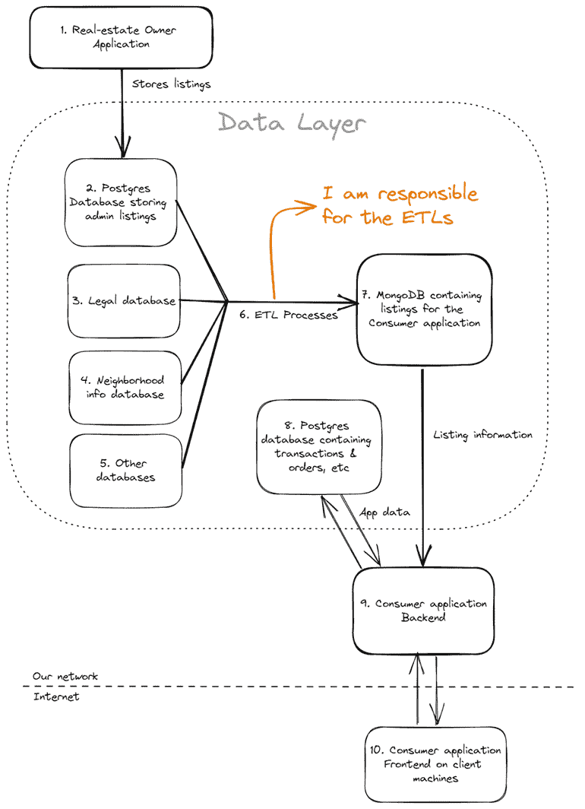

# Algolia+MongoDB–第 1 部分:用例、架构和挑战

> 原文：<https://www.algolia.com/blog/engineering/supercharging-search-for-ecommerce-solutions-with-algolia-and-mongodb-use-case-architecture-and-current-challenges/>

我们邀请 Starschema 的朋友写一个结合使用 Algolia 和 MongoDB 的例子。我们希望您喜欢这个由全栈工程师 Soma Osvay 撰写的四部分系列。

如果你想跳过，这里有其他链接:

[第 2 部分–提议的解决方案和设计](https://www.algolia.com/blog/engineering/supercharging-search-for-ecommerce-solutions-with-algolia-and-mongodb-proposed-solution-and-design/)

[第三部分——数据管道实施](https://www.algolia.com/blog/engineering/supercharging-search-for-ecommerce-solutions-with-algolia-and-mongodb-data-pipeline-implementation/)

[第 4 部分-前端实施和结论](https://www.algolia.com/blog/engineering/supercharging-search-for-ecommerce-solutions-with-algolia-and-mongodb-frontend-implementation-and-conclusion/)

* * *

嗨，我是 Soma，我是一个相对较小的咨询团队的成员，为我们最知名的客户之一维护多个房地产电子商务解决方案。这些应用程序使最终用户能够在多个国家出售、购买或租赁房屋。尽管它们不是传统的网上商店。在某些情况下，我们只是连接供应和需求，但在租赁的情况下，我们实际上管理交易、订单、取消和各方之间的沟通。在过去几年中，我们一直在大幅扩展这些服务的范围，这使我们的客户能够探索新的业务机会，并投入时间和资源来添加新功能、升级基础架构，以及专注于数据驱动的决策制定。

我们最近为网上商店增加了许多新服务，例如:

*   社交媒体整合
*   高级搜索引擎优化
*   房地产代理注册的可能性
*   基于人工智能的推荐系统
*   房地产历史
*   邻域分析

由于这些新服务和有机增长，网站上的列表数量急剧增加。这让我们注意到这样一个事实:我们的搜索能力没有满足客户的需求。搜索结果往往不相关、不准确、速度慢，给用户带来了糟糕的体验，也给公司带来了坏名声。

提供准确的房地产搜索结果是一个挑战，因为有许多相关的属性。客户希望通过以下方式进行搜索:

*   地理位置
*   邻里类型(城市、郊区、经常光顾、安静等)
*   建筑类型(新建、旧建筑、工业建筑)
*   靠近公共交通、学校、体育设施等
*   价格幅度
*   能源和绿色评级
*   某些贷款或其他融资解决方案的资格

客户调查表明，糟糕的搜索结果直接导致我们客户的收入损失。仅仅几次搜索失败后，顾客就离开了网站！对照组显示，只有那些坚持不懈并使用简单搜索词的人才能找到他们正在寻找的列表。这充分表明，提供快速、准确和相关的搜索结果将提高产品的点击率，因此它被指定为下一个发布周期的首要功能。

我的任务是提出一个解决方案，以提高电子商务网站的搜索能力。这篇博文讲述了我实现一个基本的概念验证搜索解决方案的过程，我们可以在这个基础上为我们的服务创建**高级搜索**。

## 当前网店架构&数据管道

这个特殊的网上商店的架构有点支离破碎。面向消费者的应用程序和面向管理员的应用程序是完全独立的，由不同的团队管理，并且只在数据级别上连接。

房地产所有者和代理使用该管理应用程序来列出他们可购买和租赁的房产，管理租赁订单，以及查看统计数据等。此应用程序不由我的组织单位管理。它连接到包含应用程序数据的单个数据库。

消费者应用程序已经上市，公开可用，在谷歌上市，并具有先进的搜索引擎优化。这是我的团队负责的部分，也是我们将在本系列文章中改进的部分。消费者使用该应用程序列出他们有兴趣购买和租赁的房产，并允许他们处理金融交易，与其他用户交流等。

## 建筑

我们当前的架构是这样的:

## 挑战&可能的解决方案

我们的主要挑战是 MongoDB 在搜索部门受到限制。目前，MongoDB 的云托管版本支持 Atlas Search，这是一种细粒度的索引解决方案，但它不适用于我们，因为我们使用的是内部 MongoDB 实例，它只支持遗留文本搜索。它不能搜索多个领域和重要的文本内容。

遗留文本搜索给我们带来了几个问题:

*   $text 运算符不支持全文搜索。它可以搜索短语和关键词，但这通常是不够的。
*   它不能根据与查询的相关性对结果进行排名。
*   它不允许我们轻松地搜索多个字段和数组。
*   带有发音符号的单词(如é或)应该被视为与不带发音符号的单词(在本例中是 e 和 o)相同，但这非常慢..

由于这些问题，我们的应用程序无法为最终用户提供流畅的搜索体验。

我们已经试验了本地托管版本的 **ElasticSearch** (并使用 MongoDB River 插件进行同步)，但是托管&微调 ElasticSearch 对我们的团队来说很困难。我们最终得到了一个非常不可预测的搜索体验，它不仅在很多情况下很慢，而且不准确。

除此之外，ElasticSearch 集成需要我们修改整个应用程序堆栈！我们的应用程序的后端和前端都需要进行大量修改才能正常工作。我们必须管理应用程序的安全性，编写我们自己的 UX 代码，并用代码编写复杂的索引逻辑。我们的应用程序中也有许多遗留代码，因此修改、测试和部署新版本的成本很高，因为这需要广泛的领域知识和经验，而这里只有少数开发人员具备这些知识和经验。

看到这些问题，我们放弃了 ElasticSearch。时间和资源的开发成本对于它所带来的利益来说太大了。

## 阿哥利亚

在做了一些内部和外部研究后，我发现我公司内部的其他团队正在使用[一种叫做 **Algolia** 的解决方案来改进他们产品的搜索](https://www.algolia.com/products/search-and-discovery/hosted-search-api/)。他们告诉我很多关于它提供的 SDK 的质量，以及集成到现有系统中是多么简单，根本不需要改变后端代码。

看看这个特性列表吧！

*   它是云原生的，并承诺非常高的可扩展性。
*   我们可以最小化实现该功能所需的编码，尤其是在后端，这肯定会成为瓶颈。
*   我们的数据工程师和领域专家可以在项目上合作，共同创造价值，而不是各自为战。
*   它简化了搜索开发过程，因为它不需要关于定义优化索引的深入技术知识。
*   它维护成本低，易于组织大量数据
*   管理和配置搜索规则以提高搜索准确性很简单，甚至给我们提供了用 AI 进行微调的选项。
*   有非常易于使用的前端 SDK 可以与我们现有的前端应用程序集成。
*   它提供了预配置的分析和 KPI，进一步降低了开发成本。
*   它支持从前端发送事件，以进一步提高准确性和功耗分析。

出于这些原因，我决定使用 Algolia 为我们新的搜索索引功能构建 PoC。

在本系列的[第二篇文章中，我将介绍 PoC 的设计规范，并讨论实现的可能性。](https://www.algolia.com/blog/engineering/supercharging-search-for-ecommerce-solutions-with-algolia-and-mongodb-proposed-solution-and-design/)

在本系列的第三篇文章中，我将实现数据摄取到 Algolia 中，并弄清楚如何使数据保持最新。

在本系列[的第四篇文章](https://www.algolia.com/blog/engineering/supercharging-search-for-ecommerce-solutions-with-algolia-and-mongodb-frontend-implementation-and-conclusion/)中，我将实现一个示例前端，这样我们就可以从用户的角度评估产品，如果开发人员选择这个选项，就可以给他们一个先发制人的机会。