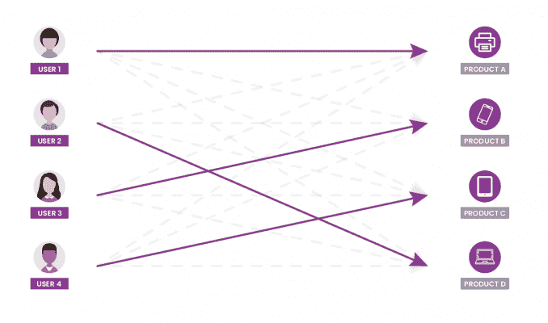
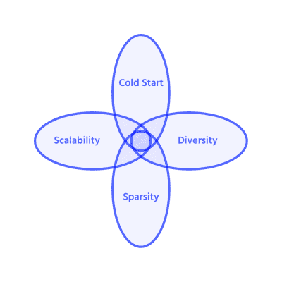
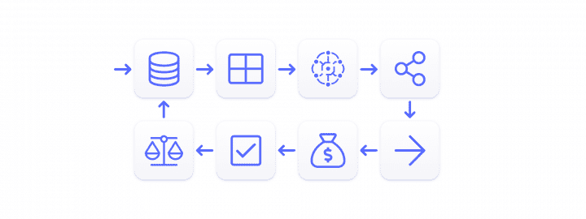
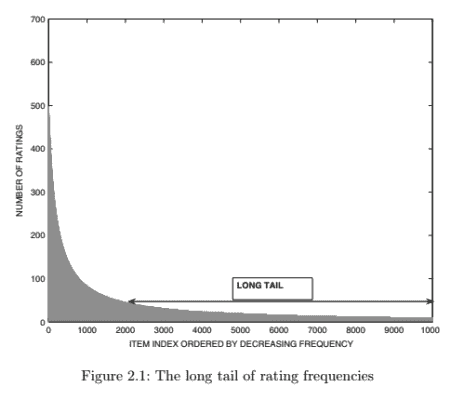
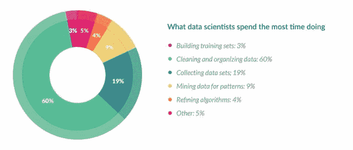
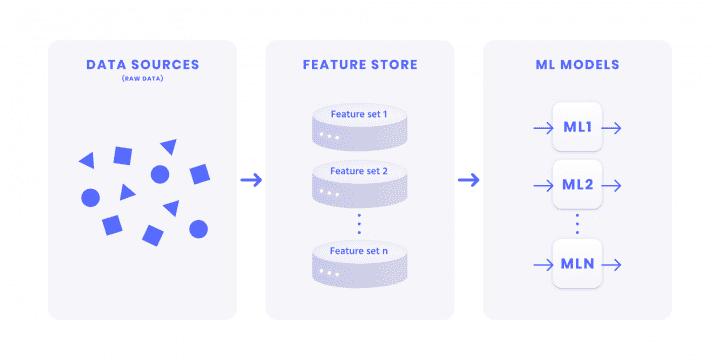

# 高性能推荐系统剖析-第 1 部分

> 原文：<https://www.algolia.com/blog/ai/the-anatomy-of-high-performance-recommender-systems-part-1/>

# 推荐系统介绍

用外行人的话说，推荐系统是一种软件，它过滤用户的选择，并根据他们的要求或偏好为他们提供最合适的建议。

第一个推荐系统创建于 20 世纪 70 年代，在杜克大学的研究社区；然后由施乐帕洛阿尔托研究中心开发。当互联网在 20 世纪 90 年代出现时，推荐系统立即被采用，作为帮助人们从过多的可用选项中选择最合适的产品的方法。

自那以后，推荐系统变得越来越受欢迎，它们现在对脸书、亚马逊、网飞、谷歌、YouTube 和 Tripadvisor 等大型互联网公司发挥着关键作用，涉足社交网络、娱乐、电子商务、旅游、婚介等领域。

在这个博客系列中，我们将解构[推荐引擎的剖析](https://www.coursera.org/learn/basic-recommender-systems)，探索构建一个高性能的推荐引擎需要什么，以便您在决定如何将该功能集成到您的应用程序中时有更好的准备。

## [](#the-four-guiding-principles-for-personalized-recommender-systems)个性化推荐系统的四大指导原则

首先，我们需要对[*非个性化* 和 *个性化*](https://www.coursera.org/learn/basic-recommender-systems/lecture/ttee6/taxonomy-of-recommender-systems) 推荐系统进行区分。对于非个性化推荐，所有用户都会收到相同的推荐。非个性化推荐的例子是给定位置的流行电影、最近的热门歌曲和最佳评级的餐馆。



使用个性化推荐系统最明显的操作目标是向用户推荐与相关的商品，因为人们更有可能购买他们 觉得有吸引力的商品 *。*

推荐人需要实现四个次要目标:



**A .冷启动**  当可用的信息或元数据不足时，推荐引擎不能最优地执行。有两个(极端的)冷启动问题:当没有关于用户的数据时，这分为缺乏关于访问者的先前知识和没有来自当前会话的足够信息；当用户没有足够的反馈或评分时。 例如，假设一个首次访问的访问者在一个电子商务网站上搜索一部新的智能手机。不到一周，他就买了一部手机，对浏览手机不再感兴趣。推荐引擎现在应该显示什么？  

**B .克服数据稀疏性**  数据稀疏性源于电子商务网站上的用户倾向于与有限数量的商品进行交互(将商品添加到购物车、购买或评论)。大多数推荐引擎对相似用户的评级进行分组；然而，他报告的用户-项目矩阵具有高达 99%的空的或未知的评级，因为缺乏用户对项目进行评级的激励或对项目进行评级的足够知识。因此，不提供反馈或评级的用户会收到不相关的推荐。 

**C .可扩展性**  可扩展性问题随着电子商务行业的快速增长而显著增加:现代推荐引擎需要为大规模应用生成实时结果。换句话说，推荐模型的性能是根据吞吐量(每秒的推理次数)和延迟(每次推理的时间)来衡量的。  

**D .多样性和新颖性**  推荐引擎能够获得的最准确的结果是基于用户或对象的相似度。然而，这使得用户只能选择范围更窄的商品——热门商品——而高度相关的小众商品可能会被忽略。推荐的多样性允许用户发现他们自己不容易发现的项目。

## [](#building-a-scalable-architecture-for-a-recommender)为推荐者构建可扩展的架构



1\. Data Sources 2\. Feature Store 3\. Machine Learning Models 4\. Predictions 5\. Actions 6\. Results 7\. Evaluation 8\. AI Ethics

从工程的角度来看，为了实现推荐系统的主要目标，推荐系统的架构必须是可扩展的。完成这项工作需要 8 个关键要素:

### [](#1-data-sources-ds)**1。数据来源**

****在潜入数据源之前，首先要了解的是 *隐性 vs 显性* 的收视率性质。评级形式的反馈是明确的，因为用户在指定他们对各种项目的好恶的特定评估系统(例如，五星评级模型)中选择数值。 **在收集反馈的隐式方法中，用户的浏览和购买行为，或他们的一元评级(例如，他们是否“喜欢”、“阅读”或“观看”)——其中存在一种机制来表达他们对某个项目的亲和力——可以被视为评级信号。今天，许多商业系统允许基于显式和隐式反馈提供推荐的灵活性。这就引出了一个问题，“推荐引擎的最佳输入是什么？”至少，你应该包括用户、项目和明确的评分(五分制):******

 ****| **用户/项目** | **U1** | **U2** | **U3** | **U4** | **U5** |
| **I1** | 1 | ❓ | 3 | 4 | ❓ |
| **I2** | 3 | ❓ | ❓ | 2 | 3 |
| **I3** | 2 | 5 | 3 | ❓ | ❓ |
| **I4** | ❓ | 4 | 1 | ❓ | ❓ |
| **I5** | 5 | ❓ | 2 | ❓ | 5 |

虽然此表有一些缺失的评分(用问号表示)，但实际上，不到 1%的项目经常被评为 *，* ，这些可以被称为流行项目。绝大多数被评为 *很少被评为* ，这导致了潜在评级的高度偏斜分布——实际上，我们正在处理评级的长尾特性。



对于推荐系统，有两种主要的数据来源可以考虑:  

*   您的产品目录(商品)和用户元数据(如年龄和性别)的首选 CMS(如 Shopify、Magento 或 woo commerce)  
*   Google Analytics(或任何第三方分析平台)用于互动，如页面浏览量、停留时间和转化率

聚合数据集可能看起来像这样:

```
[
  {
    "user_id": "1",
    "item_id": "100",
    "events": [{
      "event_1": "2016-04-20T13:25:55+02:00", //detail-page-view
      "event_2": "2016-04-20T14:01:55+02:00", //add-to-cart
      "event_3": "2016-04-20T14:13:55+02:00" //purchase
    }]
  },
  {
    "user_id": "2",
    "item_id": "200"
  },
  {
    "user_id": "3",
    "item_id": "300"
  }
]
```

阅读关于[数据源](https://www.algolia.com/blog/ai/the-anatomy-of-high-performance-recommender-systems-part-2/)的更多信息

### [](#2-feature-engineering-fe)**2。特征工程(FE)**

构建机器学习(ML)模型最重要也是最耗时的一个方面就是数据准备，具体来说就是特征提取(或 engineerng)。 我们都知道: [数据科学家 80%的工作是数据准备。](https://www.forbes.com/sites/gilpress/2016/03/23/data-preparation-most-time-consuming-least-enjoyable-data-science-task-survey-says/)


特征提取阶段——提取各种物品的描述——是高度特定于应用的。项目可能有多个描述其各个方面的字段。例如，一个销售书籍的电子商务企业可能有一个项目、标题、描述、作者和价格字段。

| **项目** | **标题** | **描述** | **作者** | **价格** |
| I1 | 后来的 | 杰米·康克林是一位苦苦挣扎的单身母亲的儿子，他只想拥有一个平凡的童年。但是杰米不是普通的孩子。 | 斯蒂芬·金 | $10.88 |
| I2 | 我们从结尾开始 | 故事发生在一个小镇上，每个人都知道明星拉德里的事情——她的毒瘾，她的孩子被忽视的方式——但是很少有人伸出援助之手，除了与明星有过节的当地警长沃克。 | 克里斯·惠特克 | $14.84 |
| I3 | 2034:下一次世界大战的小说 | 来自两位前军官和获奖作家，这是一部令人毛骨悚然的真实地缘政治惊悚片，想象了 2034 年美国和中国在南中国海的海军冲突，以及从那里通往噩梦般的全球大灾难的道路。 | 埃利奥特·阿克曼，海军上将詹姆斯·斯塔夫里迪斯号 | $17.84 |
| … |

除了描述每个项目的信息之外，除了关于用户评级的数据(隐式或显式)之外，一些推荐系统可能还需要用户属性(例如，人口统计)。

| **用户** | **最后一次出现** | 性别 | **年龄** | **国家** | **浏览量** | **添加到购物车** | **订单值** |
| U1 | 2021 年 10 月 1 日 | 男 | 45 | 加拿大 | 13 | 0 | 0 |
| U2 | 2021 年 2 月 28 日 | 母 | 25 | 美国 | 5 | 1 | $129 |
| U3 | 2021 年 1 月 2 日 | 女 | 39 | 法国 | 9 | 1 | $98 |
| … |

为了解决 ML 生命周期中的这一乏味挑战，引入了特征库的概念:特征工程和模型开发之间的接口，为数据科学团队提供特征的集中式数据仓库，解决两个问题。It:

*   以集中方式存储大量特性，允许 DS/ML 工程师更快地重用、试验和生产 ML 模型  
*   为其他应用程序或数据库提供低延迟和高吞吐量的特性



不是所有的推荐系统都有特征存储的硬性要求；然而，当 DS/ML 工程师正在处理多个机器学习计划时，手动特征工程可能会导致冗余。    因此，首先，功能商店为共享所有可用的功能提供了一个真实的点。当数据科学家开始一个新项目时，他们可以访问该目录并轻松找到他们正在寻找的功能。但是特征存储不仅仅是数据层；它也是一种数据转换服务，使用户能够操作原始数据并将其存储为特征 [，以备任何机器学习模型](https://towardsdatascience.com/what-are-feature-stores-and-why-are-they-critical-for-scaling-data-science-3f9156f7ab4) 使用。

阅读更多关于特征存储和工程的信息。

### [](#3-models)**3。型号**

推荐系统的基本模型处理两种类型的数据:用户-项目交互，如评分和购买行为，以及关于用户和项目的属性信息，如文本简介和相关关键词。

下面是基本的推荐系统模型

1.  **基于内容的过滤**  在基于内容的推荐系统中，内容在推荐过程中起着主要作用。利用项目描述和属性来计算项目相似性。在这种情况下，上面的用户评级矩阵被替换为项目内容矩阵，其中项目在行中，项目属性在列中。
2.  **协同过滤**  协同过滤模型利用多个用户提供的评分的协同力量进行推荐。基本思想是可以计算未指定的评级，因为观察到的评级通常在各种用户和项目之间高度相关。

例如，考虑两个用户，Julia 和 John，他们是朋友并且有非常相似的品味。如果他们的等级(他们两个都指定了等级)非常相似，那么他们的相似性可以通过潜在的算法来识别。在这种情况下，很可能只有其中一个指定了值的评级也很可能是相似的。这种相似性可用于对不完全指定的值进行推断。

协同过滤主要有两种:  

*   *   **基于用户的**  基于用户的协同过滤(UB-CF)背后的主要思想是，具有相似特征的人分享相似的品味。例如，如果 Julia 有兴趣向 John 推荐一部电影，只要他们一起看过很多电影，并且对它们的评价几乎相同，就可以肯定他们会继续喜欢类似的电影。
    *   **基于项目** 与 UB-CF 相反，项目-项目协同过滤是基于项目之间的相似性，使用用户给项目的评级来计算。因此，约翰对类似科幻电影的评分，如*外星人*和*捕食者*可以用来预测他对*终结者的评分。*

阅读更多关于[型号](https://www.algolia.com/blog/ai/the-anatomy-of-high-performance-recommender-systems-part-iv/)的信息。

### [](#4-hybrid-recommender-systems)**4。混合推荐系统**

 **有些情况下可以使用不同的输入源。例如，协同过滤系统依赖于社区评级，基于内容的方法依赖于文本描述和目标用户自己的评级，而基于知识的系统依赖于在知识库的上下文中与用户的交互。类似地，人口统计系统使用用户的人口统计资料来进行推荐。

值得注意的是，这些不同的系统有不同的优点和缺点。一些推荐系统，例如基于知识的推荐系统，在大量数据不可用的冷启动设置中更有效。

其他推荐系统，如协作方法，在大量数据可用时更有效。在许多情况下，当更多种输入可用时，人们可以灵活地为同一任务使用不同类型的推荐系统。在这种情况下，存在许多混合的机会:将不同类型系统的各个方面结合起来以获得最佳结果。

基于内容的过滤和协同过滤经常一起使用，因为它们可以很好地相互补充。基于内容的系统受到过度专业化的困扰——它们倾向于推荐与用户已经看过的其他项目相似的项目。另一方面，协作推荐器不能有效地给出新项目的推荐。这两种方法经常在混合推荐系统中结合起来，从而获得两个世界的最佳效果。

阅读更多关于[混合动力车型](https://www.algolia.com/blog/ai/the-anatomy-of-high-performance-recommender-systems-part-iv/)的信息。

### [](#5-destinations-and-actions)**5。**目的地和动作

 **此时，你能够生成建议，但是你会如何使用它们，在哪里使用它们呢？对于电子商务企业，标准方法是在产品详情页面上显示一个“推荐给你”的小部件。


Etsy 是一个利用热门商品展示推荐的电子商务平台的完美例子。这里是它的主页: 

注意建议的中心位置。

首先展示受欢迎的产品背后的想法是，因为有如此多的购物者购买了它们，其他人也很可能对它们感兴趣。

虽然这种方法并不能真正个性化客户体验，但展示受欢迎的商品可以让你锁定没有账户的首次用户。作为比较，下面是 Etsy 主页在登录后的样子:


平台记录了所有过去的产品视图和添加到收藏夹的商品。然后，它与来自同一类别或同一卖家的类似产品进行自动关联。

推荐系统也可以用于交叉销售和追加销售，旨在帮助人们选择最适合他们的商品，同时增加商家的收入。

阅读更多关于[预测&用户操作](https://www.algolia.com/blog/ai/the-anatomy-of-high-performance-recommender-systems-part-v/)的信息。

### [](#6-business-results-and-evaluating-a-recommender-system)**6。商业结果和评估推荐系统**

给定一组推荐算法，它们的表现如何？你如何评价它们的相对有效性？

开发人员正在关注技术方面，但商业领袖仍然有一个主要角色:决定在哪个页面上测试产品推荐。它可以是任何页面，只要你能收集到足够的数据。最好只将测试发送给 20%的流量，这样如果出现问题，你就不会破坏对所有人的建议。如果您想安全地测试上述任何推荐系统而不干扰实时数据，您可以让您的数据或 web 开发团队在其沙箱中进行测试。

无论哪种情况，都要关注你的关键绩效指标以及某项技术对它们的影响。如果你没有做过 A/B 测试，你的每一件商品的点击率和转换率，而不仅仅是整个商店的点击率和转换率，是你可以开始的两个安全的选择。

## [](#where-do-you-go-from-here)你将何去何从？

在这个阶段，你不仅应该能够理解使用推荐系统的好处，还应该对最适合你的应用的方法有一个直观的想法。

基于人工智能的电子商务推荐系统的主要目的是帮助你选择合适的产品放在你的用户面前。一切都有他们之前喜欢或感兴趣的产品的真实数据支持，所以你不再需要猜测他们可能在寻找什么。

定制产品推荐系统的未来将允许你瞄准新的用户群，并出现在任何地方:社交媒体、移动应用、电子邮件，当然，还有你的网站。同时，你可以推销你的所有商品，包括新产品，甚至可以记录用户行为的数据。因此，如果一个利基产品的受欢迎程度在一夜之间突然飙升，你不必等到第二天早上才更新你的推荐，因为所有这些都是实时进行的。

这篇文章只是致力于剖析高性能推荐系统的一系列博客中的第一篇。请继续关注下一篇文章，它将关注推荐系统的数据源。********