# 高性能推荐系统剖析——第四部分—

> 原文：<https://www.algolia.com/blog/ai/the-anatomy-of-high-performance-recommender-systems-part-iv/>

## 推荐系统的流行模型和技术

在本系列关于推荐 的第一部分 [中，我们谈到了一个高性能推荐系统的关键组件:(1)](https://www.algolia.com/blog/ai/the-anatomy-of-high-performance-recommender-systems-part-1/) [数据源](https://www.algolia.com/blog/ai/the-anatomy-of-high-performance-recommender-systems-part-2/) ，(2) [特征工程和特征库](https://www.algolia.com/blog/ai/the-anatomy-of-high-performance-recommender-systems-part-3/) ，(3) **机器学习模型**，(4)&5)[预测&这里的重点是 3-应用于推荐模型的机器学习。](https://www.algolia.com/blog/ai/the-anatomy-of-high-performance-recommender-systems-part-v/)

在我们之前关于 功能推荐 的文章中，我们了解到推荐系统最流行的技术依赖于三种数据源类型:(1)用户元数据——性别、年龄、职业、位置等。(2)关于项目的属性信息——销售书籍的商家可能具有书籍的描述和描述内容、标题和作者的关键字，以及(3)用户-项目交互——点击、查看、交易、评论等。

在本文中，我们将自己构建**推荐模型**。

我们根据处理这些原始数据源的方式对常见的推荐方法进行分类:

*   **基于内容** —内容在推荐过程中起主要作用。正如我们将看到的，项目描述和属性被用来计算项目相似性。

*   **协同过滤** —这些模型利用多个用户提供的评级的协同力量来进行推荐。基本思想是可以计算未指定的评级，因为观察到的评级通常在各种用户和项目之间高度相关。协作过滤主要有两种:
    *   **基于用户的**——基于用户的协同过滤背后的主要思想是，具有相似特征的人分享相似的品味。
    *   **基于项目的** —与基于用户的相反，项目对项目的协作过滤基于项目之间的相似性，使用人们对这些项目的评级来计算。

让我们更深入地研究每一种技术。

## [](#content-based-recommendations-models)基于内容的推荐模型

在基于内容的过滤中，我们根据项目的属性来推荐项目。因此，基于内容的推荐系统的输入由项目内容矩阵中描述的所有属性组成。

基于内容的推荐器的主要假设是，表达了对某个项目的偏好的用户可能会偏好类似的项目。例如，如果我碰巧喜欢漫威的电影，尤其是 2011 年的《绿灯侠》中的瑞安·雷诺兹，我很可能会喜欢《死侍》(2016 年和 2018 年)……更不用说《死侍 3》(据说他们将在 2022 年开拍，耶！)因为他们有同一个演员，他们是同一个电影类型。

条目内容度量(ICM)最能代表条目池的属性，如下所示:

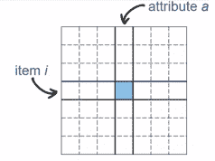

“1” if the item has the attribute “A”, “0” otherwise.

现在，关键问题是: *我们如何根据两个物品的属性来衡量它们的相似度？* 为此，我们在如下矩阵上计算余弦相似度:

|  | 属性 1 | 属性 2 | … | 属性 N |
| 第 1 项 | 1 | 0 | … | 1 |
| **第 2 项** | **0** | **1** |  | **0** |
| … | 1 | 0 |  | 1 |
| 第 N 项 | 0 | 1 |  | 0 |

直觉是，如果两个物品向量有很多共同的属性，我们可以假设这两个物品非常相似。数学上，这可以用点积运算来表示:


而几何上，可以表示为两个向量之间的余弦:

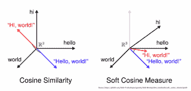

可以看出，较小的角度(较大的余弦)意味着项目具有较高的相似度。还有另外两个重要的概念将帮助我们构建相似性矩阵:

*   支持——向量中非零元素的数量。
*   收缩项 C——用于通过仅考虑与大型支持项目最相似的项目来调整相似性。

这样，使用公式计算相似度矩阵:

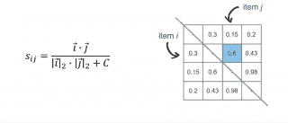

在下面，您可以看到我们如何根据众所周知的 [电影镜头](https://movielens.org/) 数据集计算推荐，该数据集由电影标题和用户提供的标签组成:

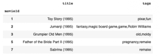

首先，我们计算矩阵中所有样本之间的余弦相似度，并将其保存在一个新的数据帧中，该数据帧稍后将用于返回前 k 个相似电影:

```
# creating the tf-idf Vectorizer to analyze, at word level, unigrams and bigrams
tf = TfidfVectorizer(analyzer='word', ngram_range=(1,2)) 

# applying the vectorizer on the 'tags' column
tfidf_matrix = tf.fit_transform(movies_df['tags'])

# compute the cosine similarity between all the samples in the matrix
cosine_sim = cosine_similarity(tfidf_matrix) 

# saving the values in a DataFrame for better visualisation
cosine_sim_df = pd.DataFrame(cosine_sim, index=movies_df['title'], columns=movies_df['title']) 

```

```
def get_recommendations(movie_id, similarity_df, movies_df, k=10):

# partitions the matrix such that the indices are in the position they would be in a sorted array
ix = similarity_df.loc[:,movie_id].to_numpy().argpartition(range(-1,-k,-1))

# gets the corresponding movie titles for k+1 sorted indices    
closest = similarity_df.columns[ix[-1:-(k+2):-1]] 

# removes the queried title from the results
closest = closest.drop(movie_id, errors='ignore')    

# returns top k most similar movies
return pd.DataFrame(closest).merge(movies_df).head(k) 

```

最后，获得推荐非常简单:

```
x = 'Superman (1978)'

# get recommendations for the given x title
y = get_recommendations(x, cosine_sim_df, movies_df[['title', 'tags']])
```

这个基本的基于内容的推荐算法将产生以下结果:

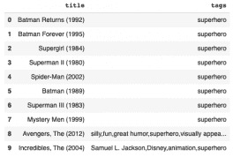

相似度矩阵的问题在于它非常密集(计算量大),相似度值非常小，这在数据中引入了大量噪声，从而降低了推荐的质量。为了解决这个问题，我们可以使用 K-最近邻算法(KNN)，这是一种在相似性矩阵中只保留 K 对最相似的项目的方法。

```
from sklearn.neighbors import NearestNeighbors

# Create the unsupervised learner with k=10 and train it on our data
knn = NearestNeighbors(n_neighbors=10).fit(cosine_sim_df)

def get_recommendations(movie_title, similarity_df, movies_df):

# Get the indices of the neighbors of the queried movie
ix = knn.kneighbors(similarity_df[movie_title].to_numpy().reshape(1, -1), return_distance=False)

# Get the titles of the corresponding indices
closest = similarity_df.columns[ix].flatten()

return pd.DataFrame(closest,columns=['title']).merge(movies_df)

```

相同的查询，使用与上面相同的代码，将产生以下结果:

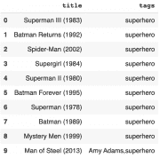

在上面的基本例子中，我们只考虑了 1 个属性，即 *标签。* 基于内容的算法可以通过包含更多的非二进制属性如片名、演员、流派等得到极大的改进。

## [](#collaborative-filtering-for-recommendations-models)协同过滤推荐模型

协同过滤方法的主要思想是通过观察来自其他高度相关的用户和已经给出评级的项目的评级来推断用户没有明确给项目的评级。它们不需要任何项目属性就能工作，而是依赖于用户社区的意见。

协同过滤推荐系统的输入是用户评级矩阵(URM)，它包含所有用户对项目的评级:

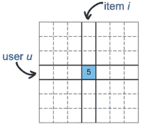

the rating user U gave to item I, “0” if no rating was given

例如，用户评级矩阵中的交互可以是明确的评级。显式评级意味着用户明确地陈述了他或她对某个项目的意见。显式评级的一个例子可以是用户给一个项目的星级数。如果没有用户对某个项目的评分，则 URM 中的相应值为 0。

|  | 第一项 | 第二项 | … | 第 N 项 |
| 用户 1 | 1 | 3 | … | 1 |
| 用户 2 | 2 | 4 |  | 4 |
| … |  |  |  |  |
| 用户 N | 3 | 5 |  | 2 |

URM 中描述的另一种类型的交互可以是隐式评级。隐式评级只是说明用户是否与某个项目进行了交互，因此只有两个值:0 或 1。1 表示用户与项目进行了交互，而 0 表示没有信息。

原则上，可以设计一种算法，既可以使用显式评级，也可以使用隐式评级。最简单的算法被设计成只处理两种类型中的一种:隐式或显式评级。

尽管有不同类型的协同过滤技术，下面我们将介绍基于用户和基于项目的技术。

### [](#user-based-collaborative-filtering)基于用户的协同过滤

当我们想向一个用户做推荐的时候，基于用户的协同过滤可以用来搜索其他有相似品味的用户，并推荐那些用户最喜欢的商品。

因此，第一个问题是找到一种方法来衡量用户之间的相似性。我们如何衡量这种相似性？

我们从查看用户的评分开始，并根据这些评分来比较用户的口味。如果两个用户对几个项目给出了相似的评价，我们可以假设这两个用户对这些项目有相同的意见；如果他们在很多项目上有相同的观点，我们可以假设这两个用户是相似的。

我们根据用户的评级计算用户之间的相似性，并创建一个相似性矩阵，其中行 *i* 和列 *j* 的值是用户和用户**之间的相似性得分**

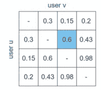

为了计算两个用户之间的相似度，我们使用余弦相似度。为了计算的目的，我们将同时计算一个用户和所有其他用户之间的相似性:

```
# create URM

URM = np.zeros((num_users, num_items), dtype=int)

for _, row in data.iterrows():
   URM[row['user_id'] - 1, row['item_id'] - 1 ] = row['rating']

```

```
# find the most N similar users to the current one (we picked N to be 3)

def similar_users(user_id, URM, N = 3):
   number_of_users = URM.shape[0]

# create the list of other users (take all users ids and then remove the id for the current one)
   other_users_ids = np.array(range(number_of_users), dtype=int)
   other_users_ids = np.delete(other_users_ids, user_id).tolist()

# take the ratings made by the current user
   user = URM[user_id].tolist()

# iterate through all the other users ids and compute the similarity to the current user
   other_users_similarity = []

   for other_user_id in other_users_ids:
     other_user = URM[other_user_id].tolist()
     other_users_similarity.append(cosine_similarity_pair_of_users(user, other_user))

# create a dictionary with the user indexes and their similarity
   index_similarities = dict(zip(other_users_ids, other_users_similarity))

# sort by the similarity
   index_similarity_sorted = sorted(index_similarities.items(), key=lambda x: x[1], reverse=True)

# get the first N users and their similarity
   top_user_similarity = index_similarity_sorted[:N]

# get the ids for the top N users
   top_user_ids = [usr[0] for usr in top_user_similarity]

   return top_user_ids

```

 此时，识别给定 user_id 的相似用户是简单的:

```
# for example we take the user with the id 48
example_user_id = 48
top_similar_users = similar_users(example_user_id, URM)

```

下一步是实际定义要推荐给我们用户的前 K 个项目。一旦我们确定了最相似的用户，下面的代码就可以做到这一点:

```
def recommend_topK_items_for_user(user_id, similar_users_ids, URM, topK = 5):

   # get the similar users ratings
   similar_users = URM[similar_users_ids]

   # compute the average rating for every item rated by the similar users
   average_ratings = similar_users.mean(axis=0)

   # get the current user
   user = URM[user_id]

   # transpose it
   user_transposed = user.transpose()

   # get the items ids where the rating is 0 (the user didn't rate the item)
   items = np.where(user_transposed == 0)[0]

   # get the similar users ratings for the unrated items by the current user
   similar_users_ratings = similar_users[:, items]
   average_ratings = average_ratings[items]

   # order the items by the average of their ratings
   item_indexes = np.argsort(average_ratings)[::-1]

   # get the top k items indexes
   top_items_index = item_indexes[:topK]

   return top_items_index.tolist()

```

最后一步是生成基于用户的推荐，并将它们与分级电影进行比较:

```
recommended_items = recommend_topK_items_for_user(example_user_id, top_similar_users, URM)

# items rated by the user
user_ratings = URM[example_user_id]
items_rated = np.where(user_ratings != 0)[0].tolist()

items_info.loc[items_info['movie_id'].isin(items_rated)]

# recommended items for user
items_info.loc[items_info['movie_id'].isin(recommended_items)]

```

### [](#item-based-collaborative-filtering)基于项目的协同过滤

在基于项目的协同过滤方法中，为了预测用户对目标项目的评分，我们必须确定与目标项目最相似的项目集。这个想法是根据有多少用户对每一对商品进行了评价来计算它们之间的相似度。然后，我们使用用户在该项目中指定的评级来预测他或她是否会喜欢目标项目。

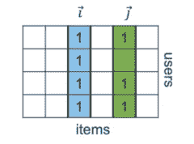

因此，第一步是计算项目之间的相似度，如下所示:

```
def similar_items(item_id, URM, topK = 5):
   # get the current item
   item = URM[:, item_id].tolist()

   # get all the other items
   number_of_items = URM.shape[1]
   other_items_ids = np.array(range(number_of_items), dtype=int)
   other_items_ids = np.delete(other_items_ids, item_id).tolist()

   # compute the similarity between the current item and the other items
   other_items_similarity = []

   for other_item_id in other_items_ids:
     other_item = URM[:, other_item_id].tolist()
     other_items_similarity.append(cosine_similarity_pair_of_items(item, other_item))

   # create a dictionary with the item indexes and their similarity
   index_similarities = dict(zip(other_items_ids, other_items_similarity))

   # sort by the similarity
   index_similarity_sorted = sorted(index_similarities.items(), key=lambda x: x[1], reverse=True)

   # get the first K items and their similarity
   top_item_similarity = index_similarity_sorted[:topK]

   # get the ids for the top K items
   top_item_ids = [itm[0] for itm in top_item_similarity]

   return top_item_ids

```

就像基于用户的协同过滤一样，在这个阶段，项目之间的相似度可以计算如下:

```
example_item_id = 29
recommended_items = similar_items(example_item_id, URM)

```

最后，获取推荐:

```
example_item_id = 29
# recommended items
items_info.loc[items_info['movie_id'].isin(recommended_items)]

```

在了解了协同过滤的工作原理之后，你可能还有一些悬而未决的问题，比如:

*   *基于项目的推荐和基于用户的推荐有什么区别？*
*   *基于内容的推荐和基于项目的推荐有什么区别？*

要回答这些问题，我们需要看看相似性是如何计算的——余弦相似性公式可以适用于从用户评级矩阵或 URM 开始计算用户之间的相似性和项目之间的相似性。 

考虑到项目之间的相似性，解决问题的方法与我们看到的基于内容的过滤技术相同。在基于内容的过滤中，我们可以根据用户以前喜欢的内容向他或她推荐项目。通过考虑属性来测量相似性。如果两个项目有很多共同的属性，我们可以说这两个项目是相似的。

*在不知道属性的情况下，是否可以衡量物品之间的相似度？*

是的，我们不需要知道任何关于项目的属性，因为我们可以计算我们的相似性矩阵，知道来自用户评级矩阵或 URM 的评级。

## [](#further-classification-of-recommendation-approaches)进一步分类推荐方法

### [](#memory-based-vs-model-based)基于内存与基于模型

到目前为止，我们已经将基于记忆的技术用于我们的协同过滤算法，在该算法中，我们基于用户相似性来预测评级。它们在生产中直接使用用户评级矩阵或 URM 的评级，并且更易于实施。

然而，在协同过滤中还有第二种常用的技术:基于模型的方法。

基于模型的技术在计算建议时并不依赖于整个数据集，而是从数据集中提取信息来构建模型。这些技术需要两步进行预测:(1)第一步是建立模型；(2)第二步是使用将第一步中建立的模型和用户简档作为输入的函数来估计评级。

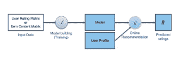

*如果我们在系统中有了一个新用户会怎么样？*

在基于记忆的技术的情况下，我们需要将新用户添加到 URM，并重新计算新用户和所有其他用户之间的相似性。这个操作的计算量很大，我们只能向模型中的用户提出建议。

在基于模型的技术的情况下，如果 URM 足够大，我们不需要将用户添加到 URM。我们不必重新计算相似性矩阵；它可以每天更新一次，也可以每周或每月更新一次。因此，我们甚至可以向不在模型中的用户进行推荐。

### [](#hybridization)杂交

至少，混合推荐系统结合了一种协同过滤技术和一种基于内容的技术。然而，我们可以通过整合任意多的技术来构建一个混合推荐系统。

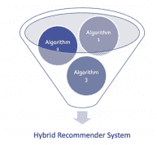

我们可以使用几十种不同的方法来构建混合推荐系统，所有这些方法可以大致分为五类:

*   **线性组合**    在这种类型的混合系统中，每种算法都是以现成的方式使用，也就是说每种算法都是按原样使用，不做任何修改。事实上，只有它们的输出被用于提供组合预测。这种结构允许算法及其并行执行的简单组合。例如:我们可以构建基于内容的算法 A 与协作算法 b 的组合。注意所使用的不同类型的输入数据:算法 A 使用 ICM，算法 b 使用 URM
*   **列表组合**一种简单而有效的方法是使用循环法:以循环的方式从每个列表的顶部开始选择项目。

*   **流水线操作**  流水线操作包括链接两个或多个算法，使得一个算法的输出等级作为输入被馈送到流水线中的下一个算法。例如，让我们考虑一个通用推荐算法 a。该算法可以将 URM 或 ICM 作为输入数据。 建立模型后，我们能够计算一些估计的评分。在流水线方法中，用算法 A 估计的评级可以用来丰富现有的用户评级矩阵。这个丰富的用户评级矩阵成为第二算法 B 的输入。结果是估计评级的最终矩阵。算法 A 的输出必须通过使用从我们希望为算法 b 充实的 URM 中获取的用户简档来计算。流水线的一个实际应用是使用基于内容的过滤算法作为第一阶段来充实用户评级矩阵，该矩阵随后被协作过滤算法使用。【T9

*   ******合并******
    在某些情况下，算法 A 的模型可以与算法 B 的模型相结合，得到一个新的模型用于推荐。只有当模型具有相同的结构时，我们才能使用这种方法。例如，我们可以将基于 ACF 项目的算法 A 与 CBF 算法 B 合并:第一个模型接收 URM 作为输入，第二个模型接收 ICM。重要的是两个型号是同一类型的。因此，不可能将协作算法的相似性矩阵与矩阵分解算法的因子矩阵合并。   
*   ****联合训练****
    最后一种混合方法基于联合训练。它类似于合并方法，不同之处在于，对于共同训练，合并的模型是在训练阶段直接获得的，并且算法 A 和 B 必须一起训练。

### [](#factorization-machines)因式分解机

因式分解机器算法是一种通用的监督学习算法，可用于分类和回归任务，使其成为一种有吸引力的协作过滤方法。我们算法的输入被构造成一个表，其中所有的列，除了最后一列，都被分组。例如，我们有两个组:用户和项目。每个组对应于 URM 的一个维度。这些列代表数据集的特征。最后一列包含用户对项目的评级，这使得它成为推荐系统场景中的预测目标。

【T2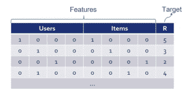

为了表示用户和项目，我们使用一个热编码。使用这种方法，我们为每个用户和项目分配一个列。通过将适当的列设置为 1 并将所有其他列设置为 0，我们可以选择特定的用户和特定的项目。 例如，第一列可能是 URM 的第一个用户，第二列可能是第二个用户，依此类推。通过将第一列设置为 1，将其他列设置为零，我们选择了第一个用户。类似地，在项目组中，如果我们将第一列设置为 1，而将其他列设置为零，则我们指定第一个项目。

与 URM 相比，这种格式使用更大的表，表中有更多的零，这使得表比 URM 更稀疏。根据这种表示，对于 URM 中的每个交互，我们在表中插入一行。例如，如果 URM 有 1000 个交互，我们应该在表中插入 1000 行。一旦我们定义了因式分解机的数据结构，我们就可以开始研究用于估计未知收视率的模型。

## [](#how-to-choose-the-best-recommendation-technique)如何选择最好的推荐手法？

尽管我们希望有一个通用的推荐系统能适应所有的现实生活场景，但更现实的想法是拥有一系列推荐模型，每一个都有特定的用途。

例如，如果你是一家电子商务企业，你可能希望使用协同过滤技术来提供基于项目的推荐，就像我们提供的 [Algolia 推荐](https://www.algolia.com/products/recommendations/) 。然而，如果你是一家拥有数字出版物的媒体公司，提供基于内容的推荐可能更有意义。

或者，如果你正在寻找个性化推荐，那么基于用户的协同过滤是一个不错的选择。此外，当可伸缩性成为一个问题时，决定基于模型还是基于内存的技术更多的是一种技术考虑。

大多数情况下，混合方法是最佳策略，对于拥有能够迭代和微调推荐模型的机器学习团队的公司来说，这显然是一条出路。

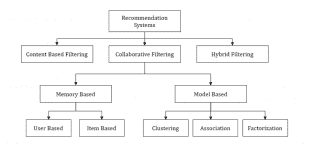

Recommender Systems Cheat Sheet

在本系列的下一篇博文中，我们将关注各种推荐系统可以通过它们生成的预测来促进的行动。敬请期待！如有疑问:[https://twitter.com/cborodescu](https://twitter.com/cborodescu)