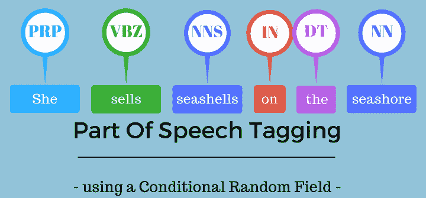
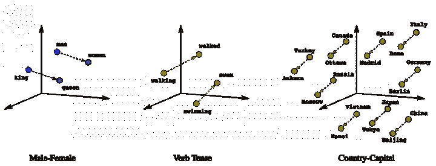

# 语义搜索的过去、现在和未来

> 原文：<https://www.algolia.com/blog/ai/the-past-present-and-future-of-semantic-search/>

设计搜索解决方案的技术人员开始听到很多关于语义搜索的说法。但是，什么语义搜索呢？最先进的语义搜索是什么样子的呢？

语义搜索没有单一的技术。这就像术语“AI”——一个营销术语，可以指几乎任何与机器学习相关的东西。1999 年，蒂姆·伯纳斯·李是最早将 [引入语义网的概念](https://en.wikipedia.org/wiki/Semantic_Web) 的人之一。从那以后,“语义搜索”这个术语就指的是查询处理中使用的许多不同的技术。

在这篇文章中，我将解释语义搜索，并描述一些用于深化查询处理的主要技术。我将探讨这些技术的来源、工作原理和发展方向。

**剧透警告** :无论你是在电子商务网站还是企业内部网添加搜索，语义搜索技术 *与更传统的关键词搜索* 相结合，可以提供最完整、最相关的结果。

## 简史查询了解

### 关键词搜索及统计排名:从 20 世纪 70 年代开始

关键词搜索已经存在很长时间了，它的工作方式很像一本书后面的索引。关键字搜索引擎创建所有文档中所有单词的索引，并根据简单的匹配算法提供结果。

为了提高搜索相关性和结果排名，搜索引擎引入了词统计，如 [TF-IDF 和 BM25。](https://kmwllc.com/index.php/2020/03/20/understanding-tf-idf-and-bm-25/) 统计搜索查看一个词在文档中的逆频率(IDF)与一个词的术语频率(TF)来确定其重要性。例如，像“the”和“or”这样的停用词在任何地方都频繁出现，而像“牙刷”或“水”这样的词出现的频率较低，也就是说，它们更不常见。词频可以作为一个指标来表示有多重要，或者 *相关，* 文档是

基于频率的统计非常初级，依赖于精确匹配。用 Lucene APIs 构建的关键字搜索算法今天在广泛的应用中仍然依赖于这些统计公式——实现起来非常简单和快速。然而，为了提高准确性，客户必须创建同义词库，添加规则，使用额外的元数据或关键字，或者采取其他类型的变通办法。

### NLP 简介:始于 1980 年代

统计排名有用，但还不够；有太多的用例中单词与查询不完全匹配。例如，单复数术语，动词变化(现在时与过去时，现在分词，等等。)、粘合或复合语言等等。

这导致了自然语言处理(NLP)功能的发展，以帮助管理语言的复杂性。这些过程包括:

 ***   **词干化:** 词干化是通过去除前缀和后缀，将单词转换成其基本形式的过程。这减少了资源使用并提高了计算能力。例如，“change”和“changing”转换为词根形式“chang”。
*   **:与词干化类似，词汇化将单词转化为其基本(或根)形式。它通过考虑每个单词的上下文和形态学基础来做到这一点。比如“changed”转换为“change”，或者“is”转换为“be”。需要注意的一件重要事情是，词干化和词汇化都是用来将单词还原为原始格式的，所以大多数项目都使用其中的一种。**

 ***   **分词** :在英语和许多基于拉丁语的语言中， *空格* 是单词分隔符(或单词分隔符)的一个很好的近似，尽管由于每种语言如何组合和分隔单词部分的可变性 ，这个概念具有局限性。 比如很多英语复合名词都是不定写的(ice box = ice-box = icebox)。但是 *空格* 并不是所有书写的文字中都有的，没有它，分词就成了难题。没有琐碎的分词过程的语言包括汉语和日语，其中句子而不是单词被定界；泰语和老挝语，其中短语和句子而不是单词被定界；和越南语，其中音节而不是单词被定界。

*   **语音标注** :语音标注，也叫词性(PoS)标注，是一种将单词列表分类为名词、动词、形容词等的方法。，以便更准确地处理查询。它着眼于一个句子中单词之间的关系 [来提高准确性](https://journalofbigdata.springeropen.com/articles/10.1186/s40537-022-00561-y) 通过更清楚地“识别”句子的意思。

Image [via Medium](https://medium.com/analytics-vidhya/pos-tagging-using-conditional-random-fields-92077e5eaa31)

*   **实体提取** :实体提取是自然语言处理的另一项技术，对于语音搜索变得尤为重要。顾名思义，实体抽取是一种识别查询中不同元素的方法——人、地点、日期、频率、数量等。—帮助机器“理解”它包含的信息。实体提取对于克服简单的关键字搜索限制是一个非常好的解决方案，但是，像下面讨论的本体论和知识图一样，它只对特定的领域和查询有效。

### 本体和知识图:从 2005 年开始

开发对查询的更好的语义理解的另一种方法是使用本体和知识图。知识图表示不同元素——概念、对象、事件——之间的关系。本体定义了每个元素及其属性。

总之，这种语义方法试图表现不同的概念以及它们之间的联系。例如，谷歌的 [使用了一个知识图](https://medium.com/@sderymail/challenges-of-knowledge-graph-part-1-d9ffe9e35214) 来不仅匹配搜索查询中的单词，还寻找查询所描述的实体。这是一种绕过关键字搜索限制的方法。

然而，在实践中，知识图和本体方法很难扩展或移植到不同的主题，主题很快就会过时——运动队、世界领袖，甚至产品属性。你为一个领域建立的知识图和本体不会轻易转移到下一个领域。虽然您可以为一个主题构建高度健壮的解决方案，但对于需要不同专业领域的不同主题，它可能会完全失败。只有包括谷歌在内的几家大公司能够自动开发知识图表。大多数其他公司不得不手工制作。

### 自动完成:2004 年开始

Autocomplete 是一个非常有用的语义搜索工具，可以有效地帮助客户更快地找到结果。最流行的例子是 Google 在 2004 年底发布了自动完成。

自动完成是一种尝试预测搜索词以帮助客户输入查询的方法。它还提供上下文建议，帮助用户避免打字错误，并根据用户的位置或偏好过滤内容。这些建议由一系列算法生成，这些算法依赖于多种机器学习和自然语言处理算法和模型来生成匹配，从简单的前缀字符串开始，以识别、匹配和预测未完成的搜索查询的结果。

为了使自动完成有效地工作，搜索引擎必须有大量的数据来处理所有的会话，此外，它还必须能够根据每个用户的行为、以前的搜索、地理位置和其他属性来预测他们的搜索词。

预测自动完成现在已经成为任何现代的、有竞争力的搜索引擎的预期特征。

### AI 排名:2007 年起

像 BM25 这样的早期关键词概率模型已经使用术语频率建立了相关性，如上所述。人工智能排名向前迈出了一大步，纳入了用户的反馈，以进一步确定相关性。这方面的一个例子是 [强化学习](https://www.geeksforgeeks.org/what-is-reinforcement-learning/) 。强化学习的基本思想很简单:使用反馈来强化积极的结果。强化学习不是很少进行大的改变，而是经常进行增量改变。这样做有很多好处，比如持续改进结果和更快地显现其他潜在结果。此外，通过滚动实验，表现不佳的结果往往会很快消失。

和 Autocomplete 一样，强化学习需要大量数据才能返回有意义的结果；没有重要的历史性能数据，这是一个糟糕的解决方案。此外，强化学习往往对搜索结果排名非常好，但它并不能帮助识别记录，它仍然依赖于关键字和语言资源来识别匹配记录。

这就是矢量发挥作用的地方。

### 矢量搜索:从 2013 年开始

矢量表示的文字是 [非常古老的](https://www.gavagai.io/text-analytics/a-brief-history-of-word-embeddings/) 。它的理论根源可以追溯到 20 世纪 50 年代，在过去的几十年里有几个关键的进展。我们也看到了 2013 年开始的伟大创新:基于利用大型训练集的神经网络的新模型(特别是谷歌在 2018 年推出的 BERT)已经设定了标准。

Image [via Google](https://cloud.google.com/blog/topics/developers-practitioners/meet-ais-multitool-vector-embeddings). This diagram shows vector dimensions along simple axises. In practice, there can be thousands of dimensions in use.

什么是[矢量搜索](https://www.algolia.com/blog/ai/what-is-vector-search/)？最简单地说，这是一种找到具有相似特征的相关对象的方法。匹配是通过检测索引中对象之间的语义关系的机器学习模型来完成的。向量可以有上千种维度，但是为了简化，我们可以用一个三维图(上图)来可视化向量。向量搜索可以连接单词之间的关系，相似的向量聚集在一起。像“国王”、“女王”和“皇室”这样的词会聚集在一起，像“跑”、“快步”和“慢跑”这样的词也会聚集在一起。

几乎任何对象都可以嵌入和矢量化——文本、图像、视频、音乐等。早期的向量模型使用单词作为维度；每一个不同的单词都是一个维度，值就是单词的个数，这太简单了。随着 [潜在语义分析(LSA)](https://en.wikipedia.org/wiki/Latent_semantic_analysis) 和潜在语义索引(LSI)的出现，这种情况发生了变化，潜在语义索引通过减少维度的数量来分析文档和它们包含的术语之间的关系。今天，由矢量引擎驱动的较新的人工智能模型能够快速检索高维空间中的信息。

这已经改变了游戏规则。 更新的基于向量的解决方案现在可以知道“雪”、“冷”和“滑雪”是相关的概念。这一进步成就了上面提到的一些其他技术——如实体提取、本体、知识图等。—过时。

那么，为什么矢量不能驱动所有的搜索呢？主要有两个原因。一个原因是它们扩展速度慢且成本高。另一个原因是，在一些重要的用例中，向量搜索返回的结果质量不如简单查询。

在网上，消费者期待即时的搜索结果( [亚马逊](https://www.gigaspaces.com/blog/amazon-found-every-100ms-of-latency-cost-them-1-in-sales) 和 [谷歌](https://ai.googleblog.com/2009/06/speed-matters.html) 都对消费者行为滞后 100 毫秒的负面结果进行了研究)。你可以加速和扩展向量传递，但是它很贵，而且在速度上永远比不上关键词搜索。

对于某些查询，向量也不能提供与关键字搜索相同的相关性。在单字查询和精确品牌匹配查询上，关键字搜索仍然比矢量搜索效果更好。向量更适合多词查询、概念搜索、问题和其他更复杂的查询类型。例如，当你在关键词引擎上查询“阿迪达斯”时，默认情况下你只会看到阿迪达斯品牌。向量引擎中的默认行为是让所有鞋品牌用于“阿迪达斯”查询(例如，耐克、彪马、阿迪达斯等)。)因为都在同一个概念空间。关键词搜索仍然能提供更好的——也更容易解释(和调整)的——结果。

怎样才能两全其美？这就是混合搜索的用武之地。

### 混合搜索:2022 年及以后

混合搜索是一种将全文关键词搜索引擎和矢量搜索引擎结合成单一 API 的新方法。

对于同一个查询，同时运行关键字和矢量引擎非常复杂。一些公司选择通过顺序运行这些过程来规避复杂性；他们运行关键字搜索，然后，如果没有达到某个相关性阈值，运行向量搜索。这样做有很多糟糕的权衡——速度、准确性和训练每个模型的有限能力。

真正的混合搜索是不一样的。通过将全文关键词搜索和向量搜索结合到单个查询中，客户可以快速获得更准确的结果。当然，为了让矢量搜索像关键词搜索一样快，它需要搜索引擎在不增加疯狂成本的情况下提升性能。对于今天的大多数矢量引擎来说，这是不可能的。

这就是从 Search.io 获得的新技术[neural search 能够提供帮助的地方。Neuralsearch 是唯一真正的混合搜索服务之一，无论规模或查询吞吐量如何，都可以提供个位数毫秒级的查询时间。](https://www.algolia.com/about/news/algolia-disrupts-market-with-search-io-acquisition-ushering-in-a-new-era-of-search-and-discovery/)

这是通过使用 *散列* 技术实现的，该技术将向量减少到文件大小的 1/10，并且不需要专门的硬件或 GPU 来扩展。我不会在这里详细介绍哈希是如何工作的——我们有一整篇关于 [向量 vs 哈希](https://www.algolia.com/blog/ai/vectors-vs-hashes/) 的博客文章——但是我要说我们已经看到了一些令人难以置信的结果…

*   与当今最快的关键词搜索不相上下
*   由于同时利用了语义和关键词检索，明显更加准确
*   由于我们在 UI 中添加了一个一键式教学模块，重新培训异常变得更加容易——很快会有更多相关信息！

## 未来十年

很难预测下一个 10 年的搜索会是什么样子，但几乎可以肯定的是，它将由混合搜索功能组成——结合全文关键词和矢量搜索技术——这比任何一种单独的技术都更准确。

如果你是一名负责实现语义搜索的技术领导者，我希望我已经帮助你了解了语义技术的一些主要里程碑，我们现在的状况，以及未来的技术发展状况。****