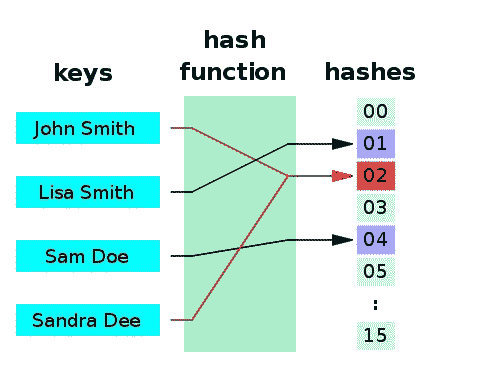

# 了解为什么向量结束了，为什么散列是人工智能的未来

> 原文：<https://www.algolia.com/blog/ai/vectors-vs-hashes/>

人工智能已经建立在向量算术的基础上。最近的进展表明，对于某些人工智能应用程序来说，这实际上可以被其他二进制表示(如神经散列)大大超越(内存、速度等)，而不会有显著的精度损失。

一旦你研究了像神经散列这样的东西，很明显，人工智能的许多领域可以从向量转移到基于散列的结构，并引发人工智能进步的巨大速度。这篇文章简要介绍了这背后的思想，以及为什么这最终会是一个巨大的转变。

## **哈希**

***散列函数**是可以用来将任意大小的数据映射到固定大小的值的任何函数。哈希函数返回的值称为哈希值、哈希代码、摘要或简称为哈希。*

你可以在这里阅读 [更多关于哈希](https://en.wikipedia.org/wiki/Hash_function) 。维基百科的例子如下图所示。

哈希对于权衡准确性、数据存储大小、性能、检索速度等等非常有用。

重要的是，它们本质上是概率性的，所以多个输入项可能共享相同的散列。这很有趣，因为核心的权衡是放弃较慢的准确性，以获得极快的高概率。这里的类比将是在 1 秒钟的飞行到你在世界上任何城市选择的郊区的某个地方和 10 小时的旅行把你放在你选择的城市中你想要的确切的房子之间的选择。前者几乎总是更好，因为在 10 小时内在一个郊区内导航是小菜一碟。

当考虑向量时，浮点是首选的数据表示。尽管它们在本质上比散列更绝对，但它们仍然不精确。更多关于下面的浮动…

## **花车**

为了理解人工智能，你需要理解计算机是如何表示非整数的。如果你还没有读完这个， [你可以在这里读一下](https://en.wikipedia.org/wiki/Floating-point_arithmetic) 。

浮点数的问题是它们占用了相当大的空间，计算起来相当复杂，而且仍然是近似值。看 [抢长枪谈一个 bignum 计算器](https://youtu.be/PXoG0WX0r_E) 大概是我第一次多想。从那以后我一直很困扰。谢谢罗柏😁。

对于对模型预测几乎没有影响的微小数值变化(相对于矢量计算),二进制表示也可能有很大不同。例如:

取 0.65 对 0.66，在 float64 (64 位浮点)二进制中可以分别用这两个二进制数表示:

111111111001001100110011001100110011001100110011001100110011001101

11111111100101000111101100001010001111011100001011000010100011111

这不容易看出来，但是仅仅 1%的数值变化，几乎有一半(64 位中的 25 位)是不一样的！从向量的角度来看，在矩阵计算中，这两个数字非常非常相似，但在底层的二进制中(所有繁重的工作都在这里进行)，它们是两个不同的世界。

我们的大脑肯定不是这样工作的，所以它们显然不会使用浮点二进制表示来存储数字。至少对于神经元来说，这听起来是一件奇怪的事情，除了有 [的人可以记住圆周率](https://www.livescience.com/amp/50134-pi-day-memory-experts.html) 的 6 万多位小数，所以也许我根本不知道。但是说真的，我们的大脑是视觉的，视觉上我们大脑的神经网络非常擅长处理代表强度的分数。但是当你想到半杯或四分之一杯时，我敢打赌你会立刻想到半杯或四分之一杯，或者比萨饼或其他东西。你可能没有想到尾数和指数。

一个常用于加快浮点计算速度和使用更少空间的想法是将分辨率降至浮点 16 (16 位)甚至浮点 8 (8 位)，这样计算速度会快得多。缺点是分辨率明显下降。

*所以你是说浮点运算速度慢/不好？*

不完全是。事实上，这是一个人们花费了毕生精力的问题。芯片硬件和它们的指令集被设计成使这更有效，并有更多的计算并行处理，以便它们可以更快地解决。GPU 和 TPU 现在也在使用，因为它们处理大量基于浮点的矢量算法更快。

你可以蛮力提升速度，但是你需要吗？你也可以放弃决心，但是你需要吗？无论如何，浮动也不是绝对的。这里不是说慢，而是说如何走得更快。

## **神经散列**

因此，像对 [位集](https://en.wikipedia.org/wiki/Bit_array)进行 XOR 这样的二进制比较可以比基于浮点的运算快得多。那么，如果您可以在一个对位置敏感的二进制散列空间中表示 0.65 和 0.66，会怎么样呢？这能让模型在推理方面更快吗？

*注意:看单个数字是一个人为的例子，但是对于包含许多浮点数的向量，散列实际上也可以压缩所有维度之间的关系，这就是神奇之处。*

原来有一个哈希算法家族可以做到这一点，叫做[【LSH】](https://en.wikipedia.org/wiki/Locality-sensitive_hashing)。原始项目越接近，它们的散列中相同的位就越接近。

这个概念并不新鲜，除了新的技术有更多的优势。历史上，LSH 使用过类似于 [随机投影](https://www.cs.cmu.edu/~wcohen/10-605/randomized-algs-3-lsh.pdf) 和 [量化](https://learning2hash.github.io/base-taxonomy/quantisation.html) 的技术，但是它们的缺点是需要很大的哈希空间来保持精度，所以其好处多少被否定了。

对于单个浮点来说微不足道，但是对于高维度的向量(很多浮点)呢？

因此，使用神经散列(或有时称为“学习散列”)的新技巧是用神经网络创建的散列来取代现有的 LSH 技术。可以使用非常快速的 [汉明距离](https://en.wikipedia.org/wiki/Hamming_distance) 计算来比较得到的散列，以估计它们的相似性。

这起初听起来很复杂，但实际上并不难。神经网络优化散列函数:

*   与原始矢量相比，保留了几乎完美的信息
*   产生比原始矢量尺寸小得多的散列值
*   计算速度明显更快

这意味着你得到了两个世界的最好的东西，一个更小的二进制表示，可用于非常快速的逻辑计算，几乎没有改变信息分辨率。

## **用例**

我们正在研究的原始用例是用于密集信息检索的近似最近邻(ANN)。这个过程允许我们使用向量表示来搜索信息，因此我们可以找到概念上相似的东西。因此，哈希中的位置敏感性如此重要。我们现在更进一步，更广泛地使用散列来快速和近似地比较复杂的数据。

## **密集信息检索**

你能想到多少数据库？可能很多。搜索索引怎么样？可能很少，而且大多数都是基于同样的旧技术。这很大程度上是因为历史上语言是一个基于规则的问题——记号、同义词、词干、词汇化等等占据了非常聪明的人的整个职业生涯，而他们仍然没有解决。

拉里·佩奇(谷歌创始人)曾说过，在我们的有生之年，搜索不会是一个已经解决的问题。想一想，一代人最伟大的思想，字面上几十亿美元的投资，它不太可能被解决？

主要由于语言问题，搜索技术已经落后于数据库，然而在过去的几年里，我们已经看到了语言处理的一场革命，而且这场革命还在加速！从技术的角度来看，我们看到基于神经的散列法为新的搜索和数据库技术扫除了障碍(包括我们在 Algolia！).

如果这引起了你的兴趣，可以考虑提交一份简历——！如果你正在研究基于散列的神经网络和索引，我很想听听你对下一步的想法！可以在推特[@ hamishogilvy](https://twitter.com/hamishogilvy)上找我。