# 视觉购物和发现:图片搜索改变了网上购物

> 原文：<https://www.algolia.com/blog/ai/visual-shopping-visual-discovery-how-image-search-is-changing-online-shopping/>

科技继续改变着商业。最近的例子是 *视觉购物* ，这是一种快速增长的在线功能，它利用图像识别和机器学习技术来创建强大的视觉图像搜索和发现体验。

智能手机和在线照片共享，结合机器学习和图像识别技术，推动了视觉搜索。在技术上，视觉搜索被称为图像识别，或者更广义地说，计算机视觉；但更常见的是，它被称为按图像搜索和反向图像搜索。

直到最近，构建这种功能的选择还很有限。谷歌和必应都为商家提供了强大的视觉图像搜索。然而，借助新的 [矢量搜索](https://www.algolia.com/blog/ai/what-is-vector-search/) 技术，任何公司都可以构建图像和视觉搜索解决方案。

### 如果你渴望了解视觉搜索是如何工作的…

本文的第二部分概述了图像识别背后的 AI/ML 技术，描述了使机器能够学习照片内部内容的机制。我们展示了机器如何根据最基本的特征分解图像，然后混合和匹配这些特征，最终根据相似性对图像进行分类。我们将描述神经网络的过程，或者更具体地说，卷积神经网络(CNN)，它在图像识别领域非常突出。

但是首先，我们想更直观地向你展示视觉购物——一个实用人工智能的完美例子——是什么样子的。

## 第一部分——什么是视觉购物？它是游戏规则的改变者吗？

机器可以从大量的图像索引中发现产品的图案和组合，从而产生一个 *完整的外观* 特征。完整的 Look 功能可以从社交媒体照片中检测模式，并了解哪些风格的衣服、帽子、眼镜、包和鞋子一起出现。这些产品因其在现实世界中的穿着频率而成为“一种外观”。

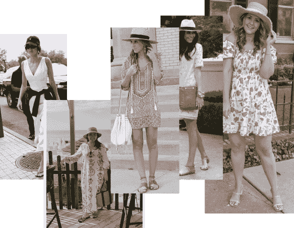

*大量共享的网上图片，其中女性穿着特定的服装组合，可以转化为你的网上商店可以推荐的造型。*

有几个理由认为视觉购物是游戏规则的改变者:

*   图片细节丰富，作为搜索输入更精准。图像到图像的比较成功地匹配复杂的对象(古董吊灯，优雅的礼服)。
*   方便移动用户。视觉购物分为两步:拍照，上传到你的商店。
*   照片在社交媒体上的广泛使用。现在，您可以粘贴在社交媒体上看到的照片，开始购物。
*   图片最适合一些专业行业(如家居、时尚、艺术品)，或者像 Etsy 和易贝这样的大型客户对客户市场。
*   正如您将在下一节中看到的，图像识别和机器学习已经增强，甚至发明了新的功能，如完成外观和上下文购物。
*   外语。我们不再需要说网店的语言。图片可以帮助非母语人士像母语人士一样进行搜索。

最基本的，图片搜索是文本搜索的替代。图像帮助用户用视觉例子而不是文字来查找和浏览产品。鉴于机器比较两幅图像的独特能力，图像搜索可以产生令人惊讶的相似性和推荐，并可以有许多现实世界的应用——不仅仅是在商业领域。仅举几个电子商务之外的例子:医生比较 x 光或受伤的照片，建筑师寻找相似的桥梁或房屋。

## 你能用视觉购物和视觉发现做什么

### 1——视觉购物中的精准匹配

智能手机已经成为第二只眼睛，机器学习模型可以利用世界上智能手机照片的丰富程度来指导网购者找到他们想要的。说 *确切的说* 一点都不夸张。

考虑在某人家中随机看到的一个非常旧的吊灯:

【T2

现在，消费者可以输入一个非常详细的描述，如“吊灯、黄金、古董烛台、链条、pendalogue”，但这需要高超的搜索技巧。他们需要将常识词汇(吊灯、黄金、古董)与更多的技术术语(烛台、链条、吊灯架)结合起来。这里有几个挑战:

1.  买家需要知道这些术语
2.  卖家需要使用这些确切的术语(或同义词)才能进行搜索
3.  搜索词的数量很长，不方便，也不一定成功

很有可能如此详细且可能不正确的一组单词不会得到任何结果——即使该商品在该网站上有售！

输入图像。通过图像识别，公司可以构建应用程序，将上面的照片与其搜索索引中所有相同的照片和描述进行匹配。最好的 ML 模型可以实现高水平的准确性(在某些情况下，[92%](https://thedatafrog.com/en/articles/dogs-vs-cats/)和[99%](https://thedatafrog.com/en/articles/image-recognition-transfer-learning/#:~:text=Modern%20convolutional%20neural%20networks%20such,with%20an%20accuracy%20over%2099%25.))，其中每个重要的细节都很重要，从而使搜索引擎能够检测到精确匹配:

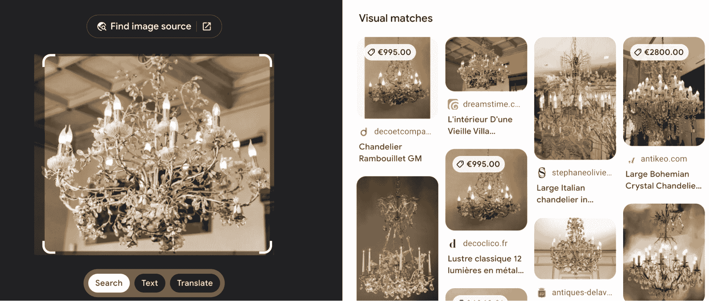

### 2–视觉购物中的相似性匹配

在寻找吊灯的同时，你可能也想找到相似的风格。机器不仅可以学习*匹配图像的*元素，它们还可以使用这些相同的元素对图像进行分类或聚类，以便它们可以推荐 *相似的* 图像。图片搜索扩大了推荐的可能性。

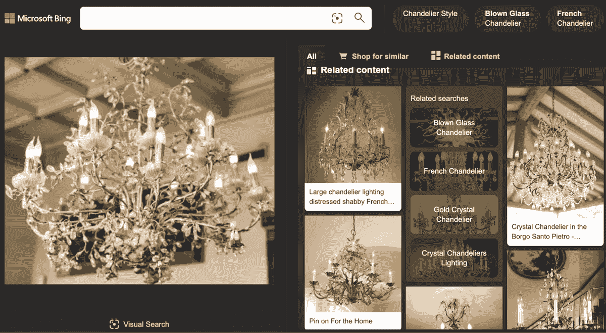

必应提供精确和相似的视觉购物。在这张图片中，Bing 显示了完全匹配的照片，但它也给了用户许多方法来扩展他们的搜索，其中有*facets*(棕色玻璃，法国风格)和 *相关搜索* (搜索棕色、法国、水晶、灯光)。方面和相关搜索之间有一个重要的区别:选择一个方面会减少当前的搜索结果，只显示那些匹配所选方面的项目；相关搜索会执行新的搜索，从而找到原始搜索可能未检索到的项目。图像搜索可以增强这两个发现选项的能力。

### 3–检测用于搜索和推荐的属性

让我们以时尚为例。时尚网站可以以超出精确匹配和相似匹配的方式利用图像识别；它们可以匹配颜色、样式和类别。考虑一张穿着时髦的红色运动鞋的女人的照片。

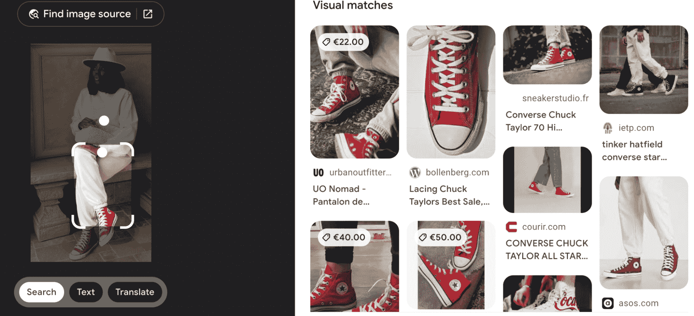

*在这里，谷歌的图片搜索找到了完全匹配以及不同颜色和风格的类似物品。*

*一个技术瞬间:*这是怎么回事？在[第二部分](https://www.algolia.com/blog/ai/visual-shopping-visual-discovery-how-image-search-is-changing-online-shopping/#visual-shopping-part-2)中，我们将深入探讨机器如何检测属性的细节，但总的想法是，人们*给图像*加标签，以帮助机器对图像进行分类。他们不仅需要标注某样东西是什么(运动鞋)，还需要标注它的属性(颜色、尺寸、形状、上下文用途等等)。一旦机器学习了一个对象的属性，它就可以将这些信息输入到推荐模型中，以产生上述推荐。

区分物体及其属性是机器学习的核心。标签是做到这一点的一种方法。但是，机器也可以在不标记的情况下区分*——通过自己检测属性而不命名。例如，机器可以根据区分红色和其他颜色的像素值来检测“红色”图案；并且它可以开始将“红色”对象放入“红色”组。它还可以通过检测形状来分组:鞋子的像素模式不同于其他物体，跑步不同于站立。它还可以在不命名的情况下检测“运动鞋”。然后，它可以使用这些像素模式将所有这些未命名的对象分类成组，并推荐形状或颜色相似的项目。我们将在第 2 部分讨论这一点。*

### 4–裁剪图像以实现更精确的匹配

下一个例子也向我们展示了裁剪功能如何使搜索更加强大。通过移动作物，您可以切换搜索。

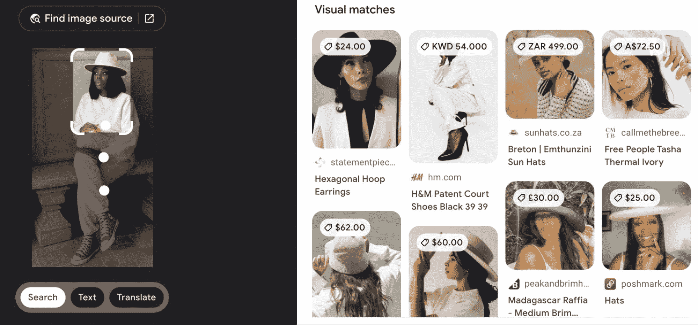

通过移动裁剪，您可以开始获得慢跑者和运动鞋组合的报价。

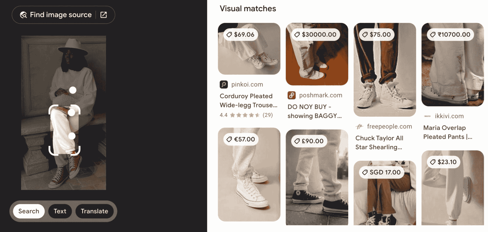

将作物向上移动一英寸，你会看到穿着各种鞋子的慢跑者，与上面的不一样。

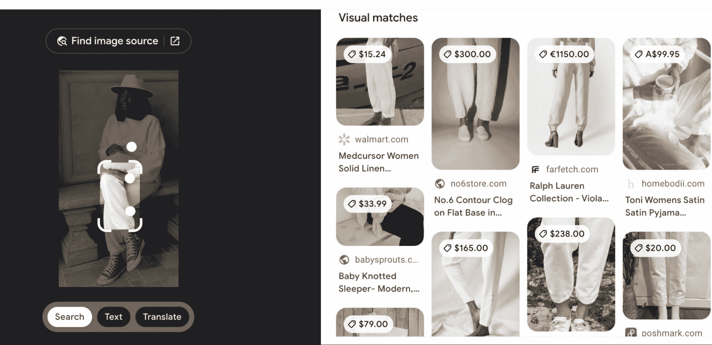

正如这个例子所展示的，[视觉购物](https://www.algolia.com/search-inspiration-library/visualize-results-as-users-search-desktop-sports-goods-retailer/)可以是一个视觉发现过程，用户可以移动图片来帮助他们立即发现完整的在线目录。

### 5–视觉购物风格建议–完善外观并添加背景

我们在上面看到了这张图片，它展示了完成一个造型的想法。

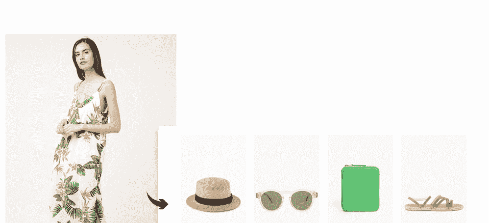

底层机制依赖于一种已经讨论过的技术:图像分类和属性提取，并增加了另一种:检测图像中的多个对象，并找到“频繁穿在一起”的模式。换句话说，如果这些项目频繁地一起出现在你的照片索引中，那么机器就会学习它们构成一个“外观”。

网上家居设计商店也能从同样的功能中获益。它可以使用图像来提出完整的家居装饰，以及推荐装饰中的单个产品。

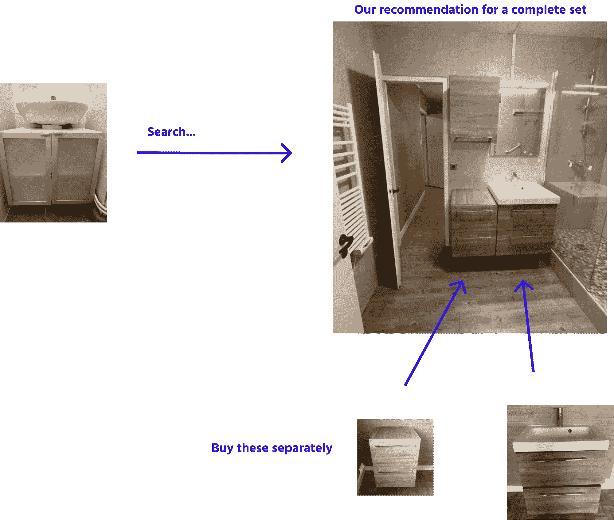

*   **当场，上下文购物**

你还可以更进一步，根据图片的背景推荐有意义的产品。夜总会中的图像会产生与森林中的图像不同的推荐。在这个场景中，*背景*为系统提供了另一组线索或属性来构建它的推荐。

一个男人出去跳舞，很欣赏朋友选择的衣服的风格。他想要类似的东西，所以他拍了张照片并上传到一个时尚网站。结果包含许多不同的服装，都与图像中男子的外套相似。但是时尚网站也可以考虑到照片的**语境，比如派对或者夜店。 网站然后可以推荐 *晚上* 穿。这可以称为 **语境购物** 。语境就是背景。如果这个男人在跳舞或坐着，也许这些建议会改变。**

 **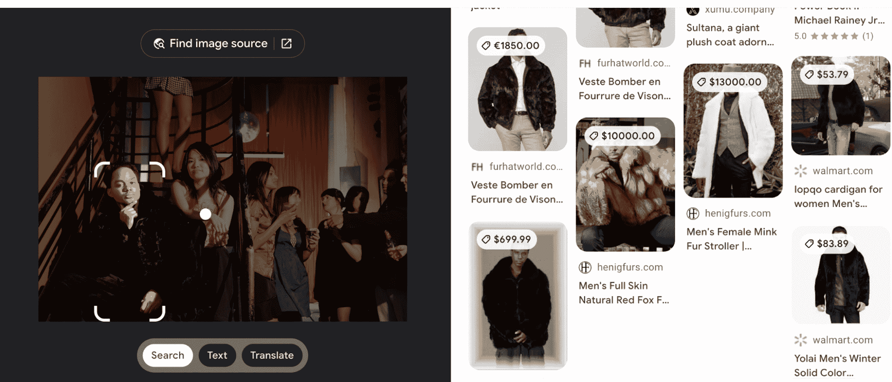

### 那么，搜索栏呢？是不是已经不需要了？

图片搜索并没有取代搜索栏。关键词搜索的本质——单词匹配——对于搜索和发现仍然至关重要。大多数搜索只需要一个或几个关键词就能找到你要找的东西。

首先，并不是每个人都拥有智能手机或拍照。此外，对于那些喜欢文字胜于图像、认为思考和打字是搜索和浏览的最佳方式的人来说，搜索栏将永远是最直观的工具(尽管语音搜索有可能取代打字)。此外，机器学习和语言处理的进步使得关键字搜索和神经(基于 ML)搜索成为强大的混合搜索和发现体验。

最后，这两种方法——图像 *和* 关键词搜索——形成了一种强大的组合。

在机器学习中，我们用“feed”这个词来表示“输入”——我们 *将* 图像馈入机器，教它们如何看。人类也通过图像来理解世界。从史前到现在，人类对环境的认识开始于只认识简单的形状，并发展到更复杂的物体表征。一个孩子遵循同样的进程。正如你将在下面看到的，机器也从最简单的形状开始——几何图案。

机器学习的 *技术* 也从识别简单的几何形状发展到了更细致的。今天，机器几乎可以像人类一样理解现实世界的细节。

### 快速历史

为了解释机器如何识别图像，我们只能追溯到 20 世纪 50 年代，当时神经科学生物学家从理论上解释了大脑如何看待图像。大脑从简化和抽象开始，只看到线条的变化，比如它们的大小、方向以及它们是直的还是弯的。

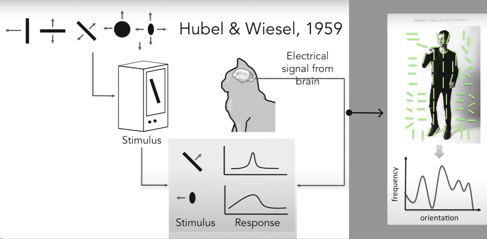

受到这个出发点的启发，工程师们实现了同样的抽象过程。**线条或边缘识别**已经成为计算机视觉的基础:

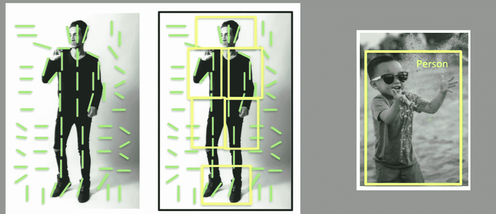

如你所见，几何起着核心作用。它从简单的特征，如直线、曲线、立方体和球体，到数百或数千个特征，代表深度、纹理、材料，最终是现实世界中可以检测到的一切。因此，毫不奇怪，几何数学(例如，余弦和矩阵)在机器学习中起着关键作用。

虽然机器学习技术的每一项进步都至关重要，但图像识别的广泛使用来自于它对 *和 *名称* 对象进行分类的能力。识别图像之间的模式以及相似性和差异使得能够对对象进行分组(聚类)。但这还不够，还需要对物体有*的含义*:汽车需要从红灯中分辨出人。由此可见，图像的明确命名和标注[语义](https://www.algolia.com/blog/ai/the-past-present-and-future-of-semantic-search/)分类是 *图像分割(分类)* 的核心，也是 *图像理解**图像匹配* 的核心，后者是我们的主要课题，视觉搜索。*

总而言之，机器学习的历史已经将计算机视觉从初级阶段带到了现实阶段。机器可能已经比人类看得更清楚:

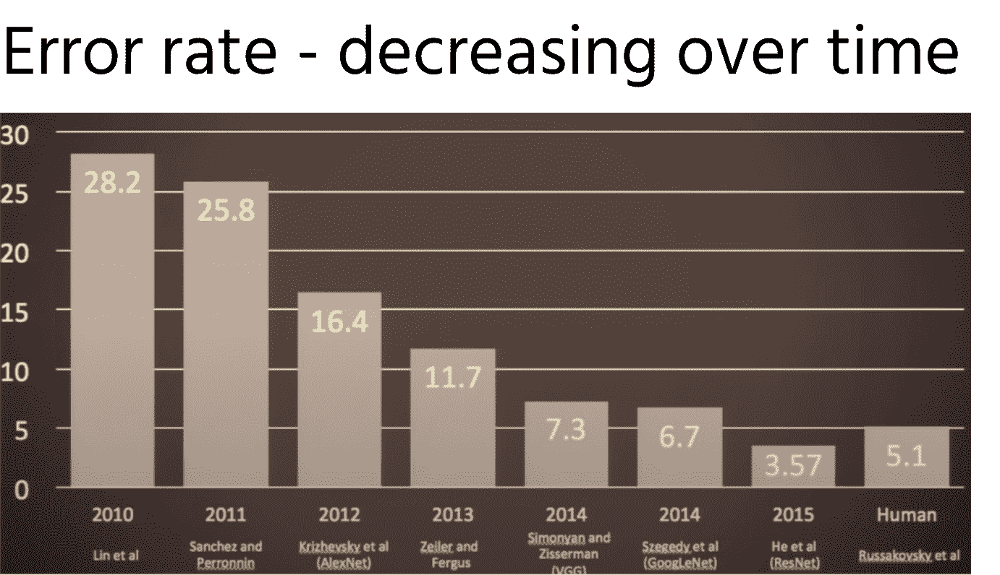

但是因为机器实际上并不像人那样理解 *物体，所以机器错误与人为错误不一样……或者说它们是吗？你能认出这只可爱的小狗吗？你花了多长时间？*

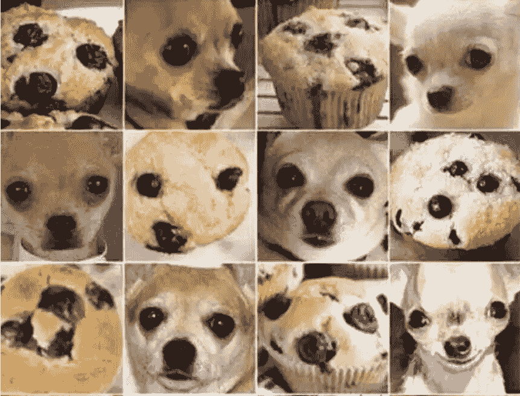

### 大图像数据——数量***质量***

 *在机器学习中，数据的重要性怎么强调都不为过。在图像识别的例子中，图像的大规模增长(每天数十亿)使机器达到了成熟，正如本文第 1 部分中的用例所证明的。原因有二:质量和品种。

图像的高清质量，以及允许任何人拍摄高质量照片的智能手机技术，极大地改变了光学识别技术。

得益于如此丰富的高质量图像，机器学习工程师已经能够创建基准图像数据集，如 ImageNet，它包含超过 1400 万张各种各样的图像，所有图像都进行了分类和命名:

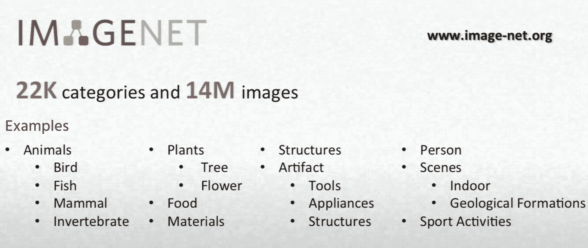

为什么这个免费的数据集如此重要？因为来自世界各地的工程师可以使用相同的图像索引作为基准来测试他们的模型。这些图片是经过精心挑选的。它们质量很高，并且包含一定程度的多样性，这对于机器学习来说是必不可少的。高质量的图像有助于更高效、更准确的学习。而且，正如您将在下一节中看到的，*多样性*确保了学习的广度，它使机器能够理解现实世界中存在的细节和内容的变化。

要理解变化的重要性，有必要进入过度和欠适应的主题。

### 变化——找到合适的契合点:避免过度契合和不契合

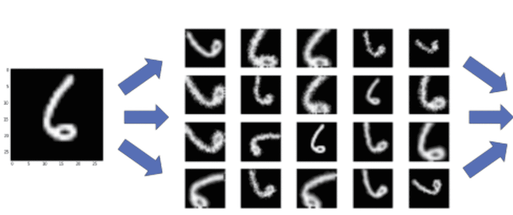

你需要给机器输入各种各样的手写 6，它才能学会识别所有的手写 6。

机器通过我们输入的特征来学习。但是我们需要给它一些真正有所作为的功能。如果你喂它一件外套，你需要用几种不同的方式喂它在同一件外套上:扣上和解开，熨好和揉皱。这种多样的特征称为拟合。

**装配不足**

机器需要足够的信息来做出有用的区分。如果我们仅仅给它一个虎、猫、马、狗的轮廓，它会把它们都归入一类动物。轮廓不包含足够的信息来区分动物(狗=猫)或物种(蓝鸟=鹦鹉)。轮廓包含的信息只够区分两足和四足动物与鸟类和鱼类。

**正确安装**

我们给计算机提供的细节(特征)越多，它就越能发现相似之处和不同之处。添加特征，引出体重、力量、鼻子形状、眼睛和多种皮肤和毛皮的想法——这样的细节可以帮助区分猫和狗、山羊和绵羊、蓝鸟和鹦鹉。添加额外的特征也是很好的，比如姿势、视角和表情，给坐着的狗和站着的狗，或者悲伤的狗和愤怒的狗赋予意义。

**过度拟合——让一切变得有意义**

然而，有一件事，就是给出太多的细节。有一个专家 如果我们将数百万张照片输入电脑，并要求电脑考虑每一个重要的细节，这可能会扭曲我们的分类或简单地过度描述我们的动物。每只蓝鸟都会自成一类。我们将失去计算机实际学习有用信息所需的所有区别。

您可以通过将一些细节视为噪声来解决过度拟合问题。下面是两个常见的噪声例子:

*   **糟糕的摄影。** 曝光不良不应视为特征。一张曝光过度的 1000 只蓝鸟的黄色照片会扭曲蓝鸟的识别，除非计算机可以消除曝光的噪音。
*   **视角变化** 。一张比格犬看着相机的照片和一张它侧面的照片不应该消除有一个单独的比格犬类的重要性。如果小猎犬在奔跑——你需要问问自己 *奔跑* 是否是一个重要的细节，从而创造出一个奔跑与不动的狗的类别。

### 使用正确的图像–每个应用一个模型

最后提到的这个例子，一只奔跑的狗和一只不动的狗，带给我们这个结论:学习过程的最终目标决定了你需要多少信息和细节来实现这个目标。图像识别依赖于太少和太多信息之间的平衡:如果运动对您的应用程序很重要，那么您的图像索引必须包含各种运动——不仅仅是行走和跑步，还包括跑步者的视角、上坡和下坡、不同的步态等等。如你所见，挑选合适的图片并不是一项简单的任务。

因此，您希望使用与您的应用目标相关的图像来定制您的模型。对于这篇博客，上下文是 **视觉购物** 。商业目标将明显不同于科学目标:蓬松狗和细毛狗之间的特征差异可能是一家出售狗外套的企业所需要的；但是研究狗的科学家显然需要更多的细节来研究每一种狗。

因此，时装店将专注于服装；家居用品商店储存了所有与设计家居内部相关的东西。但在所有情况下，合适的原则——而不是不合适或不合适——都适用。

## 机器如何学习识别图像？

我们(终于)来到了让这一切成为可能的人工智能技术。

机器使用数字、统计和深度神经网络来*参见*。这意味着图像的像素被转换成数字，称为*向量*，然后被馈入一个复杂的软件过程，称为神经网络，或者更准确地说，称为 **回旋神经网络(CNN)** 。

CNN 使用一系列被称为 *模型* 的统计函数，不断计算和重新计算数字 的像素化向量，直到图像被机器准确识别和分类。

学习部分是当数以千计或数百万计的图像被输入到网络中时，模型本身正在适应图像，自我校准，并经历其自身数字的微小变换，称为 *权重* 。完成的模型已经将其所有的权重设置到近乎完美的平衡，可以准确地识别(几乎所有)未来看不见的图像。

让我们潜入更深的地方。

### 将像素转换成数字和矢量

如前所述，机器将像素转换成矢量，矢量是一系列数字。向量代表一定范围的像素-黑白的灰度等级，或彩色的三维 RGB 等级-其中向量中的每个数字(像素)都在灰度或彩色等级内。例如，灰度模型可以从 0 到 1 改变数字(从无强度到高强度)。该模型还可以使用 0 到 1 的范围来捕捉完整的颜色光谱。

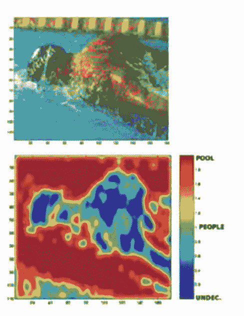

一旦建立了向量，学习过程就开始了。

总体思路是将向量输入到模型中，并在它通过网络时转换其数字。网络由多层组成，每层将矢量数字解释为代表一个 *特征* 。每一层都添加了为图像添加更多细节的功能。特征的数量称为一个 *尺寸* 。这里有一个图像，它给出了添加特征(或参数)如何帮助机器学习图像内容的想法。

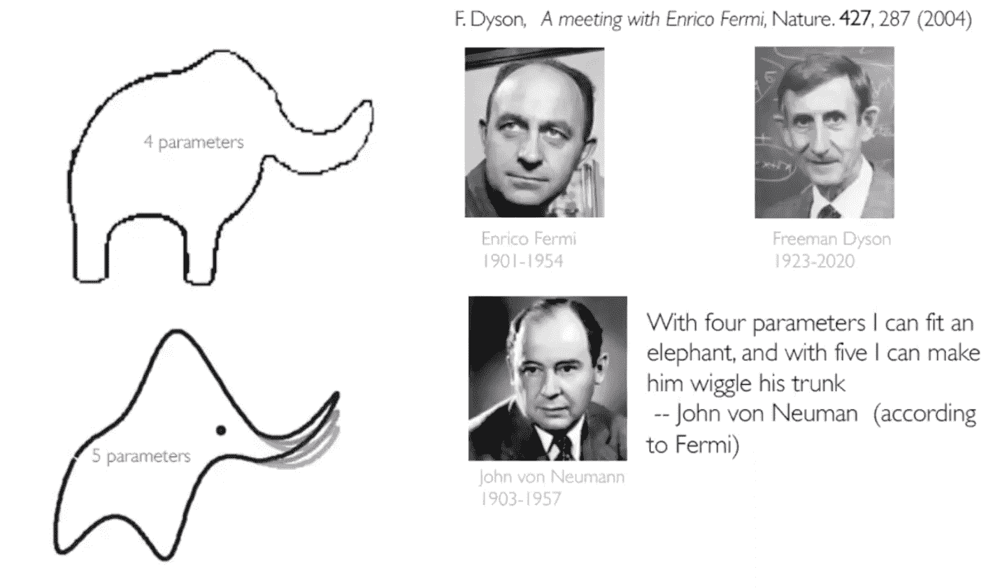

假设第 1 层看线条或边缘(直的或弯的)。第二层然后将两条线或更多的线放在一起，并寻找角度。第三层将形成正方形和圆形。以此类推——第 4 层到第 n 层添加越来越多的特征(纹理、姿势、视角、颜色),直到网络识别出足够多的特征来输出可以正确分类的重建图像。

当然，一台机器 看到的线条、方块、纹理，以及鼻子、脸、电视机等物体与我们不同:

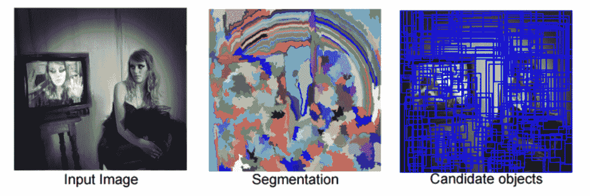

### 关于学习的一句话——用不用标签

我们在这个博客中的模型依赖于 *监督学习* ，它使用带标签的图像来帮助分类图像，并测试建模过程的成功。明确地说，当机器处理每张图像时，它会将输出图像与一堆标签进行比较，包括输入图像的标签。机器必须猜测每个图像的正确标签，才能认为它 100%成功。没有机器能正确猜测每个标签。

图像也可以在没有标签的帮助下进行分类。这就是所谓的**无监督学习，它从输入到输出遵循一个相似的过程，但它不是使用标签来测试成功，而是使用一个统计的模型来确定是否对图像进行分类，或者聚类，具有很高的准确性。看看我们最近关于 [监督学习和非监督学习](https://www.algolia.com/blog/ai/an-introduction-to-machine-learning-for-images-and-text-now-and-in-the-near-future/) 的区别的博客。**

 **### 回机

流程是这样的。下面这张照片，名为 [莱娜](https://the.me/the-story-of-lena/) ，是瑞典模特 [莱娜·佛森](https://en.wikipedia.org/wiki/Lena_Fors%C3%A9n) 。自 1973 年以来，Lena 一直被用作数字成像处理领域的标准测试照片。

如前所述，图像被转换成像素矢量。但是，机器并不看全貌。它从小开始，将图像分割成更小的向量，例如 5×5 的小部分。例如，一个 10×10 像素的小图像将被分割成 25 个更小的图像。

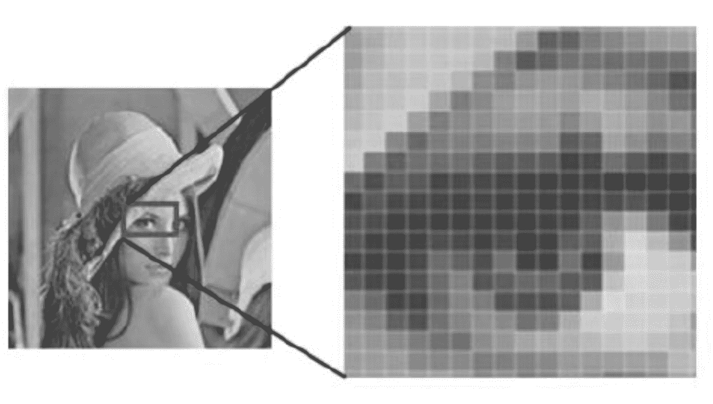

*将图像分割成小图像允许网络检查更小的像素矢量*

这样，网络不断地将小矢量转换成新矢量。

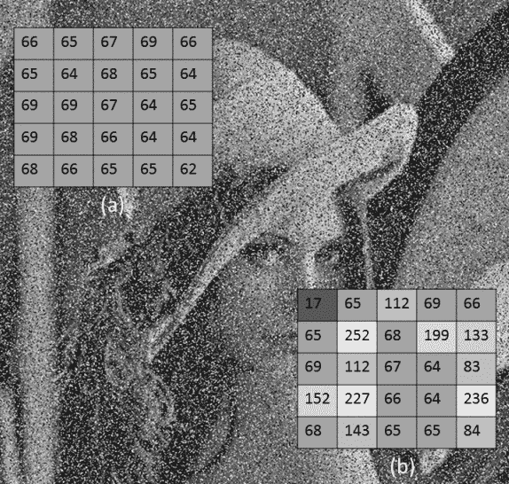

*将较小向量中的数字转换成新向量。这些变换由乘以数字权重的统计函数计算，从而将输入向量(a)变为输出向量(b)。*

输入的照片在通过第一层时，被转换成只显示其边缘:

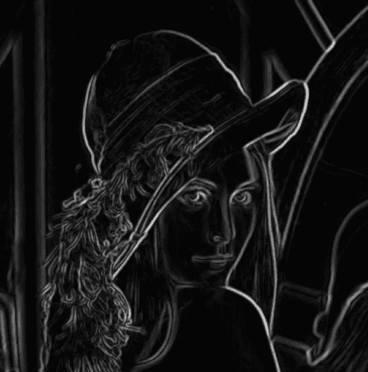

在接下来的层中，网络检测更多的特征，如纹理。

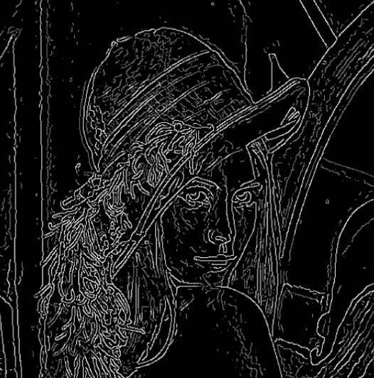

当向量通过网络时，向量被赋予更多的特征，直到过程结束时，有一个单一的、最终的向量代表图像的全部维度。但是我们不能证明这一点，因为事实上，神经网络的输出并不像我们所理解的那样。值得记住的是，向量只是一系列数字，因为计算机只知道数字，所以产生的“图像”看起来与我们看到或预期的完全不同。

### 答对了

那么，机器如何知道自己是对的呢？它将输入与预期输出进行比较。在带标签的监督学习场景中，网络将输入与所有带标签的图像子集进行比较，如果网络以很高的可能性猜测出正确的图像，那么我们认为机器已经学习了该图像。

要明白这一点，请看下面的[笔迹](https://medium.com/scisharp/convolution-neural-network-in-net-a1994dd1e236)例子。手写数字 7 被输入到网络中，并在最后与(非手写)标签进行比较。如果模型做出了准确的预测，那么你可以说机器已经学习了关于 *即* 的图像。该机器需要对许多图像继续这样做，直到它对几乎所有的新图像都获得高水平的成功。

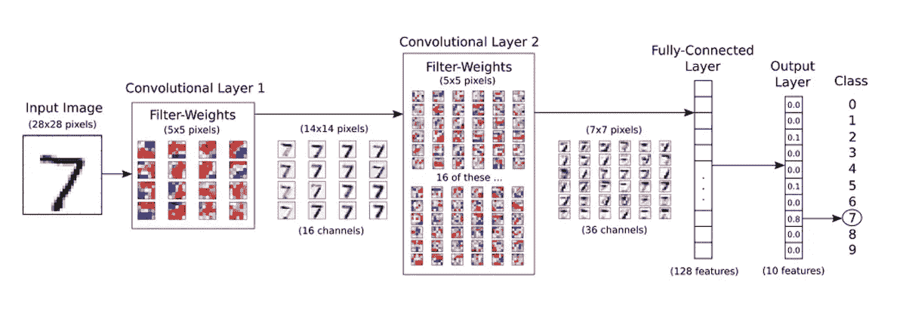

这是一个复杂的神经网络(CNN)如何模拟笔迹的例子。它基于 [*MNIST 数据集*](https://en.wikipedia.org/wiki/MNIST_database) *。可以看到，在最后，* ***输出层*** *代表的是图像。将该输出向量与 7 应该匹配的标签进行比较。这里，因为向量中的第 7 个元素具有最高值，所以模型已经准确地预测了该数字是什么。*

### 预训练模型/数据集–vgg 16

已经有许多模型被训练用于图像分类。使用 **预先训练的模型** 避免了重新发明轮子。使用预先训练的模型有很多好处:

*   不是每个人都有正确训练机器所需的数百万张照片
*   其图像包括高质量、标签清晰的照片
*   它包含各种各样的图像，适合任何用例
*   预训练模型已经过严格测试和基准测试，其预测精度已经确定

公司可以下载预先训练好的模型，它带有图像数据集及其所有计算出的权重。公司可以将这些数据应用于[构建独特的图片搜索](https://www.algolia.com/blog/product/picture-search-how-does-an-image-finder-search-engine-work/)解决方案。然后，他们可以使用自己的内容进一步训练模型。进一步的培训会根据公司独特的数据和业务用例来调整和定制模型的权重。

**视觉购物是游戏规则的改变者**由于致力于推动实用人工智能边界的科学家、工程师和零售商的创造力和辛勤工作，视觉购物继续向前发展。*****