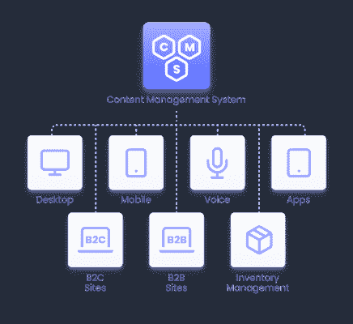

# 什么是无头 CMS(内容管理系统)？

> 原文：<https://www.algolia.com/blog/product/what-is-a-headless-cms-content-management-system/>

无头 CMS 这个词听起来很搞笑吧？毕竟，在人类中，头部是控制中心——大脑——而身体只是对头部的想法和冲动做出反应。

因此，无头内容管理系统(CMS)的想法看起来像是某种未锚定的东西……一只被砍掉了头的科技鸡。而一个无头模型会唤起更奇怪的意象，因为一个运行良好的无头 CMS 在头部并不缺乏；它通常长着多个脑袋，就像一个长相吓人的 [九头蛇](https://en.wikipedia.org/wiki/Lernaean_Hydra) 怪物。

尽管如此，从优化内容交付的角度来看，无头模型是目前最有意义的。这是因为 headless CMS 的优点和主要优势在于它可以容纳多种类型的内容呈现平台，如网站、手机、CRM 和智能手表。

## 【政法委书记】(传统)CMS 的演变

标准 CMSes(也称为“耦合；例如，WordPress)在万维网首次亮相后首次亮相，通过让公司使其网站内容更容易管理来赚钱。

传统的 CMS 既有后端(“主体”；内容储存库)和前端(“显示层”)，它们相互连接。It:

*   允许创建和更新内容
*   将内容存储在本地数据库中
*   为开发者提供了一种严格定义的方式来获取显示在前端的内容
*   不允许内容重新用于不同类型的演示(除非添加插件)
*   不一定能很好地与相邻的信息系统配合，例如产品数据库

总之，老技术。

哪些仍然有效，哪些许多公司仍然在使用，特别是如果他们不需要将内容发送到多个表示层。

但是内容传播的选择一直在扩大，公司已经开始关注【内容建模】。现在，除了通过浏览器提供的内容之外，它还可以被特别定制，以出现在其他设备和其他应用程序中。消费者希望在从智能手表到语音助手的各种设备上获取内容，当然，还有他们可信赖的智能手机。

## 什么是无头 CMS？

进入现代 [无头 CMS](https://www.cmswire.com/web-cms/13-headless-cmss-to-put-on-your-radar/) 。它的后端——创建、管理和存储信息的界面——与它的前端操作(信息显示的方式)是分开的。前端不与后端通信，只渲染内容。

虽然“headless”听起来确实像是丢失了一些重要的东西，但更多的智能功能可以弥补这一损失。

使用无头 CMS 架构你可以得到的一件事是几个“婴儿”头，负责引导内容到特定的地方。

hydra 怪兽还活着，而且活得很好:不是后端控制所有信息流向一个地方，即一个带有模板的网站，而是 RESTful API(或 GraphQL API)将内容释放到其他地方，如 iOS 或 Android 手机。它的读者可能在玩虚拟现实游戏或使用他们公司的客户关系管理(CRM)工具，以及其他数字体验。

因此，在这种模式中，内容出现的位置以及如何促进其呈现并不重要。相反，重点是让内容编辑者创建和协作提供结构化内容，这些内容可以根据需要提供给各种目标平台。

最终结果是:无论发生在哪里，读者都能获得出色的客户体验。

## 无头用例

正如内容管理顾问 Deane Barker 在[*CMS Wire*](https://www.cmswire.com/web-cms/with-content-delivery-what-goes-around-comes-around/)中指出的，无头(和“解耦”)架构已经存在了一段时间；助长“最新”无头热潮的是，公司现在需要将他们的内容交付到标准网络浏览器之外的平台。这要容易得多，而且事情可以进展得更快，没有不灵活的前端的限制。

无头 CMSes 用途广泛，因此被用于多种应用，例如:

*   网络应用
*   电子商务网站
*   [jam stack](https://jamstack.org/)工具，开发者可以使用这些工具来提高性能、降低扩展开销等等
*   静态站点生成器(如 Next.js)
*   Javascript 框架(如 Vue.js)
*   产品(想象内容被传送到商店中的数字信息亭)
*   服务(例如，语音助手)

## 为什么去无头？

无头模型到处都在推出，因为它可以轻松地将结构化内容分发到多个目的地。它是全渠道数字交付的首选工具，这是一种向客户提供内容的集成方式，就像集成的、响应迅速的、多接触点营销、销售和客户服务一样。

无头的好处是什么？可以:

### 授权内容创作者和编辑

在传统的内容管理系统中，作者和编辑依赖开发者来设计网站的内容界面。作者可以写，但是在显示结构到位(渲染)之前，他们不能发布。

当您丢失 CMS 的头时，您就不再需要呈现内容，这些内容将在堆栈中单独处理。

无头 CMS 的另一个术语是内容即服务(CaaS ),因为真正的无头 CMS 不会生成前端代码。这意味着没有代码与内容纠缠在一起，编辑不必为了让他们的内容在线而做任何编码。例如，他们可以专注于他们作为创造性内容提供者的角色和工作流程，而不需要任何 HTML 经验。如果他们注意到某个已经上线的东西出现了拼写错误，他们不必给开发团队发电子邮件要求他们修复，然后等待。它们是完整的。

当 CMS 的头被移除时，编辑并不是唯一的工作变得简单的人。营销人员和销售人员受益于无头 CMS 的内容独立性。他们不需要作为管理步骤与开发人员交互，这加快了他们的流程，并让他们在需要更改某些内容(如某个项目的价格)时立即做出反应。

对于非技术人员来说，另一个好处是拥有一个中央内容中心，他们可以在这里更新从死链到产品可用性的所有内容。当他们做出一个改变时，就是这样:每个内容呈现平台都被更新，这节省了大量时间。

无头系统中的这种角色分离也意味着员工和团队可以按照自己的节奏工作，而不是必须与开发人员通常僵化的推出时间表保持一致。

### 赋能开发者

如果编辑对 headless 感到兴奋，这是否意味着开发人员吃亏了？不管他们是专注于为 Web 还是移动应用程序创作，当使用 API 处理无头内容时，开发人员都会受益匪浅。

首先，他们获得了巨大的灵活性。他们可以自主选择自己喜欢的前端编程语言、工具和工作流程。在不搞乱 CMS 的情况下，他们可以互换部分技术栈，或者转换框架。

前端开发人员可以为各种渠道开发功能，而不管后端发生了什么。

开发人员可以只关注创造出色的用户体验，然后将一切交给适当的 API，继续做其他事情。他们可以处理应用程序，然后自由快速地部署它们。这是一次有益的经历，也可以节省大量的时间(和费用)。

### 成为真正敏捷的

编辑和开发人员不仅发现自己享受着无头 CMS 带来的新的独立性和权力，他们还发现无头模型改善了他们在需要联系时相互协作的方式。

一个集中、敏捷的无头工作环境意味着发布时间表可以更短，例如，因为当一个主内容项目被重新用于多个渠道时，没有耗时的内容重新创建。用户可以随时处理出现的需求。此外，在单一位置管理多渠道分发的内容意味着用户只需学习一次该系统。

### 移动更快

因为一个无头的 CMS 可以让编辑通过一个通用的界面轻松地改变不同内容类型的用途，这个过程被加速了。

您可以向频道添加内容，而不必先在网站上发布内容，从而节省时间。单个请求负责发布任务，从而减少了请求。随着请求的减少，响应时间可以缩短，从而形成一个更精简、更高效的企业。

您还可以更快地添加新频道，因为它们可能会从已创建的来源中提取内容。

### 提高安全性

砍头似乎会增加安全风险，但事实恰恰相反。为什么？

无头内容与表示层上发生的事情是分开的，所以存在风险的区域较小。前端的安全入侵无法访问独立的后端。如果网页上存在安全漏洞，它不会危及其他页面或网站功能。此外，潜在的黑客也没有办法访问门户网站并输入数据。

### 秤易

虽然传统的 cmse 在可伸缩性方面受到限制，但无头 CMS 意味着高可伸缩性(高可用性)。开发者可以快速添加新的频道，然后，当添加一个频道时，它可以有效地从中央 CMS 获取内容。有了从一个主源管理的无头 CMS，您还可以根据需要更改开发人员工具，然后将内容发送到高性能的基于云的托管和构建服务。

## 缺少无头成分:搜索

无头 CMSs 天生缺少的一个东西是集成的搜索功能。

如果你认为在一个无头的 CMS 解决方案上构建搜索并不容易，更不用说如今通常使用的复杂类型的搜索用户界面，那么你是对的。

幸运的是，从头构建的方法不是必需的。Algolia 提供了一个与 headless CMSes 集成的 API 插件，以提供灵活、功能丰富的搜索，让您智能和大规模地处理索引数据，并将其推送到任何 CMS、设备或端点。

通过利用[web hooks](https://en.wikipedia.org/wiki/Webhook)，你可以高效地将我们的 API 与一个无头 CMS 集成在一起。

如果你有网络服务器，你可以添加一个 API。

或者如果你在 Netlify 或者 Vercel(比如)上托管[Sanity Studio](https://www.sanity.io/studio)(开源)，你可以将 [Sanity.io 与 Algolia](https://www.algolia.com/blog/product/sanity-algolia-add-search-to-an-open-source-headless-cms/) 集成。其他选项有 [肯蒂科](https://medium.com/@petanx/how-to-build-powerful-search-into-your-website-with-algolia-and-a-headless-cms-ebf10bba9cd6) 和 [童话故事](https://www.storyblok.com/tp/headless-algolia-integration) 。

### 了解更多信息

当你获得了一流的搜索，你就准备好(为你的脑袋)出发了。

我们很乐意帮助您采用无头架构，为您的前端提供专业支持，优化您的内容创建和重复使用，并让您的系统经得起未来考验。在 Algolia 与 [美国](https://www.algolia.com/contactus/) 连线，让我们开始吧。