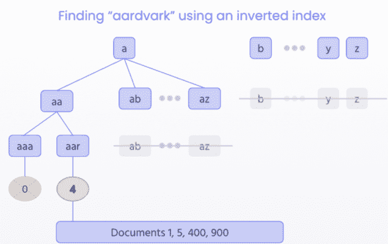

# 什么是搜索查询，它是如何处理的？

> 原文：<https://www.algolia.com/blog/product/what-is-a-search-query-and-how-is-it-processed-by-a-search-engine/>

`Where can I get ramen asap near me?`

`How many ants does it take to kill a human?`

`Check engine light youtube`

`What is the meaning of life?`

这些是典型的谷歌搜索；当人们试图驾驭日常生活的复杂性时，这只是他们心中许多担忧中的几个。

能够使用许多可用的搜索引擎中的任何一个进行网络搜索，无论是公共的还是私人的，已经改变了并且仍在深刻地改变着发达国家生活的许多方面。很难想象，在人们能够把自己粘在电子设备上，并即时谷歌搜索任何突然出现在他们脑海中的问题——紧急和关键的，或者随机和不重要的——之前，我们幸存了下来，或者我们没有无聊到流泪。

所以你可能知道什么是搜索查询(是的，你每天都要处理它们)。但是让我们回顾一下以防万一，然后进入第二个不太明显的部分，关于搜索查询是如何处理的。

## 什么是搜索查询？

如果你在想“某人用来提问的一串单词”，太棒了！

“查询”听起来很像“问题”它们有什么不同？

根据[WikiDiff](https://wikidiff.com/query/question#:~:text=As%20nouns%20the%20difference%20between,reply%20or%20response%3B%20an%20interrogative.)，一个查询确实是一个问题或者一个询问。那么，相比较而言，什么是问题？寻求信息的句子、短语或单词

根据这个定义，如果一个查询和一个问题听起来还是一样的话，你并不孤单。嗯。下一个查询，呃，问题:[WikiDiff 靠谱吗？](https://www.reddit.com/r/mildlyinfuriating/comments/7vrjqp/wikidiff_is_a_useless_website/) 也许不是。

无论如何，让我们回到搜索查询 101。搜索框中输入的搜索词数量惊人(通过使用数字语音助手和语音搜索应用)。Google processes [大概 10 万次](https://www.internetlivestats.com/google-search-statistics/) 搜索每一次 *第二次* 。这还只是谷歌。

人们在询问什么？主要是如何去网络上的某个地方，比如一个公司的主页；如何做某事，或如何(或在哪里)买东西。

据知情人士透露，搜索查询有三种风格。以下是你需要了解的三种不同类型的搜索查询:

### 导航搜索查询

这是指这个人脑海中有一个特定的网站(登陆页面或网站上的特定子页面，如 FAQ ),并打算去那里。也许他们知道(相对简单的)URL，但是懒得在浏览器中输入。也许他们正在浏览他们的社交媒体，看到了一个关于刷狗毛好处的对话，所以他们查询了当地一家宠物用品店的名称。他们可能不知道公司名称的确切网址或拼写，他们认为这样更容易查询。

导航查询有哪些例子？谷歌上排名靠前的只是“facebook”和“youtube”

### 信息搜索查询

正如这个人的名字所显示的那样，这个人正在寻找一般的指导、事实或数据——例如，如何做一些事情的步骤，比如烘烤一批红色天鹅绒蛋糕。

信息搜索可以表述为一个问题，比如“我如何回收一台冰箱？”或者“不含酒精的啤酒里有多少酒精？”，但也可以简单到一个词，如“拿铁”或“鹦鹉”

### 事务性搜索查询

是的，在这种情况下，这个人想在电子商务网站或实体店买东西。他们拥有所谓的“交易意图”使用搜索引擎优化(SEO)来定位关键词最适用于这种类型的查询，因为在数字营销中使用正确的词将使您的企业在人们的搜索结果中排名更高，并有可能带来更高的收入。

交易查询的示例:“购买布雷维尔浓缩咖啡机”、“iPhone 13 上的交易”、“最佳狗刷”。

## 一个搜索查询的旅程

当有人在搜索栏中输入搜索查询时，搜索引擎的“大脑”会发生什么？众所周知的内幕下发生了什么？

大多数搜索引擎解析查询，然后将其发送到索引服务器进行处理。

“有些搜索引擎可能会使用拼写检查或查询建议对查询进行“预处理”， (本质上是询问搜索者“你是说……？").

它与搜索引擎索引中认为相关的网页相匹配，并应用各种规则和参数。然后基于最佳相关性来确定搜索引擎结果页面(SERP)上的列表顺序。

为了想象这种机制，了解一个搜索引擎如何准备它的信息索引来被搜索是有帮助的。首先，“索引”是存储数据的地方。大多数搜索引擎以一种称为倒排表的结构化方式将数据存储在索引中。

对于即时信息检索，引擎反转逻辑并以“反向”流程构建索引。因此，它不是扫描文档寻找单词，而是将单词 *与单词* 进行匹配，以便定位文档。

下面是如何在这个模型中处理搜索查询:

正如你看到的，当你输入一个 *a，* 你会得到每一个以 a 开头的单词(并且每隔一个字母列被排除)。如果您不断向查询中添加字母( *aa、* ，然后是*AAR*)，每次添加都会缩小匹配范围。瞧，你最终会得到四个相关的搜索结果，它们会告诉你所有关于 [土猪 的信息。T34](https://www.google.com/search?q=aardvark&rlz=1C1APWK_enUS888US888&sxsrf=ALiCzsYJmptdYj8cn6RSXM8UdV4gvj6Jbg:1652915018217&source=lnms&tbm=isch&sa=X&ved=2ahUKEwjayoSklOr3AhWqoY4IHYudDS0Q_AUoAXoECAIQAw&biw=1584&bih=740&dpr=1)

请记住，因为不同的搜索引擎使用不同的专有算法，它们对相关术语的操作和排序都略有不同。另外，除了实际的搜索查询，搜索引擎可能会考虑其他相关数据来帮助它决定如何对结果进行排名，包括搜索者的:

*   **物理位置。他们在商场吗？**
*   **检测到的语言。西班牙语的查询值得西班牙语的搜索结果。**
*   **早先的搜索历史。他们之前是否在寻找同一类型的东西，只是不同的品牌或型号？**
*   **装置的类型。** 他们是在自己的 [手机上](https://www.algolia.com/industries-and-solutions/mobile-search/) ？

## 识别搜索者意图

对于每一个搜索引擎来说，关键是破译搜索者想要找到的要点。他们是想简单地了解一下加拿大的地理，还是对预订一次横跨加拿大的火车旅行感兴趣？他们想知道 *检查发动机* 灯是因为他们的车过热，他们被困在高速公路的中央隔离带上，还是因为他们只是好奇如果他们忘记安排一次推荐的调整，会发生什么情况？用户意图是什么？

因此，搜索引擎有点像试图读取搜索者想法的通灵者，只是它更像是科学家在尽可能快地浏览严格排序的清单。

当搜索引擎比较记录并计算排名时，它会问自己这样的问题:

### 查询中有错别字吗？如果有，一个还是多个？

[错别字的数量](https://www.algolia.com/doc/guides/managing-results/optimize-search-results/typo-tolerance/#typos-and-spelling-errors) 与排名有什么关系？错别字越少越好:

*   如果查询中没有任何错别字，页面内容 [排名比如果有错别字更高](https://www.algolia.com/doc/guides/managing-results/optimize-search-results/typo-tolerance/#impact-of-typos-in-the-ranking-formula) 作为匹配
*   为带有 *一个错别字* 的查询生成的内容比带有两个错别字的查询生成的内容排序更高
*   如果用户是一个草率的查询录入者，并且有 *三个错别字怎么办？嗯，他们可能会不走运，因为简单的文本匹配不能纠正拼写。*

### 查询第一个字母匹配吗？它是匹配整个单词还是仅部分匹配？

在 [前缀搜索](https://www.algolia.com/doc/guides/managing-results/optimize-search-results/override-search-engine-defaults/in-depth/prefix-searching/) 中，搜索引擎将整个查询与索引中某条记录的属性中的开头字符进行比较。比如，它把 *比作* 与 *最好的* 与 *披头四。* 但并不打散查询，以搜索*【b】*然后 *be、* 为例。

相关结果被生成为指示查询如何匹配内容中出现的短语的片段。

记录被分级为具有更强或更弱的相关性，这确定了从第一页开始的搜索结果的顺序。

查询上下文也起作用。为了评估上下文，搜索引擎问自己这样的问题:

### 查询中的单词是否匹配同义词？

如果是，搜索引擎将在排序过程中同等对待带有同义词的记录。例如，如果可用内容包含 *紧身衣* 但是搜索者要求 *紧身衣、* 他们将看到两者的搜索结果。

### 查询是否匹配记录的标题或描述？

使用 [可搜索属性](https://www.algolia.com/doc/guides/managing-results/must-do/searchable-attributes/) ，标题与查询匹配的项目排名高于与描述匹配的项目。

### 一件商品比另一件更受欢迎吗？

如果你有三条完全匹配的记录，那么搜索引擎会使用 [自定义排名](https://www.algolia.com/doc/guides/managing-results/must-do/custom-ranking/) 来添加“业务指标”,例如将销售额最高的记录、搜索次数最多的记录或最受欢迎的记录进行优先排序。如果两个记录匹配不同，则其他标准决定排名。

当一个有能力的搜索引擎绞尽脑汁、有条不紊地回答所有这些类型的问题后，它会列出相关的搜索结果。SERP 看起来确实像是一个精神科学家的杰作。更重要的是，搜索引擎做的关键工作是引导搜索者到一个网络目的地，用他们迫切问题的答案启发他们，或者指引他们在哪里可以买到产品。

例如，这里有一个 [伟大的答案](https://www.psychologytoday.com/us/blog/hide-and-seek/201803/what-is-the-meaning-life) 来自谷歌对“生命的意义是什么？”

## 最后一个查询:Algolia 的搜索引擎排名如何？

答:作为一个 [快](https://www.algolia.com/blog/product/what-does-near-real-time-mean-in-terms-of-search-and-discovery-on-websites-and-in-apps/) ，高级的搜索引擎，是遥遥领先的。我们先进的 [搜索 API](https://www.algolia.com/blog/product/site-search-and-apis-how-they-work-together/) 为数千家全球公司提供数十亿次搜索查询，即时提供相关结果(不到 100 毫秒)。

我们的客户喜欢它的一个原因是:我们使用一种 [平局决胜算法](https://www.algolia.com/doc/guides/managing-results/must-do/custom-ranking/#the-ranking-criteria) 来确保最佳搜索结果匹配首先出现。另外，我们的搜索功能是透明的。没有秘密，也没有复杂的公式；你可以看到方法和标准被用来寻找和排列你的内容。您可以根据公司的具体需求轻松配置搜索参数。

准备好了解更多信息了吗？ [向](https://www.algolia.com/contactus/) 索取我们搜索引擎的免费演示，我们很乐意向您展示您的能力！