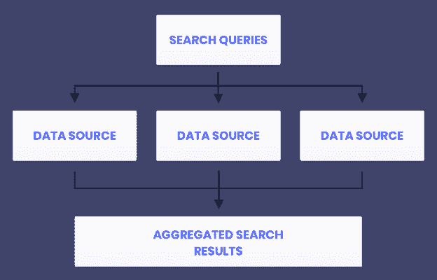
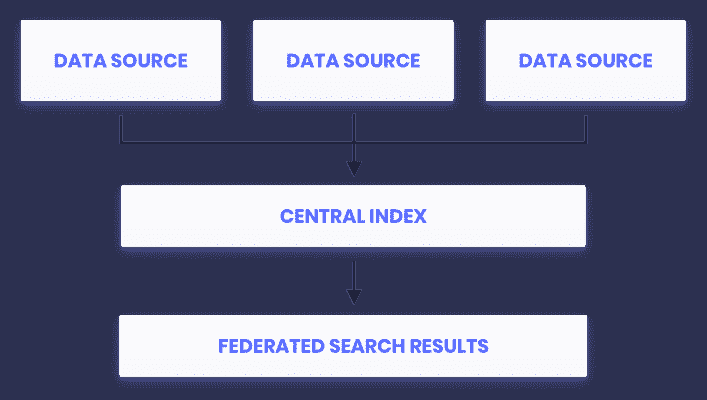

# 什么是联合搜索？

> 原文：<https://www.algolia.com/blog/ux/what-is-federated-search/>

如果你经营一家网站或企业，你知道新数据库、存储位置和产品目录的建立速度有多快。有了这种不断的积累，你如何确保你的客户总能在你的网站上找到他们想要的东西？您如何确保该解决方案对您的企业来说简单易行？

联合搜索是解决这两种需求的一种方式。通过允许用户同时搜索许多数据源和多种类型的内容，联合搜索改善了用户体验和参与度。同时，它可以让您的企业更轻松地管理数据和搜索工具。

## 什么是联邦搜索？

联合搜索是一种用于一次搜索多个数据源的技术。使用联合搜索，您可以通过一个查询和一个搜索界面从许多不同的内容位置检索信息。

你可能在没有意识到的情况下遇到过联邦搜索。当您在 MacOS Spotlight 或 Windows Search 中键入搜索查询时，搜索引擎会返回各种结果，如来自不同来源的应用程序、网页、联系人和文档。搜索引擎使用不同的布局来最好地呈现返回的每种类型的内容..这是联合搜索的实际应用。

联合搜索可用于多种环境。例如，如果您的公司除了您的产品目录之外，还为不同的产品维护单独的 [文档数据库](https://documentor.in/2096/create-product-documentation/) ，那么联合搜索工具将允许您的客户从单一位置进行搜索，并同时从所有文档和产品目录中获得结果。这种类型的增强对改善网站上的客户体验大有帮助。

## 联邦搜索的重要性

尽管用户可能无法单独通过搜索来访问您的内容，但在您的网站或应用程序上实施联合搜索有几个主要好处:

### 提升客户体验

对于中低漏斗用户来说，联合搜索是一个高效的选择，他们确切地知道自己需要什么。他们可以通过一个查询从一个位置搜索大量数据，从而以较少的点击次数达到他们的目标。即使是对该主题还不熟悉的用户也能从联合搜索中受益——通过搜索一个关键字或短语，他们可以从您的产品页面、文档、多媒体资产等获得广泛的内容。

找到产品或服务所需的点击量或浏览量越少，你转化用户的可能性就越大。当用户通过联合搜索更快地找到关键信息时，你会看到提高的和 [转化率](https://www.wordstream.com/conversion-rate) 。

### 使网站扩展变得易于管理

无论何时添加新的内容或数据位置，您都可以轻松地将它们集成到现有的联合搜索工具中，而不必为每种新类型的内容设置一个独立的搜索工具。

### 支持浏览性

借助集中式联合搜索解决方案，您可以轻松修改、添加或重组数据，同时保持数据的可搜索性。

您可以调整您的联合搜索用户界面的每个部分，以完美地展示它返回的内容，帮助用户更轻松地解释和导航不同类别的信息。这改善了你网站的浏览体验，提升了可发现性，增加了 [用户参与度](https://www.searchenginejournal.com/content-marketing-kpis/user-engagement-metrics/#close) 。

### 提高可靠性和安全性

联合搜索只需要您管理一个搜索引擎，这简化了可靠性和安全性。监控、维护和保护单个搜索引擎比针对每个数据集的不同搜索工具更容易管理和排除故障。

### 增加搜索结果的相关性

联合搜索允许您优化呈现给用户的每种内容类型的相关性。你可以考虑不同的参数来对不同类型的内容进行排名，而不是采用一刀切的排名方法。

由于可以提取的信息量更大，搜索结果往往更准确、更相关。当用户与这些改进的结果进行交互时，他们会生成有价值的用户意图数据。一旦你理解了用户在搜索什么(以及如何搜索)，你就可以引导用户找到更有帮助的内容，并改善搜索者的体验。

## 接近于联邦搜索

所有联合搜索解决方案都依赖于两个基本组件:

*   索引:你想要搜索的数据的汇编，以一种有助于有效搜索的方式组织。
*   搜索功能:解析索引以在其中找到相关信息来响应给定查询的部分。

索引和搜索组件可以以不同的方式进行交互，以实现联合搜索。 [主要方法](https://www.algolia.com/blog/product/federated-search-types/) 包括搜索时合并、索引时合并和使用联邦搜索接口。

### 搜索-时间合并

通过这种方法，您的联合搜索解决方案使用多个索引对您希望包含在搜索结果中的每个数据位置运行单独的搜索。然后，它将每个搜索的结果汇总成一个最终列表，呈现给用户。

在搜索时合并不同数据源的结果通常是最简单的联邦搜索，因为它不需要将所有数据聚集到一个索引中。但是，它确实要求您为要包含在搜索中的每个数据源运行和维护特定的搜索工具，或者使用一个工具来处理所有类型的内容，但在不同的索引中接收每个数据源。搜索结果到达的速度也可能较慢，因为中央搜索引擎必须等到所有本地搜索引擎都做出响应后才能交付最终结果。最后，微调聚合结果列表的相关性可能非常具有挑战性，因为搜索引擎可能很难对高度不同形式的数据进行排序。

### 指数-时间合并

索引-时间合并包括为您希望包含在搜索结果中的所有数据构建一个中央索引，然后搜索该索引以执行联合搜索。

这种方法只需要一个搜索引擎和一个索引，并且与没有本地搜索工具支持的数据源兼容。它通常也能更快地生成结果，因为不需要等待本地搜索工具来响应查询。

另一方面，索引时间合并的设置和维护更加复杂。您必须找到一种方法将来自多个位置的数据聚合到一个索引中，如果不是所有的数据源都以相同的格式存在(例如，一些可能是 PDF 文件，而另一些是 HTML 页面)，这将非常困难。一旦数据被输入到一个索引中，索引时间合并仍然需要您为所有不同类型的内容决定一个独特的相关性策略，这是一个非常复杂的问题，如果不是不可能解决的话。

### 联邦搜索界面

这种联合搜索的方法是搜索时间合并方法的扩展。然而，它不是将结果聚集在一个组合的结果列表中，而是在一个统一的界面中为每种类型的内容呈现一个结果列表。

这种方法需要强大的搜索解决方案，能够在不同的索引中索引不同类型的内容，并创建统一的联合搜索界面。它还要求网站所有者预先考虑他们希望用户获得的最终体验，这样内容就可以以最友好的方式进行索引和交付。

联合搜索界面允许您单独微调每种内容的相关性，从而为您的用户提供卓越的体验。

## 联合搜索示例

通过改善用户体验、增加用户参与度和提高转换率，很好地实施联合搜索可以为各行各业的企业带来实实在在的结果。

### 零售

一个成功的电子商务网站依靠 [先进的网站搜索设计](https://blog.algolia.com/advanced-search-experience-for-e-commerce/) 将访问者导向他们需要的东西。一个典型的网站可能会列出数以千计的产品，每种产品都被分类到不同的类别，并附有指南和评论。如果访问者不知道某种产品属于哪个类别，他们可能会不知所措，离开网站。

举一个顾客寻找浴室防滑垫的简单例子。他们应该从哪里开始？顾客应该去浴室区、布草区，还是去找教材，为自己买最好的？分类很容易因地点而异。

有了联合搜索，找到执行搜索的正确位置并不重要。在搜索栏中简单地查询“bath mat ”,将搜索所有产品类别，引导客户快速找到产品及其相关内容，从而最大限度地提高成功销售的可能性。

### 企业

大型企业通常拥有众多服务于不同目的和利益相关者的网站。可以为投资者关系、招聘、品牌意识和企业社会责任等维护单独的网站。

如果没有联合搜索，访问者可能会登陆公司的主要网站，并在相关网站上很难找到目标资源或信息。它可以代表公司失去的大量机会。

然而，有了联合搜索，访问者只需输入一个关键词，就可以立刻搜索所有内容。这种方法可能会让访问者更快地找到他们需要的东西，提供更积极的体验，增加访问者与公司保持互动的机会。

### 软件厂商

当客户购买软件时，他们已经有 [许多至关重要的因素需要考虑。](https://blog.algolia.com/algolias-checklist-for-selecting-a-critical-saas-service/) 客户期待优雅、快捷的解决方案，笨拙的搜索体验可能会让他们望而却步。这就是为什么将无缝的联合搜索体验整合到网站中对软件供应商来说至关重要。

考虑 [这个联邦搜索特性](https://www.algolia.com/search/) 。该工具不仅允许用户通过一个简单的查询来搜索整个网站，从产品到博客到文档，而且搜索结果还会在用户键入时实时显示。结果被分成不同的组，以便于解释。在适用的情况下，添加说明不同类型内容的图片和简短描述，以使用户更容易发现和导航内容。所有这些功能都有助于实现积极的最终用户体验。

## T22【联邦搜索入门】

从技术角度来看，如果您试图自己构建一个搜索引擎，实现联合搜索可能会很复杂——尤其是如果您想通过使用索引时间合并架构来最大化性能。

使用 Algolia，将联合搜索集成到您的网站或移动应用程序中既快速又无缝。无论您使用多少数据源，Algolia 都能以闪电般的速度提供搜索结果，以前所未有的速度满足您的客户需求。

观看我们的 [演示](https://go.algolia.com/deep-dive-demo-nav) ，了解 Algolia 的联邦搜索解决方案如何帮助世界各地的企业满足用户需求。