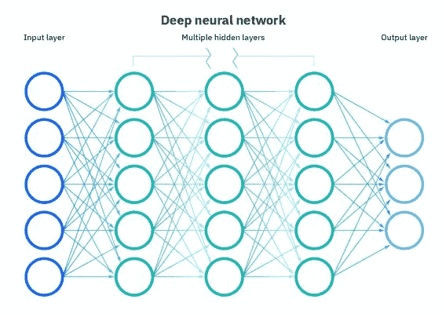
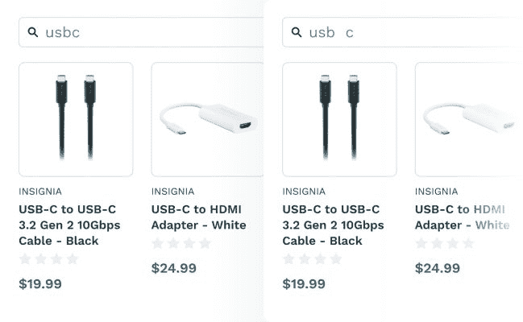
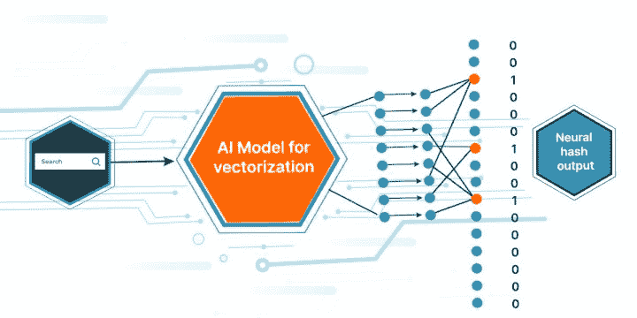

# 什么是矢量搜索？

> 原文：<https://www.algolia.com/blog/ai/what-is-vector-search/>

**向量搜索是一种使用机器学习模型来查找具有相似特征的相关对象的方法，该机器学习模型检测索引中对象之间的语义关系。**

矢量搜索和推荐的解决方案越来越普遍。如果你想在你的网站上添加一个自然语言文本搜索，创建图片搜索，或者建立一个强大的推荐系统，你将会希望使用向量。

这背后的研究已经进行了几十年，但到目前为止，只有谷歌、亚马逊和网飞等最大的公司才能建立和扩展矢量搜索。这些公司雇佣了数千名工程师和数据科学家，一些公司甚至开发了自己的计算机芯片，以提供更快的机器学习。

今天，几乎任何一家公司都可以用很少的时间和价格部署矢量搜索和推荐。Vector 技术为开发人员开启了一个全新的时代，让他们能够构建更好的搜索、推荐和预测解决方案。

本博客介绍了矢量搜索及其背后的一些技术，如矢量嵌入和神经网络。此外，我将简要介绍神经散列法，这是一种能够更快、更有效地传递向量的新技术。

## 语言问题

语言往往模棱两可，模糊不清。两个词可以表示同一个意思(同义词)，或者同一个词可以有多个意思(多义词)。例如，在英语中，“神奇的”和“棒极了”有时是同义词，但“棒极了”也可以表示许多不同的意思——鼓舞人心的、令人畏惧的、神圣的，甚至是丰富的。

向量嵌入(也称为单词嵌入，或简称为向量)以及不同的机器学习技术，如拼写纠正、语言处理、类别匹配等，可用于构建和理解语言。

## 什么是矢量嵌入？

矢量化是将单词转换为向量(数字)的过程，这使得它们的含义能够以数学方式进行编码和处理。你可以把向量想象成代表某种东西的一组数字。在实践中，向量用于自动化同义词、聚类 documents‍、检测查询中的特定含义和意图以及对结果进行排序。嵌入是非常通用的，其他对象——像整个文档、图像、视频、音频等等——也可以嵌入。

我们可以用一个简单的三维图来可视化矢量:

Image [via Medium](https://towardsdatascience.com/word2vec-research-paper-explained-205cb7eecc30) showing vector space dimensions. Similarity is often measured using Euclidean distance or cosine similarity.

你和我都能理解诸如“国王”、“女王”、“统治者”、“君主”和“皇室”等术语的含义和关系有了向量，计算机就可以通过在 *n* 维空间中把这些术语聚集在一起来理解它们。在上面的三维例子中，每个术语可以用坐标(x，y，z)来定位，并且可以使用距离和角度来计算相似性。

在实际中，可以有几十亿个点，几千个维度。然后，可以应用机器学习模型来理解向量空间中距离较近的单词(如“国王”和“王后”)是相关的，距离更近的单词(如“王后”和“统治者”)可能是同义词。

向量也可以通过加减乘除来寻找意义和建立关系。最通俗的一个例子就是 **国王——男人+女人=王后** 。机器可能使用这种关系来确定性别或理解性别关系。搜索引擎可以利用这种能力来确定一个地区最大的山脉，找到“最佳”的度假路线，或者确定健怡可乐的替代品。这些只是三个例子，但还有成千上万个！

## 如何创建矢量嵌入

一些最早的将单词表示为向量的模型和尝试 [可以追溯到 20 世纪 50 年代](https://www.linkedin.com/pulse/brief-history-word-embeddings-some-clarifications-magnus-sahlgren/) 根源于计算语言学。在 20 世纪 60 年代，关于语义差异的研究试图测量单词的语义或意义。[【NLP】](https://www.algolia.com/blog/product/what-is-natural-language-processing-and-how-is-it-leveraged-by-search-tools-software/)，一种分析文本以推断意义和结构的方法，开始于复杂的手写规则集，但在 20 世纪 80 年代转向了新的机器学习模型。NLP 今天仍然在搜索引擎中使用，以帮助构建查询。

在 20 世纪 80 年代后期，一种新的统计模型，潜在语义分析(LSA)，也称为潜在语义索引(LSI)，被开发用于创建向量和执行信息检索。LSA 非常擅长通过分析哪些术语经常一起使用来理解文档相关度，以建立语义相关度模型 (例如，“皇室”和“女王”)。

这是处理某些问题的好方法——例如同义词和多义词，以及测量对象之间的距离(或相似性)——但是，它很难扩展。LSA 的计算开销很大，尤其是当矢量数量增加或基础数据发生变化时，例如，每次更新目录时。

2013 年，[word 2 vec](https://en.wikipedia.org/wiki/Word2vec)作为利用神经网络理解词语相似度的新模型被推出。像 LSA 一样，Word2Vec 可以用来创建单词嵌入，然后经过训练找到语义相似的文本。

Image [via IBM](https://www.ibm.com/cloud/learn/neural-networks)

顾名思义，神经网络是类似大脑中神经元的机器学习网络。神经网络的基础是一种称为深度学习的机器学习。神经网络中的每个“神经元”本质上只是一个数学函数。计算每个神经元输入的加权总和；输入的权重越重要，它对神经元输出的影响就越大。

你可以在语音助手、面部识别、自动驾驶汽车和许多其他应用中找到深度学习。[深度学习](https://www.algolia.com/blog/ai/an-introduction-to-machine-learning-for-images-and-text-now-and-in-the-near-future/)可以在庞大的数据集上训练，能够识别大量复杂的模式。

## 矢量搜索结果的例子

如今，有各种各样的矢量嵌入模型来处理不同的数据，如图像、视频和音频。还有许多免费提供的矢量数据库，带有矢量嵌入和距离度量，表示矢量之间的接近度或相似度。

也有各种算法可用于搜索矢量数据库以找到相似性。其中包括:

*   ANN(近似最近邻):一种使用距离算法定位附近矢量的算法。
*   kNN:一种使用邻近度来预测分组的算法。
*   (SPTAG)空间划分树和图:大规模近似最近邻库。
*   Faiss:脸书的相似性搜索算法。
*   HNSW(分层可导航小世界):一种用于确定相似性的多层图方法。

在这些不同的技术之间存在权衡，你经常会看到多种技术被用来更快、更准确地交付结果。这些不同的技术将提供更好的结果，甚至对于难以处理的查询。我们将在未来的博客中讨论这些不同的技术和权衡。

例如，当搜索电子产品目录时，人们有时会键入“usbc”、“usb-c”或“usb c”。这些是一个意思，还是三个不同的项目？关键字引擎可能很难处理这种格式，通常您可能需要创建 if/then 规则来指导搜索引擎如何管理这个查询。然而，对于矢量搜索，这不是问题。向量搜索引擎将知道提供类似的结果。

这里有一个更有趣的例子:

在我们拥有 20，000 多种产品的测试数据库中——其中仅包含产品名称和品牌名称——我们搜索了“咖啡礼品卡”(如上)。“咖啡”一词不在星巴克礼品卡的描述中，但是，向量引擎可以将“咖啡”和“星巴克”联系起来，以返回良好的结果！

## 矢量搜索挑战

向量嵌入帮助我们找到文档之间的相似性。就相关性而言，对于许多类型的查询，向量搜索优于关键字搜索。如果它们真的很棒，为什么我们不使用矢量搜索来搜索一切呢？事实上，对于许多查询类型，关键字搜索仍然提供了更好的相关性。此外，矢量搜索不是非常有效，并且在历史上，如果不在计算机处理方面进行大量投资，就无法扩展。随着新的，最近推出的神经哈希功能，矢量搜索终于能够规模。以下是更多相关信息。

### 准确率 vs 关键词搜索

矢量搜索非常适合模糊或宽泛的搜索，但关键字搜索仍然是精确查询的主宰。顾名思义，关键字搜索试图匹配精确的关键字。其他功能，如自动完成、即时搜索和过滤器也使关键字搜索流行起来。

例如，当你在关键词引擎上查询“阿迪达斯”时，默认情况下你只会看到阿迪达斯品牌。矢量引擎的默认行为是返回 *相似的* 结果——耐克、彪马、阿迪达斯等..都在同一个概念空间里。关键字搜索仍然为具有特定意图的短查询提供更好的结果。

### 速度和比例

向量搜索更有可能出现瓶颈，因为查询必须进行复杂的向量计算来预测关系，而不是仅仅读取基于列的索引。机器在不同的入站进程之间分配 CPU 时间。事实上，大部分嵌入也需要 GPU 推理，包括查询，所以这在某些方面甚至更复杂。

为了应对这种情况，搜索引擎要么需要更强的计算能力，要么必须更快地处理同样的查询。向量搜索公司多年来一直在推广向量人工智能的好处，但成本和性能问题阻碍了它的进展，并引发了对其可行性的担忧。

一些提供矢量搜索模块插件的公司试图通过只运行矢量搜索来回避问题，如果关键词搜索结果很差的话。这意味着你可以选择其中一个——关键词或向量，速度或质量——但不能两者同时进行。

有些人认为缓存是解决这个问题的好方法。有观点认为，通过缓存结果，您几乎可以消除成本并立即提供结果。在实践中，搜索查询变化很大，缓存的成本效益往往是可疑的。搜索的缓存率可能会非常低，尤其是对于拥有大量长尾内容的网站(使用我们自己看到的客户数据，o n 平均来说，50%的流量是长尾查询，这些长尾查询不够频繁，无法被缓存 )。

解决所有这些问题——准确性、速度、可伸缩性和成本——的一种方法叫做神经散列法。我们将简要解释它是如何工作的。

## 二元向量

矢量可以工作，但如上所述，其速度和规模有限，会影响性能和成本。我们采取了一种不同的方法，称为 [神经哈希](https://www.algolia.com/blog/ai/vectors-vs-hashes/) ，这种方法不需要权衡就能利用向量。

Vector search engines use neural networks and deep learning models to deliver semantic search capabilities.

神经哈希使得基于向量的搜索与关键字搜索一样快，并且这是在不需要 GPU 或专用硬件的情况下完成的。神经散列使用神经网络来散列向量——将向量压缩成二进制散列(或二进制向量)。你可能听说过哈希；加密哈希是一种常用的安全技术，用于为受保护的密码比较生成微小、唯一的输出。

在性能方面，这些散列向量可以在商用硬件上运行，保留 96%(或更多！)的矢量信息，并且可以比单独计算矢量快上百倍的 。

现在，如果有某种方法可以将关键字搜索和神经散列结合到同一个查询中…

## 混合搜索

混合搜索是一种将全文关键词搜索引擎和矢量搜索引擎结合到一个 API 中的新方法，可以两全其美。

对于同一个查询，同时运行关键词和矢量引擎是非常复杂的。一些公司选择通过顺序运行这些过程来绕过复杂性——他们运行关键字搜索，然后，如果没有达到某个相关性阈值，则运行向量搜索。这方面有很多不好的权衡，比如速度、准确性、过滤和堆排序。这些所谓的双系统受到影响，因为向量数据库通常没有相同的(或任何)过滤能力，所以它们会返回大量不必要的信息。

真正的混合搜索是不同的。通过将全文关键词搜索和向量搜索结合到单个查询中，客户可以快速获得更准确的结果。对于 Algolia，我们已经将神经散列与我们世界一流的快速关键字搜索技术结合到一个单独的 API 调用中。它可以扩展以满足任何规模的数据集的需求，即使是对于频繁更新和删除的大量更改的索引，也不会产生任何额外的开销。

希望这已经为你提供了一个很好的矢量搜索概述，以及它如何从根本上改善你的网站的搜索结果！

敬请关注。全新的 Algolia 搜索体验即将推出！S 登录通知可用:

**[AI 搜索公告列表](https://www.algolia.com/lp/learn-algolia-neuralsearch/)**