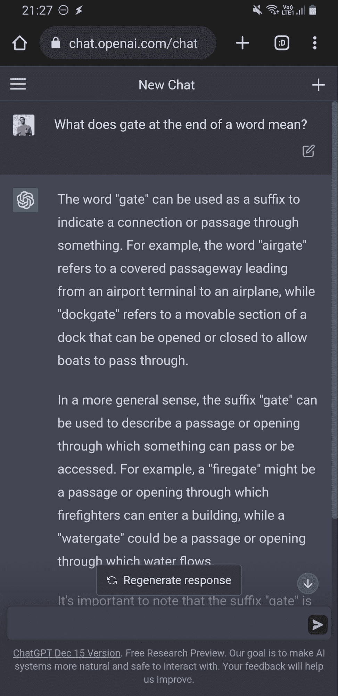
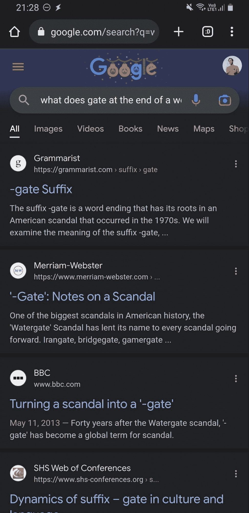
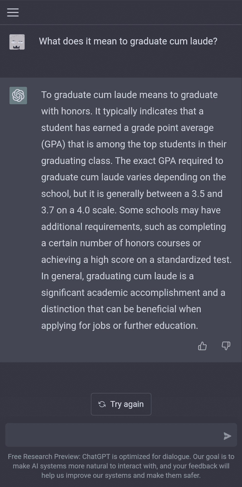
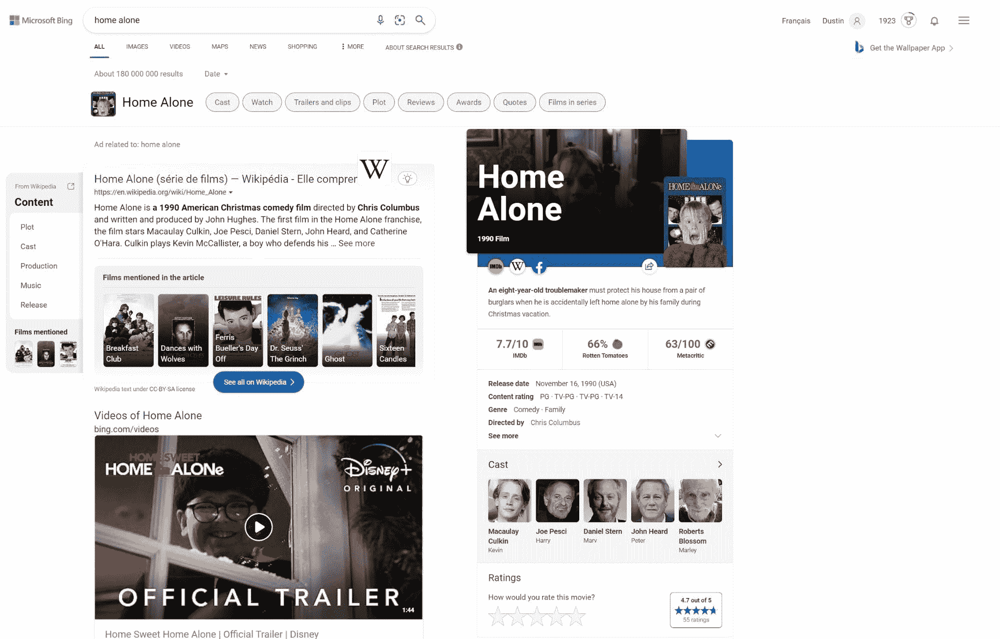
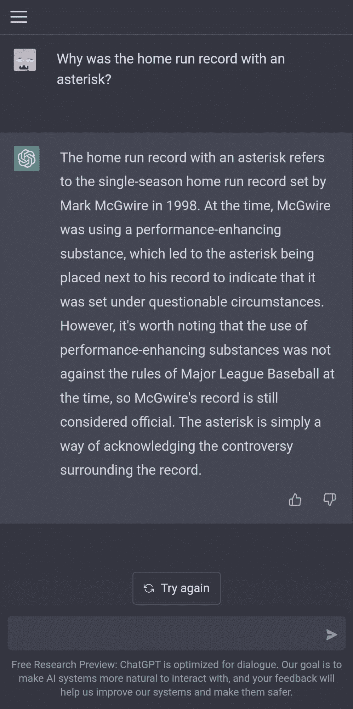
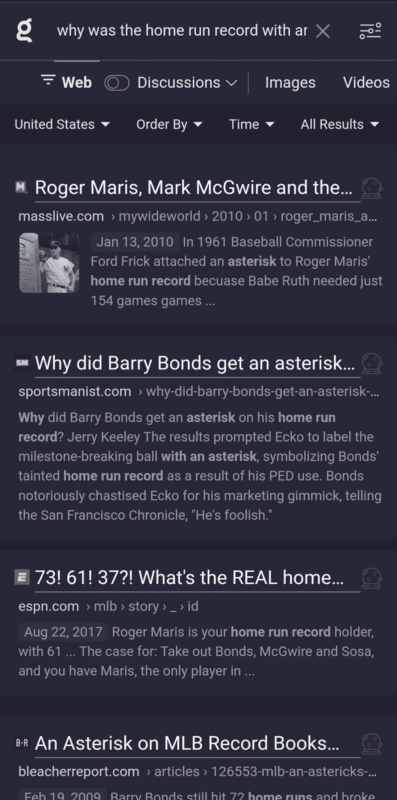
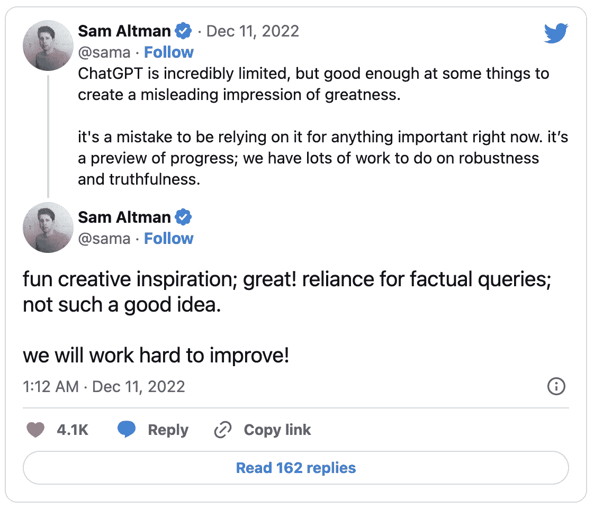

# ChatGPT 与谷歌和其他搜索引擎的对决——赢家是..

> 原文：<https://www.algolia.com/blog/ai/why-chatgpt-wont-replace-search-engines-any-time-soon/>

自从 OpenAI 宣布 ChatGPT 并且人们开始尝试它以来，已经有很多关于它将如何颠覆一切的令人屏息的宣告。其中一个颠覆就是搜索。上 Twitter 或 LinkedIn(或 [彭博！](https://www.bloomberg.com/opinion/articles/2022-12-07/chatgpt-should-worry-google-and-alphabet-why-search-when-you-can-ask-ai) )，并且你可以读到 ChatGPT 和类似的 LLM是如何取代 Google 和其他搜索引擎的。

但是，真的吗？

不，谷歌没什么可担心的，至少在中短期内。搜索引擎已经存在了几十年，并将继续存在几十年。对他们来说，缺乏真正的危险与搜索相关性和基于聊天的环境中的用户体验有关。

我曾在[Algolia](https://algolia.com/)从事搜索工作七年，最近四年专门研究自然语言、语音和会话搜索。我已经了解了什么可行，什么不可行，虽然我对 LLM(大型语言模型)很感兴趣，但我很快就会取代现有的搜索范式。原因如下。

**查询公式**

具有讽刺意味的是，第一个原因与查询公式有关。我在这里讽刺地说，因为搜索中围绕 人工智能(AI)和 机器学习【ML】的许多工作都是为了减少查询公式的障碍。过去，最基本的搜索引擎将文本与结果中完全相同的文本进行匹配。这意味着，如果您搜索 *JavaScript 片段* ，那么 *JavaScript 片段* 必须正好在您想要查找的文档中。问题是它迫使搜索者尝试并预测哪个文本将出现在文档中。

这里有一个例子:假设你正在清洁煤气灶，你意识到它是热的，尽管你已经有一段时间没用它了。有了一个怂的搜索引擎，你需要在搜索之前问自己:“我应该用 *暖* 还是 *热* 这个词？这对我得到的结果有影响吗？”

智能的、ML 驱动的搜索通过扩展匹配并包括“概念上”相似的匹配，如 *热* 和 *热* ，来消除这种负担。搜索者在确定正确的搜索词上花费更少的精力，他们更有可能找到他们最初想要的信息。

然而，ChatGPT 响应严重依赖于提示(即查询)公式。 [OpenAI](https://openai.com/blog/chatgpt/) “将此列为限制”:

> *ChatGPT 对输入短语的调整或多次尝试相同的提示很敏感。例如，给定一个问题的一种措辞，模型可以声称不知道答案，但给定一个轻微的措辞，可以正确地回答。*

有时这在搜索搜索者已经知道很多的东西时表现出来，但当搜索者对细节模糊不清时，问题就大了。如果有人搜索后缀*-gate*的意思，很有可能正确的结果是关于政治丑闻的。Google 和 Kagi 反映了这一点，ChatGPT 没有:

(chat GPT 回应的最后是说后缀-gate 的使用很少。去跟华盛顿说吧！)

当涉及到错别字时，这就更加明显了。我们都会犯错别字，不是吗？有时我们拼写错误，因为我们不知道任何更好的。例如，短语 *优等生* 在日常生活中是一个不常见的短语，因此会有人想了解更多关于它的信息，但不知道正确的拼写。ChatGPT 如何处理*come lad*相对于 Kagi 的拼写？

这不是 ChatGPT 没有答案的情况。当你使用正确的拼法时，它会

即使有拼写错误，Search 也必须理解搜索者，否则体验会倒退一步。理解和匹配不同的拼写是困难的。在 Algolia，我们采取两种方法:一种是 [直截了当的编辑文本之间的距离](https://www.algolia.com/doc/guides/managing-results/optimize-search-results/typo-tolerance/)；另一种是通过我们即将推出的人工智能搜索，它可以匹配概念，并考虑上下文线索，以便更好地匹配正确的拼写，即使编辑距离很大。

ChatGPT 还有一个问题，那就是它如何显示不正确的结果。或者，实际上，它是如何显示结果的。

## **用户体验**

几十年来，搜索布局通常都是一样的。具体来说:从最相关到最不相关(无论如何衡量)的一组结果。近年来，这种情况有所改变。搜索引擎引入了答案框、边框、建议搜索、多媒体搜索等等。看看阿炳搜索页面:

当然，冰是个异数。这一个搜索结果页面包括大约 20 个不同的组件:流选项、视频结果、图像结果和网页结果。也许那太多了。谷歌、Kagi 和其他公司的份额更少。但重点是，搜索者 *总是得到选项* 。

搜索者获得选项很重要，因为第一个结果并不总是最好的。它可能是“客观上”最好的整体，但搜索是查询、索引、用户和上下文的组合。所有这些结合在一起，可能会导致第一名以外的结果成为当时最相关的结果。这篇博客文章声称，谷歌搜索的第一结果是 [被点击了 28%的时间](https://www.sistrix.com/blog/why-almost-everything-you-knew-about-google-ctr-is-no-longer-valid/) 。不管这个数字是否准确，它通常是正确的:大多数点击往往不是第一个结果。

什么是基于聊天的搜索？只有第一个结果。

更重要的是，这是在一个基于聊天的环境中。在对话式界面中，用户总是希望得到一个相关的响应，最少的“我不知道”响应。

在 Algolia，我看到一些客户使用我们的搜索作为聊天机器人的后备。聊天机器人自然语言理解(NLU)有时会有很高的失败率(我们已经看到客户接近 50%的失败率)，搜索似乎是一个自然的退路。不过，我们不得不修改聊天机器人 UX，不将第一个结果作为响应显示，而是显示几个结果，让用户清楚地看到一个回退。这是用户所期望的。

聊天也会抢夺语境的信息。登陆一个页面并看到相关信息是有好处的:它有助于构建你所找到的信息，甚至可能向你展示原始片段哪里是不正确的或误导的。

找一个想了解棒球本垒打记录的人。这个人听说记录上曾经有一个星号。但是为什么呢？记录是什么？这是指罗杰·马里斯在 1961 年的 61 全垒打赛季，但搜索者不知道，所以搜索 *为什么全垒打记录带星号？* 对比 ChatGPT、Google、Kagi 的答案:

ChatGPT 提供了一个答案，关于 98 年与马克·麦格威尔的全垒打记录，多年后一直有争议，但 *不是带星号的* 全垒打记录吗？谷歌在一个回答框中给出正确的答案，并附有链接，Kagi 提供结果。其中，卡吉甚至可能是最好的，因为当人们提到“阿斯特里斯克”时，脑海中浮现的是马里斯，而麦格威尔和邦德也有争议。

平心而论，OpenAI 意识到了这一点。这里有一条来自首席执行官山姆·奥特曼的推文:

 
但我确实认为，在纯聊天语境中，缺乏语境和多种选择是不可避免的。这就是为什么聊天对于寻找工作时间非常有用；对于了解新兵训练营是什么样子或者为什么人们喜欢浪漫喜剧来说就不那么好了。

这还没有触及产品搜索。这年头花在搜索上的大笔钱不是花在 Google 的 SEO 上，而是 [建设搜索一个站点自己的产品目录](https://www.algolia.com/doc/guides/building-search-ui/what-is-instantsearch/js/) 。在这些情况下， *非常重要，因此* 对于搜索者来说，能够看到选项，点击过滤，通常会进入“发现阶段”这不适合聊天。

还有其他的障碍:法律( [)澳洲有法律要求谷歌和脸书为新闻](https://www.reuters.com/technology/australia-says-law-making-facebook-google-pay-news-has-worked-2022-12-02/) 付费；新闻没有来源自动汇总，他们会怎么想？)，成本，和速度立刻浮现在脑海里。这些也许有一天会被克服。过于自信的错误结果也可能如此。

但是用户体验:这一点不会消失。好吧，是的，你可能会说这很容易解决。基于聊天的系统可以一次显示多个结果，让用户决定哪个是最好的。甚至可以根据可信度对他们进行排名。然后，它甚至可以链接，这样搜索者就可以看到信息，并决定它是否准确。更好的是，为什么不包括后续问题的建议或可能有趣的多媒体呢？

祝贺你，你刚刚重建了一个搜索界面。

所以，简而言之:法律硕士很棒。理解用户意图是非常棒的。自动总结功能强大。搜索毫无进展。