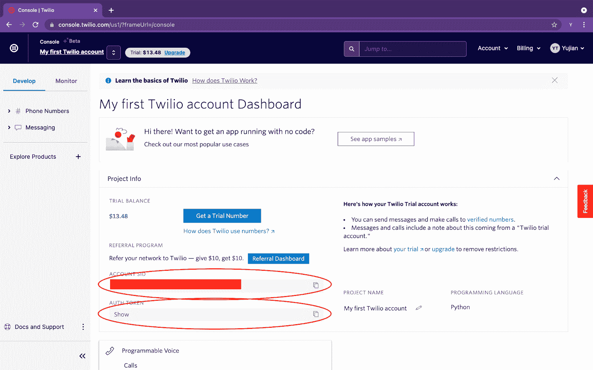

# 如何设置 Twilio 语音邮件

> 原文：<https://www.assemblyai.com/blog/how-to-programmatically-set-up-twilio-voicemail/>

## 介绍

想以编程方式使用 Twilio 语音邮件功能吗？当我[用 Twilio voicemail](https://www.assemblyai.com/blog/how-to-build-a-burner-phone-with-voicemail-in-python) 构建一次性手机时，我不得不查找这么多教程来了解如何以编程方式使用 Twilio 的 API，所以这里有一个关于如何使用 Python 和 Twilio 设置语音邮件的全面指南。我们将讨论如何:

*   [向 Twilio 索要电话号码](https://github.com/ytang07/assembly_twilio_transcription/blob/main/request_number.py?undefined)
*   用 Python Flask 、ngrok 和 Twilio 构建一个定制的 webhook 来设置语音邮件
*   [将电话号码的网络挂钩](https://github.com/ytang07/assembly_twilio_transcription/blob/main/webhooks.py?undefined)更改为您自定义的网络挂钩
*   下载您的 [Twilio 语音邮件录音](https://github.com/ytang07/assembly_twilio_transcription/blob/main/fetch_recordings.py?undefined)
*   [删除您的 Twilio 电话号码](https://github.com/ytang07/assembly_twilio_transcription/blob/main/delete_number.py?undefined)

好的，在我们开始之前，你需要一个 Twilio 账户。你可以在图片中我所指的地方找到你的*账号 sid* 和*认证令牌*。



Twilio credentials

复制您的凭证，将它们保存在您的环境变量中，或者保存在您正在使用的文件夹中的 configure.py 文件中。

```py
acct_id = '<your account sid>'
twilio_auth_key = '<your twilio auth token>'
```

## 向 Twilio 索要电话号码

现在我们有了一个 Twilio 帐户，设置语音邮件的第一件事就是获取一个电话号码。我们将创建一个 Python 脚本，该脚本将请求 20 个带有您想要的任何区号的本地号码，并允许我们选择其中一个。

```py
from configure import acct_id, twilio_auth_key
from twilio.rest import Client

client = Client(acct_id, twilio_auth_key)

US_avail_phone_numbers = client.available_phone_numbers('US').fetch()

# lists 20 available local numbers with an area code of your choice
list_20 = US_avail_phone_numbers.local.list(area_code='<your area code>', limit=20)
for num in list_20:
   # only list the number if it has voice capability
   # they all should
   if num.capabilities['voice'] == True:
       print(num.phone_number)
_number = input("Which phone number do you want?")

# request your new number
new_number = client.incoming_phone_numbers.create(
   phone_number= _number)

print("You've activated your new number", new_number.phone_number)
```

完成后，我们的终端输出应该如下所示:


## 用 Python Flask、ngrok 和 Twilio 构建一个定制的 webhook 来设置语音邮件

这是我们使用 Twilio 设置语音邮件的部分。我们将构建一个 Flask 应用程序，它将使用 Twilio 直接转到语音邮件并记录电话。我们将创建一个自定义的 Twilio 语音邮件端点，它将告诉呼叫者记录他们的呼叫，然后在 10 秒钟内记录呼叫。我们将在我们的端口上下载并运行 ngrok，将其暴露给互联网。 ****注意**** 我们需要两个开放的终端来做这件事。在第一个终端中运行包含此代码的文件

```py
from flask import Flask
from twilio.twiml.voice_response import VoiceResponse

app = Flask(__name__)

@app.route("/voice", methods=["GET", "POST"])
def voice():
   """Read a message aloud"""
   resp = VoiceResponse()
   resp.say("Please leave a message")
   resp.record(timeout=10, transcribe=True)
   resp.hangup()
   return(str(resp))

if __name__ == "__main__":
   app.run(debug=True)
```

我们应该会看到这样的输出:


Start Twilio voicemail Flask app

在我们的 flask 应用程序在我们的终端上启动并运行之后，我们还需要下载并运行 ngrok。你可以[在这里](https://ngrok.com/download?undefined)下载 ngrok。下载 ngrok 并复制到我们的工作文件夹后，我们将打开 ****第二个终端**** 并运行

```py
./ngrok http 5000
```

注意,“5000”可以替换为运行 Python Flask 应用程序的任何端口。正如你在上面看到的，我们的运行在端口 5000 上。Ngrok 应该公开并返回一个我们可以触及的端点。我们需要跟踪 https 转发链接，这将是我们更新的 webhook URL，以便 Twilio 在我们调用时访问。


Expose webhook endpoint

## 将电话号码的网络挂钩更改为您自定义的网络挂钩

好了，现在我们有了一个可以记录电话的应用程序，让我们通过他们的 Python REST API 来更新 Twilio 上的 webhook。这样，当我们拨打该号码时，Twilio 会直接将我们转到语音信箱。

```py
from twilio.rest import Client
from configure import twilio_auth_key, acct_id

client = Client(acct_id, twilio_auth_key)

phone_numbers = client.incoming_phone_numbers.list()

for record in phone_numbers:
   print(record.sid)

_sid = input("What phone number SID do you want to update?")
_url = input("What do you want to update the webhook URL to?")

updated_phone_number = client.incoming_phone_numbers(_sid).update(voice_url=_url)

print("Voice URL updated to", updated_phone_number.voice_url)
```

当我们运行这个时，我们应该在终端中得到这个输出。请注意，我在 ngrok 提供的 URL 末尾添加了“/voice ”,这是因为我在上面的 Flask 应用程序中将“/voice”定义为端点。


Change Twilio webhook endpoint

## 下载您的 Twilio 语音邮件录音

要测试我们的语音邮件，打几个电话。如果一切设置正确，应该会听到一个女声说“请留言”。为了这个教程，我打了 3 个电话，留了 3 条信息。

我留言是:

```py
"This is a third and final recording that I’m going to use for testing transcription services. So yeah, I should have been a cowboy"
```

```py
"This is a test recording for transcriptions. Sally sells seashells down by the sea shore"
```

```py
"A B C D E F G This is a test call for recording transcriptions with Twilio and AssemblyAI"
```

现在，让我们在 Twilio 上查看我们的录音并下载它们。

```py
from configure import acct_id, twilio_auth_key
from twilio.rest import Client
import requests

twilio_url = "https://api.twilio.com"
client = Client(acct_id, twilio_auth_key)
recordings = client.recordings.list(limit=20)
for record in recordings:
   print(record.sid)

_rid = input("Which recording ID would you like?")

request_url = twilio_url + "/2010-04-01/Accounts/" + acct_id + "/Recordings/" + _rid + ".mp3"
response = requests.get(request_url)
with open(_rid+'.mp3', 'wb') as f:
   f.write(response.content)

print("File saved to", _rid+".mp3")
```

完成后，终端中的输出应该如下所示:


Download twilio voicemail recordings

我运行了三次来下载所有三个记录。您也可以执行下面的代码来一次下载所有的文件。

```py
from configure import acct_id, twilio_auth_key
from twilio.rest import Client
import requests

twilio_url = "https://api.twilio.com"
client = Client(acct_id, twilio_auth_key)
recordings = client.recordings.list(limit=20)
for record in recordings:
    _rid = record.sid
    request_url = twilio_url + "/2010-04-01/Accounts/" + acct_id + "/Recordings/" + _rid + ".mp3"
    response = requests.get(request_url)
    with open(_rid+'.mp3', 'wb') as f:
        f.write(response.content)
    print("File saved to", _rid+".mp3")
```

## 删除您的 Twilio 电话号码

在用 Twilio 设置我的一次性语音邮件后，我想做的最后一件事是能够以编程方式删除我的号码。

```py
from configure import acct_id, twilio_auth_key
from twilio.rest import Client

client = Client(acct_id, twilio_auth_key)

phone_numbers = client.incoming_phone_numbers.list()

for record in phone_numbers:
   print(record.sid)

_del = input("Which phone number SID would you like to delete?")

client.incoming_phone_numbers(_del).delete()
```

它应该像这样运行:


Twilio voicemail number successfully deleted

## 包扎

在本教程中，我们介绍了如何使用 Twilio 的 API 来获取和下载语音邮件。这里有一个完整的教程，关于如何建立一个一次性手机来获取语音邮件记录。关于 AssemblyAI 的更多信息，请查看我们的[博客，获取教程和更新](https://www.assemblyai.com/blog)。在推特上关注我们 [@assemblyai](https://twitter.com/AssemblyAI?undefined) 或者作者[@于坚 _ 唐](https://twitter.com/yujian_tang?undefined)，保持更新。