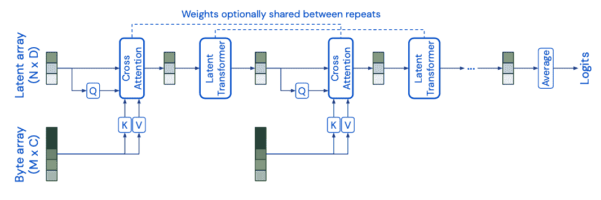

# 回顾-感知者:具有重复注意的一般感知

> 原文：<https://www.assemblyai.com/blog/review-perceiver/>

本周深度学习论文综述为[感知者:迭代注意的一般感知](https://arxiv.org/abs/2103.03206)。

## 这篇论文有什么令人兴奋的地方

今天的深度学习主要集中在为特定模态(如语言、视觉或语音)构建的模型上。最近的历史就是这样，原因有二:首先，设计处理特定数据类型的架构更容易；第二，模型通常被设计为利用数据，例如卷积神经网络和图像。在这项工作中，作者在 [Transformer 架构](https://www.assemblyai.com/blog/fine-tuning-transformers-for-nlp/)的基础上，利用不对称注意力机制来训练图像、音频、视频和点云数据的单一模型，同时优于这些领域的特定架构。

## 主要发现

将变压器扩展到高维音频/视频数据导致了许多定制架构的开发。通常，这些模型在将高层输入送入转换器之前，会利用多个低层卷积层来降低数据的维度。由于转换器架构的二次方复杂性，这通常是一个要求，其中每个令牌都要关注其他令牌。

例如，一个 224x224 的图像包含 50176 个像素，这比像 [BERT](https://arxiv.org/abs/1810.04805) 这样的模型所能处理的数据要多得多(限制为 512 个输入令牌)。通过利用不对称的注意机制和潜在的瓶颈，作者能够扩展转换器以处理成千上万的输入，同时保持模型参数的数量最少。

*来源- [感知者:具有迭代注意的一般感知](https://arxiv.org/abs/2103.03206)*

上图显示了这种技术是如何工作的，它将字节数组的部分按顺序加入到一组潜在字节中，然后这些潜在字节通过潜在字节空间中的一个转换器。由于潜在数组的大小明显小于字节数组的大小，转换器的计算要求与输入分离，从而允许使用更深的模型。总的来说，这导致总复杂度为 O(MN + LN ),其中 M 是字节数组的维度，N 是潜在数组的维度，L 是变换器的深度。

## 我们的外卖

通过这篇论文、 [Data2vec](https://www.assemblyai.com/blog/review-data2vec-a-general-framework-for-self-supervised-learning-in-speech-vision-and-language/) 和类似的工作，深度学习的趋势正在朝着拥有通用模型和算法的方向发展，这些模型和算法可以轻松扩展到任何数据类型。感知者是这条道路上的一个里程碑，因为它有助于解决 transformer 架构的一个主要挑战，该挑战阻止了它直接用于高维数据。看到未来的工作建立在感知者的想法上，并继续推动基于模型的概化的极限，这将是有趣的。

## 参考

*   [感知者:具有重复注意的一般感知](https://arxiv.org/abs/2103.03206)
*   [注意力是你所需要的一切](https://arxiv.org/abs/1706.03762)
*   [BERT:用于语言理解的深度双向转换器的预训练](https://arxiv.org/abs/1810.04805)
*   [Data2vec:语音、视觉和语言自我监督学习的通用框架](https://ai.facebook.com/research/data2vec-a-general-framework-for-self-supervised-learning-in-speech-vision-and-language/)