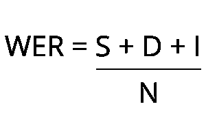

# 单词错误率有用吗？

> 原文：<https://www.assemblyai.com/blog/word-error-rate/>

## 什么是单词错误率？

单词错误率是自动语音识别(ASR)系统执行的准确程度的度量。从字面上看，它可以计算出与人类转录相比，ASR 系统产生的转录文本中有多少“错误”。

从广义上讲，衡量任何机器学习系统的准确性都很重要。无论是自动驾驶汽车，亚马逊 Alexa 这样的 NLU 系统，还是我们在 AssemblyAI 开发的自动语音识别系统，如果你不知道你的机器学习系统有多准确，你就是在瞎飞！

在自动语音识别领域，单词错误率已经成为衡量语音识别模型准确程度的事实标准。我们从客户那里得到的一个常见问题是“你的 WER 是什么？”。事实上，当我们公司在 2017 年被 Y Combinator 接受时，YC 合伙人问我们的第一个问题是“你的 WER 是什么？”

## 如何计算单词错误率(WER)

计算单词错误率背后的实际数学过程如下:



Word Error Rate Algorithm

我们在这里做的是将******删除(D)********插入(N)**** 的数量组合起来，除以 ****字数(N)**** 。**

**所以比如说，我们说下面这句话是口语:**

```py
`"Hello there"`
```

**如果我们的自动语音识别(ASR)不是很好，并预测以下转录:**

```py
`"Hello bear"` 
```

**那么我们的单词错误率(WER)将是 50%！那是因为有 1 个 ****替换**** ，“有”被替换成了“熊”。假设我们的 ASR 系统只能预测:**

```py
`"Hello"`
```

**出于某种原因，甚至没有预测到第二个词。在这种情况下，我们的单词错误率(WER)也将是 50%！那是因为只有一个**缺失——我们的 ASR 系统只预测到 1 个单词，而实际说的是 2 个单词。 ****单词错误率越低越好**** 。你可以把单词准确率想象成 1 减去单词错误率。因此，如果你的单词错误率是 20%，那么你的单词准确率，即你的转录有多准确，是 80%:****

## **单词错误率是衡量语音识别系统的一个好方法吗？**

**和所有事情一样，它不是非黑即白的。总的来说，单词错误率可以告诉你自动转录与人工转录相比有多“不同”,通常，这是确定自动转录有多“好”的可靠指标。**

**例如，以下面的例子为例:**

```py
`Spoken text:
“Hi my name is Bob and I like cheese. Cheese is very good.”

Predicted text by model 1:
"Hi my frame is knob and I bike leafs. Cheese is berry wood"
WER: 46%

Predicted text by model 2:
"Hi my name is Bob and I bike cheese. Cheese is good."
WER: 15%`
```

**正如我们所见，模型 2 的 wer 较低，为 15%，对于我们人类来说，显然比模型 1 的预测文本更准确。这就是为什么一般来说，WER 是用于确定自动语音识别系统的准确性的良好度量。**

**然而，以下面的例子为例:**

```py
`Spoken:
"I like to bike around"

Model 1 prediction:
"I liked to bike around"
WER: 20%

Model 2 prediction:
"I like to bike pound"
WER: 20%`
```

**在上面的例子中， ****模型 1**** 文本和 ****模型 2**** 文本都有 20%的 WER。但是 ****模型 1**** 显然比 ****模型 2**** 更容易理解。这是因为即使有 ****型号 1**** 所犯的错误，它仍然会产生更清晰、更易于理解的转录。这与 ****模式 2**** 相比，在转录中出现错误，导致转录文本难以辨认(即“字汤”)。**

**为了进一步说明单词错误率的下降，举下面的例子:**

```py
`Spoken:
"My name is Paul and I am an engineer"

Model 1 prediction:
"My name is ball and I am an engineer"
WER: 11.11%

Model 2 prediction:
"My name is Paul and I'm an engineer"
WER: 22.22%`
```

**在这个例子中， ****Model 2**** 在生成可理解的转录方面做得更好，但是它有两个(！！)把 WER 比作 ****型号 1**** 。WER 的这种差异在这个例子中尤其明显，因为文本包含的单词很少，但这仍然说明了在回顾 WER 时需要注意的一些“问题”。**

**以上这些例子说明的是，文字错误计算并不“聪明”。从字面上看，它只是在自动转录中出现的替换、删除和插入的数量，与人类转录进行比较。这就是为什么“真实世界”中的 WER 会如此成问题。**

**举一个简单的例子，在人类转录和自动转录中没有规范化大小写。**

```py
`Human transcription:
"I live in New York"

Automatic transcription:
"i live in new york"
WER: 60%`
```

**在这个例子中，我们看到自动转录的 WER 为 60% (!！)即使它完美地转录了所说的内容。仅仅是因为我们将人类的转录与大写的 ****、纽约的**** 和小写的 ****、纽约的**** 进行比较，WER 算法将这些视为完全不同的单词！**

**这是我们在野外看到的一个主要“陷阱”,这也是为什么我们在计算 WER 时，总是在内部将人类转录和自动转录标准化，例如:**

*   **小写所有文本**
*   **删除所有标点符号**
*   **将所有数字转换成书面形式(“7”->“7”)**
*   **等等。**

## **单词错误率的替代方法**

**不幸的是，单词错误率是我们今天用来确定自动语音识别系统准确性的最佳度量。已经提出了一些替代方案，但没有一个停留在研究或商业社区。一种常用的技术是对替换的 ****、插入的**和删除的**进行不同的加权。例如，每删除一个**就增加 0.5，而不是 1.0。****

****然而，除非权重被标准化，否则这并不是一个真正“公平”的计算 WER 的方法。例如，与系统 2 相比，系统 1 可以报告低得多的 wer，因为它对 ****替换**** 使用了更低的“权重”。****

**这就是为什么，就目前而言，单词错误率仍然存在，但是在您自己计算 WER 时，记住我们演示的陷阱是很重要的！**