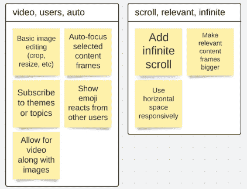

# 如何快速交付数据科学项目

> 原文：<https://web.archive.org/web/20221129045128/https://www.datacamp.com/blog/how-to-ship-data-science-projects-quickly>

数据科学项目有许多组件需要协作才能成功部署。有了这些相互关联的部分，敏捷方法对于开发和部署过程是必要的。这种方法允许组织快速学习和迭代。在最近的 DataCamp 网络研讨会中，Lucid Software 内部工程部门的工程经理 Brian Campbell 讨论了成功部署数据科学项目的最佳实践。

## 允许敏捷开发的早期步骤

Brian 解释说，在一个项目的早期，可以采取两个关键步骤来实现模型开发和部署的并行进展:使用基线模型和创建原型。虽然这些方法使时间表变得复杂，但它们会带来更快、更好的结果。

### 使用基线模型

成功发布机器学习项目的一个有用步骤是创建基线模型。基线模型的输出与最终模型的输出相同。然而，它是在开发过程的大部分之前建立的，并且可能基于启发式或随机数据。这个基线为未来的迭代提供了一个目标。

随着团队开发新的模型，新的结果可以与基线进行比较，并为学习提供信息。基线和期望状态之间的差距告知项目需求，并帮助团队识别最有价值的数据和问题的解决方案。

### 使用原型

原型是接收相同输入并提供与最终模型相同格式输出的模型。该模型可以由基线模型提供信息。一旦原型准备就绪，负责部署的人员就可以开始将模型集成到其预期目的中。原型支持模型上的并行进展；数据科学家改进模型，而实现团队研究如何将模型打包给客户或在业务流程中打包。

只有当最终模型的行为与原型相同时，原型才起作用。因此，在创建原型之前，有必要了解可用的数据和预期的输出格式。这需要除了最初的问题公式化之外的一些项目知识，以及与[问题专家](https://web.archive.org/web/20220522133123/https://www.datacamp.com/community/blog/3-types-of-collaborators-on-data-science-projects)的密切合作。

## 基线和原型的真实用例

Brian 讨论了他在 Lucid 的团队如何使用基线和原型来加速产品、设计和工程团队使用的便笺产品的集群模型的开发。这些团队经常举行设计思考会议，在会议中，主持人需要手动将相似类型的便笺聚集到给定的类别下。该系统的目标是通过自动将想法分类并删除重复项来减少头脑风暴和讨论之间的时间。

基线模型接受随机的想法，并为它们生成随机的类别。然后，他们创建了这个模型的原型，使实现专家能够在开发过程的早期开始工作。随着时间的推移，他们通过利用自然语言处理和机器学习将类似的便笺聚集在一起，改进了基线模型。

### 沟通对这些模型很重要

这个项目的第一次迭代遇到了一些问题，因为在部署团队和处理模型的数据科学家之间缺乏一致的协作。这种团队合作的缺乏导致了模型性能问题、不准确的测试和糟糕的产品体验。他们无法实现并行开发模型的协同作用。

当他们重新启动项目并有效合作时，他们解决了这些问题并设定了现实的期望。部署团队拥有一个原型模型，可以与开发模型的数据科学团队并行工作，这使得协作成为可能。

要了解从项目中学到的经验教训，以及如何有效地管理复杂的数据科学项目，请务必收听[点播网络研讨会](https://web.archive.org/web/20220522133123/https://www.datacamp.com/resources/webinars/manage-data-science-projects-effectively)。

