# JAX & Flax 深度学习教程


## 下载所有笔记本

下载所有笔记本的链接。ZIP 文件的密码是 FDCPJx0D5A6SO#%Qsg

## JAX（它是什么以及如何在 Python 中使用它）

JAX 是一个 Python 库，利用 XLA 和即时（JIT）编译提供高性能机器学习。其 API 类似于 NumPy，但有一些不同之处。JAX 配备了旨在改善和提高机器学习研究速度的功能。这些功能包括：

自动微分

向量化

JIT 编译

本文将涵盖这些功能和其他 JAX 概念。让我们开始吧。

## 什么是 XLA？

XLA（加速线性代数）是用于加速机器学习模型的线性代数编译器。它导致模型执行速度的提高和内存使用量的减少。JAX、PyTorch、Julia 和 NX 都可以生成 XLA 程序。

## 安装 JAX

JAX 可以通过 Python 包索引进行安装： `pip install jax` JAX 已预装在 Google Colab 上。查看下面的链接获取其他安装选项。

## 在 Google Colab 上设置 TPUs

您需要设置 JAX 以在 Colab 上使用 TPUs。通过执行以下代码来完成。确保您已经将运行时更改为 TPU，方法是转到运行时->更改运行时类型。如果没有可用的加速器，JAX 将使用 CPU。

`import jax.tools.colab_tpu jax.tools.colab_tpu.setup_tpu() jax.devices()`

## JAX 中的数据类型

NumPy 中的数据类型与 JAX 数组中的类似。例如，以下是如何在 JAX 中创建浮点数和整数数据的方式。

`import jax.numpy as jnp x = jnp.float32(1.25844) x = jnp.int32(45.25844)`

当您检查数据类型时，您会发现它是

JAX 中的 `DeviceArray.DeviceArray` 相当于 NumPy 中的 `numpy.ndarray`。

`jax.numpy` 提供了与 NumPy 类似的接口。但是，JAX 还提供了 `jax.lax`，这是一个更强大和更严格的低级 API。例如，使用 `[jax.numpy]` 可以添加具有混合类型的数字，但 `[jax.lax]` 不允许这样做。

## 创建 JAX 数组的方法

您可以像在 NumPy 中一样创建 JAX 数组。例如，可以使用：arange

linspacePython lists.ones.zeros.identity.

`jnp.arange(10)`

`jnp.arange(0,10)`

`scores = [50,60,70,30,25,70] scores_array = jnp.array(scores) jnp.zeros(5)`

`jnp.ones(5)`

`jnp.eye(5)`

`jnp.identity(5)`

``

## 使用 JAX 生成随机数

随机数生成是 JAX 与 NumPy 的一个主要区别。JAX 旨在与功能程序一起使用。JAX 期望这些函数是纯函数。**纯函数** 没有副作用，并期望输出仅来自其输入。JAX 转换函数期望纯函数。

因此，在使用 JAX 时，所有输入都应通过函数参数传递，而所有输出都应来自函数结果。因此，类似于 Python 的打印函数不是纯函数。

纯函数在使用相同的输入调用时返回相同的结果。这对于[np.random.random()]是不可能的，因为它是有状态的，在多次调用时返回不同的结果。

`print(np.random.random()) print(np.random.random()) print(np.random.random())`

``

JAX 使用随机状态来实现随机数生成。这个随机状态被称为`key🔑`。JAX 从伪随机数生成器（PRNGs）状态中生成伪随机数。

`seed = 98`

`key = jax.random.PRNGKey(seed) jax.random.uniform(key)`

因此，你不应该重用相同的状态。相反，你应该分割 PRNG 以获得所需数量的子键。`key, subkey = jax.random.split(key) 使用相同的键将始终生成相同的输出。`

## 纯函数

我们已经提到纯函数的输出应该只来自函数的结果。因此，像 Python 的[print]函数这样的东西会引入不纯性。这可以通过这个函数来演示。

`def impure_print_side_effect(x):`

`print("Executing function")` # 这是一个副作用返回 x

# 副作用出现在第一次运行时`print ("First call: ", jax.jit(impure_print_side_effect)(4.))`

# 相同类型和形状的参数进行后续运行可能不会显示副作用。

# 这是因为 JAX 现在调用了函数的缓存编译

`print ("Second call: ", jax.jit(impure_print_side_effect)(5.))`

# 当参数的类型或形状发生变化时，JAX 会重新运行 Python 函数

`print ("Third call, different type: ", jax.jit(impure_print_sid e_effect)(jnp.array([5.])))`

``

第一次执行函数时，我们可以看到打印的语句。然而，在连续运行中我们看不到这个打印语句，因为它被缓存了。只有在改变数据形状后，强制 JAX 重新编译函数时，我们才会再次看到这个语句。稍后我们会详细讨论`jax.jit`。

## JAX NumPy 操作

对 JAX 数组的操作类似于对 NumPy 数组的操作。例如，你可以像在 NumPy 中一样使用[max]、[argmax]和[sum]。

`matrix = matrix.reshape(4,4) jnp.max(matrix)`

`jnp.argmax(matrix)`

`jnp.min(matrix)`

`jnp.argmin(matrix)`

`jnp.sum(matrix)`

`jnp.sqrt(matrix)`

`matrix.transpose()`

``然而，JAX 不允许对非数组输入（如 NumPy 中的 Python 列表或元组）进行操作，这会导致错误。

`try:`

`jnp.sum([1, 2, 3])`

`except TypeError as e:`

`print(f"TypeError: {e}")`

# `TypeError: sum requires ndarray or scalar arguments, got <c`

`lass 'list'> at position 0.`

## JAX 数组是不可变的

与 NumPy 不同，JAX 数组不能就地修改。这是因为 JAX 期望纯函数。

`scores = [50,60,70,30,25]`

`scores_array = jnp.array(scores)`

`scores_array[0:3] = [20,40,90]`

# `TypeError: '<class 'jaxlib.xla_extension.DeviceArray'>' objec t does not support item assignment.`

# JAX 数组是不可变的。而不是``x[idx] = y``，请使用``x

`= x.at[idx].set(y)`` 或者另一个 `.at[]`

# 方法：`https://jax.readthedocs.io/en/latest/_autosummary/ja x.numpy.ndarray.at.html`

JAX 中的数组更新使用`[x.at[idx].set(y)]`进行。这将返回一个新数组，而旧数组保持不变。

`try:`

`jnp.sum([1, 2, 3])`

`except TypeError as e:`

`print(f"TypeError: {e}")`

# `TypeError: sum 需要 ndarray 或标量参数，得到<c`

`在位置 0 处'list'列表。`

## **越界索引**

`NumPy`通常在您尝试获取数组中超出边界的项时会抛出错误。JAX 不会抛出任何错误，而是返回数组中的最后一项。

`matrix = jnp.arange(1,17) matrix[20]`

# `DeviceArray(16, dtype=int32)`

JAX 设计如此，因为在加速器中抛出错误可能会很具有挑战性。

## **JAX 中的数据放置**

JAX 数组被放置在第一个设备上，`[jax.devices()[0]]`即 GPU、TPU 或 CPU。数据可以被放置在特定的设备上

使用`jax.device_put()`。

`from jax import device_put`

`import numpy as np`

`size = 5000`

`x = np.random.normal(size=(size, size)).astype(np.float32) x = device_put(x)`

数据将提交到该设备，并且对其进行的操作也将提交到同一设备。

## **JAX 的速度有多快？**

JAX 使用`asynchronous`分发，这意味着它不会等待计算完成就将控制权交还给`Python 程序`。因此，当您执行一个操作时，JAX 会返回一个 future。当您想要打印输出或将结果转换为`NumPy 数组`时，JAX 会强制 Python 等待执行。

因此，如果您想计算程序的执行时间，您将不得不将结果转换为`NumPy`数组

使用`[block_until_ready()]`等待执行完成。一般来说，在 CPU 上，`NumPy`的性能优于 JAX，但在加速器和使用 jitted 函数时，JAX 的性能优于`NumPy`。

## **使用 jit()加速函数**

`[jit]`使用 XLA 进行即时编译。`[jax.jit]`期望一个纯函数。函数中的任何副作用将只执行一次。让我们创建一个纯函数，并计算其在没有`jit`的情况下的执行时间。

`def test_fn(sample_rate=3000,frequency=3):`

`x = jnp.arange(sample_rate)`

`y = np.sin(2*jnp.pi*frequency * (frequency/sample_rate)) return jnp.dot(x,y)`

`%timeit test_fn()`

# `最佳结果为 5 次：每次循环 76.1 µs`

现在让我们使用`jit`并计算相同函数的执行时间。在这种情况下，我们可以看到使用`jit`使执行速度几乎快了 20 倍。

`test_fn_jit = jax.jit(test_fn)`

`%timeit test_fn_jit().block_until_ready()` # 最佳结果为 5 次：每次循环 4.54 µs

在上面的例子中，`[test_fn_jit]`是函数的 jit 编译版本。然后 JAX 创建了针对 GPU 或 TPU 优化的代码。优化后的代码将在下次调用此函数时使用。

## **JIT 的工作原理**

JAX 通过将 Python 函数转换为一种称为 jaxpr（JAX 表达式）的中间语言来工作。`[jax.make_jaxpr]`可用于显示 Python 函数的 jaxpr 表示。如果函数有任何副作用，它们不会被 jaxpr 记录。我们之前看到，例如打印的任何副作用只会在第一次调用时显示出来。

`def sum_logistic(x):`

`print("printed x:", x)`

`return jnp.sum(1.0 / (1.0 + jnp.exp(-x)))`

`x_small = jnp.arange(6.)print(jax.make_jaxpr(sum_logistic)(x_small))`

JAX 通过追踪创建 jaxpr。函数中的每个参数都会被包装成追踪器对象。这些追踪器的目的是在调用函数时记录对它们执行的所有 JAX 操作。JAX 使用追踪器记录重建函数，从而得到 jaxpr。Python 的副作用不会出现在 jaxpr 中，因为追踪器不记录它们。

JAX 要求数组形状在编译时是静态和已知的。将带有值条件的函数使用 jit 修饰会导致错误。因此，并非所有代码都可以 jit 编译。

`@jax.jitdef f(boolean, x):return -x if boolean else x`

`f(True, 1)`

# `ConcretizationTypeError`: 遇到抽象追踪器值，但需要具体值：`Traced<ShapedArray(bool[], weak _type=True)>with<DynamicJaxprTrace(level=0/1)>`

对于这个问题有几个解决方案：

移除值条件。使用 JAX 控制流操作符如`[jax.lax.cond]`。

仅对函数的一部分使用 jit。使参数静态化。

我们可以实现最后一种选项并使布尔参数静态化。这可以通过指定`[static_argnums]`或`[static_argnames]`来完成。当静态参数的值变化时，这会强制 JAX 重新编译函数。如果函数会获得许多静态参数的值，这不是一个好策略。你不希望函数重新编译太多次。

你可以使用 Python 的`[functools.partial]`传递静态参数。`from functools import partial@partial(jax.jit, static_argnums=(0,)) def f(boolean, x):return -x if boolean else xf(True, 1)`

## **使用`grad()`计算导数**

在 JAX 中计算导数是通过`jax.grad.`完成的。`@jax.jitdef sum_logistic(x):return jnp.sum(1.0 / (1.0 + jnp.exp(-x)))`

`x_small = jnp.arange(6.)`

`derivative_fn = jax.grad(sum_logistic) print(derivative_fn(x_small))`

`[grad]`函数有一个`[has_aux]`参数，允许你返回辅助数据。例如，在构建机器学习模型时，你可以用它返回损失和梯度。

`@jax.jitdef sum_logistic(x):return jnp.sum(1.0 / (1.0 + jnp.exp(-x))),(x + 1)`

`x_small = jnp.arange(6.)`

`derivative_fn = jax.grad(sum_logistic, has_aux=True) print(derivative_fn(x_small))`

# `(DeviceArray([0.25 , 0.19661194, 0.10499357, 0.04517666, 0.01766271,`

# `0.00664806], dtype=float32), DeviceArray([1., 2.,`

`3., 4., 5., 6.], dtype=float32))`使用 **`jax.vjp()`** 和 **`jax.jvp()`** 可以执行高级自动微分。 **## 使用 vmap 进行自动向量化**

vmap（向量化映射）允许你编写一个可以应用于单个数据的函数，然后 vmap 将其映射到一批数据中。如果没有 vmap，则解决方案将是通过批处理循环应用函数。在使用 jit 和循环的情况下，解决方案会更加复杂且可能会更慢。

`mat = jax.random.normal(key, (150, 100)) batched_x = jax.random.normal(key, (10, 100)) def apply_matrix(v):`

`return jnp.dot(mat, v)`

`@jax.jit`

`def vmap_batched_apply_matrix(v_batched):`

`return jax.vmap(apply_matrix)(v_batched)`

`print('使用 vmap 进行自动向量化')`

`%timeit vmap_batched_apply_matrix(batched_x).block_until_ready ()`

在 JAX 中，`[jax.vmap]` 转换设计为自动生成函数的向量化实现。它通过类似于 `[jax.jit]` 的跟踪功能实现，自动在每个输入的开头添加批处理轴。如果批处理维度不是第一个，可以使用 `[in_axes]` 和 `[out_axes]` 参数来指定输入和输出中批处理维度的位置。如果所有输入和输出的批处理轴相同，可以使用整数，否则可以使用列表。`Matteo Hessel，JAX 作者。`

## 使用 `[pmap]` 进行并行化

`jax.pmap` 的工作方式类似于 `jax.vmap`。不同之处在于 `jax.pmap` 用于并行执行，即在多个设备上进行计算。这在对数据批次进行训练时是适用的。

计算在不同设备上的批处理可能会发生，然后将结果聚合。被 `[pmap]` 的函数返回一个 `[ShardedDeviceArray]`。这是因为数组分布在所有设备上。不需要用 jit 装饰函数，因为使用 `[pmap]` 时函数默认为 jit 编译。

`x = np.arange(5)w = np.array([2., 3., 4.])`

`def convolve(x, w):`

`output = []`

`for i in range(1, len(x)-1):`

`output.append(jnp.dot(x[i-1:i+2], w)) return jnp.array(output)`

`convolve(x, w) n_devices = jax.local_device_count()`

`xs = np.arange(5 * n_devices).reshape(-1, 5)`

`ws = np.stack([w] * n_devices)`

`jax.pmap(convolve)(xs, ws)`

# `ShardedDeviceArray([[ 11., 20., 29.],`

# `.................`

# `[326., 335., 344.]], dtype=float32)`

你可能需要使用其中一个 `[collective operators]` 来聚合数据，例如，计算准确度的平均值或 logits 的平均值。在这种情况下，你需要指定一个 `[axis_name]`。这个名称在设备之间的通信中很重要。

## 在 JAX 中调试 NANs

在 JAX 程序中，默认情况下，出现 NANs 不会导致错误。`jnp.divide(0.0,0.0)# DeviceArray(nan, dtype=float32, weak_type=True)`

您可以打开 NAN 检查器，程序将在出现 NAN 时报错。您应仅在调试时使用 NAN 检查器，因为它会导致性能问题。此外，它不适用于 `[pmap]`，请改用 `[vmap]`。

`from jax.config import config`

`config.update("jax_debug_nans", True)`

`jnp.divide(0.0,0.0)`

# `FloatingPointError: 在除法中遇到无效值 (nan)`

## **双精度（64 位）**

JAX 强制使用单精度数。例如，创建 `[float64]` 数字时会收到警告。如果检查数字类型，会发现它是 `[float32]`。

`x = jnp.float64(1.25844)`

# `/usr/local/lib/python3.7/dist-packages/jax/_src/numpy/lax_num py.py:1806`: UserWarning: 你在数组中显式请求的 `float64` 类型不可用，将被截断为 `float32` 类型。要启用更多数据类型，请设置 `jax_enable_x64` 配置选项或 `JAX_ENABLE_X64` shell 环境变量。详情请见 [`github.com/google/jax#current-gotchas`](https://github.com/google/jax#current-gotchas)。 `# lax_internal._check_user_dtype_supported(dtype, "array")` `# DeviceArray(1.25844, dtype=float32)`

您可以通过在配置中设置 `[jax_enable_x64]` 来使用双精度数字。

# `在程序开头设置此配置 from jax.config import config`

`config.update("jax_enable_x64", True)`

`x = jnp.float64(1.25844)`

`x`

# `DeviceArray(1.25844, dtype=float64)`

## **什么是 pytree？**

Pytree 是一个容器，可以容纳 Python 对象。在 JAX 中，它可以包含数组、元组、列表、字典等。Pytree 包含叶子节点。例如，在 JAX 中，模型参数就是 pytree。

`example_trees = [`

`[1, 'a', object()],`

`(1, (2, 3), ())`

`[1, {'k1': 2, 'k2': (3, 4)}, 5], {'a': 2, 'b': (2, 3)},`

`jnp.array([1, 2, 3]),`

`]`

# 让我们看看它们各自有多少个叶子节点：

`for pytree in example_trees:`

`leaves = jax.tree_leaves(pytree)`

`print(f"{repr(pytree):<45} 有 {len(leaves)} 个叶子节点: {leave s}")`

# `[1, 'a', <object object at 0x7f280a01f6d0>] [1, 'a', <object object at 0x7f280a01f6d0>]`

# `(1, (2, 3), ())`

`[1, 2, 3]`

# `[1, {'k1': 2, 'k2': (3, 4)}, 5]`

`[1, 2, 3, 4, 5]`

# `{'a': 2, 'b': (2, 3)}`

`[2, 2, 3]`

# `DeviceArray([1, 2, 3], dtype=int64) [DeviceArray([1, 2, 3], dtype=int64)] 有 3 个叶子节点:`

有 3 个叶子节点: 有 5 个叶子节点: 有 3 个叶子节点: 有 1 个叶子节点:

## **在 JAX 中处理状态**

训练机器学习模型通常涉及状态，例如模型参数、优化器状态和类似 BatchNorm 的有状态层。然而，jit 编译的函数必须没有副作用。因此，我们需要一种方法来跟踪和更新模型参数、优化器状态和有状态层。解决方案是显式定义状态。

## **使用 JAX 加载数据集**

JAX 并不附带任何数据加载工具。不过，JAX 建议使用来自 `PyTorch` 和 `TensorFlow` 的数据加载器。

import `tensorflow` as `tf`

# 确保 TF 看不到 GPU 并抢占所有 GPU 内存。`tf.config.set_visible_devices([], device_type='GPU')`

import `tensorflow_datasets` as `tfdsdata_dir = '/tmp/tfds'`

# 获取完整数据集以进行评估

# `tfds.load 返回 tf.Tensors（如果 batch_size != -1 则为 tf.data.Datasets）`

# 您可以使用 `tfds.dataset_as_numpy` 将其转换为 NumPy 数组（或 NumPy 数组的可迭代对象）。

`mnist_data, info = tfds.load(name="mnist", batch_size=-1, data_dir=data_dir, with_info=True)`

`mnist_data = tfds.as_numpy(mnist_data)`

`train_data`, `test_data` = `mnist_data['train']`, `mnist_data['test']` `num_labels = info.features['label'].num_classes`

`h, w, c = info.features['image'].shape`

`num_pixels = h * w * c`

# 完整的训练集

`train_images`, `train_labels` = `train_data['image']`, `train_data['l abel']`

`train_images = jnp.reshape(train_images, (len(train_images), nu m_pixels))`

`train_labels = one_hot(train_labels, num_labels)`

# 完整的测试集

`test_images`, `test_labels` = `test_data['image']`, `test_data['labe l']`

`test_images = jnp.reshape(test_images, (len(test_images), num_p ixels))`

`test_labels = one_hot(test_labels, num_labels)`

`print('Train:', train_images.shape, train_labels.shape)` `print('Test:', test_images.shape, test_labels.shape)`

# Train: `(60000, 784)` `(60000, 10)` # Test: `(10000, 784)` `(10000, 10)`

## 使用 JAX 构建神经网络

您可以使用 JAX 从头开始构建模型。然而，各种神经网络库都是基于 JAX 构建的，以使使用 JAX 构建神经网络变得更加容易。《JAX 和 Flax 图像分类》文章展示了如何使用 PyTorch 加载数据，并使用 JAX 和 Flax 构建卷积神经网络。

## 总结思考

在本文中，我们介绍了 JAX 的基础知识。我们看到 JAX 使用 XLA 和即时编译来提高 Python 函数的性能。具体来说，我们介绍了：

在 Google Colab 上配置 JAX 以使用 TPUs。

JAX 和 NumPy 中数据类型的比较。在 JAX 中创建数组。

如何在 JAX 中生成随机数。

JAX 数组上的操作。

JAX 中的注意事项，如使用纯函数和 JAX 数组的不可变性。

将 JAX 数组放入 GPU 或 TPU。

如何使用 JIT 加速函数。

... 以及更多内容

## JAX 和 Flax 中的优化器

在训练神经网络时应用优化器以减少真实值和预测值之间的误差。这种优化通过梯度下降完成。梯度下降通过成本函数调整网络中的误差。在 JAX 中，优化器来自 Optax 库。

优化器可以分为两大类：

包括 Adam、Adagrad、AdaDelta 和 RMSProp 在内的自适应优化器。

加速随机梯度下降（SGD），例如带动量的 SGD、重球方法（HB）和 Nesterov 加速梯度（NAG）。

让我们来看看在 JAX 和 Flax 中常用的优化器函数。

## 自适应 vs 随机梯度下降（SGD）优化器

在执行优化时，自适应优化器以较大的更新步骤开始，但在接近全局最小值时减小步长。这确保它们不会错过全局最小值。

自适应优化器如 Adam 非常常见，因为它们收敛速度快，但可能泛化能力较差。`SGD-based optimizers apply a global learning rate on all parameters, while adaptive optimizers calculate a learning rate for each parameter.` `## AdaBelief` AdaBelief 的作者引入了这个优化器来：

与自适应方法一样快速收敛。

具有像 SGD 一样的良好泛化能力。

在训练期间保持稳定。

`AdaBelief` 基于对当前梯度方向的“**信念**”工作。如果它导致良好的性能，则信任该方向，并应用大幅更新。否则，它被不信任，步长被减小。

让我们来看一个应用`AdaBelief`优化器的`Flax 训练状态`。从`flax.training`导入`train_state`

def `create_train_state`(rng, learning_rate):

"""创建初始`TrainState`。"""

cnn = `CNN()``

params = `cnn.init`(rng, `jnp.ones([1, size_image, size_image,`

`3]))['params']`

tx = `optax.adabelief`(learning_rate)

返回`train_state.TrainState.create`(

apply_fn=`cnn.apply`, params=params, tx=tx)这是`AdaBelief`在各种任务上的表现，由其作者提供！[](../images/00007.jpeg)`

## **`AdaGrad`**

`AdaGrad` 在导致稀疏梯度的情况下效果很好。`Adagrad`是一种基于梯度的优化算法，在训练期间为每个参数退火学习率– `Optax`.

from `flax.training` import `train_state`

def `create_train_state`(rng, learning_rate):

"""创建初始`TrainState`。"""

cnn = `CNN()``

params = `cnn.init`(rng, `jnp.ones([1, size_image, size_image,`

`3]))['params']`

tx = `optax.AdaGrad`(learning_rate)

返回`train_state.TrainState.create`(

apply_fn=`cnn.apply`, params=params, tx=tx)

## **`Adam – 自适应矩估计`**

`Adam` 是深度学习中常见的优化器，因为它使用默认参数能够获得良好的结果，计算成本低，内存使用少。

from `flax.training` import `train_state`

def `create_train_state`(rng):

"""创建初始`TrainState`。"""

model = `LSTMModel()``

params = `model.init`(rng, `jnp.array(X_train_padded[0]))['param`

`s']`

tx = `optax.adam`(0.001,0.9,0.999,1e-07)

返回`train_state.TrainState.create`(

apply_fn=`model.apply`, params=params, tx=tx) **`在 MNIST 图像上训练多层神经网络。（a）使用 dropout 随机正则化的神经网络。（b）具有确定性成本函数的神经网络`**  **## `AdamW`**

`AdamW 是带有权重衰减正则化的 Adam。权重衰减正则化通过惩罚成本函数在反向传播过程中使权重变小。这导致权重变小，从而导致更好的泛化。在某些情况下，与 L2 正则化的 Adam 相比，使用解耦权重衰减的 Adam 会导致更好的结果。`

from `flax.training` import `train_state`

`def `create_train_state`(rng):`

"""创建初始`TrainState`。"""

model = `LSTMModel()``

params = `model.init`(rng, `jnp.array(X_train_padded[0]))['param`

`s']tx = optax.adamw(0.001,0.9,0.999,1e-07)return train_state.TrainState.create(apply_fn=model.apply, params=params, tx=tx) **`学习曲线（顶部行）和在 CIFAR-10 上使用 Adam 和 AdamW 训练的 26 2x96d ResNet 的泛化结果（底部行）`**  **## `RAdam – 矫正的 Adam 优化器`** `RAdam 旨在解决应用自适应学习率时在早期训练阶段出现的大方差。from `flax.training` import `train_state`

`def create_train_state(rng, learning_rate):`

"""创建初始`TrainState`。"""

`cnn = CNN()`

`params = cnn.init(rng, jnp.ones([1, size_image, size_image,`

`3]))['params']`

`tx = optax.radam(learning_rate)`

`return train_state.TrainState.create(`

`apply_fn=cnn.apply, params=params, tx=tx)`

## **AdaFactor**

`AdaFactor 用于训练大型神经网络，因为它实现了减少内存使用。from flax.training import train_state`

`def create_train_state(rng, learning_rate):`

"""创建初始`TrainState`。"""

`cnn = CNN()`

`params = cnn.init(rng, jnp.ones([1, size_image, size_image,`

`3]))['params']`

`tx = optax.adafactor(learning_rate)`

`return train_state.TrainState.create(`

`apply_fn=cnn.apply, params=params, tx=tx)`

## **Fromage**

`Fromage 引入了一种称为“深度相对信任”的深度神经网络上的距离函数。它几乎不需要学习率调整。from flax.training import train_state`

`def create_train_state(rng, learning_rate): """创建初始`TrainState`。""" cnn = CNN()`

`params = cnn.init(rng, jnp.ones([1, size_image, size_image,`

`3]))['params']`

`tx = optax.fromage(learning_rate)`

`return train_state.TrainState.create(`

`apply_fn=cnn.apply, params=params, tx=tx)`

## **Lamb – 层自适应大批量优化**

`Lamb 旨在通过使用大型小批量计算梯度来训练深度神经网络。它在基于注意力的模型（如 Transformers 和 ResNet-50）上表现良好。`

`from flax.training import train_state`

`def create_train_state(rng, learning_rate):`

"""创建初始`TrainState`。"""

`cnn = CNN()`

`params = cnn.init(rng, jnp.ones([1, size_image, size_image,`

`3]))['params']`

`tx = optax.lamb(learning_rate)`

`return train_state.TrainState.create(`

`apply_fn=cnn.apply, params=params, tx=tx)`

## **Lars – 层自适应速率缩放**

`Lars is inspired by Lamb to scale SGD to large batch sizes. Lars has been used to train AlexNet with an 8K batch size and Resnet-50 with a 32K batch size without degrading the accuracy. from flax.training import train_state`

`def create_train_state(rng, learning_rate):`

"""Creates initial `TrainState`."""

`cnn = CNN()`

`params = cnn.init(rng, jnp.ones([1, size_image, size_image,`

`3]))['params']`

`tx = optax.lars(learning_rate)`

`return train_state.TrainState.create(`

`apply_fn=cnn.apply, params=params, tx=tx)`**LARS: Alexnet-BN with B=8K ** **## SM3 - Square-root of Minima of Sums of Maxima of Squaredgradients Method**

`SM3 was designed to reduce memory utilization when training very large models such as Transformer for machine translation, BERT for language modeling, and AmoebaNet-D for image classification`

`from flax.training import train_state`

`def create_train_state(rng, learning_rate):`

"""Creates initial `TrainState`."""

`cnn = CNN()`

`params = cnn.init(rng, jnp.ones([1, size_image, size_image,`

`3]))['params']`

`tx = optax.sm3(learning_rate)`

`return train_state.TrainState.create(`

apply_fn=cnn.apply, params=params, tx=tx)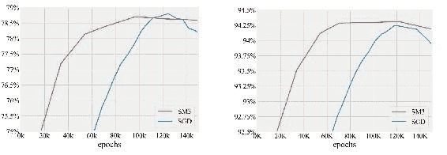**Top-1 (left) and Top-5 (right) test accuracy of AmoebaNet-D on ImageNet ** **## SGD– Stochastic Gradient Descent**

SDG implements stochastic gradient descent with support for momentum and Nesterov acceleration. Momentum makes obtaining optimal model weights faster by accelerating gradient descent in a certain direction.

from flax.training import train_state

def create_train_state(rng, learning_rate):

"""Creates initial `TrainState`."""

cnn = CNN()

params = cnn.init(rng, jnp.ones([1, size_image, size_image,

3]))['params']

tx = optax.sgd(learning_rate)

return train_state.TrainState.create(

apply_fn=cnn.apply, params=params, tx=tx)

## **Noisy SGD**

Noisy SGD is SGD with added noise. Adding noise to gradients can prevent overfitting and improve training error and generalization in deep architectures.

from flax.training import train_state

def create_train_state(rng, learning_rate):

"""Creates initial `TrainState`."""

cnn = CNN()

params = cnn.init(rng, jnp.ones([1, size_image, size_image,

3]))['params']

tx = optax.noisy_sgd(learning_rate)

return train_state.TrainState.create(

apply_fn=cnn.apply, params=params, tx=tx)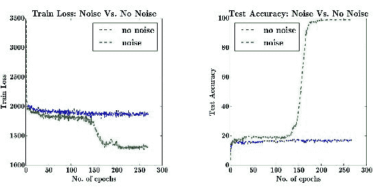 **: Noise vs. No Noise in our experiment with tables containing 5 columns. The models trained with noise generalizes almost always better**  **## Optimistic GD** An Optimistic Gradient Descent optimizer.

*Optimistic gradient descent is an approximation of extra-gradient methods which require multiple gradient calls to compute the next update. It has strong formal guarantees for last-iterate convergence in min-max games, for which standard gradient descent can oscillate or even diverge– Optax.*

from flax.training import train_state

def create_train_state(rng, learning_rate):

"""Creates initial `TrainState`."""

cnn = CNN()

`params = cnn.init(rng, jnp.ones([1, size_image, size_image, tx = optax.optimistic_gradient_descent(learning_rate) return train_state.TrainState.create(`

apply_fn=cnn.apply, params=params, tx=tx)

## **差分隐私 SGD**

差分隐私 SGD 用于训练具有敏感数据的网络。确保模型不会泄露敏感的训练数据。

`from flax.training import train_state`

`def create_train_state(rng, learning_rate):`

"""创建初始`TrainState`。"""

cnn = CNN()

`params = cnn.init(rng, jnp.ones([1, size_image, size_image,`

3]))['params']

`tx = optax.dpsgd(learning_rate)`

返回 train_state.TrainState.create(

apply_fn=cnn.apply, params=params, tx=tx)

## **RMSProp**

RMSProp 通过将其最近幅度的运行平均值的梯度分割来工作 - Hinton.来自 flax.training import train_state

`def create_train_state(rng, learning_rate):`

"""创建初始`TrainState`。"""

cnn = CNN()

`params = cnn.init(rng, jnp.ones([1, size_image, size_image, tx = optax.rmsprop(learning_rate)`

`train_state.TrainState.create(`的返回

apply_fn=cnn.apply, params=params, tx=tx)

## **Yogi**

`Yogi 是用于优化随机非凸优化问题的修改版 Adam 优化器。来自 flax.training import train_state`

`def create_train_state(rng, learning_rate):`

"""创建初始`TrainState`。"""

`cnn = CNN()`

`params = cnn.init(rng, jnp.ones([1, size_image, size_image,`

`3]))['params']`

`tx = optax.yogi(learning_rate)`

`return train_state.TrainState.create(`

`apply_fn=cnn.apply, params=params, tx=tx)` **比较高度调整的 RMSProp 优化器与 YOGI 在 Imagenet 上的 Inception-Resnet-v2。第一张图显示了训练期间损失的小批量估计，而其余两张图显示了在保留的 Imagenet 验证集上的 top-1 和 top-5 错误率**  **## 最后的思考**

选择正确的优化器函数决定了训练网络所需的时间。它还决定了模型的表现如何。因此，在构建 JAX 和 Flax 网络时选择适当的优化器函数至关重要。本文讨论了可以应用于您的网络的各种优化器函数。特别是，您将了解以下优化器的精华：

JAX 中的 Adam 优化器。

Flax 中的 RMSProp 优化器。

JAX 中的随机梯度下降。

`..提及一些。`

## **JAX 损失函数**

损失函数是训练机器学习的核心。它们可以用来识别模型在数据集上的表现如何。表现不佳会导致非常高的损失，而表现良好的模型将具有较低的损失。因此，在构建机器学习模型时，选择损失函数是一个重要的决定。

在这篇文章中，我们将看看 JAX 中可用的损失函数以及如何使用它们。

## **什么是损失函数？**

机器学习模型通过评估预测与真实值的差异并调整权重来学习。目标是获得能够最小化**损失函数**（即**误差**）的权重。损失函数也称为**成本函数**。选择损失函数取决于问题的性质。最常见的问题是分类和回归问题。每个问题需要不同的损失函数。

## **在 JAX 中创建自定义损失函数**

在训练 JAX 网络时，您需要在训练阶段获取 logits。这些 logits 用于计算损失。然后需要评估损失函数及其梯度。梯度用于更新模型参数。此时，您可以为模型计算训练指标。

💡 **Logits 是什么？** Logits 是未归一化的对数概率。*

`def compute_loss(params,images,labels):`

`logits = CNN().apply({'params': params}, images) loss = cross_entropy_loss(logits=logits, labels=labels) return loss, logits`

`@jax.jitdef train_step(state,images, labels): """单步训练。""" (_, logits), grads = jax.value_and_grad(compute_loss, has_aux`

`=True)(state.params,images,labels)`

`state = state.apply_gradients(grads=grads)`

`metrics = compute_metrics(logits=logits, labels=labels) return state, metrics`

您可以使用 JAX 函数如`[log_sigmoid]`和`[log_softmax]`来构建自定义损失函数。甚至可以不使用这些函数从头开始编写您自己的损失函数。

这是计算 Sigmoid 二元交叉熵损失的一个例子。

`import jax`

`def custom_sigmoid_binary_cross_entropy(logits, labels): log_p = jax.nn.log_sigmoid(logits)`

`log_not_p = jax.nn.log_sigmoid(-logits)`

`return -labels * log_p - (1\. - labels) * log_not_p`

`custom_sigmoid_binary_cross_entropy(0.5,0.0) # DeviceArray(0.974077, dtype=float32, weak_type=True)`

## **JAX 中有哪些损失函数可用？**

为您的网络构建自定义损失函数可能会在程序中引入错误。此外，您必须承担维护这些函数的负担。然而，如果您需要的损失函数不可用，则有理由创建自定义损失函数。尽管如此，没有必要重新发明轮子并重写已经实现的损失函数。

JAX 不提供任何损失函数。在 JAX 中，我们使用 `optax` 来定义损失函数。确保您使用与 JAX 兼容的库以利用诸如 `[JIT]`、 `[vmap]` 和 `[pmap]` 等函数，这些函数能够加快程序运行速度。

让我们看看在`optax`中可用的一些损失函数。

## **Sigmoid 二元交叉熵**

计算 Sigmoid 二元交叉熵损失

使用 `optax.sigmoid_binary_cross_entropy`。该函数期望

`logits` 和 `class labels`。它用于类别不互斥的问题。例如，模型可以预测图像中包含两个对象的图像分类问题。

`optax.sigmoid_binary_cross_entropy(0.5,0.0)# DeviceArray(0.974077, dtype=float32, weak_type=True)`

## **Softmax 交叉熵**

Softmax 交叉熵函数用于类别互斥的问题。例如，在 MNIST 数据集中，每个数字正好有一个标签。该函数期望一个 logits 数组和概率分布。概率分布总和为 1。

`logits = jnp.array([0.50,0.60,0.70,0.30,0.25]) labels = jnp.array([0.20,0.30,0.10,0.20,0.2]) optax.softmax_cross_entropy(logits,labels) # DeviceArray(1.6341426, dtype=float32)`

## **余弦距离**

余弦距离衡量目标与预测之间的余弦距离。

`predictions = jnp.array([0.50,0.60,0.70,0.30,0.25]) targets = jnp.array([0.20,0.30,0.10,0.20,0.2]) optax.cosine_distance(predictions,targets,epsilon=0.7) # DeviceArray(0.4128204, dtype=float32)`

## **余弦相似度**

余弦相似度损失函数衡量真实值和预测值之间的余弦相似度。余弦相似度是两个向量之间角度的余弦。通过向量的点积除以它们长度的乘积得到。

结果是-1 到 1 之间的数。0 表示正交，接近-1 表示相似度高。接近 1 表示高度不相似。

`predictions = jnp.array([0.50,0.60,0.70,0.30,0.25]) targets = jnp.array([0.20,0.30,0.10,0.20,0.2]) optax.cosine_similarity(predictions,targets,epsilon=0.5) # DeviceArray(0.8220514, dtype=float32)`

## **Huber 损失**

Huber 损失函数用于回归问题。与平方误差损失相比，它对异常值不太敏感。存在可用于分类问题的 Huber 损失函数的变体。

`logits = jnp.array([0.50,0.60,0.70,0.30,0.25])`

`labels = jnp.array([0.20,0.30,0.10,0.20,0.2])`

`optax.huber_loss(logits,labels)`

# `DeviceArray([0.045 , 0.045 , 0.17999998, 0.005 ,`

`0.00125 ], dtype=float32)`

## **l2 损失**

L2 损失函数是最小二乘误差。L2 损失旨在最小化真实值与预测值之间的平方差的总和。均方误差是所有 L2 损失值的平均值。

`predictions = jnp.array([0.50,0.60,0.70,0.30,0.25]) targets = jnp.array([0.20,0.30,0.10,0.20,0.2])`

`optax.l2_loss(predictions,targets)`

# `DeviceArray([0.045 , 0.045 , 0.17999998, 0.005 ,`

`0.00125 ], dtype=float32)`

## **`log cosh`**

`[`log_cosh`]` 是预测误差的双曲余弦的对数。

💡 `log(cosh(x))` is approximately equal to `(x ** 2) / 2` for small `x` and to `abs(x) - log(2)` for large `x`. This means that 'logcosh' works mostly like the mean squared error, but will not be so strongly affected by the occasional wildly incorrect prediction. TensorFlow Docs*

`predictions = jnp.array([0.50,0.60,0.70,0.30,0.25]) targets = jnp.array([0.20,0.30,0.10,0.20,0.2])`

`optax.log_cosh(predictions,targets)`

# `DeviceArray([0.04434085, 0.04434085, 0.17013526, 0.00499171,`

`0.00124949], dtype=float32)`

## **`Smooth labels`**

`[`optax.smooth_labels`]`  与交叉熵损失一起使用以平滑标签。它返回输入标签的平滑版本。标签平滑已应用于图像分类、语言翻译和语音识别，以防止模型过于自信。

`labels = jnp.array([0.20,0.30,0.10,0.20,0.2])`

`optax.smooth_labels(labels,alpha=0.4)`

# `DeviceArray([0.2 , 0.26, 0.14, 0.2 , 0.2 ], dtype=float32)`

## **`Computing loss with JAX Metrics`**

JAX Metrics 是一个用于在 JAX 中计算损失和指标的开源包。它提供了类似 Keras 的 API 来计算模型的损失和指标。

例如，这里是如何使用库来计算交叉熵损失的。与 Keras 类似，可以通过实例化 [`Loss`] 或 [`loss`] 来计算损失。

# `pip install jax_metrics import jax_metrics as jm`

`crossentropy = jm.losses.Crossentropy() logits = jnp.array([0.50,0.60,0.70,0.30,0.25]) y = jnp.array([0.50,0.60,0.70,0.30,0.25]) crossentropy(target=y, preds=logits)`

# `DeviceArray(3.668735, dtype=float32)`

变量名`logits`赋值`jnp.array([0.50,0.60,0.70,0.30,0.25])` `y`赋值`jnp.array([0.50,0.60,0.70,0.30,0.25])` `jm.losses.crossentropy`(`target=y`, `preds=logits`) `# DeviceArray(3.668735, dtype=float32)`

**Here is what the code would like in a JAX training step.import jax_metrics as jmmetric = jm.metrics.Accuracy()@jax.jitdef init_step`(`metric: jm.Metric`) -> `jm.Metric`: return `metric.init()`

函数名`loss_fn`，参数`params`，`metric`，`x`，`y`: ...

变量名`metric`赋值`metric.update`，参数`target=y`，`preds=logits`...

return `loss`, `metric`@jax.jitdef train_step`(`params`, `metric`, `x`, `y`):grads, metric = jax.grad`(`loss_fn`, `has_aux=True`)(

`params`, `metric`, `x`, `y`

)

...

return `params`, `metric`

`@jax.jitdef reset_step`(`metric: jm.Metric`) -> `jm.Metric`: return `metric.reset()`The losses we have seen earlier can also be computed using JAX Metrics.

`! pip install jax_metrics`

`import jax_metrics as jm`

变量名`target`赋值`jnp.array([50,60,70,30,25])` `preds`赋值`jnp.array([0.50,0.60,0.70,0.30,0.25])` `huber_loss`赋值`jm.losses.Huber()`

`huber_loss`(`target=target`, `preds=preds`) `# DeviceArray(46.030003, dtype=float32)`

变量名`target`赋值`jnp.array([50,60,70,30,25])`

变量名`preds`赋值`jnp.array([0.50,0.60,0.70,0.30,0.25])`

`jm.losses.mean_absolute_error`(`target=target`, `preds=preds`) `# DeviceArray(46.530003, dtype=float32)`

`rng`赋值`jax.random.PRNGKey(42)`

变量名`target`赋值`jax.random.randint(rng, shape=(2, 3), minval=0, maxval =2)`

变量名`preds`赋值`jax.random.uniform(rng, shape=(2, 3))`

`jm.losses.cosine_similarity`(`target`, `preds`, `axis=1`)

# `DeviceArray`([-0.8602638 , -0.33731455], dtype=float32) `target`赋值`jnp.array([50,60,70,30,25])`

变量名`preds`赋值`jnp.array([0.50,0.60,0.70,0.30,0.25])`

`jm.losses.mean_absolute_percentage_error`(`target=target`, `preds=preds`)

# `DeviceArray(98.99999, dtype=float32)`

变量名`target`赋值`jnp.array([50,60,70,30,25])`

变量名`preds`赋值`jnp.array([0.50,0.60,0.70,0.30,0.25])`

`jm.losses.mean_squared_logarithmic_error`(`target=target`, `preds=preds`)

# `DeviceArray(11.7779, dtype=float32)`

`target`赋值`jnp.array([0.50,0.60,0.70,0.30,0.25])` `preds`赋值`jnp.array([0.50,0.60,0.70,0.30,0.25])` `jm.losses.mean_squared_error`(`target=target`, `preds=preds`) `# DeviceArray(0., dtype=float32)`

## **如何监控 JAX 损失函数**

监控网络的损失很重要，因为它表明网络是否在学习。损失的一瞥可以告诉您网络中是否存在问题，比如过拟合。监控损失的一种方式是在网络训练时打印训练和验证损失。

``

您还可以绘制训练和验证损失，以可视化地表示训练过程。

``

## **为什么 JAX 损失会出现 NaN**

当您的程序中出现 NAN 时，JAX 不会显示错误。这是设计上的考虑，因为从加速器显示错误涉及复杂性。在调试时，您可以打开 NAN 检查器以显示 NAN 错误。NAN 应该被修复，因为当它们出现时，网络停止学习。

`from jax.config import config`

`config.update`(`"jax_debug_nans"`, `True`)

`jnp.divide`(`0.0`, `0.0`)

# `FloatingPointError`: 遇到了无效值 (`nan`) 在 `div` 中

然而，什么导致网络中出现 NaN？有各种因素，不限于：

数据集尚未缩放。

训练集中存在 NaN。训练数据中的无限值出现。

错误的优化器函数。梯度爆炸导致训练权重大幅更新。使用非常大的学习率。

## `最后的思考`

在本文中，我们已经看到选择正确的损失函数对网络的学习至关重要。我们还讨论了 JAX 中的各种损失函数。更准确地说，我们涵盖了：

什么是损失函数？

如何在 JAX 中创建自定义损失函数。

JAX 中可用的损失函数。

使用 JAX 指标计算损失。

在 JAX 中监控损失。

如何在 JAX 中避免 NaN。

## `在 JAX 和 Flax 中的激活函数`

激活函数被应用在神经网络中，以确保网络输出所需的结果。激活函数将输出限制在特定范围内。例如，在解决二元分类问题时，结果应该是一个介于 0 和 1 之间的数字。这表示物品属于两个类别的概率。

然而，在回归问题中，您希望数量的数值预测，例如物品的价格。因此，您应该为所解决的问题选择合适的激活函数。

让我们来看看 JAX 和 Flax 中常见的激活函数。

## `ReLU – 矫正线性单元`

**ReLU 激活函数**主要用于神经网络的隐藏层，确保非线性。该函数将所有输出限制在零及以上。小于零的输出被返回为零，而大于零的数则原样返回。这确保了网络中没有负数。

在第 9 行，我们在卷积层之后应用 ReLU 激活函数。

`import flaxfrom flax import linen as nnclass CNN(nn.Module):`

`@nn.compact`

`def __call__(self, x):`

`x = nn.Conv(features=32, kernel_size=(3, 3))(x)`

`x = nn.relu(x)`

`x = nn.avg_pool(x, window_shape=(2, 2), strides=(2, 2))`

`x = nn.Conv(features=64, kernel_size=(3, 3))(x)`

`x = nn.relu(x)`

`x = nn.avg_pool(x, window_shape=(2, 2), strides=(2, 2))`

`x = x.reshape((x.shape[0], -1))`

`x = nn.Dense(features=256)(x)`

`x = nn.relu(x)`

`x = nn.Dense(features=2)(x)`

`x = nn.log_softmax(x)`

return x

## `PReLU – 参数化修正线性单元`

`参数化修正线性单元`是带有额外参数的 ReLU，参数数量等于通道数。它通过引入一个可学习参数 *a* 来工作。PReLU 允许非负值。

`x = nn.PReLU(x)`

## `Sigmoid`

**Sigmoid 激活函数**将输出限制在 0 到 1 之间，主要用于二元分类任务。当类别不是互斥的时候使用 sigmoid。例如，一张图片可能同时有汽车、建筑和树等多种物体。使用 sigmoid 函数来处理这种情况。

x = `nn.sigmoid(x)`

## **Log sigmoid**

**Log sigmoid**计算 sigmoid 激活的对数，其输出在范围−∞到 0 之间。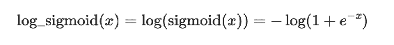x = `nn.log_sigmoid(x)`

## **Softmax**

**Softmax 激活函数**是 sigmoid 函数的一种变体，用于多类问题，其中标签是相互排斥的。例如，一张图片只能是灰度或者彩色。当只有一个正确答案时使用 softmax 激活。

x = `nn.softmax(x)`

## **Log softmax**

**Log softmax**计算 softmax 函数的对数，将元素重新缩放到范围−∞到 0 之间。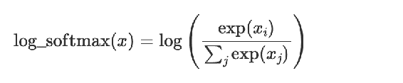x = `nn.log_softmax(x)`

## **ELU – 指数线性单元激活**

**ELU 激活函数**有助于解决梯度消失和梯度爆炸问题。与 ReLU 不同，ELU 允许负数，从而将单位均值激活推向零附近。ELU 可能导致训练速度更快，以及在多层网络中更好的泛化能力。

对于大于零的值，返回原数值，但对于小于零的数值，它们会变成接近零但稍小的数。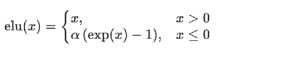x = `nn.elu(x)`

## **CELU – 连续可微的指数线性单元**

`CELU`是连续可微的 ELU 激活函数的变种。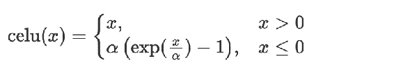x = `nn.celu(x)`

## **GELU – 高斯误差线性单元激活**

-   **GELU** 非线性按其值加权输入，而不是像 ReLU 那样按其符号门控输入– 来源.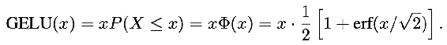x = `nn.gelu(x)` 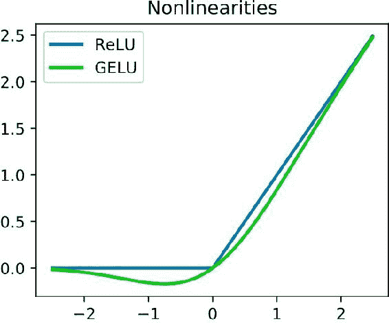

## -   **GLU – 门控线性单元激活**

-   **GLU** 是计算为 [`GLU ( a , b )= a ⊗ σ ( b )`]. 它已被应用于用于自然语言处理的门控 CNNs。在公式中，b 门控制着传递到下一层的信息。GLU 有助于解决消失梯度问题。

x = `nn.glu(x)`

## -   **Soft sign**

**Soft sign** 激活函数将值限制在 -1 到 1 之间。它类似于双曲正切激活函数– tanh。不同之处在于 tanh 指数级收敛，而 Soft sign 多项式级收敛。

x = `nn.soft_sign(x)` 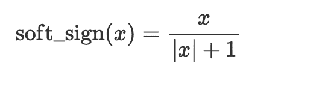

## -   **Softplus**

-   **Softplus 激活** 将返回值为零及以上。它是 ReLu 的平滑版本。x = `nn.soft_plus(x)` 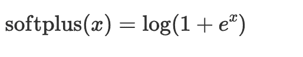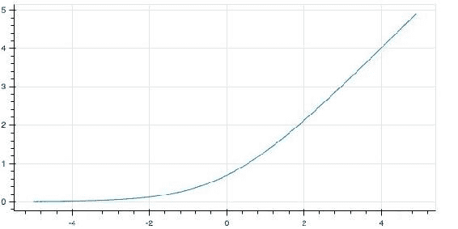**The Softplus activation ** **## Swish–Sigmoid Linear Unit( SiLU)**

SiLU 激活函数计算为 [`x * sigmoid(beta * x)`]，其中 beta 是 Swish 激活函数的超参数。因此，SiLU 是通过将其输入与 sigmoid 函数相乘来计算的。

x = `nn.swish(x)`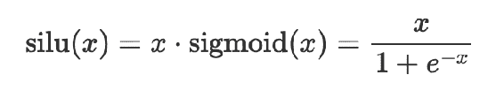

## -   **在 JAX 和 Flax 中的自定义激活函数**

您还可以在 JAX 中定义自定义激活函数。例如，以下是如何定义 LeakyReLU 激活函数。from flax import linen as nnimport jax.numpy as jnpclass `LeakyReLU`(nn.Module):`alpha` : float = 0.1def `__call__`(self, `x`):return jnp.where(`x` > 0, `x`, `self.alpha` * `x`)

## -   **最终思考**

您已经了解了可以在 JAX 和 Flax 中使用的各种激活函数。您还看到，可以通过创建一个实现`[__call__]`方法的类来创建新函数。

## -   如何在`JAX`中加载数据集与`TensorFlow`

`JAX` 不提供数据加载实用程序。这使`JAX`专注于提供一个快速构建和训练机器学习模型的工具。在`JAX`中加载数据是使用

要么`TensorFlow`要么`PyTorch`。本文将重点介绍如何使用`TensorFlow`在`JAX`中加载数据集。

-   让我们深入探讨！

## 如何在`JAX`中加载文本数据

让我们使用`Kaggle`的`IMDB 数据集`来说明如何在`JAX`中加载文本数据集。我们将使用`Kaggle`Python`库下载数据。这需要您的 Kaggle 用户名和密钥。前往

`https://www.kaggle.com/your_username/ account to obtain the API`

关键。

该库将数据下载为 zip 文件。因此，我们将在之后提取它。

import`os`

# Obtain from`https://www.kaggle.com/username/account os.environ["KAGGLE_USERNAME"]="YOUR_KAGGLE_USERNAME" os.environ["KAGGLE_KEY"]="YOUR_KAGGLE_KEY"`

import`kaggle`

!`kaggle datasets download lakshmi25npathi/imdb-dataset-of-50k-movie-reviews`

import`zipfile`

with zipfile.ZipFile('imdb-dataset-of-50k-movie-reviews.zip',

'r') as zip_ref:zip_ref.extractall('imdb-dataset-of-50k-movie-reviews')接下来，导入标准的数据科学包，并查看数据的样本。

`import`numpy as np`

`import`pandas`as`pd`

`from`numpy`import`array`

`import`tensorflow as tf`

`from`sklearn.model_selection`import`train_test_split`

`from`sklearn.preprocessing`import`LabelEncoder`

`import`matplotlib.pyplot`as`plt`

`df = pd.read_csv("imdb-dataset-of-50k-movie-reviews/IMDB Dataset.c df.head()`

!`[](../images/00027.jpeg)`

## 清理文本数据

在使用`TensorFlow`加载数据之前，让我们对数据进行一些处理。文本问题的标准处理是去除停用词。停用词是如`a`、`the`等常见词汇，它们对模型识别情感极性没有帮助。

句子。`NLTK`提供了停用词。因此，我们可以编写一个函数从 IMDB 数据集中去除它们。

`import`nltk`

`from`nltk.corpus`import`stopwords`

`nltk.download('stopwords')`

`def remove_stop_words(review):`

`review_minus_sw = []`

`stop_words = stopwords.words('english')`

`review = review.split()`

`[cleaned_review = [review_minus_sw.append(word) for word in`

`review if word not in stop_words]`

`cleaned_review = ' '.join(review_minus_sw)`

`return cleaned_review`

`df['review'] = df['review'].apply(remove_stop_words) view raw`

## 对情感列进行标签编码

使用`Scikit-learn`的标签编码将情感列转换为数值表示。这很重要，因为神经网络期望数值数据。

`labelencoder = LabelEncoder()`

`df = df.assign(sentiment = labelencoder.fit_transform(df["senti ment"]))`

!`[](../images/00028.jpeg)`

## 使用`TensorFlow`进行文本预处理

我们已将情感列转换为数字

表示。然而，评论仍然是文本形式。我们也需要将它们转换为数字。

我们首先将数据集分割为训练集和测试集。

`from`sklearn.model_selection`import`train_test_split df = df.drop_duplicates()`

`docs = df['review']`

`labels = array(df['sentiment'])`

`X_train, X_test , y_train, y_test = train_test_split(docs, labe ls , test_size = 0.20, random_state=0)`

接下来，我们使用 TensorFlow 的`TextVectorization`函数将文本数据转换为整数表示。该函数期望：

`[standardize]`用于指定如何处理文本数据。例如，选项`[lower_and_strip_punctuation]`将文本转换为小写并删除标点符号。

`max_tokens`决定词汇表的最大大小。`[output_mode]`确定向量化层的输出。设置`[int]`将输出整数。

`[output_sequence_length]`指示输出序列的最大长度。这确保所有序列具有相同的长度。

`import`tensorflow as tf`

`max_features = 5000`# 最大词汇量大小。

`batch_size = 32`

`max_len = 512`# 将输出填充到的序列长度。`vectorize_layer = tf.keras.layers.TextVectorization(standardize ='lower_and_strip_punctuation',max_tokens=max_features,output_m ode='int',output_sequence_length=max_len)`

`vectorize_layer.adapt(X_train, batch_size=None)`

接下来，将此层应用于训练和测试数据。`X_train_padded = vectorize_layer(X_train) X_test_padded = vectorize_layer(X_test)`

将数据转换为`TensorFlow 数据集，并创建一个函数来批量获取数据。我们还将数据转换为 NumPy 数组，因为 JAX 期望使用 NumPy 或 JAX 数组。

import`tensorflow_datasets`as`tfds`

`training_data = tf.data.Dataset.from_tensor_slices((X_train_padded, y_train))`

`validation_data = tf.data.Dataset.from_tensor_slices((X_test_padded, y_test))`

`training_data = training_data.batch(batch_size)`

`validation_data = validation_data.batch(batch_size)`

`def get_train_batches():`

`ds = training_data.prefetch(1)`

# `tfds.dataset_as_numpy`将`tf.data.Dataset`转换为

可迭代的 NumPy 数组`return tfds.as_numpy(ds)`现在数据格式正确，并将传递给 Flax 网络。

让我们快速浏览一下使用这些数据在 Flax 中训练神经网络所需的其余步骤。

首先，在 Flax 中创建一个简单的神经网络。

# pip install`flax`

import`flax`

from`flax`import`linen as nn`

`class Model(nn.Module):`

@nn.compact

`def __call__(self, x): x = nn.Dense(features=256)(x) x = nn.relu(x)`

`x = nn.Dense(features=2)(x) x = nn.log_softmax(x)`

return`x`

定义一个计算损失的函数。

import`optax`

import`jax.numpy`as`jnp`

`def cross_entropy_loss(*, logits, labels):`

`labels_onehot = jax.nn.one_hot(labels, num_classes=2) return optax.softmax_cross_entropy(logits=logits, labels=labe ls_onehot).mean()`接下来，定义计算网络指标的函数。

`def compute_metrics(*, logits, labels):`

`loss = cross_entropy_loss(logits=logits, labels=labels)` `accuracy = jnp.mean(jnp.argmax(logits, -1) == labels)` `metrics = {`

`'loss': loss,`

`'accuracy': accuracy`,

}

return `metrics`

训练状态用于跟踪网络训练。它跟踪优化器和模型参数，并可以修改以跟踪其他内容，例如 dropout 和批归一化统计信息。

from `flax.training import train_state` def `create_train_state(rng, learning_rate, momentum):` """创建初始`TrainState`。"""

`model = Model()`

`params = model.init(rng, X_train_padded[0])['params']` `tx = optax.sgd(learning_rate, momentum)`

return `train_state.TrainState.create(

`apply_fn=model.apply, params=params, tx=tx)`在训练步骤中，我们[应用]模型以获取损失。然后用这个损失来计算更新模型参数的梯度。

`def compute_loss(params,text,labels):`

`logits = Model().apply({'params': params}, text)` `loss = cross_entropy_loss(logits=logits, labels=labels)` return `loss, logits`

@jax.jit

`def train_step(state,text, labels):`

"""对单个步骤进行训练。"""

`(_, logits), grads = jax.value_and_grad(compute_loss, has_aux =True)(state.params,text,labels)`

`state = state.apply_gradients(grads=grads)`

`metrics = compute_metrics(logits=logits, labels=labels)`

return `state, metrics`

评估步骤将模型应用于测试数据以计算测试指标。

@jax.jit

`def eval_step(state, text, labels):`

`logits = Model().apply({'params': state.params}, text)`

return `compute_metrics(logits=logits, labels=labels)`

评估函数运行上述评估步骤以获取评估指标。

`def evaluate_model(state, text, test_lbls):`

"""在验证集上进行评估。"""

`metrics = eval_step(state, text, test_lbls)` `metrics = jax.device_get(metrics)`

`metrics = jax.tree_map(lambda x: x.item(), metrics)` return `metrics`

我们在`train_epoch`方法中使用`get_train_batches`函数。我们通过应用`[train_step]`方法循环遍历批次。我们获取训练指标并返回它们。

`def train_one_epoch(state):`

"""在训练集上进行 1 轮训练。""" `batch_metrics = []`

for `text, labels in get_train_batches():`

`state, metrics = train_step(state, text, labels)` `batch_metrics.append(metrics)`batch_metrics_np = jax.device_get(batch_metrics) epoch_metrics_np = {k: np.mean([metrics[k] for metrics in batch_metrics_n p])for k in batch_metrics_np[0] }return `state, epoch_metrics_np`

最后一步是在训练集上训练网络，并在测试集上进行评估。在训练模型之前需要一个训练状态。这是因为 JAX 期望纯函数。

`rng = jax.random.PRNGKey(0)`，`rng, init_rng = jax.random.split(rng)`

`learning_rate = 0.1 momentum = 0.9`

`seed = 0`

`state = create_train_state(init_rng, learning_rate, momentum)` del `init_rng # 不再使用。`

`num_epochs = 30`

`(text, test_labels) = next(iter(validation_data))` `text = jnp.array(text)`

`test_labels = jnp.array(test_labels)`

`state` = `create_train_state(jax.random.PRNGKey(seed), learning_r ate, momentum)`

`training_loss` = []

`training_accuracy` = []

`testing_loss` = []

`testing_accuracy` = []

for epoch in range(1, num_epochs + 1):

`train_state, train_metrics = train_one_epoch(state) training_loss.append(train_metrics['loss'])`

`training_accuracy.append(train_metrics['accuracy']) print(f"Train epoch: {epoch}, loss: {train_metrics['los`

s']}, accuracy: {train_metrics['accuracy'] * 100}")`

`test_metrics` = `evaluate_model(train_state, text, test_label s)`

`testing_loss.append(test_metrics['loss'])`

`testing_accuracy.append(test_metrics['accuracy'])`

`print(f"Test epoch: {epoch}, loss: {test_metrics['loss']}, accuracy: {test_metrics['accuracy'] * 100}")`

``

## **如何在 JAX 中加载图像数据**

现在让我们看看如何使用 TensorFlow 加载图像数据。我们将使用来自 Kaggle 的流行的猫和狗图像。我们首先下载数据。

`import wget # pip install wgetimport zipfile`

`wget.download("https://ml.machinelearningnuggets.com/train.zi p")`

`with zipfile.ZipFile('train.zip', 'r') as zip_ref:`

`zip_ref.extractall('.')接下来，创建一个包含标签和图像路径的`Pandas DataFrame`。

`import pandas as pd`

`base_dir` = `'train'`

`filenames = os.listdir(base_dir) categories = []`

`for filename in filenames:`

`category = filename.split('.')[0] if category == 'dog':categories.append("dog")`

`else:`

`categories.append("cat") df = pd.DataFrame({'filename': filenames,'category': categorie s})`

下一步是为图像缩放和执行简单数据增强定义一个`ImageDataGenerator`。

`from tensorflow.keras.preprocessing.image import ImageDataGener ator`

`train_datagen` = `ImageDataGenerator(rescale=1./255,`

`shear_range=0.2, zoom_range=0.2,`

`horizontal_flip=True, width_shift_range=0.1, height_shift_range=0.1, validation_split=0.2 )`

`validation_gen` = `ImageDataGenerator(rescale=1./255,validation_s plit=0.2)`

使用这些生成器的`[flow_from_dataframe]`加载图像。这将把 DataFrame 中的图像路径与我们下载的图像进行匹配。

`image_size = (128, 128)`

`batch_size = 128`

`training_set` = `train_datagen.flow_from_dataframe(df,base_dir,`

`seed=101, target_size=ima ge_size,`

`batch_size=batc h_size,`

`x_col='filenam e'`,

`y_col='分类'`

subset = `"训练"`

`class_mode='bin ary')`

`validation_set` = `validation_gen.flow_from_dataframe(df,base_di r,`

`target_size=image _size`,

`batch_size=batch_b size,`

`x_col='文件名'`,

`y_col='分类'`,

subset = `"验证"`

`class_mode='binar y')`

遍历训练集以确认是否生成了一批图像。

`for train_images, train_labels in training_set: print('Train:', train_images.shape, train_labels.shape) break`

# 训练：`(128, 128, 128, 3) (128,)`

下一步是定义一个神经网络并传递数据。步骤与我们上面对文本数据所做的步骤类似

## **如何在 JAX 中加载 CSV 数据**

你可以使用`Pandas`来加载 CSV 数据，就像我们在文章开头的文本数据那样。在预处理完成后，将数据转换为 NumPy 或`JAX 数组`。将 Torch 张量或 TensorFlow 张量传递给`JAX`神经网络会导致错误。

## `**最后的思考**`

本文展示了如何使用 TensorFlow 在`JAX`和`Flax`应用程序中加载数据集。我们已经介绍了如何使用 TensorFlow 加载文本数据的示例。之后，我们讨论了在`JAX`中加载图像和 CSV 数据。

## `**使用 JAX 和 Flax 进行图像分类**`

`Flax`是一个面向`JAX`的神经网络库。`JAX`是一个提供高性能计算的`Python`库，用于机器学习研究。`JAX`提供了与`NumPy`类似的 API，使其易于采用。`JAX`还包括其他用于改进机器学习研究的功能。其中包括：

**自动微分** . `JAX` 支持使用 `jacrev`, `grad`, `hessian` 和 `jacfwd` 等函数进行数值函数的前向和反向自动微分。

**向量化** . `JAX` 通过 `[vmap]` 函数支持自动向量化。它还通过 `[pmap]` 函数使得大规模数据处理易于并行化。

**即时编译** . `JAX` 使用 `XLA` 来进行代码的即时编译和在 GPU 和 TPU 上执行。在本文中，让我们看看如何使用 `JAX` 和 `Flax` 来构建一个简单的卷积神经网络。

## **加载数据集**

我们将使用来自 Kaggle 的`猫狗数据集`。让我们从下载和解压开始。`import wget # pip install wget import zipfile`

`wget.download("https://ml.machinelearningnuggets.com/train.zi p")`

`with zipfile.ZipFile('train.zip', 'r') as zip_ref:`

`zip_ref.extractall('.')`

Flax 没有任何数据加载工具。你可以使用来自 `PyTorch` 的数据加载器。

或者使用 `TensorFlow`。在这种情况下，让我们使用 PyTorch 加载数据。首先要定义数据集类。

`from PIL import Image`

`import pandas as pd`

`from torch.utils.data import Dataset`

`class CatsDogsDataset(Dataset):`

`def __init__(self, root_dir, annotation_file, transform=Non`

`e):`

`self.root_dir = root_dir`

`self.annotations = pd.read_csv(annotation_file) self.transform = transform`

`def __len__(self):return len(self.annotations) def __getitem__(self, index):img_id = self.annotations.iloc[index, 0]img = Image.open(os.path.join(self.root_dir, img_id)).c onvert("RGB")y_label = torch.tensor(float(self.annotations.iloc[inde x, 1]))if self.transform is not None: img = self.transform(img)return (img, y_label)`接下来，我们创建一个将包含类别的 `Pandas DataFrame`。`import osimport pandas as pd`

`train_df = pd.DataFrame(columns=["img_path","label"]) train_df["img_path"] = os.listdir("train/") for idx, i in enumerate(os.listdir("train/")):`

`if "cat" in i:`

`train_df["label"][idx] = 0`

`if "dog" in i:`

`train_df["label"][idx] = 1`

`train_df.to_csv (r'train_csv.csv', index = False, header=True)`定义一个函数，将堆叠数据并以 NumPy 数组形式返回。

`import numpy as np`

def `custom_collate_fn(batch)`

transposed_data = `list(zip(*batch))`

labels = `np.array(transposed_data[1])`

imgs = `np.stack(transposed_data[0])`

return `imgs, labels`

现在我们准备好定义训练和测试数据，并使用 PyTorch 的 DataLoader。我们还定义了一个用于调整图像大小的 PyTorch 转换。

import `torch`

from `torch.utils.data import DataLoader` from `torchvision import transforms` import `numpy as np`

size_image = 64 batch_size = 32

transform = `transforms.Compose([`

transforms.Resize((size_image,size_image)),

`np.array]`

dataset = `CatsDogsDataset("train","train_csv.csv",transform=tra nsform)`

训练集、验证集 = `torch.utils.data.random_split(datas et,[20000,5000])`

train_loader = `DataLoader(dataset=train_set, collate_fn=custom_collate_fn,shuffle=True, batch_size=batch_size)`

validation_loader = `DataLoader(dataset=validation_set,collate_f n=custom_collate_fn, shuffle=False, batch_size=batch_size)`

## 使用 Flax 定义卷积神经网络

安装 Flax 来创建一个简单的神经网络。`pip install flax`

在 Flax 中使用 Linen API 创建网络

子类化 Module。所有的 Flax 模块都是 Python 的 dataclasses。这意味着它们默认具有 `__init__` 方法。因此，你应该覆盖 `setup()` 方法来初始化网络。但是，你可以使用紧凑的包装器

使模型定义更加简洁。

导入 `flaxfrom flax import linen as nnclass CNN(nn.Module):`

@`nn.compact`

def `__call__(self, x):`

x = `nn.Conv(features=32, kernel_size=(3, 3))(x)`

x = `nn.relu(x)`

x = `nn.avg_pool(x, window_shape=(2, 2), strides=(2, 2))`

x = `nn.Conv(features=64, kernel_size=(3, 3))(x)`

x = `nn.relu(x)`

x = `nn.avg_pool(x, window_shape=(2, 2), strides=(2, 2))`

x = `x.reshape((x.shape[0], -1))`

x = `nn.Dense(features=256)(x)`

x = `nn.relu(x)`

x = `nn.Dense(features=2)(x)`

x = `nn.log_softmax(x)`

返回 x

## 定义损失

可以使用 Optax 包计算损失。我们在传递给 softmax 交叉熵函数之前对整数标签进行了 one-hot 编码。num_classes 为 2，因为我们处理的是两类问题。

导入 `optax`

def `cross_entropy_loss(*, logits, labels)`

labels_onehot = `jax.nn.one_hot(labels, num_classes=2)`

返回 `optax.softmax_cross_entropy(logits=logits, labels=labels_onehot).mean()`

## 计算指标

接下来，我们定义一个函数，使用上述损失函数计算并返回损失。我们还在同一个函数中计算准确率。

def `compute_metrics(*, logits, labels):`

loss = `cross_entropy_loss(logits=logits, labels=labels)` accuracy = `jnp.mean(jnp.argmax(logits, -1) == labels)` metrics = {

'loss': loss,

`'accuracy': accuracy,`

}

返回指标

## 创建训练状态

训练状态保存模型变量，如参数和优化器状态。这些变量在每次迭代中使用优化器进行修改。如果在模型中包含 dropout 和批处理统计信息，你可以子类化 `flax.training.train_state` 来跟踪更多数据。对于这个简单的模型，默认的类就足够了。

从 `flax.training` 导入 `train_state`

def `create_train_state`(rng, learning_rate, momentum): """Creates initial `TrainState`."""

`cnn = CNN()`

params = `cnn.init`(rng, jnp.ones([1, size_image, size_image,

`3`]))['params']

tx = `optax.sgd`(learning_rate, momentum)

返回 `train_state.TrainState.create`(

apply_fn=`cnn.apply`, params=`params`, tx=`tx`)

## **定义训练步骤**

在这个函数中，我们使用 `Apply` 方法对一组输入图像评估模型。我们使用获取的 logits 计算损失。然后我们使用 `value_and_grad` 来评估损失函数及其梯度。然后使用梯度来更新模型参数。最后，它使用上面定义的 `[compute_metrics]` 函数来计算损失和准确率。

def `compute_loss`(params,images,labels):

logits = `CNN().apply`({'params': params}, images) loss = `cross_entropy_loss`(logits=`logits`, labels=`labels`) return `loss`, `logits`

@`jax.jit`

def `train_step`(state,images, labels):

"""单步训练。"""

(_, logits), grads = jax.value_and_grad(`compute_loss`, has_aux =`True`)(state.params,images,labels)

state = `state.apply_gradients`(grads=`grads`)

metrics = `compute_metrics`(logits=`logits`, labels=`labels`)

return `state`, `metrics`

函数被 @`Jit` 修饰，以跟踪函数并即时编译，以提高计算速度。

## **定义评估步骤**

评估函数将使用 `[Apply]`  来在测试数据上评估模型。

@`jax.jit`

def `eval_step`(state, images, labels):

logits = `CNN().apply`({'params': state.params}, images)

return `compute_metrics`(logits=`logits`, labels=`labels`)

## **训练函数**

在此函数中，我们应用了上面定义的训练步骤。我们遍历数据加载器中的每个批次并对每个批次进行优化。我们使用 `[jax.device_get]` 来获取指标并计算均值。

def `train_one_epoch`(state, dataloader):

"""在训练集上训练 1 个 epoch。""" batch_metrics = []

对于 cnt, (images, labels) 在 dataloader 中的每一个枚举：

images = images / `255.0`

state, metrics = `train_step`(state, images, labels) batch_metrics.append(metrics)

batch_metrics_np = jax.device_get(batch_metrics) epoch_metrics_np = {k: np.mean([metrics[k] for metrics in batch_metrics_n p])for k in batch_metrics_np[0] }return `state`, `epoch_metrics_np`

## **评估模型**

评估函数运行评估步骤并返回测试指标。

def `evaluate_model`(state, test_imgs, test_lbls): """在验证集上评估。"""

metrics = `eval_step`(state, test_imgs, test_lbls) metrics = jax.device_get(metrics)

`metrics = jax.tree_map(lambda x: x.item(), metrics) return metrics`

## 训练和评估模型

在训练模型之前，我们需要初始化训练状态。初始化状态函数需要一个伪随机数（PRNG）密钥。使用 [PRNGKey] 函数获取密钥并拆分它以获得另一个用于参数初始化的密钥。点击此链接了解更多关于 JAX PRNG 设计的信息。

将此密钥与学习率和动量一起传递给 [create_train_state] 函数。现在可以使用 [train_one_epoch] 函数训练模型以及 eval_model 函数评估模型。

`import jaxrng = jax.random.PRNGKey(0)rng, init_rng = jax.random.split(rng)`

`learning_rate = 0.1 momentum = 0.9`

`seed = 0`

`state = create_train_state(init_rng, learning_rate, momentum) del init_rng # 不再使用。`

`num_epochs = 30`

`(test_images, test_labels) = next(iter(validation_loader)) test_images = test_images / 255.0`

`state = create_train_state(jax.random.PRNGKey(seed), learning_r ate, momentum)`

`training_loss = []`

`training_accuracy = []`

`testing_loss = []`

`testing_accuracy = []`

`for epoch in range(1, num_epochs + 1):`

`train_state, train_metrics = train_one_epoch(state, train_l oader)`

`training_loss.append(train_metrics['loss'])`

`training_accuracy.append(train_metrics['accuracy'])`

`print(f"训练周期：{epoch}，损失：{train_metrics['loss']}，准确率：{train_metrics['accuracy'] * 100}")`

`test_metrics = evaluate_model(train_state, test_images, tes t_labels)`

`testing_loss.append(test_metrics['loss'])`

`testing_accuracy.append(test_metrics['accuracy'])`

`print(f"测试周期：{epoch}，损失：{test_metrics['loss']}，准确率：{test_metrics['accuracy'] * 100}")`

## 模型性能

在训练过程中，我们会打印训练和验证指标。您也可以使用这些指标绘制训练和验证图表。

`import matplotlib.pyplot as plt`

`plt.plot(training_accuracy, label="Training") plt.plot(testing_accuracy, label="Test") plt.xlabel("Epoch")`

`plt.ylabel("Accuracy")`

`plt.legend()`

`plt.show()`

`plt.plot(training_loss, label="Training") plt.plot(testing_loss, label="Test") plt.xlabel("Epoch")`

`plt.ylabel("Accuracy")`

`plt.legend()`

`plt.show()`

## 总结思考

在本文中，我们看到了如何在 Flax 上设置一个简单的神经网络并在 CPU 上训练它。

## 使用 JAX 和 Flax 进行分布式训练

使用 JAX 和 Flax 在加速器上训练模型与在 CPU 上训练略有不同。例如，在使用多个加速器时，数据需要在不同设备之间复制。之后，我们需要在多个设备上执行训练并聚合结果。Flax 支持 TPU 和 GPU 加速器。

在上一篇文章中，我们看到了如何使用 CPU 训练模型。本文将专注于使用 Flax 和 JAX 在 GPU 和 TPU 上训练模型。

## 执行标准导入

为了进行演示，您需要安装 Flax。可以通过 pip install flax 进行安装。让我们导入这个项目中将要使用的所有包。

`import wget`

`import zipfile`

`import torch`

`from torch.utils.data import DataLoader import os`

`from PIL import Image`

`from torchvision import transforms from torch.utils.data import Dataset import numpy as np`

`import pandas as pd`

`import matplotlib.pyplot as plt`

`import functools`

`import time`

`from tqdm.notebook import tqdm`

# 忽略无害的警告

`import warnings`

`warnings.filterwarnings("ignore") warnings.simplefilter('ignore') import jax`

`from jax import numpy as jnp`

`from flax import linen as nn`

`from flax.training import train_state import optax`

`import math`

`from flax import jax_utils`

`import jax.tools.colab_tpu`

## **在 Colab 上设置 TPUs**

在 Colab 上切换到 TPUs 运行时。接下来，运行以下代码设置`JAX`以使用 TPUs。`jax.tools.colab_tpu.setup_tpu() jax.devices()`

## **下载数据集**

我们将使用来自 Kaggle 的`猫和狗数据集`。让我们从下载和解压开始。`import wget # pip install wget import zipfile`

`wget.download("https://ml.machinelearningnuggets.com/train.zi p")`

`with zipfile.ZipFile('train.zip', 'r') as zip_ref:`

`zip_ref.extractall('.')`

## **加载数据集**

由于`JAX`和 Flax 没有任何数据加载器，我们将使用现有的数据加载器来加载数据。在这种情况下，让我们使用`PyTorch`来加载数据集。第一步是设置一个数据集类。

`CatsDogsDataset`类：

`__init__`方法：

`e):`

`self.root_dir = root_dir`

`self.annotations = pd.read_csv(annotation_file) self.transform = transform`

`__len__`方法：

`__getitem__`方法：

`img_id = self.annotations.iloc[index, 0]`

`img = Image.open(os.path.join(self.root_dir, img_id)).c`

`onvert("RGB")`

`y_label = torch.tensor(float(self.annotations.iloc[inde`

`x, 1]))`

`if self.transform is not None: img = self.transform(img)return (img, y_label)接下来，我们创建一个包含类别的 DataFrame。`

`train_df = pd.DataFrame(columns=["img_path","label"]) train_df["img_path"] = os.listdir("train/") for idx, i in enumerate(os.listdir("train/")):`

`if "cat" in i:`

`train_df["label"][idx] = 0`

`if "dog" in i:`

`train_df["label"][idx] = 1`

`train_df.to_csv (r'train_csv.csv', index = False, header=True)`

然后，我们使用数据集类创建训练和测试数据。我们还应用一个自定义函数将数据返回为`NumPy`数组。稍后，我们将使用这个`train_loader`

在训练模型时。然后我们将在一批测试数据上评估它。

`custom_collate_fn`函数：

`transposed_data = list(zip(*batch)) labels = np.array(transposed_data[1]) imgs = np.stack(transposed_data[0]) return imgs, labels`

`size_image = 224 batch_size = 64`

`transform = transforms.Compose([`

`transforms.Resize((size_image,size_image)),`

`np.array])`

`dataset = CatsDogsDataset("train","train_csv.csv",transform=tra nsform)`

`train_set, validation_set = torch.utils.data.random_split(datas et,[20000,5000])`

`train_loader = DataLoader(dataset=train_set, collate_fn=custom_ collate_fn,shuffle=True, batch_size=batch_size)`

`validation_loader = DataLoader(dataset=validation_set,collate_f n=custom_collate_fn, shuffle=False, batch_size=batch_size)`

## 使用 Flax 定义模型

在 Flax 中，模型是使用 Linen API 定义的。它提供了定义卷积层、dropout 等的基本构件。

网络通过子类化`[Module]`创建。Flax 允许您使用`[setup]`或`[nn.compact]`定义网络。这两种方法的行为相同，但`[nn.compact]`

更简洁。

## 创建训练状态

现在我们需要创建函数的并行版本。在 JAX 中，使用并行化

`[pmap]` 函数。 `[pmap]` 会使用 XLA 编译函数并在多个设备上执行。

```python

`cnn = CNN()`

`params = cnn.init(rng, jnp.ones([1, size_image, size_image, 3]))['params']`

`tx = optax.sgd(learning_rate, momentum)`

`return train_state.TrainState.create(`

`apply_fn=cnn.apply, params=params, tx=tx)`

## 应用模型

下一步是定义

并行应用 `apply_model` 和 `update_model` 函数。

`[apply_model]` 函数：

计算损失。

通过计算使用 `[jax.lax.pmean()]` 计算所有设备的概率平均值来生成预测。```python

logits = CNN().apply({'params': params}, images) one_hot = jax.nn.one_hot(labels, 2)

`loss = optax.softmax_cross_entropy(logits=logits, labels=on`

e_hot).mean()return loss, logits

`grad_fn = jax.value_and_grad(loss_fn, has_aux=True) (loss, logits), grads = grad_fn(state.params)`

`probs = jax.lax.pmean(jax.nn.softmax(logits), axis_name='ense`

```python

注意使用了 `[axis_name]`。你可以随意指定名称。在计算概率和准确率的平均值时，需要指定这个名称。

`[update_model]` 函数更新模型参数。

## 训练函数

下一步是定义模型训练函数。在该函数中，我们：

在批级别上复制训练数据

使用 `jax_utils.replicate`。

`[apply_model]` 应用于复制的数据。

获取 epoch 损失和准确率，并对其进行解复制

使用 `jax_utils.unreplicate`。

计算损失和准确率的均值。

`[apply_model]` 应用于测试数据并获取测试指标。

打印每个 epoch 的训练和评估指标。将训练和测试指标附加到列表中，以便稍后可视化。

```python

`epoch_loss = []`

`epoch_accuracy = []`

`testing_accuracy = []`

`testing_loss = []`

`for epoch in range(num_epochs):`

`for cnt, (images, labels) in tqdm(enumerate(dataloade r), total=(math.ceil(len(train_set)/batch_size))): images = images / 255.0`

`images` = `jax_utils.replicate(images)`

`labels` = `jax_utils.replicate(labels)`

`grads`, `loss`, `accuracy` = `apply_model(state, images`,

`labels)`

`state` = `update_model(state, grads)`

`epoch_loss.append(jax_utils.unreplicate(loss)) epoch_accuracy.append(jax_utils.unreplicate(accuracy)) train_loss = np.mean(epoch_loss)`

`train_accuracy = np.mean(epoch_accuracy)`

`_, test_loss, test_accuracy` = `jax_utils.unreplicate(apply_model(state, test_images, test_labels))`

`testing_accuracy.append(test_accuracy)`

`testing_loss.append(test_loss)`

`print(f"Epoch: {epoch + 1}, train loss: {train_loss:.4 f}, train accuracy: {train_accuracy * 100:.4f}, test loss: {tes t_loss:.4f}, test accuracy: {test_accuracy* 100:.4f}", flush=Tr ue)`

`return state, epoch_loss, epoch_accuracy, testing_accuracy, testing_loss`

## 训练模型

创建训练状态时，我们生成与设备数量相当的伪随机数。我们还为测试复制了一小批测试数据。下一步是运行训练函数并解压缩训练和测试指标。

`learning_rate = 0.1 momentum = 0.9`

`seed = 0`

`num_epochs = 30`

`rng` = `jax.random.PRNGKey(0)`

`rng`, `init_rng` = `jax.random.split(rng)`

`state` = `create_train_state(jax.random.split(init_rng, jax.device_count()),learning_rate, momentum)` `del init_rng` # 不再使用。

`(test_images, test_labels)` = `next(iter(validation_loader))` `test_images = test_images / 255.0`

`test_images` = `jax_utils.replicate(test_images)`

`test_labels` = `jax_utils.replicate(test_labels)`

`start = time.time()`

`state`, `epoch_loss`, `epoch_accuracy`, `testing_accuracy`, `testing_loss` = `train_one_epoch(state, train_loader,num_epochs)` `print("Total time: ", time.time() - start, "seconds")`

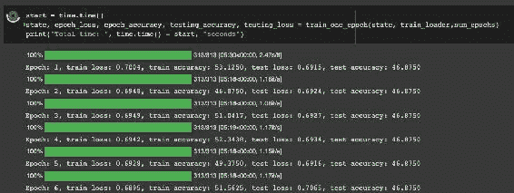

## 模型评估

上面获得的指标可用于绘制指标。

`plt.plot(epoch_accuracy, label="Training")`

`plt.plot(testing_accuracy, label="Test")`

`plt.xlabel("Epoch")`

`plt.ylabel("Accuracy")`

`plt.legend()`

`plt.show()`

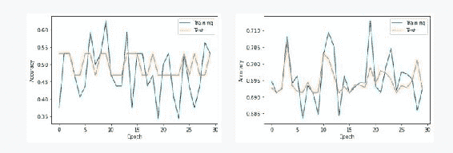

## 最终想法

本文展示了如何使用 JAX 和 Flax 在多设备上并行训练机器学习模型。您已经看到该过程涉及使用 JAX 的 pmap 函数将几个函数并行化。我们还介绍了如何在多个设备上复制训练和测试数据。

## 如何在 JAX 和 Flax 中使用 TensorBoard

跟踪机器学习实验使理解和可视化模型性能变得简单。它还可以帮助您快速发现网络中的任何问题。例如，通过查看训练和验证图表，您可以快速发现过拟合问题。您可以使用自己喜欢的图表包（如 Matplotlib）绘制这些图表。但是，您也可以使用更先进的工具，如 TensorBoard。

TensorBoard 是一个开源库，提供了机器学习实验跟踪工具。您可以使用 TensorBoard 进行：

跟踪和可视化模型评估指标，如准确性。

记录图像。

可视化超参数调整。

项目嵌入，例如自然语言处理问题中的词嵌入。

可视化模型权重和偏差的直方图。

绘制模型的架构。

评估网络性能。

您可以在流行的机器学习库（如 XGBoost、JAX、Flax 和 PyTorch）中使用 TensorBoard。

本文将重点介绍在使用 JAX 和 Flax 构建网络时如何使用 TensorBoard。

## **如何使用 TensorBoard**

让我们从探索如何使用 TensorBoard 开始。

## **如何安装 TensorBoard**

第一步是从 Python Index 安装 TensorBoard。`pip install tensorboard`

## **在 Jupyter 笔记本和 Google Colab 中使用 TensorBoard**

安装了 TensorBoard 后，您需要在环境中加载它，通常是在 Google Colab 或本地笔记本中。 `%load_ext tensorboard` 接下来，告诉 TensorBoard 哪个文件夹将包含日志信息。 `log_folder = "runs"`

## **如何启动 TensorBoard**

Tensorboard 使用 `[tensorboard]` 魔术命令在笔记本环境中启动，同时指定 `[logdir]`。 `%tensorboard --logdir={log_folder}`

您还可以使用类似的模式在命令行上启动 TensorBoard。除了在笔记本环境中查看终端外，您还可以通过访问以下地址在浏览器中查看：http://localhost:6006。

## **Tensorboard 仪表板**

TensorBoard 拥有各种仪表板，用于显示不同类型的信息。

**Scalars** 仪表板跟踪数字信息，如每个 epoch 的训练指标。您可以使用它来跟踪模型训练速度和学习率等其他标量值。

**Graphs** 仪表板用于显示可视化。例如，您可以使用它来检查网络的架构。

**Distributions and Histograms** 仪表板显示张量随时间的分布。用它来检查网络的权重和偏置。

**Images** 仪表板显示您已记录到 TensorBoard 的图像。

**HParams** 仪表板可视化超参数优化。它帮助确定网络的最佳参数。

**Embedding Projector** 用于可视化低级嵌入，例如文本嵌入。

**What-If Tool** 仪表板帮助理解模型的性能。它还能够在数据子集上测量模型的公平性。

**TensorFlow Profiler** 监控模型训练过程。它还显示了训练期间 CPU 和 GPU 上的事件。TensorFlow 分析器进一步根据收集的数据提供建议。您还可以使用它来调试输入管道中的性能问题。

## **如何在 Flax 中使用 TensorBoard**

安装了 TensorBoard 并完成了一些基础设置后，让我们看看如何在 Flax 中使用它。 让我们使用

使用 PyTorch 中的 `[SummaryWriter]` 向日志文件夹写入。

## **如何在 Flax 中使用 TensorBoard 记录图像**

在解决计算机视觉问题时，您可能希望记录样本图像。您还可以在训练模型时记录预测。例如，您可以记录包含对象检测网络边界框的预测图像。

让我们看看如何将图像记录到 TensorBoard。 from `torch.utils.tensorboard` import `SummaryWriter` import `torchvision.transforms.functional` as `Fwriter = SummaryWriter(logdir)` def show(imgs): if not isinstance(imgs, list):

`imgs = [imgs]`

`fig, axs = plt.subplots(ncols=len(imgs), squeeze=False)` for i, img in enumerate(imgs):

`img = img.detach()`

`img = F.to_pil_image(img)`

`axs[0, i].imshow(np.asarray(img))`

`axs[0, i].set(xticklabels=[], yticklabels=[], xticks=`

[], yticks=[])writer.flush() # 确保所有内容都已写入磁盘接下来，创建将记录的图像的网格。

from`torchvision.utils`import`make_grid`from`torchvision.io`import`read_image`from`pathlib`import`Path`

`cat = read_image(str(Path('train') / 'cat.1.jpg')) grid = make_grid(cat)`

`show(grid)`

使用`[add_image]`函数将图像写入 TensorBoard。`writer.add_image('sample_cat', grid)`现在，加载 TensorBoard 扩展并将其指向日志文件夹。`%tensorboard --logdir={logdir}`记录的图像将在图像仪表板上可见。**TensorBoard 图像仪表板** **## 如何在 Flax 中使用 TensorBoard 记录文本** 使用`[add_text]`函数向 TensorBoard 写入文本。`writer.add_text('Text', 'Write image to TensorBoard', 0)`记录的数据在文本仪表板上可用。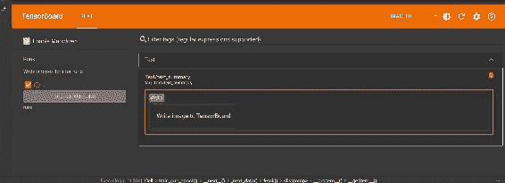

## **使用 TensorBoard 跟踪 JAX 模型训练**

在训练机器学习模型时，可以记录评估指标。它们在训练阶段获取。此时，您可以将指标记录到 TensorBoard。在下面的示例中，我们记录训练和评估指标。

`for epoch in range(1, num_epochs + 1):`

`train_state, train_metrics = train_one_epoch(state, train_l`

`oader)`

`training_loss.append(train_metrics['loss'])`

`training_accuracy.append(train_metrics['accuracy']) print(f"Train epoch: {epoch}, loss: {train_metrics['los`

s']}, 准确率: {train_metrics['accuracy'] * 100}")

`test_metrics = evaluate_model(train_state, test_images, tes t_labels)`

`testing_loss.append(test_metrics['loss'])`

`testing_accuracy.append(test_metrics['accuracy'])`

`writer.add_scalar('Loss/train', train_metrics['loss'], epoc h)`

`writer.add_scalar('Loss/test', test_metrics['loss'], epoch)`

`writer.add_scalar('Accuracy/train', train_metrics['accuracy'], epoch)`writer.add_scalar('Accuracy/test', test_metrics['accuracy'], epoch)print(f"Test epoch: {epoch}, loss: {test_metrics['loss']}, accuracy: {test_metrics['accuracy'] * 100}")这些指标将在 TensorBoard 的**Scalars**仪表板上可用。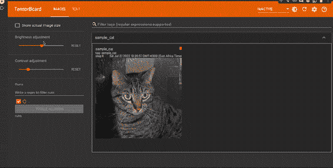

## **如何使用 TensorBoard 分析 JAX 程序**

要分析 JAX 程序，请将数据发送到 TensorBoard 分析器。第一步是安装分析插件。`pip install -U tensorboard-plugin-profile`

## **程序化分析**

使用`jax.profiler.start_trace()`来启动跟踪

和`jax.profiler.stop_trace()`来停止跟踪。

`[start_trace()]`期望将跟踪写入的目录路径。`import jax`jax.profiler.start_trace("runs")

# 运行要分析的操作 `key = jax.random.PRNGKey(0)`

`x = jax.random.normal(key, (5000, 5000)) y = x @ x`

`y.block_until_ready()`

`jax.profiler.stop_trace()`

## **使用`TensorBoard`进行手动分析**

第二个选项是手动分析`JAX`程序。 ``以下是操作步骤：

在程序开始时初始化`TensorBoard`，使用`tensorboard --logdir /runs`启动一个`JAX`性能分析服务器，并在程序结束时停止服务器。

导入`jax.profiler`。

`jax.profiler.start_server(9999)`。

`train_one_epoch(state, train_loader,num_epochs)`。

`jax.profiler.stop_server()`。

打开`TensorBoard`的 Profile 仪表板。点击 **CAPTURE PROFILE**，输入上述启动服务器的 URL，例如 localhost:9999。点击 CAPTURE 开始性能分析。

在 Profile 仪表板上的**工具**下选择 **trace_viewer**。使用导航工具点击特定事件以查看更多信息。

## **如何在远程机器上对`JAX`程序进行性能分析**。

你可以通过在远程服务器上执行上述指令来对一个`JAX`程序进行性能分析。这涉及在远程机器上启动`TensorBoard`服务器，并将其端口转发到本地机器。然后，你可以通过 web UI 在本地访问`TensorBoard`。

`ssh -L 6006:localhost:6006 <remote server address>`。

## **分享`TensorBoard`仪表板**。

`TensorBoard.dev` 是`TensorBoard`的托管版本，方便分享你的实验。让我们将上述`TensorBoard`上传到`TensorBoard.dev`。

# 在 Colab 或 Jupyter 笔记本上

`!tensorboard dev upload --logdir ./runs \`

`--name "Flax experiments" \`

`--description "Logging model metrics with JAX" \`

`--one_shot`。

当你运行以上代码时，你将收到一个授权上传的提示。请注意不要分享敏感数据，因为`TensorBoard.dev`实验是公开的。

你可以在`TensorBoard.dev`上查看实验。

``。

## **最后的思考**。

在本文中，我们已经看到如何使用`TensorBoard`来记录你在`Flax`中的实验。更具体地说，你学到了：什么是`TensorBoard`？

如何安装和启动`TensorBoard`。

如何将图像和文本日志记录到`TensorBoard`。

如何将模型指标记录到`TensorBoard`。

如何使用`TensorBoard`来对`JAX`和`Flax`程序进行性能分析。如何将日志上传到`TensorBoard.dev`。

## **处理`JAX`和`Flax`中的状态（BatchNorm 和 DropOut 层）**。

在`Flax`中对函数进行`JIT`编译可以使其运行更快，但要求函数没有副作用。`JIT`函数不能有副作用的事实在处理状态项（如模型参数）和状态层（如批量归一化层）时带来了挑战。

在本文中，我们将创建一个带有 BatchNorm 和 DropOut 层的网络。然后，我们将看到如何处理生成 DropOut 层的随机数以及在训练网络时添加批次统计信息。

## **执行标准导入操作**。

我们从导入本文中将要使用的标准数据科学包开始。

`import torch`。

`from torch.utils.data import DataLoader import os`。

`from PIL import Image`。

`from torchvision import transforms from torch.utils.data import Dataset import numpy as np`。

`import pandas as pd`。

`from typing import Any`。

`import matplotlib.pyplot as plt`

`%matplotlib inline`

# 忽略无害的警告

`import warnings`

`warnings.filterwarnings("ignore") import jax`

`from jax import numpy as jnp`

`import flax`

`from flax import linen as nn`

`from flax.training import train_state import optax`

## **下载数据集**

让我们通过设计一个简单的使用 Kaggle 的猫和狗数据集的卷积神经网络来说明如何在 Flax 网络中包含 BatchNorm 和 DropOut 层。

下载并提取数据集。

`import wget`

`wget.download("https://ml.machinelearningnuggets.com/train.zi p")`

`import zipfilewith zipfile.ZipFile('train.zip', 'r') as zip_ref: zip_ref.extractall('.')`

## **在 JAX 中加载数据集**

由于 JAX 不包含数据加载工具，使用 PyTorch 加载数据集。我们首先创建一个 PyTorch 数据集类。

`class CatsDogsDataset(Dataset):`

`def __init__(self, root_dir, annotation_file, transform=Non`

`e):`

`self.root_dir = root_dir`

`self.annotations = pd.read_csv(annotation_file) self.transform = transform`

`def __len__(self):return len(self.annotations)`

`def __getitem__(self, index):`

`img_id = self.annotations.iloc[index, 0]`

`img = Image.open(os.path.join(self.root_dir, img_id)).c`

`onvert("RGB")`

`y_label = torch.tensor(float(self.annotations.iloc[inde`

`x, 1]))`

如果`self.transform`不为`None`：`img = self.transform(img)return (img, y_label)`有兴趣了解如何在 JAX 中加载数据集？👉查看我们的《如何使用 TensorFlow 在 JAX 中加载数据集》教程。

接下来，创建一个包含图像路径和标签的`Pandas DataFrame`。

`train_df = pd.DataFrame(columns=["img_path","label"]) train_df["img_path"] = os.listdir("train/") for idx, i in enumerate(os.listdir("train/")):`

如果`"cat"`在`i`中：

`train_df["label"][idx] = 0`

如果`"dog"`在`i`中：

`train_df["label"][idx] = 1`

`train_df.to_csv (r'train_csv.csv', index = False, header=True)`

## **使用 PyTorch 进行数据处理**

接下来，创建一个函数来堆叠数据集并将其作为`NumPy array`返回。

`def custom_collate_fn(batch):`

`transposed_data = list(zip(*batch)) labels = np.array(transposed_data[1]) imgs = np.stack(transposed_data[0]) return imgs, labels`

然后，我们使用 PyTorch 创建训练和测试数据加载器。`size_image = 224 batch_size = 64`

`transform = transforms.Compose([`

`transforms.Resize((size_image,size_image)),`

`np.array])`

`dataset = CatsDogsDataset("train","train_csv.csv",transform=tra nsform)`

`train_set, validation_set = torch.utils.data.random_split(datas et,[20000,5000])`

`train_loader = DataLoader(dataset=train_set, collate_fn=custom_collate_fn,shuffle=True, batch_size=batch_size)`

x = `nn.relu(x)`

## 变量 = `model.init(key, jnp.ones([1, size_image, size_imag e, 3]), training=False)`

在网络中使用 BatchNorm 和 DropOut 层定义 Flax 网络。在网络中，我们引入了`[training]`变量来控制何时更新批次统计信息。我们确保在测试期间不更新它们。

`model = CNN()`

**定义具有 BatchNorm 和 DropOut 的 Flax 模型**

x = `nn.Dense(features=2)(x)`

概率放弃率。

是否是确定性的。如果是确定性的输入则被缩放和掩码。否则，它们不会被掩码并原样返回。class `CNN(nn.Module)`:

`@nn.compact`

def `__call__(self, x, training)`:

下一步是创建损失函数。在应用模型时，我们：

x = `nn.relu(x)`

x = `nn.max_pool(x, window_shape=(2, 2), strides=(2, 2))`

x = `nn.Conv(features=64, kernel_size=(3, 3))(x)`

x = `nn.relu(x)`

x = `nn.max_pool(x, window_shape=(2, 2), strides=(2, 2))`

x = `nn.Conv(features=32, kernel_size=(3, 3))(x)`

在 `BatchNorm` 层中，我们将 `use_running_average` 设置为 `False`，意味着

x = `nn.max_pool(x, window_shape=(2, 2), strides=(2, 2))`

x = `x.reshape((x.shape[0], -1))`

x = `nn.Dense(features=256)(x)`

x = `nn.Dense(features=128)(x)`

x = `nn.BatchNorm(use_running_average=not training)(x)`

}

`validation_loader = DataLoader(dataset=validation_set,collate_f n=custom_collate_fn, shuffle=False, batch_size=batch_size)`

**计算指标**

x = `nn.log_softmax(x)` return `x`

## **创建损失函数**

`[DropOut]` 层使用以下比例：

传递批量统计参数。

`[training]` 为 True。将 `[batch_stats]` 设置为 mutable。

设置用于 `DropOut` 的随机数

def `cross_entropy_loss(*, logits, labels)`:

`labels_onehot = jax.nn.one_hot(labels, num_classes=2)` return `optax.softmax_cross_entropy(logits=logits, labels=labe`

x = `nn.Dropout(0.2, deterministic=not training)(x)`

def `compute_loss(params, batch_stats, images, labels)`:

`logits,batch_stats = CNN().apply({'params': params,'batch_s tats': batch_stats},images, training=True,rngs={'dropout': jax.random.PRNGKey(0)}, mutable=['batch_stats'])`

## loss = `cross_entropy_loss(logits=logits, labels=labels)` return `loss, (logits, batch_stats)`

计算指标函数计算损失和准确性并返回它们。

def `compute_metrics(*, logits, labels)`:

loss = `cross_entropy_loss(logits=logits, labels=labels)` 准确率 = `jnp.mean(jnp.argmax(logits, -1) == labels)` metrics = {

`'loss': loss`,

`'accuracy': accuracy`,

x = `nn.relu(x)`

return `metrics`

## **创建自定义的 Flax 训练状态**

让我们创建一个自定义的 Flax 训练状态，用于存储批量统计信息。为此，创建一个新的训练状态类，它是 Flax 的 `TrainState` 的子类。

# x = `nn.Conv(features=128, kernel_size=(3, 3))(x)`

存储在 `[batch_stats]` 中的统计信息不会被使用，但会计算输入的批次统计。

`key = jax.random.PRNGKey(0)`

初始化权重

`class TrainState(train_state.TrainState): batch_stats: flax.core.FrozenDict 要定义一个 Flax 训练状态，使用 [TrainState.create] 并传递：应用函数。`

模型参数。

优化器函数。批量统计。

`state = TrainState.create(`

apply_fn = model.apply,

`params = variables['params'],`

tx = optax.sgd(0.01),

batch_stats = variables['batch_stats'],

)

## **训练步骤**

在训练步骤中，我们计算相对于损失和模型参数的梯度 - **模型参数**和**批次统计**。我们使用这些梯度来更新模型参数并返回新的状态和模型指标。这个函数被装饰

以 @jax.jit 使计算更快。

@jax.jit

`def train_step(state,images, labels):`

"""进行单步训练。"""

`(batch_loss, (logits, batch_stats)), grads= jax.value_and_gra d(compute_loss, has_aux=True)(state.params,state.batch_stats, i mages,labels)`

`state = state.apply_gradients(grads=grads)`

`metrics = compute_metrics(logits=logits, labels=labels) return state, metricsNext, define a function that applies the training step for one epoch. The functions:`

通过训练数据循环。

将每个训练批次传递给训练步骤。

获取批次指标。 计算均值以获得 epoch 指标。

返回新状态和度量。

`def train_one_epoch(state, dataloader):`

"""在训练集上进行 1 个 epoch 的训练。""" batch_metrics = []

for cnt, (images, labels) in enumerate(dataloader):

`images = images / 255.0`

`state, metrics = train_step(state, images, labels) batch_metrics.append(metrics)`

`batch_metrics_np = jax.device_get(batch_metrics) epoch_metrics_np = {k: np.mean([metrics[k] for metrics in batch_metrics_n`

p])

对于 `batch_metrics_np[0]` 中的`k` }

`return state, epoch_metrics_np`

## **评估步骤**

我们在评估步骤中将测试图像和标签传递给模型并获取评估指标。该函数还通过 JAX 的快速计算利用 JIT 编译。在评估中，将 [training] 设置为 [False]，以便不更新模型参数。在这一步中，我们还传递批次统计和 [DropOut] 层的随机数生成器。

@jax.jitdef eval_step(batch_stats, params, images, labels): logits = CNN().apply({'params': params,'batch_stats': batch _stats}, images, training=False,rngs={'dropout': jax.random.PRN GKey(0)})return compute_metrics(logits=logits, labels=labels)`[evaluate_model]` 函数将`[eval_step]` 应用于测试数据，并返回评估指标。

`def evaluate_model(state, test_imgs, test_lbls):`

"""在验证集上评估。"""

`metrics = eval_step(state.batch_stats,state.params, test_im`

gs, test_lbls)

`metrics = jax.device_get(metrics)`

`metrics = jax.tree_map(lambda x: x.item(), metrics) return metrics`

## **训练 Flax 模型**

为了训练模型，我们定义另一个函数来实施`[train_one_epoch]`。首先定义模型评估数据。(`test_images`, `test_labels`) = next(iter(validation_loader)) `test_images = test_images / 255.0`

## **在 Flax 中设置 TensorBoard**

您可以将模型指标记录到 TensorBoard 中，方法是将标量写入 TensorBoard。

`from torch.utils.tensorboard import SummaryWriter import torchvision.transforms.functional as F logdir = "flax_logs"`

`writer = SummaryWriter(logdir)`

## **训练模型**

我们还可以将指标附加到列表中，并使用 Matplotlib 进行可视化。

`training_loss = [] training_accuracy = [] testing_loss = []`

`testing_accuracy = []`

接下来，定义将训练 Flax 模型指定轮数的训练函数。

在测试数据上评估模型。

将指标附加到列表中。将模型指标写入 TensorBoard。

在每个 epoch 打印指标。返回训练后的模型状态`def train_model(epochs):for epoch in range(1, epochs + 1):train_state, train_metrics = train_one_epoch(state, tra`

`in_loader)`

`training_loss.append(train_metrics['loss'])` `training_accuracy.append(train_metrics['accuracy'])` `test_metrics = evaluate_model(train_state, test_images,`

`test_labels`

`testing_loss.append(test_metrics['loss'])`

`testing_accuracy.append(test_metrics['accuracy'])`

`writer.add_scalar('Loss/train', train_metrics['loss'], epoch)`

`writer.add_scalar('Loss/test', test_metrics['loss'], epoch)`

`writer.add_scalar('Accuracy/train', train_metrics['accuracy'], epoch)`

`writer.add_scalar('Accuracy/test', test_metrics['accuracy'], epoch)`

`print(f"Epoch: {epoch}, training loss: {train_metrics ['loss']}, training accuracy: {train_metrics['accuracy'] * 10 0}, validation loss: {test_metrics['loss']}, validation accuracy: {test_metrics['accuracy'] * 100}")`

`return train_stateRun the training function to train the model. trained_model_state = train_model(30)`

## **保存 Flax 模型**

`[save_checkpoint]` 保存 Flax 模型。它期望：

保存模型检查点的目录。

在这种情况下，Flax 训练的模型是 `[trained_model_state]`。该模型的前缀。

是否覆盖现有模型。

`from flax.training import checkpoints`

ckpt_dir = 'model_checkpoint/'

`checkpoints.save_checkpoint(ckpt_dir=ckpt_dir)`

`target=trained_model_state`, `step=100,`

`prefix='flax_model', overwrite=True`

)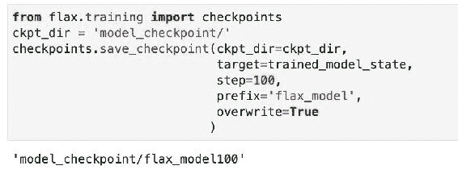

## **加载 Flax 模型**

`[restore_checkpoint]` 方法从保存的位置加载已保存的 Flax 模型。

`loaded_model = checkpoints.restore_checkpoint(`

`ckpt_dir=ckpt_dir`, `target=state`, `prefix='flax_mode`

`l'`

## **评估 Flax 模型**

运行 `[evalaute_model]` 函数来检查模型在测试数据上的性能。`evaluate_model(trained_model_state,test_images, test_labels)`

## **可视化 Flax 模型的性能**

要可视化 Flax 模型的性能，可以使用 Matplotlib 绘制指标图表或加载 TensorBoard 并检查标量选项卡。

`%load_ext tensorboard` `%tensorboard --logdir={logdir}`

## **最终思考**

`在本文中，您已经看到如何在 Flax 中构建包含 BatchNorm 和 DropOut 层的网络。您还学习了如何调整训练过程以适应这些新层。具体来说，您学到了：`

如何定义包含 BatchNorm 和 DropOut 层的 Flax 模型。

`如何创建自定义的 Flax 训练状态。`

使用 BatchNorm 和 DropOut 层训练和评估 Flax 模型。

`如何保存和加载 Flax 模型。`

`如何评估 Flax 模型的性能`

## `**JAX 和 Flax 中的 LSTM**`

`LSTM 是一类用于解决序列问题（如时间序列和自然语言处理）的神经网络。LSTM 保持一些内部状态，在解决这些问题时非常有用。LSTM 应用于循环遍历每个时间步。我们可以使用 JAX 和 Flax 中的函数，而不是从头编写这些循环。在本文中，我们将使用 Flax 中的 LSTM 构建自然语言处理模型。`

`让我们开始吧。`

## `**数据集下载**`

`我们将使用 Kaggle 提供的电影评论数据集。我们使用 Kaggle 的 Python 包下载数据集。`

`import os`

进入`#Obtain from https://www.kaggle.com/username/account` `os.environ["KAGGLE_USERNAME"]="KAGGLE_USERNAME"`

`os.environ["KAGGLE_KEY"]="KAGGLE_KEY"`

`import kaggle`

`kaggle datasets download lakshmi25npathi/imdb-dataset-of-50k-mo vie-reviews`

`接下来，提取数据集。使用 zipfile 解压缩 zip 文件'imdb-dataset-of-50k-movie-reviews.zip'，然后使用 Pandas 加载数据并显示部分评论。`

`df = pd.read_csv("imdb-dataset-of-50k-movie-reviews/IMDB Datase t.csv")`

`df.head()`

``

## `**使用 NLTK 进行数据处理**`

`该数据集包含一些不必要的字符，用于预测电影评论是负面还是正面。例如，标点符号和特殊字符。因此，我们从评论中去除这些字符。我们还需要将[sentiment]列转换为数值表示。这可以使用 Scikitlearn 中的[LabelEncoder]完成。让我们导入这些及其他我们在本文中将使用的包。`

`import numpy as np`

`import pandas as pd`

`from numpy import array`

`import tensorflow as tf`

`from sklearn.model_selection import train_test_split from sklearn.preprocessing import LabelEncoder import matplotlib.pyplot as plt`

`评论中还包含对情感预测无用的词语。这些是英语中常见的词，如 the，at，and 等。这些词称为**停用词**。我们使用 nltk 库帮助去除它们。让我们开始定义一个函数，以删除所有英文停用词。`

# `pip install nltk`

`import nltk`

`from nltk.corpus import stopwords`

`nltk.download('stopwords')`

`def remove_stop_words(review):`

`review_minus_sw = []`

`stop_words = stopwords.words('english')`

`review = review.split()`

`[review_minus_sw.append(word) for word in cleaned_review]`

`review if word not in stop_words]`

`cleaned_review = ' '.join(review_minus_sw)`

`return cleaned_review`

`将该函数应用于情感列。`df['review'] = df['review'].apply(remove_stop_words)`让我们还将情感列转换为数值表示。`

`labelencoder = LabelEncoder()`

`df = df.assign(sentiment = labelencoder.fit_transform(df["senti ment"]))`

将具有和不具有停用词的评论进行比较！[](../images/00041.jpeg)

查看第三条评论时，我们注意到

`words [this], [was] and [a] have been dropped from the sentence. However, we can still see some special characters, such as [<br>] in the review. Let's resolve that next.`

## **使用 Keras 进行文本向量化**

评论数据仍然是文本形式。但是，我们需要将其转换为类似情感列的数值表示。在这之前，让我们将数据集拆分为训练集和测试集。

`from sklearn.model_selection import train_test_split df = df.drop_duplicates()`

`docs = df['review']`

`labels = array(df['sentiment'])`

`X_train, X_test , y_train, y_test = train_test_split(docs, labe ls , test_size = 0.20, random_state=0)`

我们使用 Keras 文本向量化层将评论转换为整数形式。此函数可以过滤掉所有标点符号并将评论转换为小写。我们传递以下参数：

`standardize` 设置为 `lower_and_strip_punctuation` 以转换为

转换为小写并删除标点符号。

`[output_mode]` 转换为 `[int]` 以获得整数结果。 `[tf_idf]` 将应用 TF-IDF 算法。

`[output_sequence_length]` 设置为 50，以获得该长度的句子。更改此数字以查看它如何影响模型的性能。我发现 50 给出了一些不错的结果。超过指定长度的句子将被截断，而较短的句子将用零填充。

`[max_tokens]` 设置为 10,000，以获得该数量的词汇量。调整此数字并检查模型性能的变化。

定义向量化层后，我们将其应用于训练数据。通过调用 `adapt` 函数来实现。该函数从提供的数据集中计算词汇表。如果提供了 `[max_tokens]`，则词汇表将被截断。

`import tensorflow as tf`

`max_features = 10000` # 最大词汇量大小。

`batch_size = 128`

`max_len = 50` # 序列长度，用于填充输出。`vectorize_layer = tf.keras.layers.TextVectorization(standardize ='lower_and_strip_punctuation',max_tokens=max_features,output_m ode='int',output_sequence_length=max_len)`

`vectorize_layer.adapt(X_train)`

要查看生成的词汇表，请调用 `get_vocabulary` 函数。`vectorize_layer.get_vocabulary()`！[](../images/00042.jpeg)使用训练好的向量化层将训练和测试数据转换为数值形式。`X_train_padded = vectorize_layer(X_train)` `X_test_padded = vectorize_layer(X_test)`！[](../images/00043.gif)

## **创建 tf.data 数据集**

让我们从训练集和测试集中生成和预取批次，以使加载到 LSTM 模型更高效。我们首先创建一个 `tf.data.Dataset`。

`training_data = tf.data.Dataset.from_tensor_slices((X_train_padded, y_train))`

`validation_data = tf.data.Dataset.from_tensor_slices((X_test_padded, y_test))`

`training_data = training_data.batch(batch_size)`

`validation_data = validation_data.batch(batch_size)`

接下来，我们预取一个批次，洗牌数据，并将其作为 `NumPy array` 返回。

# `pip install tensorflow_datasets`

`import tensorflow_datasets as tfds`

`def get_train_batches():`

`ds = training_data.prefetch(1)`

`ds = ds.shuffle(3, reshuffle_each_iteration=True)` # `tfds.dataset_as_numpy` 将 `tf.data.Dataset` 转换为一个

由 NumPy 数组组成的迭代器 `return tfds.as_numpy(ds)`

## `在 Flax 中定义 LSTM 模型`

我们现在可以在 Flax 中定义 LSTM 模型了。要在 Flax 中设计 LSTM，我们使用 `LSTMCell` 或 `OptimizedLSTMCell`。

`OptimizedLSTMCell` 是高效的 `LSTMCell`。

`[LSTMCell.initialize_carry]` 函数用于初始化 LSTM 单元的隐藏状态。它期望：

一个随机数。

批次维度。

单元的数量。

让我们使用 `setup 方法` 来定义 LSTM 模型。LSTM 包含以下层：

一个与向量化层中定义的特征数和长度相同的 `Embedding layer`。

LSTM 层根据 `[reverse]` 参数在一个方向上传递数据。

一对 `Dense layers`。

最终的密集输出层。from flax import linen as nn

`class LSTMModel(nn.Module):`

`def setup(self):`

`self.embedding = nn.Embed(max_features, max_len) lstm_layer = nn.scan(nn.OptimizedLSTMCell,`

`variable_broadcast="params", split_rngs={"params": False}, in_axes=1,`

`out_axes=1,`

`length=max_len,`

`reverse=False)`

`self.lstm1 = lstm_layer()`

`self.dense1 = nn.Dense(256)`

`self.lstm2 = lstm_layer()`

`self.dense2 = nn.Dense(128)`

`self.lstm3 = lstm_layer()`

`self.dense3 = nn.Dense(64)`

`self.dense4 = nn.Dense(2)`

`@nn.rematdef __call__(self, x_batch): x = self.embedding(x_batch)`

`carry, hidden = nn.OptimizedLSTMCell.initialize_carry(jax.random.PRNGKey(0), batch_dims=(len(x_batch),), size=128)`

`(carry, hidden), x = self.lstm1((carry, hidden), x)`

`x = self.dense1(x) x = nn.relu(x)`

`carry, hidden = nn.OptimizedLSTMCell.initialize_carry(jax.random.PRNGKey(0), batch_dims=(len(x_batch),), size=64)`

`(carry, hidden), x = self.lstm2((carry, hidden), x) x = self.dense2(x) x = nn.relu(x)`

`carry, hidden = nn.OptimizedLSTMCell.initialize_carry(jax.random.PRNGKey(0), batch_dims=(len(x_batch),), size=32)`

`(carry, hidden), x = self.lstm3((carry, hidden), x)`

`x = self.dense3(x)`

`x = nn.relu(x)`

`x = self.dense4(x[:, -1]) return nn.log_softmax(x)`

我们将 `scan 函数` 应用于数据的迭代。它期望：`scan` 待循环的项目。它们必须具有相同的大小，并且将沿着扫描轴堆叠。`carry` 一个在每次迭代中更新的传递值。该值在整个迭代过程中必须具有相同的形状和 `[dtype]`。

`[广播]` 一个在循环中封闭的值 ` [<axis:int>]` 扫描的轴。

`[split_rngs]` 用于定义是否在每一步分割随机数生成器。

在使用 LSTMs 计算长序列时，`[nn.remat]` 调用节省内存。

## 在 Flax 中计算指标

接下来，我们定义一个函数来计算网络的损失和准确率。

import optax

import jax.numpy as jnp

def compute_metrics(logits, labels):

loss = jnp.mean(optax.softmax_cross_entropy(logits, jax.nn.on e_hot(labels, num_classes=2)))

accuracy = jnp.mean(jnp.argmax(logits, -1) == labels)

metrics = {

'loss': loss,

'accuracy': accuracy

}

return metrics

## 创建训练状态

训练状态应用梯度并更新参数和优化器状态。Flax 提供了[train_state]用于此目的。我们定义一个函数：

创建[LSTMModel]的一个实例。

初始化模型以通过训练数据样本获取[`params`]。

在应用 Adam 优化器后返回创建的状态。from flax.training import train_state

def create_train_state(rng):

"""创建初始`TrainState`。"""

model = LSTMModel()

params = model.init(rng, jnp.array(X_train_padded[0]))['param

s']

tx = optax.adam(0.001,0.9,0.999,1e-07) return train_state.TrainState.create(

apply_fn=model.apply, params=params, tx=tx)

## 定义训练步骤

训练函数执行以下操作:

使用`apply`方法从模型计算损失和 logits。

使用[value_and_grad]计算梯度。使用梯度更新模型参数。

使用先前定义的函数计算 metrics。返回状态和 metrics。

应用[@jax.jit]使函数运行更快。`@jax.jit`def train_step(state, text, labels):def loss_fn(params):

logits = LSTMModel().apply({'params': params}, text) loss = jnp.mean(optax.softmax_cross_entropy( logits=logits,

labels=jax.nn.one_hot(labels, num_classes=2))) return loss, logits

grad_fn = jax.value_and_grad(loss_fn, has_aux=True) (_, logits), grads = grad_fn(state.params)

state = state.apply_gradients(grads=grads)

metrics = compute_metrics(logits, labels)

返回状态和 metrics

## 评估 Flax 模型

[`eval_step`]使用`Module.apply`评估模型在测试集上的表现。它返回测试集上的损失和准确率。

[`evaluate_model`]函数应用[`eval_step`]，从设备获取 metrics，并作为[`jax.tree_map`]返回它们。

@jax.jit

def eval_step(state, text, labels):

logits = LSTMModel().apply({'params': state.params}, text)

返回使用 logits 和 labels 计算 metrics 的结果

def evaluate_model(state, text, test_lbls): """在验证集上评估模型。"""

metrics = eval_step(state, text, test_lbls) metrics = jax.device_get(metrics)

metrics = jax.tree_map(lambda x: x.item(), metrics) return metrics

## 创建训练函数

接下来，定义一个函数，在一个 epoch 上训练 Flax LSTM 模型。该函数对训练数据中的每个批次应用[train_step]。在每个批次之后，它将 metrics 附加到一个列表中。

def train_one_epoch(state):

在训练集上训练 1 个 epoch。batch_metrics = []

对于 text, labels in get_train_batches():

state, metrics = `train_step(state, text, labels)` batch_metrics.append(metrics)batch_metrics_np = jax.device_get(batch_metrics) epoch_metrics_np = {k: np.mean([metrics[k] for metrics in batch_metrics_np[0] ])for k in batch_metrics_np[0] }return state, epoch_metrics_np

函数从设备获取指标并计算所有训练批次的平均值。这提供了一个时期的损失和准确性。

## 在 Flax 中训练 LSTM 模型

要训练 LSTM 模型，我们运行 [train_one_epoch] 函数进行多次迭代。接下来，应用 [evaluate_model] 获取每个时期的测试指标。在开始训练之前，我们创建

使用 [create_train_state] 来保存训练信息。该函数初始化模型参数和优化器。此信息存储在训练状态 dataclass 中。

rng = jax.random.PRNGKey(0)rng, input_rng, init_rng = jax.random.split(rng,num=3)seed = 0state = `create_train_state(init_rng)` del init_rng # 不再使用。

num_epochs = 30

(text, test_labels) = next(iter(validation_data)) text = jnp.array(text)

test_labels = jnp.array(test_labels) training_loss = []

training_accuracy = []

testing_loss = []

testing_accuracy = []

def `train_model()`:

for epoch in range(1, num_epochs + 1):

train_state, train_metrics = `train_one_epoch(state)` training_loss.append(train_metrics['loss']) training_accuracy.append(train_metrics['accuracy']) test_metrics = `evaluate_model(train_state, text, test_l`

abels)

testing_loss.append(test_metrics['loss'])

testing_accuracy.append(test_metrics['accuracy']) print(f"Epoch: {epoch}, train loss: {train_metrics['los

s']}, train accuracy: {train_metrics['accuracy'] * 100}, test l oss: {test_metrics['loss']}, test accuracy: {test_metrics['accu racy'] * 100}")

返回 `train_statetrained_model_state = train_model()`每个时期结束后，我们打印指标并将其附加到列表中。

## 在 Flax 中可视化 LSTM 模型性能

然后，您可以使用 `Matplotlib` 来可视化附加到列表中的指标。训练过程不是很平稳，但您可以调整网络的架构、每个评审的长度和词汇量大小以提高性能。

## 保存 LSTM 模型

要保存 Flax 模型检查点，请使用 [save_checkpoint] 方法。它需要：

保存检查点文件的目录。

要保存的 Flax 对象，即 [target]。

检查点文件名的前缀。

是否覆盖先前的检查点

from flax.training import `checkpoints`

checkpoints.save_checkpoint(ckpt_dir='lstm_model_checkpoint/', target=trained_model_state,

step=100,

prefix='lstm_model',

overwrite=False

)

要恢复保存的模型，请使用 [restore_checkpoint] 方法。

loaded_model = `checkpoints.restore_checkpoint(`

ckpt_dir='lstm_mod

el_checkpoint/',

target=state, prefix='lstm_mode

l'

)

loaded_model 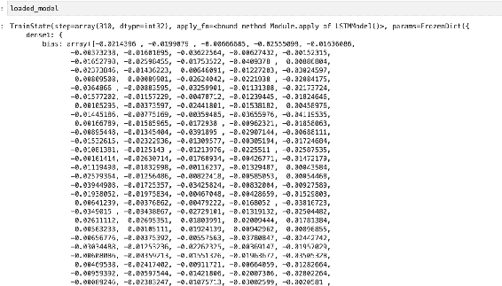此模型可立即用于进行预测！[](../images/00045.gif)

## 最终想法

`在本文中，您已经学会了如何在 JAX 和 Flax 中解决自然语言处理问题。特别是您涵盖的关键点包括：`

`如何使用 NLTK 处理文本数据。`

`使用 Keras 进行文本向量化。`

使用 Keras 和 TensorFlow 创建文本数据批处理。

`如何在 JAX 和 Flax 中创建 LSTM 模型。如何在 Flax 中训练和评估 LSTM 模型。保存和恢复 Flax LSTM 模型。`

## **Flax vs. TensorFlow**

`Flax 是建立在 JAX 上的神经网络库。TensorFlow 是一个拥有大量工具和资源的深度学习库。Flax 和 TensorFlow 在某些方面相似但又不同。例如，Flax 和 TensorFlow 都可以在 XLA 上运行。`

让我们从使用这两个库的用户角度来看一下 Flax 和 TensorFlow 的区别。

## **TensorFlow 和 Flax 中的随机数生成**

`在 TensorFlow 中，您可以设置全局或函数级种子。在 TensorFlow 中生成随机数非常简单。`tf.random.set_seed(6853)`

然而，在 Flax 中并非如此。Flax 是建立在 JAX 之上的。JAX 期望纯函数，即没有任何副作用的函数。为了实现这一点，JAX 引入了无状态的伪随机数生成器（PRNGs）。例如，从 NumPy 调用随机数生成器每次都会得到不同的数字。

`import numpy as np`

`print(np.random.random()) print(np.random.random()) print(np.random.random())`

``

`在 JAX 和 Flax 中，每次调用时结果应该相同。因此，我们从随机状态生成随机数。状态不应该被重用。可以拆分状态以获取多个伪随机数。`

`import jax`

`key = jax.random.PRNGKey(0)`

`key1, key2, key3 = jax.random.split(key, num=3)`

``

## **Flax 和 TensorFlow 的模型定义**

`在 TensorFlow 中，通过 Keras API 可以轻松定义模型。您可以使用 Keras 定义顺序或功能型网络。Keras 提供了许多层用于设计各种类型的网络，例如 CNN 和 LSTM。`

在 Flax 中，网络可以使用 setup 或紧凑方式设计。setup 方法显式，而紧凑方式内联。Setup 非常类似于 PyTorch 中设计网络的方式。例如，这里是使用 setup 方式设计的网络。

`class MLP(nn.Module):def setup(self):`

# `子模块名称由您分配的属性派生而来。在这`

# `case`, `"dense1"` 和 `"dense2"`。这遵循了 PyTorch 的逻辑。

`self.dense1 = nn.Dense(32)`

`self.dense2 = nn.Dense(32)`

`def __call__(self, x): x = self.dense1(x) x = nn.relu(x)`

`x = self.dense2(x) return x`

这里是同一个网络的紧凑设计方式。紧凑的方式更为直接，因为代码重复较少。`class MLP(nn.Module):`

`@nn.compact`

`def __call__(self, x):`

`x = nn.Dense(32, name="dense1")(x)`

`x = nn.relu(x)`

`x = nn.Dense(32, name="dense2")(x)`

`return x`

## **Flax 和 TensorFlow 中的激活函数**

`[tf.keras.activations]`模块在 TensorFlow 中提供设计网络时所需的大部分激活函数。在 Flax 中，激活函数通过 linen 模块提供。

## **在 Flax 和 TensorFlow 中的优化器**

`[tf.keras.optimizers]`中的优化器在 TensorFlow 中有流行的优化器函数。但是，Flax 不提供任何优化器函数。Flax 中使用的优化器由另一个名为 Optax 的库提供。

## **在 Flax 和 TensorFlow 中的指标**

在 TensorFlow 中，指标可以通过

`[tf.keras.metrics]`模块。截至目前，Flax 没有指标模块。您需要为您的网络定义指标函数或使用其他第三方库。

`import optax`

`import jax.numpy as jnp`

`def compute_metrics(logits, labels):`

`loss = jnp.mean(optax.softmax_cross_entropy(logits, jax.nn.on e_hot(labels, num_classes=2)))`

`accuracy = jnp.mean(jnp.argmax(logits, -1) == labels)`

`metrics = {`

`'loss': loss,`

`'accuracy': accuracy`

`}`

`return metrics`

## **在 Flax 和 TensorFlow 中计算梯度**

`[jax.grad]`函数用于在 Flax 中计算梯度。它提供同时返回损失和梯度的能力，例如，您可以同时返回损失和梯度。

`@jax.jitdef sum_logistic(x):return jnp.sum(1.0 / (1.0 + jnp.exp(-x))),(x + 1)`

`x_small = jnp.arange(6.)`

`derivative_fn = jax.grad(sum_logistic, has_aux=True) print(derivative_fn(x_small))`

# `(DeviceArray([0.25 , 0.19661194, 0.10499357, 0.04517666, 0.01766271,`

# `0.00664806], dtype=float32), DeviceArray([1., 2.,`

`3., 4., 5., 6.], dtype=float32))高级自动微分也可以完成`

使用`jax.vjp()`和`jax.jvp()`。

在 TensorFlow 中，使用`[tf.GradientTape]`计算梯度。def grad(model, inputs, targets):with tf.GradientTape() as tape:loss_value = loss(model, inputs, targets, training=True) return loss_value, tape.gradient(loss_value, model.trainable_ variables)`

除非您在 TensorFlow 中创建自定义训练循环，否则不会定义梯度函数。当您训练网络时，这是自动完成的。

## **在 Flax 和 TensorFlow 中加载数据集**

TensorFlow 提供了加载数据的实用程序。Flax 不附带任何数据加载器。您必须使用来自其他库（如 TensorFlow）的数据加载器。只要数据是 JAX NumPy 或常规数组，并且具有适当的形状，就可以传递给 Flax 网络。

## **在 Flax 与 TensorFlow 中训练模型**

在 TensorFlow 中，通过编译网络并调用 fit 方法来训练模型。然而，在 Flax 中，我们创建一个训练状态来保存训练信息，然后将数据传递给网络。

`from flax.training import train_state`

`def create_train_state(rng):`

"""创建初始`TrainState`。"""

`model = LSTMModel()`

`params = model.init(rng, jnp.array(X_train_padded[0]))['param`

`s']`

`tx = optax.adam(0.001,0.9,0.999,1e-07)`

`return train_state.TrainState.create(`

`apply_fn=model.apply, params=params, tx=tx)`

之后，我们定义一个训练步骤，计算损失和梯度。然后使用这些梯度来更新模型参数并返回模型指标和新状态。

`@jax.jitdef train_step(state, text, labels):def loss_fn(params):`

`logits = LSTMModel().apply({'params': params}, text) loss = jnp.mean(optax.softmax_cross_entropy( logits=logits,`

`labels=jax.nn.one_hot(labels, num_classes=2))) return loss, logits`

`grad_fn = jax.value_and_grad(loss_fn, has_aux=True) (_, logits), grads = grad_fn(state.params)`

`state = state.apply_gradients(grads=grads)`

`metrics = compute_metrics(logits, labels)`

`return state, metrics`

使用`Elegy`来训练类似于 Keras 的网络。Elegy 是一个基于 JAX 神经网络库的高级 API。

## **Flax 和 TensorFlow 中的分布式训练**

在 TensorFlow 中以分布式方式训练网络是通过创建`distributed strategy.mirrored_strategy = tf.distribute.MirroredStrategy()`来完成的。

`with mirrored_strategy.scope():`

`model = tf.keras.Sequential([tf.keras.layers.Dense(1, input_s`

`hape=(1,))])`

`model.compile(loss='mse', optimizer='sgd')`

要在 Flax 中以分布式方式训练网络，我们定义我们的 Flax 函数的分布式版本。这通过`pmap`函数完成，该函数在多个设备上执行函数。然后，您将计算所有设备上的预测并获得平均值。

使用[`jax.lax.pmean()`]。你还需要使用[`jax_utils.replicate`]在所有设备上复制数据，以获取指标。

设备使用`jax_utils.unreplicate`。

## **使用 TPU 加速器**

您可以使用 Flax 和 TensorFlow 与 TPU 和 GPU 加速器。要在 Colab 上使用 Flax 与 TPU，您需要设置它：`jax.tools.colab_tpu.setup_tpu() jax.devices()`对于 TensorFlow，设置`TPU distributed strategy.cluster_resolver = tf.distribute.cluster_resolver.TPUClusterRes olver(tpu=tpu_address)`

`tf.config.experimental_connect_to_cluster(cluster_resolver) tf.tpu.experimental.initialize_tpu_system(cluster_resolver) tpu_strategy = tf.distribute.TPUStrategy(cluster_resolver)`

## **模型评估**

TensorFlow 提供了`evaluate`函数用于评估网络。Flax 没有提供这样的函数。您需要创建一个应用模型并返回测试指标的函数。`Elegy`提供类似 Keras 的功能，例如`evaluate`方法。

`@jax.jit`

`def eval_step(state, text, labels):`

`logits = LSTMModel().apply({'params': state.params}, text)`

`return compute_metrics(logits=logits, labels=labels)`

`def evaluate_model(state, text, test_lbls): """Evaluate on the validation set."""`

`metrics = eval_step(state, text, test_lbls) metrics = jax.device_get(metrics)`

`metrics = jax.tree_map(lambda x: x.item(), metrics) return metrics`

## **可视化模型性能**

模型的可视化在 Flax 和 TensorFlow 中是类似的。一旦获得指标，可以使用诸如 `Matplotlib` 之类的软件包来可视化模型的性能。你也可以在 Flax 和 TensorFlow 中使用 `TensorBoard`。

## **最后的思考**

你已经看到了 Flax 和 TensorFlow 库之间的差异。特别是，在模型定义和训练方面有所不同。

## 在 Flax 中从头开始训练 ResNet（分布式 ResNet 训练）

除了设计定制的 CNN 架构外，您还可以使用已经构建好的架构。ResNet 就是这样一个流行的架构之一。在大多数情况下，使用这样的架构会获得更好的性能。在本文中，您将学习如何在 Flax 中进行 ResNet 模型的分布式训练。

## 安装 Flax 模型

[flaxmodels] 包为 Jax 和 Flax 提供了预训练模型，包括：

StyleGAN2

`GPT2`

`VGG`

`ResNet`

`git clone https://github.com/matthias-wright/flaxmodels.git pip install -r flaxmodels/training/resnet/requirements.txt`

在这个项目中，我们将从头开始训练模型——也就是说，我们不会使用预训练的权重。在另一篇文章中，我们已经讨论了如何使用 ResNet 进行迁移学习。

## 执行标准导入

安装了 [flaxmodels] 后，让我们导入本文中使用的标准库。

import`wget`# pip install wget

import`zipfile`

`import torch`

from`torch.utils.data`import`DataLoader import os`

from`PIL`import`Image`

from`torchvision`import`transforms from torch.utils.data import Dataset import numpy as np`

`import pandas as pd`

`import matplotlib.pyplot as plt`

%matplotlib inline

# 忽略无害的警告

`import warnings`

`warnings.filterwarnings("ignore") import jax`

from`jax`import`numpy as jnp`

`import flax`

from`flax`import`linen as nn`

from`flax.training`import`train_state import optax`

import`time`

`from tqdm.notebook import tqdm`

`import math`

from`flax`import`jax_utils`

## 下载数据集

我们将训练 ResNet 模型来预测来自猫和狗数据集的两类。下载并提取猫和狗的图像。

`wget.download("https://ml.machinelearningnuggets.com/train.zi p")`

with`zipfile.ZipFile('train.zip', 'r') as zip_ref:`

`zip_ref.extractall('.')`

## 在 Flax 中加载数据集

由于 JAX 和 Flax 不包含任何数据加载器，我们使用 PyTorch 或 TensorFlow 中的数据加载工具。当使用 PyTorch 时，我们首先创建一个数据集类。

`class CatsDogsDataset(Dataset):`

`def __init__(self, root_dir, annotation_file, transform=Non`

e):

`self.root_dir = root_dir`

`self.annotations = pd.read_csv(annotation_file) self.transform = transform`

`def __len__(self):return len(self.annotations)`

`def __getitem__(self, index):`

`img_id = self.annotations.iloc[index, 0]`

`img = Image.open(os.path.join(self.root_dir, img_id)).c`

`convert("RGB")`

`y_label = torch.tensor(float(self.annotations.iloc[inde`

x, 1]))

如果存在转换，则进行转换：img = self.transform(img)return (img, y_label)接下来，创建包含图像路径和标签的 Pandas DataFrame。

`train_df = pd.DataFrame(columns=["img_path","label"]) train_df["img_path"] = os.listdir("train/") for idx, i in enumerate(os.listdir("train/")):`

`if "cat" in i:`

`train_df["label"][idx] = 0`

`if "dog" in i:`

`train_df["label"][idx] = 1`

`train_df.to_csv (r'train_csv.csv', index = False, header=True)`

## Flax 中的数据转换

定义一个将数据堆叠并作为 NumPy 数组返回的函数。

`def custom_collate_fn(batch):`

`transposed_data = list(zip(*batch)) labels = np.array(transposed_data[1]) imgs = np.stack(transposed_data[0]) return imgs, labels`

创建用于调整图像大小的转换。接下来，将该转换应用于早期创建的数据集。`size_image = 224`

`transform = transforms.Compose([`

`transforms.Resize((size_image,size_image)), np.array])`

`dataset = CatsDogsDataset("train","train_csv.csv",transform=transform)`

将此数据集拆分为训练集和测试集，并为每个集创建数据加载器。`batch_size = 32`

`train_set, validation_set = torch.utils.data.random_split(dataset,[20000,5000])`

`train_loader = DataLoader(dataset=train_set, collate_fn=custom_collate_fn,shuffle=True, batch_size=batch_size)`

`validation_loader = DataLoader(dataset=validation_set,collate_fn=custom_collate_fn, shuffle=False, batch_size=batch_size)`

## 实例化 Flax ResNet 模型

有了数据准备就绪，使用`[flaxmodels]`包实例化 Flax ResNet 模型。实例化需要：

所需的类别数。

输出类型。

数据类型。

是否预训练模型 - 在这种情况下`[False]`。import jax.numpy as jnp import flaxmodels as fm

`num_classes = 2`

`dtype = jnp.float32 model = fm.ResNet50(output='log_softmax', pretrained=None, num_classes=num_classes, dtype=dtype)`

## 计算指标

定义评估模型训练期间的指标。让我们首先创建损失函数。

`def cross_entropy_loss(*, logits, labels):`

`labels_onehot = jax.nn.one_hot(labels, num_classes=num_classes)`

`s)`

`return optax.softmax_cross_entropy(logits=logits, labels=labels)`

`ls_onehot).mean()`

接下来，定义一个计算并返回损失和准确率的函数。

`def compute_metrics(*, logits, labels):`

`loss = cross_entropy_loss(logits=logits, labels=labels) accuracy = jnp.mean(jnp.argmax(logits, -1) == labels) metrics = {`

`'loss': loss',`

`'accuracy': accuracy`,

`}`

`return metrics`

## 创建 Flax 模型训练状态

Flax 提供了用于存储训练信息的训练状态。可以修改训练状态以添加新信息。在这种情况下，我们需要修改训练状态以添加批次统计信息，因为 ResNet 模型计算`[batch_stats]`。

`class TrainState(train_state.TrainState): batch_stats: flax.core.FrozenDict`

我们需要模型参数和批次统计来创建训练状态函数。我们可以通过将模型初始化为`[train]`为`[False]`来访问这些内容。

`key = jax.random.PRNGKey(0)`

`variables = model.init(key, jnp.ones([1, size_image, size_image, 3]), train=False)`

`TrainState`的`create`方法需要以下参数：`[apply_fn]`– 模型应用函数。模型参数– `variables['params']`。

优化器通常使用 Optax 定义。

批次统计– `variables['batch_stats']`。

我们对这个函数应用`[pmap]`来创建一个分布式版本的训练状态。 `[pmap]` 编译该函数以在多个设备上执行，例如多个 GPU 和 TPU。

`import functools`

`@functools.partial(jax.pmap)`

`def create_train_state(rng):`

"""创建初始的`TrainState`。"""

`return TrainState.create(apply_fn = model.apply,params = variables['params'],tx = optax.adam(0.01,0.9),batch_stats = variables['batch_stats'])`

## **应用模型函数**

接下来，定义一个并行模型训练函数。传递一个`[axis_name]`以便您可以使用它来聚合来自所有设备的指标。该函数：

计算损失。

通过计算使用`[jax.lax.pmean()]` 的概率的平均值来从所有设备上计算预测。

在应用模型时，我们还包括了批次统计和`[DropOut]`的随机数。由于这是训练函数，`[train]`参数是`[True]`。在计算梯度时，也包括了`[batch_stats]`。`[update_model]`函数应用计算得到的梯度– 更新模型参数。

`@functools.partial(jax.pmap, axis_name='ensemble')` `def apply_model(state, images, labels):` `def loss_fn(params,batch_stats):`

`logits, batch_stats = model.apply({'params': params, 'batch_stats': batch_stats}, images, train=True, rngs={'dropout': jax.random.PRNGKey(0)}, mutable=['batch_stats'])`

`one_hot = jax.nn.one_hot(labels, num_classes)` `loss = optax.softmax_cross_entropy(logits=logits, labels=one_hot).mean()` 返回损失，`(logits, batch_stats)` `(loss, (logits, batch_stats)), grads = jax.value_and_grad(loss_fn, has_aux=True)(state.params,state.batch_stats)` `probs = jax.lax.pmean(jax.nn.softmax(logits), axis_name='ensemble')` `accuracy = jnp.mean(jnp.argmax(probs, -1) == labels)` 返回梯度，`损失，准确率@jax.pmap` `def update_model(state, grads):` 应用梯度 `return state.apply_gradients(grads=grads)`

## **在 Flax 中使用 TensorBoard**

下一步是训练 ResNet 模型。但是，您可能有兴趣使用`[TensorBoard]`跟踪训练。在这种情况下，您需要配置 TensorBoard。您可以使用 PyTorch 的`SummaryWriter`将指标写入 TensorBoard。

`rm -rf ./flax_logs/`

`from torch.utils.tensorboard import SummaryWriter` `import torchvision.transforms.functional as F` `logdir = "flax_logs"`

`writer = SummaryWriter(logdir)`

## **训练 Flax ResNet 模型**

让我们在整个训练集上训练 ResNet 模型，并在测试集的子集上进行评估。您也可以在整个测试集上进行评估。将测试集复制到可用设备上。

`(test_images, test_labels) = next(iter(validation_loader))` `test_images = test_images / 255.0`

`test_images = np.array(jax_utils.replicate(test_images))` `test_labels = np.array(jax_utils.replicate(test_labels))`

创建一些列表以保存训练和评估指标。

`epoch_loss = []`

`epoch_accuracy = []` `testing_accuracy = []` `testing_loss = []`

接下来，定义 ResNet 模型训练函数。该函数执行以下操作：

循环遍历训练数据集并对其进行缩放。

在可用设备上复制数据。

在数据集上应用模型并计算指标。从设备获取指标

`using jax_utils.unreplicate.`

将指标附加到列表。

计算损失和准确度的均值以获取每个 epoch 的指标。

将模型应用于测试集并获取指标。

将测试指标附加到列表。

将训练和评估指标写入 TensorBaord。

打印训练和评估指标。

`images = images / 255.0`

`images = jax_utils.replicate(images)`

`labels = jax_utils.replicate(labels)`

`grads, loss, accuracy = apply_model(state, images,`

`labels)state = update_model(state, grads)`

`epoch_loss.append(jax_utils.unreplicate(loss)) epoch_accuracy.append(jax_utils.unreplicate(accuracy)) train_loss = np.mean(epoch_loss)`

`train_accuracy = np.mean(epoch_accuracy)`

`_`, `test_loss`, `test_accuracy` = `jax_utils.unreplicate(app ly_model(state, test_images, test_labels))`

`testing_accuracy.append(test_accuracy)`

`testing_loss.append(test_loss)`

`writer.add_scalar('Loss/train', np.array(train_loss), e poch)`

`writer.add_scalar('Loss/test', np.array(test_loss), epo ch)`

`writer.add_scalar('Accuracy/train', np.array(train_accu racy), epoch)`

`writer.add_scalar('Accuracy/test', np.array(test_accura cy), epoch)`

`print(f"Epoch: {epoch + 1}, train loss: {train_loss:.4 f}, train accuracy: {train_accuracy * 100:.4f}, test loss: {tes t_loss:.4f}, test accuracy: {test_accuracy* 100:.4f}", flush=Tr ue)`

返回 `state, epoch_loss, epoch_accuracy, testing_accuracy, testing_loss` 通过生成与设备数量相同的随机数来创建训练状态。

`seed = 0`

`rng = jax.random.PRNGKey(seed)`

`rng, init_rng = jax.random.split(rng)`

`state = create_train_state(jax.random.split(init_rng, jax.devic e_count()))`

`del init_rng # Must not be used anymore.`

通过传递训练数据和 epochs 数量来训练 ResNet 模型。

`start = time.time()`

`num_epochs = 30`

`state, epoch_loss, epoch_accuracy, testing_accuracy, testing_lo ss = train_one_epoch(state, train_loader,num_epochs) print("Total time: ", time.time() - start, "seconds")`

``

## **使用 TensorBoard 评估模型**

运行 TensorBoard 查看 TensorBoard 上记录的标量。%load_ext tensorboard%tensorboard --logdir={logdir}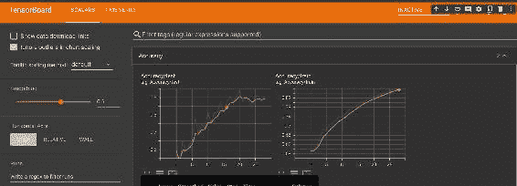

## **可视化 Flax 模型性能**

存储在列表中的指标可以使用 Matplotlib 绘制。

`plt.plot(epoch_accuracy, label="Training")`

`plt.plot(testing_accuracy, label="Test")`

`plt.xlabel("Epoch")`

`plt.ylabel("Accuracy")`

`plt.legend()`

`plt.show()`

`plt.plot(epoch_loss, label="Training")`

`plt.plot(testing_loss, label="Test")`

`plt.xlabel("Epoch")`

`plt.ylabel("Accuracy")`

`plt.legend()`

`plt.show()`

``

## 保存 Flax ResNet 模型

`保存训练好的 Flax ResNet 模型使用`

save_checkpoint 函数。该函数期望：

将保存 ResNet 模型的文件夹。

要保存的模型– [目标]。训练步骤– 训练步骤编号。

模型前缀。是否覆盖现有模型。

`!pip install tensorstore`

`from flax.training import checkpoints`

`ckpt_dir = 'model_checkpoint/'`

`checkpoints.save_checkpoint(ckpt_dir=ckpt_dir,`

`target=state, step=100,`

`prefix='flax_model', overwrite=True`

`)`

## 加载 Flax RestNet 模型

保存的 ResNet Flax 模型也可以加载以进行预测。Flax 模型使用 [restore_checkpoint] 函数加载。该函数期望：

目标状态。

包含保存模型的文件夹。

模型的前缀。

`loaded_model = checkpoints.restore_checkpoint(`

`ckpt_dir=ckpt_dir, target=state, prefix='flax_mode`

`l') `

## 最后的想法

在本文中，您已经学习了如何在 Flax 中从头开始训练 ResNet 模型。具体来说，您已经涵盖了：

在 Flax 中创建 ResNet 模型。

为 ResNet Flax 模型定义训练状态。

在分布式方式下训练 Flax ResNet 模型。使用 TensorBoard 跟踪 Flax ResNet 模型的性能。

保存和加载 Flax ResNet 模型。

## 使用 JAX 和 Flax 进行迁移学习

训练大型神经网络可能需要几天或几周。一旦这些网络被训练好，您可以利用它们的权重并将它们应用于新任务– 迁移学习。因此，您可以微调一个预训练的 ResNet 网络，并在短时间内获得良好的结果。让我们看看如何在 JAX 和 Flax 中对预训练的 ResNet 网络进行微调。

## 安装 JAX ResNet

`我们将使用 jax-resnet 库提供的 ResNet 检查点。pip install jax-resnet 让我们一起导入它和本文中使用的其他软件包。`

# `pip install flax`

`import numpy as np`

`import pandas as pd`

`from PIL import Image`

`import jax`

`import optax`

`import flax`

`import jax.numpy as jnp`

`from jax_resnet import pretrained_resnet, slice_variables, Sequ ential`

`from flax.training import train_state from flax import linen as nn`

`from flax.core import FrozenDict,frozen_dict from functools import partial`

`import os`

`import torch`

`from torch.utils.data import DataLoader from torchvision import transforms`

`from torch.utils.data import Dataset import matplotlib.pyplot as plt`

`%matplotlib inline`

# 忽略无害的警告

`import warnings`

`warnings.filterwarnings("ignore")`

## 下载数据集

我们将微调 ResNet 模型以预测来自猫狗数据集的两个类。下载并提取猫和狗的图像。

`pip install wget`

`import wget`

`wget.download("https://ml.machinelearningnuggets.com/train.zi p")`

`import zipfile`

`with zipfile.ZipFile('train.zip', 'r') as zip_ref:`

`zip_ref.extractall('.')`

## 在 JAX 中加载数据

JAX 不包含数据加载工具。我们使用现有的 TensorFlow 和 PyTorch 数据加载器加载数据。让我们使用 PyTorch 加载图像数据。

第一步是创建一个 PyTorch [数据集] 类。

class CatsDogsDataset(Dataset):`

def __init__(self, root_dir, annotation_file, transform=Non

e):

self.root_dir = root_dir

self.annotations = pd.read_csv(annotation_file) self.transform = transform

`def __len__(self):return len(self.annotations)`

`def __getitem__(self, index):`

img_id = self.annotations.iloc[index, 0]

img = Image.open(os.path.join(self.root_dir, img_id)).c

`onvert("RGB")`

`y_label = torch.tensor(float(self.annotations.iloc[inde`

`x, 1])`

如果 self.transform 不为空：img = self.transform(img) return (img, y_label)

## **数据处理**

接下来，使用图像路径和标签创建一个 Pandas DataFrame。

`train_df = pd.DataFrame(columns=["img_path","label"]) train_df["img_path"] = os.listdir("train/") for idx, i in enumerate(os.listdir("train/")):`

如果 "cat" 在 i 中：`train_df["label"][idx] = 0if "dog" 在 i 中：train_df["label"][idx] = 1train_df.to_csv (r'train_csv.csv', index = False, header=True)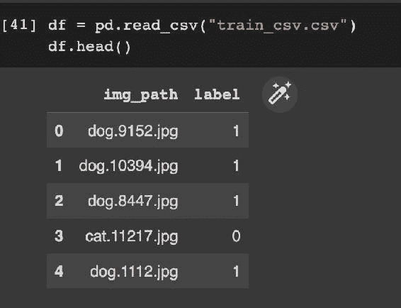定义一个函数来堆叠数据并将图像和标签作为 NumPy 数组返回。

`def custom_collate_fn(batch):`

`transposed_data = list(zip(*batch))`

`labels = np.array(transposed_data[1])`

imgs = np.stack(transposed_data[0])

返回图像和标签作为 NumPy 数组

我们还需要调整图像大小以确保它们的尺寸一致。在配置字典中定义尺寸。稍后我们将使用其他配置变量。

config = {

'标签数量': 2,

'批处理大小': 32,

'训练周期': 5,

`'学习速率': 0.001,`

`'图像尺寸': 224,`

`'权重衰减': 1e-5, '冻结骨干网络': True,`

}

使用 PyTorch 转换调整图像大小。接下来，使用 CatsDogsDataset 类定义训练和测试数据加载器。

`transform = transforms.Compose([`

transforms.Resize((config["IMAGE_SIZE"],config["IMAGE_SIZ

`E"]))`,

`np.array`

dataset = CatsDogsDataset("train","train_csv.csv",transform=tra

nsform)

`train_set`, `validation_set = torch.utils.data.random_split(datas`

`et,[20000,5000])`

`train_loader = DataLoader(dataset=train_set, collate_fn=custom_`

collate_fn,shuffle=True, batch_size=config["BATCH_SIZE"])

`validation_loader = DataLoader(dataset=validation_set,collate_f`

n=custom_collate_fn, shuffle=False, batch_size=config["BATCH_SI

`ZE"])`

## **ResNet 模型定义**

预训练的 ResNet 模型在许多类上进行了训练。但是，我们的数据集只有两类。因此，我们使用 ResNet 作为主干，并定义一个自定义分类层。

## **创建头部网络**

创建一个头部网络，输出与问题相符，本例中为二进制图像分类。

"""

参考 - https://www.kaggle.com/code/alexlwh/happywhale-flax

`-jax-tpu-gpu-resnet-baseline`

"""

`class Head(nn.Module):`

'''head model'''`batch_norm_cls: partial = partial(nn.BatchNorm, momentum=0.`

9)

@nn.compact

`def __call__(self, inputs, train: bool):`

output_n = inputs.shape[-1]x = self.batch_norm_cls(use_running_average=not train)

`(inputs)

`x = nn.Dropout(rate=0.25)(x, deterministic=not train) x = nn.Dense(features=output_n)(x)

`x = nn.relu(x)

`x = self.batch_norm_cls(use_running_average=not train)

`(x)

`x = nn.Dropout(rate=0.5)(x, deterministic=not train) x = nn.Dense(features=config["NUM_LABELS"])(x) return x

## **将 ResNet 主干与头部模型结合**

将预训练的 ResNet 主干与您上面创建的自定义头部结合。

`class Model(nn.Module):

```结合主干和头部模型``` backbone: Sequential

head: Head

def __call__(self, inputs, train: bool): x = self.backbone(inputs)

# 平均池化层

x = jnp.mean(x, axis=(1, 2)) x = self.head(x, train)

返回 x

## **加载预训练的 ResNet 50**

接下来，创建一个函数，加载预训练的 ResNet 模型。省略网络的最后两层，因为我们已定义了一个自定义头部。该函数返回 ResNet 模型及其参数。使用 [slice_variables] 函数获取模型参数。

```def get_backbone_and_params(model_arch: str):```

```

获取主干和参数

1\. 加载预训练模型(resnet50)

2\. 获取模型和参数结构，除了最后 2 层 3\. 提取变量字典的相应子集 输入：model_arch

RETURNS backbone , backbone_params

```

`if model_arch == 'resnet50':

resnet_tmpl, params = pretrained_resnet(50) model = resnet_tmpl()else:raise NotImplementedError

# 获取主干模型及其参数结构的起始点和结束点 = 0, len(model.layers) - 2 backbone = Sequential(model.layers[start:end]) backbone_params = slice_variables(params, start, end) return backbone, backbone_params

## 获取模型和变量

使用上述函数创建最终模型。定义一个函数：

初始化网络的输入。

获取 ResNet 主干及其参数。将输入传递给主干并获取输出。

初始化网络的头部。使用主干和头部创建最终模型。

结合来自主干和头部的参数。

```def get_model_and_variables(model_arch: str, head_init_key: in t):```

```

Get model and variables

1\. 初始化输入(shape=(1,image_size,image_size,3))

2\. Get backbone and params

3\. Apply backbone model and get outputs

4\. Initialise head

5\. Create final model using backbone and head

6\. Combine params from backbone and head

INPUT model_arch, head_init_key RETURNS model, variables '''

#backboneinputs = jnp.ones((1, config['IMAGE_SIZE'],config['IMAGE_SI ZE'], 3), jnp.float32)backbone, backbone_params = get_backbone_and_params(model_a rch) key = jax.random.PRNGKey(head_init_key)backbone_output = backbone.apply(backbone_params, inputs, m utable=False)#headhead_inputs = jnp.ones((1, backbone_output.shape[-1]), jnp. float32)head = Head()head_params = head.init(key, head_inputs, train=False)

#final model

model = Model(backbone, head)

variables = FrozenDict({

`'params': {

`'backbone': backbone_params['params'], 'head': head_params['params']

},

`'batch_stats': {

`'backbone': backbone_params['batch_stats'], 'head': head_params['batch_stats']

}

})

return model, variables

所有与骨干网络相关的名称都以“backbone”作为前缀。您可以使用任何名称，但所有骨干变量名称应该相同。在冻结层时，这一点非常重要，正如我们将在后面看到的那样。

接下来，使用上述定义的函数创建模型。model, variables = get_model_and_variables('resnet50', 0) 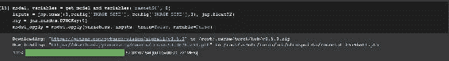

## Zero gradients

由于我们正在应用迁移学习，需要确保不更新骨干网络。否则，我们将从头开始训练网络。我们希望利用预训练的权重，并将它们用作网络的特征提取器。为此，我们冻结所有以“backbone”和“head”开头的层的参数。

with [backbone]. As a result, these parameters will not be updated during training.

"""

参考 - https://github.com/deepmind/optax/issues/159#issuec omment-896459491

"""

def zero_grads():

'''

Zero out the previous gradient computation

```

def init_fn(_):

返回()

def update_fn(updates, state, params=None):

return jax.tree_map(jnp.zeros_like, updates), () return optax.GradientTransformation(init_fn, update_fn)

"""

参考 - https://colab.research.google.com/drive/1g_pt2Rc3bv 6H6qchvGHD-BpgF-Pt4vrC#scrollTo=TqDvTL_tIQCH&line=2&uniqifier=1 """

def create_mask(params, label_fn):

def _map(params, mask, label_fn):for k in params:if label_fn(k):

mask[k] = 'zero'

else:

if isinstance(params[k], FrozenDict): mask[k] = {}

_map(params[k], mask[k], label_fn)

else:

mask[k] = 'adam'

mask = {}

_map(params, mask, label_fn)

return frozen_dict.freeze(mask)

## 定义 Flax 优化器

创建一个仅应用于头部而不是骨干层的优化器。这是通过 optax.multi_transform 实现的，同时传递所需的变换。

adamw = optax.adamw(

learning_rate=config['LR'],

b1=0.9, b2=0.999,

eps=1e-6, weight_decay=1e-2

)

optimizer = optax.multi_transform(

{'adam': adamw, 'zero': zero_grads()},

create_mask(variables['params'], lambda s: s.startswith('ba ckbone'))

)

## 定义 Flax 损失函数

下一步，定义计算损失函数的函数。

def cross_entropy_loss(*, logits, labels):

labels_onehot = jax.nn.one_hot(labels, num_classes=config["NU

M_LABELS"])

return optax.softmax_cross_entropy(logits=logits, labels=labe

ls_onehot).mean()

`在训练过程中计算损失时，将[train]设置为[True]。您还需要：`

设置[batch_stats]定义[dropout]层的随机数。将[batch_stats]设置为可变。

def compute_loss(params, batch_stats, images, labels): logits,batch_stats = model.apply({'params': params,'batch_s

tats': batch_stats},images, train=True,rngs={'dropout': jax.ran

dom.PRNGKey(0)}, mutable=['batch_stats'])

loss = cross_entropy_loss(logits=logits, labels=labels) return loss, (logits, batch_stats)

## 定义 Flax 指标

`使用损失函数，定义一个函数，在训练期间返回损失和准确度。`

`def compute_metrics(*, logits, labels):`

`loss = cross_entropy_loss(logits=logits, labels=labels) accuracy = jnp.mean(jnp.argmax(logits, -1) == labels) metrics = {`

`'loss': loss,`

`'accuracy': accuracy,`

`}`

`return metrics`

## **创建 Flax 训练状态**

`Flax 提供一个训练状态来存储训练信息。在这种情况下，我们添加[batch_stats]信息。`

`state = TrainState.create(`

`apply_fn = model.apply,`

`params = variables['params'],`

`tx = optimizer,`

`batch_stats = variables['batch_stats'],`

`)`

## **训练步骤**

`训练步骤接收图像和标签，并计算相对于模型参数的梯度。然后返回新的状态和模型指标。`

`@jax.jit`

`def train_step(state: TrainState,images, labels):`

"""训练单步。"""

`(batch_loss, (logits, batch_stats)), grads= jax.value_and_gra d(compute_loss, has_aux=True)(state.params,state.batch_stats, i mages,labels)`

`state = state.apply_gradients(grads=grads)`

`metrics = compute_metrics(logits=logits, labels=labels)`

`return state, metrics`

`要训练网络一个 epoch，循环遍历训练数据并应用训练步骤。`

`def train_one_epoch(state, dataloader):`

"""在训练集上训练 1 个 epoch。""" batch_metrics = []

`for cnt, (images, labels) in enumerate(dataloader):`

`images = images / 255.0`

`state, metrics = train_step(state, images, labels) batch_metrics.append(metrics)`

`batch_metrics_np = jax.device_get(batch_metrics) epoch_metrics_np = {k: np.mean([metrics[k] for metrics in batch_metrics_n`

`p])`

`for k in batch_metrics_np[0] }`

`return state, epoch_metrics_np`

## **评估步骤**

`模型评估步骤接受测试标签和图像，并将其应用于网络。然后返回模型评估指标。在评估过程中，将[train]参数设为[False]。还需定义[batch_stats]和[dropout]层的随机数。`

`@jax.jitdef eval_step(batch_stats, params, images, labels): logits = model.apply({'params': params,'batch_stats': batch _stats}, images, train=False,rngs={'dropout': jax.random.PRNGKe y(0)})return compute_metrics(logits=logits, labels=labels)`

`def evaluate_model(state, test_imgs, test_lbls):`

"""在验证集上进行评估。"""

`metrics = eval_step(state.batch_stats,state.params, test_im`

`gs, test_lbls)`

`metrics = jax.device_get(metrics)`

`metrics = jax.tree_map(lambda x: x.item(), metrics) return metrics`

## **在 Flax 中训练 ResNet 模型**

通过应用`[train_one_epoch]`函数来训练 ResNet 模型。由于我们在微调网络，所以只需要几个 epochs。

## **在 Flax 中设置 TensorBoard**

`要通过 TensorBoard 监控模型训练，可以将训练和验证指标写入 TensorBoard。`

`from torch.utils.tensorboard import SummaryWriter import torchvision.transforms.functional as F logdir = "flax_logs"`

`writer = SummaryWriter(logdir)`

## 训练模型

`定义一个函数来训练和评估模型，并将指标写入 TensorBoard。(test_images, test_labels) = next(iter(validation_loader)) test_images = test_images / 255.0`

`training_loss = [] training_accuracy = [] testing_loss = []`

`testing_accuracy = []`

`def train_model(epochs):for epoch in range(1, epochs + 1):train_state, train_metrics = train_one_epoch(state, tra`

`in_loader)`

`training_loss.append(train_metrics['loss']) training_accuracy.append(train_metrics['accuracy'])`

`test_metrics = evaluate_model(train_state, test_images, test_labels)`

`testing_loss.append(test_metrics['loss'])`

`testing_accuracy.append(test_metrics['accuracy'])`

`writer.add_scalar('Loss/train', train_metrics['loss'], epoch)`

`writer.add_scalar('Loss/test', test_metrics['loss'], epoch)`

`writer.add_scalar('Accuracy/train', train_metrics['accu racy'], epoch)`

`writer.add_scalar('Accuracy/test', test_metrics['accura cy'], epoch)`

`print(f"Epoch: {epoch}, training loss: {train_metrics ['loss']}, training accuracy: {train_metrics['accuracy'] * 10 0}, validation loss: {test_metrics['loss']}, validation accurac y: {test_metrics['accuracy'] * 100}")`

`return train_stateRun the training function. trained_model_state = train_model(config["N_EPOCHS"])`

## 保存 Flax 模型

使用`[save_checkpoint]`保存训练后的 Flax 模型。

`from flax.training import checkpoints`

`ckpt_dir = 'model_checkpoint/'`

`checkpoints.save_checkpoint(ckpt_dir=ckpt_dir,`

`target=trained_model_state, step=100,`

`prefix='resnet_model', overwrite=True`

`)`

## 加载保存的 Flax 模型

使用`[restore_checkpoint]`方法加载保存的 Flax 模型。

`loaded_model = checkpoints.restore_checkpoint(

`ckpt_dir=ckpt_dir, target=state, prefix='resnet_mod`

`el') loaded_model`

## 评估 Flax ResNet 模型

`要评估 Flax 模型，请将测试和训练数据传递给`

`the evalaute_model function.evaluate_model(loaded_model,test_images, test_labels) `

## 可视化模型性能

你可以通过 TensorBoard 检查网络的性能，或者使用 Matplotlib 绘制指标。

## Final thoughts

可以应用迁移学习来利用预训练模型，并且只需付出最小的努力就能获得结果。你已经学会了如何在 Flax 中训练 ResNet 模型。具体来说，你已经覆盖了：

`How to define the ResNet model in Flax.`

如何冻结 ResNet 网络的层。

`Training a ResNet model on custom data in Flax.`

`Saving and loading a ResNet model in Flax.`

## Elegy(High-level API for deep learning in JAX & Flax)

`Training deep learning networks in Flax is done in a couple of steps. It involves creating the following functions:`

Model definition.

`Compute metrics.`

`Training state.`

Training step.

Training and evaluation function.

`Flax and JAX give more control in defining and training deep learning networks. However, this comes with more verbosity. Enter Elegy. Elegy is a high-level API for creating deep learning networks in JAX. Elegy's API is like the one in Keras.`

`Let's look at how to use Elegy to define and train deep learning networks in Flax.`

## `Data pre-processing`

`To make this illustration concrete, we'll use the movie review data from Kaggle to create an LSTM network in Flax.`

`The first step is to download and extract the data.`

`import os`

`import kaggle`

# `Obtain from https://www.kaggle.com/username/account os.environ["KAGGLE_USERNAME"]="KAGGLE_USERNAME"`

`os.environ["KAGGLE_KEY"]="KAGGLE_KEY"`

`!kaggle datasets download lakshmi25npathi/imdb-dataset-of-50k-m ovie-reviews`

`import zipfile`

`with zipfile.ZipFile('imdb-dataset-of-50k-movie-reviews.zip',`

`'r') as zip_ref:zip_ref.extractall('imdb-dataset-of-50k-movie-reviews')Next, we define the following processing steps:`

`Split the data into a training and testing set. Remove stopwords from the data.`

清理数据，去除标点和其他特殊字符。

`Convert the data to a TensorFlow dataset.`

`Conver the data to numerical representation using the Keras vectorization layer.`

`import numpy as np`

`import pandas as pd`

`from numpy import array`

`import tensorflow_datasets as tfds`

`import tensorflow as tf`

`from sklearn.model_selection import train_test_split from sklearn.preprocessing import LabelEncoder import matplotlib.pyplot as plt`

`from sklearn.model_selection import train_test_split import tensorflow as tf`

`df = pd.read_csv("imdb-dataset-of-50k-movie-reviews/IMDB Datase t.csv")`

`import nltk`

`from nltk.corpus import stopwords`

`nltk.download('stopwords')`

`def remove_stop_words(review):`

`review_minus_sw = []`

`stop_words = stopwords.words('english')`

`review = review.split()`

`cleaned_review = [review_minus_sw.append(word) for word in`

`review if word not in stop_words]`

`cleaned_review = ' '.join(review_minus_sw)`

`return cleaned_review`

`df['review'] = df['review'].apply(remove_stop_words) labelencoder = LabelEncoder()`

`df = df.assign(sentiment = labelencoder.fit_transform(df["senti ment"]))`

`df = df.drop_duplicates()`

`docs = df['review']`

`labels = array(df['sentiment'])`

`X_train, X_test , y_train, y_test = train_test_split(docs, labe ls , test_size = 0.20, random_state=0)`

`max_features = 10000 # 最大词汇量大小。`

`batch_size = 128`

`max_len = 50 # 序列长度，用于填充输出。vectorize_layer = tf.keras.layers.TextVectorization(standardize ='lower_and_strip_punctuation',max_tokens=max_features,output_m ode='int',output_sequence_length=max_len)`

`vectorize_layer.adapt(X_train)`

`X_train_padded = vectorize_layer(X_train)`

`X_test_padded = vectorize_layer(X_test)`

`training_data = tf.data.Dataset.from_tensor_slices((X_train_pad ded, y_train))`

`validation_data = tf.data.Dataset.from_tensor_slices((X_test_pa dded, y_test))`

`training_data = training_data.batch(batch_size)`

`validation_data = validation_data.batch(batch_size) def get_train_batches():`

`ds = training_data.prefetch(1)`

`ds = ds.repeat(3)`

`ds = ds.shuffle(3, reshuffle_each_iteration=True)` # `tfds.dataset_as_numpy` converts the `tf.data.Dataset` into an

`iterable of NumPy arraysreturn tfds.as_numpy(ds)`

## **Elegy 模型定义**

首先安装`Elegy`，`Flax`和`JAX`。`pip install -U elegy flax jax jaxlib`接下来，定义 LSTM 模型。

`import jax`

`import jax.numpy as jnp import elegy as eg`

`from flax import linen as nn`

`class LSTMModel(nn.Module):`

`def setup(self):`

`self.embedding = nn.Embed(max_features, max_len)` `lstm_layer = nn.scan(nn.OptimizedLSTMCell, variable_broadcast="params", split_rngs={"params": False}, in_axes=1,`

`out_axes=1,`

`length=max_len,`

`reverse=False)`

`self.lstm1 = lstm_layer()`

`self.dense1 = nn.Dense(256)`

`self.lstm2 = lstm_layer()`

`self.dense2 = nn.Dense(128)`

`self.lstm3 = lstm_layer()`

`self.dense3 = nn.Dense(64)`

`self.dense4 = nn.Dense(2)`

`@nn.rematdef __call__(self, x_batch): x = self.embedding(x_batch)`

`carry, hidden = nn.OptimizedLSTMCell.initialize_carry(j ax.random.PRNGKey(0), batch_dims=(len(x_batch),), size=128)`

`(carry, hidden)`, `x = self.lstm1((carry, hidden), x)`

`x = self.dense1(x) x = nn.relu(x)`

`carry, hidden = nn.OptimizedLSTMCell.initialize_carry(j ax.random.PRNGKey(0), batch_dims=(len(x_batch),), size=64)`

`(carry, hidden), x = self.lstm2((carry, hidden), x)`

`x = self.dense2(x) x = nn.relu(x)`

`carry, hidden = nn.OptimizedLSTMCell.initialize_carry(j ax.random.PRNGKey(0), batch_dims=(len(x_batch),), size=32)`

`(carry, hidden), x = self.lstm3((carry, hidden), x)`

`x = self.dense3(x)`

`x = nn.relu(x)`

`x = self.dense4(x[:, -1]) return nn.log_softmax(x)`

现在让我们使用上述网络创建一个 Elegy 模型。正如你所见，损失和指标的定义类似于`Keras`。模型的编译在构造函数中完成，因此您无需手动执行此操作。

`import optax`

`model = eg.Model(`

`module=LSTMModel(),`

`loss=[`

`eg.losses.Crossentropy()`, `eg.regularizers.L2(l=1e-4)`, ],

`metrics=eg.metrics.Accuracy(),`

`optimizer=optax.adam(1e-3), )`

## **Elegy 模型摘要**

像在 Keras 中一样，我们可以打印模型的摘要。`model.summary(jnp.array(X_train_padded[:64]))` 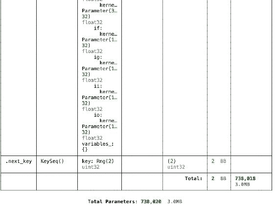

## **Elegy 中的分布式训练**

要在 Flax 中以分布式方式训练模型，我们定义模型训练函数的并行版本。

但是，在 Elegy 中，我们调用 `[distributed]` 方法来进行分布式方法。`model = model.distributed()`

## **Flax 中类似 Keras 的回调**

Elegy 支持类似 Keras 回调的回调函数。在这种情况下，我们使用以下回调函数训练模型：

`TensorBoard.`

`模型检查点.`

`Early stopping.callbacks = [ eg.callbacks.TensorBoard("summaries"), eg.callbacks.ModelCheckpoint("models/high-level", save_best_only=True),eg.callbacks.EarlyStopping(monitor = 'val_loss',pa tience=10)]`

## **训练 Elegy 模型**

Elegy 提供了 `[fit]` 方法来训练模型。该方法支持以下数据源：

`Tensorflow 数据集.`

`Pytorch DataLoader`

`Elegy DataLoader，并且`

`Python 生成器.`

`history = model.fit(`

`training_data,`

`epochs=100,`

validation_data=(validation_data), callbacks=callbacks,

)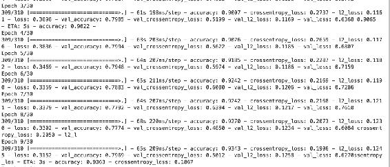

## **评估 Elegy 模型**

要评估 Elegy 模型，请使用 [evaluate] 函数。model.evaluate(validation_data)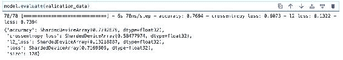

## **使用 TensorBoard 可视化 Elegy 模型**

由于我们应用了 TensorBoard 回调，我们可以在 TensorBoard 中查看模型的性能。%load_ext tensorboard%tensorboard --logdir summaries 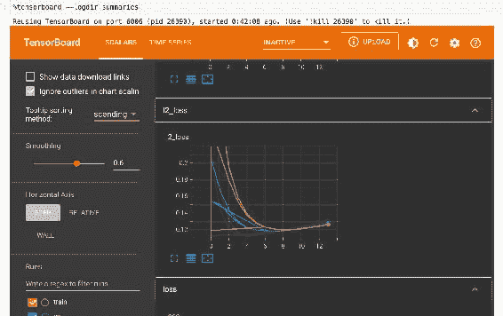

## **使用 Matplotlib 绘制模型性能**

我们还可以使用 Matplotlib 绘制模型的性能。import matplotlib.pyplot as plt

def plot_history(history):

n_plots = len(history.history.keys()) // 2

plt.figure(figsize=(14, 24))

for i, key in enumerate(list(history.history.keys())[:n_plo

ts]):

metric = history.history[`key`]

val_metric = history.history[f`val_{key}`]

plt.subplot(n_plots, 1, i + 1)

plt.plot(metric, label=f`Training {key}`) plt.plot(val_metric, label=f`Validation {key}`) plt.legend(loc=`lower right`)

plt.ylabel(`key`)

plt.title(`Training and Validation {key}`)

plt.show()plot_history(history) 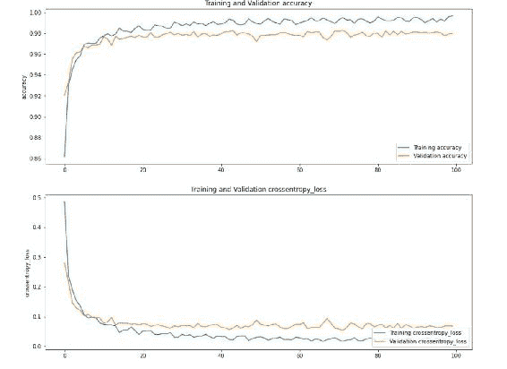

## **使用 Elegy 模型进行预测**

像 Keras 一样，Elegy 提供了进行预测的 [predict] 方法。(text, test_labels) = next(iter(validation_data)) y_pred = model.predict(jnp.array(text)) 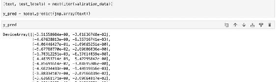

## **保存和加载 Elegy 模型**

Elegy 模型也可以像 Keras 模型一样保存，并立即用于预测。

# 您可以使用 `save` 但是 `ModelCheckpoint` 已经序列化了模型

# model.save(`model`)

# 当前模型参考 print(`current model id:`, id(model))

# 从磁盘加载模型

model = eg.load(`models/high-level`)

# 新模型参考

print(`new model id: `, id(model))

# 检查其是否正常工作！model.evaluate(validation_data) 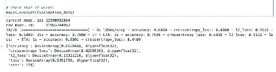

## **最终想法**

这篇文章简要介绍了 Elegy —— 一种您可以用来构建和训练 Flax 网络的 JAX 高级 API。您已经看到 Elegy 非常类似于 Keras，并且具有用于 Flax 的简单 API。它还包含类似于 Keras 的功能，如：

模型训练。

进行预测。

创建回调。

定义模型损失和指标。

## **附录**

本书的提供符合我们的条款和隐私政策。

## **免责声明**

本电子书中的信息不适用于直接在生产中应用

环境。将其应用于生产环境时，您需承担全部责任

由于您的行为。

作者已尽一切努力确保信息的准确性

本书出版时的信息是正确的。作者不承担任何责任，并且

特此声明对任何因损失、损坏或造成中断而导致的责任不承担。

由于意外、

疏忽或其他原因。

未经任何形式或任何

手段，电子或机械，录制或通过任何信息存储和

检索系统，未经作者书面许可。

## **版权**

JAX 和 Flax 书籍—— 使用 Flax 和 JAX 进行深度学习 © 版权 Derrick Mwiti。保留所有权利。

## **其他学习内容**

学习 Python

学习数据科学

学习 Streamlit
