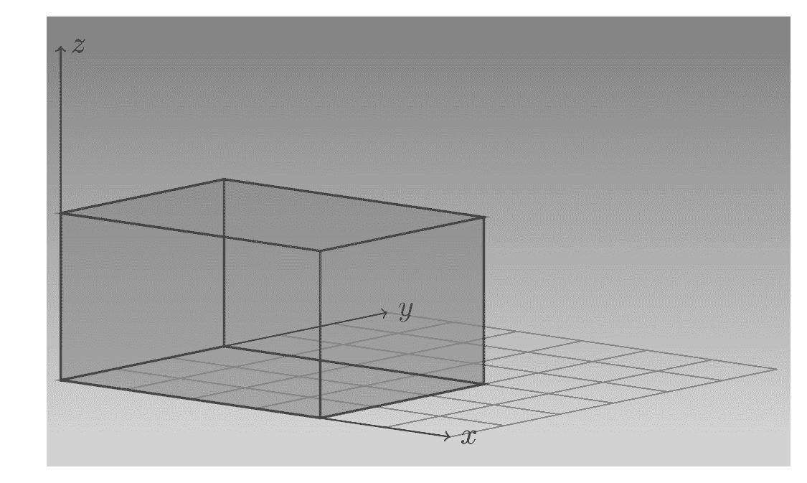

# 3  张量

> 原文：[`skeydan.github.io/Deep-Learning-and-Scientific-Computing-with-R-torch/tensors.html`](https://skeydan.github.io/Deep-Learning-and-Scientific-Computing-with-R-torch/tensors.html)

## 3.1 张量中有什么？

要使用`torch`做任何有用的事情，你需要了解张量。不是数学/物理意义上的张量。在 TensorFlow 和（Py-）Torch 这样的深度学习框架中，*张量*只是多维数组，它针对快速计算进行了优化——不仅是在 CPU 上，还包括在 GPU 和 TPU 等专用设备上。（它还具有一个具有巨大实际影响的能力——自动微分——但我们将其留到下一章。）

实际上，一个`torch`张量就像一个 R 数组，因为它可以是任意维度的。但与`array`不同，它旨在快速且可扩展地执行数学计算，并且你可以将其移动到 GPU 上。（它还具有一个具有巨大实际影响的能力——自动微分——但我们将其留到下一章。）

从技术上讲，一个`tensor`感觉就像一个 R6 对象，因为你可以使用`$`-语法访问其字段和方法。让我们创建一个并打印它：

```r
library(torch)

t1 <- torch_tensor(1)
t1
```

```r
torch_tensor
 1
[ CPUFloatType{1} ]
```

这是一个只包含单个值 1 的张量。它“居住”在 CPU 上，其类型是`Float`。现在看看花括号中的 1，即`{1}`。这*并不是*另一个表示张量值的指示。它表示张量的形状，或者换句话说：它居住的空间及其维度的范围。在这里，我们有一个一维张量，即向量。就像在基础 R 中一样，向量可以只包含一个元素。（记住，基础 R 不区分`1`和`c(1)`。）

我们可以使用上述`$`-语法单独确定这些属性，逐个访问对象中的相应字段：

```r
t1$dtype
```

```r
torch_Float
```

```r
t1$device
```

```r
torch_device(type='cpu')
```

```r
t1$shape
```

```r
[1] 1
```

我们还可以直接更改这些属性中的一些，利用张量对象的`$to()`方法：

```r
t2 <- t1$to(dtype = torch_int())
t2$dtype
```

```r
torch_Int
```

```r
# only applicable if you have a GPU
t2 <- t1$to(device = "cuda")
t2$device
```

```r
torch_device(type='cuda', index=0)
```

那么改变形状呢？这是一个值得单独讨论的话题，但作为一个初步的热身，让我们稍微玩一下。在不改变其值的情况下，我们可以将这个一维的“向量张量”转换成二维的“矩阵张量”：

```r
t3 <- t1$view(c(1, 1))
t3$shape
```

```r
[1] 1 1
```

从概念上讲，这类似于在 R 中，我们可以有一个一元素的向量，也可以有一个一元素的矩阵：

```r
c(1)
matrix(1)
```

```r
[1] 1

     [,1]
[1,]    1
```

现在我们已经对张量有了概念，让我们考虑创建张量的方法。
  
## 3.2 创建张量

我们已经看到一种创建张量的方法：调用`torch_tensor()`并传入一个 R 值。这种方法可以推广到多维对象；我们很快就会看到一些例子。

然而，当我们需要传入很多不同的值时，这个程序可能会变得难以控制。幸运的是，有一个替代方法，当值在整个范围内应该相同或遵循明显的模式时，都可以应用。我们将在本节中也展示这种技术的示例。

### 3.2.1 从值创建张量

在上面，我们向`torch_tensor()`传入了一个一元素的向量；我们可以以相同的方式传入更长的向量：

```r
torch_tensor(1:5)
```

```r
torch_tensor
 1
 2
 3
 4
 5
[ CPULongType{5} ]
```

当给定一个 R 值（或一系列值）时，`torch`会自行确定合适的数据类型。这里，假设我们想要整数类型，`torch`会选择可用的最高精度类型（`torch_long()`与`torch_int64()`同义）。

如果我们想要一个浮点张量，我们可以使用新创建实例上的`$to()`（如上所示）。或者，我们也可以立即让`torch_tensor()`知道：

```r
torch_tensor(1:5, dtype = torch_float())
```

```r
torch_tensor
 1
 2
 3
 4
 5
[ CPUFloatType{5} ]
```

类似地，默认设备是 CPU；但我们可以创建一个从一开始就位于 GPU 上的张量：

```r
torch_tensor(1:5, device = "cuda")
```

```r
torch_tensor
 1
 2
 3
 4
 5
[ CPUFloatType{5} ]
```

现在，到目前为止，我们创建的都是向量；那么矩阵呢，即二维张量呢？

我们可以以相同的方式传入一个 R 矩阵：

```r
torch_tensor(matrix(1:9, ncol = 3))
```

```r
torch_tensor
 1  4  7
 2  5  8
 3  6  9
[ CPULongType{3,3} ]
```

看看结果。数字 1 到 9 按列依次出现，就像我们创建的 R 矩阵中一样。这可能是，也可能不是预期的结果。如果不是，只需在`matrix()`的调用中传递`byrow = TRUE`：

```r
torch_tensor(matrix(1:9, ncol = 3, byrow = TRUE))
```

```r
torch_tensor
 1  2  3
 4  5  6
 7  8  9
[ CPULongType{3,3} ]
```

关于高维数据呢？遵循同样的原则，我们可以传入一个数组：

```r
torch_tensor(array(1:24, dim = c(4, 3, 2)))
```

```r
torch_tensor
(1,.,.) = 
   1  13
   5  17
   9  21

(2,.,.) = 
   2  14
   6  18
  10  22

(3,.,.) = 
   3  15
   7  19
  11  23

(4,.,.) = 
   4  16
   8  20
  12  24
[ CPULongType{4,3,2} ]
```

再次，结果遵循 R 的数组填充逻辑。如果你不想要这样的结果，可能更容易通过编程构建张量。

在你开始恐慌之前，想想你有多少次需要这样做。在实践中，你将主要从 R 数据集中创建张量。我们将在最后一个子节“从数据集创建张量”中详细探讨这一点。在此之前，花点时间检查一下最后的输出是有益的。

这里，直观地看，是我们创建的对象(图 3.1)。让我们称向右延伸的轴为`x`，进入页面的轴为`y`，向上的轴为`z`。然后张量在`x`、`y`和`z`方向上分别延伸 4、3 和 2 个单位。



图 3.1：一个 4x3x2 的张量。

我们传递给`torch_tensor()`的数组打印如下：

```r
array(1:24, dim = c(4, 3, 2))
```

```r
, , 1

     [,1] [,2] [,3]
[1,]    1    5    9
[2,]    2    6   10
[3,]    3    7   11
[4,]    4    8   12

, , 2

     [,1] [,2] [,3]
[1,]   13   17   21
[2,]   14   18   22
[3,]   15   19   23
[4,]   16   20   24
```

与上面张量的打印方式相比。`数组`和`张量`以不同的方式切割对象。张量将其值切割成`3x2`的矩形，向上和向后延伸，每个`x`值对应一个。另一方面，数组通过`z`值进行分割，结果形成两个大的`4x3`切片，向上和向右延伸。

或者，我们可以说张量是从左边/“外部”开始思考的；数组是从右边/“内部”开始。
  
### 3.2.2 从规格创建张量

当`torch`的大规模创建函数派上用场时，有两种广泛的情况：一方面，当你不关心单个张量值，而只关心它们的分布时。另一方面，如果它们遵循某种传统模式。

当我们使用批量创建函数时，我们指定的是它们应该具有的 *形状*，而不是单个 *值*。例如，这里我们实例化一个 3x3 的张量，填充了标准正态分布的值：

```r
torch_randn(3, 3)
```

```r
torch_tensor
-0.6532  0.6557  2.0251
-0.7914 -1.7220  1.0387
 0.1931  1.0536 -0.2077
[ CPUFloatType{3,3} ]
```

这里是均匀分布在零和一之间的值的等效表示：

```r
torch_rand(3, 3)
```

```r
torch_tensor
 0.2498  0.5356  0.6515
 0.3556  0.5799  0.1284
 0.9884  0.4361  0.8040
[ CPUFloatType{3,3} ]
```

经常，我们需要全为 1 或全为 0 的张量：

```r
torch_zeros(2, 5)
```

```r
torch_tensor
 0  0  0  0  0
 0  0  0  0  0
[ CPUFloatType{2,5} ]
```

```r
torch_ones(2, 2)
```

```r
torch_tensor
 1  1
 1  1
[ CPUFloatType{2,2} ]
```

存在更多这样的批量创建函数。为了总结，让我们看看如何创建一些在线性代数中常见的矩阵类型。这是一个单位矩阵：

```r
torch_eye(n = 5)
```

```r
torch_tensor
 1  0  0  0  0
 0  1  0  0  0
 0  0  1  0  0
 0  0  0  1  0
 0  0  0  0  1
[ CPUFloatType{5,5} ]
```

这里，一个对角矩阵：

```r
torch_diag(c(1, 2, 3))
```

```r
torch_tensor
 1  0  0
 0  2  0
 0  0  3
[ CPUFloatType{3,3} ]
```
  
### 3.2.3 从数据集创建张量

现在我们来看看如何从 R 数据集创建张量。根据数据集本身，这个过程可能感觉“自动”或需要一些思考和行动。

首先，让我们尝试随 base R 一起提供的 `JohnsonJohnson`。这是一份 Johnson & Johnson 股票季度收益的时间序列。

```r
JohnsonJohnson
```

```r
 Qtr1  Qtr2  Qtr3  Qtr4
1960  0.71  0.63  0.85  0.44
1961  0.61  0.69  0.92  0.55
1962  0.72  0.77  0.92  0.60
1963  0.83  0.80  1.00  0.77
1964  0.92  1.00  1.24  1.00
1965  1.16  1.30  1.45  1.25
1966  1.26  1.38  1.86  1.56
1967  1.53  1.59  1.83  1.86
1968  1.53  2.07  2.34  2.25
1969  2.16  2.43  2.70  2.25
1970  2.79  3.42  3.69  3.60
1971  3.60  4.32  4.32  4.05
1972  4.86  5.04  5.04  4.41
1973  5.58  5.85  6.57  5.31
1974  6.03  6.39  6.93  5.85
1975  6.93  7.74  7.83  6.12
1976  7.74  8.91  8.28  6.84
1977  9.54 10.26  9.54  8.73
1978 11.88 12.06 12.15  8.91
1979 14.04 12.96 14.85  9.99
1980 16.20 14.67 16.02 11.61
```

我们可以直接传递这个给 `torch_tensor()` 并神奇地得到我们想要的结果吗？

```r
torch_tensor(JohnsonJohnson)
```

```r
torch_tensor
  0.7100
  0.6300
  0.8500
  0.4400
  0.6100
  0.6900
  0.9200
  0.5500
  0.7200
  0.7700
  0.9200
  0.6000
  0.8300
  0.8000
  1.0000
  0.7700
  0.9200
  1.0000
  1.2400
  1.0000
  1.1600
  1.3000
  1.4500
  1.2500
  1.2600
  1.3800
  1.8600
  1.5600
  1.5300
  1.5900
... [the output was truncated (use n=-1 to disable)]
[ CPUFloatType{84} ]
```

看起来我们可以！值被排列得正好是我们想要的；一个季度接一个季度。

魔法？其实不是。`torch` 只能处理它所给出的；在这里，它给出的是一个按季度顺序排列的 `double` 向量。数据之所以以这种方式打印，是因为它们是 `ts` 类：

```r
unclass(JohnsonJohnson)
```

```r
[1]  0.71  0.63  0.85  0.44  0.61  0.69  0.92  0.55  0.72
[10] 0.77  0.92  0.60  0.83  0.80  1.00  0.77 0.92  1.00
[19] 1.24  1.00  1.16  1.30  1.45  1.25  1.26  1.38  1.86
[28] 1.56  1.53  1.59  1.83  1.86 1.53  2.07  2.34  2.25
[37] 2.16  2.43  2.70  2.25  2.79  3.42  3.69  3.60  3.60
[46] 4.32  4.32  4.05 4.86  5.04  5.04  4.41  5.58  5.85
[55] 6.57  5.31  6.03  6.39  6.93  5.85  6.93  7.74  7.83
[64] 6.12 7.74  8.91  8.28  6.84  9.54 10.26  9.54  8.73
[73] 11.88 12.06 12.15  8.91 14.04 12.96 14.85  9.99 16.20
[82] 14.67 16.02 11.61 
attr(,"tsp")
[1] 1960.00 1980.75    4.00
```

所以这做得很好。让我们再试一个。谁不会在夜晚辗转反侧，思考橙树的树干厚度？

```r
library(dplyr)

glimpse(Orange)
```

```r
Rows: 35
Columns: 3
$ Tree          <ord> 1, 1, 1, 1, 1, 1, 1, 2, 2, 2, 2, 2, 2,...
$ age           <dbl> 118, 484, 664, 1004, 1231, 1372, 1582,...
$ circumference <dbl> 30, 58, 87, 115, 120, 142, 145, 33, 69,...
```

```r
torch_tensor(Orange)
```

```r
Error in torch_tensor_cpp(data, dtype, device, requires_grad,
pin_memory) : R type not handled
```

这里没有处理哪种类型？显然，“罪魁祸首”必须是 `Tree`，一个有序因子列。让我们首先检查 `torch` 是否可以处理因子：

```r
f <- factor(c("a", "b", "c"), ordered = TRUE)
torch_tensor(f)
```

```r
torch_tensor
 1
 2
 3
[ CPULongType{3} ]
```

所以这做得很好。那么还有什么问题？这里的问题是包含的结构，即 `data.frame`。我们首先需要调用 `as.matrix()`。然而，由于存在因子，这将导致一个全为字符串的矩阵，这不是我们想要的。因此，我们首先从因子中提取底层水平（整数），然后将 `data.frame` 转换为矩阵：

```r
orange_ <- Orange %>% 
 mutate(Tree = as.numeric(Tree)) %>%
 as.matrix()

torch_tensor(orange_) %>% print(n = 7)
```

```r
torch_tensor
    2   118    30
    2   484    58
    2   664    87
    2  1004   115
    2  1231   120
    2  1372   142
    2  1582   145
... [the output was truncated (use n=-1 to disable)]
[ CPUFloatType{35,3} ]
```

让我们用另一个 `data.frame`，`modeldata` 中的 `okc`，来做同样的事情：

```r
library(modeldata)

data(okc)
okc %>% glimpse()
```

```r
Rows: 59,855
Columns: 6
$ age      <int> 22, 35, 38, 23, 29, 29, 32, 31, 24,...
$ diet     <chr> "strictly anything", "mostly other",...
$ height   <int> 75, 70, 68, 71, 66, 67, 65, 65, 67, 65,...
$ location <chr> "south san francisco", "oakland",... 
$ date     <date> 2012-06-28, 2012-06-29, 2012-06-27,...
$ Class    <fct> other, other, other, other, other, stem,...
```

我们有两个整数列，这是可以的，还有一个因子列，我们知道如何处理。但 `character` 和 `date` 列怎么办？尝试单独从 `date` 列创建张量，我们看到：

```r
print(torch_tensor(okc$date), n = 7)
```

```r
torch_tensor
 15519
 15520
 15518
 15519
 15518
 15520
 15516
... [the output was truncated (use n=-1 to disable)]
[ CPUFloatType{59855} ]
```

这并没有引发错误，但它意味着什么？这些是 R `Date` 中实际存储的值，即自 1970 年 1 月 1 日以来的天数。技术上讲，因此，我们有一个工作的转换——结果在实用上是否有意义取决于你将如何使用它。换句话说，你可能会想在将数据用于计算之前进一步处理这些数据，而你如何做这取决于上下文。

接下来，让我们看看 `location`，这是一个 `character` 类型的列。如果我们直接将其传递给 `torch` 会发生什么？

```r
torch_tensor(okc$location)
```

```r
Error in torch_tensor_cpp(data, dtype, device, requires_grad,
pin_memory) : R type not handled
```

事实上，在`torch`中没有存储字符串的张量。我们必须应用某种方案将它们首先转换为数值类型。在像现在这样的情况下，每个观测值包含一个单一实体（与，比如说，一个句子或一个段落相反），从 R 中执行此操作的最简单方法是首先将其转换为`factor`，然后转换为`numeric`，最后转换为`tensor`：

```r
okc$location %>%
 factor() %>%
 as.numeric() %>%
 torch_tensor() %>%
 print(n = 7)
```

```r
torch_tensor
 120
  74
 102
  10
 102
 102
 102
... [the output was truncated (use n=-1 to disable)]
[ CPUFloatType{59855} ]
```

确实，这在技术上工作得很好。然而，它确实减少了信息。例如，第一个和第三个位置分别是“南旧金山”和“旧金山”。一旦转换为因子，这些在语义上与“旧金山”和任何其他位置的语义距离一样远。再次强调，这是否有意义取决于数据的特定情况以及你的目标。如果你认为这很重要，你有一系列选项，包括例如根据某些标准对观测值进行分组，或将它们转换为经纬度。这些考虑因素绝对不是`torch`特有的；我们只是在这里提到它们，因为它们会影响`torch`的“数据摄入工作流程”。

最后，任何对现实世界数据科学的探索如果没有考虑`NA`s 都是不完整的。让我们看看：

```r
torch_tensor(c(1, NA, 3))
```

```r
torch_tensor
 1
nan
 3
[ CPUFloatType{3} ]
```

R 的`NA`会被转换为`NaN`。你能处理这个吗？一些`torch`函数可以。例如，`torch_nanquantile()`会忽略`NaN`s：

```r
torch_nanquantile(torch_tensor(c(1, NA, 3)), q = 0.5)
```

```r
torch_tensor
 2
[ CPUFloatType{1} ]
```

然而，如果你打算训练一个神经网络，例如，你首先需要考虑如何有意义地替换这些缺失值。但这将是以后的话题。
  
## 3.3 张量操作

我们可以在张量上执行所有常规的数学运算：加、减、除……这些操作作为函数（以`torch_`开头）以及作为对象的方法（使用`$`-语法调用）都是可用的。例如，以下操作是等价的：

```r
t1 <- torch_tensor(c(1, 2))
t2 <- torch_tensor(c(3, 4))

torch_add(t1, t2)
# equivalently
t1$add(t2)
```

```r
torch_tensor
 4
 6
[ CPUFloatType{2} ]
```

在这两种情况下，都会创建一个新的对象；`t1`和`t2`都没有被修改。存在一种替代方法，它会在原地修改其对象：

```r
t1$add_(t2)
```

```r
torch_tensor
 4
 6
[ CPUFloatType{2} ]
```

```r
t1
```

```r
torch_tensor
 4
 6
[ CPUFloatType{2} ]
```

实际上，相同的模式适用于其他操作：每次你看到附加了下划线，对象都会在原地被修改。

自然地，在科学计算环境中，矩阵操作特别有趣。让我们从两个一维结构（即，向量）的点积开始。

```r
t1 <- torch_tensor(1:3)
t2 <- torch_tensor(4:6)
t1$dot(t2)
```

```r
torch_tensor
32
[ CPULongType{} ]
```

你是不是认为这不应该工作？我们是否需要转置（`torch_t()`）其中一个张量？事实上，这也行得通：

```r
t1$t()$dot(t2)
```

```r
torch_tensor
32
[ CPULongType{} ]
```

第一个调用也成功的原因是`torch`不区分行向量和列向量。因此，如果我们使用`torch_matmul()`将一个向量与一个矩阵相乘，我们不需要担心向量的方向：

```r
t3 <- torch_tensor(matrix(1:12, ncol = 3, byrow = TRUE))
t3$matmul(t1)
```

```r
torch_tensor
 14
 32
 50
 68
[ CPULongType{4} ]
```

同样的函数，`torch_matmul()`，用于乘以两个矩阵。注意这与`torch_multiply()`所做的是不同的，即，对它的参数进行标量乘法：

```r
torch_multiply(t1, t2)
```

```r
torch_tensor
  4
 10
 18
[ CPULongType{3} ]
```

存在许多更多的张量操作，其中一些你将在这次旅程中遇到。但有一组值得特别提及。

### 3.3.1 汇总操作

如果你有一个 R 矩阵并且即将进行求和计算，这通常意味着以下三种情况之一：全局求和、行求和或列求和。让我们看看这三个操作是如何工作的（使用`apply()`的原因）：

```r
m <- outer(1:3, 1:6)

sum(m)
apply(m, 1, sum)
apply(m, 2, sum)
```

```r
[1] 126
[1]  21 42 63
[1]   6 12 18 24 30 36
```

现在，是`torch`的等效操作。我们从总体求和开始。

```r
t <- torch_outer(torch_tensor(1:3), torch_tensor(1:6))
t$sum()
```

```r
torch_tensor
126
[ CPULongType{} ]
```

对于行和列的求和，事情变得更加有趣。`dim`参数告诉`torch`要对其哪些维度进行求和。传递`dim = 1`，我们看到：

```r
t$sum(dim = 1)
```

```r
torch_tensor
  6
 12
 18
 24
 30
 36
[ CPULongType{6} ]
```

意外地，这些是列求和！在得出结论之前，让我们检查一下`dim = 2`时会发生什么：

```r
t$sum(dim = 2)
```

```r
torch_tensor
 21
 42
 63
[ CPULongType{3} ]
```

现在，我们是对行进行求和。我们是否误解了`torch`对维度的排序方式？不，不是这样。在`torch`中，当我们处于二维时，我们首先考虑行，然后是列。（而且正如你一会儿会看到的，我们是从 1 开始索引，就像在 R 中一样。）

相反，概念上的差异是针对聚合或“分组”操作的。在 R 中，*分组*实际上很好地描述了我们想要的内容：我们按行（维度 1）分组进行行汇总，按列（维度 2）分组进行列汇总。在`torch`中，思考方式不同：我们*折叠*列（维度 2）来计算行汇总，行（维度 1）来计算列汇总。

在高维中，同样的思考也适用。例如，假设我们记录了四个个体的时间序列数据。有两个特征，它们都测量了三次。如果我们计划训练一个循环神经网络（稍后会更详细地介绍这一点），我们会这样安排测量：

+   维度 1：遍历个体。

+   维度 2：遍历时间点。

+   维度 3：遍历特征。

张量看起来会是这样：

```r
t <- torch_randn(4, 3, 2)
t
```

```r
torch_tensor
(1,.,.) = 
 -1.3427  1.1303
  1.0430  0.8232
  0.7952 -0.2447

(2,.,.) = 
 -1.9929  0.1251
  0.4143  0.3523
  0.9819  0.3219

(3,.,.) = 
  0.6389 -0.2606
  2.4011  0.2656
 -0.1750 -0.2597

(4,.,.) = 
  1.4534  0.7229
  1.2503 -0.2975
  1.6749 -1.2154
[ CPUFloatType{4,3,2} ]
```

要获得独立于主题和时间的特征平均值，我们会合并维度 1 和 2：

```r
t$mean(dim = c(1, 2))
```

```r
torch_tensor
-0.1600
 0.1363
[ CPUFloatType{2} ]
```

如果我们想要特征平均值，但每个人单独计算，我们会这样做：

```r
t$mean(dim = 2)
```

```r
torch_tensor
-0.6153  0.8290
 0.3961  0.2739
-0.0579  0.1966
-0.3628 -0.7544
[ CPUFloatType{4,2} ]
```

这里，单个特征“折叠”是时间步长。
  
## 3.4 访问张量的部分

经常在处理张量时，某些计算步骤是针对输入张量的一部分进行的。当这部分是一个单一实体（值、行、列等）时，我们通常将其称为*索引*；当它是一系列此类实体时，我们称之为*切片*。

### 3.4.1 “思考 R”

索引和切片的工作方式基本上与 R 相同。有一些语法扩展，我将在下一节中介绍这些内容。但总体来说，你应该会发现行为直观。

这是因为就像在 R 中一样，`torch`中的索引是基 1 的。而且就像在 R 中一样，单例维度会被丢弃。

在下面的例子中，我们要求一个二维张量的第一列；结果是单维的，即一个向量：

```r
t <- torch_tensor(matrix(1:9, ncol = 3, byrow = TRUE))
t[1, ]
```

```r
torch_tensor
 1
 2
 3
[ CPULongType{3} ]
```

如果我们指定 `drop = FALSE,` 那么，维度将被保留：

```r
t[1, , drop = FALSE]
```

```r
torch_tensor
 1  2  3
[ CPULongType{1,3} ]
```

在切片时，没有单例维度——因此，无需考虑额外的因素：

```r
t <- torch_rand(3, 3, 3)
t[1:2, 2:3, c(1, 3)]
```

```r
torch_tensor
(1,.,.) = 
  0.5273  0.3781
  0.5303  0.9537

(2,.,.) = 
  0.2966  0.7160
  0.5421  0.4284
[ CPUFloatType{2,2,2} ]
```

总之，因此，索引和切片在 R 中工作方式非常相似。现在，让我们看看上述扩展，这些扩展进一步增强了可用性。

#### 3.4.1.1 超越 R

这些扩展之一涉及访问张量中的最后一个元素。方便的是，在 `torch` 中，我们可以使用 `-1` 来完成这个任务：

```r
t <- torch_tensor(matrix(1:4, ncol = 2, byrow = TRUE))
t[-1, -1]
```

```r
torch_tensor
4
[ CPULongType{} ]
```

注意在 R 中，负索引有相当不同的效果，会导致相应位置的元素被移除。

另一个有用的功能扩展了切片语法，允许指定一个步长模式，在第二个冒号之后指定。在这里，我们请求从列一和列八之间的每第二个列的值：

```r
t <- torch_tensor(matrix(1:20, ncol = 10, byrow = TRUE))
t[ , 1:8:2]
```

```r
torch_tensor
  1   3   5   7
 11  13  15  17
[ CPULongType{2,4} ]
```

最后，有时相同的代码应该能够与不同维度的张量一起工作。在这种情况下，我们可以使用 `..` 来共同指定任何未明确引用的现有维度。

例如，假设我们想要索引传递给任何张量的第一维，无论是矩阵、数组还是某些更高维度的结构。以下

```r
t[1, ..]
```

*将对所有：

```r
t1 <- torch_randn(2, 2)
t2 <- torch_randn(2, 2, 2)
t3 <- torch_randn(2, 2, 2, 2)
t1[1, ..]
t2[1, ..]
t3[1, ..]
```

```r
torch_tensor
-0.6179
-1.4769
[ CPUFloatType{2} ]

torch_tensor
 1.0602 -0.9028
 0.2942  0.4611
[ CPUFloatType{2,2} ]

torch_tensor
(1,.,.) = 
  1.3304 -0.6018
  0.0825  0.1221

(2,.,.) = 
  1.7129  1.2932
  0.2371  0.9041
[ CPUFloatType{2,2,2} ]
```

如果我们想要索引到最后一维，我们将编写 `t[.., 1]`。我们甚至可以结合两者：

```r
t3[1, .., 2]
```

```r
torch_tensor
-0.6018  0.1221
 1.2932  0.9041
[ CPUFloatType{2,2} ]
```

现在，与索引和切片一样重要的一个主题是张量的重塑。
  
## 3.5 重塑张量

假设你有一个包含二十四元素的张量。它的形状是什么？它可以是以下任何一种：

+   一个长度为 24 的向量

+   一个形状为 24 x 1，或 12 x 2，或 6 x 4，或 ... 的矩阵

+   一个大小为 24 x 1 x 1 的三维数组，或 12 x 2 x 1，或 ... 

+   以及如此等等（实际上，它甚至可以有形状 24 x 1 x 1 x 1 x 1）

我们可以使用 `view()` 方法修改张量的形状，而无需对其值进行操作。这里是初始张量，一个长度为 24 的向量：

```r
t <- torch_zeros(24)
print(t, n = 3)
```

```r
torch_tensor
 0
 0
 0
... [the output was truncated (use n=-1 to disable)]
[ CPUFloatType{24} ]
```

这里是相同的向量，重塑为一个宽矩阵：

```r
t2 <- t$view(c(2, 12))
t2
```

```r
torch_tensor
 0  0  0  0  0  0  0  0  0  0  0  0
 0  0  0  0  0  0  0  0  0  0  0  0
[ CPUFloatType{2,12} ]
```

因此，我们有一个新的张量 `t2`，但有趣的是（并且从性能角度来看很重要），`torch` 不必为其值分配任何新的存储空间。这一点我们可以自己验证。这两个张量都在同一位置存储其数据：

```r
t$storage()$data_ptr()
t2$storage()$data_ptr()
```

```r
[1] "0x55cd15789180"
[1] "0x55cd15789180"
```

让我们谈谈这是如何可能的。

### 3.5.1 零拷贝重塑与带拷贝的重塑

每当我们要求 `torch` 执行一个改变张量形状的操作时，它都会尝试满足请求，而不为张量的内容分配新的存储空间。这是可能的，因为相同的数据——最终是相同的字节——可以以不同的方式读取。所需的所有东西只是 *元数据* 的存储空间。

`torch` 是如何做到这一点的？让我们看一个具体的例子。我们从一个 3 x 5 矩阵开始。

```r
t <- torch_tensor(matrix(1:15, nrow = 3, byrow = TRUE))
t
```

```r
 torch_tensor
  1   2   3   4   5
  6   7   8   9  10
 11  12  13  14  15
[ CPULongType{3,5} ]
```

张量有一个 `stride()` 方法，它跟踪 *每个维度*，到达下一个元素需要跳过多少个元素。对于上面的张量 `t`，要到达下一行，我们必须跳过五个元素，而要到达下一列，我们只需要跳过一个：

```r
t$stride()
```

```r
[1] 5 1
```

现在我们将张量重塑为有五行三列。记住，数据本身并没有改变。

```r
t2 <- t$view(c(5, 3))
t2
```

```r
torch_tensor
  1   2   3
  4   5   6
  7   8   9
 10  11  12
 13  14  15
[ CPULongType{5,3} ]
```

这次，要到达下一行，我们只需跳过三个元素而不是五个。要到达下一列，我们仍然只需要“跳过”一个元素：

```r
t2$stride()
```

```r
[1] 3 1
```

现在，你可能正在想，如果元素的顺序也必须改变怎么办？例如，在矩阵转置中。使用仅元数据的方法是否仍然可行？

```r
t3 <- t$t()
t3
```

```r
torch_tensor
  1   6  11
  2   7  12
  3   8  13
  4   9  14
  5  10  15
[ CPULongType{5,3} ]
```

事实上，必须如此，因为原始张量和它的转置都指向内存中的同一位置：

```r
t$storage()$data_ptr()
t3$storage()$data_ptr()
```

```r
[1] "0x55cd1cd4a840"
[1] "0x55cd1cd4a840"
```

这是有意义的：如果我们知道要到达下一行，我们只需跳过一个元素，而要到达下一列，现在需要跳过五个元素。让我们验证一下：

```r
t3$stride()
```

```r
[1] 1 5
```

正确。

每当可能时，`torch` 将尝试以这种方式处理形状变化操作。

另一种这样的 *零拷贝* 操作（我们将会看到很多）是 `squeeze()`，以及它的对立面 `unsqueeze()`。后者在请求的位置添加一个单例维度，前者移除它。例如：

```r
t <- torch_randn(3)
t

t$unsqueeze(1)
```

```r
torch_tensor
 0.2291
-0.9454
 1.6630
[ CPUFloatType{3} ]

torch_tensor
 0.2291 -0.9454  1.6630
[ CPUFloatType{1,3} ]
```

在这里我们在前面添加了一个单例维度。或者，我们也可以使用 `t$unsqueeze(2)` 在末尾添加它。

现在，这种零拷贝技术会失败吗？这里有一个它会失败的情况：

```r
t <- torch_randn(3, 3)
t$t()$view(9)
```

```r
 Error in (function (self, size)  : 
  view size is not compatible with input tensor's size and
  stride (at least one dimension spans across two contiguous
  subspaces). Use .reshape(...) instead. [...]
```

当两个改变步长的操作连续执行时，第二个操作很可能会失败。有一种方法可以确切地确定它是否会失败；但最简单的方法是使用不同的方法而不是 `view()`：`reshape()`。后者如果可能，将“自动”仅使用元数据工作，否则会进行复制：

```r
t <- torch_randn(3, 3)
t2 <- t$t()$reshape(9)

t$storage()$data_ptr()
t2$storage()$data_ptr()
```

```r
[1] "0x55cd1622a000"
[1] "0x55cd19d31e40"
```

如预期的那样，两个张量现在存储在不同的位置。

最后，我们将用一项可能一开始看起来令人望而生畏的功能来结束这个漫长的章节，但从性能角度来看，它具有极大的重要性。就像许多事情一样，适应它需要时间，但请放心：你将在本书中以及许多使用 `torch` 的项目中反复遇到它。这被称为 *广播*。
  
## 3.6 广播

我们经常需要在形状不完全匹配的张量上执行操作。

当然，我们可能不会尝试将长度为二的向量加到长度为五的向量上。但有些事情我们 *可能* 想要做：例如，将每个元素乘以一个标量。这是可行的：

```r
t1 <- torch_randn(3, 5)
t1 * 0.5
```

```r
torch_tensor
-0.4845  0.3092 -0.3710  0.3558 -0.2126
-0.3419  0.1160  0.1800 -0.0094 -0.0189
-0.0468 -0.4030 -0.3172 -0.1558 -0.6247
[ CPUFloatType{3,5} ]
```

这可能有点令人失望。我们习惯了这一点；来自 R。但以下在 R 中不可行。这里的意图是将相同的向量添加到矩阵的每一行中：

```r
m <- matrix(1:15, ncol = 5, byrow = TRUE)
m2 <- matrix(1:5, ncol = 5, byrow = TRUE)

m + m2
```

```r
Error in m + m2 : non-conformable arrays
```

如果我们将 `m2` 变成一个向量，这也不会有帮助。

```r
m3 <- 1:5

m + m3
```

```r
 [,1] [,2] [,3] [,4] [,5]
[1,]    2    6    5    9    8
[2,]    8   12   11   10   14
[3,]   14   13   17   16   20
```

语法上这成功了，但从语义上讲，这并不是我们想要的。

现在，我们尝试使用`torch`进行上述两种操作。首先，再次，两个张量都是二维的情况（尽管从概念上讲，其中一个是一个行向量）：

```r
t <- torch_tensor(m)
t2 <- torch_tensor(m2)

t$shape
t2$shape

t$add(t2)
```

*[1] 3 5

[1] 1 5

```r
torch_tensor
  2   4   6   8  10
  7   9  11  13  15
 12  14  16  18  20
[ CPULongType{3,5} ]
```

现在，我们将要添加的是一个一维张量：

```r
t3 <- torch_tensor(m3)

t3$shape

t$add(t3)
```

```r
[1] 5
torch_tensor
  2   4   6   8  10
  7   9  11  13  15
 12  14  16  18  20
[ CPULongType{3,5} ]
```

在`torch`中，两种方式都按预期工作。让我们看看为什么。

上面的打印张量形状是有原因的。对于形状为 3 x 5 的张量，我们能够添加一个形状为 3 的张量和一个形状为 1 x 5 的张量。一起，这些说明了广播是如何工作的。简而言之，这就是发生的事情：

1.  当 1 x 5 张量用作加数时，实际上会被展开，即被视为包含相同的行三次。这种展开只能在非匹配维度是单例且位于左侧的情况下进行。

1.  同样的事情也发生在形状为 3 的张量上，但首先发生了一个额外的步骤：在左侧虚拟地添加一个大小为 1 的前导维度。这使我们处于与(1)中完全相同的状态，然后我们继续从那里开始。

重要的是，没有物理展开发生。

让我们系统地整理这些规则。

### 3.6.1 广播规则

规则如下。第一个，虽然看起来可能并不引人注目，但它是其他所有规则的基础。

1.  我们从右侧开始对齐张量形状。

假设有两个张量，一个大小为 3 x 7 x 1，另一个大小为 1 x 5。它们是这样的，右对齐：

```r
# t1, shape:        3  7  1
# t2, shape:           1  5
```

1.  *从右侧开始*，对齐轴上的尺寸必须完全匹配，或者其中一个必须等于 1。在后一种情况下，单例维度的张量会被*广播*到非单例维度。

在上述示例中，广播发生了两次——一次针对每个张量。这（实际上）产生了

```r
# t1, shape:        3  7  5
# t2, shape:           7  5
```

1.  如果在左侧，一个张量有一个额外的轴（或多个），则另一个张量在相应位置虚拟地展开为一个大小为 1 的维度，在这种情况下，广播将按照(2)中所述发生。

在我们的例子中，这是对第二个张量发生的。首先，有一个虚拟的展开

```r
# t1, shape:        3  7  5
# t2, shape:        1  7  5
```

然后，发生广播：

```r
# t1, shape:        3  7  5
# t2, shape:        3  7  5
```

在这个例子中，我们看到广播可以同时作用于两个张量。然而，需要注意的是，我们总是从右侧开始查找。例如，没有任何广播可以使*这个*工作：

```r
torch_zeros(4, 3, 2, 1)$add(torch_ones(4, 3, 2)) # error!
```

** * *

那是书中最长、似乎应用最少的一章。但可以说，熟悉张量是掌握`torch`流畅的先决条件。下一章讨论的主题，自动微分，也是如此。但不同之处在于，在那里`torch`为我们做了所有繁重的工作。我们只需要理解它在做什么。

