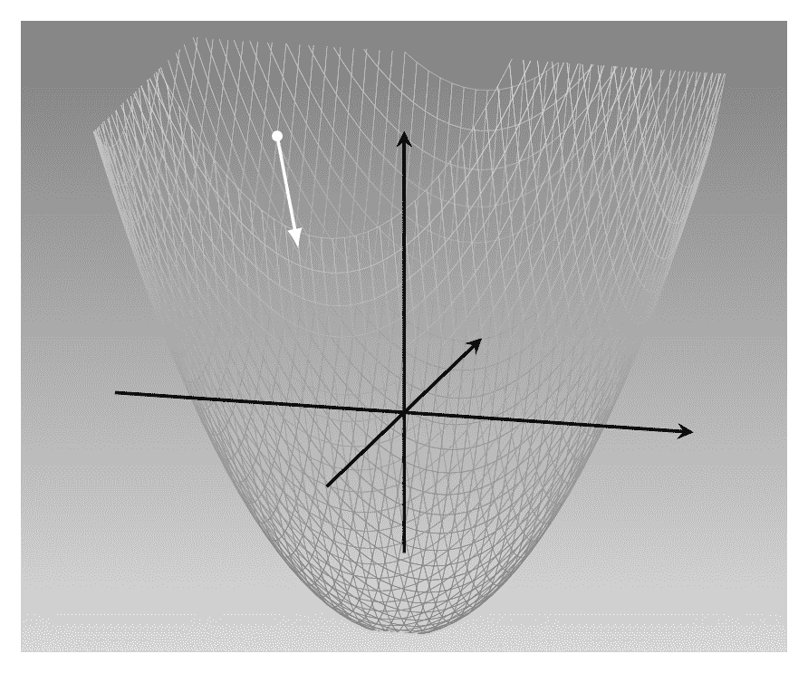
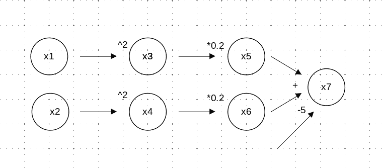

# 4  Autograd

> 原文：[`skeydan.github.io/Deep-Learning-and-Scientific-Computing-with-R-torch/autograd.html`](https://skeydan.github.io/Deep-Learning-and-Scientific-Computing-with-R-torch/autograd.html)

在上一章中，我们看到了如何操作张量，并遇到了可以在它们上执行的一些数学运算的示例。如果这些操作，尽管数量众多，都是 `torch` 核心的全部，你就不会读这本书了。像 `torch` 这样的框架之所以如此受欢迎，是因为你可以用它们做什么：深度学习、机器学习、优化，以及一般的大规模科学计算。这些应用领域中的大多数都涉及最小化某些 *损失函数*。这反过来又涉及到计算函数的 *导数*。现在想象一下，作为用户，你必须自己指定每个导数的函数形式。特别是对于神经网络，这可能会很快变得繁琐！

事实上，`torch` 也不处理也不存储导数的函数表示。相反，它实现了所谓的 *自动微分*。在自动微分中，更具体地说，其常用的 *反向模式* 变体，导数是在通过张量操作图的 *反向传播* 过程中计算和组合的。我们将在下一分钟看看这个例子。但首先，让我们快速回顾一下 *为什么* 我们想要计算导数。

## 4.1 为什么计算导数？

在监督机器学习中，我们有一个 *训练集*，其中我们希望预测的变量是已知的。这是目标，或 *真实值*。我们现在基于一组输入变量，即 *预测变量*，开发和训练一个预测算法。这个训练或学习过程是基于将算法的预测与真实值进行比较，这种比较导致一个数字，它捕捉了当前预测的好坏。提供这个数字是 *损失函数* 的任务。

一旦它知道了当前的损失，算法就可以调整其参数——在神经网络中是 *权重*——以便提供更好的预测。它只需要知道调整它们的方向。这个信息是由 *梯度*，即导数的向量提供的。

例如，我们想象一个看起来像这样的损失函数（图 4.1）：



图 4.1：假设的损失函数（一个抛物面）。

这是一个两个变量的二次函数：$f(x_1, x_2) = 0.2 {x_1}² + 0.2 {x_2}² - 5$。它在 `(0,0)` 处有最小值，这是我们希望到达的点。作为人类，站在由白色圆点指定的位置，观察景观，我们有一个相当清晰的想法如何快速下山（假设我们不怕斜坡）。然而，要计算性地找到最佳方向，我们必须计算梯度。

考虑 $x_1$ 方向。函数相对于 $x_1$ 的导数表明，当 $x_1$ 变化时，其值如何变化。因为我们知道函数的闭式形式，我们可以计算出：$\frac{\partial f}{\partial x_1} = 0.4 x_1$。这告诉我们，当 $x_1$ 增加时，损失增加，以及增加的速度。但我们的目标是让损失*减少*，所以我们必须朝相反的方向前进。

对于 $x_2$ 轴也是如此。我们计算导数（$\frac{\partial f}{\partial x_2} = 0.4 x_2$）。同样，我们想要取导数指向的相反方向。总体来说，这给出了一个下降方向 $\begin{bmatrix}-0.4x_1\\-0.4x_2 \end{bmatrix}$。

描述上，这种策略被称为**最速下降法**。通常被称为**梯度下降法**，它是深度学习中最基本的优化算法。也许不太直观，它并不总是最有效的方法。还有一个问题：我们能否假设在起始点计算出的这个方向，在我们继续下降的过程中仍然是最优的？也许我们最好定期重新计算方向？这类问题将在后续章节中解答。

## 4.2 自动微分示例

既然我们知道为什么需要导数，让我们看看自动微分（AD）是如何计算它们的。

这 (图 4.2) 是我们上述函数在计算图中的表示方式。`x1` 和 `x2` 是输入节点，对应于函数参数 $x_1$ 和 $x_2$。`x7` 是函数的输出；所有其他节点都是中间节点，对于确保正确的执行顺序是必要的。（我们也可以给常数 `-5`、`0.2` 和 `2` 分配它们自己的节点；但既然它们都是常数，我们不太感兴趣，更愿意有一个更简单的图。）



图 4.2：计算图示例。

在反向模式自动微分中，`torch` 实现的自动微分风味，首先发生的事情是计算函数的输出值。这对应于通过图的前向传递。然后，执行反向传递来计算输出相对于两个输入 `x1` 和 `x2` 的梯度。在这个过程中，信息从右向左变得可用，并逐渐积累：

+   在 `x7` 处，我们计算相对于 `x5` 和 `x6` 的偏导数。基本上，要微分方程看起来是这样的：$f(x_5, x_6) = x_5 + x_6 - 5$。因此，两个偏导数都是 1。

+   从 `x5` 开始，我们向左移动以查看它如何依赖于 `x3`。我们发现 $\frac{\partial x_5}{\partial x_3} = 0.2$。在这个时候，应用微积分的链式法则，我们已经知道输出如何依赖于 `x3`：$\frac{\partial f}{\partial x_3} = 0.2 * 1 = 0.2$。

+   从 `x3` 开始，我们迈出了最后一步到达 `x`。我们了解到 $\frac{\partial x_3}{\partial x_1} = 2 x_1$。现在，我们再次应用链式法则，并能够制定出函数如何依赖于其第一个输入：$\frac{\partial f}{\partial x_1} = 2 x_1 * 0.2 * 1 = 0.4 x_1$。

+   类似地，我们确定第二个偏导数，因此，已经可以获取梯度：$\nabla f = \frac{\partial f}{\partial x_1} + \frac{\partial f}{\partial x_2} = 0.4 x_1 + 0.4 x_2$。

这就是原则。在实践中，不同的框架以不同的方式实现反向模式自动微分。我们将在下一节中一窥 `torch` 是如何做到的。

## 4.3 使用 `torch` 的 *autograd* 自动微分

首先，关于术语的快速说明。在 `torch` 中，AD 引擎通常被称为 *autograd*，这也是你在本书的大部分内容中看到它的表示方式。现在，回到任务本身。

要使用 `torch` 构建上述计算图，我们创建“源”张量 `x1` 和 `x2`。这些将模仿我们感兴趣的参数的影响。然而，如果我们像往常一样继续进行，以我们迄今为止的方式创建张量，`torch` 将不会为 AD 准备。相反，我们需要在实例化这些张量时传递 `requires_grad = TRUE`：

```r
library(torch)

x1 <- torch_tensor(2, requires_grad = TRUE)
x2 <- torch_tensor(2, requires_grad = TRUE)
```

*(顺便说一下，这两个张量的值 `2` 是完全任意选择的。)

现在，为了创建“不可见”的节点 `x3` 到 `x6`，我们相应地进行平方和乘法。然后 `x7` 存储最终结果。

```r
x3 <- x1$square()
x5 <- x3 * 0.2

x4 <- x2$square()
x6 <- x4 * 0.2

x7 <- x5 + x6 - 5
x7
```

```r
torch_tensor
-3.4000
[ CPUFloatType{1} ][ grad_fn = <SubBackward1> ]
```

注意，我们只有在创建“源”张量时才必须添加 `requires_grad = TRUE`。图中的所有依赖节点都会继承这个属性。例如：

```r
x7$requires_grad
```

```r
[1] TRUE
```

现在，所有先决条件都已满足，我们可以看到自动微分的工作过程。要确定 `x7` 如何依赖于 `x1` 和 `x2`，我们只需要调用 `backward()`：

```r
x7$backward()
```

*由于这个调用，`$grad` 字段已经在 `x1` 和 `x2` 中被填充：

```r
x1$grad
x2$grad
```

```r
 0.8000
[ CPUFloatType{1} ]
torch_tensor
 0.8000
[ CPUFloatType{1} ]
```

这些是 `x7` 对 `x1` 和 `x2` 的偏导数。按照我们上面的手动计算，两者都等于 0.8，即 0.4 倍的张量值 2 和 2。

我们所说的构建那些端到端导数所需的累积过程呢？我们能否“跟随”端到端导数在构建过程中的变化？例如，我们能否看到最终输出如何依赖于 `x3`？

```r
x3$grad
```

```r
[W TensorBody.h:470] Warning: The .grad attribute of a Tensor
that is not a leaf Tensor is being accessed. Its .grad attribute
won't be populated during autograd.backward().
If you indeed want the .grad field to be populated for a 
non-leaf Tensor, use .retain_grad() on the non-leaf Tensor.[...]

torch_tensor
[ Tensor (undefined) ]
```

字段看起来没有被填充。实际上，虽然它 *必须* 计算它们，但 `torch` 会在它们不再需要时丢弃中间聚合，以节省内存。然而，我们可以要求它保留它们，使用 `retain_grad = TRUE`：

```r
x3 <- x1$square()
x3$retain_grad()

x5 <- x3 * 0.2
x5$retain_grad()

x4 <- x2$square()
x4$retain_grad()

x6 <- x4 * 0.2
x6$retain_grad()

x7 <- x5 + x6 - 5
x7$backward()
```

*现在，我们发现 `x3` 的 `grad` 字段 *确实* 已被填充：

```r
x3$grad
```

```r
torch_tensor
 0.2000
[ CPUFloatType{1} ]
```

对于 `x4`、`x5` 和 `x6` 也是如此：

```r
x4$grad
x5$grad
x6$grad
```

```r
torch_tensor
 0.2000
[ CPUFloatType{1} ]
torch_tensor
 1
[ CPUFloatType{1} ]
torch_tensor
 1
[ CPUFloatType{1} ]
```

还有一件事我们可能感兴趣。我们从“运行梯度”的角度，某种程度上成功地捕捉到了梯度累积过程；但是，关于为了进行累积所需的各个导数，我们该怎么办呢？例如，`x3$grad` 告诉我们输出如何依赖于 `x3` 的中间状态；我们如何从那里到达 `x1`，实际的输入节点？

结果表明，关于这个方面，我们也可以有所了解。在正向传播过程中，`torch` 已经记录下它稍后需要执行的操作来计算各个导数。这个“配方”存储在张量的 `grad_fn` 字段中。对于 `x3`，这为 `x1` 添加了“缺失的链接”：

```r
x3$grad_fn
```

```r
PowBackward0
```

对于 `x4`、`x5` 和 `x6` 也同样适用：

```r
x4$grad_fn
x5$grad_fn
x6$grad_fn
```

```r
PowBackward0
MulBackward1
MulBackward1
```

就这样！我们已经看到了 `torch` 如何为我们计算导数，甚至瞥见了它是如何做到的。现在，我们准备好开始处理我们的前两个应用任务了。

