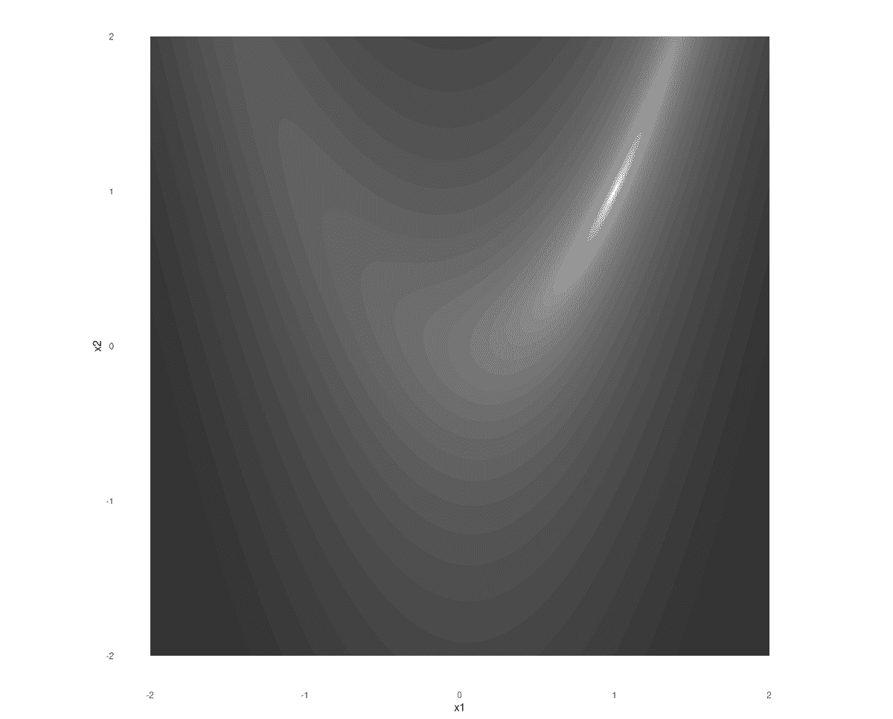

# 5 函数最小化与 autograd

> 原文：[`skeydan.github.io/Deep-Learning-and-Scientific-Computing-with-R-torch/optim_1.html`](https://skeydan.github.io/Deep-Learning-and-Scientific-Computing-with-R-torch/optim_1.html)

在前两章中，我们学习了张量和自动微分。在接下来的两章中，我们暂时放下对`torch`机制的学习，而是找出我们能用我们已经拥有的东西做什么。仅使用张量，并仅由*autograd*支持，我们 already 可以做两件事：

+   最小化一个函数（即执行数值优化），并且

+   构建和训练一个神经网络。

在本章中，我们首先从最小化开始，而将网络留到下一章。

## 5.1 一个优化经典

在优化研究中，*Rosenbrock 函数*是一个经典函数。它是一个关于两个变量的函数；其最小值在`(1,1)`处。如果你看一下它的等高线，你会看到最小值位于一个拉长的、狭窄的谷地中（图 5.1）：



图 5.1：Rosenbrock 函数。

这里是函数定义。`a`和`b`是可以自由选择的参数；我们在这里使用的值是常见的选择。

```r
a <- 1
b <- 5

rosenbrock <- function(x) {
 x1 <- x[1]
 x2 <- x[2]
 (a - x1)² + b * (x2 - x1²)²
}
```

*## 5.2 从零开始的最小化

情景是这样的。我们从某个给定的点`(x1,x2)`开始，并试图找到 Rosenbrock 函数的最小值所在的位置。

我们遵循上一章中概述的策略：计算当前位置的函数梯度，并使用它向相反方向前进。我们不知道要走多远；如果我们走得太快，我们可能会轻易地超过目标。（如果你回顾一下等高线图，你会看到如果你站在最小值东或西的陡峭悬崖上，这种情况可能会很快发生。）

因此，最好是迭代地进行，采取适度的步骤，并在每次都重新评估梯度。

简而言之，优化过程看起来有点像这样：

```r
library(torch)

# attention: this is not the correct procedure yet!

for (i in 1:num_iterations) {

 # call function, passing in current parameter value
 value <- rosenbrock(x)

 # compute gradient of value w.r.t. parameter
 value$backward()

 # manually update parameter, subtracting a fraction
 # of the gradient
 # this is not quite correct yet!
 x$sub_(lr * x$grad)
}
```

*按照现在的写法，这个代码片段展示了我们的意图，但还不完全正确（尚不正确）。它还缺少一些先决条件：张量`x`、变量`lr`和`num_iterations`都没有被定义。让我们确保我们准备好了。`lr`，对于学习率，是每一步要减去的梯度的一部分，`num_iterations`是要采取的步数。这两者都是实验性的。

```r
lr <- 0.01

num_iterations <- 1000
```

*`x`是优化参数，即它是函数的输入，希望最终在过程结束时，将产生可能的最小函数值。这使得它成为我们想要计算函数值导数的张量*。这反过来意味着我们需要用`requires_grad = TRUE`来创建它：

```r
x <- torch_tensor(c(-1, 1), requires_grad = TRUE)
```

*这里的起点`(-1,1)`是任意选择的。

现在，剩下的工作就是对优化循环进行一个小小的修复。在`x`上启用`*autograd*`后，`torch`将记录对该张量执行的所有操作，这意味着每次我们调用`backward()`时，它都会计算所有所需的导数。然而，当我们减去梯度的一部分时，这不是我们希望计算导数的情况！我们需要告诉`torch`不要记录这个操作，我们可以通过将其包裹在`with_no_grad()`中来做到这一点。

还有另一件事我们需要告诉它。默认情况下，`torch`会累积存储在`grad`字段中的梯度。我们需要在每次新的计算中使用`grad$zero_()`将它们归零。

考虑到这些考虑因素，参数更新应该看起来像这样：

```r
with_no_grad({
 x$sub_(lr * x$grad)
 x$grad$zero_()
})
```

*以下是完整的代码，增加了日志语句，使其更容易看到正在发生的事情。

```r
num_iterations <- 1000

lr <- 0.01

x <- torch_tensor(c(-1, 1), requires_grad = TRUE)

for (i in 1:num_iterations) {
 if (i %% 100 == 0) cat("Iteration: ", i, "\n")

 value <- rosenbrock(x)
 if (i %% 100 == 0) {
 cat("Value is: ", as.numeric(value), "\n")
 }

 value$backward()
 if (i %% 100 == 0) {
 cat("Gradient is: ", as.matrix(x$grad), "\n")
 }

 with_no_grad({
 x$sub_(lr * x$grad)
 x$grad$zero_()
 })
}
```

```r
Iteration:  100 
Value is:  0.3502924 
Gradient is:  -0.667685 -0.5771312 

Iteration:  200 
Value is:  0.07398106 
Gradient is:  -0.1603189 -0.2532476 

Iteration:  300 
Value is:  0.02483024 
Gradient is:  -0.07679074 -0.1373911 

Iteration:  400 
Value is:  0.009619333 
Gradient is:  -0.04347242 -0.08254051 

Iteration:  500 
Value is:  0.003990697 
Gradient is:  -0.02652063 -0.05206227 

Iteration:  600 
Value is:  0.001719962 
Gradient is:  -0.01683905 -0.03373682 

Iteration:  700 
Value is:  0.0007584976 
Gradient is:  -0.01095017 -0.02221584 

Iteration:  800 
Value is:  0.0003393509 
Gradient is:  -0.007221781 -0.01477957

Iteration:  900 
Value is:  0.0001532408 
Gradient is:  -0.004811743 -0.009894371 

Iteration:  1000 
Value is:  6.962555e-05 
Gradient is:  -0.003222887 -0.006653666 
```

经过一千次迭代后，我们达到了一个小于 0.0001 的函数值。那么对应的`(x1,x2)`-位置是什么？

```r
x
```

```r
torch_tensor
 0.9918
 0.9830
[ CPUFloatType{2} ]
```

这相当接近真正的最小值`(1,1)`。如果你愿意，可以稍微尝试一下，看看学习率会有什么不同。例如，尝试 0.001 和 0.1，分别。

在下一章中，我们将从头开始构建一个神经网络。在那里，我们要最小化的函数将是一个*损失函数*，即回归问题中产生的均方误差。
